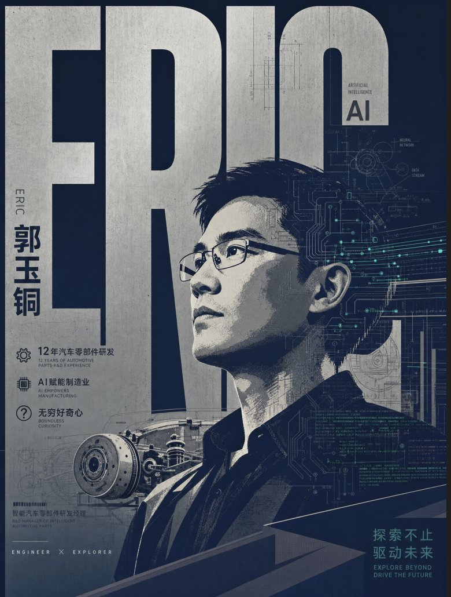

# 作者简介

## 关于作者

**Eric**，AI 探路者，汽车微电机与智能执行器研发工程师，在这一行干了十一年。

他主要研究的方向是：把 AI 用进汽车零部件研发。从电机研发工程师做到创新研发经理，主导过五个以上平台的产品从零到一：微电机、微型齿轮箱、智能执行器、隐藏式门把手。经手过三百多份检测报告，参与过四十多款量产车型。发明专利七项，实用新型三项。

目前的主要产出：

1. 用 Vibe Coding 的方式，自己写了三套智能检测系统，分别用在研发部门、工厂端和质量端，做汽车零部件的 NVH（噪声、振动与声振粗糙度）自动判读。三套系统都没有专业开发团队参与，是他一个人对着 AI 敲出来的。
2. 开发了三十多个在研发流程里可以直接用起来的 Skill 和工作流，覆盖数据整理、报告生成、图纸检查、试验记录这些重复劳动最集中的环节。本书第 4 篇的场景，大部分来自这批工作流。
3. 自建了面向汽车与制造行业的 AI 社区站点：https://qiyanagent.org.cn
4. 开发了从入门到精通的课程与配套视频，并给多家企业与机构做过专业培训，其中脱敏后的课程视频已上线 B 站（哔哩哔哩）。
5. 在微信公众号、知乎、B 站、小红书、抖音等多个平台持续分享自己用 AI 的踩坑与心得。

这些数字不重要。重要的是另一件事：在那十一年里，他所在的行业有一条铁规矩，写进报告的每一个数字，都必须能追到它是从哪一次试验、哪一个样本、经过什么处理得来的。追不到，这个数字就不能用。不是为了好看，是因为一个数字错了，后面可能是召回，是赔钱，是有人受伤。

2025 年底，他开始把 AI 引进日常工作，很快就栽了一个跟头：一份由 AI 生成的材料，格式漂亮，数字合理，在评审会上被人问了一句"这个数是哪来的"，当场答不上来。

那次之后，他把行业里那套"溯源、验收、担责"的规矩搬到了 AI 上，一边用一边记，写了两百多篇实战记录。这本书是那套规矩的完整版。

他不是 AI 专家，也不打算成为 AI 专家。他只是一个对自己的工作成果负责的人，碰巧学会了一套把脏活交出去、同时把判断留给自己的方法。

---

## 找得到他的地方

### 微信公众号「Eric的数字花园」

这本书写完的部分在这里，没写完的部分也在这里。回复「**实战**」可以领取随书的七十二个场景提示词合集，以及案例用的脱敏练习素材。

公众号持续更新的内容：新工具怎么接进工作流、旧方法哪里开始失灵、读者寄来的翻车现场。AI 加汽车零部件行业的交叉内容，主要发在这里。

同名账号也在知乎、B 站（哔哩哔哩）、小红书、抖音上更新。B 站上有脱敏后的课程视频，想先看人再决定买不买这本书的，去那里翻。

### GitHub 开源仓库

**https://github.com/Shun1989/Erics-WorkBuddy-Practice**

本书的全部可复用资产都在这个仓库，MIT 协议：

- 七十二个场景的抄作业模板（提示词、检查清单、验收标准齐全）
- 三十多个可直接安装的 WorkBuddy 技能与工作流
- 书中全部自绘示意图的 SVG 源文件，拿去改就能用
- 翻车案例库：每个场景的已知错误模式与排错记录

开源不是为了显得大方。这本书反复讲"可复现"：一个场景如果你拿去跑不通，那它就只是故事，不是方法。仓库里的东西就是让你跑通的。

### 汽研 Agent 中文社区

**网址：https://qiyanagent.org.cn**

面向汽车与制造行业的 AI 应用者社区。每天整理行业 AI 动态，积累工程场景的真实用法，也收集翻车案例。

如果你在制造业、汽车或者硬件行业，这个社区比公众号更适合你。公众号面向泛职场，社区只聊工程。

---

## 一句话给读者

如果你读完这本书只记住一件事，希望是这句：

**别问 AI 该怎么办，把活给它，然后验收。**

聊天框里的答案转瞬即忘，交付出去的活才作数。这本书教的就是这件事：怎么把活交出去，交得清楚；怎么把结果收回来，收得放心。

---

## 致谢位置

*（留给正式出版时补充：感谢素材整理、案例核实、书稿试读阶段提供帮助的同事与读者，以及开源仓库的早期贡献者。）*
