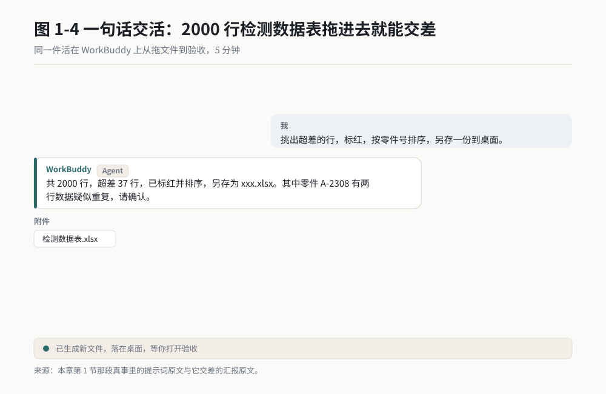
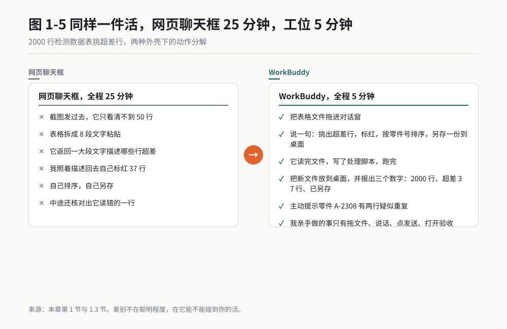
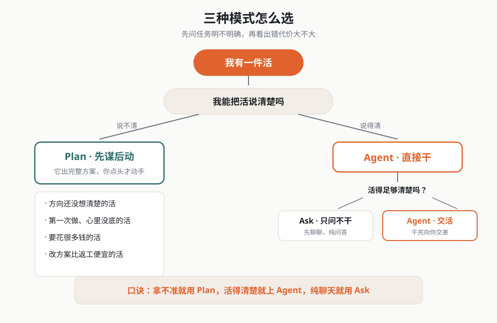
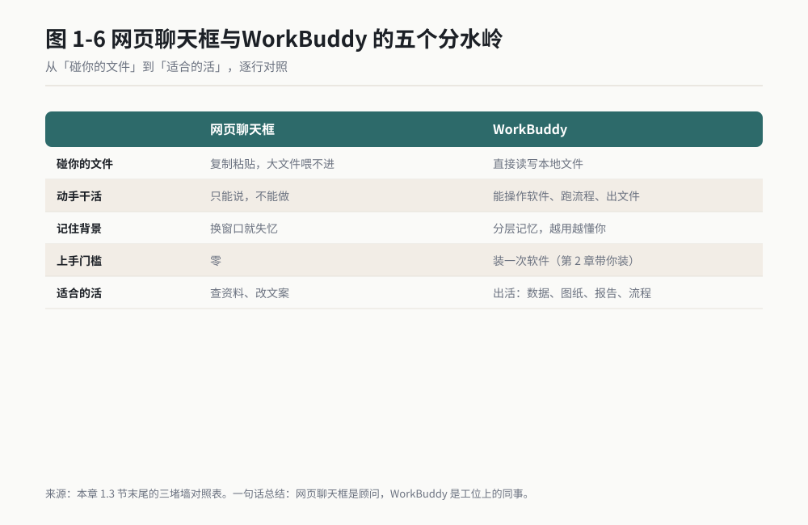
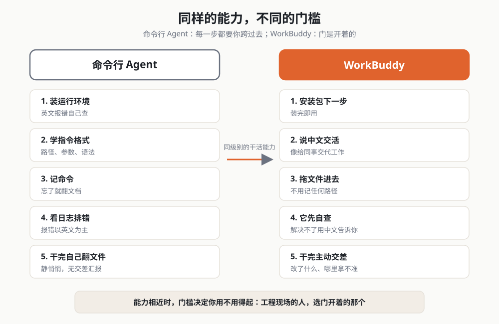
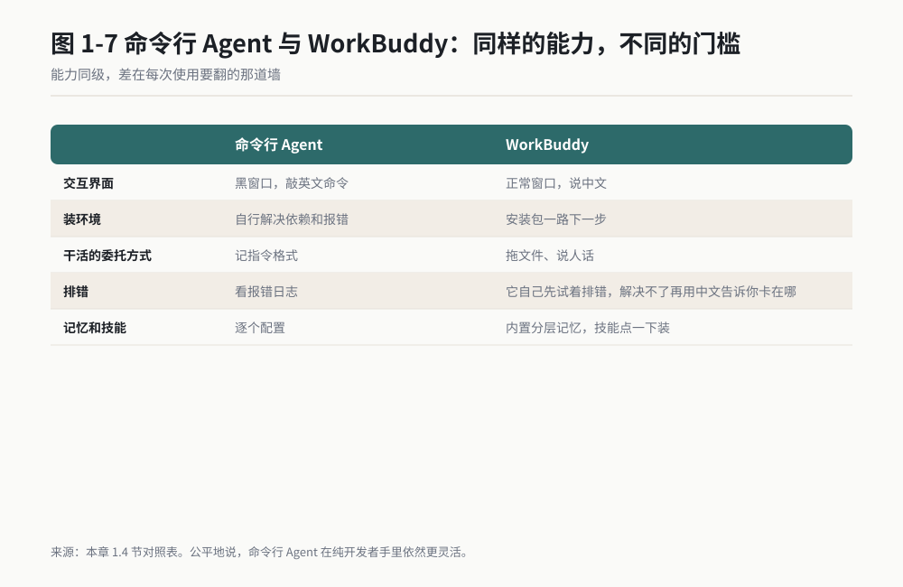
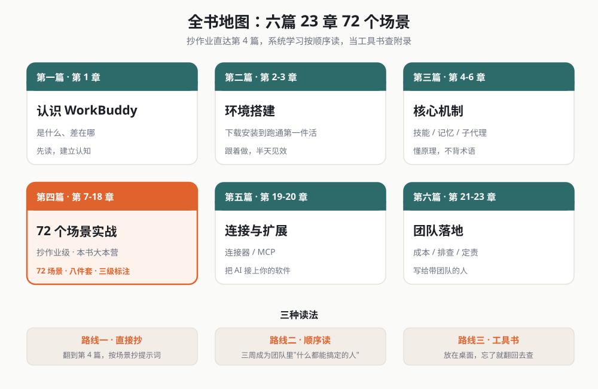
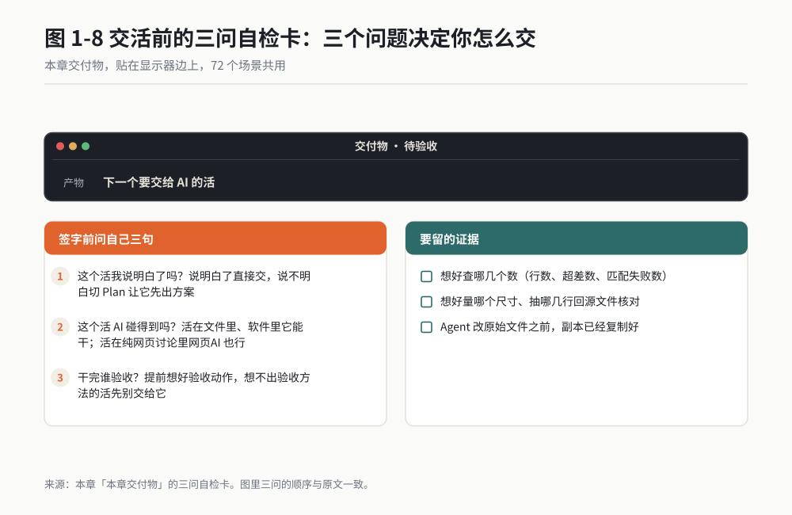

# 第 1 章 它不是聊天框，是工位

> 同一个 AI，装进不同的壳，就是完全不同的东西。

先看一件真事。同一个任务，"把这份 2000 行的检测数据表里超差的行挑出来，标红，按零件号排序，另存一份"，我在三种 AI 工具上各做了一遍。

**网页聊天框**：我把表格截图发过去。它说"好的，我看到了一个数据表格"。截图里 2000 行，它只能看清不到 50 行。我把表格拆成 8 段文字粘贴过去，它给我返回了一大段文字描述哪些行超差。我照着它的文字描述，自己回去把那 37 行标红，自己排序，自己另存。全程 25 分钟，中间还核对出它读错的一行。

**命令行 Agent**：这是一个装在黑色窗口里的 AI，它可以直接读我的文件。我输入指令，它真的去读了表格、真的写出了新文件。全程 3 分钟。但为了走到"输入指令"这一步，我花了一个傍晚：装运行环境、配命令行、学它的指令格式。这些活对程序员来说只要十分钟，对我当时来说每一行英文报错都像一堵墙。

**WorkBuddy**：我打开对话窗口，把表格文件拖进去，说了一句话："挑出超差的行，标红，按零件号排序，另存一份到桌面。"它读完文件，写了处理脚本，跑完，把新文件放到了我的桌面，然后汇报："共 2000 行，超差 37 行，已标红并排序，另存为 xxx.xlsx。其中零件 A-2308 有两行数据疑似重复，请确认。"我打开文件检查了一遍，37 行全对。全程 5 分钟，我亲手做的事只有拖文件、说话、点发送、打开验收。

同一个 AI 底座，三种完全不同的东西。差别不在聪明程度，在**它能不能碰到你的活、能不能把活干完、你用不用得起**。

*作者根据公开资料绘制*

*作者根据公开资料绘制*

这一章就讲清三件事：WorkBuddy 到底是什么；它跟你在网页上用过的 AI 聊天框、极客圈子里的命令行 Agent、开发者手里的开源 Agent 框架，各自差在哪；以及本书 72 个场景怎么用。

## 1.1 先拆掉三个误会

在讲它是什么之前，先把三个最常见的误会拆掉。这三个误会我每一个都亲身犯过。

### 误会一：AI 就是聊天框

大多数人对 AI 的全部印象来自网页聊天：打字、回话、再打字。于是天然觉得 AI 的能力边界就是"会说话"。

聊天只是 AI 的一种外壳。同一个模型，装进网页里是聊天框，装进能操作文件的程序里，它就能读你的表格、写你的报告、跑你电脑上的软件。模型没变，变的是它被允许"动手"的范围。

打个比方：同一位大厨，站在柜台后面只能给你讲解菜谱；你把厨房钥匙给他，他能直接把菜做出来端给你。你过去用的一直是站在柜台后面的大厨。

### 误会二：用 AI 得先学编程

这个误会拦住了最多的人。事实是：让 AI 干活的门槛，最近两年从"会写代码"降到了"会把话说清楚"。

本书第 4 篇 72 个场景里，你需要的全部技能是：打开一个软件、把文件拖进对话窗、用中文把你要的东西说出来、看懂它给你的结果。没有一个场景要求你先学编程。确实有几个地方要装软件、配参数，但每一步都给了照着点的操作步骤，那就是本书存在的意义。

我的同桌是一位干了二十年质量工作的老工程师，比我大十岁，此前打字都用一根手指。他照着本书第 14 章的场景抄了三周，现在部门里供应商数据整理的活有一半是 AI 在干，他负责验收。

### 误会三：AI 说得头头是道，就能信

这是最危险的一个误会，而且越是把 AI 用得好的人越容易犯。

AI 有一类毛病：它会把不知道的东西说得非常笃定，编出一个看起来完全合理的数字、条款、文件名。工程上这叫幻觉，本书第 17 章给它起了个更直白的名字，"AI 的七宗罪"之一。

所以本书从头到尾的态度是：**AI 是干活的，签字的是你。** 它建完模型，你要量一遍关键尺寸；它抓完数据，你要抽查几行对源站；它写完报告，你要核一遍引用。第 18 章会给一套固定的验收动作，照着做，两分钟到十分钟。

不是不信任它。是工程现场的规矩本来如此：谁签字，谁验收。它不能签字，所以你必须验。

## 1.2 WorkBuddy 是什么：一个会干活的工位

一句话定义：**WorkBuddy 是一个装在你电脑上的 AI 工作台，它能读你的文件、操作你的软件、记住你的事，你用说中文的方式把活交给它，它干完向你交差。**

拆开讲，这句话里有四个关键词。

### 关键词一：装在你电脑上

它不是网页，是装在你 Windows 或 Mac 电脑上的一个软件。这意味着它有权限碰你电脑里的东西：文件夹、Excel、CAD、浏览器、命令行工具。网页聊天框碰不到这些，这是它跟网页版最根本的区别，后面 1.3 节细讲。

"装在本地"还有一层含义：你的文件不需要上传到某个网页再下载回来。表就在你桌面上，改完还在你桌面上。

### 关键词二：能读文件、操作软件、记住你的事

这三件事是它"能干活"的底气，本书第 3 篇会用三章把它们讲透，这里先混个脸熟：

- **读文件、写文件**：Word、Excel、PDF、代码、图片，拖进对话窗它就能处理，处理结果可以直接存回你的文件夹。
- **操作软件**：通过一套叫 MCP 的"插座"机制（第 19 章专讲），它能驱动你电脑里的其他软件干活，比如让 SOLIDWORKS 按它的指令建模、让浏览器替你查数据。
- **记住你的事**：它有三层记忆。你告诉过它的偏好、你的项目背景、你们团队的习惯，它会记住，下次不用重新自我介绍。第 6 章讲记忆。

### 关键词三：用说中文的方式交活

你不需要学任何指令语法。把活用中文说出来就行，就像给新来的实习生交代工作。说不清楚也没关系，它会反问你，问清了再动手。

但"说清楚"本身是一门手艺。同样一个活，两种交法，结果天差地别。本书花了大量篇幅教你"怎么把活说清楚"，第 4 篇每个场景都附了可以直接抄的交活话术。

### 关键词四：三种模式

这是你打开 WorkBuddy 后遇到的第一个岔路口。它有三种干活的方式，你可以理解为给这位同事的三种委托方式：

| 模式 | 你说什么 | 它做什么 | 适合什么时候用 |
|---|---|---|---|
| **Ask（问）** | "帮我看看这份报告讲了什么" | 只读、只回答，不动你任何文件 | 拿不准、先聊聊、纯问答 |
| **Plan（谋）** | "我想把月度检测数据做成一份汇报" | 先给你一份完整方案，等你点头才动手 | 活比较大、方向还没想清楚 |
| **Agent（干）** | "把这份表格按附件要求整理好发我" | 直接读写文件、跑程序、干完交差 | 任务明确、直接交活 |

选模式的口诀只有一句：**拿不准就用 Plan，活得清楚就直接 Agent，纯聊天就 Ask。** 拿不准的时候永远可以退回 Plan，让它先给你看方案。本书 72 个场景里，标了 ★★★ 的实测场景全部给了明确的模式建议，跟着抄就行。

## 1.3 对比一：跟网页聊天框比，隔着三堵墙

网页 AI（就是你登录个网站直接聊的那种）不是不好，它免费、顺手、开箱即用，查资料、改文案、翻译，它依然是好工具。问题出在你要干的是工程现场的活。

从网页聊天框到 WorkBuddy，隔着三堵墙。每一堵墙，都是我拿真实加班时间量出来的。

### 第一堵墙：文件墙

网页版碰不到你电脑里的文件。你想让它处理一份表格，得先复制内容粘贴过去；表格太大，就得截图，截不清楚就得拆成八段。第 1 章开头那次 25 分钟的"挑超差行"，光是把 2000 行数据喂进去就花了一半时间。

WorkBuddy 直接读文件。拖进去，完事。2000 行和 20 行，对它来说没有区别，反正它不是用眼睛看的。

### 第二堵墙：动手墙

网页版从头到尾只能说话。它能告诉你"第 47 行到 52 行超差"，但标红要你回去自己标。

WorkBuddy 能直接动手：写文件、跑脚本、操作其他软件。第 12 章有个场景我印象很深：五家供应商的资质数据散在五个门户，网页版 AI 帮不了你，因为它登不进那些门户。WorkBuddy 用你已登录的浏览器替你翻页、抄数据、填表格，四十分钟干完你两晚的活。

### 第三堵墙：记性墙

网页版的记忆，取决于你开没开历史记录，而且换一个对话窗口它就"失忆"，你要重新交代一遍背景："我们公司是做汽车零部件的，我们部门负责……"

WorkBuddy 有分层记忆（第 6 章细讲）：你的身份、项目背景、常用格式，它记在长期记忆里。今天交代过"我们报告的表头格式照 2025 版"，下个月它还记得。

三堵墙合起来就是一张对比表：

*作者根据公开资料绘制*

| | 网页聊天框 | WorkBuddy |
|---|---|---|
| 碰你的文件 | 复制粘贴，大文件喂不进 | 直接读写本地文件 |
| 动手干活 | 只能说，不能做 | 能操作软件、跑流程、出文件 |
| 记住背景 | 换窗口就失忆 | 分层记忆，越用越懂你 |
| 上手门槛 | 零 | 装一次软件（第 2 章带你装） |
| 适合的活 | 查资料、改文案 | 出活：数据、图纸、报告、流程 |

一句话总结这一节：**网页聊天框是顾问，WorkBuddy 是工位上的同事。顾问出主意，同事交活。**

## 1.4 对比二：跟命令行 Agent 比，差在门槛

2025 年起，技术圈流行一类"命令行 Agent"：装在黑色窗口里，能读写文件、执行命令，能力上跟 WorkBuddy 的 Agent 模式是同一级别。开源社区里这类工具很多，都很强。

那为什么本书不教你用它们？因为门槛。

我第一次装一个命令行 Agent，花了一整个傍晚。装运行环境，命令行里敲英文指令，报错，搜索报错，再敲，再报错。最后跑通了，我发现真正的拦路虎不是第一次安装，是**每一次使用**：它的世界是英文命令、文件夹路径、配置文件。对写程序的人来说这是母语，对工程现场的人来说这是每天上班先翻墙。

WorkBuddy 把同样的能力装进了一个正常的桌面软件里：

*作者根据公开资料绘制*

| | 命令行 Agent | WorkBuddy |
|---|---|---|
| 交互界面 | 黑窗口，敲英文命令 | 正常窗口，说中文 |
| 装环境 | 自行解决依赖和报错 | 安装包一路下一步 |
| 干活的委托方式 | 记指令格式 | 拖文件、说人话 |
| 排错 | 看报错日志 | 它自己先试着排错，解决不了再用中文告诉你卡在哪 |
| 记忆和技能 | 逐个配置 | 内置分层记忆，技能点一下装 |

还有一点值得单独说：命令行 Agent 干完活，通常静悄悄的，你得自己去翻它改了哪些文件。WorkBuddy 干完会向你汇报：干了什么、改了哪些文件、哪里它拿不准需要你确认。这个"交差"的习惯，对不盯着屏幕的人来说差别巨大。

公平地说，命令行 Agent 在纯开发者手里依然更灵活。如果你是程序员，两者都可以用。但本书的读者是工程现场的人，你们要的是把活干完，不是把机器玩明白。

## 1.5 对比三：跟开源 Agent 框架比，差在拼装成本

第三类是开源 Agent 框架：把大模型、工具调用、记忆管理这些零件全部公开，开发者自己拼装出一个专属 AI 助手。2026 年这类框架非常成熟，社区里全是漂亮的多智能体演示。

这类框架的能力上限最高，你可以完全自定义它的行为。但拼装意味着什么，你大概已经猜到了：

- 每个零件都要自己理解、自己接线；
- 出了错要自己排查，报错信息以英文为主；
- 版本更新频繁，上个月跑通的流程这个月可能要改。

我拆过一个社区里口碑很好的框架，搭一个"自动整理数据表"的最小流程，对开发者大概半天，对工程现场的人，保守估计两周，而且两周之后你维护它的成本还在。

WorkBuddy 的思路是反过来的：这些零件（记忆、技能、工具连接、多代理协作）全部内置、默认装好，你直接用成品。代价是你失去了底层自定义的自由，好处是你今晚就能开始干活。

| | 开源 Agent 框架 | WorkBuddy |
|---|---|---|
| 定位 | 开发者拼装的零件库 | 成品工位 |
| 上手时间 | 周（工程现场的人） | 半小时 |
| 自由度 | 任意定制 | 框架内扩展（技能、连接器、MCP） |
| 维护 | 自己养 | 官方更新 |
| 适合谁 | 有开发团队的企业 | 个人与中小团队 |

顺带回应一个读者问过我的问题："开源免费，WorkBuddy 要花钱，凭什么？"我的答案是算两笔账。一笔是显性的：软件订阅费。另一笔是隐性的：学习成本、拼装时间、维护精力。我自己的记录是，用 WorkBuddy 的第一年，它在数据整理、报告生成、资质核查上替我省出的时间，按我最保守的时薪折算，超过订阅费一个数量级。你的活越值钱，这笔账越好算。

## 1.6 本书的地图：六篇、23 章、72 个场景

最后交代全书的结构，方便你规划自己的读法。

**第一篇 认识 WorkBuddy**（本章）：搞清楚它是什么、跟其他工具差在哪。

**第二篇 环境搭建与快速上手**（第 2-3 章）：下载安装、跑通第一个任务、学会三种模式的日常切换。跟着做，半天内你会干成第一件真活。

**第三篇 核心机制深度理解**（第 4-6 章）：技能、记忆、子代理三大机制。这篇是"原理"，但全部用大白话和工程类比讲，第 4 章还有一组真实的技能自进化实验数据：一个技能从 0.7 分迭代到更高分的过程，每一代改了什么、错在哪。

**第四篇 72 个场景实战**（第 7-18 章）：本书的大本营，12 章 72 场景，覆盖通用办公、知识管理、需求定义、造型与几何（含驱动 SOLIDWORKS 建模出图的方向盘案例）、电子软件与仿真、浏览器与桌面操控、设计审核、供应链、NVH 与试验、让 Agent 不跑偏、AI 的七宗罪、验收与责任。每个场景都是八件套：痛点、前置条件、步骤、提示词、预期输出、翻车点、验收标准、变体。

**第五篇 连接与工具扩展**（第 19-20 章）：连接器与 MCP，让 AI 碰到你的邮箱、文档、数据库和各类专业软件。

**第六篇 团队落地、成本与排查**（第 21-23 章）：从个人用到团队用的方法、成本怎么算、出问题怎么救。

每个场景都带一个可信度标注：**★★★** 表示我本机完整跑过、有截图和数据；**★★** 表示流程跑通过；**★** 表示来自公开调研，注明了来源。我不虚标，你用的时候心里有数。

## 小白词典

**AI 模型**：听得懂人话、能推理能生成的计算机程序。"大模型"指参数极多、能力更强的那一代。它只负责"想"，负责"干"的是装着它的软件。

**Agent（智能体）**：不只回答问题，还能自己规划步骤、调用工具、把一件事干完的 AI 程序。聊天框回答你，Agent 交活给你。

**WorkBuddy**：本书主角，一个装在电脑上的 AI 工作台，Agent 能力 + 三种模式 + 记忆 + 技能 + 连接器。

**提示词**：你对 AI 说的话。说得更清楚，活就干得更好。本书第 4 篇每个场景都附成品提示词，可以直接抄。

**技能（Skill）**：给 WorkBuddy 预装的"岗位手册"。装一个技能，它就多会一类活，比如"把 Markdown 排版成 PDF"。

**连接器**：让 WorkBuddy 接上外部服务（邮箱、文档、代码仓库）的插头。第 19 章讲。

**MCP**：一种让 AI 操控其他软件的通用"插座"标准。WorkBuddy 靠它驱动 SOLIDWORKS、浏览器等软件。第 19 章讲。

**幻觉**：AI 把不知道的东西说得煞有介事。第 17 章主角。

## 你的岗位怎么用

**设计工程师**：你先看第 10 章。方向盘案例从"一句话进模型"到"出二维图纸"全程拆解，先抄场景 19（简单零件建模），再进 20/21。

**试验工程师**：直接翻第 15 章 NVH 与试验和第 12 章场景 35（远程盯台架）。试验数据整理和值班交接是抄作业见效最快的两类活。

**质量工程师**：第 13 章设计审核与风险、第 14 章供应链数据整理。第 17 章"AI 的七宗罪"建议全文读两遍，它是给你的验收武器库。

**采购 / 供应商管理**：第 12 章场景 31-33（浏览器自动化查资质与报价）和第 14 章。这是全书省时最多的场景组，我的记录是每月省两个工作日。

**项目经理**：先读本章和第 9 章（需求与项目定义）。你的杠杆点是把"周报、风险表、跨部门纪要"这三样交出去，第 7 章有现成模板。

**研发主管**：第 21-23 章是为你的决策写的。团队怎么推、预算怎么算、出事了怎么定责。第 18 章的验收与责任框架建议亲自读，这是你要向下传达的规矩。

## 本章交付物

**三问自检卡**：以后每次想把活交给 AI，先问自己三个问题，答案直接决定你怎么交。

1. **这个活我说明白了吗？** 说明白了：直接 Agent 模式交活。说不明白：切 Plan 模式，让它先出方案，你来选。
2. **这个活 AI 碰得到吗？** 活在文件里、软件里：WorkBuddy 能干。活在纯网页浏览和讨论里：网页 AI 也行，不必杀鸡用牛刀。
3. **干完谁验收？** 提前想好验收动作（查哪几个数、量哪几个尺寸），干完立刻验。想不出验收方法的活，先别交给它。

把这三问贴在显示器边上。它们是全书 72 个场景共用的大前提。

*作者根据公开资料绘制*

## 本章金句

> 同一个 AI，装进聊天框是顾问，装进工位是同事。

> AI 的价值不在聊天，在替你把一整件事干完。

> 用 AI 的门槛，已经从"会写代码"降到"会把话说清楚"。

> 放手让 AI 干，收手由你验收。两个半句缺一不可。

> 拿不准就用 Plan，活得清楚就上 Agent。

> 抄会一个场景，胜过读完十篇方法论。

---

*（下一章：装好它。从下载到跑通第一个任务，每一步都有截图，半小时后你的工位开工。）*
