# 第 2 章 装好它，半小时跑通第一件活

> 装完软件只占这件事的十分之一。剩下九成，是让它知道该动谁的文件。

## 开场：老周装过三次

去年十一月，一个周三下午三点。质量部的老周端着保温杯站在我工位边上，看我把一个 Excel 拖进窗口、敲了一句话、起身去接了杯水。他还没走开，文件已经改好了，躺在我桌面上。

"这玩意儿我装过三次。"他说。

第一次是前年春天。他在技术论坛上看到一个能直接处理本地表格的命令行 AI 工具，帖子标题写着"十分钟上手"。他照着教程装运行环境，装到第三步弹了一行英文错误，去搜，搜出来的答案让他改一个配置文件。他改了，还是报错。那天晚上他搞到十一点半，最后把那个文件夹整个删掉。

第二次是去年三月，一个开源 Agent 框架。他跑了两个晚上，卡在一个依赖包上，缺一个组件。他给我看过他的浏览器历史记录，同一个报错页面他打开了七次。

第三次是去年夏天。他放弃了本地工具，回到网页聊天框。每个月做供应商数据汇总，他把表格拆成十段文字往里贴，贴完自己核对。他说那是他用 AI 用得最久的一段时间，也是最累的一段时间。

"你现在这个，装上花了多久？"他问。

我打开自己的记录给他看：下载安装包 4 分钟，一路点下一步 3 分钟，登录 2 分钟。加起来不到十分钟。

真正花时间的是后面那段。我新建了一个专属工作目录，花了 5 分钟；把不该让它碰的目录列了个清单，花了 10 分钟；第一次把活交出去、等它干完、逐行验收，花了 25 分钟。

"所以我今天该先干什么？"他问。

我说："先把软件装上。然后别急着干活，先把该圈的地圈好。"

这一章就是那天下午我陪他走的那四十分钟。跟着做完，你会带走两样东西：一个能干活的软件，和一个你自己验过的成果。

## 2.1 下载与安装

### 去哪下

只从官方渠道下。这不是一句废话，我看到过有人从软件下载站下到被改过的安装包，装上之后电脑开始弹广告。

判断真假的三条，下之前花 30 秒看一眼：

| 检查项 | 怎么查 | 对得上才装 |
|---|---|---|
| 域名 | 看下载页网址的主域名，一个字母都不差 | 主域名与官网一致 |
| 文件大小 | 装之前看属性里的字节数 | 跟官网标注的对得上 |
| 数字签名 | Windows 上右键安装包看属性，Mac 上第一次打开会验证开发者 | 签名人是官方主体 |

> 【待补：官网地址与下载入口按钮名称，以实际版本为准】

### 选什么版本

版本这件事，我的原则只有一条：**要干活的人装稳定版。**

| 你的情况 | 选哪个 | 理由 |
|---|---|---|
| 今天就要开始干活 | 稳定版 | 更新慢一点，但不会中途崩 |
| 想跟着本书做完整流程 | 稳定版，且不低于本书写作时的版本 | 老版本可能没有本书讲的模式切换和技能 |
| 公司电脑不给管理员权限 | 走公司内部的软件中心，或找 IT 报装 | 硬装往往装到一半卡在权限上 |
| 我就是要尝鲜 | 预览版 | 出问题自己兜着，别在交付节点前换 |

我自己踩过一次。有一年我在一个交付节点前一周把软件升到了预览版，结果那周有个技能的调用方式变了，我攒了三个月的流程跑不通。后来我给自己定了条规矩：预览版只装在另一台机器上。

### Windows 与 Mac 的差异

差异不大，但有五处会让人卡住：

| 项 | Windows | Mac |
|---|---|---|
| 安装包形态 | 常见的是 exe 或 msi | 常见的是 dmg |
| 第一次打开 | 可能弹用户账户控制，点允许 | 可能要在系统设置的隐私与安全里点"仍要打开" |
| 路径写法 | `C:\Users\你的名字\...` | `/Users/你的名字/...` |
| 文件编码 | 老系统和国产软件生成的 csv 常是 GBK | 一般是 UTF-8 |
| 命令行 | PowerShell 或命令提示符 | 终端 |

编码这一行请你记一下。中文 Windows 上，Excel 另存出来的 csv 默认是 GBK 编码，交给 AI 处理时经常变成一堆问号。本书后面所有涉及 csv 的场景，我都会提醒你先确认编码。

### 装完第一眼看到什么

通用原则：装完第一次启动，你会看到一个大窗口，窗口左侧是会话列表，中间是对话区，上方或下方有模式切换的入口，某一侧有文件区。

具体到每个按钮叫什么、在第几行第几列，各版本会有出入，我不替你猜。

> 【待补：首次启动的界面布局、按钮名称与菜单路径，以实际版本为准】

装完先别急着问它问题。做下面这张清单里的三件事，顺序不能乱。

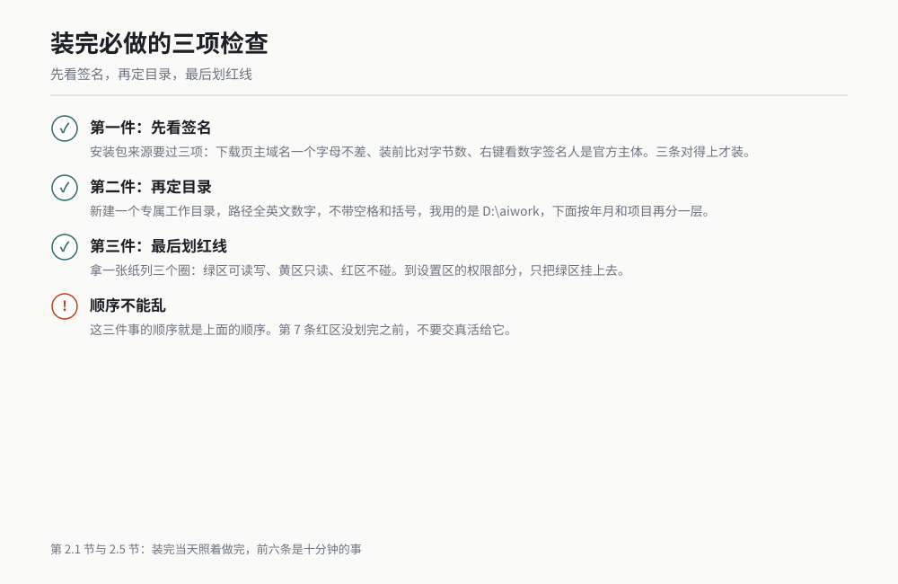

*作者根据公开资料绘制*

## 2.2 第一次打开的五个区域

第一次打开一个陌生软件，最省事的办法是先给它分区。WorkBuddy 的窗口可以分成五块，你今天只需要真正认识其中两块。

| 区域 | 它大概在哪 | 大白话是干什么 | 你今天要做的一件事 |
|---|---|---|---|
| 对话区 | 窗口正中，最大的一块 | 你说活、它交差的地方。文件可以直接拖进来 | 拖一个文件进来，确认它能识别 |
| 模式切换 | 对话输入区附近，或顶部 | 决定它是"只答""先给方案"还是"直接干完" | 找到它，切到 Ask 试一句 |
| 文件区 | 某一侧的面板 | 它当前能看到哪些文件夹，动了哪些文件 | 确认它看到的是你刚建的工作目录 |
| 设置区 | 窗口角落的齿轮、或菜单里 | 账号、模型、权限、工作目录都在这里 | 只改一件事：工作目录 |
| 任务状态区 | 对话区上方或下方的一条 | 它正在干什么、跑了几步、卡在哪一步 | 干活的途中瞄一眼，看它是不是在转圈 |

一句话记住这五个区域：**对话区是嘴巴和耳朵，模式切换是委托书，文件区是它手能伸到的范围，设置区是规矩，任务状态区是进度条。**

五种区域里，你今天只需要会做三件事：在对话区说话、在模式切换里选 Ask、在设置区改工作目录。文件区和任务状态区，等 2.4 节你把活交出去的时候自然会用到。

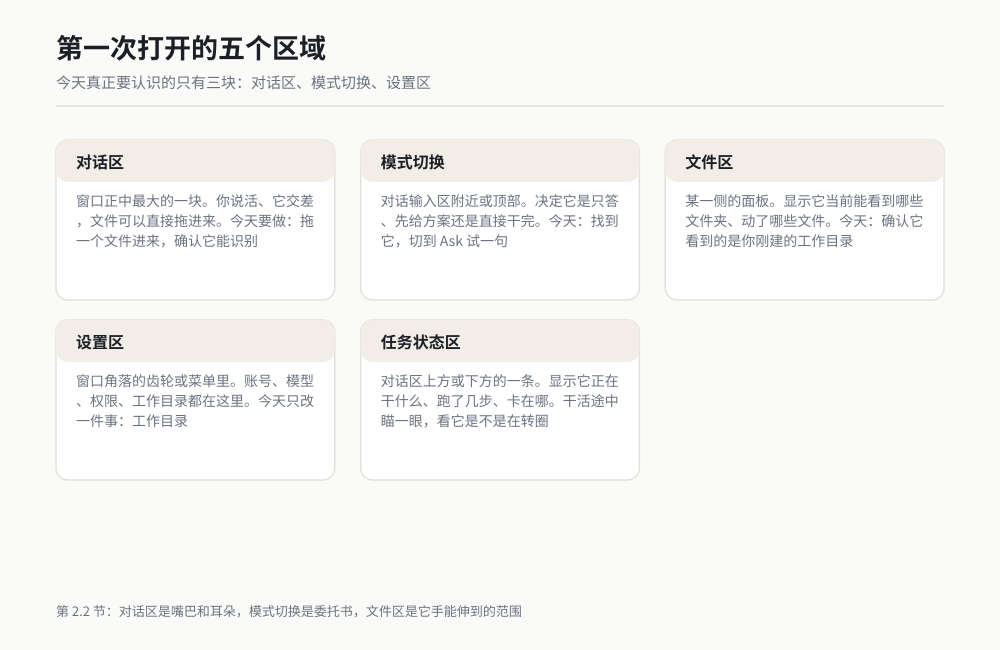

*作者根据公开资料绘制*

## 2.3 五分钟第一件活：让它读一个文件并汇报

第一件活我建议你选最没有风险的一种：**只读，不改。** 你给它一个文件，它读完了跟你说这个文件讲了什么。你的文件一个字节都不会变。

开工前准备：

1. 找一份你熟悉内容的文件。熟悉很重要，你得能判断它说得对不对。我第一次用的是我自己的一份周报草稿，8 页 Word。
2. 模式切到 Ask。这个模式只回答、不动手，练手阶段用它最安全。
3. 把文件拖进对话区，或者在对话区里把它所在的路径打出来。

可复制提示词：

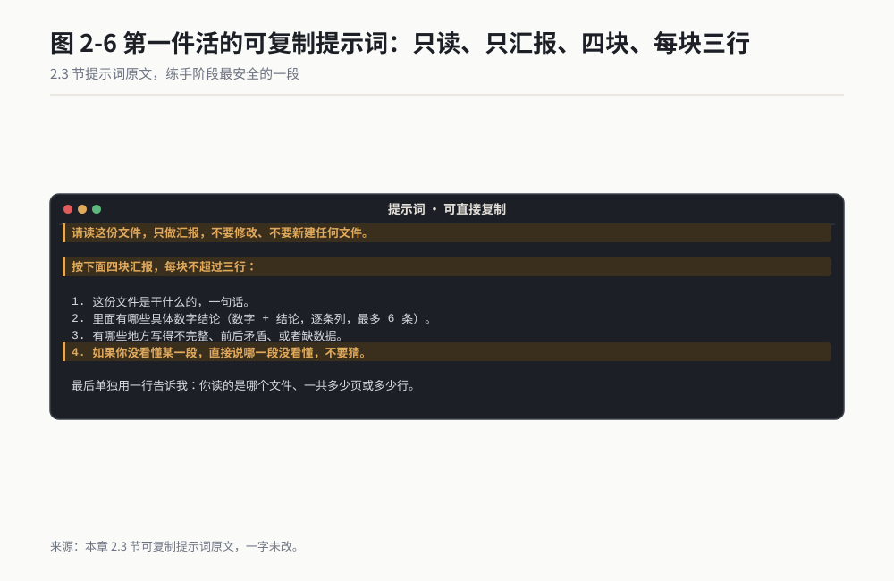

*作者根据公开资料绘制*

```
请读这份文件，只做汇报，不要修改、不要新建任何文件。

按下面四块汇报，每块不超过三行：

1. 这份文件是干什么的，一句话。
2. 里面有哪些具体数字结论（数字 + 结论，逐条列，最多 6 条）。
3. 有哪些地方写得不完整、前后矛盾、或者缺数据。
4. 如果你没看懂某一段，直接说哪一段没看懂，不要猜。

最后单独用一行告诉我：你读的是哪个文件、一共多少页或多少行。
```

我跑这份的时候（一份 8 页的周报草稿），它返回的样子大致是这样：

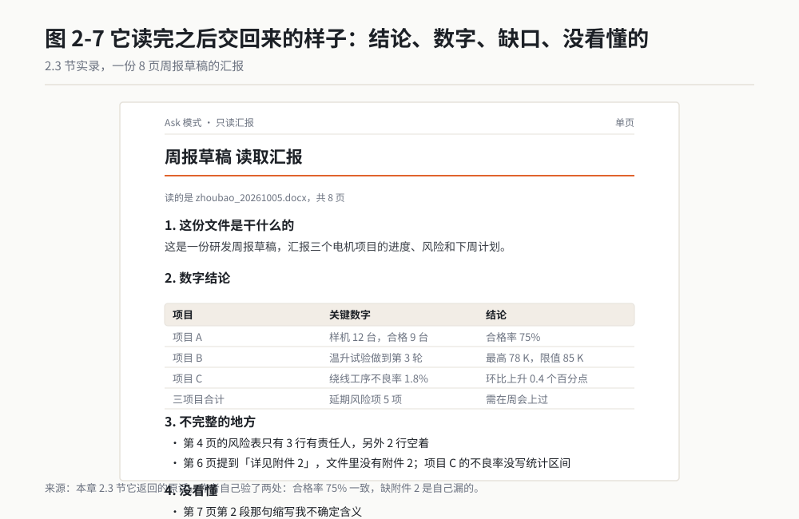

*作者根据公开资料绘制*

> 1. 这是一份研发周报草稿，汇报三个电机项目的进度、风险和下周计划。
>
> 2. 数字结论：
>    - 项目 A：样机 12 台，合格 9 台，合格率 75%
>    - 项目 B：温升试验做到第 3 轮，最高 78 K，限值 85 K
>    - 项目 C：绕线工序不良率 1.8%，环比上升 0.4 个百分点
>    - 三项目合计延期风险项 5 项
>
> 3. 不完整的地方：第 4 页的风险表只有 3 行有责任人，另外 2 行空着；第 6 页提到"详见附件 2"，文件里没有附件 2；项目 C 的不良率没写统计区间。
>
> 4. 没看懂：第 7 页第 2 段那句缩写我不确定含义。
>
> 读的是 zhoubao_20261005.docx，共 8 页。

这段回复我验了两处。合格率 75% 跟我自己算的一致；"缺附件 2" 这条是我自己漏了、它替我抓出来的。第二处让我当天就把这份草稿定为"必须用 AI 过一遍"。

为什么我强调要用你熟悉的文件？因为你得有能力判它说得对不对。我第一次给的一个文件是我自己写的周报，它说"第 6 页提到附件 2 但文件里没有"，我一眼就确认这是真的，它替我抓到了我自己的疏漏。换一份我不熟的文件，它说什么我都只能点头，那这次练习就白做了。

拿不准选什么文件的话，按这个顺序挑：你上周写的东西，你昨天改过的东西，你手边正要用的东西。不要挑别人的文件，也不要挑带客户信息的机密件，第一次练习不值得冒这个险。

判断点只有一个：**它报的文件名、页数、行数，跟你自己看到的对得上。** 对不上，说明它根本没读进去，或者读错了文件。这个动作两秒钟，但它能救你后面所有的活。

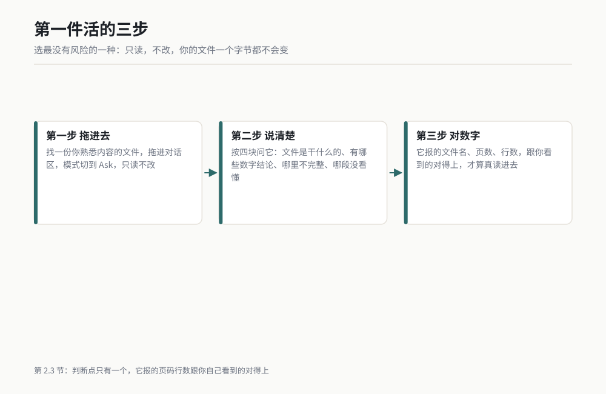

*作者根据公开资料绘制*

## 2.4 半小时第一件真活：整理一份乱表格 ★★★

前面那件活它只读不动手，你拿到的还是一段文字。这一节我们让它真的改文件。这是本章的重点，也是全书的第一个八件套。

### 2.4.1 一句话背景

供应商 A 厂每月发来一份绕线工序的检测记录，1,286 行，列是随手加的，表头占两行还带合并单元格，数值里混着单位，日期有三种写法，中间夹着空行。我手工整理过一次，掐表 23 分钟，事后还发现漏了 4 行。交给 WorkBuddy，从拖文件到验完，14 分钟，我亲手做的事只有三件：拖文件、说话、验结果。

### 2.4.2 名词小词典

| 名词 | 大白话 | 类比 |
|---|---|---|
| 表头 | 表格最上面那几行，说明每一列是什么 | 货架上的标签 |
| 合并单元格 | 一个格子横跨了好几个格子 | 一张标签压住了三个抽屉 |
| 脏数据 | 格式不统一、缺值、混进多余字符的数据 | 刚从地里拔出来、还带泥的萝卜 |
| 编码 | 电脑存文字的规则。规则不一致就显示成乱码 | 两个人说不同的方言 |
| 透视 | 按某一列分组求和、计数 | 把一堆小票按商品名归类算总额 |
| csv | 一种纯文本表格格式，逗号分隔 | 去掉所有花样的纯文字账单 |

### 2.4.3 开工前准备

1. 新建一个专属工作目录。我用的是 `D:\aiwork\2026-10-winding`。

   目录名用英文和数字，不要带空格和括号，路径里的空格是很多莫名其妙报错的来源。
2. 把原始文件复制一份进去，**原件留在原地不要动**。这条是死规矩：AI 永远只碰副本。
3. 关掉打开着这个文件的 Excel。文件被 Excel 占用的时候，别的程序写不进去。
4. 模式切到 Agent。这一节要它动手，Ask 模式不会改文件。
5. 先看一眼原始文件的行数和列数，记在纸上。这是你验收用的对照数字。

### 2.4.4 操作步骤

**第一步**：切到 Ask 模式，让它先看，不动手。这一步我强烈建议不要省。

**第二步**：看它的汇报，确认它理解对了表头和脏在哪。理解错了就在这一步纠正，比等它改完 1,286 行再返工便宜得多。

**第三步**：切回 Agent 模式，把第二轮提示词发过去，让它动手。

**第四步**：盯着任务状态区。它会显示正在读文件、在写处理脚本、在跑。这一步通常几十秒到两三分钟。

**第五步**：它交差后会报一堆数字。拿这些数字跟你纸上记的对照。

**第六步**：打开新文件，抽查 5 行。抽查哪 5 行有讲究，见 2.4.7。

第六步之前，如果任务状态区转圈超过三分钟，不要干等。发一句："现在卡在哪一步，把已经完成的部分先告诉我。"它通常会回"脚本写到一半，卡在某个库的调用上"。这种情况八成是文件太脏或者格式特殊，让它换成更保守的做法重来一次，比让它自己死磕快。我有一次等了七分钟，最后它说做不了；同样的事，我在第三分钟打断它、换了个说法，两分钟就跑完了。

### 2.4.5 可复制提示词

第一轮，Ask 模式，只读不动手：

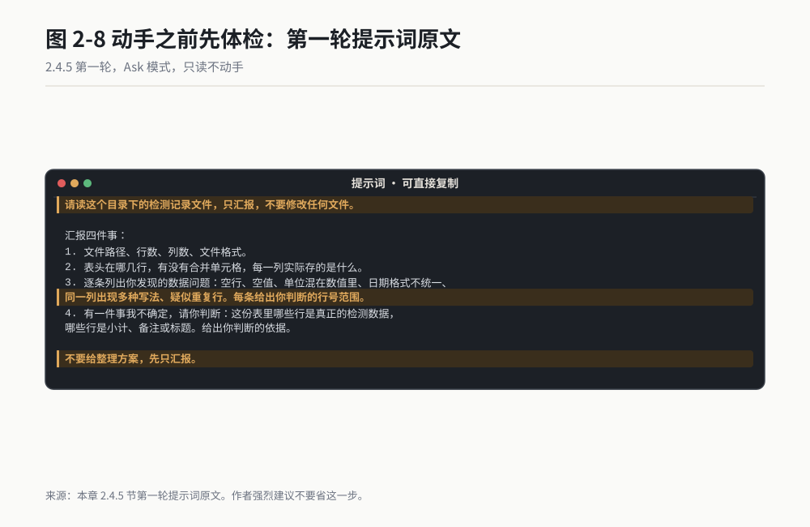

*作者根据公开资料绘制*

```
请读这个目录下的检测记录文件，只汇报，不要修改任何文件。

汇报四件事：
1. 文件路径、行数、列数、文件格式。
2. 表头在哪几行，有没有合并单元格，每一列实际存的是什么。
3. 逐条列出你发现的数据问题：空行、空值、单位混在数值里、日期格式不统一、
   同一列出现多种写法、疑似重复行。每条给出你判断的行号范围。
4. 有一件事我不确定，请你判断：这份表里哪些行是真正的检测数据，
   哪些行是小计、备注或标题。给出你判断的依据。

不要给整理方案，先只汇报。
```

第二轮，Agent 模式，让它动手。把方括号里的内容换成你自己的：

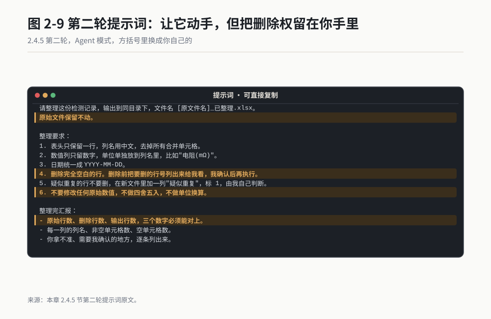

*作者根据公开资料绘制*

```
请整理这份检测记录，输出到同目录下，文件名 [原文件名]_已整理.xlsx。
原始文件保留不动。

整理要求：
1. 表头只保留一行，列名用中文，去掉所有合并单元格。
2. 数值列只留数字，单位单独放到列名里，比如"电阻(mΩ)"。
3. 日期统一成 YYYY-MM-DD。
4. 删除完全空白的行。删除前把要删的行号列出来给我看，我确认后再执行。
5. 疑似重复的行不要删，在新文件里加一列"疑似重复"，标 1，由我自己判断。
6. 不要修改任何原始数值，不做四舍五入，不做单位换算。

整理完汇报：
- 原始行数、删除行数、输出行数，三个数字必须能对上。
- 每一列的列名、非空单元格数、空单元格数。
- 你拿不准、需要我确认的地方，逐条列出来。
```

第三轮，可选项，只在它交差后你觉得还得再收一步时用：

```
再加两件事，仍然输出到同一个文件，不要新建别的文件：
1. 新增一列"是否超差"，按 [规格上限] 判断，超差标 1，否则标 0。
2. 新增一个工作表"汇总"，按 [零件号] 分组，输出每组的检测次数、
   超差次数、最大值、最小值、平均值。
超差判断的规则先在回复里写一遍给我看，我确认后再写进文件。
```

### 2.4.6 过程与判断点

发完第一轮，它返回的是一份体检报告。我那次拿到的是这样的：

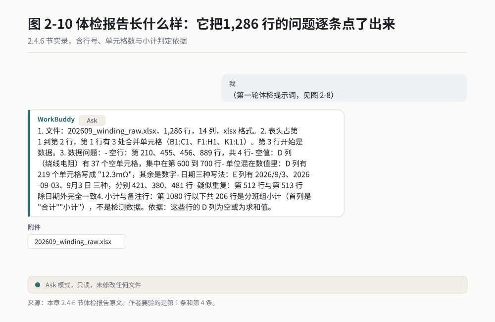

*作者根据公开资料绘制*

> 1. 文件：202609_winding_raw.xlsx，1,286 行，14 列，xlsx 格式。
>
> 2. 表头占第 1 到第 2 行，第 1 行有 3 处合并单元格（B1:C1、F1:H1、K1:L1）。第 3 行开始是数据。
>
> 3. 数据问题：
>    - 空行：第 210、455、456、889 行，共 4 行
>    - 空值：D 列（绕线电阻）有 37 个空单元格，集中在第 600 到 700 行
>    - 单位混在数值里：D 列有 219 个单元格写成 "12.3mΩ"，其余是数字
>    - 日期三种写法：E 列有 2026/9/3、2026-09-03、9月3日 三种，分别 421、380、481 行
>    - 疑似重复：第 512 行与第 513 行除日期外完全一致
>
> 4. 小计与备注行：第 1080 行以下共 206 行是分班组小计（首列是"合计""小计"），不是检测数据。依据：这些行的 D 列为空或为求和值。

这份报告里我要验的是第 1 条和第 4 条。行数列数跟我在 Excel 里看到的一致；第 1080 行以下确实是我之前手工整理时漏掉的那部分，它抓出来了，跟我后来核对的结果一样。

发完第二轮，判断点只有一个，而且是个死数字：

**原始行数 = 删除行数 + 输出行数**

1,286 = 4 + 1,282。对得上才往下走。对不上，说明它要么偷偷删了数据行，要么把小计行算进了检测数据。这时候不要去看文件，直接把这句话发回去：

```
输出行数跟原始行数对不上。请不要重新整理，先告诉我：
1,286 行里，每一行分别归到了哪一类（检测数据 / 空白 / 小计 / 备注），
四类加起来必须等于 1,286。先把这个账对清楚。
```

这个"先对账"的习惯，是我用 AI 整理表格一年多来最值钱的一条经验。它出错的方式通常不是算错，是悄悄少算。

### 2.4.7 验收标准与变体

验收五个动作，全部做完大约 4 分钟：

| # | 动作 | 过了的标准 |
|---|---|---|
| 1 | 数行数 | 原始 1,286 = 删除 + 输出 |
| 2 | 抽查 5 行 | 抽首尾各 1 行、随机 3 行，跟原件逐格比对，数值一模一样 |
| 3 | 透视求和 | 对某一数值列求和，原件和整理后必须完全相等 |
| 4 | 查空值 | 每一列的空单元格数跟它汇报的数字一致 |
| 5 | 看编码 | 另存 csv 打开不乱码；中文列名显示正常 |

抽查那 5 行怎么选，我有个小讲究：不要全抽开头。开头几行通常是干净的，脏数据在中间和结尾。我固定抽第 1 行、最后 1 行、中间随机 3 行。

变体一：**试验报告数据汇总。** 台架跑完出十几个 csv，让它合并成一个总表并加一列"数据来源文件名"。提示词把"绕线检测"换成"试验数据"，其余不动。注意每个 csv 的列顺序可能不同，第一轮汇报一定要让它核对列名。

变体二：**BOM 与库存表比对。** 两份表按零件号对，输出差集。这种活手工做最容易漏，交给它反而更稳，因为它是逐行比的。前提是两份表的零件号写法要统一，第一轮让它先报写法差异。

变体三：**多份月报合并成季报。** 三份结构相同的月报，合成一份并生成汇总页。这种活它干得比人快，但格式细节（字体、列宽）它经常做不到位，验收时重点看格式。

### 2.4.8 翻车清单

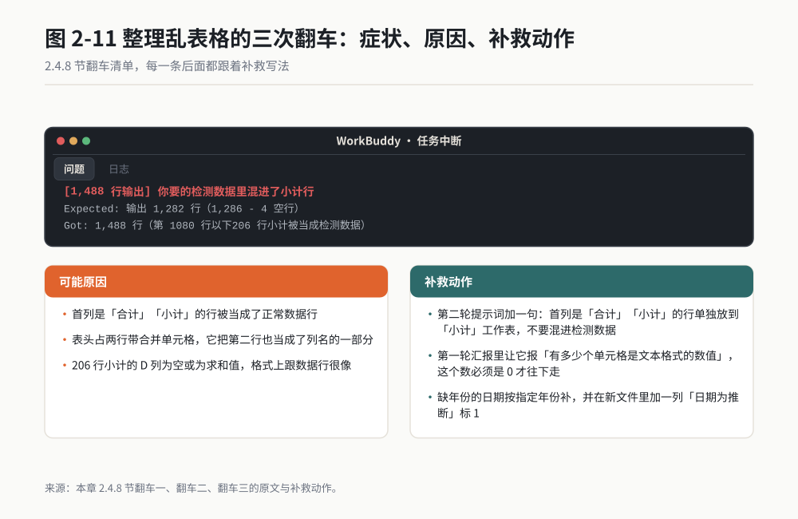

*作者根据公开资料绘制*

**翻车一：它把小计行当数据行一起整理了。** 我第一次跑就栽在这。它把 206 行小计混进了检测数据，输出行数变成了 1,488。补救动作：在第二轮提示词里加一句"首列是'合计''小计'的行单独放到'小计'工作表，不要混进检测数据"，然后让它重跑。

**翻车二：带单位的数值被当成文本，透视时求和得 0。** 12.3mΩ 这种写法在 Excel 里是文本，求和直接忽略。补救动作：第一轮汇报里让它报"有多少个单元格是文本格式的数值"，这个数必须是 0 才往下走。

**翻车三：日期统一错了。** 三种写法里"9月3日"没有年份，它按当前年份补了 2026，实际上那批数据是 2025 年的。补救动作：第二轮提示词里写明"缺年份的日期按 [年份] 补，并在新文件里加一列'日期为推断'标 1"。凡是它替你补的东西，都要留一个标记列，方便你事后筛出来复核。

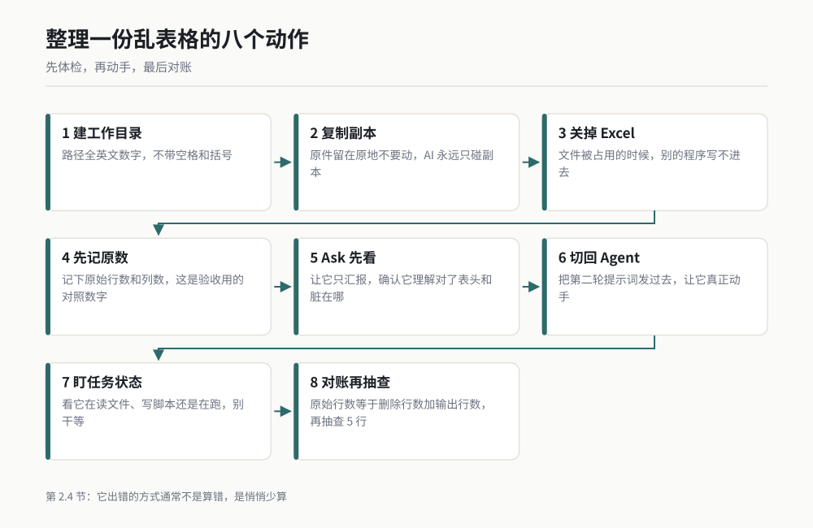

*作者根据公开资料绘制*

## 2.5 装完必做的三个设置

装完软件，很多人直接开始问问题。我建议你先花 15 分钟做三件事，做完再用。这三件事的顺序就是下面的顺序，不能换。

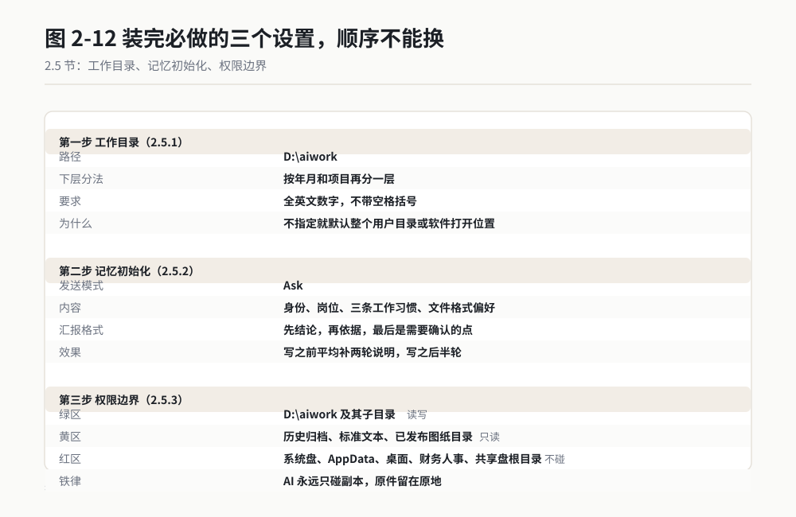

*作者根据公开资料绘制*

### 2.5.1 工作目录：给它一个专属的车间

动作：新建一个空目录，路径全英文数字，不带空格括号。我用的是 `D:\aiwork`，下面按年月和项目再分一层。然后到设置区把这个目录设为工作目录。

理由：工作目录是它默认能看见、能动的范围。你不指定，它要么默认整个用户目录，要么默认你打开软件的那个位置。我在老周电脑上看到过一次，他的工作目录是整个 D 盘，那一刻他桌上所有项目文件都进了它的活动范围。

我自己的规矩：每一个项目一个子目录，交付完就归档。这样它干错了，损失只在一个子目录里，删掉重来就是。

### 2.5.2 记忆初始化：把自我介绍一次性说完

动作：装完当天，用 Ask 模式发下面这段话，把方括号换成你自己的。

```
请把下面这些记到长期记忆里，以后不用我重复交代。

我是 [汽车零部件] 行业的 [研发工程师]，做了 [11] 年。
我的岗位日常是 [微电机与智能执行器的设计与试验]。

三条工作习惯：
1. 我给你的表格，第一件事永远是核对行数和列数，对不上先告诉我。
2. 我不需要你夸我，也不需要总结陈词，直接给结论和数字。
3. 凡是你替我推断、补全、四舍五入的内容，都要单独标记出来，不许混在原始数据里。

文件格式偏好：
- 表格用 xlsx，中文列名
- 文档用 docx
- 报告里出现数字一律带单位

汇报格式：先结论，再依据，最后是需要我确认的点。每块不超过三行。
```

理由：这一段话你今天写一次，后面 72 个场景里它都会按这个习惯干活。我第一次没写这段话，前两周每次都要重复"带单位""不要总结陈词"，起码重复了二十遍。第二周我写进记忆之后，这两句话再没说过。

不写这段话，它也不是不能干。差别在返工次数。我自己的记录是，写之前平均每件事要补两轮说明，写之后平均半轮。

### 2.5.3 权限边界：先划红线，再谈信任

动作：拿一张纸，列出三个圈：绿区（可读写）、黄区（只读）、红区（不碰）。到设置区的权限部分，只把绿区挂上去。

| 圈 | 目录 | 授权 | 理由 |
|---|---|---|---|
| 绿区 | `D:\aiwork` 及其子目录 | 读写 | 这里面的东西删了不心疼，重跑就是 |
| 黄区 | 历史归档、标准文本、已发布图纸目录 | 只读 | 引用可以，改了要走变更流程 |
| 红区 | 下列目录 | 不碰 | 见下 |

红区清单，这些目录一律不给：

| 目录 | 为什么不给 |
|---|---|
| 系统盘根目录、`C:\Windows`、`C:\Program Files` | 改坏了系统，重装一整天 |
| 用户目录下的 `AppData` | 浏览器配置、登录凭据、各软件状态都在这，风险集中 |
| 桌面 | 桌面上是我的杂物堆：客户报价扫描件、身份证照片、孩子的画。我控制不了里面有什么 |
| 财务与人事目录 | 工资、合同、证件扫描，出了问题是责任事故 |
| 共享盘根目录 | 里面有别人的文件，误删影响全组，而且你没法一个人恢复 |
| 受控文件服务器的发布区 | 这里的每一次改动都要走变更流程，AI 动了等于你越权 |
| 云同步盘根目录 | 误删会同步到所有人的电脑，delete 一个文件等于 delete 全组 |

桌面这条我想多说一句。很多人天然把桌面当工作目录，因为文件都在那儿。我的建议是把桌面当"待整理区"，不是"工作区"。要用哪个文件，复制到工作目录里再干活。多一步复制，省掉的是"它误删了我桌面上的客户报价"这种事。

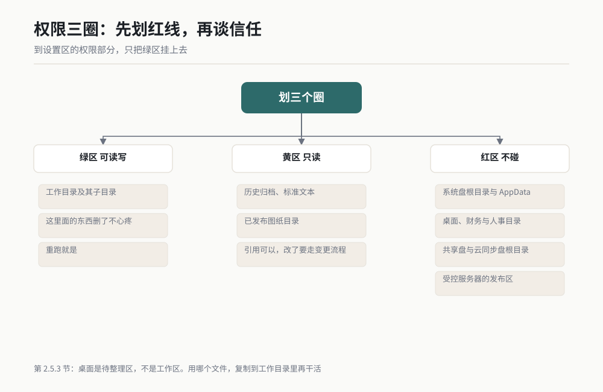

*作者根据公开资料绘制*

## 2.6 常见安装故障与自救

下面七条，前五条是我自己或身边同事真遇到过的，后两条是安装类工具的高频共性问题。每条给现象、原因、动作。

### 故障一：装不上，安装进度到一半卡住或报错

| | |
|---|---|
| 现象 | 进度条走到 60% 到 90% 之间不动，或者弹出一个英文错误框 |
| 原因 | 常见于三类：安装包下载不完整、杀毒软件拦截写文件、目标盘剩余空间不足 |
| 动作 | 第一步重新下一遍安装包，比对字节数；第二步临时退出杀毒软件再装；第三步看目标盘剩余空间，低于 5 GB 先清。三步做完还不行，把报错框拍下来发给 IT |

我见过最坑的一次是下载中断，安装包实际只有完整文件的 70%，但大小显示正常，因为下载工具做了断点续传。比对字节数这一步别省。

### 故障二：装上了，双击打不开或开出来白屏

| | |
|---|---|
| 现象 | 双击图标没反应，或者窗口弹出来了但一片空白 |
| 原因 | 显卡硬件加速冲突、本地缓存损坏、上一次异常退出留下的锁文件 |
| 动作 | 先等 30 秒，第一次启动要初始化。还不行就到设置区关掉硬件加速再启动。再不行，卸载重装，重装前手动删掉残留的配置目录 |

### 故障三：登录失败，账号密码都对就是进不去

| | |
|---|---|
| 现象 | 提示登录失败、验证码不对、或者一直在转圈 |
| 原因 | 公司网络代理拦截了登录请求；验证码有时延；账号在新设备上需要二次确认 |
| 动作 | 换手机热点试一次，能登上就说明是公司网络的问题，找 IT 加白名单；验证码等 60 秒再收，别连点三次，连点会让前面的验证码全部失效 |

老周卡在这一步卡了半小时。最后发现是他们公司内网把登录域名拦了，IT 加了白名单，两分钟解决。

### 故障四：能聊天，但连不上服务

| | |
|---|---|
| 现象 | 界面正常，发一句话出去一直转圈，最后提示连接超时或服务不可用 |
| 原因 | 代理或 VPN 干扰、系统时间不同步导致证书校验失败、服务端维护 |
| 动作 | 第一步关掉 VPN 再试；第二步检查系统时间，差超过 5 分钟就同步一次；第三步看官方状态页有没有维护公告 |

系统时间这条最容易被忽略。我有一次出差回来电脑时间快了 11 分钟，AI 一直连不上，我排查了网络、账号、防火墙，最后发现是时钟。

### 故障五：文件读不到，它说找不到或者读出来是乱码

| | |
|---|---|
| 现象 | 提示文件不存在，或者读出来的中文是问号和方块 |
| 原因 | 路径含空格或特殊字符、文件被 Excel 占用、编码不一致（GBK 被当 UTF-8 读）、文件不在工作目录范围内 |
| 动作 | 把文件复制到工作目录下，路径改成英文数字；关掉 Excel；如果是 csv，另存时选 UTF-8 编码。三个都做完再重试 |

### 故障六：能聊天，但它就是不动手

| | |
|---|---|
| 现象 | 你让它改文件，它回了一篇分析，但文件没变 |
| 原因 | 模式停在 Ask（只答不动），或者工作目录没设，它不知道该在哪干活 |
| 动作 | 看模式切换是不是在 Ask，切到 Agent。再看设置区的工作目录是不是空的，空的就先按 2.5.1 建一个 |

这条不是故障，是使用问题，但它占我见过的"AI 不好用"投诉的一半以上。先查模式，再查目录。

### 故障七：中文显示正常，但生成的文件打不开

| | |
|---|---|
| 现象 | 它说生成好了，你双击文件，Excel 或 Word 报格式错误 |
| 原因 | 生成过程中被中断，文件只写了一半；或者目标文件正被另一个程序打开 |
| 动作 | 关掉所有打开着的 Excel 和 Word，让它重新生成一次。仍然不行就换个文件名输出到同一目录 |

## 2.7 如果你只做一件事

今天只做这一件，五分钟，不用改任何设置，不用建工作目录。

拿你手边最近的一个文件，什么都行：一封没读完的邮件导出、一份上周的会议纪要、一份你写了两页的报告草稿。用 Ask 模式拖进去，发下面这段话：

```
读这个文件，只汇报，不要改任何东西。
用不超过 100 个字告诉我三件事：
1. 这个文件讲了什么。
2. 里面最重要的一个数字是什么。
3. 有什么地方是写漏了的。

最后一行告诉我你读的是哪个文件、多少字或多少行。
```

五分钟之内，你会拿到一段你自己也要花五分钟才写得出来的东西。差别在于你是读的人，它替你读。

拿到之后做一件事，别跳过：核对它报的第三件事。它说你写漏了什么，你回去看一眼是不是真的漏了。对上了，说明它能用；对不上，说明你的文件它有歧义，下次要说得更清楚。

对上了就停在这儿。今天不用往下读，明天再来做 2.4 那件真活。第一次拿到正反馈的这一天，比后面任何一天都重要。老周那天晚上给我发了条消息，就一句话："它把我那份纪要里漏掉的日期找出来了。"

## 小白词典

**工作目录**：AI 默认能看见、能读写的那个文件夹。类比是给新同事安排的工位，他的活动范围就在这张桌子周围。

**模式切换**：Ask、Plan、Agent 三种委托方式的选择开关。类比是你给同事的三种委托书：只问、先出方案、直接干完。

**Ask 模式**：只读只答，不动你任何文件。类比是问路，对方指方向但不替你走。

**Agent 模式**：直接读写文件、跑程序、干完交差。类比是把整件事包给同事，你只看结果。

**任务状态区**：显示它正在干第几步、卡在哪一步的进度条。类比是车间门口的看板。

**编码**：电脑存文字的规则，规则不一致就显示成乱码。类比是两个人说不同方言。

**脏数据**：格式不统一、有缺值、混进多余字符的数据。类比是刚从地里拔出来还带泥的萝卜。

**csv**：一种纯文本表格格式，用逗号分隔列。类比是去掉所有花样的纯文字账单。

**透视**：按某一列分组，然后求和、计数、取平均。类比是把一堆小票按商品名归类算总额。

**签名（数字签名）**：安装包上标明"谁做的这份文件"的电子印章。类比是药盒上的封条。

## 你的岗位怎么用

**设计工程师**：今天就把工作目录建在"在研项目 / 2026 / 图纸与计算书"这一层，别建在整个项目根目录。你的第一批活建议从"读一份设计计算书、列出输入参数与假设条件"开始，只读不改。等你能判断它读得对不对，再让它动手改 BOM 和技术条件。

**试验工程师**：2.4 那件活就是给你写的。台架数据最脏，空行、中断、单位混写全都有。先拿一份上个月你已经手工整理过的记录跑一遍，用你自己的结果当标准答案，一次就能知道它靠不靠谱。

**质量工程师**：你的红线意识最强，2.5.3 那张三圈表请照抄并补充。另外建议你在记忆初始化里加一条："涉及判定的结论，必须给出依据行号，我要逐条复核。"这条会让你后面所有验收都省一半时间。

**采购 / 供应商管理**：乱表格是你最常见的东西，各家供应商发来的格式没有两份是一样的。把 2.4.5 的第二轮提示词存成你自己的模板，每次只改方括号。我认识的一位采购同事靠这一条，把五家供应商的月度表从两小时压到了二十分钟。

**项目经理**：2.7 那个五分钟动作最适合你。你的信息源是纪要、周报、风险表，全是一读就要结论的东西。先让它读，等你信得过它读的结论，再让它写。跳过读直接让它写，出错概率高得多。

**研发主管**：你自己不必先动手，但 2.5.3 的权限三圈建议你亲自定一版给团队。个人装机各自为战，最可能出的问题不是效率，是有人把共享盘挂进了工作目录。

## 本章交付物

**装机自检清单**：一张 A4 纸能打印完的九条，装完当天逐条打勾。我把它贴在显示器边框上贴了半年。

| # | 检查项 | 做完的标准 |
|---|---|---|
| 1 | 安装包来源 | 官方渠道，比对过字节数 |
| 2 | 版本 | 稳定版，不是预览版 |
| 3 | 装完能启动 | 双击能开，不白屏 |
| 4 | 五个区域找到三个 | 对话区、模式切换、设置区 |
| 5 | 工作目录已设 | 一个英文数字的专属目录 |
| 6 | 记忆已初始化 | 2.5.2 那段话发过一次 |
| 7 | 权限三圈已划 | 红区目录全部没挂上去 |
| 8 | 第一件活跑通 | 2.3 那份汇报对得上页码行数 |
| 9 | 第一件真活验收 | 2.4 的三个数字对得上 |

怎么用：装完当天照着打勾，第 7 条没打勾之前不要交真活给它。前六条是十分钟的事，第七条是十分钟，后两条才是真正花时间的部分。

作者使用经验：第九条我从来不跳。有一次赶时间，跳过了行数核对，直接把整理完的表发给了客户，第二天发现少了一个班组共 143 行。从那以后，那三个数字我每次都写在纸上，对完才发。

## 本章金句

> 装完软件只占这件事的十分之一。剩下九成，是让它知道该动谁的文件。

> AI 永远只碰副本。原件留在原地，这是死规矩。

> 先让它体检，再让它动手。理解错了在汇报阶段纠正，比改完 1286 行再返工便宜得多。

> 它出错的方式通常不是算错，是悄悄少算。所以原始行数必须等于删除行数加输出行数。

> 凡是它替你推断、补全、四舍五入的内容，都要有一个标记列。

> 桌面是待整理区，不是工作区。把文件复制到工作目录里再干活，多一步复制省掉一次事故。

> 第一次拿到正反馈的这一天，比后面任何一天都重要。

---

*（下一章：三种模式的日常切换。装好了，接下来要学会的是什么时候让它想、什么时候让它干。）*
