# 第 4 章 把你用过的好招数存成技能

> 同一件事你教它第二遍，就是你自己的问题。

2026 年 3 月的一个周四下午，我在赶月度试验数据包。每个月 5 号之前，我要把上个月所有台架试验的数据汇总成一份 Excel，发给客户的项目接口人。

这份表的格式是三年前客户定的：第一页汇总，第二页原始曲线，表头必须是中英双语，超差的行整行标浅红底，页脚要带试验日期和操作人姓名。

那天我把导出的原始数据拖进 WorkBuddy，开始打字：

> 我：把这些 MST 台架数据按月度模板整理一下。第一页汇总，第二页原始曲线，表头中英双语，超差的行整行标浅红底，页脚写试验日期和操作人姓名。另外客户要求耐久测试的数据放在振动测试前面。

它干完了。我打开一看，序列又错了：振动在前，耐久在后。

我改口：

> 我：顺序不对，耐久在前。

它改好了。我又发现日期格式写成了 `2026/3/15`，客户要的是 `2026-03-15`。再改一轮。然后发现超差判定用的是我上个月临时定的值，不是标准里的值。再改一轮。前前后后八轮，四十分钟。

让我难受的不是这四十分钟。是我回头翻了一下自己的对话记录：同样这套格式要求，我从 2025 年 11 月开始，每个月都要跟它讲一遍。

到 3 月为止，讲了第五遍。中间有一次它甚至问我"这次要不要按上次的方式来"，我回了一句"对，按上次的"，就以为它记住了。它没有。换了个对话窗口，它就又变成那个什么都不懂的新同事。

那天晚上我做了一件事：把这套格式要求写成了一个文件，存进技能目录。从那以后，我每个月只说一句话："跑月度数据包。"到现在第七个月，一个字都没再改过。

这一章讲的就是这件事：怎么把你说过第五遍的话，变成一份只写一次的岗位手册。

## 4.1 技能是什么：给 AI 的岗位手册

**技能**是一份存在你电脑上的说明文件，它告诉 WorkBuddy 遇到某一类活该怎么干、按什么顺序干、交出什么东西算合格。装上它，WorkBuddy 就多会一类活。

我给你三个类比，你挑一个顺手的记住就行。

**类比一：岗位手册。** 工厂里每台设备旁边都挂着一本作业指导书。谁来操作都照着上面写的一步一步做，不会因为今天是新手还是老师傅就换一套做法。技能就是给 AI 挂的作业指导书：先做什么、后做什么、哪些情况不许往下走、做完交什么。

**类比二：菜谱。** 你会做红烧肉，朋友不会。你把火候、顺序、调料克数写成一张卡片，他照做也能端出一锅差不多的肉。技能就是这张卡片，区别是写给 AI 看的。

**类比三：检查单。** 飞行员起飞前有一份检查单，一条一条勾，不看心情。技能里那些"必须先……""如果……就停""最后核对……"，就是这份检查单。这也是我最看重的部分，因为它直接决定交出来的东西你敢不敢签字。

三个类比合起来，技能的本质就清楚了：**它不是让 AI 变聪明，是把你已经摸清楚的干法固定下来，让它每次都照着走。**

没有技能和有技能，差别在哪？我把同一份试验数据丢给 WorkBuddy 两次，一次不带技能一次带，结果如下：

| 比较项 | 没有技能 | 有技能 |
|---|---|---|
| 我要说的话 | 每次重讲一遍格式、顺序、判定值 | "跑月度数据包" |
| 往返轮数 | 5 到 8 轮纠正 | 通常 1 轮 |
| 出错类型 | 顺序错、日期格式错、判定值用错 | 数据本身有问题（这个本来就要人看） |
| 换窗口之后 | 全部重讲 | 照旧执行 |
| 交给同事 | 得把要求再复述一遍给同事 | 把文件发给他放进目录就行 |
| 我花的时间 | 单次约 40 分钟 | 单次约 6 分钟 |

最后一行最实在。同一件活，从 40 分钟降到 6 分钟，一年十二次，就是七个钟头。写那个技能文件，我花了 25 分钟。

有一点要提前说清楚，免得你期望错位：**技能不提升 AI 的智商，它提升的是 AI 的稳定性。** 一件它压根不会干的活，你写一百页技能它也干不了。

一件它本来能干、但每次干得都不太一样的活，技能能把它摁住。所以判断要不要写技能的标准很简单：**这件事它做过并且做对过，只是每次要你重新交代，就值得写成技能。**

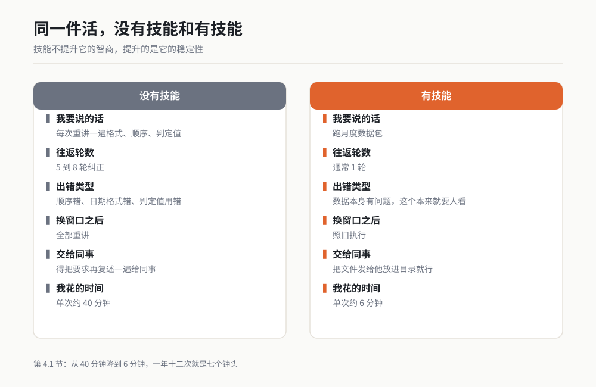

*图 4-1 同一件活，说过的话和花的时间差在哪。作者根据公开资料绘制。*

## 4.2 技能的三种来源

技能有三个来路：自己写、从市场装、团队共享。三条路不互斥，大多数人的技能夹里最后都是三样都有。

### 自己写：专治你自己的烦

自己写是最值钱的一条路，因为市面上没有任何技能知道你们部门的表长什么样、客户的页脚要写什么。

适用场景：

- 你发现自己跟 AI 说过两遍以上的同一套要求；
- 这件事有固定的格式、顺序、判定值；
- 做错了要返工，返工成本你能感知到（时间、面子、客户投诉）。

存放位置在个人技能目录下，一个技能一个文件夹，核心文件叫 `SKILL.md`：

```text
~/.workbuddy/skills/
└── 你的技能名/
    ├── SKILL.md          必填，技能的正文
    ├── scripts/          可选，要跑的脚本
    ├── references/       可选，长篇参考资料
    └── assets/           可选，模板文件、示例数据
```

Windows 上 `~` 就是你的用户目录，比如 `C:/Users/你的用户名/`。照这个路径一层层点进去，没有的文件夹自己建。

写的方式有两种。一种是照着 4.3 节的结构自己敲；另一种是干完一件活之后对 WorkBuddy 说一句：


*作者根据公开资料绘制*

> 我：把我们刚才整理这份数据表的过程，写成一个技能，存到我的技能目录，名字叫 test-data-digest。

它会自己总结这个流程并生成文件。**写完必须你自己读一遍**，特别是它总结的判定值和边界条件，这部分最容易写错。

### 从市场装：别人已经趟过的路

社区市场里有别人做好的技能，点一下就装。这条路的价值不在于省你多少写字时间，在于有人替你踩过坑了。

适用场景：

- 这件事跟公司、客户的特殊要求无关，是个通用活；
- 你没干过，不知道该分几步；
- 你已经感觉到这里头有坑，但还不知道坑在哪。

我自己装过的这类技能里，有几个用得很频繁：`markitdown-skill` 把 PDF、Word、PPT、图片批量转成 Markdown，我们每周收到的客户规范 PDF 全靠它；`md-to-pdf` 把写好的 Markdown 转成排版干净的 PDF。

还有一个 `summarize`，一句话总结网页和长文档。这三个的共同点是：通用、边界清晰、坑被前人踩平了。

操作路径：在对话里直接说"帮我找一个能做 XXX 的技能"，或者从推荐市场界面里挑。

> 【待补：技能市场的具体入口路径，以实际版本为准】

装之前做两件事。一是看清它能干什么、不能干什么，通常写在描述里；二是**不要立刻拿真数据跑**，先拿一份不重要的样本跑一遍。

我装过一个合并 PDF 的技能，第一次用就把我一份 80 页的原件覆盖了。后来我养成的习惯是：新技能第一次跑，一律先复制一份副本出来试。

### 团队共享：放进项目里一起用

第三种是把技能放进项目目录，跟代码或文档一起管理。同组的人拉下来就有。

适用场景：

- 这个做法你们组已经达成过共识（比如"我们的报告必须这么写"）；
- 新同事需要照着它学会你们的标准；
- 这个做法会跟着项目变，需要版本管理。

项目级技能的常见位置是项目根目录下的 `.workbuddy/skills/`。

> 【待补：项目级技能的具体目录名与加载优先级，以实际版本为准】

这条路最容易踩的坑是"写了没人用"。我见过一个组写了六个技能，三个月后没人用。原因很典型：写的人按自己脑子里的标准写，没跟同组对过，另外五个人各有各的干法。

我的建议是：**别从零开始写团队技能，从抄开始。** 找一件组里某个人已经干得很好、其他人都在模仿的活，把他的干法写成技能，署他的名，让大家试一周，提意见改一版。先有一份被实际用起来的，再谈第二份。

| 来源 | 适用 | 花的时间 | 主要风险 |
|---|---|---|---|
| 自己写 | 带你们公司格式的事 | 15 到 40 分钟 | 写得抽象，等于没写 |
| 从市场装 | 通用活，别人踩过坑 | 几分钟 | 不安全或质量参差 |
| 团队共享 | 组里已有共识的做法 | 几小时加推广 | 写完没人用 |

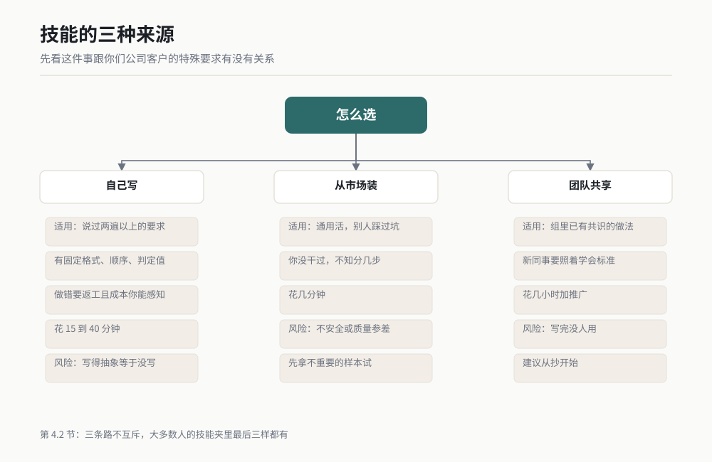

*图 4-2 三种来源的岔路口。作者根据公开资料绘制。*

## 4.3 手写一个技能：SKILL.md 的每个字该怎么放

这一节是本章的重点。我先给你一个能直接抄的完整例子，再逐段讲每段写什么、写多长、为什么。

### 先看完整例子

下面这个技能解决的就是本章开头那件事：把原始试验数据整理成月度汇总表。你可以整段复制，把里面的项目名、路径、判定值换成你自己的。

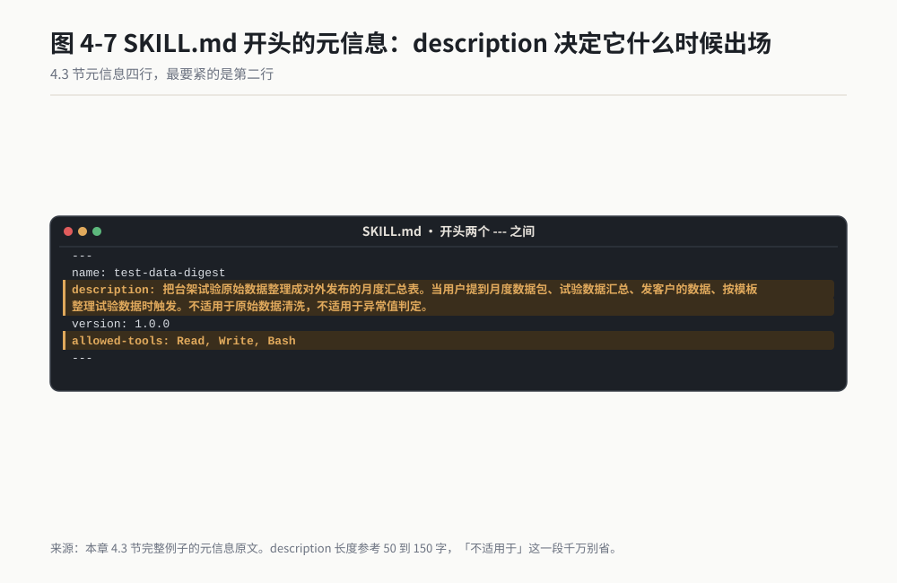

*作者根据公开资料绘制*

```markdown
---
name: test-data-digest
description: 把台架试验原始数据整理成对外发布的月度汇总表。当用户提到月度数据包、试验数据汇总、发客户的数据、按模板整理试验数据时触发。不适用于原始数据清洗，不适用于异常值判定。
version: 1.0.0
allowed-tools: Read, Write, Bash
---

# 试验数据月度汇总

## 这份活是给谁干的

每月 5 号前，把上月所有 MST 台架试验数据整理成一份 Excel 发客户。
对接人在客户侧的 Project Quality 部门。这份表会进客户的月度评审材料，
出错要返工，返工由我们组承担。

## 开工前你必须拿到

- 原始数据导出的 CSV，通常名为 mst_export_YYYYMM.csv
- 本月有效试验清单（在 references/test-plan-2026.md 里）
- 操作人姓名（不确定就问我，不许自己编）

缺任何一样，先问我，不许往下做。

## 步骤

1. 读 references/test-plan-2026.md，取出本月该做的试验清单和判定值。
2. 读原始数据 CSV，按清单筛掉不在本月计划里的行。
3. 计算超差：超过判定值上限或低于下限的行，整行标浅红底（RGB 255, 242, 242）。
4. 生成两页：Sheet1 汇总，Sheet2 原始曲线数据。
5. 按 references/report-format.md 套表头和页脚。
6. 自查一遍（见下）。
7. 输出到 output/YYYY-MM_月度数据包.xlsx，汇报给我。

## 顺序不许变

测试类别在 Sheet1 里的排列顺序是硬规定，客户三年前定的：

耐久测试 → 振动测试 → 温升测试 → 噪声测试

不许按数据量大小排，不许按字母排，不许按你上次的习惯排。

## 格式硬规定

- 表头中英双语，例：试验名称 / Test Name
- 日期一律 YYYY-MM-DD，例：2026-03-15（不是 2026/3/15）
- 转速单位 rpm，扭矩单位 N·m，温度单位 ℃
- 页脚：试验日期 | 操作人 | 页码

## 不许做的事

- 不许用默认判定值。判定值必须来自 test-plan-2026.md
- 不许删掉任何一行原始数据，包括看着像废数据的行
- 不许把多个试验的数据合并成一行
- 操作人姓名不许猜，不知道就停下来问

## 干完之后自查

逐条确认再汇报：

- [ ] Sheet1 里四类测试的顺序是耐久、振动、温升、噪声
- [ ] 所有日期格式是 YYYY-MM-DD，一个斜杠都没有
- [ ] 超差行数与我给的判定值算出来的数一致，写出这个数字
- [ ] 页脚四项齐全
- [ ] 文件存在 output/ 目录下，文件名带年月

## 向我汇报什么

一句话告诉我：本月共 N 条有效试验，超差 M 条，文件在哪个路径。
如果有哪条数据你拿不准（比如缺页、时间戳异常），单独列出来，别自己处理。
```

### 逐段拆解：每段写什么、写多长

一个 `SKILL.md` 只有两块：**开头元信息**（两个 `---` 之间）和**正文**（第二段 Markdown）。我先说元信息，这部分最容易写废。

#### name：技能的身份证

```yaml
name: test-data-digest
```

用小写英文加短横线，不要用中文，不要用空格。这个名字同时是它的文件夹名，所以 `test-data-digest` 对应的目录就得叫 `test-data-digest`。两边不一致会加载失败，这是我踩过的第一个坑。

#### description：决定它什么时候出场

这是整个技能里最要紧的一行，也是最容易写废的一行。它有两个作用：让 WorkBuddy 判断"这个活该不该叫它"，以及让你自己三个月后还记得这玩意是干啥的。

我踩过的坑是这么写的：

```yaml
description: 处理试验数据相关任务
```

结果它在我只想打开文件看一眼的时候跳出来，在我真正要整理数据的时候又不出来。因为它太宽了。

有效的写法要包含三样东西：**干什么 + 什么话会触发 + 什么情况别用它**。

```yaml
description: 把台架试验原始数据整理成对外发布的月度汇总表。当用户提到月度数据包、试验数据汇总、发客户的数据、按模板整理试验数据时触发。不适用于原始数据清洗，不适用于异常值判定。
```

长度参考：50 到 150 字。短于 30 字通常意味着你说得太笼统；长过 200 字说明这个技能想干的事不止一件，应该拆开（见 4.5 节）。

"不适用于"这一段千万别省。这一段它不抢活，比它会抢活重要得多。我有个技能早期没有写"不适用于"，结果部门里所有人只要提到"数据"两个字它都跳出来，被吐槽了半个月。

#### version 和 allowed-tools

```yaml
version: 1.0.0
allowed-tools: Read, Write, Bash
```

`version` 自己管就行，改一次正文加一位小数。`allowed-tools` 是给这个技能的工具权限：读文件、写文件、跑命令行。这里的原则是**够用就行**。

一个只做排版的技能不要给它跑命令行的权限。这不是小题大做，我见过有人的技能因为没限制权限，在一次跑飞的过程中把他桌面上的临时文件全删了。

#### 正文第一段：这份活是给谁干的

两三句话交代清楚：什么时间、给谁、做成什么样、错了谁背。

这一段看着像废话，实际上是我后来越写越看重的一段。AI 在做取舍的时候会回到这里。你写"这份表会进客户的月度评审材料"，它就会更保守地处理拿不准的数据；你写"这是我们自己内部看的"，它就会大胆一些。

**这一段决定了它在信息不够时选择多做还是少做。**

#### 开工前你必须拿到

列出所有前置物和所有输入文件，然后加一句"缺任何一样，先问我，不许往下做"。

这一句是止损线。没有它，AI 缺输入时会自己去想办法，最典型的办法是猜。猜一个姓名，猜一个判定值，然后用一本正经的语气汇报给你。

#### 步骤

写具体的动作，一条一行，动词开头。**条数控制在 7 条以内**，超过 7 条说明这个技能该拆成两个。每条写一个动作，不要一个格子里塞三件事。

对比一下这两种写法：

| 差的写法 | 好的写法 |
|---|---|
| 整理数据并生成报表 | 1. 按计划清单筛行<br>2. 计算超差行的判定值<br>3. 超差行整行标浅红底<br>4. 生成两个 Sheet |
| 注意格式 | 表头中英双语；日期 YYYY-MM-DD；页脚带操作人 |
| 尽量检查一遍 | 核对超差行数与我给的判定值算出的数一致 |

判断标准只有一条：**一个从没干过这件事的人，能不能照着你写的把活干完。** 每一条里出现"注意""尽量""适当""常见的"这类词，就是不合格。

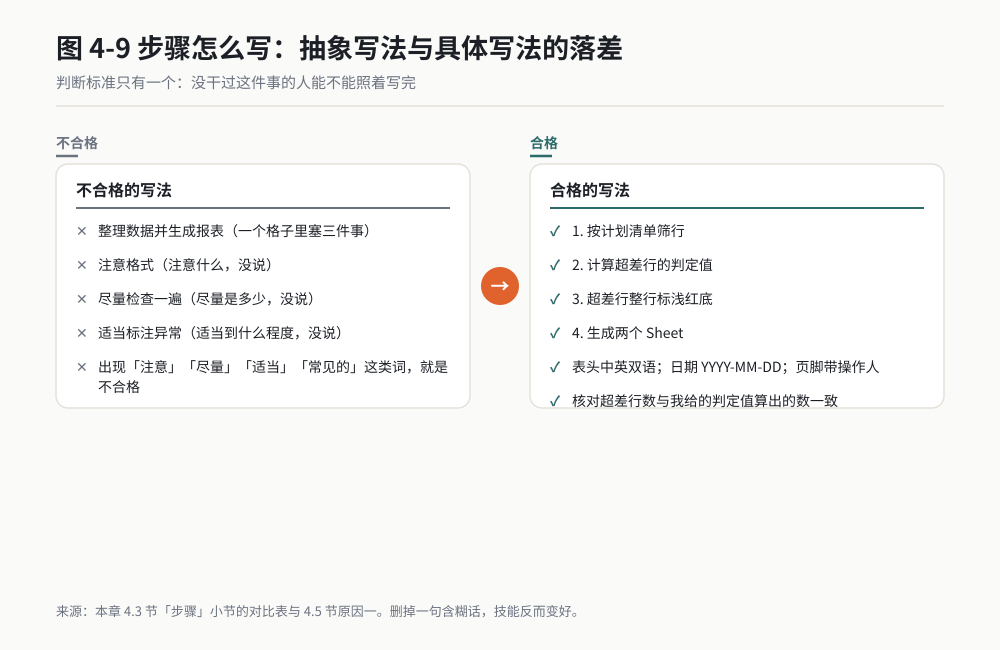

*作者根据公开资料绘制*

#### 顺序不许变 / 格式硬规定

这两段我建议单独拎出来，不要混在步骤里。因为它们是"规定"而不是"动作"，混在动作里会被当成可选项执行。

写成"不许"的句式比写成"应该"有效得多。对比一下：

- "建议按耐久、振动、温升、噪声的顺序排列"
- "测试类别顺序为耐久、振动、温升、噪声，不许按数据量大小排，不许按字母排"

第二句把我被 AI 坑过的具体情形都写进去了。你被坑过什么，就把什么写进去。**这一段的内容只能来自你真实的翻车记录，写不出来说明你还没被坑够，那就先别写这个技能，等下一次翻车记下来再说。**

#### 不许做的事

写三到五条，挑那些出了事最贵的禁止项。我列的四条是：不许用默认判定值、不许删原始数据、不许合并行、不许猜姓名。

每条背后都是一次返工。

#### 干完之后自查

这是我最舍不得删的一段，也是大多数人忘了写的一段。**它把一个只会交差的技能，变成一个交差之前先自己过一遍的技能。**

写成可勾选的清单，每条都要能被 Yes 或 No 回答。"仔细检查格式"不是自查项，"所有日期格式为 YYYY-MM-DD，无斜杠"才是。

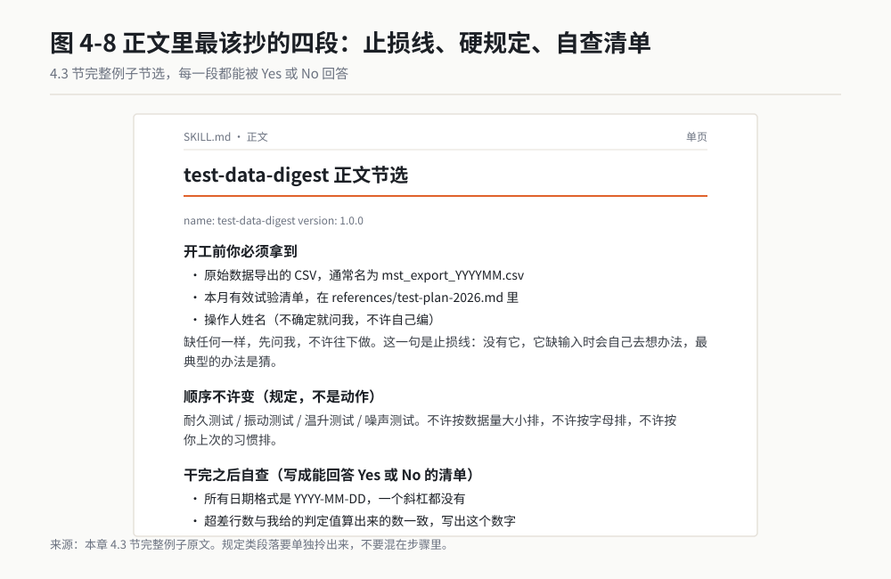

*作者根据公开资料绘制*

开头那个例子里有一句"超差行数与我给的判定值算出来的数一致，写出这个数字"。这是我最喜欢的一类自查项：要求它**输出具体数字**。数字是可以当场验的，形容词不行。

#### 向我汇报什么

规定汇报格式。我喜欢要求它写清楚三个数：总数、异常数、文件路径。再加一句"拿不准的单独列出来，别自己处理"。

这一句话改变了我和 AI 的关系。以前它报喜不报忧，所有不确定的地方它自己填一个最像的值补上。现在它会明确地把"+2 行数据时间戳异常，请确认"列出来，我扫一眼就知道该看哪。

#### 配套目录：scripts、references、assets

正文写不下或者不该写进正文的，放这三个目录：

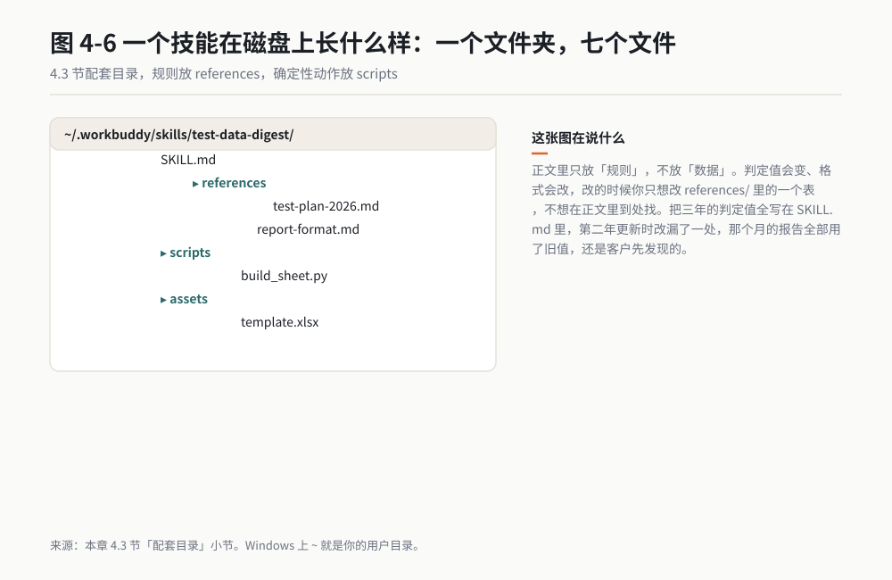

*作者根据公开资料绘制*

```text
~/.workbuddy/skills/test-data-digest/
├── SKILL.md
├── references/
│   ├── test-plan-2026.md        本月试验计划与判定值
│   └── report-format.md         表头页脚的详细格式
├── scripts/
│   └── build_sheet.py           生成 Excel 的固定脚本
└── assets/
    └── template.xlsx            空模板
```

`references/` 放长资料，正文里写"读 references/xxx.md"就行，AI 会按需加载。`scripts/` 放确定性强的重复动作，写死一个脚本比每次让它自由发挥稳得多。`assets/` 放模板和示例。

**配套目录的使用原则：正文里只放"规则"，不放"数据"。** 判定值会变、格式会改，改的时候你只想改 `references/` 里的一个表，不想在正文里到处找。我最初把三年的判定值全写在 SKILL.md 里，第二年更新的时候改漏了一处，那个月的报告全部用了旧值，还是客户先发现的。

### 长度：写多长合适

我一开始以为越长越好，最夸张的时候写过一个 800 行的技能。结果它自己都读不完，干出来的活还不如不加载技能。

后来我摸出来的区间：**正文 100 到 400 行，多数技能在 150 行左右。** 超过 400 行就该拆，或者把长资料挪到 `references/`。

判断要不要拆的标准就一条：这个技能能不能用一句话说清它干什么。说不清，就是塞了两件以上的事。

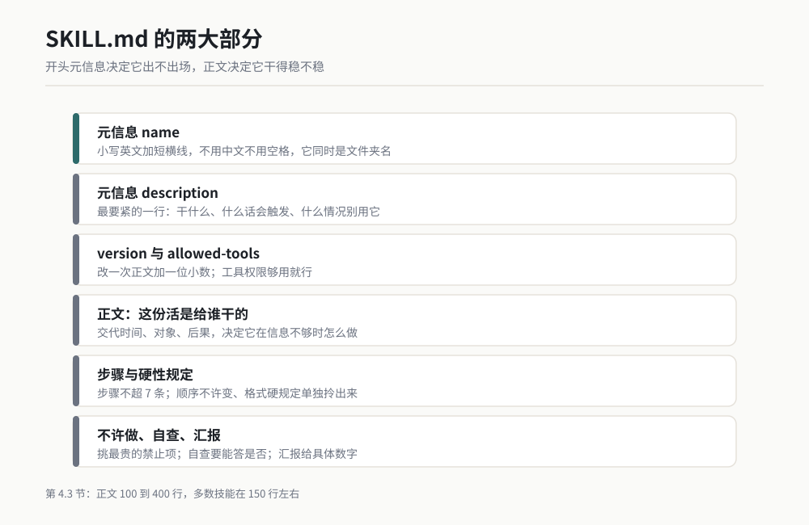

*图 4-3 一个 SKILL.md 的两大部分和六个正文段落。作者根据公开资料绘制。*

## 4.4 技能会自己变强吗：一组六代迭代的真实数据

写完第一个技能，你大概率会问这个问题：它能不能自己越用越好？

为了回答这个问题，我在本机搭了一套自我进化实验，跑了两个多月。这一节把数据摊开给你看，包括难看的部分。

数据全部来自我本机的实验记录，取的是 2026 年 5 月 12 日的一轮完整跑，**每一项都是真实跑出来的，不是我估的。**

### 实验是怎么跑的

整套流程分三步，每一步都对应一个脚本：

1. **攒评测集。** 从我过去两个月的记忆文件里挖出每一次任务的记录：当时说了什么、用了哪个技能、成功还是失败、报错信息是什么。产出是一个 80 条的评测数据集，其中 28 条标记为成功。
2. **生成变体。** 程序读取评测集，统计每个技能最常出现的错误类型，针对每种错误类型生成一个改进版本，最多生成 5 个变体。
3. **打分。** 先用一套固定规则打分，再让本机跑的一个开源小模型按三个维度打分，最后做统计检验。

参与这轮实验的有 13 个技能，每个技能 6 个版本（1 个原始版 + 5 个变体），一共 78 份文件。下面我挑出其中最有代表性的一个，从头到尾摊开讲。

### 主角：一个浏览器自动化技能的六代

这个技能干的是驱动浏览器替我查数据、翻页、填表。它是我装机最早的技能之一，也是我当时用得最狠的一个。

| 版本 | 改进目标 | 当时的错误模式 | 得分 |
|---|---|---|---|
| baseline | 原版，无改进 | original | 0.70 |
| v1 | 原版，模型分析失败 | original | 0.70 |
| v2 | 添加权限检查和错误处理 | 权限错误 | 0.65 |
| v3 | 规范路径处理，使用绝对路径 | 路径错误 | 0.75 |
| v4 | 统一使用 UTF-8 编码，添加编码回退 | 编码错误 | 0.75 |
| v5 | 实现指数退避重试和速率限制处理 | API 错误 | 0.75 |

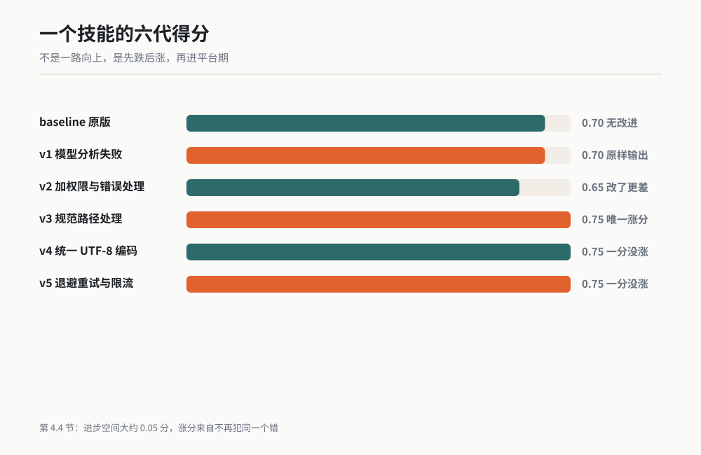

*图 4-4 一个技能的六个版本，得分从 0.70 走到 0.75。作者根据公开资料绘制。*

这条曲线讲了五件事，每一件都比"AI 会自己进化"这句宣传语有用得多。

**第一件事：第一次改不动，是常态。** v1 那一行的改进目标写的是"原版，模型分析失败"。意思很直白：这一轮程序想分析它的错误，调用模型失败了，于是原样输出，评分 0.70，和 baseline 一模一样。

我第一次看到这个结果挺失望，觉得白跑了一轮。后来跑多了才明白，这就是这类自动化流程的日常。

真正让我踏实的反而在这儿：**它有版本号留档，我一眼就知道这一轮没动，不会被一个假涨的分骗过去。** 我自己在手改技能的时候没有这个习惯，改完觉得"好像好点了"，然后说不清改了什么。

**第二件事：改了可能更差。** v2 加了权限检查和错误处理，逻辑上完全正确，挑不出任何毛病。得分从 0.70 掉到 **0.65**。

为什么？我回去对着评分规则一条条查，找到了原因。当时的规则打分里有"正文长度"这一项，理想区间是 500 到 2000 字符，落在区间里给满分 0.3。v1 的正文已经偏长了，v2 又追加了一整段权限排查，跑出了区间，这一项被扣了分。

这件事让我一下子清醒了：**自动化流程也会"为了改而改"。** 它识别出一个错误类型，就往里加一段对应的处理，加完之后总体反而变差。如果没有评分留档，我会本能地认为"加了处理 > 没加处理"，然后带着一个更差的技能用半年。

**第三件事：真正有用的改动只有一类。** v3 是唯一一次实打实的涨分：从 0.65 到 **0.75**。它改的是路径处理：统一用绝对路径，分隔符一律用正斜杠，路径里有空格要加引号。

看到这个结果我拍了下桌子。因为这个技能是给 Windows 用的，而我真实的上班经验里，浏览器自动化有一半以上的报错来自路径：驱动器写成了小写、反斜杠没转义、桌面路径里有中文。

v3 那三条规则，正好是这个技能在我这台机器上最容易摔跤的三个方面。**它之所以涨分，是因为它改到了真实的摔跤点。**

对照 v4 和 v5 就更能说明问题。v4 改编码，v5 改接口重试，都是好东西，都是工程上的正确做法。但它们在这个技能上**一分没涨**，因为这个技能从来没在编码和接口限流上出过问题。

**你给一个从来不犯某类错的技能，加上二十条防那类错的规矩，它不会因为规矩多了就变强。**

**第四件事：边际收益很快耗尽。** v3、v4、v5 三代全是 0.75，纹丝不动。这一行数据是我整个实验里最有价值的部分之一。

它说明这样一个事实：靠"识别错误类型、套一段通用处理"这种模板化的改法，进步空间大约是 **0.05 分**，一两轮就吃完了。再往后想要涨，得靠别的东西。

什么东西？我的判断是**真实的使用记录**，也就是 v3 那种"知道它在这台机器上具体摔在哪"的信息。模板化改动可以给任何一个技能加；知道它摔在哪，只有用过它的人能给。

**第五件事：最后一次不等于最好一次。** 这是我在另外 12 个技能里学到的，主角这个技能没体现出来。我把它单拎出来说，因为它最容易害人。

| 技能 | baseline | 最高分版本 | v5 得分 |
|---|---|---|---|
| gsd-checkpoint | 0.80 | v3（0.95） | 0.85 |
| git-workflow | 0.80 | v1（0.85） | 0.80 |
| last30days-cn | 0.70 | v3 / v4 / v5（0.85） | 0.85 |
| huashu-design | 0.60 | v3（0.80） | 0.70 |
| agent-reach | 0.60 | v1 / v3（0.75） | 0.60 |

看最后一行。`agent-reach` 这个技能，跑到第五代，得分回到了 **0.60**，跟原始版一模一样。但它在第一代和第三代的时候是 **0.75**。

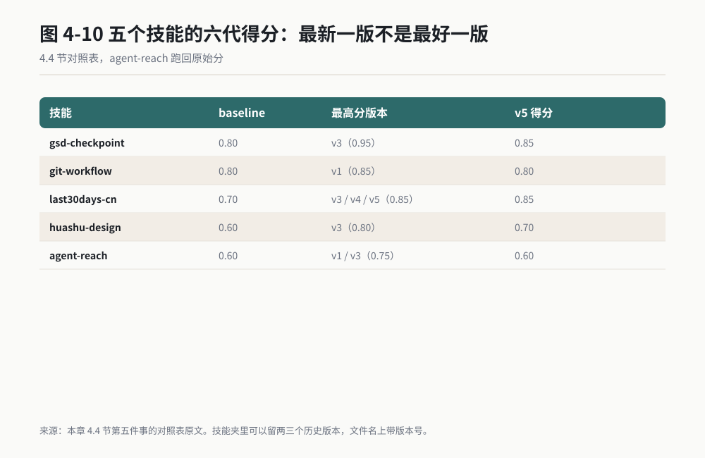

*作者根据公开资料绘制*

如果我只保留最新版本，我就把这个技能最好的两个版本扔了。这件事对所有用技能的人都适用：**别用"最新版"这个词管技能，要用版本号。技能夹里可以留两三个历史版本，文件名上带版本号，用不了几个字节。**

### 打分的三个教训

实验里最难看的部分，恰恰是最值得说的部分。就这些数，我不美化。

**教训一：当时的规则打分能被"写得好看"骗过去。** 规则里给分的项目是：正文长度落在 500 到 2000 字符、包含代码示例、包含编号步骤、命中了错误类型的关键词。

这意味着什么？我把一段废话写到 800 字，随手加个代码块，再编三个编号步骤，就能拿到接近满分的规则分。

**这个打分标准衡量的是"文档写得像不像技能"，不是"技能干活行不行"。** 所以我从不只看分数，每次都要自己读一遍改了什么。

**教训二：模型打分自己也不稳。** 同一个变体，我连着跑了三次，模型给出的综合分分别是 **0.8167、0.7833、0.7833**。三次两次不一样。差距不大，但足够让你在比较两个变体的时候得出相反的结论。

原始版的三维得分更能说明问题：合规性 0.8，输出质量 0.6，简洁性 0.9，综合 0.77。而同一份文件的规则打分是 0.70。

**同一份东西，两套打分差了 0.07。** 有意思的是三维本身：原始版最占便宜的是"简洁"，因为没被加过任何东西；垫底的是"输出质量"。后面几代往上堆内容，简洁分就得往下掉。

**这是一个跷跷板，不是一路向上的阶梯。**

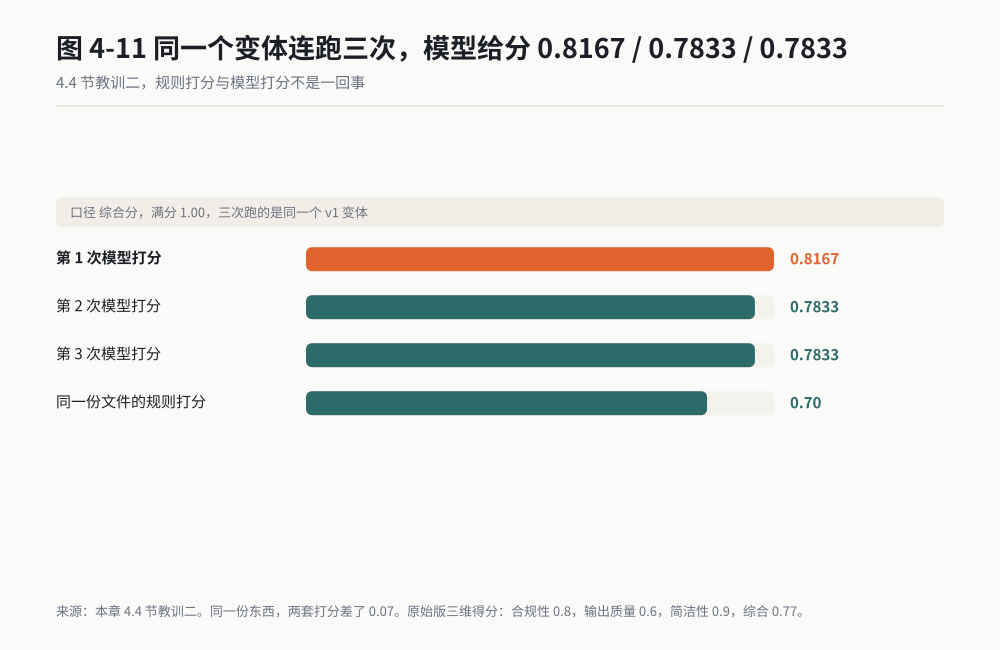

*作者根据公开资料绘制*

**教训三：统计检验也会翻烧饼。** 同样是那个 v1 变体，同样是检验它相对原始版有没有显著改进，三次跑出来的结果是：

| 轮次 | 差值 | p 值 | 结论 |
|---|---|---|---|
| 第 1 轮 | +0.3167 | 1.0 | 不显著，谨慎应用 |
| 第 2 轮 | +0.2833 | 0.5135 | 不显著，谨慎应用 |
| 第 3 轮 | +0.2833 | 0.05 | 显著，建议应用 |

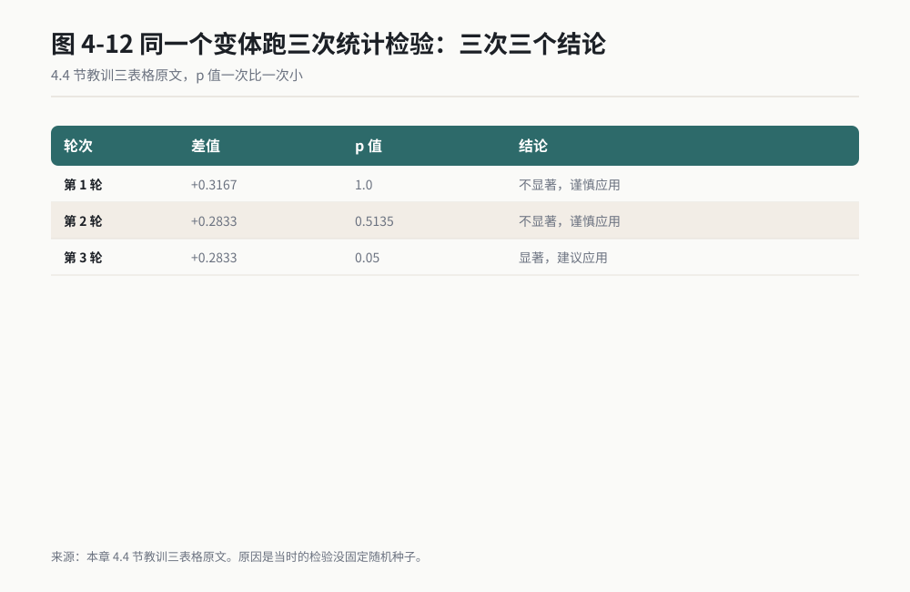

*作者根据公开资料绘制*

**一模一样的输入，三次跑出三个结论，其中一次说行，两次说不行。** 原因不复杂：当时的检验没固定随机种子，每次重采样都是新的一组随机数。

我看到这张表的时候，第一反应是把那段代码修了。修完之后留在心里的东西更值钱：**任何一个会给你结论的流程，都要问一句"再跑一次还是这个结论吗"。**

不光是自动化工具的结论，也包括 AI 给你的结论。多跑一次，成本极低，收益极高。

### 所以，技能到底会不会自己变强

会，但方式和你想的不一样。

它不会自己悟出新招数。**它变强的那 0.05 分，来自"不再犯同一个错"，而不是"学会了新本事"。** v3 涨的那 0.05 分，改的全是我过去两个月真真切切踩过的坑。

真正让它变强的燃料是人。v3 之所以能改对位置，是因为评测集里躺着 80 条我用它干活的记录。这些记录是我干活的副产品，不是程序生成的。

**没有这 80 条真实记录，整条流水线跑出来的一定是 v4 和 v5：正确、无用、零分变化。**

所以这套东西对你的用处不是"让它自己进化"，而是这一条：**把你用 AI 干活的过程留下来，让下一次改技能的时候有凭据。**

哪怕你什么都不自动化，只是每个周五花十分钟，把这周 AI 干砸的地方记进一个 `troubles.md`，一个月之后你就有二十条，三个月之后你就有肥料。我这 80 条评测数据，就是这么来的。

**写技能这件事，起点不是写，是把踩过的坑记下来。**

## 4.5 技能用不好的四个原因

我手上因为不好用而废弃的技能有十几个。复盘下来逃不出四个原因，每个我都给症状和修法。

### 原因一：写得太抽象

**症状：** 加载了技能，AI 干出来的活跟没加载时一模一样。或者它干完之后，你对照正文发现每一条它都"遵守"了，结果还是错的。

**根因：** 正文里全是形容词和原则，没有一条可以被验证的硬规定。

| 抽象写法 | 具体写法 |
|---|---|
| 注意格式规范 | 表头中英双语，例：试验名称 / Test Name |
| 数据要准确 | 超差行数与 references/test-plan-2026.md 算出的数一致，汇报时写出这个数 |
| 适当标注异常 | 数值超出 [下限, 上限] 的行，整行底纹设为 RGB(255, 242, 242) |
| 保持专业 | 不出现感叹号，不出现"非常好""显然"这类主观词 |

**修法：** 通读全文，把每一句里有"注意、适当、尽量、合理、相关、常见"的词都标出来，逐个替换成数字、文件名、颜色值、时间点。替换不掉的，说明你自己也没想清楚，那就删掉那一句。**删掉一句含糊话，技能反而变好。**

### 原因二：描述和实际不符

**症状：** 该它出场的时候不出来，不该它出来的时候抢着出来。或者它一出场就报错，因为正文里提的那个脚本其实早就被你删了。

这条最难查，因为 description 和实际正文是两个地方，改了一处忘了另一处。

我有一个吃过三次亏的例子：某个技能的 description 里写着"生成 CSV 合并脚本"，但 scripts 目录里那个脚本去年就被我换掉了，旧名字早没了。

它按照 description 去找旧脚本，找不到，然后开始自己现编一个。这个坑我踩了三次才意识到，问题不在 AI，在我自己没同步。

**修法：** 每次改完正文，回头问自己一句：**"我正文里提到过的文件，现在真的存在吗？"** 然后让 AI 自己验一遍：

> 我：读一下 ~/.workbuddy/skills/test-data-digest/SKILL.md，把正文里出现的每一个文件路径都列出来，逐个确认它们是否存在，不存在的说出来。

这是我现在的固定动作，改完技能就跑一次，十秒钟。

### 原因三：触发词没写对

**症状：** 你说的话明明就是这件事，它就是不加载技能。或者反过来，你说啥它都加载。

**根因：** 两种情况。一是触发词写得过窄，只写了一个说法；二是写得过宽，一个技能包了一大片。

有效的写法是把**同义词全列上**。同一个活，我说"月度数据包"，同事说"客户月报"，领导说"发客户的那套"。

```yaml
description: 把台架试验原始数据整理成对外发布的月度汇总表。当用户提到月度数据包、月度汇总、客户月报、发客户的数据、试验数据汇总、按模板整理试验数据时触发。不适用于原始数据清洗，不适用于异常值判定。
```

第二个原因是**没写"不适用于"**。这条我在 4.3 节讲过，这里再说一遍是因为它太常被省掉。一段"不适用于"占三十个字，半年下来能省几十次误触发。

**修法：** 每次它该出场没出场，就把你当时那句话原样加进 description。每半年回头删一次已经用不上的触发词。

### 原因四：一个技能塞了太多件事

**症状：** 技能正文超过 400 行，步骤超过 7 条。它每次执行都只完成一部分，而且每次落下的部分还不一样。你说"顺手把 XX 也做了"，它就开始混乱。

**根因：** 你把"相关的事"当成了"同一件事"。整理数据、判定超差、写结论、发邮件，这四件事逻辑上连着，但输入和输出完全不同。

堆在一起，AI 就得自己决定先干哪个，而它每次的决定都不稳定。

**修法：** 按"输出物"拆，不按"主题"拆。

| 塞在一起的写法 | 拆开之后 |
|---|---|
| 试验数据处理技能（整理、判定、报告、发送塞一个技能） | test-data-digest（整理，输出 Excel）<br>test-data-check（判定超差，输出判定表）<br>test-report-gen（写报告，输出 Word）<br>mail-sender（发送，输出发送记录） |

拆的标准：一个技能只交一种东西。整理数据交 Excel，判定超差交判定表，写报告交 Word。输出物不同，就拆开。拆完之后每个技能按 4.3 节重写一遍，反而更快。

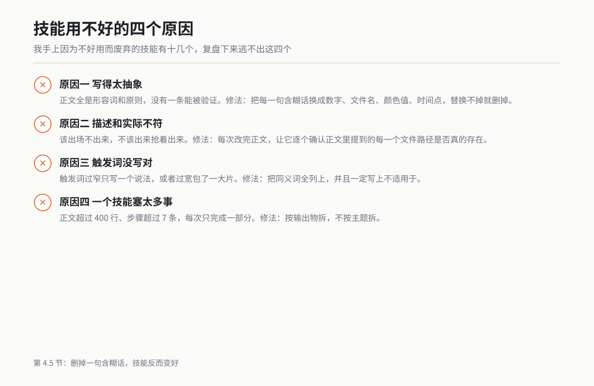

*图 4-5 技能不好用，八成逃不出这四个原因。作者根据公开资料绘制。*

## 4.6 三十多个已验证的技能能干什么

我本机技能目录里现在有一百七十来个技能，其中我自己常用、跑通过的三十多个。下面按五类列出，每类挑两三个。省时都是我自己估的，一律加"约"字。

**这张表不是让你照着装三十个，是让你看清技能能覆盖到什么地步，然后挑一两个最像的先抄。**

| 类别 | 技能名 | 它干什么 | 单次省下 |
|---|---|---|---|
| 数据整理 | markitdown-skill | PDF、Word、PPT、图片批量转 Markdown，带 OCR | 约 30 分钟 |
| 数据整理 | summarize | 一句话总结网页、PDF、音视频 | 约 15 分钟 |
| 数据整理 | deep-research | 结构化调研：先出大纲，再并行查，最后出报告 | 约 3 小时 |
| 报告生成 | md-to-pdf | Markdown 转排版干净的中文 PDF | 约 20 分钟 |
| 报告生成 | ppt-master | 诊断并重构现有 PPT，带失败回退 | 约 1 小时 |
| 报告生成 | competitive-analysis | 七步竞品分析，从目标定义到报告输出 | 约 4 小时 |
| 图纸与校核 | solidpilot-cad-build | 驱动 SOLIDWORKS 建模，并做闭式解验证 | 约 2 小时 |
| 图纸与校核 | gear-expert | 齿轮参数、渐开线、强度与精度的算式校核 | 约 40 分钟 |
| 图纸与校核 | motor-expert | 微电机电磁与控制的专业校核 | 约 40 分钟 |
| 试验与复盘 | nvh-expert | NVH 与异响问题的诊断路线建议 | 约 1 小时 |
| 试验与复盘 | workbuddy-daily-review-runbook | 每日复盘自动化，带缺文件时的回退 | 约 20 分钟 |
| 流程自动化 | git-workflow | Git 分支、提交、合入的规范流程 | 约 15 分钟 |
| 流程自动化 | task-pattern-tracker | 识别重复任务，30 天内 3 次就提示固化为技能 | 见下面说明 |
| 流程自动化 | planning-with-files | 用 Markdown 文件做跨会话的进度跟踪 | 约 30 分钟 |

最后那个 `task-pattern-tracker` 要单拎出来说。它本身不省时间，它的工作是盯着你：同一类任务 30 天里出现 3 次，它就提醒你"是不是该写成技能了"。

**发现该写技能的时机，比写技能本身更难。** 本章开头那个周四下午，如果我早装了它，我在第二个月月底就会被提醒，而不是拖到第五遍才发现。

完整清单，包括安装方式和已知坑位，见**附录 C：技能清单与安装源**。

## 4.7 如果你只做一件事

今天下班前，把今天做过的某一件活，写成你的第一个技能。

无需挑选。挑一件今天刚做完、你还记得清过程的活，热气没散，写起来最快。

判断标准只有一条：这件事你在过去一个月里做过两次以上。花的时间：**新手 15 分钟，熟练之后 5 分钟。**

具体做法，直接把下面这段话复制给 WorkBuddy：

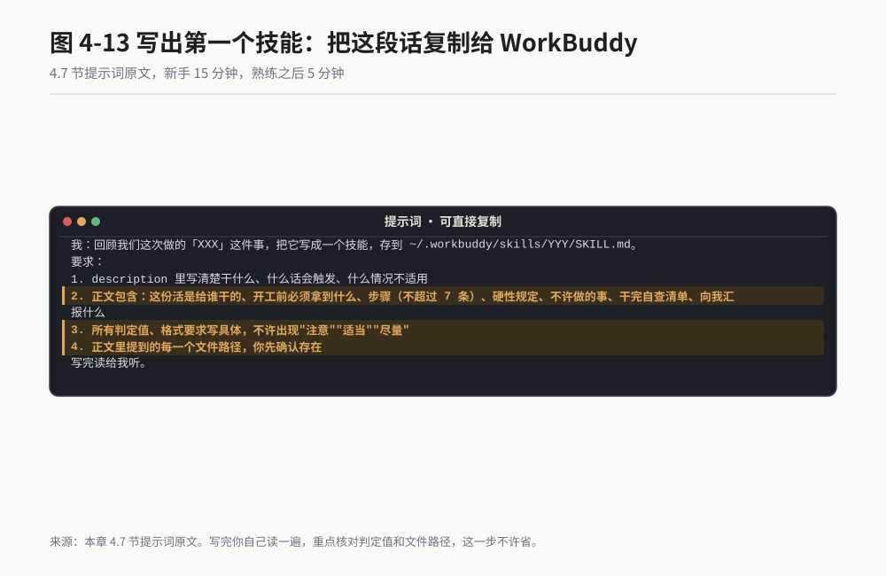

*作者根据公开资料绘制*

> 我：回顾我们这次做的「XXX」这件事，把它写成一个技能，存到 ~/.workbuddy/skills/YYY/SKILL.md。
> 要求：
> 1. description 里写清楚干什么、什么话会触发、什么情况不适用
> 2. 正文包含：这份活是给谁干的、开工前必须拿到什么、步骤（不超过 7 条）、硬性规定、不许做的事、干完自查清单、向我汇报什么
> 3. 所有判定值、格式要求写具体，不许出现"注意""适当""尽量"
> 4. 正文里提到的每一个文件路径，你先确认存在
> 写完读给我听。

然后**你自己读一遍**，重点是判定值和"不许做的事"。它总结的动作通常没问题，它总结的数字经常是它自己编的。

明天或下周你就用一次。要是发现哪一处格式做错了，别在对话里纠正它，打开 `SKILL.md` 把那一处改掉。改文件，不在对话里反复纠正。**这是本章唯一要求你做的动作。**

## 小白词典

**技能（Skill）**：一份说明文件，告诉 WorkBuddy 某一类活该按什么顺序干、交出什么算合格。类比新员工的岗位手册。

**SKILL.md**：技能的核心文件。开头是两个 `---` 之间的元信息，下面是给 AI 看的正文。

**元信息（frontmatter）**：文件最开头用两个 `---` 包起来的一小段配置，写技能名、描述、版本、权限。类比贴在箱子外的货运标签。

**触发词**：写在 description 里的那些话，AI 听到你说这些话就会加载这个技能。类比手机上的快捷指令。

**评测集**：一批用来给技能打分的测试题，通常来自历史任务记录。类比驾照考试的题库。

**模型打分（LLM-as-Judge）**：让另一个模型当裁判打分。类比同行评审，好处是能看懂语义，坏处是它自己也不稳。

**Bootstrap 检验**：重复抽样几千次，看两个版本的差距是真还是碰巧。类比同一批零件反复抽测。

**变体（variant）**：技能的某个改动版本，比如 v3。类比工程样件，一代一代往下改。

## 你的岗位怎么用

**设计工程师**：先写一个"出图前检查"技能，把你每次必查的十几项写进去。这是见效最快的一类，因为图纸出错很少错在计算，多半错在漏项。

再写一个"数模命名与归档"，按你们部门的图号规则来，这块每个厂差很多，只能自己写。

**试验工程师**：本章那个月度数据包技能可以直接套。你要做的第一件事是把判定值搬到 `references/` 里，因为试验判定值每年都在变，写死在正文里第二年一定有人出错。

**质量工程师**：写一个"来料检测报告整理"。重点放在"不许做的事"那一段：不许删行、不许合并、不许改判定值。你的活对可追溯性的要求比别人高，那一段是你最该下力气写的地方。

**采购 / 供应商管理**：写一个"供应商资质核查"，把核查项、有效期算法、脱敏规则写死。这条路收益最大，因为你每个月都要重来一遍，而且漏一项的代价最贵。

**项目经理**：写一个"周报生成"，把格式、必含项、风险分级写进去。你的回报不在省时间，在每周那十五分钟不用再重启大脑。

**研发主管**：你自己先写两个，用满一个月，然后把你用的那份发给组里。别从零开始制订团队标准，先有活的东西再有规矩。本章 4.2 节那个"六个技能三个月没人用"的例子，就是从零开始写标准最常见的下场。

## 本章交付物

**《我的第一个技能文件》**：一份能直接放进 `~/.workbuddy/skills/` 的 SKILL.md，写的是你一件做过两次以上的活。

怎么做：

1. 今天下班前，从今天的活里挑一件你做过两次以上的，写下名字（2 分钟）。
2. 把 4.7 节那段话复制给 WorkBuddy，让它生成第一版（3 分钟）。
3. **你自己读一遍**，重点核对判定值和文件路径（5 分钟）。这一步不许省。
4. 明天或下次做这件活的时候用它。做错一处，就去改文件，不在对话里纠正（5 分钟）。
5. 文件名加版本号，比如 `test-data-digest-v1.md`，改之前先留个副本。别用"最新版"这种名字，见 4.4 节最后那个 0.60 的教训。

我的经验：多数人写第二个技能，是因为第一个写完才发现，自己那些"不成文的做法"其实讲得清楚。我写完月度数据包技能之后，第二周又写了三个。

另外一个提醒：别一次性写十个。写完立刻用，用过一轮再改。**技能是养出来的，不是写出来的。**

## 本章金句

> 同一件事你教它第二遍，就是你自己的问题。

> 技能不提升 AI 的智商，它提升的是 AI 的稳定性。

> 提示词是一次性的交代，技能是写一次的规矩。

> 同一个工具，有人十分钟完工，有人往返八轮，差别不在工具，在你有没有把规矩写完。

> 技能不好用，通常不是它出错，是它在正确地做无用功。

> 没有真实使用记录的自我进化，加的每一段都正确，加完之后一分不涨。

---

*（下一章：记忆。技能解决的是"重复交代"的问题，记忆要解决的，是"它会自己记住什么、忘掉什么，以及怎么让它记住该记住的"。）*
