# 第 5 章 让它记住你和你的项目

> 换一个对话窗口它就不认识你了。不是它记性差，是你从来没让它记过。

2026 年 3 月的一个周二上午，我坐在工位上，第 9 次向一个 AI 介绍同一个项目。

那天我要它帮我做一件事：把 PJ-2318 项目的 47 份 DV 试验报告汇总成一张超差清单。活本身不难，难的是开头。我把对话窗口打开，开始交代背景：

> 我们做汽车微电机和智能执行器的，这次是一个充电口盖执行器，12 V 永磁直流微电机加两级行星齿轮箱，客户是某欧系平台，现在在 DV 阶段，今年 3 月要进 PV。报告表头照 2025 版模板，尺寸公差按 ISO 2768-m，图纸命名是 PJ2318-XX-XXX，超差放行要项目经理书面同意。客户真名不要写进外发文件。

打完这段话，我数了一下，218 个字。这 218 个字，我在过去两个月里打过 8 遍。

更烦的是第 6 遍之后的发现：我每次打的内容还不一样。有一次我忘了说"客户真名不要写进外发文件"，它给我生成的汇总表里，客户代号那一栏直接写了真名。我把那张表改了一遍才敢发出去。还有一次我说了图纸命名规则，但写成了 PJ-2318-XX-XXX，多了一个横杠，它后面生成的文件名全错。

那天上午我算了一笔账。两个月里，这类"重新自我介绍"平均每次 3 分钟，8 次是 24 分钟。加上因为漏说、说错而返工的两回，一共大概 50 分钟。50 分钟不是什么大钱，但它每一分钟都花在同一种烦躁上：我在跟一个明明见过我八次的同事，第九次握手时重新报一遍姓名和工号。

让我彻底改掉这个习惯的，是第 5 章要讲的这三样东西：它有三层记忆、我知道该往里面写什么、我知道喂完怎么验收。

## 5.1 三层记忆是什么

先把"记忆"这个词拆开。WorkBuddy 说的记住你的事，不是一件事，是三层。这三层各存各的东西，各管各的范围，搞混了就会出两种错：该全局生效的写进了项目里，换个项目就丢；该跟着项目走的写进了全局，换个项目就被旧规矩带偏。

| | 云端画像 | 用户级记忆 | 工作区记忆 |
|---|---|---|---|
| 存什么 | 你的身份、岗位、行业、语言与表达偏好 | 跨项目通用的工作习惯、常用格式、常用工具 | 某个具体项目的背景、术语、文件规则、审批流程 |
| 谁来写 | 它根据你的对话自动归纳 | 你直接说，或让它总结后确认 | 你写进记忆文件，或让它追加 |
| 什么时候生效 | 任何对话、任何项目 | 你这个账号下的所有对话 | 只在这个工作区、这个项目里 |
| 换项目还在吗 | 在 | 在 | 不在 |
| 忘了会怎样 | 每次都要重新介绍你是谁 | 每次都要重申格式和习惯 | 每次都要重讲一遍项目背景 |
| 类比 | 你这个人 | 你所在的部门 | 你手上的项目 |

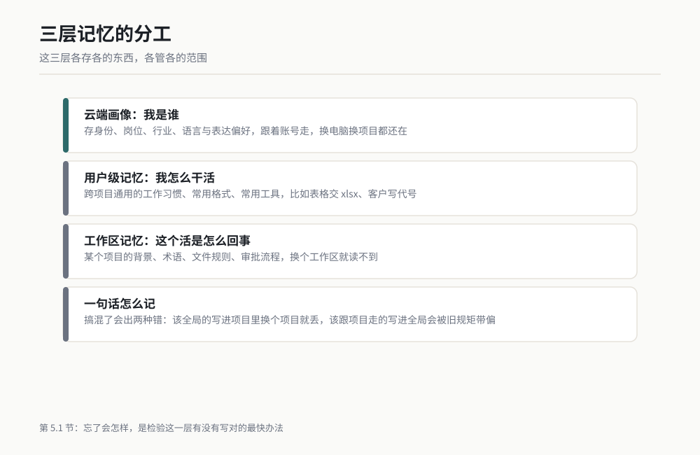

*图 5-1 三层记忆的分工与生效范围。作者根据公开资料绘制。*

三层用一句话区分：**云端画像是"我是谁"，用户级记忆是"我怎么干活"，工作区记忆是"这个活是怎么回事"。**

用我们公司的结构打个比方，这对工程师最好懂：

- **云端画像**像你的个人档案。上面写着你是研发工程师、做了十一年微电机和执行器、写文件用中文。这份档案跟着你走，你调到哪个项目组，它还是那份档案。
- **用户级记忆**像部门规章。你所在部门规定，技术报告的表头照 2025 版、数据一律交 xlsx 不交截图、术语第一次出现要括号标英文缩写。这些规矩跟你做哪个项目无关，只要你在干活，它们就成立。
- **工作区记忆**像项目档案柜。PJ-2318 的客户代号、图纸命名规则、超差放行的审批人，全在这个柜子里。你做 PJ-2402 的时候，这个柜子不打开。

我踩过的那个坑，正好是分层的反面教材。我最早把"客户真名不要写进外发文件"写进了工作区记忆，只在 PJ-2318 那个目录里生效。三个月后我在另一个项目里让它出一份外发的技术说明，它把那家客户的真名写上了。原因很简单：那条规矩根本不在它当时读到的记忆里。

后来我改了。这条规矩属于"我怎么干活"，于是我把它提到了用户级记忆，写成一条通用规则："任何可能外发的文件，客户一律用代号，代号清单见当前项目的记忆。"这样不管我在哪个项目，它都会先去查代号，查不到就来问我。

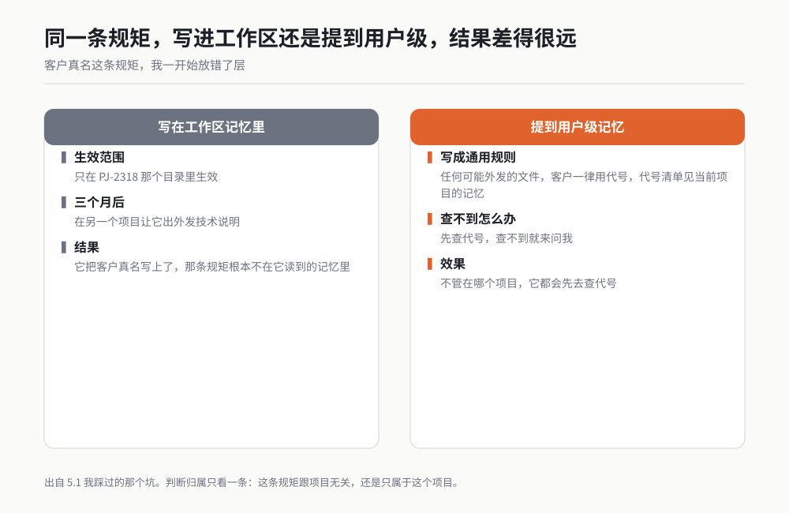

*作者根据公开资料绘制*

> 【待补：记忆的查看与编辑入口，以你使用的版本界面为准。通用原则是：用户级记忆有独立的配置入口或记忆文件，工作区记忆通常落在工作区根目录下的记忆文件里。】

## 5.2 该往记忆里写什么

记忆不是垃圾桶。我见过有人把一整份 80 页的技术标准全文塞进记忆，说"这样它以后就都知道了"。结果是他每次问别的事，回答里都混着那条标准的只言片语，像一个人背书背串了。

判断该不该写，只看一个标准：**这条信息，三个月后你还会用吗？** 会用的写，只此一次的别写。

| | 该写 | 不该写 |
|---|---|---|
| **身份与偏好** | 我是汽车零部件研发工程师，做微电机与智能执行器，11 年一线经验 | 我这周在忙一个临时的比价任务 |
| **表达与格式** | 技术文件用中文，术语首次出现括号标英文缩写；表格任务输出 xlsx | 这一份报告要写 2000 字 |
| **项目背景** | PJ-2318 是某欧系平台的充电口盖执行器，DV 阶段，3 月进 PV | 今天这批样品到了 12 件 |
| **文件与命名规则** | 图纸命名 PJ2318-XX-XXX，2D 出 PDF，三维源文件 CATIA | 上一版图纸存在 D 盘的某个文件夹里 |
| **审批与责任** | 图纸三级审，超差放行要项目经理书面同意 | 这次张工口头同意了放行 |
| **术语与代号** | 客户一律写代号；"A 厂"指齿轮箱供应商，"B 厂"指电机供应商 | 一整份标准的全文、一整本图纸的明细表 |

不该写的那三类的共同点是：它们有保质期。今天这批样品的数量、这次口头同意的放行、这个临时比价任务，三天后就是噪音。噪音进了记忆不会自己消失，它会一直占着位置，把你真正要用的那条规矩挤到后面。

还有一类不该写，是**大段原文**。80 页的标准不要塞进去，把它的位置写进去就够了："公司的尺寸公差标准全文在 `标准/ISO2768应用说明.pdf`，需要时先读这个文件。" 让它去读文件，比让它背文件靠谱得多。文件是死的，背下来的东西会串。

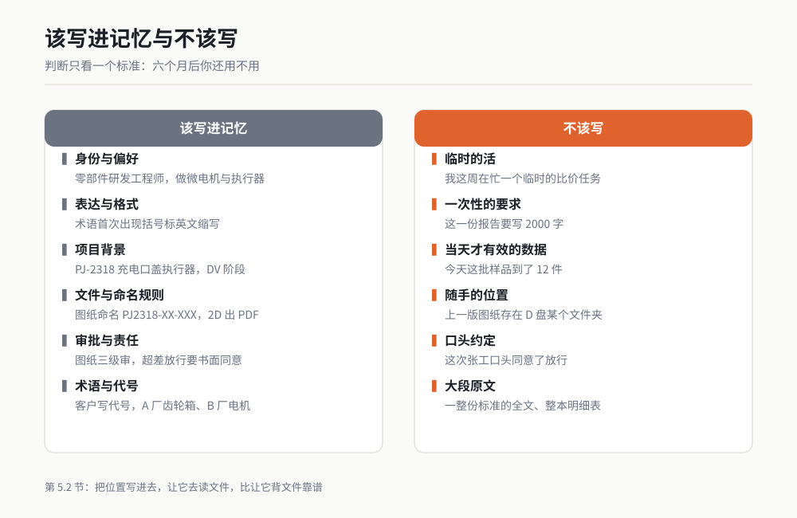

*图 5-2 用"六个月后还用不用"这一条线判断该不该写进记忆。作者根据公开资料绘制。*

## 5.3 怎么喂记忆：三种写法

知道该写什么之后，是怎么写进去的问题。我常用的有三种，从快到慢排。

### 写法一：直接说"记住……"

最快，适合一句话能说清的规矩。要点是两个：说完要它复述，复述对了才算写完。

```
记住三件事，以后默认照做，不用我再重复。

1. 我的身份：汽车零部件研发工程师，做汽车微电机与智能执行器，11 年一线经验。
2. 我写技术文件用中文，专业术语第一次出现时括号标注英文缩写，之后不再重复标注。
3. 凡是涉及表格的任务，交付物一律是 .xlsx 文件，不要把结果用文字描述给我让我自己抄。

现在把上面三条复述一遍，逐条对应。哪一条你没把握，直接说。
```

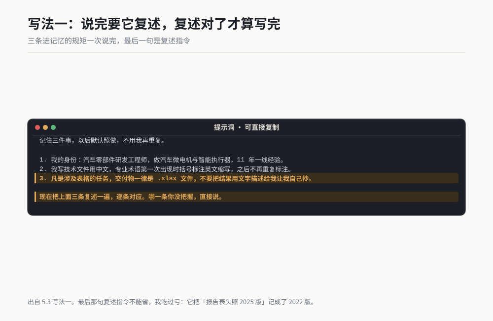

*作者根据公开资料绘制*

它的回复应当长这样：

> 已记住，复述如下：
> 1. 你的身份是汽车零部件研发工程师，方向为汽车微电机与智能执行器，有 11 年一线经验。
> 2. 技术文件用中文撰写，术语首次出现时括号标注英文缩写，后续不再重复。
> 3. 涉及表格的任务，交付 .xlsx 文件，不以文字描述代替。
> 三条均已写入用户级记忆。

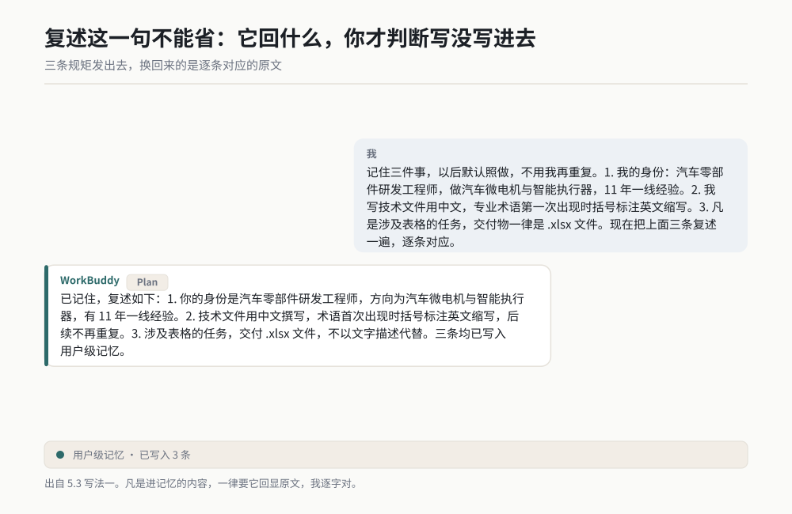

*作者根据公开资料绘制*

复述这一句"现在把上面三条复述一遍"不能省。我吃过亏：有一次我说完"记住我们报告表头照 2025 版"，它回了一句"好的，已记住"。三个月后我发现它写进记忆的是"报告表头照 2022 版"。就差一个数字，我那份报告被主管退回来重做。从此以后，凡是进记忆的内容，我一律要它回显原文，我逐字对。

### 写法二：让它自己总结，你确认后再写

适合刚干完一件比较复杂的活。这时候你和它都已经聊了很多轮，背景散在各处，你自己未必理得清哪些该留。让它先列，你来筛。

```
我们刚才一起做完了 PJ-2318 的 DV 数据汇总。请你做两件事。

第一件：从这段对话里，挑出那些"下次还会用到"的信息，最多 10 条，每条一行。
挑的标准是：这条信息六个月后我还用得上。

第二件：给每条标一个归属，只标两个值：
- [人]：属于我这个人的习惯或身份，跟项目无关
- [项目]：属于 PJ-2318 这个项目，换个项目就不成立

只列清单，先不要写入任何记忆文件。我确认之后你再写。
```

它会给出一份清单，通常长这样：

> 1. [人] 技术文件用中文，术语首次出现括号标英文缩写
> 2. [人] 表格类任务的交付物是 .xlsx
> 3. [人] 客户名写代号，不写真名
> 4. [项目] PJ-2318：某欧系平台充电口盖执行器，12 V 永磁直流微电机 + 两级行星齿轮箱 + 霍尔位置反馈
> 5. [项目] 当前 DV 阶段，2026 年 3 月进 PV
> 6. [项目] 图纸命名 PJ2318-XX-XXX，2D 出 PDF
> 7. [项目] 尺寸公差默认 ISO 2768-m
> 8. [项目] 超差放行要项目经理书面同意
> 9. [人] 数据要留单位，不写裸数字
> 10. [项目] 齿轮箱供应商称 A 厂，电机供应商称 B 厂

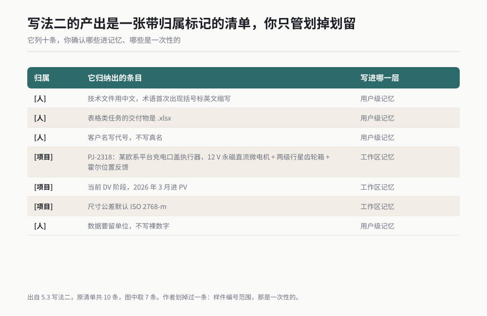

*作者根据公开资料绘制*

这份清单的价值在于你一眼能看出它归纳错了什么。我就靠这一招抓到过一条：它把"这批样品的样件编号范围"列进了 [项目]，我划掉了，因为那是一次性的。

确认的回复也要给死：

```
第 1、2、3、4、5、6、7、8、10 条写入记忆，第 9 条改成"所有数据必须带单位，包括角度和扭矩"。
第 4 条里补一句"用于充电口盖的开闭驱动"。
删掉你原清单里我划掉的那条样品编号。

写之前先把最终版本完整回显一遍，我说"确认"之后你再执行写入。
```

最后那句"我说确认之后你再执行写入"是这整套动作的关键。不给它这句，它会一边回显一边已经写好了，你划掉的内容已经在里面了。

### 写法三：直接写进记忆文件

最慢，也最可控。适合项目背景这种成块的内容，尤其是你想让整个团队共用同一份背景的时候。

做法是你自己按格式写好一段，让它追加进工作区的记忆文件。

```
打开当前工作区的记忆文件，在"项目背景"这一节下面追加下面这段内容。
不要覆盖已有内容，不要修改其他任何章节，只追加。

## 项目 PJ-2318
- 零件：充电口盖执行器，用于驱动充电口盖开闭
- 结构：12 V 永磁直流微电机 + 两级行星齿轮箱 + 霍尔位置反馈
- 客户：某欧系平台（对外文件一律写这个代号，不写真名）
- 阶段：DV 阶段，2026 年 3 月进 PV
- 供应商代号：A 厂 = 齿轮箱，B 厂 = 电机
- 文件规则：图纸命名 PJ2318-XX-XXX；2D 出 PDF，三维源文件 CATIA
- 报告规则：表头照 2025 版模板；尺寸公差默认 ISO 2768-m
- 审批规则：图纸三级审；超差放行必须有项目经理书面同意

追加完成后，把这一节的完整原文回显给我，我要逐条核。
```

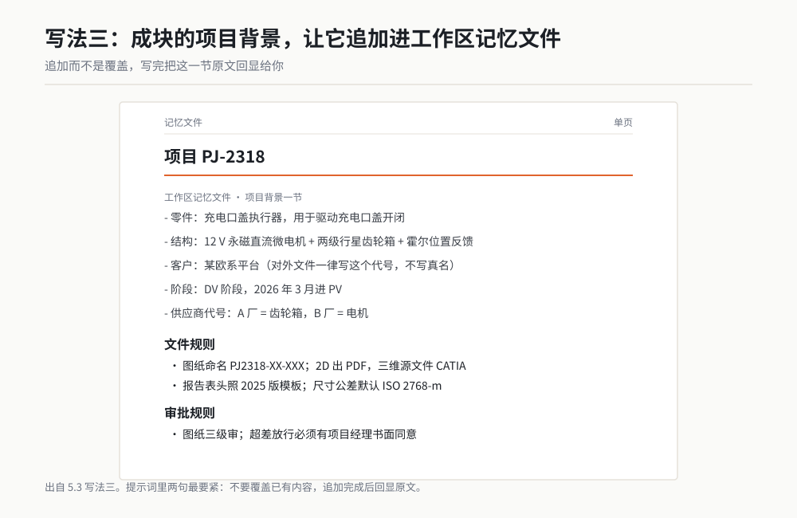

*作者根据公开资料绘制*

为什么要"回显"和"不要覆盖"这两句，我在写法一里说过一次，这里再说一次，因为它在这个场景下更致命。记忆文件是整个项目的档案柜，一句覆盖就没了。我第一次用这个写法时没写"不要覆盖"，它把文件重写了一遍，我原来那条"客户写代号"的规矩没了，而我是一个月后才发现的。

三种写法怎么选，一句话：**一句话的规矩用写法一，干完一件复杂活之后用写法二，成块的项目背景用写法三。**

## 5.4 记忆失效的三种情况与排查

喂进去了不代表能用。我遇到过的失效就三种，每一种的症状和治法都不一样。

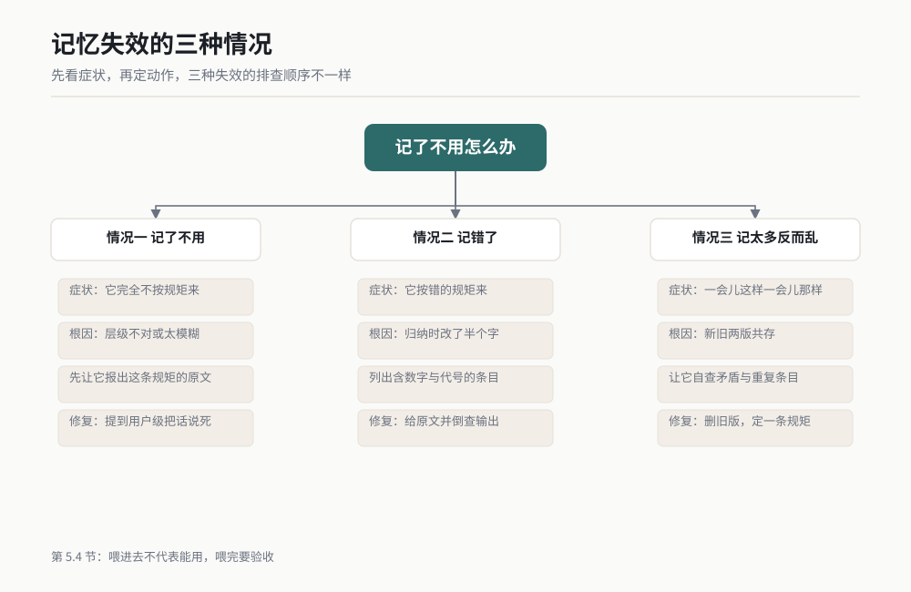

*图 5-3 三种记忆失效的排查顺序。作者根据公开资料绘制。*

### 情况一：记了不用

**症状**：你明明说过"表格任务输出 xlsx"，它这次又用文字描述了一堆数据，还得你自己抄。

**原因通常有两个**。一是你当初写进的层级不对，写进了工作区记忆，这次对话换了个工作区，它读不到。二是那条规矩写得太模糊，"输出表格"和"输出 .xlsx 文件"是两回事，它按前者理解，用 Markdown 表格回给你，也算"输出了表格"。

**排查动作**：先问它一句，别急着改。

```
你现在的记忆里，关于"表格类任务的交付格式"，写的是哪一条？把原文发给我。
原文里没有的那一条，就是它没生效的那一条。
```

**修复话术**：

```
这条规矩要改成跨项目通用的，写到用户级记忆，不要只写在当前工作区。
原文改为：凡是涉及表格的任务，交付物一律是 .xlsx 文件，生成到当前目录下，不要用
Markdown 表格或文字描述代替。改完回显原文。
```

### 情况二：记错了

**症状**：它记住了，但记的内容和你说的不一样。比如你说"ISO 2768-m"，它记成了"ISO 2768-f"；你说"2025 版表头"，它记成"2022 版"。

**原因**：它在归纳时做了"合理化"。它见过更多的 m 还是 f 我不知道，但结果是它把你说的往它认为更常见的那个方向改了半个字。这种错最阴，因为它不会报错，它会在你最信任它的那份报告里出现。

**排查动作**：定期抽查。我的习惯是每个月的第一周，让它把自己记忆里的核心条目列一遍，我花三分钟对一遍数字和代号。

```
把当前生效的所有记忆条目按"人 / 项目"两类列出来，每条一行，原文照抄，不要改写。
涉及标准号、版本号、代号、人名、日期的条目，单独放到一个分组里。
```

**修复话术**：

```
第 7 条记错了。原文应该是"尺寸公差默认 ISO 2768-m（中等）"，不是 2768-f。
请修正，并说明这条错误可能影响我们之前哪些输出，列出来。
```

最后那一句"可能影响我们之前哪些输出"是我后来加上的。有一次它记错了齿轮箱的减速比默认值，我让它倒查，它翻出三份报告里的传动计算都用了那个错值。那三份报告我全部重算了一遍。

### 情况三：记太多反而乱

**症状**：它开始答非所问，回答里混进别的项目的术语，或者一件事给你两套互相矛盾的做法。

**原因**：记忆里堆了互相打架的条目。最常见的是同一个规矩写了两遍，一个是三个月前的旧版，一个是新版，两条都在，它每次随机认一条。我在 2025 年底就吃过这个亏：报告表头我前后说过 2022 版和 2025 版，两条都在记忆里，它在这个项目用新版，在那个项目用旧版，我一度以为是软件抽风。

**排查动作**：让它自查冲突。

```
检查当前所有记忆条目，找出互相矛盾或重复描述的条目，成对列出来。
每条说明：矛盾点在哪，你认为该留哪一条，理由是什么。先不要删，我来判断。
```

**修复话术**：

```
保留 2025 版，删除所有提到 2022 版表头的条目。
以后遇到同一条规矩有新旧两版，直接删旧版，不要保留两版让我选。
删完把最终条目回显一遍。
```

三种失效放一起看：

| | 记了不用 | 记错了 | 记太多反而乱 |
|---|---|---|---|
| 你会看到 | 它完全不按规矩来 | 它按错的规矩来 | 它一会儿这样一会儿那样 |
| 根因 | 层级不对，或写得太模糊 | 归纳时把内容改了半个字 | 新旧两版共存 |
| 第一步排查 | 让它报出这条规矩的原文 | 让它列出所有含数字和代号的条目 | 让它自查矛盾条目 |
| 修复动作 | 提到用户级，把话说死 | 给正确原文，并倒查历史输出 | 删旧版，定一条"不留两版"的规矩 |
| 预防 | 写完当场回显 | 每月抽查一次 | 每次改规矩先删旧的 |

## 5.5 一次把新项目背景交代清楚 ★★★

这一节是本章的全部目的。前面四节都是零件，这一节组装。

我拿 PJ-2318 这个真实项目走一遍完整流程，客户和供应商全部脱敏。你照着这个结构，把你的项目填进去，四十分钟能做完，之后这个项目的所有对话都不用再介绍背景。

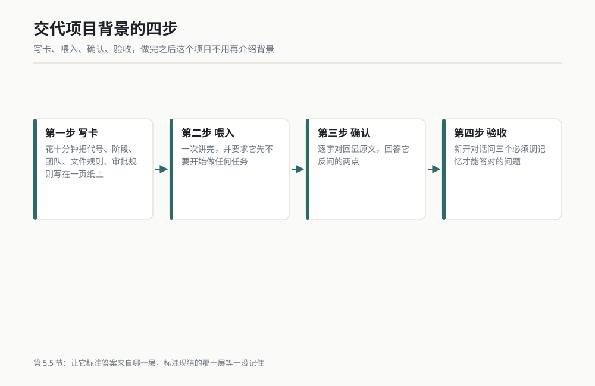

*图 5-4 项目背景从写到验的四步。作者根据公开资料绘制。*

### 第一步：写一页背景卡

不要边聊边说。先拿十分钟，把背景写在一页纸（或一段文字）上。我用的模板在本章末尾的"本章交付物"里，这里先给你看我填好的样子：

```
## 项目背景卡：PJ-2318

【项目】充电口盖执行器，用于驱动某欧系平台车型的充电口盖开闭
【代号】对外文件一律写"某欧系平台"，不写客户真名
【阶段】DV 阶段，2026 年 3 月进 PV
【结构】12 V 永磁直流微电机 + 两级行星齿轮箱 + 霍尔位置反馈
【团队】我（研发经理）+ 2 名设计 + 1 名试验；客户接口人走项目经理
【供应商】A 厂供齿轮箱，B 厂供电机
【文件规则】
  - 图纸命名 PJ2318-XX-XXX
  - 2D 交付 PDF，三维源文件 .CATPart
  - 报告表头照公司 2025 版模板
  - 尺寸公差默认 ISO 2768-m，关键尺寸单独标注
【审批规则】
  - 图纸三级审：设计自审 → 主管审 → 项目审
  - 超差放行必须有项目经理书面同意
  - 对外文件发出前，客户名必须复核一遍
【常用术语】
  - DV：设计验证；PV：生产验证
  - 执行器 = 微电机 + 减速机构 + 反馈元件的总成
【参考资料的位置】
  - 公差标准：标准/ISO2768应用说明.pdf
  - 2025 版表头模板：模板/技术报告表头_2025.docx
```

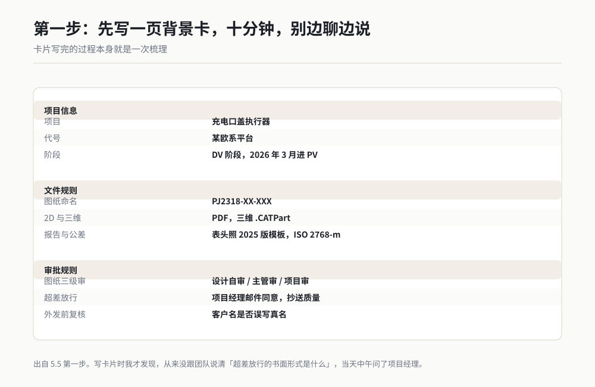

*作者根据公开资料绘制*

这一页我写完用了大概十分钟。它的价值在于：写的过程本身就是一次梳理。我写到【审批规则】的时候才发现，我从来没跟团队说清楚"超差放行要书面同意"到底指邮件还是签字件。当天中午我问了项目经理，答案是邮件，抄送质量。这条后来也写进了卡片。

### 第二步：一次性喂进去

卡片写好了，用一段提示词喂进去，一次讲完，不要分五次说。

```
我要开始一个新项目，下面是完整背景。请你先把这些内容写进当前工作区的记忆文件，
放在"项目 PJ-2318"这一节下，不要覆盖已有内容。

有一个要求先说清楚：写完之后，你不要开始做任何任务，只做两件事，
一是回显这一节的完整原文，二是回答我下面列的三个确认问题。我点头之后我们再开工。

背景卡内容如下：

（这里粘贴第一步那张完整的背景卡）

确认问题：
1. 上面这张卡里，哪几条属于"跟项目无关、以后所有项目都适用"的规矩？列出来，
   我会让你把这几条另外写进用户级记忆。
2. 上面这张卡里，有哪些地方你不确定、或者觉得我写得有歧义？逐条提出来问我。
3. 如果现在让你写一份给客户的技术说明，你会把客户名写成什么？把那一句话写出来给我看。
```

这段提示词里有三个设计，都是踩坑踩出来的。

**"先不要开始做任何任务"**。不给这句，它读完背景会顺着往下猜你要干什么，然后自作主张开始生成文件。我第一次喂背景的时候就是这样，它二十秒后给我写了三页项目计划，而我要的是它先记住。

**确认问题 1 是分层的**。让它自己把通用规矩挑出来，比我自己判断准。我原以为只有"客户写代号"是通用的，它挑出了四条，还包括"数据要带单位"，而那条确实是我所有项目都在用的。

**确认问题 3 是验收**。"你会把客户名写成什么"是一个具体的、有唯一正确答案的问题。它答对了，说明那条规矩真的进去了；它答"某欧系平台客户"或者把真名写出来，说明没进去或者进岔了。不要问"你记住了吗"，它永远回答记住了。

### 第三步：看它的确认回复，逐条对

它给的回复应当长这样。这是我那次的实际回复，删掉了两句废话：

> 已写入工作区记忆文件，"项目 PJ-2318" 一节。回显原文如下：
>
> ## 项目 PJ-2318
> - 项目：充电口盖执行器，驱动某欧系平台车型充电口盖开闭
> - 代号规则：对外文件一律写"某欧系平台"，禁止出现客户真名
> - 阶段：DV 阶段，2026 年 3 月进 PV
> - 结构：12 V 永磁直流微电机 + 两级行星齿轮箱 + 霍尔位置反馈
> - 团队：研发经理 1 名、设计 2 名、试验 1 名；客户接口经项目经理
> - 供应商代号：A 厂 = 齿轮箱，B 厂 = 电机
> - 文件规则：图纸命名 PJ2318-XX-XXX；2D 交付 PDF，三维源文件 .CATPart
> - 报告：表头照 2025 版模板；尺寸公差默认 ISO 2768-m，关键尺寸单独标注
> - 审批：图纸三级审（设计自审 / 主管审 / 项目审）；超差放行需项目经理书面同意；
>   对外文件发出前复核客户名
> - 术语：DV = 设计验证，PV = 生产验证；执行器 = 微电机 + 减速机构 + 反馈元件总成
> - 参考文件位置：标准/ISO2768应用说明.pdf、模板/技术报告表头_2025.docx
>
> 回答你的三个问题：
>
> 1. 属于通用规矩的有四条：客户名写代号；报告表头照最新版模板（版本号会变，建议写成
>    "照当前最新版"）；数据必须带单位；对外文件发出前复核客户名。这四条建议你另外写入
>    用户级记忆。
> 2. 有两点想跟你确认：
>    - "书面同意"具体指邮件还是签字件？两者在流程上不一样。
>    - "关键尺寸单独标注"，关键尺寸由谁定？是你在图纸上标，还是有一份关键特性清单？
> 3. 我会写成："本项目为某欧系平台开发的充电口盖执行器。"

这份回复我要做的动作只有三个：

**动作一，逐字对原文。** 我拿它回显的九条，跟我卡片上的九条一条一条对。那天对下来只有一处措辞不一样：我写的是"客户接口人走项目经理"，它写成"客户接口经项目经理"，意思一样，我放过了。真正的硬伤它自己没有，是我在第二步的确认问题里逼出来的。

**动作二，回答它反问的两点。** 它问的两点都是真问题。"书面同意"我当天中午问清楚了，是邮件抄送质量，我让它改；"关键尺寸由谁定"我答了"有一份关键特性清单，清单在 `项目/关键特性清单.xlsx`，需要时先读"。这两问的价值超过我那张卡片本身，因为它问的正是我自己都没想清楚的地方。

**动作三，把那四条通用规矩提到用户级。** 回复里它对第一条的判断是对的，而且它建议把"2025 版模板"改成"照当前最新版"，这个建议我采纳了。版本号会变，写死的数字迟早是坑。

```
第 1 条里你列的四条通用规矩，写入用户级记忆，原文按下面这版：
- 任何对外或可能外发的文件，客户名一律用代号，代号查当前项目记忆，查不到就问我
- 技术报告表头照公司当前最新版模板，不要写死年份
- 所有数据必须带单位，角度和扭矩也不例外
- 对外文件发出前，复核一遍客户名是否误写真名

另外，PJ-2318 那一节做两处修改：
- "超差放行需项目经理书面同意"改为"超差放行需项目经理邮件同意，邮件抄送质量"
- 术语部分补一句：关键尺寸以 `项目/关键特性清单.xlsx` 为准，需要时先读该文件

改完，把用户级记忆那四条和 PJ-2318 那两处，一起回显给我。
```

### 第四步：下次开新对话，验收它真的记住了

喂完不验收，等于没喂。验收动作只有一句，开一个新对话窗口，问它三个必须用记忆才能答对的问题。不要问"你还记得 PJ-2318 吗"，这种是非题它永远答是。

```
新的对话，三个问题，每个答案不超过两行，只回答，不要开始任何任务：

1. PJ-2318 是什么零件，用在哪，现在什么阶段？
2. 我要出一份 2D 图纸，文件名该怎么命名，交付什么格式？
3. 有一处尺寸超差了，放行需要什么？

答完之后，告诉我你的每道题的答案分别来自哪一层记忆（用户级 / 工作区 / 你现猜的）。
```

最后那一句"分别来自哪一层"是我加上去的，很管用。有一次它第三题答对了，但标注是"你现猜的"，我一看就知道那条根本没进去，只是它根据常识蒙对了。蒙对一次不算记住。

三个答案我核对的标准：

- 第 1 题必须答出"充电口盖执行器""某欧系平台""DV 阶段，3 月进 PV"。少一个就回去补。
- 第 2 题必须答出"PJ2318-XX-XXX"和"PDF"。它如果答成"按公司命名规则"，说明没记住，回去把话说死。
- 第 3 题必须答出"项目经理邮件同意，抄送质量"。只答"项目经理同意"不算过，漏了抄送质量。

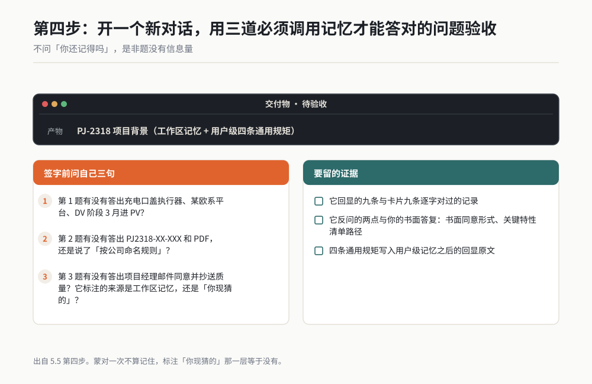

*作者根据公开资料绘制*

三个全对，这个项目的背景才算交代完了。从写卡到验完，我那次用了 42 分钟。

### 这套动作后来替我省了什么

2026 年 6 月，PJ-2318 进 PV 阶段，客户那边临时要一份英文版的技术说明和一份超差清单。两份东西都要得急，当天下午就要。

我开了个新对话，说了一句：

> 用 PJ-2318 的项目背景，写一份英文版技术说明，客户名按代号规则写，格式照报告表头。另外把 DV 阶段的超差项列成一张 xlsx，标出哪些已经放行、放行的依据是什么。

它从工作区记忆里读了项目背景，从用户级记忆里读了代号规则和格式规矩，从参考文件位置里读了表头模板，然后开干。中间问过我一次："超差清单里第 14 项在记忆里没有放行记录，这份清单里要怎么标？"

四十分钟，两份东西出来了。技术说明 6 页，超差清单 31 行，其中 28 行有放行记录，剩下 3 行标了"待补放行依据"。

我核对了那 3 行，确实没有书面放行。这三行最后走的是另一条流程。

这次如果按 3 月之前的做法，我大概要花的时间是：重新介绍背景 3 分钟，来回确认格式 10 分钟，客户名返工 1 次，一共 50 分钟往上，而且那份技术说明大概率还会带着客户真名出去。42 分钟的投入，在这一次就回本了。它后面还在继续回本。

### 这一节的翻车清单

- **一次说不完就分次说，结果前后矛盾。** 一条规矩分三次说，三次说法不一样，记忆里就有三条。要么一次给全，要么每次改之前先删旧的。
- **喂完立刻开工。** 它还没写稳你就开始派活，前面几轮的输出会用旧规矩。喂完先回显、先对、再开工。
- **验收只问"记住了吗"。** 是非题没有信息量。要问需要调用记忆才能答的具体问题，而且要它标注答案来自哪一层。

## 5.6 隐私与安全：什么绝对不要写进记忆

这一节请当作硬性规定读。

记忆有个特性，很多人没意识到：**写进记忆的东西，会在之后的每一次对话里被调出来用，而且它可能随你的账号同步。** 你在 PJ-2318 项目里写的东西，有可能在你给另一个客户做方案时被想起来。这跟把文件存在本地文件夹不是一回事。

一句话记住这一节：**写进记忆等于交出去。**

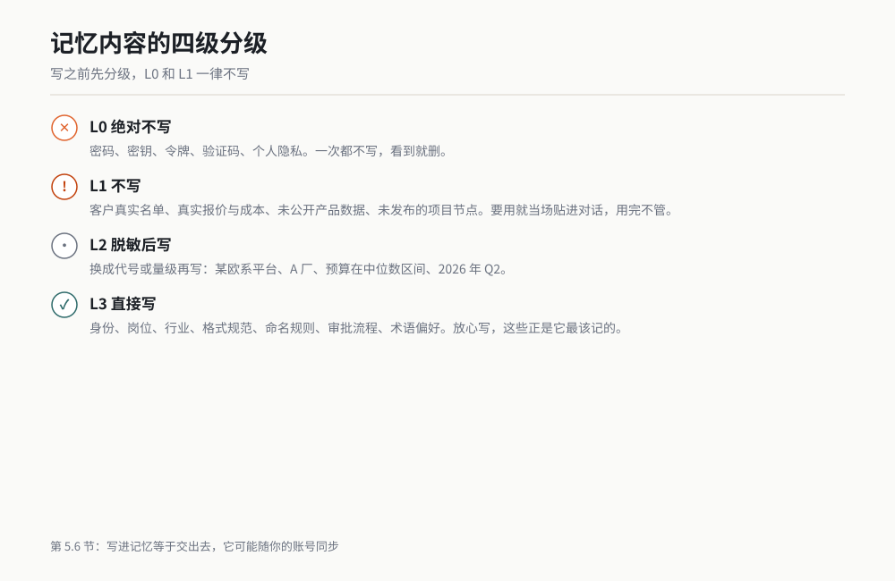

*图 5-5 记忆内容的四级分级清单。作者根据公开资料绘制。*

| 级别 | 内容 | 例子 | 处理 |
|---|---|---|---|
| **L0 绝对不写** | 密码、密钥、令牌、验证码、个人隐私 | 各类账号口令、服务器密钥、身份证号、他人手机号 | 一次都不写，看到就删 |
| **L1 不写** | 客户真实名单、真实报价与成本、未公开产品数据、未发布的项目节点 | 给某客户的实际单价、未发布的车型年款规划、尚未公开的性能指标 | 不写。要用就当场贴进对话，用完不管 |
| **L2 脱敏后写** | 客户与供应商身份、价格量级、项目时间 | "某欧系平台""A 厂""B 厂""预算在中位数区间""2026 年 Q2" | 换成代号或量级再写 |
| **L3 直接写** | 身份、岗位、行业、格式规范、命名规则、审批流程、术语偏好 | "研发工程师，做微电机与智能执行器""图纸出 PDF""超差放行要邮件" | 放心写，这些是它最该记的 |

L0 那一行不需要解释。密码进了记忆，就是把你家钥匙交出去。

L1 是最容易犯的。我在写这一节之前，自己记忆里就躺着一条"给 A 厂的齿轮箱目标价区间"。它当时是好记，但它的风险是：我在跟 B 厂谈的时候，如果问到同类零件，它有可能把 A 厂那个数想起来，混进给 B 厂的材料。这种错一旦发生，不是返工的问题。我现在处理价格信息的方式是：当场贴进对话，用完就完，绝不进记忆。

L2 的脱敏有个具体做法，我一直在用：

- 客户名一律换代号，"某欧系平台""某日系平台""A 厂""B 厂"，代号和实际名的对照表自己留着，别给 AI。
- 价格换成量级，"单件成本在两位数区间""报价比上一版低一个量级"，够它理解语境，不够它出事。
- 时间换成季度，"2026 年 Q2 进 PV"，比精确日期安全，而且对它的理解和精确日期一样。

L3 是记忆该装的东西。你会发现，这一整章讲的技术规范、格式规矩、审批流程，全在 L3。真正让 AI 好用的信息，恰好是最不敏感的那一类。这是个好消息：你不需要拿机密去换效率。

最后给一条检查动作。每个季度做一次，五分钟：

```
把当前所有记忆条目列一遍，逐条检查有没有属于下面任一类的内容：
密码、密钥、令牌、个人身份信息、客户真名、具体价格、未公开的产品数据。
有的话列出来，标出条目编号，等我确认后删除。不要自行删除，先报告。
```

## 5.7 如果你只做一件事

如果这一章你只带走一样东西，就带这个：

**今天下班前，给你手上最主要的那个项目，写一页背景卡，喂进去，然后开个新对话验收三个问题。**

四十分钟。做完之后，这个项目上你跟 AI 说的每一句话，都不用再从"我们是做什么的"开始。

至于三层记忆的区分、该写什么不该写什么、失效怎么排查，那些是这个动作做完之后，你自然会回来查的东西。先有卡片，再谈优化。

## 小白词典

**记忆**：AI 工具把你交代过的背景、偏好、规矩存下来，下次对话直接调用的能力。网页聊天框换一个窗口就忘，WorkBuddy 分三层存。

**云端画像**：跟着你的账号走的那层记忆，存你的身份、岗位、行业、语言偏好。换电脑换项目都还在。

**用户级记忆**：你这个账号下的通用工作习惯，比如"表格交付 xlsx""客户写代号"。跨项目生效。

**工作区记忆**：跟着某个具体文件夹或项目走的那层记忆，存项目背景、命名规则、审批流程。换个工作区就读不到。

**记忆文件**：存工作区记忆的那个文件，通常放在工作区根目录下。你可以让它读、让它追加，也可以自己改。

**Prompt（提示词）**：你对 AI 说的那段完整的话。本书所有提示词都放在代码块里，可以整段复制。

**脱敏**：把真实的名字和数值换成代号或量级。"某欧系平台"是客户名脱敏，"两位数区间"是价格脱敏。

**回显**：让它把它刚写进去的内容原文再打一遍给你看。这是验收记忆的唯一可靠动作。

**幻觉**：AI 把不知道的东西说得煞有介事。记忆里记错的标准号，属于幻觉的一种。第 17 章专讲。

## 你的岗位怎么用

**设计工程师**：把你的图纸命名规则、默认公差标准、常用材料代号写进用户级记忆。再给每个在跑的项目建一份工作区背景卡。这两件事做完，你让它出图纸和 BOM 时，开头那三分钟的背景交代全省了。

**试验工程师**：把试验报告的模板版本、测点命名规则、数据单位规矩写进去。NVH 和台架试验的通道命名各家长得都不一样，写死了它才不会给你混。

**质量工程师**：把"超差放行的审批链"和"客户代号规则"写进用户级，这两条最容易被漏说，也最容易出事。写完之后按 5.5 第四步的问题 3 验一次。

**采购 / 供应商管理**：供应商一律代号化（A 厂 B 厂），价格一律量级化，绝不进记忆。可以进记忆的是你的比价表格式、资质核查的必查项清单、证书有效期的提醒规则。

**项目经理**：你手上项目最多，工作区记忆对你价值最大。给每个项目一张背景卡，卡里固定包含阶段、节点、接口人、审批链四项。这四项是它替你写周报和风险表时要反复用到的。

**研发主管**：把团队的通用规矩（文件格式、命名、审批层级）写成一份用户级记忆，让全组共用同一份。新同事入职那天照着这份喂一遍，比让他看两周文档快。

## 本章交付物

**一页项目背景卡模板**。下面这段可以直接复制，把括号里的内容换成你的项目。

```
## 项目背景卡：【项目代号】

【项目】这是什么零件/产品，用在哪
【代号】对外文件里客户怎么写（脱敏代号，不写真名）
【阶段】当前阶段，下一个节点在什么时候
【结构/组成】主要组成部分，一行写完
【团队】几个人，各自负责什么，对外的接口人是谁
【供应商】有哪些供应商，各自供什么，用什么代号
【文件规则】
  - 命名规则（给一个完整的例子）
  - 交付格式（2D / 3D / 报告各是什么格式）
  - 报告模板版本
  - 默认公差或默认标准
【审批规则】
  - 图纸几级审，谁审
  - 超差放行要谁的什么形式的同意
  - 对外文件发出前必须复核哪几项
【常用术语】列出 3-6 个，每个一句话
【参考资料的位置】标准、模板、清单各自的文件路径
```

**怎么做**：

1. 花十分钟填完这十项。填不出来的一项不要空着，写"待定"，然后当天去问清楚。我填 PJ-2318 那次，待定的是"书面同意的形式"，问完之后补上的是"邮件，抄送质量"。
2. 用 5.5 第二步那段提示词，整段喂进去。一次讲完，不要分次。
3. 拿它回显的原文，跟你填的卡逐条对。数字、代号、日期一个一个对。
4. 回答它反问你的问题。它问的地方通常是你自己没想清楚的地方。
5. 开一个新对话，用 5.5 第四步那三个问题验收。三个全对才算完。

**我的经验**：这张卡填完的最大收益不是省时间，是逼我把规矩想清楚。我做了十一年研发，第一次发现自己从来没跟团队讲清"超差放行的书面形式是什么"。这件事是 AI 问出来的。卡片填完三个月后我回头看，它替我省下的时间大概每小时一次对话三分钟，真正值钱的是它把那些含糊的规矩变成了白纸黑字，全组都能照着用。

## 本章金句

> 换一个对话窗口它就不认识你了。不是它记性差，是你从来没让它记过。

> 云端画像是"我是谁"，用户级记忆是"我怎么干活"，工作区记忆是"这个活是怎么回事"。

> 判断该不该写进记忆，只看一条：六个月后你还用不用。

> 不要问它"你记住了吗"。要问一个必须调用记忆才能答对的具体问题。

> 写进记忆等于交出去。密码不写，价格不写，客户真名不写。

> 蒙对一次不算记住。让它标注答案来自哪一层，现猜的那一层等于没有。

---

*（下一章：子代理。当一件事大到一个 AI 干不利索，就把它拆成几个各有专长的分身，你当那个派活的人。）*
