# 第 6 章 一个干不完，就拆开分给几个

> 一个 AI 干到发糊时，先别换更强的，先把活拆开分给几个。

我第一次把一份约 200 页的某行业标准整份交给 AI，是想让它直接做成设计检查清单。我说得很痛快："把所有要求提出来，分类，补上风险，再做一份汇报。"它开头干得像模像样，列出一批检查项。往后翻，我发现同一条温度要求出现了两个版本，一处写"必须验证"，另一处写"建议关注"；到了标准后半段，它开始把连续几页内容压成一句"其余要求类似"。

我追问：

> 我：后半部分的一项验证条件为什么没进检查表？
>
> AI：可能在归纳时被合并了，我可以补充。
>
> 我：那前面还有多少条被合并了？
>
> AI：无法仅根据当前结果准确判断。

这句话让我停下来了。它已经忘了自己前面怎么取舍，我也没法从成品倒查遗漏。那次我没有继续催它"认真一点"，而是把活改成几份：两名临时助手分段摘要求，一名助手专查漏项和重复，一名助手做风险表，最后由主代理汇总。文件还是那份文件，任务还是那件任务，结果却第一次变得能查、能改、能验。

这一章讲的就是这套方法：什么时候该拆，按什么拆，怎么把每一份活交清楚，以及几个子代理交回来的东西怎样合成一件完整交付物。

## 6.1 子代理是什么：给主代理配几名临时助手

**子代理**可以先理解成主代理临时叫来的助手。主代理接住你的总任务，负责分工、收件和汇总；每个子代理只拿到其中一块，按自己的完成标准交回结果。

它很像项目组长带几名专员。组长不会让每个人都从第一页看到最后一页，再各写一份总报告。他会让甲核条款，乙查风险，丙做汇报，最后自己收口。也像总装线上的工位：每个工位动作有限、输入明确、检查方法固定，整条线才不会越干越乱。

子代理通常是临时的。任务结束，它的工作就结束。它不需要知道你全部项目经历，也不需要参加每一次讨论。它只需要拿到完成当前小任务所需的材料、规则和交付格式。

| 比较项 | 一个代理干到底 | 拆给多个子代理 |
|---|---|---|
| 注意范围 | 同时记目标、材料、格式、风险，越往后负担越重 | 每个只盯一块，范围较小 |
| 处理方式 | 从头做到尾，中途出错会带到成品 | 分块处理，单块可以重做 |
| 查错难度 | 只能从总结果倒查，难找漏在哪 | 能追到具体子任务和来源 |
| 速度 | 大多按顺序推进 | 独立小块可以同时推进 |
| 统一性 | 一个人写，口吻通常统一 | 需要预先规定字段和口径 |
| 适合任务 | 小、短、一步能验 | 大、可分、有多种交付物 |

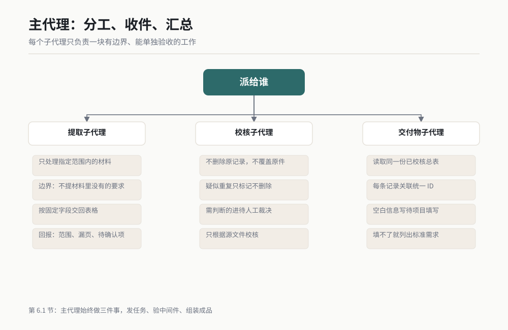

*图 6-1 主代理分工、子代理交件、主代理验收的基本结构，作者根据公开资料绘制。*

多叫几个子代理，并不会自动得到更好的结果。项目组多招几个人，也可能只是多开几场会。真正有效的地方在于：**每个子代理只负责一块有边界、能单独验收的工作。**

这里还有一个容易误会的点。拆分不等于所有工作都同时做。有些子任务能并行，比如把四份互不依赖的文件分别摘要；有些必须接力，比如先提取要求，再根据要求做风险表。子代理解决的是分工问题，并行只是其中一种安排。

## 6.2 什么活值得拆：先看三件事

我判断一个任务要不要拆，只看三个问题：各块能不能分开做，边界能不能写清楚，单块能不能独立验收。三个答案大多为"能"，就值得拆。只占一个，先让一个代理做更省事。

| 判断 | 特征 | 工程场景 | 建议 |
|---|---|---|---|
| 值得拆 | 文件之间相对独立 | 逐份审阅 8 份供应商技术资料，统一输出缺项表 | 按文件拆，统一字段后并行 |
| 值得拆 | 步骤之间交付清楚 | 先从规范提要求，再做检查表，最后做汇报 | 按步骤接力，每步验完再交下步 |
| 值得拆 | 同一材料需要多种视角 | 同一份设计说明分别做需求、质量和试验审查 | 按角色拆，最后处理分歧 |
| 值得拆 | 单块可以独立复核 | 每个章节都能用页码和条款号回查 | 给每块规定来源字段 |
| 不值得拆 | 前后强依赖 | 修改一个控制参数后，后续计算全部要重算 | 交给一个代理连续处理 |
| 不值得拆 | 必须保持同一口径 | 给客户写一页正式结论，措辞要由一人负责 | 一人主写，另一人只校核 |
| 不值得拆 | 总量很小 | 一页会议纪要提 5 个行动项 | 直接做，拆分反而增加交接 |
| 不值得拆 | 无法单块验收 | "大家分别看看有没有问题"，没有检查项 | 先定义检查方法，再决定拆法 |

**可并行**，指两块活互相不等结果。甲在审 A 文件时，乙可以同时审 B 文件。**边界清晰**，指一句话能说清谁做哪一段、哪些内容不归他。**单块独立可验**，指不等总报告出来，你已经能判断这块合不合格。

举个我常见的反例。一个项目经理把"分析项目为什么延期"拆给三名子代理，每个人都看全部会议纪要，也都写原因、责任和建议。结果三份报告内容重叠，结论还互相冲突。这不叫分工，只是把同一道题复印了三份。

改法很简单：甲只建立计划变更时间线，乙只统计输入物延期记录，丙只核对风险登记和措施状态。三人的证据能分别验，主代理再根据证据写结论。这样才值得拆。

## 6.3 怎么拆：文件、步骤、角色三种刀法

拆活没有万能模板。我最常用三种刀法：按文件拆，按步骤拆，按角色拆。先找材料的自然边界；找不到，再看流程；流程也揉在一起，就让不同角色从各自角度审同一份材料。

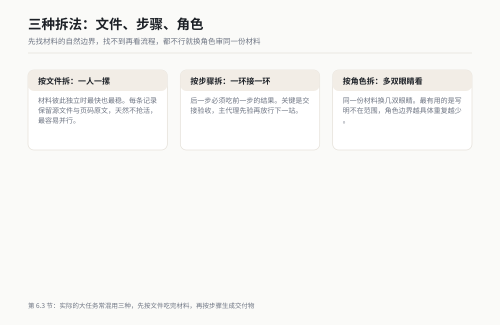

*图 6-2 三种拆法：按文件并排、按步骤接力、按角色会审，作者根据公开资料绘制。*

### 6.3.1 按文件拆：一人一摞，最快也最稳

有一次我要整理一个项目文件夹，里面是若干份需求说明、试验记录和问题清单。文件彼此独立，目标都是提取"来源、要求、当前状态、待确认项"。这种活最适合按文件拆。

我会拆成下面几份子任务：

1. 子任务 A：只读需求类文件，提取带来源的要求清单。
2. 子任务 B：只读试验类文件，提取条件、结果和异常。
3. 子任务 C：只读问题类文件，提取责任人字段、计划日期和当前状态。
4. 主代理：统一三个表的字段名，检查重复项，生成项目总览。

按文件拆的优点是天然不抢活。A 不碰试验记录，B 不解释问题责任。它也最容易并行，因为每个人都不等别人。

风险也很明确：不同文件可能说的是同一件事。解决办法是给每条记录保留"源文件 + 页码或位置 + 原文摘录"。合并时看到两条相似内容，主代理能回源判断是重复，还是同一要求在不同阶段的变化。

### 6.3.2 按步骤拆：上一站交件，下一站开工

我做失效分析材料时，常用按步骤拆。原始输入很杂，后一步必须吃前一步的结果，硬并行只会让每个人各猜一套前提。

子任务清单可以这样排：

1. 子任务 A：整理现象、发生条件和已知事实，不下原因结论。
2. 子任务 B：读取 A 的事实表，列出待验证的原因假设和所需证据。
3. 子任务 C：读取事实表与验证结果，形成原因树和排除记录。
4. 子任务 D：读取已确认结论，生成汇报材料和后续行动清单。

这里的关键动作是"交接验收"。A 的事实表如果把推测混进事实，B 会沿着错误方向设计验证；B 漏了关键证据，C 的原因树再漂亮也站不住。

所以每一步结束，我都让主代理先验，再放行下一步。按步骤拆通常不会让总时间缩短一半，但它能把错误挡在前一站，不让错误一路滚到最终报告。

### 6.3.3 按角色拆：同一份材料，换几双眼睛看

设计评审适合按角色拆。同一份方案，需求人员看功能有没有漏，质量人员看失效和控制，试验人员看条件能不能执行，项目人员看日期和依赖。材料相同，问题清单却不同。

我会这样分：

1. 需求审查员：只查需求是否完整、可验证、来源明确。
2. 质量审查员：只查风险项、预防措施和检出方法是否对应。
3. 试验审查员：只查样件、设备、边界条件和判定值是否齐全。
4. 项目审查员：只查输入、输出、责任和计划之间是否有冲突。
5. 主代理：合并问题，标记冲突，不替专业人员擅自裁决。

按角色拆最容易出现"互相打架"。例如质量审查员希望增加验证项目，项目审查员认为当前节点来不及。主代理不应自行选边，它要把分歧写成一条待决策项：方案、证据、影响、需要谁决定。

实际的大任务常会混用三种拆法。先按文件把材料吃完，再按步骤生成交付物，关键节点再按角色复核。后面的完整演示就是这种组合。

## 6.4 委派的话术：每份活都要带完成标准

我早期派子代理，只写一句"请审一下这份文件"。它确实审了，但我不知道它审了什么，也不知道怎样算审完。后来我固定使用七个部分：任务、输入、边界、输出格式、完成标准、禁止动作、回报方式。

完成标准是最容易漏的一项。"输出一个表"只是产出形式，"每条记录都有来源位置，无法确认的内容进入待确认列，检查完指定范围后报告覆盖情况"才叫完成标准。

### 示例一：按文件拆的委派提示词

```text
你是文件审阅子代理 A。

任务：审阅文件夹“[需求资料路径]”中的全部 PDF 文件，提取可验证的技术要求。

输入范围：只处理该文件夹中的 PDF；不要读取同级其他文件夹。

工作边界：
1. 只提取原文明确提出的要求，不补写文件中没有的要求。
2. 不做风险评级，不给设计方案，不改源文件。
3. 遇到扫描不清、表格断裂或上下文不足时，标记为“待人工确认”。

输出：生成“子任务 A_需求提取.xlsx”，字段固定为：记录 ID、源文件、页码、章节、原文摘录、要求对象、要求动作、验证线索、待确认项。

完成标准：
1. 指定文件夹内每个 PDF 都有处理状态。
2. 每条要求都能通过源文件和页码回查。
3. 空白字段写“未提供”，不能自行猜测。
4. 文件末尾附处理统计：已处理文件、未处理文件及原因、待人工确认项数量。

完成后只汇报：输出文件路径、处理过的文件清单、未处理项和需要主代理决定的问题。
```

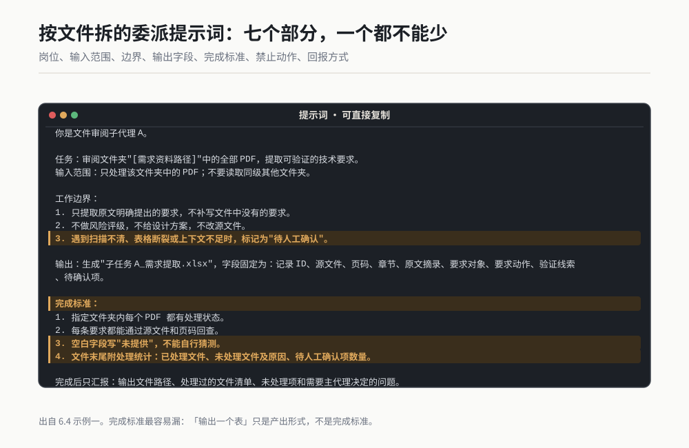

*作者根据公开资料绘制*

第一句给它岗位，限制它用什么眼光看。输入范围负责关门，避免它顺手翻到旧版本。工作边界写清"做什么"和"不做什么"，能直接减少重复劳动。

输出字段决定以后能不能合并。完成标准中的"每个文件有处理状态"防止它只挑容易读的文件；"能回查"防止它给出无来源结论；最后的回报方式让主代理能快速验收，不必再问一轮。

### 示例二：按步骤拆的委派提示词

```text
你是流程第 2 步的风险分析子代理。

前置输入：
- “[上一步要求清单路径]”
- “[项目边界说明路径]”

任务：根据已经确认的要求清单，生成风险初筛表。

工作边界：
1. 只能引用前置输入中的要求，不新增要求。
2. 每个风险必须关联至少一个要求记录 ID。
3. 证据不足时写“待评审”，不要替项目团队下最终结论。

输出：生成“第2步_风险初筛.xlsx”，字段固定为：风险 ID、要求记录 ID、偏离情形、可能影响、现有控制、缺口、建议检查动作、状态。

完成标准：
1. 要求清单中的每条有效记录都有风险处理状态。
2. 同一风险关联多条要求时保留全部记录 ID。
3. “现有控制”与“建议检查动作”分列，不得混写。
4. 输出一张待评审清单，列出所有证据不足项。

禁止修改前置输入文件。完成后汇报输出路径、覆盖情况、待评审项和发现的输入问题。
```

这个提示词最重要的一句是"只能引用前置输入中的要求"。它把第二步锁在第一步的已确认结果上，防止风险子代理另外发明一套需求。

"每条有效记录都有风险处理状态"则解决漏项。没有风险也要写"未识别到，待抽查"，不能让空白同时表示"没风险"和"忘了看"。

### 示例三：按角色拆的委派提示词

```text
你是试验可执行性审查子代理。

审查材料：“[试验方案路径]”
参考材料：“[需求清单路径]”

任务：只从试验执行角度审查方案，找出会导致无法开试、无法复现或无法判定的问题。

请逐项检查：样件状态、设备能力、安装条件、环境条件、工况步骤、采样设置、判定规则、异常记录方式。

不在你的范围：
1. 不评价项目排期是否合理。
2. 不改需求目标。
3. 不替质量或设计角色给出最终接受结论。

输出：“试验可执行性问题表.xlsx”，字段为：问题 ID、对应章节、问题描述、缺失信息、执行影响、建议补充动作、严重程度建议、需确认角色。

完成标准：
1. 八类检查项逐类给出“通过、存在问题、材料未提供”三种状态之一。
2. 每个问题都指出材料位置。
3. 严重程度只给建议，并写明判断依据。
4. 单独列出会直接阻止试验开始的问题。

完成后汇报输出路径、阻断项、普通问题和需要其他角色回答的事项。
```

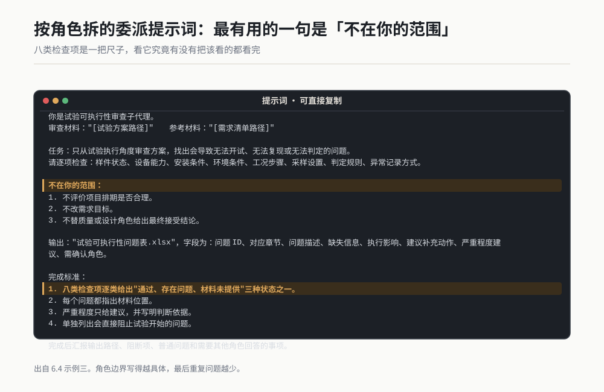

*作者根据公开资料绘制*

按角色拆时，最有用的句子往往是"不在你的范围"。角色边界写得越具体，最后重复问题越少。八类检查项则相当于一把尺子，能看出它究竟有没有把该看的都看完。

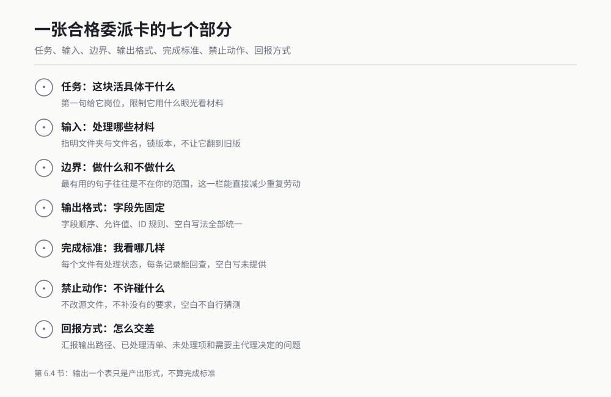

*图 6-3 一张合格委派卡的七个组成部分，作者根据公开资料绘制。*

## 6.5 完整演示：约 200 页标准怎样变成三件交付物

下面把章首那件事完整走一遍。输入是一份脱敏后的某行业标准工作副本，篇幅约 200 页。目标有三件：一份可执行检查清单、一份风险表、一份内部汇报材料。

我不会在书里复述标准条款，也不会给它虚构条目。下面展示的是任务结构、提示词原文、空字段示意和验收动作。你换成自己有权使用的文件，就能按同样步骤操作。

### 第 0 步：先把总任务写成验收单

总任务如果只有"读标准并做报告"，主代理没有分工依据。我先写最终验收条件：

1. 检查清单中的每一项，都带源文件、页码或章节、原文摘录、检查动作和结果栏。
2. 风险表中的每一项，都关联检查项 ID，不出现找不到来源的孤立风险。
3. 汇报材料中的数字和结论，都能回到检查清单或风险表。
4. 标准中读不清、说不准、有冲突的内容，集中进入待确认清单。
5. 三件交付物使用同一套记录 ID，后续修改可以追踪。

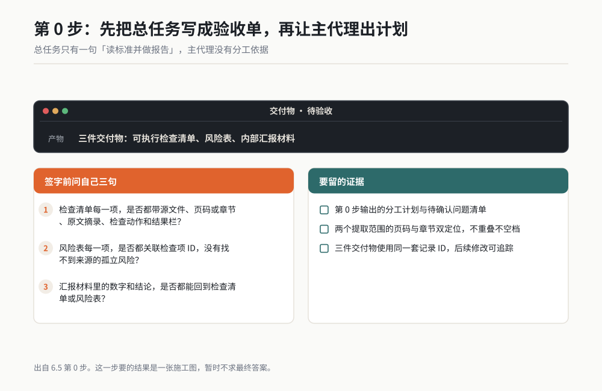

*作者根据公开资料绘制*

接着我让主代理只做计划，不急着读正文：

```text
总任务：把“[某行业标准 PDF 路径]”处理成检查清单、风险表和内部汇报材料。

先不要生成最终交付物。请先完成任务规划：
1. 识别文件的页数、目录结构、正文起止位置和可读取状态。
2. 按页码或章节划分两个不重叠的提取范围。
3. 规划子代理的执行顺序、输入、输出文件和完成标准。
4. 统一记录 ID、字段名、状态值和文件命名。
5. 列出需要我确认的范围问题。

硬性要求：所有结论必须保留来源位置；无法读取或无法判断的内容单列；任何子代理不得改写源 PDF。

只输出分工计划和待确认问题，等我确认后再执行。
```

这一步要的结果是一张施工图，暂时不求最终答案。我重点看四件事：两个页码范围有没有重叠或空档，目录和正文页码是否一致，输出字段是否相同，后续子代理究竟读取哪个版本。

如果标准前面有封面、目录、修订记录，文件显示页码和印刷页码常常不同。我会要求统一使用"PDF 页序 + 文内章节"双定位。只写"第 35 页"，换一次版本就可能找错；双定位更稳。

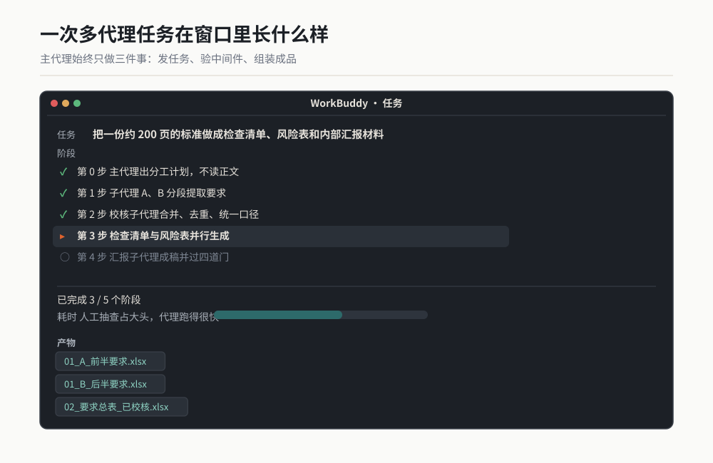

*作者根据公开资料绘制*

### 第 1 步：两个子代理分段提取要求

这一步按文件内部范围拆。两名子代理可以同时工作，但输出表头必须一模一样。A 负责前半范围，B 负责后半范围。范围边界由第 0 步读出的目录确定，不在提示词里硬猜一个章节号。

给子代理 A 的原文如下：

```text
你是标准要求提取子代理 A。

源文件：“[某行业标准 PDF 路径]”
处理范围：“[填写已确认的前半页序和章节范围]”

任务：逐页提取该范围内可转成检查动作的要求、限制、条件和交付规定。

边界：
1. 只处理指定范围，不进入子代理 B 的范围。
2. 保留原意，不把“建议”改成“必须”，不补充常识性要求。
3. 附录中的表格和注释如果属于本范围，同样检查。
4. 看不清或需要跨范围上下文的内容，放入待确认表。

输出文件：“01_A_前半要求.xlsx”。
主表字段：记录 ID、PDF 页序、文内章节、原文摘录、约束强度、适用对象、触发条件、要求动作、验收证据、备注。
待确认表字段：临时 ID、PDF 页序、文内章节、疑问、需要的上下文。

记录 ID 格式：A-四位顺序号。约束强度只允许“强制、建议、说明、无法判断”。

完成标准：指定范围逐页有处理状态；每条记录有双定位；表格、脚注、附录均有处理说明；不确定内容全部进入待确认表。

完成后汇报：输出路径、已处理范围、未读页、待确认项、需要主代理转交给 B 的跨范围问题。
```

给子代理 B 的原文只改变身份、范围、文件名和 ID 前缀：

```text
你是标准要求提取子代理 B。

源文件：“[某行业标准 PDF 路径]”
处理范围：“[填写已确认的后半页序和章节范围]”

任务：逐页提取该范围内可转成检查动作的要求、限制、条件和交付规定。

边界：
1. 只处理指定范围，不返回子代理 A 的范围。
2. 保留原意，不把“建议”改成“必须”，不补充常识性要求。
3. 附录中的表格和注释如果属于本范围，同样检查。
4. 看不清或需要跨范围上下文的内容，放入待确认表。

输出文件：“01_B_后半要求.xlsx”。
主表字段：记录 ID、PDF 页序、文内章节、原文摘录、约束强度、适用对象、触发条件、要求动作、验收证据、备注。
待确认表字段：临时 ID、PDF 页序、文内章节、疑问、需要的上下文。

记录 ID 格式：B-四位顺序号。约束强度只允许“强制、建议、说明、无法判断”。

完成标准：指定范围逐页有处理状态；每条记录有双定位；表格、脚注、附录均有处理说明；不确定内容全部进入待确认表。

完成后汇报：输出路径、已处理范围、未读页、待确认项、需要主代理转交给 A 的跨范围问题。
```

两名子代理各自产出两个工作表：要求主表和待确认表。下面只展示结构，不代替任何真实标准内容：

| 记录 ID | PDF 页序 | 文内章节 | 原文摘录 | 约束强度 | 要求动作 | 验收证据 |
|---|---:|---|---|---|---|---|
| A-0001 | [页序] | [章节] | [源文摘录] | [四选一] | [动作] | [记录或文件] |
| B-0001 | [页序] | [章节] | [源文摘录] | [四选一] | [动作] | [记录或文件] |

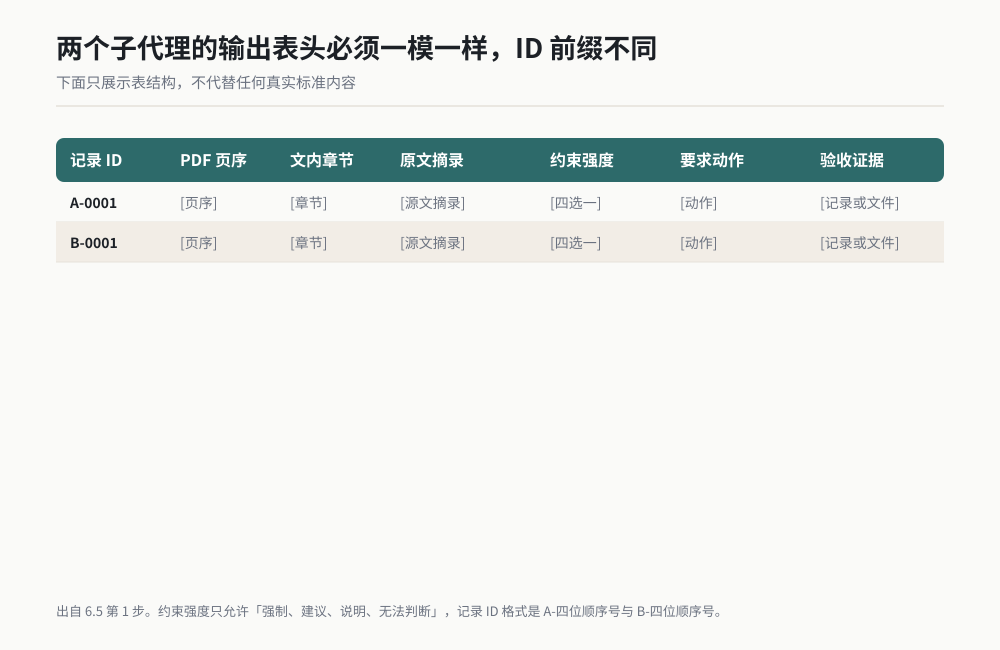

*作者根据公开资料绘制*

我验这一站时不会从头重读 200 页，那样就失去意义。我会先查边界页：A 的最后两页和 B 的最前两页；再查目录列出的每一章有没有处理状态；最后从表格、脚注、附录各抽一处回源。

只要出现以下任一情况，我就退回对应子任务：有记录无来源，约束强度超出四个允许值，整页没有处理状态，待确认内容被悄悄改成确定结论。

### 第 2 步：校核子代理查漏、去重、统一口径

A 和 B 交回来的表不能直接拼。标准前后常有引用、重复说明和术语变化。第三名子代理只负责校核，不负责写最终检查动作。

```text
你是标准提取结果校核子代理。

输入：
- “01_A_前半要求.xlsx”
- “01_B_后半要求.xlsx”
- “[某行业标准 PDF 路径]”

任务：合并两份要求表，检查范围空档、重复记录、来源错误、约束强度误判和跨章节引用。

工作边界：
1. 不删除原记录，不覆盖 A、B 文件。
2. 疑似重复只能标记，不能直接删掉。
3. 需要专业判断的内容进入“待人工裁决”。
4. 只根据源 PDF 校核，不引用外部资料补写要求。

输出：“02_要求总表_已校核.xlsx”。
工作表一“要求总表”：保留原字段，新增统一 ID、校核状态、关联记录 ID、校核说明。
工作表二“覆盖检查”：按页序和章节记录已处理、无要求、无法读取、待确认。
工作表三“待人工裁决”：列出冲突、重复、跨章节依赖和原因。

统一 ID 格式：REQ-四位顺序号。原 A/B 记录 ID 必须保留。
校核状态只允许：通过、需修改、疑似重复、待人工裁决。

完成标准：
1. A、B 每条原记录都有去向。
2. 计划范围内没有未说明的页序空档。
3. 疑似重复项成组列出并保留双方来源。
4. 每个“需修改”都写明修改依据。

完成后汇报输出路径、覆盖空档、疑似重复组、来源问题和待人工裁决项。
```

这个子代理要交的是一份带审计痕迹的要求总表，短摘要不合格。A-0001 和 B-0001 仍保留，同时获得新的统一 ID。以后风险表、检查清单和汇报材料只引用统一 ID，来源追踪仍能回到原始分段。

我会亲自处理"待人工裁决"。例如前文给出总原则，后文对特殊条件另有说明，子代理可能标成冲突。这个决定涉及适用范围，不能让主代理为追求表面整齐直接删掉一条。

### 第 3 步：检查清单与风险表并行生成

要求总表验收通过后，两个新子代理可以同时开工。一个负责把要求变成检查动作，一个负责识别偏离情形。它们读取同一份已校核总表，所以不会各自回原标准再解释一遍。

检查清单子代理的提示词：

```text
你是检查清单编辑子代理。

输入：“02_要求总表_已校核.xlsx”
只处理校核状态为“通过”或已经人工确认的记录。

任务：把每条适用要求改写成可执行、可记录结果的检查项。

输出：“03_标准检查清单.xlsx”。
字段：检查项 ID、要求统一 ID、阶段、检查对象、检查动作、所需输入、合格证据、检查结果、问题记录、责任角色、备注。

规则：
1. 一个检查项只能表达一个可判断动作；一条要求含多个动作时拆成多行。
2. “检查动作”必须能由人执行，避免“确保合规”“关注风险”这类空话。
3. 合格证据写清要看什么记录、数据或签字结果。
4. 不替使用者填写检查结果和责任人姓名。

完成标准：每条输入要求都有关联检查项或“不转检查项”的明确理由；所有检查项能回到要求统一 ID；空白信息写“待项目填写”。

完成后汇报输出路径、检查项覆盖情况、被拆成多项的要求、未转检查项及原因。
```

风险表子代理的提示词：

```text
你是标准符合性风险子代理。

输入：“02_要求总表_已校核.xlsx”
只处理校核状态为“通过”或已经人工确认的记录。

任务：识别未满足要求时的偏离情形、可能影响和建议检查动作，形成评审用风险表。

输出：“03_标准风险表.xlsx”。
字段：风险 ID、要求统一 ID、偏离情形、可能影响、现有证据、证据缺口、建议检查动作、优先级建议、判断依据、评审状态。

规则：
1. 每个风险必须引用要求统一 ID。
2. 不虚构现有控制；输入未提供时写“待项目确认”。
3. 优先级只给建议，必须附判断依据。
4. 相同偏离情形涉及多条要求时，保留全部关联 ID。

完成标准：所有适用要求都有风险处理状态；所有高优先级建议都有依据；不存在无来源风险；待确认内容单独汇总。

完成后汇报输出路径、覆盖情况、高优先级建议、证据缺口和待评审项。
```

两份产出的关系要一眼看懂。检查清单回答"我要查什么、拿什么证明"，风险表回答"如果没做到，会出现什么偏离、先查哪里"。它们共享要求统一 ID，但不能把两张表硬挤成一张，日常检查和风险评审的使用场合不同。

主代理合并前做三项交叉检查：风险表里的要求 ID 是否都存在，检查清单是否覆盖所有适用要求，一条要求拆成多个检查动作后是否仍保留同一个来源关系。

### 第 4 步：汇报子代理只讲已确认结果

最后一名子代理做汇报材料。它不再阅读 200 页原文件，只读取已经验收的要求总表、检查清单、风险表和待确认清单。这样能减少它从原文另起解释的机会。

```text
你是内部评审汇报子代理。

输入：
- “02_要求总表_已校核.xlsx”
- “03_标准检查清单.xlsx”
- “03_标准风险表.xlsx”
- “[人工裁决结果路径]”

任务：生成一份用于内部评审的 Markdown 汇报稿。

结构固定为：
1. 任务范围与版本
2. 材料覆盖情况
3. 检查清单使用方法
4. 主要风险与证据缺口
5. 待确认问题
6. 下一步动作

规则：
1. 所有数量从输入文件统计，不估算。
2. 每个风险结论标注风险 ID 和要求统一 ID。
3. 不展示未确认内容为确定结论。
4. 不复制大段标准原文，只保留定位和必要摘录。
5. 下一步动作必须写明动作、输入、输出和建议角色。

输出：“04_标准导入内部评审稿.md”。

完成标准：汇报中的数量能在输入表中复算；每条主要风险可追到风险表；待确认问题无遗漏；文件中不出现输入材料之外的新结论。

完成后汇报输出路径、引用的统计项、主要风险 ID、待确认项和无法生成的部分。
```

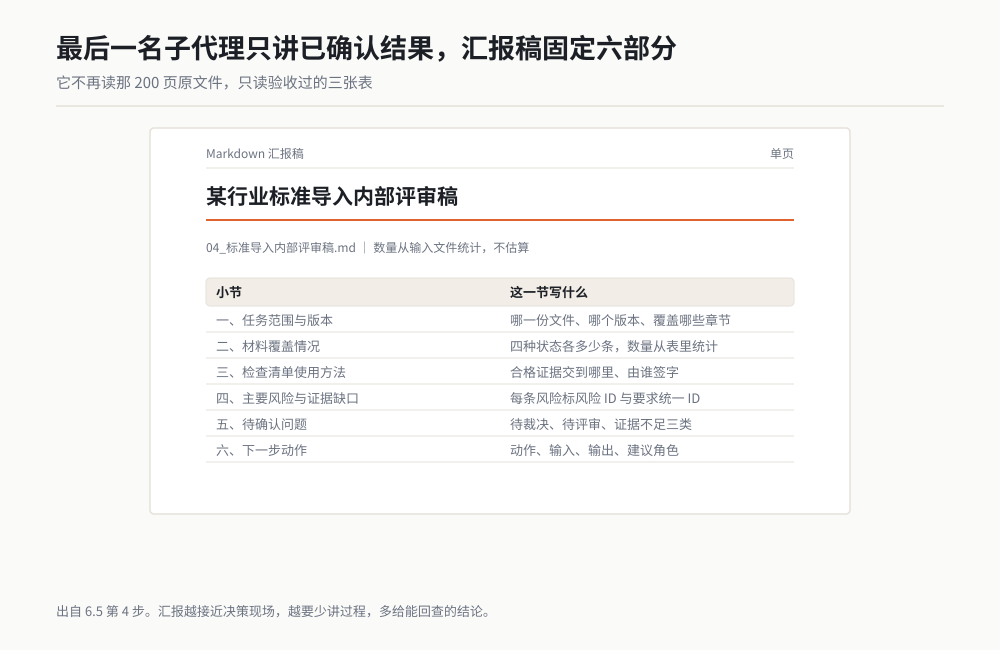

*作者根据公开资料绘制*

它交回来的汇报稿只有六部分，没有追求花哨。第一页说范围，第二页说覆盖，第三页教团队怎么用检查表，后面集中讲风险、待确认项和下一步。汇报越接近决策现场，越要少讲过程，多给能回查的结论。

### 第 5 步：主代理合并，但不替我签字

这时主代理手里有五类产物：A/B 原始提取表、已校核要求总表、检查清单、风险表、汇报稿。合并不是复制粘贴，它要完成四个检查门：

1. **来源门**：每条检查项和风险都能沿 ID 回到源文件位置。
2. **覆盖门**：计划范围内每页、每章都有处理状态，空档有原因。
3. **口径门**：状态值、约束强度、优先级写法只有预先规定的选项。
4. **交付门**：文件能打开，表头完整，汇报中的统计能由表格复算。

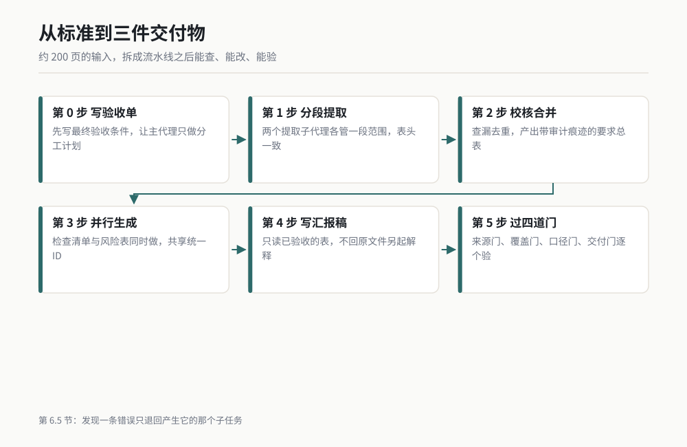

*图 6-4 从约 200 页标准到三件交付物的多代理流水线，作者根据公开资料绘制。*

我自己的验收顺序也固定。先看待确认清单，因为这里最容易藏着真正的项目风险；再抽高优先级风险回源；然后随机抽普通检查项；最后复算汇报数字。发现一条错误时，我退回产生错误的那个子任务，不让所有子代理全部重跑。

比如风险表里出现一个要求总表没有的 ID，我只退回风险子代理，让它检查引用；如果要求总表少了一段页序，我退回校核子代理；如果原始提取就漏了整张表格，才退回负责该范围的 A 或 B。能局部返工，是拆分任务最实在的好处。

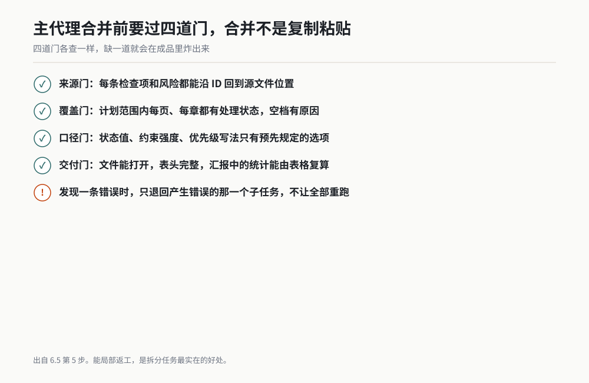

*作者根据公开资料绘制*

这个演示里，主代理始终做三件事：发任务、验中间件、组装成品。它没有把专业裁决偷偷替我做掉。凡是涉及适用范围、风险接受、责任归属的内容，都进待确认表，由我或对应角色决定。

## 6.6 分工不出乱子的三条规矩

### 规矩一：边界不能重叠

反例是：A "提取全部要求"，B "检查重要要求"。两个范围必然重叠，而且"重要"没有定义。最后同一条要求会出现两种写法。

正例是：A 负责已确认的前半章节，B 负责后半章节；或者 A 只提要求，B 只在 A 的结果上查风险。边界要能画成一条线，不能靠子代理自行体会。

我会在每份委派中写一栏"不在范围"。这几个字看似消极，实际比"请认真完成"有用得多。它告诉助手在哪停手，也告诉主代理出现漏项时该找谁。

### 规矩二：产出格式先统一

反例是：A 交 Word，B 交 Excel；A 用"高、中、低"，B 用"红、黄、绿"；A 记录页码，B 只记章节。到合并时，主代理大半时间花在改表头。

正例是：开工前给所有同类子任务一份空表，字段顺序、允许值、ID 规则、空白写法全部固定。谁缺字段，谁返工，主代理不替它补猜测内容。

格式统一也包括语言口径。标准里的"应""宜""可"如果需要分类，就先规定分类表。各子代理不能凭自己的理解分别发明状态值。

### 规矩三：合并前逐个验

反例是：四份结果一回来，主代理立刻拼总表。等总表出现重复和断链，你已经不知道错误来自谁。

正例是：每份子任务先过自己的完成标准，再进入合并区。验收只看这份活该负责的范围，不用提前评价总报告漂不漂亮。

我常用的顺序是"看回报、查文件、抽来源、验边界"。子代理说处理完 6 份文件，我先数处理状态；说没有漏页，我抽边界页；说每条能回源，我点开几条来源。

*作者根据公开资料绘制*

通过后才把文件交给下一个子代理。

## 6.7 四种常见翻车：症状、原因、补救

多代理最怕一种错觉：窗口里同时跑着几份活，看起来很忙，就以为效率一定高。下面四种问题，我都遇到过。它们不靠"让 AI 更认真"解决，只靠改分工。

| 翻车类型 | 你看到的症状 | 根本原因 | 立刻补救 | 下次预防 |
|---|---|---|---|---|
| 重复劳动 | 两张表里出现大量相同条目，措辞略有不同 | 任务边界重叠，材料范围没锁定 | 暂停合并，按来源分组，指定一份为主记录 | 每份任务写处理范围和不在范围 |
| 互相打架 | 一个说必须补试验，另一个说现有证据足够 | 角色判断依据不同，主代理又要求直接下结论 | 保留两方证据，生成待决策项，请责任角色裁决 | 角色只提建议和依据，不代替最终决定 |
| 结果对不上 | 汇报数字、风险表、检查表各有一套数量 | 每个子代理读了不同版本，统计口径也不同 | 冻结唯一输入版本，重新从总表计算 | 规定唯一数据源、版本和状态值 |
| 丢上下文 | 子代理重复询问已确定事项，或沿用旧约定 | 委派时只给任务，没有给必要约定 | 补发任务背景卡，明确哪些约定有效 | 每个任务附最小上下文和决策记录 |

**重复劳动**通常最容易发现，因为表会突然变长。别急着删相似行。先看来源位置，相似内容可能是标准在两个适用条件下分别提出的要求。只有来源、对象、条件都相同，才进入疑似重复组。

**互相打架**也不全是坏事。需求角色和试验角色得出不同建议，可能暴露了真实矛盾。错误做法是让主代理投票。正确动作是把双方依据并排放好，补上影响和待决定人。

**结果对不上**往往源于版本。A 看的是修订前文件，B 看的是修订后文件，最后再聪明的汇总也救不回来。开工时给输入文件加版本、日期或文件校验信息，所有子代理只认这一个入口。

**丢上下文**的补救也不是把全部聊天记录塞给每个人。材料越多，子代理越难知道哪句有效。只给最小背景卡：任务目标、已确认决定、术语表、输入版本、禁止改动项。旧讨论不等于现行决定。

## 6.8 如果你只做一件事

下次碰到大任务，先别数要叫几个子代理。先写一句完成标准：**这块活交回来时，我看哪几个东西，就能判断它完成了？**

如果你写不出这句话，说明任务还没拆到能验收。继续缩小范围：从"审标准"缩成"提取第 3 章要求"，再缩成"每条要求必须带章节、原文和检查动作"。当完成标准清楚，委派话术、产出格式和验收动作都会跟着清楚。

我现在拆任务的顺序固定为：先写最终交付物，再写每个中间件，接着标出谁生产、谁使用，最后才决定能不能并行。这个顺序能避免为了多代理而多代理。

## 小白词典

**主代理**：接住总任务、安排分工、验收中间结果并组装成品的 AI 助手。像项目组长，自己也干活，但更重要的是管住接口。

**子代理**：主代理为一块具体工作临时安排的 AI 助手。像临时专员，拿到限定材料和完成标准，交件后结束任务。

**并行**：几块互不等待的活同时进行。像几个人分别清点不同仓位，能一起开工。

**串行**：后一步必须等前一步结果。像先测尺寸，再根据结果判断是否合格，顺序不能换。

**任务边界**：一份子任务负责到哪里、在哪里停。像工位黄线，线内归你，线外不要碰。

**完成标准**：判断一份工作能不能收货的具体条件。像检验规范，不能只写"做得认真"。

**唯一数据源**：所有人共同认可的那一份现行输入。像受控图纸，旧版本不能混进现场。

**可追踪**：从结论能找到证据，从证据能回到原文位置。像零件批次号，出了问题能追到来处。

## 你的岗位怎么用

**设计工程师**：把多份需求资料按文件交给不同子代理提取，再让校核子代理查重复与冲突。最终检查表必须保留来源、适用条件和验证证据。

**试验工程师**：按步骤拆成方案完整性检查、数据整理、异常筛查和报告生成。每一步先验输入输出，避免异常数据直接进入结论页。

**质量工程师**：按角色让要求、风险、控制和证据分别受审。发现结论冲突时，不让主代理投票，改成列证据和待裁决事项。

**采购与供应商管理**：按供应商或资料包拆分资质检查，所有子代理使用同一张缺项表。合并前先验每包文件的处理状态和有效期字段。

**项目经理**：按材料类型拆会议纪要、计划变更、风险登记和行动项，再由主代理生成时间线。每条结论要带日期、来源和责任角色。

**研发主管**：把同一方案分给技术、质量、试验和项目角色会审。要求每个角色只报问题、证据和影响，把最终取舍留在评审会上。

## 本章交付物

**多代理分工卡**：一张可以直接复制的"拆活 + 派活 + 合并"模板。每次任务超过一份材料、一个步骤或一个专业视角时，先填这张卡。

```text
【总任务】
要完成的事情：
最终交付物：
最终验收动作：
唯一输入版本：
禁止改动项：

【拆活】
拆法：按文件 / 按步骤 / 按角色 / 混合
子任务 1：
- 负责人：
- 输入：
- 处理范围：
- 不在范围：
- 输出文件：
- 固定字段：
- 完成标准：
- 失败时回报：

子任务 2：
- 负责人：
- 输入：
- 处理范围：
- 不在范围：
- 输出文件：
- 固定字段：
- 完成标准：
- 失败时回报：

【派活前检查】
[ ] 每块边界能用一句话说清
[ ] 同类产出使用相同字段和允许值
[ ] 每个子任务都有来源记录要求
[ ] 每个子任务都有可执行的完成标准
[ ] 已标明哪些能并行、哪些必须等待
[ ] 所有子代理读取同一输入版本

【逐件验收】
[ ] 输出文件存在且能打开
[ ] 指定范围全部有处理状态
[ ] 抽查记录能够回到来源
[ ] 待确认项没有被写成确定结论
[ ] 没有越过任务边界
[ ] 通过后才交给下一步或进入合并

【合并检查】
[ ] ID 唯一且引用有效
[ ] 重复项已分组，未直接误删
[ ] 状态值和术语写法统一
[ ] 汇总数字可以从底表复算
[ ] 冲突项保留双方证据和待决定人
[ ] 最终交付物逐项通过验收
```

**怎么做**：先填最上面的最终交付物和验收动作，再填子任务。填到某一项时，如果"完成标准"只能写成"认真检查"，就继续拆，直到能写出来源、字段、范围和检查动作。

派活后，把每个子代理的回报贴回这张卡。没通过逐件验收的文件，不进入合并区。最终合并时，只使用卡片上登记的正式输出，不从聊天记录里临时捡结论。

**作者经验**：我先看错误能不能退回到一个小任务，不看一次叫来多少助手。能只重做一段、一个表或一个角色的审查，这次拆分就有价值。凡是出错后只能全部推倒重来，通常说明边界或中间件还没设计好。

## 本章金句

> 一个 AI 干到发糊时，先把活拆开，不要继续往同一个窗口里塞要求。

> 子代理的数量不重要，每份活能不能单独验收才重要。

> 派活时最值钱的一句话，是"做到什么样才算完成"。

> 能并行的是材料，不能省略的是验收。

> 主代理负责组装，专业判断仍由签字的人负责。

> 好的分工出了错只重做一块，差的分工出了错全部重来。

---

*（下一章：进入第四篇，72 个场景实战。从下一页开始，按岗位挑一个真活，照着步骤交出去。）*
