# 第 11 章 电子、软件与仿真：AI 进得了 PCB、控制器和求解器吗

> 在电路板和控制器代码上，AI 最危险的地方不是它做错，是它做对了九十九处、错在第一百处，而错的那一处长得很像对的那一处。

去年三月的一个周四下午，办公室只剩我一个人。屏幕上开着一份电机控制器的底层驱动代码，一千八百多行 C，用的是我们项目上跑了三年的那套风格。

我想让它帮我看一遍。

手指停在回车键上有十几秒。那一刻我心里转的不是技术问题，是一个很具体的画面：这批控制器装在车上，车在高速上跑，某个中断服务程序里的一行判断被改坏，电机在错误的时间点换了一次相。做汽车的人对软件错误是零容忍的，这个零容忍不是口号，是召回单上的数字，是服务站里排队的车。

我最后还是敲了下去，但我改了说法。我没有问"这段代码有没有问题"，我问的是：

> 下面这段是我司电机控制器的 PWM 占空比映射函数。请你只做一件事：逐行列出你"不确定"的地方。
> 不要修改任何代码，不要给优化建议，不要评价代码风格。
> 对每一处不确定，写清楚三件事：行号、你不确定的是什么、你需要看到什么资料才能确定。
> 如果你对某一段完全没有把握，就写"我没有把握"，不许用"可能存在风险"这类模糊说法搪塞。

它回了一份清单，十一条。我一条一条看下来，有六条是我自己也同意的疑点，三条是我知道没问题但它看不出来，两条是它把语言标准和公司规范搞混了。

真正让我放下心的不是那六条。是它愿意写"我没有把握"这四个字。一个肯说自己没把握的东西，你才知道它说"这里有问题"的时候，那句话是有分量的。


*作者根据公开资料绘制*

后来我把这套问法固定下来，用在电路板、用在仿真前处理、用在结果解读上。这一章的六个场景，就是从那次开始的。

先交代一句实话：这一章里，我没有第 10 章那种"我亲手跑完一整台方向盘"的案例。电子和仿真这一侧，要么软件授权贵得我没法在家里装，要么工具链还处在社区活跃、版本乱飞的阶段。所以这一章三个场景标 ★（调研，来自公开资料与社区案例），三个场景标 ★★（跑通，我在自己的环境上跑过流程，但没有完整留档）。**没有一处标 ★★★。** 我宁可让你看清楚哪些是我跑过的、哪些是我读来的，也不愿意让你照着一段我没碰过的流程去签字。

下面是本章六个场景的速览，你先挑跟你有关的那个看。

| 场景 | 场景名 | 人工耗时 | AI 耗时 | 可信度 |
|---|---|---|---|---|
| 25 | PCB 设计辅助：让 AI 驱动 EDA 软件干活 | 约 1 人天 | 未实测（公开案例为数十分钟量级） | ★ 调研 |
| 26 | PCB 检查与 BOM 核对：网表与物料清单的一致性 | 约 4 小时 | 约 25 分钟 | ★★ 跑通 |
| 27 | 控制器软件开发：模型与代码的生成辅助 | 约 2 人天 | 未实测 | ★ 调研 |
| 28 | 代码审查与规范检查：AI 当第一道关 | 约 3 小时 | 约 20 分钟 | ★★ 跑通 |
| 29 | CAE 仿真前处理：让 AI 准备求解器输入 | 约 1 人天 | 未实测 | ★ 调研 |
| 30 | 仿真结果解读与报告：从结果文件到结论 | 约 4 小时 | 约 30 分钟 | ★★ 跑通 |

---

## 场景 25 PCB 设计辅助：让 AI 驱动 EDA 软件干活 ★

### 一句话背景

一块四层控制板，从原理图导网表、建板框、摆关键器件、定规则到出第一版布局，熟手一整天。烦的地方不在难，在于这活有三分之二的时间在重复：改一个封装要重摆、改一个网络要重连、规则表改一遍要重刷一遍。这一节讲怎么让 AI 替你去按那些鼠标。

### 名词小词典

**PCB**：印刷电路板，那块绿色的板子。铜箔刻成线路，元器件焊在上面。类比：城市里的道路网加沿街的房子。

**EDA**：电子设计自动化软件的总称，画原理图、画板子、查规则都在这类软件里做。本章里点名的两款是商业软件 Altium Designer 和开源软件 KiCad。

**网表（Netlist）**：一份纯文本文件，写着谁跟谁连在一起。原理图导出的网表和 PCB 导出的网表本该完全一致，不一致就是出事了。类比：一张通讯录，左边是人名，右边是电话号码。

**封装（Footprint）**：一个元器件在板子上占的那块焊盘图形。同一个电阻可能有十种封装，选错就焊不上。

**走线（Routing）**：把网表里的连接关系，变成板上实实在在的铜箔路径。

**DRC**：设计规则检查。线宽够不够、间距够不够、孔打得下打不下，软件按你定的规则查一遍，报违规。

**MCP**：一套让 AI 调用其他软件能力的通用接口标准。AI 说话，桥来翻译，软件动手。第 10 章那条 SOLIDWORKS 的链路走的也是它。

### 开工前准备

1. EDA 软件装好并授权到位。Altium Designer 是商业授权，KiCad 免费开源，两条路的准备完全不同，别混着看。
2. 确认软件版本。这一侧的版本差异极大，脚本接口可能隔一个大版本就换名字。这一条比装软件本身还重要。
3. 一台桥。社区里的开源项目 eda-agent（出处：开源代码托管平台上的公开项目，许可证以项目主页标注为准）走的是"文件桥"路线：AI 写一段脚本文件，软件执行，再把输出写回另一个文件，AI 读回来。公开资料里它面向 Altium 暴露的工具在四百个量级。KiCad 这一侧走官方 Python 接口（文档里通常写作 kipy），是原生接口，不需要绕文件。
4. 一个干净的工作目录，路径全英文、无空格。这一条在第 10 章已经坑过我一次。
5. 先看清许可证和你公司的合规要求。把公司项目文件发给任何外部服务之前，这一步不可跳过。

### 操作步骤

这一节标 ★，下面给的是通用原则和通用提示词形态，不承诺某个版本的菜单路径：

1. 先在软件里手动做完一次最小流程：新建工程、放一个电阻、连一根线、保存。手动都做不成，AI 也做不成。
2. 把桥起起来，在 AI 侧登记成 MCP 服务器，用一句"列出这台服务器上所有可用工具"验握手。工具列表里有创建元件、放置、连线、导出网表这几类，才往下走。
3. 交给它一个比你真正需求小十倍的任务。我要的是一个 50 乘 50 毫米的板框加三个器件，不是整块控制板。
4. 看返回值。它每做完一步必须报出真实数字：器件位号、坐标、网络名。
5. 逐步加码。每加一级加一条校核：器件数、网络数、DRC 违规数。
6. 让它导出网表，你自己打开那个文本文件看一眼。文件是最不会撒谎的产物。
7. 全程不许让它直接改你唯一的工程文件。副本先行，这一条没有例外。

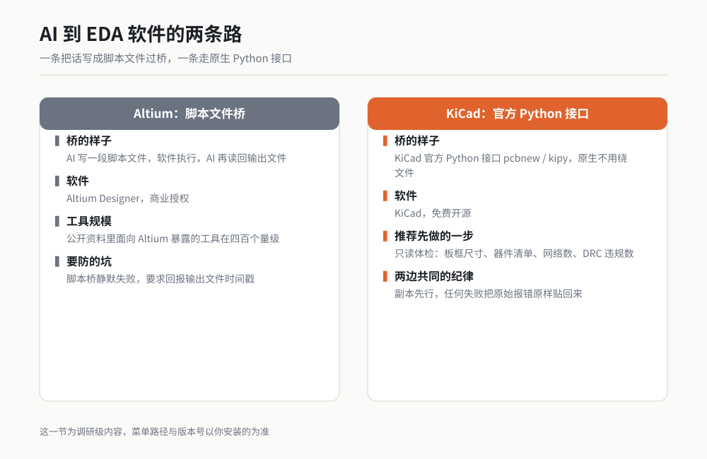

*图 11-1 作者根据公开资料绘制，仅表示原理关系，不含任何第三方设计文件内容。*

### 可复制提示词

Altium 一侧，走脚本文件桥的路线。整段复制，尺寸和路径换成你自己的：

```
你现在可以通过 eda 这台 MCP 服务器，驱动我电脑上已经打开的 Altium Designer。
它走的是脚本文件桥：你写脚本文件，软件执行，你再读回输出文件。

【任务】在一个新建的 PCB 工程里做一件最小的事，先别做大：
1. 建一个 50 × 50 毫米的板框，原点在左下角。
2. 放置三个器件：R1（0805 封装）、C1（0805 封装）、U1（SOT-23 封装）。
   坐标分别是 (10, 10)、(20, 10)、(30, 25)，单位毫米。
3. 把 R1 的第 2 脚与 C1 的第 1 脚连成网络 NET_MID。

【单位】我说的全部是毫米。接口内部单位与毫米不同，你负责换算；
回读给我看的每一个数字一律换算回毫米并标注单位。

【汇报】每完成一步立刻回报：器件位号、实际坐标、实际封装名、
网络名与网络连接数。不许用"已完成"概括。

【纪律】
1. 任何一步失败，把软件返回的原始报错原样贴给我，然后停下来等我指示。
   不许自己猜原因，不许带着报错继续往下做。
2. 封装名如果对不上库里的实际名字，停下报告，不许就近选一个相似的。
3. 全程只操作 D:\AI-EDA\demo01 这个副本目录，不许碰任何原始工程文件。
4. 做完后导出网表到 D:\AI-EDA\demo01\netlist.txt，
   并把文件的前 20 行原样贴给我看。
```

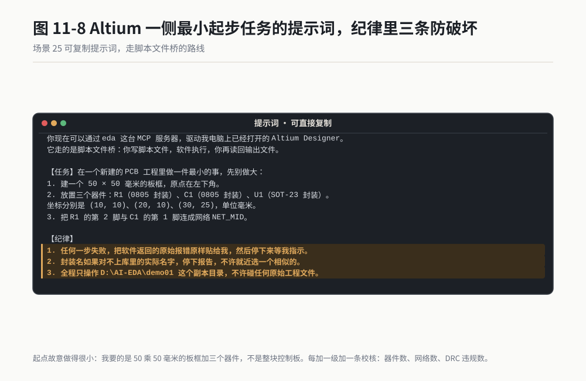

*作者根据公开资料绘制*

KiCad 一侧，走官方 Python 接口（kipy）的路线：

```
你现在可以通过 kicad 这台 MCP 服务器，用 KiCad 的 Python 接口 pcbnew / kipy
操作我电脑上打开的 KiCad。

【任务】打开 D:\AI-EDA\kicad_demo\demo.kicad_pcb，做一次只读体检，先不要改任何东西：
1. 报出板框的外形尺寸（宽 × 高，毫米）。
2. 列出板上所有器件：位号、封装名、坐标（毫米，保留三位小数）。
3. 统计网络总数，列出网络名清单。
4. 跑一次 DRC，报出违规数与每一条违规的类型、坐标、涉及的网络或器件。

【单位】KiCad 内部单位与毫米不同，你负责换算，回报一律换算回毫米并标注单位。

【汇报】不许用"没有问题""一切正常"这类话。
每一项都报数字；没有违规就写"违规数 0，DRC 已执行，检查时间 X"，
不许只写"通过"。

【纪律】只读，不许保存。任何失败把原始报错原样贴给我，停下来等我指示。
```

第二条提示词我要多说一句。只读体检是我在这一侧最推荐的第一件事，因为它不产生任何破坏，而它给你的那个器件清单和网络清单，正是后面所有工作的底账。

### 过程与判断点

一份合格的回报长这样，四行里有三行能手算复核：

```
> [板框] 50.000 × 50.000 mm，原点 (0.000, 0.000)。
> [器件] R1 / R_0805 / (10.000, 10.000)，C1 / C_0805 / (20.000, 10.000)，
>        U1 / SOT-23 / (30.000, 25.000)，共 3 个，封装名与库内一致。
> [网络] 新增 NET_MID，连接 2 个焊盘（R1-2、C1-1），网络总数 1。
> [DRC] 违规 0 条，已执行，检查时间 0.4 秒。
```

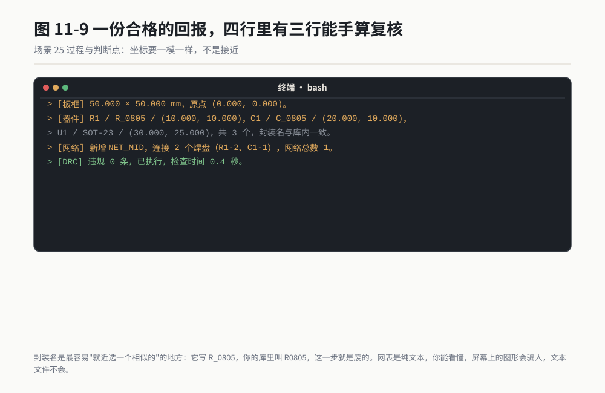

*作者根据公开资料绘制*

我盯三个地方。

**第一，封装名。** 它写的封装名必须能在你的库里原样搜到。它写 R_0805，你的库里叫 R0805，那这一步就是废的。封装名是最容易"就近选一个相似的"的地方。

**第二，坐标。** 三个器件的坐标要跟你说的一模一样，不是接近。坐标错通常意味着单位换算链路上有问题，而这个问题会一路带到后面所有步骤。

**第三，网表文件。** 让它在最后把导出的网表前二十行原样贴给你。这不是形式主义。网表是纯文本，你能看懂，你能数出里面有几个网络、几个器件。屏幕上的图形会骗人，文本文件不会。

### 翻车清单

**翻车一：封装名幻觉。** 症状是它自信地报出一个封装名，你的库里根本没有。根因是它按常见命名习惯猜了一个。补救：在提示词里写死"封装名必须与库内实际名字完全一致，对不上就停下报告"，并且开工前先让它把库里的封装名清单列一遍给你。

**翻车二：脚本桥静默失败。** 症状是它报"已执行"，但板子上什么都没变。根因是走文件桥这条路时，脚本文件写了、软件没执行、或者输出文件是上一轮的旧内容。补救：要求每次执行后回报输出文件的时间戳和字节数，时间戳不刷新就说明软件根本没跑。

**翻车三：它直接改了你的原始工程。** 症状是你打开原来的工程，发现多了三个器件。根因是工作目录没隔离。补救：副本先行，并且在提示词里把"只操作副本目录"写成一条硬性纪律，结尾再让它列一遍它实际打开的文件路径。

### 验收标准与变体

**验收四条，五分钟做完：**

1. 打开导出的网表文本，器件数、网络数与你要求的一致。
2. 三个器件的坐标逐一对得上，误差为零，不是接近。
3. 每个器件的封装名都能在库里原样搜到，不是"看起来像"。
4. 关掉软件重开一次，确认改动还在。改完就没保存，等于没改。

**变体一：批量改封装。** 一块板上三十个电阻要从 0805 换成 0603。让它列出待改清单、你确认后再批量执行，改完导出网表对一遍器件数。

**变体二：出一份器件坐标文件给贴片厂。** 让 AI 从板子上读出全部器件的位号、坐标、旋转角度，写成 CSV。这份文件直接决定贴片机怎么走，验收动作是随机抽五个器件用软件量一遍坐标。

**变体三：规则表体检。** 把你的线宽间距规则表交给它，让它对着板子查一遍有没有违反规则却没被 DRC 抓到的地方。这一条属于加分项，别当主菜。

> **老兵说**：在 PCB 这一侧，AI 最值钱的用法不是帮你画板，是帮你数数。器件数、网络数、封装名，这三个数你数清楚了，板子就已经对了一半。

---

## 场景 26 PCB 检查与 BOM 核对：网表与物料清单的一致性 ★★

### 一句话背景

一块板子打样回来才发现一个电容没焊上去，根因可能是三个月前的一次工程变更改了原理图、忘了改 BOM。这类漂移人工查一遍要三四个小时，因为你要在两张几百行的表之间来回找。这一节给你一条二十多分钟的查法。

### 名词小词典

**BOM**：物料清单。这块板子由哪些物料、各几个、用什么编码，一表列清。采购照它买，仓库照它发，贴片厂照它上料。

**ECO**：工程变更指令。改一个电阻值、换一个供应商、加一个电容，都算。它是工程现场最频繁的动作，也是最频繁的事故源。

**ECO drift**：变更漂移。原理图改了，PCB 没跟着改；或者 PCB 改了，BOM 没跟着改。三份文件的版本就这么悄悄错开了。

**位号（RefDes）**：板上每个器件的身份证，R1、C3、U7 这种。它是三份文件之间唯一的对照键。

**多 Part 器件**：一个物理芯片里装着四个一样的运放，位号写作 U2A、U2B、U2C、U2D。BOM 里它是一行、数量 1，网表里它是四个位号。这个错位是新手查不出来的头号坑。

**交叉引用（Cross-reference）**：拿两份清单按同一个键对一遍，列出只在左边有的、只在右边有的、两边都有但值不一样的。

### 开工前准备

1. 三份文件：原理图导出的网表、PCB 导出的网表、最新版 BOM。三份都要能导出成文本或表格，PDF 不行，PDF 没法比。
2. 一个干净的工作目录，三份文件放进去，文件名带上日期版本号。
3. 一份你公司的物料编码规则说明。没有的话，这一步你会卡在"这两个编码是不是同一个东西"上。
4. 决定好对照键。绝大多数情况用位号，特殊情况下用"位号加值"的组合。

### 操作步骤

这套流程我在自己的环境上跑通过，六步：

1. 先把三份文件各自的行数和器件数统计出来。数字对不上就是信号，先把数字记下来再往下查。
2. 让 AI 拿位号做键，把原理图网表和 PCB 网表对一遍，输出三张差异表：只在原理图、只在 PCB、两边都有但网络名不同。
3. 把 PCB 网表和 BOM 对一遍，同样三张表：板上有但 BOM 没有、BOM 有但板上没有、位号相同但物料编码不同。
4. 单独处理多 Part 器件。让 AI 把带后缀字母的位号归并回主位号，再重新对一次。
5. 让它把每一条差异写成一行结论：差异类型、位号、原理图侧的值、PCB 侧的值、BOM 侧的值、建议动作。
6. 你自己抽五条去原始文件里核对。抽五条是底线，不是抽查十条的十分之一。

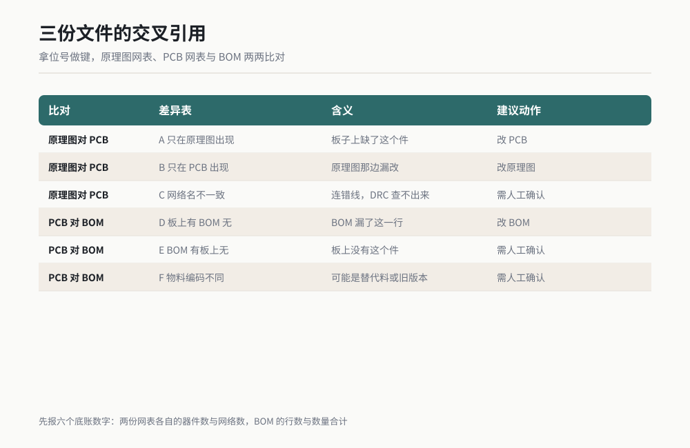

*图 11-2 作者根据公开资料绘制。*

### 可复制提示词

整段复制，文件名和目录换成你自己的：

```
【任务】对我放在 D:\AI-EDA\xcheck 目录里的三份文件做一致性检查，
只出报告，不许修改任何原始文件。

【文件】
- sch_netlist.txt：从原理图导出的网表
- pcb_netlist.txt：从 PCB 导出的网表
- bom.xlsx：最新版物料清单

【第一步：底账】先统计三份文件各自的规模并报给我：
原理图网表的器件数、网络数；PCB 网表的器件数、网络数；BOM 的行数与数量列合计。
六个数字先列出来，不许直接跳到比对。

【第二步：原理图对 PCB】以位号为键做交叉引用，输出三张表：
A. 只在原理图里出现的位号（PCB 上缺件）
B. 只在 PCB 里出现的位号（原理图漏改）
C. 两边都有，但所属网络名不一致的位号（连错线）
每张表如果为空，写"空表，已执行，比对行数 N"，不许只写"无差异"。

【第三步：PCB 对 BOM】以位号为键做交叉引用，输出三张表：
D. 板上有、BOM 里没有的位号
E. BOM 里有、板上没有的位号
F. 位号相同但物料编码不同的位号
注意处理多 Part 器件：U2A / U2B 这类带后缀的位号要归并回 U2 再比对，
归并规则先写清楚给我看，我确认了再执行。

【第四步：差异结论】把上面六张表合并成一张结论清单，每行五列：
差异类型（A-F）、位号、原理图侧的值、PCB 侧的值、BOM 侧的值、建议动作。
建议动作只能填这四种之一：改原理图、改 PCB、改 BOM、需人工确认。

【输出】结论清单写成 D:\AI-EDA\xcheck\xcheck_report.md，
开头必须写本次比对的六个底账数字。

【纪律】
1. 不许用"基本一致""差异不大"这类话。差异就是差异，一条一条列。
2. 任何一处你读不懂、解析不了的字段，原样贴给我并写"此处我无法解析"，
   不许跳过，也不许按常见格式猜。
3. 比对过程中发现三份文件里有任何一份看起来不是最新版，立刻停下告诉我，
   不许继续往下比。
```

### 过程与判断点

一份合格的报告开头长这样：

```
> [底账] 原理图网表：器件 312，网络 418。
>        PCB 网表：器件 312，网络 417。
>        BOM：218 行，数量列合计 312。
> [A] 只在原理图：空表，已执行，比对行数 312。
> [B] 只在 PCB：空表，已执行，比对行数 312。
> [C] 网络名不一致：3 条。
>     R47：原理图侧 NET_FB1，PCB 侧 NET_FB2
>     R48：原理图侧 NET_FB2，PCB 侧 NET_FB1
>     C91：原理图侧 GND，PCB 侧 AGND
> [D] 板上有 BOM 无：2 条（R103、R104）。
> [E] BOM 有板上无：0 条。
> [F] 物料编码不同：1 条（U7：BOM 侧 XXX-1234，板上器件值侧 XXX-1234-B）。
```

这份报告里我看三处。

**第一，六个底账数字必须先出来。** 原理图 312 个器件、PCB 312 个器件、BOM 数量列合计 312，这三个数对上了，说明总量没跑。网络数 418 对 417，差一个，那一个就是 C 表里要查的东西。数字先摆出来，后面的差异才有参照系。

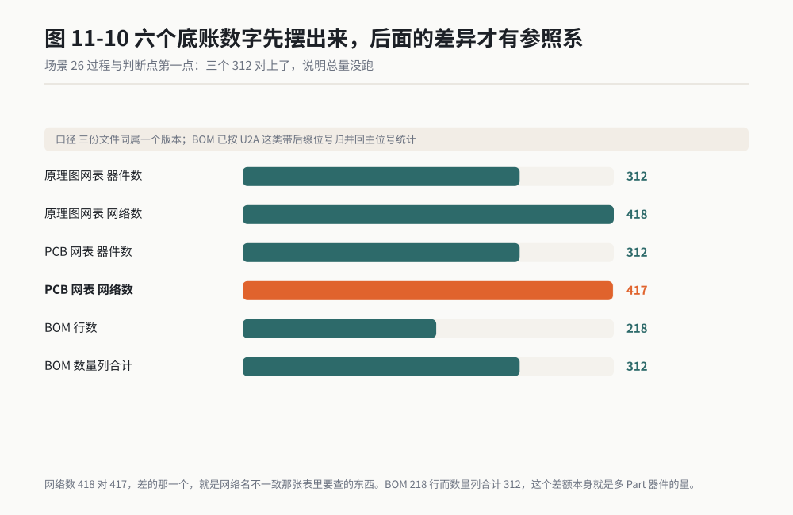

*作者根据公开资料绘制*

**第二，空表也要写"已执行，比对行数 N"。** 这是我从第 10 章带过来的规矩。一张空表，可能是真的没有差异，也可能是它压根没比。写了比对行数，你才知道它真的拿 312 行去对过 312 行。

**第三，C 表里的 R47 和 R48 是一类典型信号。** 两个电阻的网络名互换了，说明某次改动把反馈网络的两条支路接反了。这种错误 DRC 查不出来，因为线都连着、间距都够，它只是连错了地方。只有交叉引用能抓到它。

**第四，F 表里 U7 那条是另一种信号。** 编码差一个后缀 B，可能是替代料，可能是 BOM 版本旧。这种条目不属于"错误"，属于"需人工确认"，你必须自己去看那个后缀是什么意思。

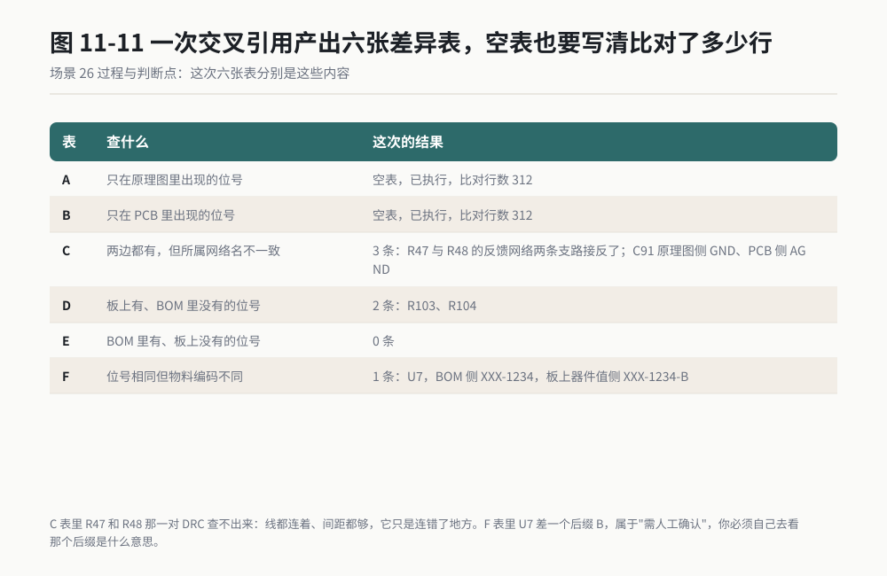

*作者根据公开资料绘制*

**第五，它有没有发现我拿错了文件。** 我在提示词里写了"发现疑似旧版立刻停下"，这一条是花钱买来的。有一回我手里那份 BOM 是上一版的，它闷头查出来三十多条差异，我越看越不对劲，回头翻文件名，日期是两个月前的。它要是当时不吭声，我那一下午就白查了。

### 翻车清单

**翻车一：多 Part 器件把数量算重了。** 症状是 BOM 里明明 218 行，它报出 300 多行差异。根因是 U2A、U2B、U2C、U2D 被当成四个独立器件。补救：在提示词里单独写一条归并规则，并要求它先报归并规则给你确认，再执行比对。

**翻车二：位号大小写和前后空格。** 症状是同一个器件被报成"两边都有但不一致"。根因是一侧写 r12，另一侧写 R12，或者某侧带了个空格。补救：比对前先做一次规范化，去掉首尾空格、统一大写，并把规范化前后各报一次器件数，数字变了就说明有问题。

**翻车三：拿到的是旧版文件还在查。** 症状是查出来一堆差异，最后发现 BOM 是上个月的。根因是文件名没带版本号。补救：文件名一律带日期版本号，并且在提示词里要求它发现疑似旧版就立刻停下。查三小时查出个旧文件，是我见过最亏的一种翻车。

### 验收标准与变体

**验收四条：**

1. 报告开头的六个底账数字，与你自己在软件里看到的数字一致。
2. 六张差异表全部存在，空表也写了"已执行，比对行数 N"。
3. 随机抽五条差异，回原始文件里人工核一遍，五条全对得上。
4. 多 Part 器件的归并规则你已经看过并确认过，不是它自己定的。

**变体一：改模前后对比。** 一次 ECO 之前存一份报告，改完再存一份，两份并排看。差异出现在哪一行一目了然，评审会上不用争。

**变体二：供应商来料的 BOM 核对。** 外协厂发回来的 BOM 跟你的原版对一遍，重点看 F 类（编码不同），那往往是替代料混进来的地方。这一步赶在贴片之前做。

**变体三：把这套检查存成技能。** 把这段提示词加六个底账数字的输出格式，打包成一个 WorkBuddy 技能。以后每次出版本跑一次，二十分钟，报告自动落到同一个目录。

> **老兵说**：PCB 上最贵的错误不是连错线，是三份文件的版本号悄悄错开了。线错了板子不工作，你当天就知道；版本错开了，板子照样工作，你三个月后才知道。

---

## 场景 27 控制器软件开发：模型与代码的生成辅助 ★

### 一句话背景

一个电机控制器的电流环，从搭 Simulink 模型到生成能编译的 C 代码，熟手两天。中间最耗时的不是写算法，是把接口、标定量、数据类型、代码生成配置一遍遍调对。这一节讲 MATLAB 与 Simulink 这一侧官方给出的 AI 能力能走到哪一步，以及它走不到的地方在哪。

### 名词小词典

**Simulink**：MATLAB 里的图形化建模工具。控制算法不写成代码，画成框图：一个增益块、一个积分块、一根连线。

**代码生成**：把画好的框图自动变成 C 代码。做汽车控制器几乎都走这条路，因为手写一千行 C 和生成一千行 C 的验证代价完全不是一回事。

**AUTOSAR**：汽车开放系统架构，汽车电子软件的行业标准接口规范。分 Classic 和 Adaptive 两支，前者跑在资源紧的单片机上，后者跑在算力强的域控制器上。

**ARXML**：AUTOSAR 的配置文件格式，本质是 XML。接口、端口、数据类型都写在里面，它是软件和软件之间对账的凭据。

**MIL / SIL**：模型在环与软件在环。MIL 是拿模型跑仿真，SIL 是把生成出来的 C 代码拿回来在电脑上跑。两者结果应当一致，不一致说明代码生成这一跳出了问题。

**ASIL**：汽车安全完整性等级，从 A 到 D，D 最高。它是 ISO 26262 里给功能定的风险等级，等级越高，验证要求越严。

**Polyspace**：一款做代码静态分析的工具，用形式化方法证明代码里没有某些类别的运行时错误。

### 开工前准备

1. MATLAB 与 Simulink 安装到位，版本确认。这一侧的 AI 能力是随版本加进来的，版本不对，功能就没有。
2. 相关工具箱的许可证到位。代码生成要对应的 Coder 工具箱，AUTOSAR 要对应的支持包。
3. 一个 MCP 服务器。公开资料里 MathWorks 官方在代码托管平台上放了一个名为 MATLAB MCP Core Server 的开源项目（许可证以项目主页标注为准），还有一个面向 AI 工作流的 Agentic Toolkit 项目。出处与许可证以项目主页标注为准。
4. 一个 Simulink 侧的能力入口。公开资料里提到 Simulink 产品线上有官方的对话式助手能力，Polyspace 也有对应的助手。具体名称、随附版本与可用范围，以 MathWorks 官方文档和你买到的授权为准。
5. 一个待改的模型副本。老规矩，副本先行。
6. 一份基线仿真结果。没有基线，你没法判断它改完之后是变好了还是变坏了。

### 操作步骤

这一节标 ★，内容来自公开资料，下面的顺序是通用工程顺序：

1. 先在软件里手动跑一遍最小链路：打开模型、仿真、看曲线、生成代码、编译。手动通不过，后面一切免谈。
2. 把 MCP 服务器起起来，在 AI 侧登记，用一句"列出这台服务器上所有可用工具"验握手。
3. 先让它只读。让它报出模型的顶层结构：有几个子系统、每个子系统的输入输出端口、采样时间、数据类型。它报得对，你才敢让它改。
4. 让它做一处最小改动：改一个增益、加一个限幅块。改完立刻仿真，与基线对比曲线的最大差值。
5. 再让它做结构性改动：加一个子系统、接上端口。这一步要盯住数据类型和采样时间有没有被它悄悄改掉。
6. 生成代码，做 SIL 对比。模型输出和代码输出的差值必须在一个你事先定死的门槛内。
7. 全程保存每一次的模型版本和仿真结果文件，别只留在聊天记录里。


*图 11-3 作者根据公开资料绘制，内容依据公开软件文档与社区案例整理，非本人实测。*

### 可复制提示词

第一段，只读体检。这一段在哪个版本上都能用，我建议所有人都从这一步开始：

```
【任务】用 MATLAB MCP 服务器对我指定的 Simulink 模型做只读体检，先不要改任何东西。

【模型】D:\AI-MBD\motor_ctrl\current_loop.slx

【第一步：结构】报出模型的顶层结构：
子系统清单（每个子系统的名字、层级路径）、
顶层输入输出端口的名字与数据类型、
每个子系统的采样时间（以及有没有多速率）、
求解器类型与固定步长。

【第二步：信号流】从顶层输入到顶层输出，把主信号路径上的模块按顺序列出来，
每个模块写：模块类型、模块名、关键参数值。
参数值不确定的写"未读出"，不许填常见默认值。

【第三步：标定量】列出模型里所有来自工作区或数据字典的变量：
变量名、数值、数据类型、存储类。任何一个读不出来的变量单独列一行。

【第四步：风险】列出你认为需要人工确认的地方，每条写清楚：
在哪里、你不确定什么、需要什么资料才能确定。

【纪律】
1. 只读，不许保存，不许改任何参数。
2. 不许用"结构清晰""设计合理"这类评价。只报事实和数字。
3. 每完成一步立刻回报。失败时把软件的原始报错原样贴给我，停下来等我指示。
```

第二段，一处最小改动加验证。这一段的价值在于它把验证写进了指令，而不是留给事后：

```
【任务】在上面那个模型里做一处最小改动，然后自己验证。

【改动】在电流环的 PI 输出之后，插入一个饱和限幅块，
上限 0.95，下限 -0.95，数据类型与上游信号保持一致。

【验证一：改前基线】改动之前先跑一次仿真，保存输出曲线为 baseline.mat。

【验证二：改后再跑】改动之后跑一次仿真，保存输出曲线为 modified.mat。
两次仿真必须用同一组输入激励、同一套求解器设置、同一个停止时间。

【验证三：对比】把两条曲线逐点相减，报出最大绝对差、出现最大差的时刻、
以及差值超过 1e-6 的采样点数占比。

【验证四：结构确认】改动之后重新报一次模块清单，
确认只多了一个限幅块，其余模块的顺序、参数、名字都没有变。

【验证五：代码生成】生成 C 代码到 D:\AI-MBD\motor_ctrl\code_v2，
报出生成的文件数与总行数，并说明编译是否通过（用你可用的编译方式）。

【纪律】
1. 不许为了缩小差值而修改限幅值或改求解器设置。过不去就写未通过并分析原因。
2. 数据类型必须显式声明，不许沿用继承。报出限幅块输出的实际数据类型。
3. 采样时间如果被你的改动影响了，立刻停下报告，不许继续。
4. 只在副本上操作，原模型不许动。
```

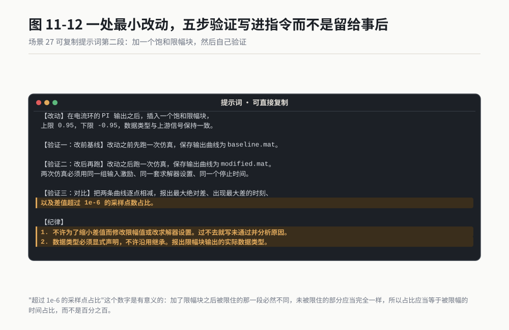

*作者根据公开资料绘制*

### 过程与判断点

合格的回报里，我盯四个数字。

**第一，模块清单的差集。** 改前 N 个模块，改后 N 加 1 个。如果改后报出来的模块数是 N 加 3，那它顺手加了别的东西，你必须问清楚那两个是什么。

**第二，两次仿真的最大差值。** 加了限幅块之后，被限住的那一段曲线必然不同，未被限住的部分应当完全一样。所以差值报告里那个"超过 1e-6 的采样点占比"是有意义的：占比应当等于被限幅的时间占比，而不是百分之百。

**第三，限幅块输出的数据类型。** 它如果报出继承，你必须让它改成显式声明。继承类型在不同配置下可能解析成不同的实际类型，而这个差异往往到实车标定才暴露。

**第四，生成代码的文件数与行数。** 上一次是 12 个文件 2400 行，这一次是 12 个文件 2380 行，你要知道少的那 20 行是什么。

### 翻车清单

**翻车一：版本不对，功能根本没有。** 症状是它说没有这个工具、接口不存在。根因是你看的资料是新版，你装的是旧版。补救：动手前先让 AI 报出你本机 MATLAB 的版本号和已安装工具箱清单，对照官方文档确认功能在这个版本上有没有。

**翻车二：数据类型被悄悄改了。** 症状是仿真结果看着正常，生成的代码编译也过，实测值却偏了。根因是某个模块的数据类型从单精度变成了双精度，或者反过来。补救：在提示词里要求所有数据类型显式声明，并在改动前后各导出一次数据类型清单做差集。

**翻车三：把生成的代码当成不用验证的代码。** 症状是模型仿真过了，代码生成完了，就直接进集成。根因是把"代码是工具生成的"理解成了"代码是对的"。补救：SIL 这一关不许跳过。模型到代码这一跳是真实存在的一跳，跳过它等于放弃唯一一次能便宜地抓到它的机会。

### 验收标准与变体

**验收五条：**

1. 改动前后的模块清单差集恰好等于你要求的那一个模块。
2. 两次仿真使用同一组激励与求解器设置，差值报告里有具体数字。
3. 所有新增模块的数据类型显式声明，不出现"继承"。
4. 采样时间未被改动影响，多速率模型的速率关系保持不变。
5. SIL 对比通过，模型输出与代码输出的差值在你事先定死的门槛内。

**变体一：AUTOSAR 接口对账。** 让 AI 读你的 ARXML 和模型端口，两边对一遍：端口名、数据类型、接口方向。这一类的差异往往出现在改名之后。

**变体二：标定量清单整理。** 让 AI 把模型里所有标定相关的量导成一张表：变量名、默认值、取值范围、单位、所属子系统。这张表给标定工程师，能省掉大量来回问的时间。

**变体三：生成代码的结构走查。** 让 AI 读生成出来的 C 代码，报出函数清单、每个函数的行数、全局变量清单。你不一定看得懂每一个函数，但函数名的可读性、有没有生成出你没预料到的函数，这两件事你能判断。

> **老兵说**：模型画错了仿真会告诉你，代码生成错了仿真不会告诉你。所以模型这一侧的 AI 你可以放手让它干，代码那一侧你必须留一道 SIL 在中间。

---

## 场景 28 代码审查与规范检查：AI 当第一道关 ★★

### 一句话背景

一千八百行代码交上去之前自己先过一遍，看规范、看边界、看异常处理，熟手三小时。AI 做这道关只要二十分钟，但它交出来的东西是"线索"，不是"结论"。这一节讲怎么让它的线索真的有用，以及它的结论为什么不能替你签字。

### 名词小词典

**MISRA C**：汽车和嵌入式行业广泛采用的 C 语言编码规范，一条一条编号，写明什么写法不允许、什么写法必须带说明。

**静态分析**：不运行程序，只读代码文本和语法树来找问题的技术。编译器报警、规范检查、形式化验证都属于这一大类。

**运行时错误**：程序跑起来才会暴露的错误，比如数组越界、除零、空指针解引用。静态分析里有一类工具专门证明这类错误不存在。

**MC/DC 覆盖**：修正条件判定覆盖，一种比"每行都跑到"更严格的测试覆盖率要求。安全等级高的代码通常要求做到它。

**追溯性**：一条需求、一段代码、一个测试用例三者之间能互相指认。评审的时候问的不是代码对不对，是这段代码对应哪条需求。

**误报**：工具报了问题，实际上不是问题。误报率决定了一个工具你还会不会用第二次。

### 开工前准备

1. 待审的代码目录，副本。副本先行在这件事上同样成立。
2. 你公司实际执行的规范文件。没有规范文件就先别做这件事，没有标准的审查等于闲聊。
3. 一份静态分析工具的报告（如果有的话）。AI 的发现和工具的发现对照着看，是这一节里最有价值的一步。
4. 代码的编译环境。它报的问题你要能立刻编译验证。
5. 一支笔。你要在纸上记它的误报条数。

### 操作步骤

这套流程我跑通过，六步：

1. 先定规范清单。把你公司实际执行的规范条目列出来，不要让它自己挑标准。
2. 分批喂代码。一次三百到五百行，不要一次丢一千八百行。批太大它会开始概括。
3. 要求它按四列输出：文件名、行号、违反的规范条目、原文引用。没有行号的条目一律退回。
4. 你自己逐条复核。这一步不能省，复核的时候顺手记误报。
5. 把它报的问题和你静态分析工具的报告放在一起对一遍，分三类：两边都报、只有工具报、只有它报。
6. 把"只有它报"的那类单独拎出来，逐条人工判断。这一类才是它真正的增量价值所在。

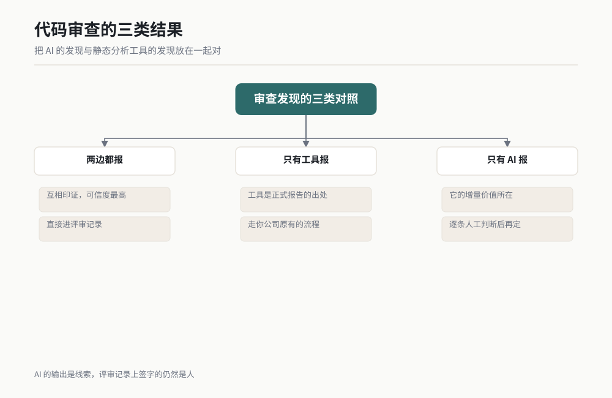

*图 11-4 作者根据公开资料绘制。*

### 可复制提示词

整段复制，规范名和路径换成你自己的：

```
【任务】对我指定的 C 代码做一轮规范审查。你只是第一道关，不是最终判断。

【代码】D:\AI-CODE\motor_drv\src\pwm_map.c，共 1823 行。
【规范】按我下面列出的条目检查，不许自己发明规范，也不许引用我没给的条目：
- MISRA C:2012 规则 10.1（操作数类型不当）
- MISRA C:2012 规则 11.5（指针转换）
- MISRA C:2012 规则 15.5（函数单一出口点）
- 我司规范：所有除法运算前必须显式检查分母非零
- 我司规范：所有数组访问必须显式检查下标上界
- 我司规范：中断服务程序内禁止调用任何可能阻塞的函数

【输出格式】每一条发现必须写成一行，四列：
文件名 | 行号 | 违反的规范条目（写我上面给的原文编号）| 该行代码原文引用
不许输出没有行号的条目，不许输出"建议关注某某函数"这类泛指条目。

【置信度】每条发现后面加一个置信度，只能填这三个值之一：
- 确定（我有把握，且依据是你给的规范条目）
- 可能（我看到了疑点，但需要看更多上下文）
- 我不是在做规范检查（这条属于风格建议，不属于规范违反）
第三类单独归到报告末尾，不许混在前面。

【纪律】
1. 不许修改任何代码。只报告。
2. 不许引用我没给的规范条目。如果你认为某处违反了别的规范，
   写进"待人工确认"一节，并注明你推断的规范名，不许写成结论。
3. 每 300 行暂停一次并汇报当前累计发现数，等我确认再继续下一批。
4. 全部完成后统计：总发现数、按规范条目分组的计数、
   以及你标记为"可能"的条数。
```

### 过程与判断点

一份合格的报告长这样：

```
> [批次 1 / 6] 行 1-300，累计发现 4 条。
> pwm_map.c | 142 | MISRA C:2012 规则 10.1 | duty = (uint16)(period * ratio);   | 确定
> pwm_map.c | 203 | 我司规范：除法前检查分母 | freq = base / div;                | 确定
> pwm_map.c | 271 | MISRA C:2012 规则 15.5 | 函数 PwmMap_Update 内有 3 个 return | 可能
> pwm_map.c | 288 | MISRA C:2012 规则 11.5 | ctx = (PwmCtx *)raw_ptr;          | 确定
> ...
> [统计] 总发现 23 条。规则 10.1 共 6 条；规则 11.5 共 2 条；
>        规则 15.5 共 3 条；我司规范除法共 7 条；数组上界共 5 条。
>        标记为"可能"的 4 条。
> [待人工确认] 3 条，涉及我推断的规范（已注明规范名），不作为结论。
```

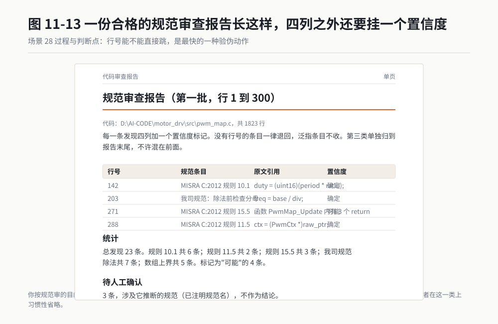

*作者根据公开资料绘制*

我看四处。

**第一，行号能不能直接跳。** 你要能在编辑器里按下那个行号，跳过去，看到的就是它引用的那行原文。跳过去对不上，说明它在编。这是最快的一种验伪动作。

**第二，"确定"和"可能"的比例。** 我跑的那轮是 23 条里 4 条标"可能"。如果一份报告里全部标"确定"，它要么非常强，要么在硬撑。

**第三，第三类有没有被单独隔开。** 风格建议混进规范违反里，是这类工作最常见的污染。你按规范审的目的是过审，不是为了把代码写得好看。

**第四，分组计数。** 按规范条目分组之后，你会发现某一组的数字特别集中。我那轮是除法检查 7 条最多，说明这个文件的作者在这一类上习惯性省略，后面可以针对性地跟他谈一次。

### 翻车清单

**翻车一：它编了一个规范条目号。** 症状是报告里出现你没给过的编号，写得非常正式。根因是它在凭记忆填编号。补救：提示词里写死"只许引用我给的条目"，并要求每条发现后面附你给的原文。编号对不上你给的原文，就是编的。

**翻车二：把风格问题当安全问题报。** 症状是报告里一堆命名、缩进、注释的建议，淹没了真正的问题。根因是你没给它规范清单，它自己按通用最佳实践发挥。补救：先定清单再开审，并且要求风格类单独归类。

**翻车三：漏报。** 这类翻车最难受，因为它没有症状。你不知道它漏了什么。补救：拿一段你已经人工查出问题的代码先让它审一遍，看它能不能找出来。这一步叫"用已知答案给它做摸底考"，五分钟，值。

### 验收标准与变体

**验收四条：**

1. 每一条发现都有行号，且行号能直接跳到它引用的那行原文。
2. 所有规范条目编号都在你给的清单里，没有自创条目。
3. 抽三条"确定"的发现，你自己按规范原文核一遍，三条都成立。
4. 摸底考通过：一段你已知有问题的代码，它能找出来。

**变体一：变更集审查。** 不审整个文件，只审这次改动的那几十行。这一类审查的价值最高，因为上下文新、记忆热、评审人也愿意看。

**变体二：跨文件接口审查。** 让它读两个模块的头文件和调用点，查接口约定：参数顺序、单位、取值范围、错误码含义。这类问题单看一个文件永远发现不了。

**变体三：给新人做预习。** 新人提交之前先跑一遍这套审查，自己先改一轮。

---

### 一条必须单独说的规矩：工具认证不等于模型认证

这一小节是本章最要紧的一段。如果你这一章只看一段，看这段。

在汽车功能安全的语境里有一个词叫**工具认证**。意思是：你用来开发或验证软件的那个工具，如果它出错会导致你漏掉一个安全问题，那么这个工具本身需要被证明是可信的。行业里对应 ISO 26262 的相关部分，常见做法是对工具做鉴定，出具证据包，说明它在什么范围内可信、置信度等级是什么。

一个静态分析工具可以走完这套流程。它有确定的版本、确定的规则集、确定的行为。同一份代码喂进去两次，它输出两次一样的结果。所以它拿得到那张纸。

一个 AI 模型走不了这套流程，至少目前走不了。原因有三条，每一条都很硬：

**第一条，它没有确定的版本行为。** 同一段代码、同一句提示词，问它两次，它可能给出两份不完全一样的清单。不可重复的东西，没法做工具鉴定。

**第二条，它没有确定的规则集。** 它的判断来自训练，不是一个你能打开看的规则库。你没法指着第 47 条规则说"这一条在我们的适用范围内"。

**第三条，它会说错，而且说错的时候语气跟说对的时候一样。**

所以下面这三句话，请你在做汽车软件的时候记住：

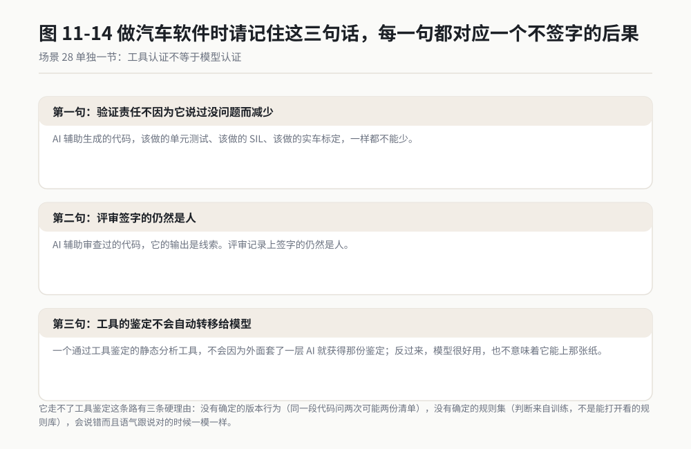

*作者根据公开资料绘制*

> **第一句**：AI 辅助生成的代码，不因为"AI 说过没问题"就免除验证责任。该做的单元测试、该做的 SIL、该做的实车标定，一样都不能少。
>
> **第二句**：AI 辅助审查过的代码，不因为"AI 审过了"就免除人工评审。它的输出是线索，评审记录上签字的仍然是人。
>
> **第三句**：一个通过工具鉴定的静态分析工具，不会因为外面套了一个 AI 外壳就自动获得那份鉴定。反过来也一样：AI 很好用，不意味着它现在能上那张纸。

它们在流程里的正确位置是这样的：

| 环节 | AI 可以做什么 | 谁签字 |
|---|---|---|
| 需求梳理 | 整理、查漏、列检查项 | 系统工程师 |
| 模型搭建 | 搭结构、改参数、生成变体 | 控制工程师，MIL 结果为准 |
| 代码生成 | 配置生成选项、整理生成物 | 工具链本身，SIL 结果为准 |
| 代码审查 | 出线索、分组计数、提示疑点 | 评审人，逐条复核 |
| 规范检查 | 辅助归类、辅助解释 | 静态分析工具出正式报告 |
| 测试 | 生成测试用例草稿、补覆盖率 | 测试工程师，覆盖率数据为准 |
| 安全论证 | 整理证据、写文档草稿 | 安全工程师，负全部责任 |

这张表最右边那一列是本小节的结论：**每一行的签字人都是人，没有一行写着"AI"。**

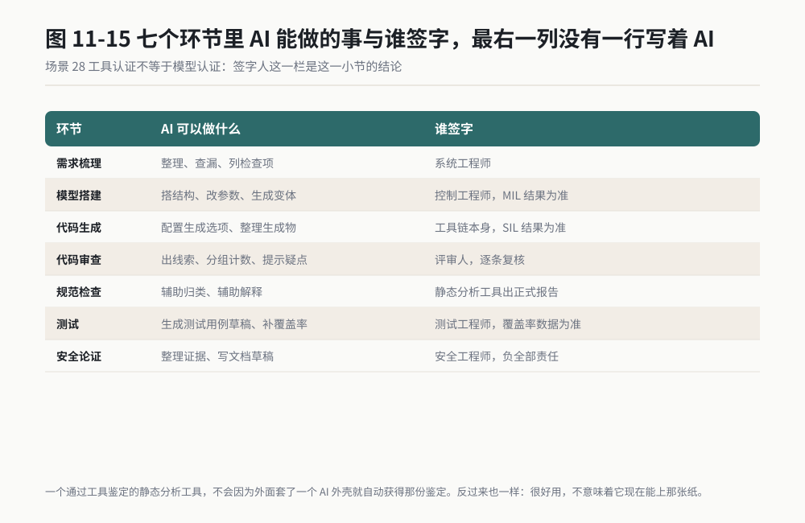

*作者根据公开资料绘制*

> **老兵说**：工具认证证明的是这个工具不出错，模型认证要证明的是这个模型不出错。前者可以靠重复试验做，后者现在没人做得出来。在这件事上，别拿好用当可信。

---

## 场景 29 CAE 仿真前处理：让 AI 准备求解器输入 ★

### 一句话背景

一次结构强度仿真，从几何清理、画网格、加材料、加边界条件到写出求解器能读的输入文件，熟手一整天。这活里最烦的是重复：每改一次几何就要重来一遍流程，每换一个求解器就要重写一遍输入文件。这一节讲社区里已经做到什么程度。

### 名词小词典

**CAE**：计算机辅助工程。用计算机算结构强度、流场、电磁场、温度场的这一类工作的总称。

**前处理 / 求解器 / 后处理**：仿真的三段。前处理是准备输入，包括几何清理、画网格、加材料与边界条件；求解器是真正算数那个程序；后处理是看结果、出云图、提数字。

**网格（Mesh）**：把连续的几何切成几万到几百万个小块，求解器只在小块上算。网格质量直接决定结果准不准、算不算得出来。

**边界条件**：告诉求解器这个件是怎么被约束的、受了什么力、跟外界怎么换热。边界条件错了，网格再漂亮结果也是错的。

**输入文件**：求解器读的那个文本文件。Abaqus 读 `.inp`，很多开源求解器也读类似的文本格式。它是纯文本，能被读、能被比、能进版本管理。

**ODB**：Abaqus 的结果数据库文件格式，二进制。仿真算完之后的结果都在里面。

### 开工前准备

1. 求解器装好并授权到位。Abaqus、ANSYS 系列、Altair 系列都是商业授权；CalculiX、LAMMPS 这类是开源的，可以先用开源的练手。
2. 一个 MCP 服务器或 Agent 桥。公开资料里社区有一个名为 CAE-Agent-Hub 的项目（出处：开源代码托管平台上的公开项目，许可证以项目主页标注为准），公开介绍里覆盖的求解器包括 Abaqus、ANSYS Fluent、ANSYS Workbench、ANSYS HFSS、Altair 系列、CalculiX、LAMMPS 等。面向 Abaqus 还有一类项目（公开介绍里写到工具数在 100 个以上，并提到以 Solver Doctor 为代表的求解器报错模式库，以及以 ODB Lens 为代表的结果文件读取能力）。ANSYS 一侧官方有基于 PyAnsys 的 MCP 项目。名称、覆盖范围与许可证，一律以项目主页和官方文档为准。
3. 一个能跑通的最小算例。一根悬臂梁、一块板，越简单越好。你要有它的解析解。
4. 工作目录全英文无空格。
5. 一份你手算得出的解析解。没有解析解，你无从判断它算出来的是不是对的。

### 操作步骤

这一节标 ★，来自公开资料，下面给通用顺序：

1. 先在软件里手动跑完最小算例：建几何、画网格、加边界、求解、看结果，与解析解对一遍。手动通不过，就不要谈 AI。
2. 起桥、登记、验握手。工具列表里应当能看到建几何、画网格、设材料、加边界条件、写输入文件、提交求解这几类。
3. 让 AI 只读一份已有的输入文件，把它读懂并复述给你：有多少个单元、多少个节点、什么单元类型、几处边界条件、什么材料。它读得对，才敢让它写。
4. 让它写一份最小算例的输入文件。不要让它直接操作几何，先让它写文本。文本你能读。
5. 你人工核这份输入文件。核四个数：节点数、单元数、边界条件数、材料参数。
6. 提交求解，与解析解对比。误差门槛事先定死。
7. 逐步加码到真实几何，每加一级核一次那四个数。

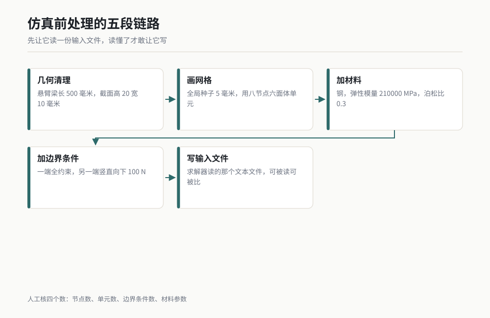

*图 11-5 作者根据公开资料绘制，内容依据公开软件文档与社区案例整理，非本人实测。*

### 可复制提示词

第一段，只读一份已有输入文件。这一步是我在这一侧最推荐的开局：

```
【任务】读我给的这份 Abaqus 输入文件，做只读体检，先不要改任何东西。

【文件】D:\AI-CAE\case01\beam.inp

【报出以下内容，每项都要有数字】
1. 节点总数、单元总数、单元类型清单（每种类型各多少个）。
2. 材料定义：材料名、弹性模量、泊松比、密度。单位一并报出。
3. 边界条件：共几处，每处的类型（位移约束 / 力 / 压力 / 温度）、
   作用的节点集或单元集名字、数值与方向。
4. 分析步：几个分析步、每个分析步的类型、时间长度、增量步设置。
5. 输出请求：要求输出哪些变量，输出到什么文件。

【单位】把文件里出现的单位全部列出来，并检查是否自洽
（长度、力、弹性模量、密度之间的量纲能不能对上）。
不自洽的地方单独列一节写清楚。

【纪律】
1. 不许用"文件看起来完整"这类话，只报数字。
2. 任何读不懂的关键字，原样贴出来并写"此关键字我无法确认含义"，
   不许按常见用法猜。
3. 只读，不许保存，不许提交求解。
```

第二段，让它写一份最小算例的输入文件，并把验证写进指令：

```
【任务】为我写一份 Abaqus 输入文件，算一根悬臂梁的末端挠度。
只写文件，不许提交求解。

【几何与载荷】
悬臂梁：长 500 mm，矩形截面 20 mm × 10 mm（高 × 宽）。
材料：钢，弹性模量 210000 MPa，泊松比 0.3。
一端全约束，另一端施加竖直向下的集中力 100 N。

【网格】全局种子尺寸 5 mm，单元类型用八节点六面体单元。

【验证：你必须自己算一遍解析解】
末端挠度解析公式：δ = F × L³ / (3 × E × I)
其中 I = b × h³ / 12，b 为截面宽，h 为截面高。
把你的代入过程逐步写出来给我看，报出解析解的数值（毫米，保留四位小数）。
写完输入文件之后预测一下：有限元结果应当比解析解略大还是略小，为什么。

【输出】
1. 完整的输入文件原文写到 D:\AI-CAE\case01\cantilever.inp。
2. 在同一个目录写 readme.md，记录：节点数、单元数、材料参数、
   边界条件清单、解析解数值、你的预测。
3. 把输入文件里的节点数、单元数、边界条件数三个数字报给我。

【纪律】
1. 单位必须自洽，全部用毫米、牛顿、兆帕这一套，写进文件注释里。
2. 不许为了让我看不出问题而省略任何一行。文件要能直接被求解器读。
3. 解析解不许套错公式：这是矩形截面，不是圆截面。
   公式里有疑问就写"此处我无法确认"，不许硬套。
4. 你不许提交求解，也不许预测一个具体的收敛值当作实测值。
```

### 过程与判断点

它交出来的东西，我看四处。

**第一，解析解的代入过程。** 这一条我把公式直接写进提示词了，就是为了能对着看。500 长度、100 力、210000 模量、截面 20 乘 10，惯性矩 I 等于 10 乘 20 的三次方除以 12，等于 6666.67 四次方毫米。挠度等于 100 乘 500 的三次方除以 3 乘 210000 乘 6666.67，约 2.976 毫米。它报出来的数跟这个差一个数量级，就是公式套错了。

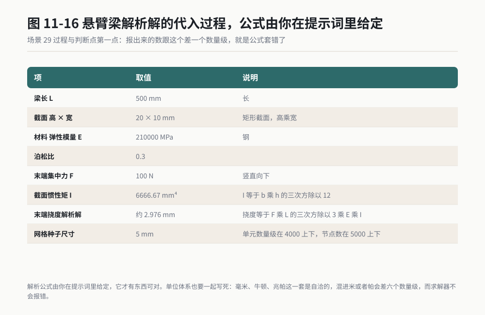

*作者根据公开资料绘制*

**第二，单位自洽。** 毫米、牛顿、兆帕这一套是自洽的：兆帕等于牛顿每平方毫米，所以弹性模量 210000 直接配毫米和牛顿，不用换算。它如果在文件里混进了米或者帕，弹性模量那个数就会差六个数量级，而求解器不会报错，它只会给你一个错得很离谱的结果。

**第三，它敢不敢做预测。** 我让它预测有限元结果比解析解大还是小。这是有标准答案的：有限元用位移插值，刚度偏刚，挠度结果通常略小于解析解。它答对了不一定说明它强，但它答不出、或者绕着走，说明它没有真正理解自己在写什么。

**第四，三个计数值。** 节点数、单元数、边界条件数。5 毫米种子、500 乘 20 乘 10 的梁，单元数量级在 4000 上下，节点数在 5000 上下。它报出 4 万个单元，说明种子尺寸理解错了或者几何尺寸理解错了。

### 翻车清单

**翻车一：单位不自洽，求解器不报错。** 症状是算完了，结果数值离谱但不报错。根因是长度用毫米、模量用帕，量纲差六个数量级。补救：在提示词里写死单位体系并要求它做量纲自洽检查，文件开头用注释声明单位。

**翻车二：解析公式套错。** 症状是两边数字漂亮地对上了，其实是同一个错误的两种表达。补救：公式由你在提示词里给定，或者你自己手算一次最简单的那个数。这一条和第 10 章体检查验单里那条是同一件事。

**翻车三：网格画了但边界条件漏了。** 症状是求解器报"刚度矩阵奇异"或者算出个天文数字。根因是件没有被完全约束，它会刚体飞走。补救：提交求解之前，让它把约束的节点集和自由度逐一列出来给你看，六个刚体自由度必须全被约束住。

### 验收标准与变体

**验收五条：**

1. 输入文件能被求解器直接读，不需要你手改。
2. 节点数、单元数与按种子尺寸估算的量级相符。
3. 单位体系自洽，并在文件注释里写明。
4. 求解结果与解析解的相对误差在你定的门槛内（悬臂梁这种简单算例，百分之几以内是合理的）。
5. 加密一次网格再算一遍，结果应当向解析解方向收敛。不收敛说明模型有问题，不是网格问题。

**变体一：参数扫掠。** 一个尺寸扫五个值，让它生成五份输入文件并批量提交，最后给你一张表。这是前处理这一侧最典型的批量活。

**变体二：换求解器。** 同一个算例让它分别写出 Abaqus 和 CalculiX 的输入文件，两边结果对比。这一步能暴露它对某个求解器格式的理解有多深。

**变体三：给求解器报错当医生。** 求解失败时把报错原文丢给它，让它定位原因。公开资料里有项目专门整理了求解器的常见错误模式库。这一类的验收动作是：它给的修改你要能说出为什么，说不出就别改。

> **老兵说**：前处理这一侧最划算的一招，是先让它读、再让它写。读得懂一份输入文件的 AI，写出来的输入文件才敢提交求解。

---

## 场景 30 仿真结果解读与报告：从结果文件到结论 ★★

### 一句话背景

一次仿真算完，你要从结果文件里提出最大值、找出它在哪、判断这个数能不能接受、写成一页能进评审的结论。这一步熟手三到四小时，因为你要在软件里点几十次才能把该提的数提全。AI 做这步很快，但有一个它绝对不能碰的位置。

### 名词小词典

**结果文件**：求解器算完之后写出来的文件。Abaqus 的 ODB、ANSYS 的 RST、很多开源求解器用的 VTK，都是这一类。它们是二进制，肉眼读不了，得靠接口读。

**云图**：把结果按颜色画在模型上，红的地方大、蓝的地方小。云图是给人看的，不是给机器判的。

**应力集中**：几何突变的地方应力会显著偏高，比如孔边、台阶根部。它是真实存在的物理现象，也可能是网格太糙造成的假象。

**收敛**：网格越密，结果越接近一个稳定值。结果不再随网格变化时，才算收敛。

**安全系数**：材料能承受的极限除以实际算出来的值。它小于 1 就是坏了，但多少算够，是你的行业规范说了算，不是软件说了算。

**后处理**：算完之后读结果、提数字、出图、写报告这一整段工作。

### 开工前准备

1. 结果文件在手，并知道它是哪个算例、哪一次求解的产物。文件名带版本号。
2. 读取接口准备好。能用 Python 读就用 Python 读，能用软件自带接口就用自带接口。不要让 AI 凭文件名猜内容。
3. 一份你已经知道的基线值。哪怕是上一次算出来的数，或者手算的粗略估计。没有基线，你没法判断它提的数字对不对。
4. 验收判据在手：什么值算过，什么值算不过。这个判据来自你的行业标准或者公司规范，不是 AI 定的。
5. 报告模板。字段名、单位、有效位数，先定死。

### 操作步骤

这套流程我跑通过，六步：

1. 先让它只读元数据：这个文件是什么分析类型、多少个增量步、多少个节点、哪些变量可用。先读元数据再读数据。
2. 让它列出可用变量清单，你从里面挑你要的那几个，不要让它替你挑。
3. 让它提取你指定的量：最大值、最小值、出现位置（节点编号与坐标）、所在单元。
4. 交叉验证一个数字。挑一个量，用另一种方式（比如软件界面手动点一次）核一遍，看是不是同一个数。
5. 让它做收敛性说明。这个值是网格加密后稳定下来的，还是随网格一直在变。
6. 让它写报告，但报告里的结论那一栏留空，由你填。


*图 11-6 作者根据公开资料绘制。*

### 可复制提示词

整段复制，文件名、变量名换成你自己的：

```
【任务】读我给的仿真结果文件，提取我指定的量，写成一份报告草稿。
你可以解读，但不许下结论。

【文件】D:\AI-CAE\case07\bracket.odb

【第一步：元数据】先读元数据并报出：
分析类型、分析步清单与步数、节点总数、单元总数、
可用的结果变量清单（把变量名原样列出来，不许翻译、不许合并）。

【第二步：我指定的量】我只关心以下三个量，不许提取别的：
1. 变量 S（应力）的 Mises 最大值
2. 变量 U（位移）的合位移最大值
3. 变量 RF（支反力）的合计值
对每一个量报出：数值（带单位）、出现的节点编号、该节点的坐标、
所在的部件名。

【第三步：位置描述】对上面三个最大值，用几何语言描述它们出现在模型的什么部位
（比如"靠近安装孔边缘""位于加强筋根部"）。
描述不了的坐标就写"位置我无法描述"，不许猜。

【第四步：交叉验证】对 Mises 最大值这个量，用另一种读取路径再取一次
（比如先从单元取值再取节点值，或换一个读取接口），
把两次的结果并排列出来，报出相对差异。

【第五步：收敛性】说明本次结果对应的网格尺寸是多少，
以及这个网格尺寸下结果是否处于收敛区间。
如果你没有足够信息判断收敛性，写"收敛性我无法判断"，不许写"已经收敛"。

【第六步：报告】写到 D:\AI-CAE\case07\report_draft.md，结构如下：
- 算例信息（文件、分析步、网格尺寸）
- 提取结果表（三个量，各四列：量名、数值、位置、读取路径）
- 交叉验证结果
- 收敛性说明
- 结论：留空，写"【结论待人工填写】"

【纪律】
1. 不许写"强度满足要求""设计安全""可以放行"这类判断。
   判据在我手里，不在你手里。
2. 任何读不出来的量，写"未读出"，不许用相近变量替代，不许插值估算。
3. 不许修改结果文件，只读。
```

### 过程与判断点

一份合格的草稿，我看三处。

**第一，变量清单是原样列的。** 它列出来的变量名必须跟软件里的一模一样。它写"应力"，你得追问是 Mises 应力还是主应力、是单元值还是节点值、有没有做外推。变量名这一步含糊，后面所有数字都白提。

**第二，交叉验证的两次结果。** 单元值和节点值本来就不应该完全相等，这是正常的。你要看的是相对差异的数量级。差百分之零点几，正常；差百分之三十，说明某一次读取取错了对象。

**第三，位置描述。** 让它用几何语言说出"最大值出现在安装孔边缘"，比让你自己在云图上找要快得多。但你要防它猜：它说不出的时候，必须写"位置我无法描述"。

**第四，结论那一栏留空。** 这是这条提示词里最要紧的一句。我特意把它写成了模板里的固定字段。

**还有一件事要单独讲：云图的色标。** 我跑那一趟的时候，它一口气给了我四张图，四张图看着完全不一样，一张近乎全蓝，一张大片红。数据是同一份，区别只在色标范围：全蓝那张把上限设成了材料屈服强度的三倍，红的那张把上限设成了最大值的 1.1 倍。同一份结果能讲出两个故事。这就是我把"云图出完必须人眼看一遍"写进验收的原因，并且我要求它在每张图下面把色标的上限值和下限值写出来。

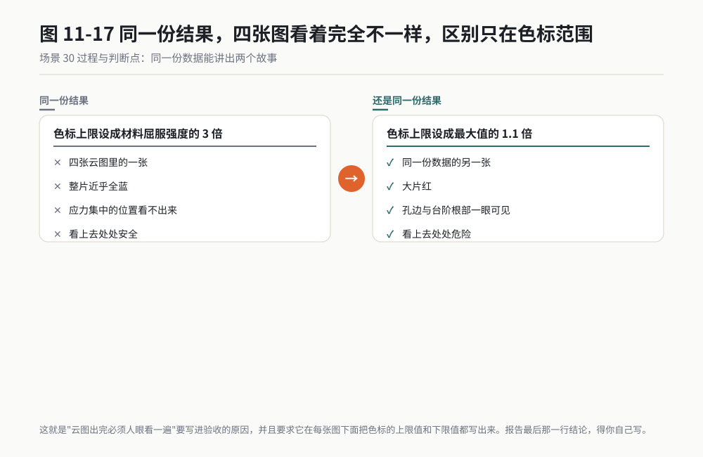

*作者根据公开资料绘制*

### 翻车清单

**翻车一：它替你挑了变量。** 症状是报告里出现你没要求的量，而且它写得像结论一样。根因是你没限定变量清单。补救：在提示词里明确"只提取这三个量，不许提取别的"，并且要求第一步先列完整清单给你挑。

**翻车二：单元值和节点值混着报。** 症状是同一个量在报告的两处出现两个不同的数。根因是单元中心值和节点外推值是两套东西。补救：要求每一次提取都注明读取路径，报告里"读取路径"单独占一列。

**翻车三：它给了结论。** 症状是报告末尾写着"安全系数充足，设计可行"。根因是它把判据当成了常识。补救：模板里把结论栏写成固定占位符，并在纪律里禁止判断类措辞。这一条我再说清楚一点：**它不知道你的安全系数取多少，不知道你的载荷是极限工况还是疲劳工况，不知道这个件坏了会伤到人还是只是响一声。这三件事它都不知道，所以它没资格下结论。**

### 验收标准与变体

**验收四条：**

1. 三个指定量的数值，至少有一个你用另一种方式（软件界面或另一段脚本）核过。
2. 每个量都带单位、带节点编号、带读取路径。
3. 交叉验证那一行有具体数字，不是"两次结果一致"。
4. 报告末尾的结论栏确实留空，没有出现任何判断性措辞。

**变体一：多工况扫掠。** 十个工况，每个工况提同一组量，输出一张十行表。这一类活人工做要点一百次鼠标，脚本化之后几分钟。

**变体二：改模前后对比。** 改一处几何之前存一份提取结果，改完再存一份，两张表并排。最大值降了多少、位置有没有转移，一眼就能看出来。

**变体三：给评审做图。** 让它批量导出指定视角、指定变量的云图。图出完之后仍然要人眼看一遍，因为云图的色标范围是可以被人为调的，同一份数据能画出完全不同的两张图。

> **老兵说**：AI 可以替你把数提出来，可以替你说出最大值在哪，甚至可以替你把报告写完。但报告最后那一行结论，得你自己写。签字的那天站在评审会上的是你，不是它。

---

## 小白词典

**PCB**：印刷电路板，那块绿色的板子，铜箔刻成线路，元器件焊在上面。类比：城市道路网加沿街的房子。

**EDA**：电子设计自动化软件的总称，画原理图、画板子、查规则都在里面做。常见的有商业软件 Altium Designer 和开源软件 KiCad。

**网表（Netlist）**：一份文本文件，写着谁跟谁连在一起。原理图导出的和 PCB 导出的本该完全一致。类比：一张通讯录。

**BOM**：物料清单，这块板子由哪些物料、各几个、什么编码，一表列清。类比：做菜前的配料表。

**ECO**：工程变更指令。改一个电阻值、换一个供应商，都算一次 ECO。

**封装（Footprint）**：一个元器件在板子上占的那块焊盘图形。类比：鞋码，鞋对了脚才穿得进去。

**求解器（Solver）**：真正算数那个程序。前处理给它输入，它算完给结果文件。类比：厨房里那个真正在炒菜的灶。

**前处理**：仿真三段里的第一段，几何清理、画网格、加材料、加边界条件、写输入文件。类比：备菜。

**后处理**：仿真三段里的最后一段，读结果、提数字、出云图、写报告。类比：摆盘和上菜。

**网格（Mesh）**：把连续几何切成很多小块，求解器只在小块上算。类比：积分就是切得足够细之后求和。

**收敛**：网格越密结果越接近一个稳定值。结果不再随网格变，才算收敛。类比：像素越高越接近真实照片。

**ISO 26262**：汽车功能安全的国际标准。它管的是"这个电子系统坏了会不会伤到人，以及你怎么证明它不会"。

**ASIL**：汽车安全完整性等级，A 到 D，D 最高。等级越高，验证要求越严。类比：不同危险程度的作业要不同级别的防护。

**AUTOSAR**：汽车电子软件的行业标准接口规范，分 Classic 与 Adaptive 两支。类比：不同厂家零件之间的统一安装孔位。

**MISRA C**：嵌入式行业广泛采用的 C 语言编码规范，一条一条编号。类比：交通法规，每一条都对应一类事故。

**MIL / SIL**：模型在环与软件在环。MIL 拿模型跑仿真，SIL 拿生成的 C 代码跑仿真，两者结果应当一致。类比：草稿和定稿要对得上。

**MCP**：一套让 AI 调用其他软件能力的通用接口标准。AI 说话，桥翻译，软件动手。

**工具认证**：功能安全语境下，证明你用的开发工具本身可信的一套鉴定流程。它是给工具发的证，不是给人发的证。

## 你的岗位怎么用

**硬件与电路板工程师**：先抄场景 26。它不依赖任何授权，三份文件就能跑，二十分钟出一份差异报告。跑顺了再试场景 25，从只读体检开始，别一上来就让它动画板。

**软件与算法工程师**：场景 28 直接能用，但请连同那节"工具认证不等于模型认证"一起读。你的收益在"我提交之前先自查一轮"，不是"AI 替我过评审"。场景 27 属于调研级，动手前先确认你的版本和授权。

**仿真与 CAE 工程师**：场景 30 是你最容易上手的一节，因为它只读不改。先用你手上一个已经算完的算例跑一遍，看它提的数跟你的基线差多少。场景 29 属于调研级，先用开源求解器练手，别拿商业授权的第一个月去试。

**质量与功能安全工程师**：请直接翻到场景 28 后面那一小节。那张"谁签字"的表是你跟开发团队谈这件事时可以贴在会议室墙上的东西。AI 的证据链可以进档案，AI 的结论不能进档案。

**项目经理**：盯场景 26 那个"先报六个底账数字"的动作。它跟第 10 章那个冻结评分表是同一件事：标准先定死，后面不扯皮。这一条放在 AI 之外的任何外包任务上都成立。

**采购与供应商管理**：场景 26 的变体二跟你直接相关。外协厂的 BOM 进来之前先对一遍，重点看物料编码不同的那些行。

## 本章交付物

**一份四列代码审查模板，外加一张三份文件交叉引用的底账卡。**

做法一：把场景 28 那段提示词的四列输出格式抄进你的笔记，字段换成你公司实际执行的规范条目编号。以后每次提交代码之前跑一遍，二十分钟。

做法二：把场景 26 的六个底账数字写进你的检查清单第一位。原理图器件数、PCB 器件数、BOM 数量合计、三份网络数，六个数先摆出来，再谈差异。

第一件验收的活：挑一个你手上已经算完的仿真算例，走一遍场景 30，看 AI 提的最大值和你自己在软件里点的那个数差多少。差在百分之一以内，你就可以把它用在下一个算例上；差得离谱，你就知道这一侧的桥还得再调。

## 本章金句

> 在电路板和控制器代码上，AI 最危险的不是做错，是做对了九十九处、错在第一百处，而错的那一处长得很像对的那一处。

> 工具认证证明的是这个工具不出错，模型认证要证明的是这个模型不出错。前者能靠重复试验做，后者现在没人做得出来。

> AI 辅助生成的代码，不因为"AI 说过没问题"就免除验证责任。

> 它的输出是线索，评审记录上签字的仍然是人。

> 它不知道你的安全系数取多少，不知道这是极限工况还是疲劳工况，不知道这个件坏了会伤到人还是只是响一声。这三件事它都不知道，所以它没资格下结论。

---

*（下一章：让 AI 碰到你的电脑。电路板和求解器好歹还是文件，下一章它要碰的是你的文件系统、你的终端和你那些正在跑着的进程，那才是真正需要先把刹车装好的地方。）*
