# 第 13 章 设计审核与风险：让 AI 当那个挑刺的人

> 评审会上最值钱的一句话从来不是"同意"，而是"等一下，这里我说不通"。AI 不能替你签字，但它能在你推开会议室门之前，先把这句"等一下"喊出来。

2023 年 11 月的一个周三，上午九点零五分，三号评审室。

那是我做微电机研发的第 9 年，第一次以设计负责人身份主持一场 DR4 评审。DR4 是我们内部量产前的最后一道设计闸门，过不了就往下走不了。

材料一共 38 页：一套总成图纸、一份轴向尺寸链计算书、一份 DFMEA、三份试验报告、一张开口项跟踪表，提前一天发给了到会的 7 个人。

会开到第 17 分钟，质量部的老张把材料翻到第 9 页，指着一行数问我："输出轴轴向间隙，图纸上写 0.05 到 0.35，这个上限你怎么保证？"

我答得挺快，说是五个环累加出来的极值法结果。

他又往下追了一句："那第三个环，端盖轴承室的深度公差 0.12，这个数哪来的？是供应商的长期过程能力，还是你自己拍的？"

那句话我到现在还记得。我沉默了大概五秒钟。答案是后者。我是照着上一代产品的图纸抄的，抄的时候没人问我为什么，我也没有问上一代为什幺。

会上我没当场承认，只说了一句回头核实，然后把它记进开口项。评审结果是通过，挂 14 条开口项，其中 3 条两周内必须关闭。

真正让我后背发凉的不是挨了这一下。散会之后我把那份 DFMEA 从头翻到尾，发现失效模式表里写了 43 行，没有一行提到装配顺序错误导致的轴承预压异常。

而这个失效在前一年的样机阶段真的发生过一次，处理结论写在一封邮件里，那封邮件就躺在我自己的收件箱，谁也没把它搬进 FMEA。

那 14 条开口项，我花了两个礼拜才关完。一条项目的节拍，就这样被我自己的材料拖住了半个月。

三年之后，我换了一种做法：开会之前，先把材料整包丢给 AI，让它按我最苛刻的口径先挑一遍。它挑出来的东西不是都对，虚警大概四成，但它每次都能挑出那么三四条我自己绝对想不到的事。

这一章讲的就是这套打法。六个场景，全部围着同一个目标：让你带着问题清单走进会议室，而不是带着自信走进去。

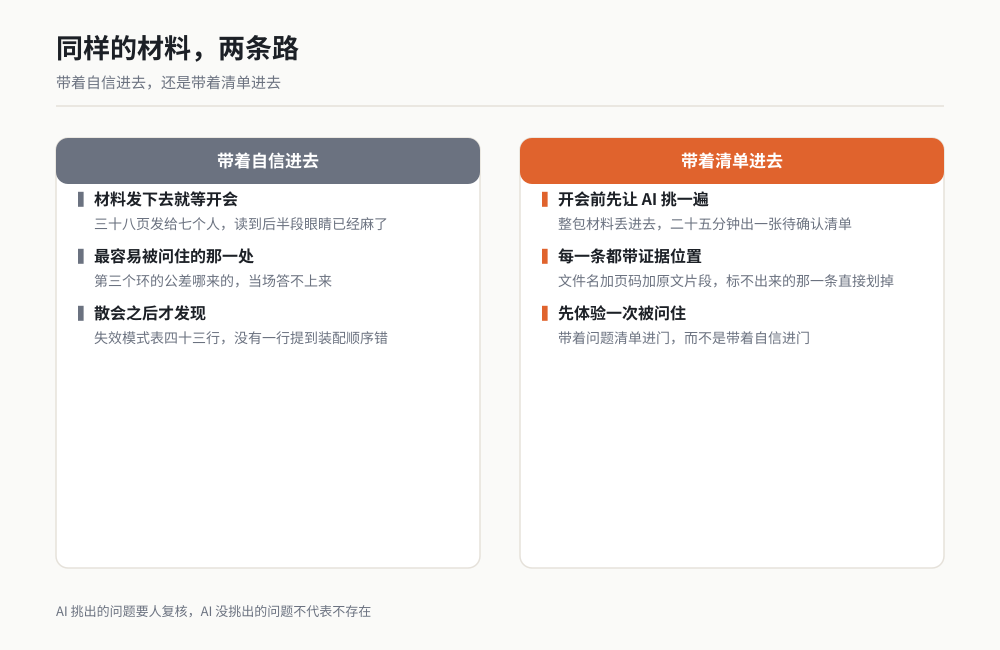

*图 13-0 作者根据公开资料绘制。*

---

## 本章六个场景速览

| 场景 | 场景名 | 人工耗时 | AI 耗时 | 可信度 |
|---|---|---|---|---|
| 37 | 评审材料预审：开会前先让 AI 挑一遍刺 | 约 3 小时 | 约 25 分钟 | ★★★ 实测 |
| 38 | 图纸与数模检查清单：从经验清单到自动核对 | 约 2 小时 | 约 15 分钟 | ★★★ 实测 |
| 39 | 失效模式联想：DFMEA 辅助 | 约 2 人天 | 约 40 分钟 | ★★ 跑通 |
| 40 | 公差与尺寸链校核：让 AI 帮你算，你来判断 | 约 4 小时 | 约 20 分钟 | ★★★ 实测 |
| 41 | 变更影响分析：改一个尺寸会牵动哪些件 | 约 1.5 人天 | 约 30 分钟 | ★★ 跑通 |
| 42 | 经验教训库：把过去的问题变成可检索的资产 | 建库约 3 人天 | 单次检索约 5 分钟 | ★★ 跑通 |

六个场景有一条共同的红线，先摆在前面。

> **【本章铁律】AI 挑出的问题要人复核，AI 没挑出的问题不代表不存在。评审签字的人是你，担责的人是你。这一条在本章任何场景里都不打折。**

这句话的意思是：AI 预审完交给你的那张单子，叫"待确认清单"，不叫"结论清单"。单子上每一条，你要么关掉它，要么写清楚为什么关掉。

风险不会因为跑了一遍 AI 就消失，它只是从你没想到的地方，挪到了你没复核的地方。

---

## 场景 37 评审材料预审：开会前先让 AI 挑一遍刺 ★★★

### 一句话背景

一场正式的设计评审，材料往往是几十页的一整包：图纸、计算书、试验报告、DFMEA、BOM、开口项表。人工通读一遍再交叉核对，保守两到三小时，而且读到后半段眼睛已经麻了，最容易漏的恰恰是最后那几页。这个场景把整包材料交给 AI 先跑一遍预审，25 分钟左右出一张带证据位置的待确认清单。

### 名词小词典

**设计评审（Design Review）**：设计推进到某个节点时，把材料摊开给一群相关的人看，让他们挑问题、决定能不能往下走。常见节点代号是 DR1 到 DR5，各家叫法不同，逻辑一致。

**交付物清单（Deliverable List）**：这道闸门规定你必须交出哪几份东西。缺一份，会就开不成。

**开口项（Open Issue）**：评审上被提出来、当场没有关掉的问题。它必须有人、有日期、有关闭准则，否则等于没提。

**关闭准则（Exit Criteria）**：这一轮算通过的条件。比如"零条致命开口项，一般开口项不超过 5 条"。准则要在看材料之前定死。

**虚警（False Positive）**：AI 报了一条问题，你去核了，发现它是错的。虚警不可怕，按虚警去改设计才可怕。

### 开工前准备

1. 把这一轮要评审的全部材料收进同一个文件夹，路径不要有中文和空格。我用的是 `D:\review\dr4\`。
2. 材料格式尽量统一为 PDF、DOCX、XLSX、PPTX、Markdown 这几类。扫描件做成图片 PDF 的话，先做一次文字识别，否则读不到字。
3. 手边准备一份你公司的交付物清单。没有的话，直接用下面提示词里那份通用清单。
4. 一个评审包的总页数控制在 200 页以内。超了就分批喂，先喂图纸与计算书，再喂试验报告。
5. WorkBuddy 新建一个对话，模式选 Agent。别接着聊别的项目的旧对话往下用，上下文串味会让它把别的项目的结论搬过来。
6. 事前想清楚让它用谁的视角挑。同一个材料包，用质量工程师视角跑一遍和用工艺工程师视角跑一遍，挑出来的东西完全不一样。

### 操作步骤

1. 先让它把材料编一遍目，不许它发表任何意见。这一步用来确认它真的读进去了，而不是只看文件名在猜。
2. 给它一份交付物清单，逐项核对缺哪一份。缺件是一票否决项，先处理。
3. 让它按"挑刺者"的角色跑第一轮：只找矛盾和缺失，不许提改进建议。两件事混在一起会稀释注意力。
4. 第一轮出结果后，你自己先过滤虚警。这一步别省，也别指望它自己过滤。
5. 挑它能拿到真东西的那个视角跑第二轮专项深挖。做微电机项目时，我常让它只盯"低温工况"这一个轴。
6. 让它把每一条都标上证据位置：文件名加页码加原文片段。标不出来的那一条直接划掉。
7. 让它按"是否可能导致评审不通过"排序，输出成一份 Markdown 文件。
8. 带着这份清单去开准备会，或者自己先关一轮能关的。

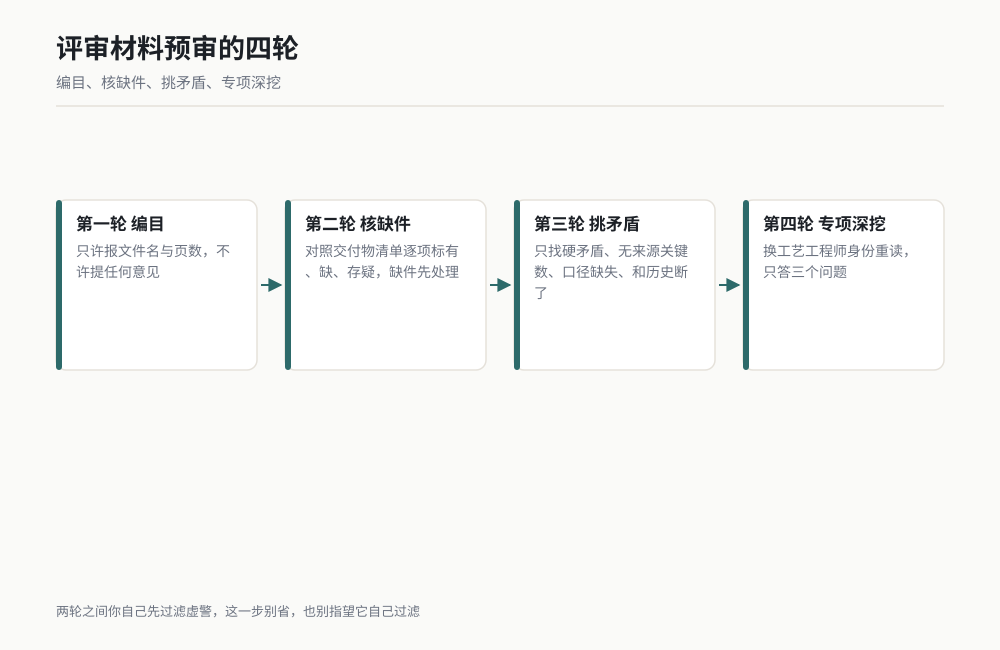

*图 13-1 作者根据公开资料绘制。*

### 可复制提示词

第一段，编目与核缺件。整段复制：

```
【任务】对我放在 D:\review\dr4\ 目录下的这一整包设计评审材料做预审。
你现在是一名来参加评审的审核人，不是写材料的本人。你的立场是挑毛病。

【第一轮：只编目，不许评价】
把这个目录里的文件逐个列出来，做成一张表：文件名、页数或行数、文档类型、
你能判断出来的主题。列完之后告诉我你一共读到了多少页。
这一轮不许提任何意见，不许说"建议"。我只想确认你真的把每一份都读进去了。

【第二轮：核交付物清单】
以下是本次评审规定的交付物清单，逐项核对并在表里标注"有 / 缺 / 存疑"：
1. 总成图纸与全部零件图，含图号清单
2. 尺寸链计算书
3. DFMEA 表
4. 试验大纲与完整的试验报告
5. BOM
6. 特殊特性清单
7. 开口项跟踪表，含责任人、日期、关闭准则
8. 上一轮评审开口项的关闭证据
缺项直接写"缺"，不要用"建议补充"这种软话。
```

第二段，挑刺本体。这一段是整个场景的核心：

```
【第三轮：挑矛盾与缺失】
以挑刺者的身份把整包材料通读一遍，只找下面四类问题，每条都要给证据：

A 类：硬矛盾。材料内部两处说法不一致。例如计算书里某个数与图纸标注不一致、
     BOM 里的零件数与图纸明细表不一致、试验报告的样品状态与大纲要求不一致。
B 类：无来源的关键数。任何一个影响安全、法规或功能的数值，材料里没交代来源。
     比如某个公差、某个安全系数、某个试验样本的选取依据。
     判定写法必须是"材料未给出来源"，不许写成"该值不合理"。
C 类：口径缺失。该写没写。例如 DFMEA 某行给了探测度分数却没有对应的探测手段、
     试验报告有结论却没有原始数据附件、开口项没有关闭准则或责任人。
D 类：和历史断了的地方。本轮材料与上一轮材料、与已结案问题的结论之间不一致。

【输出格式】每条一行，格式固定，不许改：
编号 | 类别 | 一句话问题描述 | 涉及文件与页码 | 原文引用（40 字以内） | 把握（高/中/低）

【纪律】
1. 找不到证据位置的问题不许写。没页可引的猜测一律扔掉。
2. 不许提任何改进建议，这一轮你只负责找问题。
3. 不许用"值得关注""建议考虑"这种含糊说法，每条必须是能验证的陈述句。
4. 全部列完后统计各类条数，并明确列出你这一轮没能覆盖的部分，
   例如扫描件读不到字、某份表格太长只看了前半段。没覆盖的必须如实交待。
5. 输出写进 D:\review\dr4\预审清单.md。
```

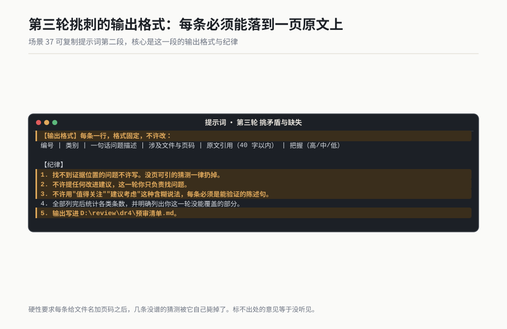

*作者根据公开资料绘制*

第三段，换视角做专项深挖：

```
【第四轮：单视角深挖】
换一个身份重读整包：你是装配车间的工艺工程师，明天就要按这套图纸做首件。
只回答三个问题：
1. 图面上有没有你装不出来的地方，或者需要额外做工装才能装的地方？
2. 有没有装配顺序会影响最终精度的位置，而图纸没给出装配顺序要求？
3. 有没有需要专用检具才能测的尺寸，而这份材料里没提到检具方案？
每条同样要带文件名与页码。答不上来的问题直接写"材料未提供"，不许编。
```

### 过程与判断点

我在一次真实的 DR4 材料包上跑出来的结果，是这样一张表：

| 类别 | 它报的条数 | 我复核后留下 | 其中真正致命 |
|---|---|---|---|
| A 类硬矛盾 | 7 | 5 | 2 |
| B 类无来源关键数 | 14 | 9 | 1 |
| C 类口径缺失 | 16 | 8 | 0 |
| D 类和历史断了 | 4 | 1 | 1 |
| 合计 | 41 | 23 | 4 |

41 条里留下 23 条，虚警率 44%。这个量级我跑过三次，都在四成到五成之间。先对这个数字有心理准备，别因为它错了一半就判定这活不值。

真正值钱的是那 4 条致命项。挑两条拆给你看。

第一条是 A 类。它指出计算书第 9 页里端盖轴承室深度写的是 12.0 正负 0.12，而总成图纸第 3 页同一处标的是正负 0.08。两个数不一样，图纸和算书打架。这一条我自己开会前重读了两遍都没发现，因为人眼扫数字的时候会自动往期望值上靠。

第二条是 D 类。它指出这一版的 DFMEA 删掉了上一版里的一行，内容是"输出端油脂低温稠化导致起动扭矩超差"，而删除动作没有出现在任何变更记录里。

我当时不信，回去翻了上一版文件，它是对的。上一轮我确实删了，理由是"已经在第一轮试验里通过"，但通过的是零下 30 度，而这一轮的技术要求写的是零下 40 度。

证据位置这一条我要多说一句。提示词里硬性要求每条必须给文件名加页码，效果非常直接：几条没谱的猜测因为它标不出页码，被它自己毙掉了，剩下 41 条全部可追溯。标不出处的意见，等于没听见。

带把握列这一列也有用。我复核的顺序是按把握从低到高走，先收拾"低"的那几条虚警，因为它们占的时间最少，砍掉之后单子立刻短一半。

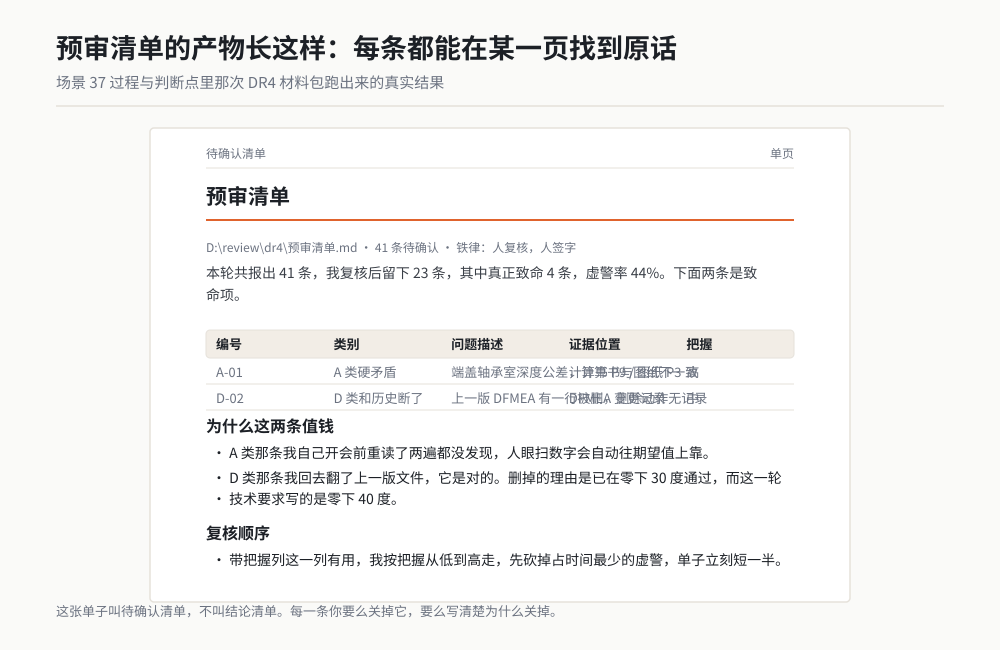

*作者根据公开资料绘制*

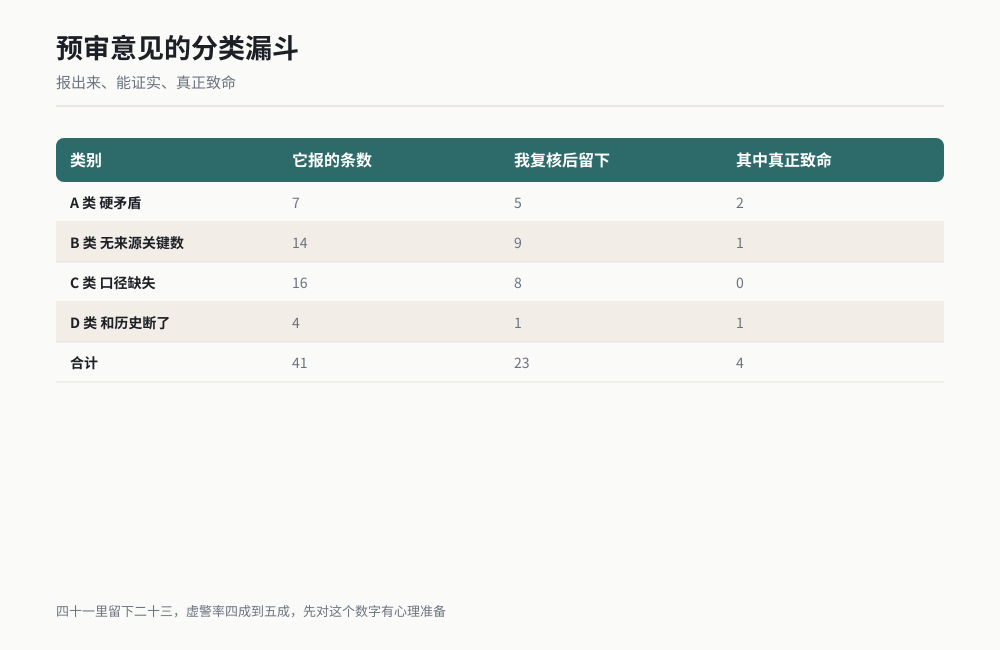

*图 13-2 作者根据公开资料绘制。*

### 翻车清单

**翻车一：它开始提改进建议，把真问题淹了。** 症状是报告里一半是"建议进一步完善""建议增加说明"这种话。根因是提示词里没封死这一条。补救：明确写"不许提改进建议"，并要求每条必须是能验证的陈述句。

**翻车二：材料是扫描件，它照着文件名编了一段看上去很像的报告。** 症状是它引用的原文你在 PDF 里搜不到。根因是图片 PDF 没有文字层，它只能靠上下文猜。补救：让它先报每个文件读到了多少个字符，字符数明显偏少的那几份先做文字识别再重跑。

**翻车三：你让它在材料之外给你补了一个数。** 症状是报告里出现"按常见做法，该公差通常取 0.1"这种话，然后你把它抄进了正式材料。补救：凡是要写进正式文件的数，来源只能是标准表、实测数据、供应商过程能力数据三者之一，来源不在三者里的必须留白并写"待核"。

### 验收标准与变体

**验收五条：**

1. 清单里每一条都能在本包材料的某一页找到原话，逐条抽查五条做溯源，找不到就删掉整批里所有同类型的条目。
2. 缺件核对的结论与你手数的结果完全一致，尤其是"缺"的那几项。
3. 至少找出一条它标为"把握高"、经你核实却是错的意见。找不出来，说明你复核得不够狠。
4. 你自己复核一轮的耗时不超过 25 分钟。超过说明它在灌水，回头收紧提示词里的输出格式。
5. 单子里每一条拿到准备会上都能当着人说出来，不用回头再翻材料。

**变体一：给供应商的材料做预审。** 供应商交上来的一整包认可资料，用同一套提示词跑一遍，重点看 A 类硬矛盾。这一类最值钱，因为对方的材料往往是好几个人拼出来的，内部打架的概率比你自己写的还高。

**变体二：给三年前的老材料做预审。** 拿一个已量产项目的归档包跑一遍，你会意外地找出若干处当年没人追问过的地方。这一招拿来练新工程师的手感特别好。

**变体三：让它从对话记录里直接出开口项表。** 在预览了一大轮问题之后，指定输出格式（编号、问题描述、责任人、日期、关闭准则五列），一句话就能导出一张能直接贴进跟踪系统的表。

> **老兵说**：预审不是为了让它替你把材料批合格，是为了让你在进会议室之前先体验一次被人问住的感觉。它挑十四条，里面有九条能用，剩下五条是它替你练的反应速度。


---

## 场景 38 图纸与数模检查清单：从经验清单到自动核对 ★★★

### 一句话背景

老工程师脑子里都有一张检查清单：标题栏填没填、比例对不对、材料写没写、形位公差给没给基准、粗糙度有没有、焊接符号有没有技术条件。这张清单靠人过一遍，一张 A3 图大约七八分钟，一套二十几张图的包要两个小时，而且下午四点以后过图，出错率是上午的三倍。这个场景教你把这张老清单交给 AI 自动过一遍，同时说清楚一件更要紧的事：它能查什么，查不了什么。

### 名词小词典

**GD&T（几何尺寸与公差）**：一套用符号规定形状位置允许的偏差范围的语言。比如一个框格里写着垂直度符号加 0.05 加基准字母 A，意思是这个面相对于 A 面，垂直方向的偏差不能超过 0.05。

**基准（Datum）**：测量时的起始参照。没有基准就提垂直度，相当于没说参照哪儿垂直。

**公差带**：尺寸被允许变动的那段范围。标注 20 正负 0.1，公差带就是 0.2 宽。

**粗糙度（Ra）**：表面微观凹凸的平均高度。它直接影响摩擦、磨损和密封。

**投影角**：第一视角和第三视角，图纸把立体画成平面的两种约定。国内常用第一视角，混用会让工人把图看反。

**明细表（BOM）**：这张图对应的产品由哪些零件、各几个组成的表。

### 开工前准备

1. 待检的图纸，PDF 优先，DOCX 和原生工程图文件也可以。混着放也行，但要放在同一个目录里。
2. 一份你公司的图纸检查清单。没有的话，用下面提示词里那份通用清单先跑，再把你们的行补进去。
3. 三维数模如果要一起查，需要先在第 10 章那套 MCP 桥里把数模打开。本节主线只查图纸，数模那一段放到最后一条变体里讲。
4. 明确这张图的零件用什么工艺。压铸、注塑、机加各自的关注项完全不同，这条不告诉 AI，它就只能查通用项。
5. 一支笔和一台打印机。自动查完之后那一道人眼不能省，最后一遍一定在纸上走。

### 操作步骤

1. 让它先逐张把标题栏字段读出来，这一步不许它发表任何评价，只报原文。
2. 逐项过通用检查项，把缺漏记进它返回的表里。格式定为每张图一行、每个检查项一列，格子里写“有 / 缺 / 不适用 / 存疑”四选一。
3. 针对第一轮标为“缺”的项，让它回头再找一遍全文证据，看是不是写在别处以另一种形式出现了。这一步能砍掉一半误报。
4. 对关键尺寸做一轮高级检查：每个功能尺寸有没有对应的公差、每个形位公差框有没有基准、同一个基准在不同视图里指代是否一致。
5. 让它把格式问题和技术问题分两张表输出。格式表直接发给画图的人改，技术表留给你自己判断。
6. 打印一张最典型的图，对着实物或数模自己再走一遍，然后跟它的单子逐行对，把两边不一致的地方圈出来，这就是你下一版清单要补的行。
7. 最后一轮让 AI 把这一次的结果写成检查报告文件归档，下次同一个零件复查时拿来比对。


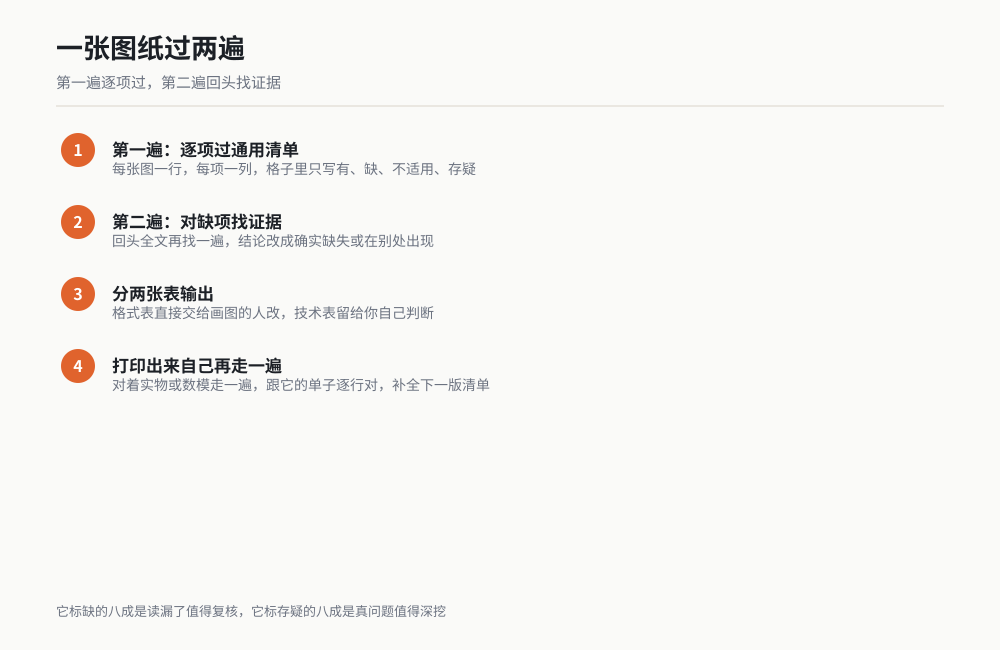

*图 13-3 作者根据公开资料绘制。*

### 可复制提示词

整段复制，工艺改成你自己零件的：

```
【任务】对 D:\draw\dr4\ 目录下的全部图纸做一次完整性检查。
这批零件的工艺是：铝合金压铸加数控精加工（换成你自己的工艺）。

【第一步：报数】先告诉我你读到了几份文件、每份多少页，然后逐张列出标题栏字段原文：
图名、图号、材料、比例、投影角、设计、审核、日期、版本。
这一轮不许评价，只报原文。缺的字段写"（空）"，不许写"未提供"这种模糊词。

【第二步：通用完整性检查】逐项过下面这张清单，输出一张表，
每张图一行，每项一列，格子里只允许写：有 / 缺 / 不适用 / 存疑。
检查项：
1. 标题栏字段是否齐全（图名、图号、材料、比例、投影角、设计、审核、日期、版本）
2. 每个视图是否标注了比例，比例是否与图纸标注一致
3. 是否有未标注公差的线性尺寸（通用公差条款覆盖的除外，要指明条款在哪）
4. 所有功能尺寸是否有对应的公差带
5. 每个形位公差框是否给出了基准；没有基准的要单独标出来
6. 基准符号是否在同一张图的不同视图中重复出现且指代同一要素
7. 是否有表面粗糙度标注，Ra 值是否合理到 ± 一位有效数字
8. 技术要求条目是否齐全：未注公差、未注圆角、去毛刺、表面处理、热处理
9. 明细表行数与图上序号数是否一致
10. 是否有仅在某一视图出现、却在整个图上没有任何关联标注的尺寸要素

【第三步：证据复核】对第二步标为"缺"的每一项，回头再全文找一遍，
确认它是真的缺，还是以别的写法出现在技术要求里。复核后把结论改为"确实缺失"或"在别处出现"。
在别处出现的，必须给出那句话的原文和你找到它的位置。

【第四步：分表输出】把结果分成两张表：
表 A 是格式与记录类问题，这些可以直接交给画图的人改。
表 B 是需要设计判断的问题，这些交给我。
两张表都写进 D:\draw\dr4\图审报告.md，每张表后面附你自己的不确定项清单。

【纪律】不许评价任何设计意图，不许说某个尺寸"看起来偏大"这类话。
你只回答"有没有写"和"写得是否自洽"，不回答"应不应该这么设计"。
```

### 过程与判断点

我在一套 27 张图的减速箱体包上跑过，它交回来的报告开头长这样：

```
> 共读到 6 份 PDF，合计 27 页。
> [图号 6 张] 标题栏：图名齐、图号齐、材料齐、比例齐、投影角齐、
>              设计齐、审核（空）、日期齐、版本齐。审核一栏 6 张全空。
> [检查项 1] 6 张均"有"。
> [检查项 3] 图 3、图 5 各有一处线性尺寸未标公差，且通用公差条款指向的技术要求第 2 条
>            在这两张图上写的是见同系列图号 XXX，跨图引用，判定"存疑"。
> [检查项 5] 图 4 有两个形位公差框未给基准，分别是 Ø18 孔的位置度与端面圆跳动。
> [检查项 9] 图 1 明细表 21 行，图上序号 22 个，不一致。
```

这一段报告里我最看重三行。

第一行是审核栏全空。六张图，一张没签。这是再典型不过的格式问题，也恰恰是最容易翻的地方，因为签字这件事没法由画图的人自己补。AI 扫一遍两分钟；人扫六张图，有时候就是看不见。

第二行是通用公差条款指向了技术要求第 2 条，而那条写的是见另一个图号，属于跨图引用。这里它判的是"存疑"而不是"缺"，分寸拿捏得对。跨图引用本身不违规，但它是评审桌上最常被揪住的位置。

第三行是明细表 21 行对序号 22 个。数字对不上就必须查清楚，它常常对应一颗螺钉被漏掉了，或者某个零件被重复编号。这条我当场核了，是两个同样的卡簧被编了两个号。

我的判断经验是：**它标"缺"的条目，八成是它读漏了，值得复核；它标"存疑"的条目，八成是真问题，值得深挖。** 存疑是它自己也拿不准但又不好意思跳过的位置，那正是人的注意力该落的地方。

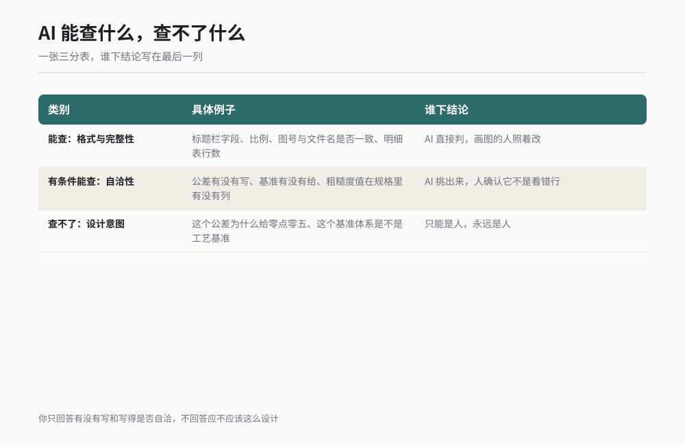

*图 13-4 作者根据公开资料绘制。*

### 这篇必须写清的边界：AI 查不了什么

这是本节最重要的一张表，建议打印：

| 类别 | 具体例子 | 谁下结论 |
|---|---|---|
| 能查：格式与完整性 | 标题栏字段、比例、图号与文件名是否一致、明细表行数、技术条件条目数 | AI 直接判，画图的人照着改 |
| 有条件能查：自洽性 | 公差有没有写、基准有没有给、粗糙度值是否在规格里有列 | AI 挑出来，人确认它不是看错行 |
| 查不了：设计意图 | 这个公差为什么给 0.05、这个倒角方向合理吗、这个基准体系是不是工艺基准 | 只能是人，永远是人 |

第三类再说透一点。AI 可能会说某处公差偏严，因为它的语料里同类特征通常给到另一个量级。但它不知道这个孔要装的是一支编码器，编码器对安装面的跳动有它自己的要求。这些信息写在设计师的脑子里和上几次会议的纪要里，不在这包材料里，它就无从判断。

所以提示词最后那句纪律，不许评价设计意图，不是客气话。一旦允许它评价，它给出的判断就会和资料强混在一起，你很难再把两者分开。

### 翻车清单

**翻车一：它把跨图引用的内容判成缺失。** 症状是缺一行出现一大片，你跑去一看，都写在别处。补救：提示词里必须加第三步证据复核，让它自己回头再找一遍并给出原文位置。我这套流程加了这一步之后，缺的条目从 19 条降到 6 条。

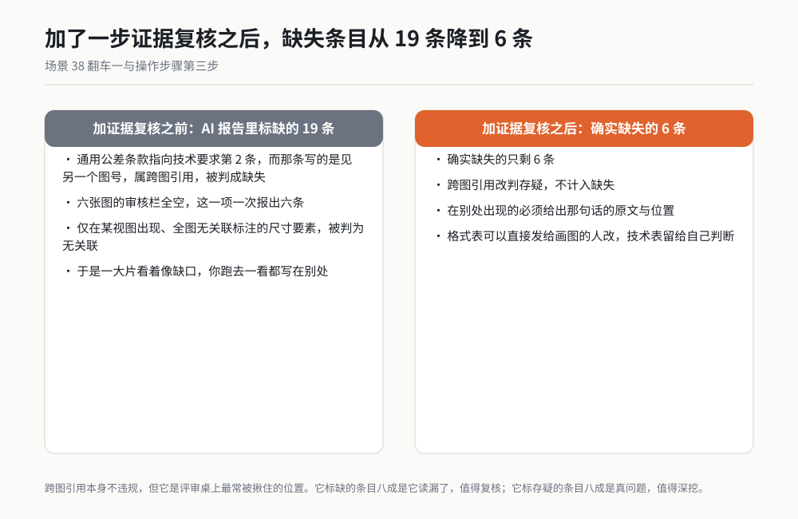

*作者根据公开资料绘制*

**翻车二：多张图放在一个 PDF 里，它把后几张图读串了。** 症状是报告里出现某张图上根本不存在的尺寸。补救：一个 PDF 放一张图，文件名带图号；实在改不了，就在提示词里要求它先报每页左上角读到的图号再开查。

**翻车三：它开始替你做设计判断。** 症状是报告里出现"建议此处增加加强筋"这类话。补救：见一条删一条，并且立刻在提示词里补一句"你只回答有没有写和写得是否自洽，不回答应该怎么设计"。

### 验收标准与变体

**验收五条：**

1. 任选三张图，把它的表和图逐项对一遍，错判率应当低于你自己徒手过图的错判率。跑三次就有数。
2. 所有标缺的项已经走过一轮证据复核，缺的数量是可信的。
3. 明细表行数、图上序号数、BOM 三者一致的结论，必须你自己手数一遍再信它。
4. 那份报告交到画图的人手上，他不需要你翻译就能照着改。
5. 你自己照着纸质图复核一遍的时间，应当明显短于从零开局。

**变体一：拿它给供应商提交的外来图做入厂检查。** 外来图的投影角、标题栏字段、公差体系这套尺度常常和我们内部不一致，这张通用清单刚好能当入厂的第一道筛子。

**变体二：按工艺换清单。** 把检查项里的第 8 行技术要求换成你那条产品工艺的专项：压铸看壁厚与拔模斜度，注塑看缩水与熔接线位置，机加看装夹基准与退刀槽。

**变体三：给新人当练手工具。** 让新来的工程师先自己做一遍清单，再跟 AI 结果对，两边不一致的地方就是他要补的课。

> **老兵说**：图纸检查这活，AI 干的是那种明明一眼能看出来、却总没人看的事。它替不了你判断公差给得对不对，但它能拦住你六张图都没签名。

---

## 场景 39 失效模式联想：DFMEA 辅助 ★★

### 一句话背景

一份 DFMEA 表，两个工程师从头写到能通过评审，大约三天。最难的部分不是填表，是想：这个零件到底能怎么坏。

AI 在这里的定位非常清楚。它做联想和补全，把你可能想漏的失效模式先铺出来；评分那三栏归人填，它不能替你打分。

本场景标 ★★：这套流程我跑通过，也用在真实项目上，但没留下完整的留档证据。

### 名词小词典

**DFMEA（设计失效模式与后果分析）**：一份表，逐条列出这个产品可能怎么坏、坏了会怎么样、为什么会坏、现在有什么措施挡着、危险有多大。类比：动手前的排雷图。

**失效模式**：零件坏的方式。比如齿轮断齿、密封圈老化、磁钢脱落。

**失效后果**：坏了之后用户感受到的是什么。比如执行器行程衰减、系统报故障码、低温下起动无力。

**失效起因**：为什么会走到这一步。比如润滑脂选型不当、热处理硬度不足、装配顺序约定缺失。

**严重度 S**：后果有多严重，1 到 10 分。涉及安全与法规的通常打到 9 或 10。

**发生度 O**：这个起因出现的可能性，1 到 10 分。

**探测度 D**：在量产之前，现有手段能把这个问题查出来的能力，1 到 10 分，数字越大越查不出来。

**RPN**：风险优先数，S、O、D 三个数相乘。

它只用来排先后顺序，不代表风险高低。

新版 AIAG-VDA 手册改用措施优先级替代 RPN 做行动排序。

**AP（措施优先级）**：高、中、低三档，用来定先做哪件事。


### 开工前准备

先把功能清单写出来。这个产品要干的事逐条列清楚，输出扭矩、行程、响应速度、寿命次数，一样一行。列不出来就先别往下走。

再要一份结构分解，把这个产品拆到零件那一层，有 BOM 就够了。

然后准备三样东西：公司正在用的评分标准表、历史故障单和 8D 报告的存放目录、以及 WorkBuddy 里新建好的一个 Agent 模式对话。

评分标准表这一样不能省。
没有它，AI 打出来的分数用的就是它自己发明的标准。

### 操作步骤

第一步，把功能清单和结构分解喂进去，让它用自己的话复述一遍。
你确认它没理解歪再往下走，这一步十几秒钟。

第二步，让它按结构逐个部件输出失效模式。
每条写成某个部件干不了某项功能的形式。

不许写成零件损坏这种追不下去的短语。

第三步，给每条失效模式补至少两个独立起因。
并标出受影响的下游部件。
起因要写到能追溯到某个具体物理机理的程度。
写成设计不当这种话，等于什么也没说。
第四步，拿这一稿跟你们脑子里的老经验对一遍。
你把手上那些吃过亏的旧事填进去。

第五步才轮到打分。S、O、D 三栏由人填，AI 一栏都不许碰。这一步的纪律我在下面单独讲透。

第六步，把评分之后的定稿表再喂回给它，让它换一个身份重读，只找逻辑打架的地方，不许改任何一个分数。

第七步，按你们公司 DFMEA 模板的列名和列宽导出成 XLSX。别让它另起一套表头，否则你回去还得手工对一遍。

第八步，留档。把这一版连同喂进去的功能清单、BOM、以及你用的提示词原文一起存进项目目录，文件名带日期和版本号。半年后有人问这行当初为什么删，你得答得上来。

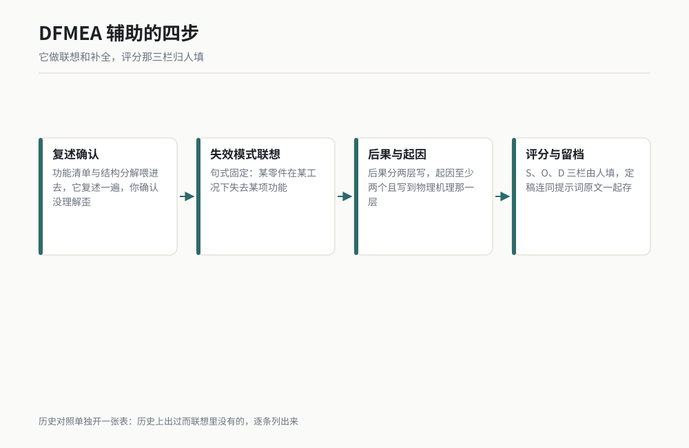

*图 13-5 作者根据公开资料绘制。*

### 可复制提示词

第一段，联想与补全。整段复制，路径换成你自己的：

```
【任务】帮我补一份 DFMEA 的失效模式部分。你现在是失效分析工程师，
不是设计工程师。你的活是联想和补全，不是评分。

【输入】
1. 功能清单：D:\fmea\功能清单.md
2. 结构分解与 BOM：D:\fmea\BOM.xlsx
3. 历史故障单与 8D 报告：D:\fmea\历史问题\（该目录下全部文件）

【第零步：复述】先用你自己的话复述这个产品要实现的每一项功能，
以及它拆到零件层的结构。复述完停下来等我确认，不要直接往下跑。

【第一步：失效模式联想】按结构逐层往下走，对每个零件回答一个问题：
这个零件在实现哪一项功能时，会以什么方式失去这项功能？
输出句式固定为"某零件 + 在某工况下 + 失去某项功能"。例如：
"输出轴深沟球轴承在零下 40 度冷起动工况下失去提供稳定回转支撑的功能"。
不许写"零件损坏""性能失效""出现异常"这类追不下去的词。
每条后面必须标出它对应哪一项功能，对不上功能的条目直接删掉。

【第二步：失效后果】对每一条失效模式分两层写：
第一层是这个零件往下还会发生什么，写成物理事实；
第二层是终端用户感受到什么，写成用户能听懂的话。
只影响内部、用户感知不到的，在这一行标"仅内部"。

【第三步：失效起因】每条失效模式至少给两个相互独立的起因。
起因要写到物理机理那一层，例如：
"润滑脂基础油在零下 40 度下析出导致稠化，起动摩擦扭矩上升"。
不许写"设计不当""选型错误""工艺问题"这类不可追溯的词。
每个起因后面标注它会牵动的下游零件。

【第四步：历史对照】把 D:\fmea\历史问题\ 下的故障单与 8D 报告全部读一遍。
凡是历史上真实发生过、而你在前三步里没有联想到的失效，单独开一张表：
历史问题来源文件名 | 失效描述原文 | 对应到本次哪一条 | 若无对应写"未覆盖"。
历史上出过的事没进表，这一轮就白跑了。

【第五步：现行控制】对每一个起因，只列你现在能拿出证据的措施：
已有的设计要求、已有的试验项、已有的检具。
拿不出证据的写"无"，不许写"待定""后续补充"。

【纪律】
1. 不许输出任何 S、O、D 的数值，不许算 RPN，不许给 AP 档位。
   评分由我来做，你一栏都不许碰。
2. 不许评价我的设计，不许出现"建议加强""建议优化"。
3. 拿不准的条目照写，但在备注列标"联想，无证据"，去留由我判断。
4. 输出写进 D:\fmea\DFMEA_联想稿.xlsx，列名用我给你的模板，不许自己改表头。
```

第二段，评分之后的逻辑自查。这一段是我自己加的，原版 DFMEA 流程里没有：

```
【第六步：逻辑自查】下面这张表是我评分之后的定稿。
你换一个身份重读：你是来评审这份 DFMEA 的质量工程师。
只找逻辑打架的地方，不许评价任何一个分数给得对不对。
1. 严重度打了 9 或 10 的行，有没有对应的现行预防措施？没有的列出来。
2. 探测度打了 1 到 3 的行，有没有对应的试验或检具？在表内查不到出处的列出来。
3. 同一条失效起因在表里重复出现但写法不同的，列出来并给出两处的行号。
4. 上一版里有、这一版被删掉的行，逐条列出，
   并说明你是否在变更记录里找到了删除依据。找不到就写"未见删除依据"。
每条必须给行号。答不上来的写"表内未提供"。任何分数都不许改。
```

### 过程与判断点

2025 年 4 月，我在一个带位置反馈的小型执行器项目上跑过这套流程。那个产品由直流电机、两级塑料斜齿轮、输出轴、端盖和一块带霍尔元件的线路板组成。

我先喂进去 9 条功能清单和一份 47 行的 BOM，让它跑了第一轮联想。它交回来 68 条失效模式。

我核完之后的状态是这样：

| 环节 | 它给的条数 | 我留下的 | 说明 |
|---|---|---|---|
| 失效模式联想 | 68 | 31 | 37 条是通用项，与这个产品的具体结构无关 |
| 失效后果分层 | 31 | 29 | 两条后果写得比后果还像起因，我改了 |
| 失效起因 | 74 | 52 | 22 条写到了"选型不当"这种层，退回重写 |
| 历史对照 | 11 | 9 | 9 条全部是我自己想不起来的 |
| 最终进表 |  | 31 | 其中 9 条来自历史，22 条来自联想 |

37 条通用项里，最典型的一类是这样写的："端盖在长期振动工况下失去固定功能"。这句话没有错，但它对铝压铸端盖、塑料端盖、钢板端盖都成立，放到任何一个产品上都挑不出毛病。这种条目唯一的用处是占行数，我一条没留。

真正让我觉得这 40 分钟花得值的是历史对照那 9 条。

其中一条是"霍尔线路板焊点在温度循环后开裂，导致位置信号跳变"。这个失效在两年前的一个同类项目上出过，8D 报告躺在我自己的归档目录里。我在这次的联想稿里没有想到它，AI 也没有想到，是它在读历史目录时把那封 8D 捞出来的。

另一条更有意思："输出端油脂在长期高温存放后结焦，导致第一次起动扭矩超上限"。这一条它标的是"联想，无证据"。我去问了做润滑的同事，他说这个基础油确实不耐 120 度长期存放。后来这一条打进了表，起因改成"油脂基础油高温氧化结焦"。

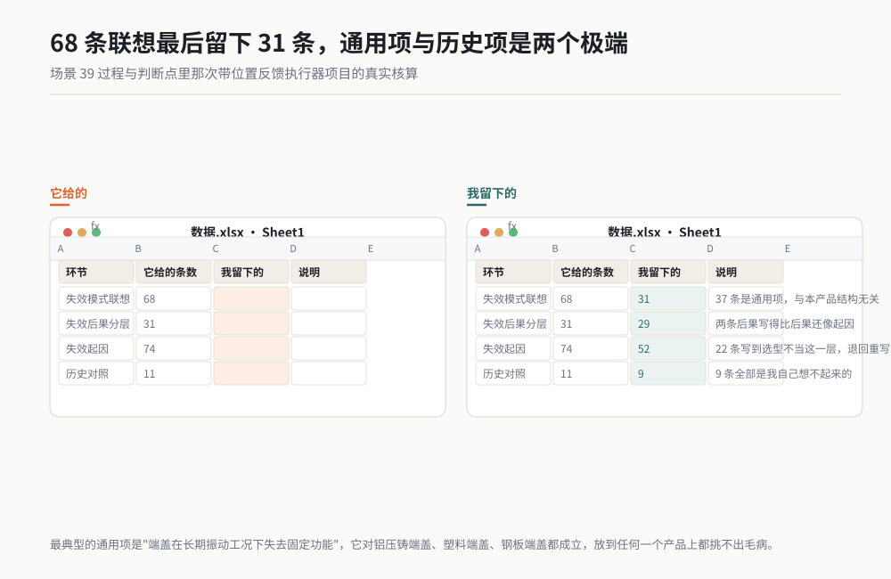

*作者根据公开资料绘制*

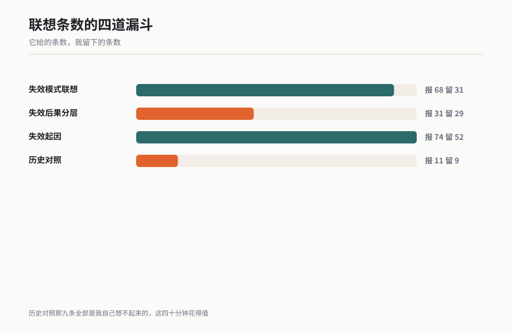

*图 13-6 作者根据公开资料绘制。*

**评分这件事，我把话说死：严重度、发生度、探测度、RPN、AP，全部由人定，AI 一栏都不许填。** 理由有三条，一条比一条硬。

第一，分标准是你们公司自己的。同样是"用户能感知但不影响安全"，有的公司打 6，有的公司打 7。AI 用的是它在语料里见过的某种平均口径，跟你那份评分标准表对不上。

第二，探测度取决于你现在手上真有什么手段。它不知道你们实验室有没有低温箱，也不知道那个检具到底是买了还是还在走采购。它填出来的探测度，是在替你幻想你拥有的能力。

第三，也是最要紧的一条：分数一旦落到纸上，就变成了一份被签过字的判断。判断可以委托给工具去准备，不能委托给工具去作出。出了事，评审纪要上签字的是你的名字。

我在提示词的纪律里写了四条，第一条就是不许输出分数。这一条不是流程洁癖，是责任边界。

### 翻车清单

**翻车一：它偷偷把分打了。** 症状是返回的表里直接带上了 S、O、D、RPN 四列，数字还都挺像回事。根因是你没在第一段就封死，或者它在第二段复述时把你上一轮的旧表当模板继承了。补救：见一列删一列，然后重发第一段提示词，在纪律里加一句"输出表中不得出现 S、O、D、RPN、AP 任何一列，出现即整表作废重跑"。

**翻车二：历史目录没喂进去，联想出来的全是通用项。** 症状是 68 条里你挑不出一条是这个产品独有的。根因是它只能基于结构做通用联想，没有你们淌过的那些坑。补救：把历史故障单、8D 报告、历次试验失效记录的目录整个挂上去，并在第四步强制它单开一张历史对照表。

**翻车三：失效模式写成了"零件损坏"这种粒度。** 症状是同一行里出现"齿轮损坏""轴承失效""线路板异常"，往下追问起因时它只能给出"强度不足"。根因是第一步的句式约束没生效。补救：在第一步里把输出句式写成模板并要求逐条对标，不符合句式的直接判不合格退回。

### 验收标准与变体

**验收五条：**

1. 最终进表的每一条失效模式，都能回答"它对应哪一项功能"。答不上来的全删。
2. 表里至少有三分之一的内容来自你自己的历史问题目录。低于这个比例，说明历史没喂够。
3. 随机抽五条起因，每一条都能一路追问到某个物理机理。追问两层就断的，退回重写。
4. S、O、D 三栏里没有任何一个数是 AI 给的。这一条不满足，整份表作废。
5. 这张表拿到评审会上，被问到任何一行你都能说出它从哪来。说不出来的那一行当场划掉。

**变体一：拿它给老产品的 DFMEA 做增补。** 找一个已经量产三四年、DFMEA 从写完就没动过的项目，把历史故障单喂进去跑一遍，你会得到一张"这些年实际出过、但表里没有"的清单。这张清单拿去跟售后索赔数据对，往往能对上。

**变体二：给供应商的零件做失效联想。** 外购件进厂前让 AI 先按你的功能要求联想一遍，把输出发给供应商，让他在自己的 PFMEA 里逐条回应。这一步能把"你的要求"和"他的理解"之间的沟提前挖出来。

**变体三：反向用它查现有 DFMEA 的空洞行。** 把已经定稿的表喂进去，只问一句：哪些行的起因一栏写的是不可追溯的套话。它会把"设计不当""工艺波动"这类行全挑出来，这些行在评审上最容易被打回。

> **老兵说**：DFMEA 里最贵的那几行，从来不是想出来的，是吃过亏记下来的。AI 能替你想，替不了你吃过亏，所以你要先把亏喂给它，它才能替你想得像样。分数那一栏，谁签字谁填。

---

## 场景 40 公差与尺寸链校核：让 AI 帮你算，你来判断 ★★★

### 一句话背景

一条六环的轴向尺寸链，手工算一遍极值法、再算一遍统计法，然后回头检查有没有把某个数抄错、有没有把某个环的符号判反，我大概要花四个小时。这活最折磨人的地方不是算术，是怀疑自己。

这个场景让 AI 替你列环、判增减、做加减、出表，你只负责三件事：判封闭环、给每个环的公差来源、最后对一次总数。20 分钟出结果，剩下的时间你去跟工艺和供应商谈哪个环能收。

### 名词小词典

**尺寸链**：一串首尾相接的尺寸，最后一个尺寸是被前面几个尺寸挤出来的结果。前面任何一个动了，最后一个跟着动。

**封闭环**：这条链里那个你没法直接标出来、只能由其他尺寸凑出来的尺寸。它通常就是你要保证的那段间隙或过盈。

**组成环**：除封闭环之外的每一个环。

**增环与减环**：这个环变大时，封闭环跟着变大就是增环，跟着变小就是减环。判反一个符号，整条链就废了。

**极值法**：假设所有组成环同时取到最不利的极限值，算出封闭环的两个极端。结果保守，意味着零件的加工成本高。

**统计法（RSS）**：假设各环相互独立且呈正态分布，用平方和开根号来算。结果宽松，成本低，前提不成立就不能用。

**敏感度**：某个组成环的公差变动，对封闭环总变动贡献的比例。收紧敏感度最高的那一个环，最划算。

### 开工前准备

1. 一张能看清全部相关尺寸的图纸或数模截图，把你要保证的那段间隙圈出来。
2. 每个组成环的公称尺寸与上下偏差，手工抄进一个表格文件。别让 AI 自己从图上读数，它在图注密集的地方读串过。
3. 给每个环加一列工艺来源：机加、压铸、注塑、冲压、外购标准件。这一列很关键，它决定你能不能套统计法。
4. 一个写死的封闭环目标区间。没有目标，它算出来也不知道该判合格还是不合格。
5. 查一下你们公司有没有规定必须用哪种算法。有的写在设计标准里，先查再动手。
6. WorkBuddy 新建对话，Agent 模式，别接旧项目的上下文。

### 操作步骤

1. 先让它把图纸上相关的尺寸逐条列出来，并说出它认为的封闭环是哪一个，然后停下来等你确认。
2. 你确认封闭环之后再让它往下判增减环。顺序不能反，封闭环判错了后面全错。
3. 让它逐个环标增或减，并给一句理由。理由写不出来的标"待判"，不许猜。
4. 让它用极值法算一遍，中间过程完整写出来，不许只给最后两个数。
5. 你随机抽两个环手算一遍符号，确认它没判反。这一步三十秒，省你半天。
6. 让它用统计法再算一遍，并明确列出统计法成立的三个前提，你逐条对着工艺判断。
7. 让它输出敏感度排序，指出收紧哪一个环最有效、收多少才够。
8. 最后一步归你：拿着敏感度表去跟工艺和供应商谈。能收多少、成本多少，这张表说了不算，谈下来才算。

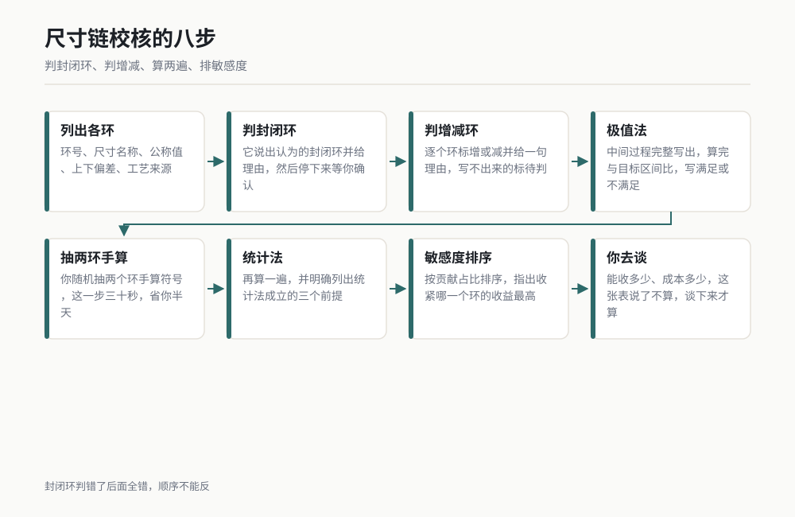

*图 13-7 作者根据公开资料绘制。*

### 可复制提示词

整段复制，路径和工艺换成你自己的：

```
【任务】帮我校核一条轴向尺寸链。你是尺寸链计算员，不是设计工程师。
你负责列环、判增减、做加减、出表。判断哪个环该收紧，由我来做。

【输入】
1. 各环尺寸与公差：D:\dim\尺寸链输入.xlsx
2. 相关图纸：D:\dim\总成图.pdf
3. 目标：输出轴轴向间隙要求在 0.05 到 0.35 之间（换成你自己的目标区间）

【第一步：列环并判封闭环】把图纸上与这段间隙相关的尺寸逐条列出来，
做成一张表：环号 | 尺寸名称 | 公称值 | 上偏差 | 下偏差 | 工艺来源 | 出处（图号加视图）。
列完之后，明确指出你认为的封闭环是哪一个，并说明理由。
然后停下来，等我确认封闭环，不要继续往下算。

【第二步：判增减环】我确认封闭环之后，对每个组成环标"增"或"减"，
并给一句理由，说明这个环变大时封闭环是变大还是变小。
理由写不出来的标"待判"，不许猜，不许默认给"增"。

【第三步：极值法】按极值法算出封闭环的最大值与最小值。
中间过程必须完整写出：每个环取的极限值、代入的算式、中间累加结果。
不许只给最后两个数。算完与目标区间比对，明确写"满足"或"不满足"。
不满足时给出超差量，并列出所有可能的调整方向，不许指定某一个方向。

【第四步：统计法】用统计法（RSS）再算一遍，同样写出完整中间过程。
算完之后，明确列出统计法成立的三个前提：
各环相互独立、各环呈正态分布、各环的过程能力处于受控状态。
逐条对照我在输入表里给的工艺来源，判断每个前提在你的数据下是否成立。
任一条不成立，就明确写"统计法结果仅供参考，不能作为判定依据"。

【第五步：敏感度排序】按各组成环对封闭环总变动的贡献做敏感度排序，
输出：环号 | 尺寸名称 | 公差带宽度 | 贡献占比 | 工艺来源。
指出收紧哪一个环的收益最高。只给排序和占比，不许替我决定收哪一个。

【纪律】
1. 任何一环的公差数值都不许由你生成或修改。
   输入表里没有的数，一律写"待补"，不许按常见做法填。
2. 不许评价我的公差给得合不合理，你只回答算出来是多少、是否满足目标。
3. 输出写进 D:\dim\尺寸链校核报告.md，三张表（列环、极值法、统计法）加一张敏感度表。
```

### 过程与判断点

2025 年 9 月，我在一台小型执行器的轴向间隙上跑过一遍。这条链一共六个组成环：壳体总长、端盖轴承室深度、输出轴轴肩到端面的距离、轴承宽度、波形垫圈自由高度、卡簧槽位置。

我按上面的提示词跑，它第一步列出来的封闭环就判对了，理由是"这个间隙在图纸上没有独立标注，图上标的是各零件的长度尺寸"。这一步看着简单，但我在带新人的时候见过好几次把封闭环判成轴承宽度的。

极值法算完，它给出的轴向间隙范围是 0.02 到 0.41，目标区间是 0.05 到 0.35，判定不满足，超差量两端各约 0.06。

统计法算完，范围是 0.09 到 0.31，判定满足。

同一条链，两种方法给出两个相反的结论。这种局面在尺寸链校核里天天发生，也是这个场景最需要人站出来的地方。

我做的判断分三步。

第一步，看统计法那三个前提成不成立。它自己列出来了，我逐条过：

| 前提 | 我的判断 | 依据 |
|---|---|---|
| 各环相互独立 | 部分成立 | 壳体总长与端盖轴承室深度出自同一副压铸模的同一批次，不独立 |
| 各环呈正态分布 | 不成立 | 波形垫圈是外购冲压件，供方给的是全检分选后的截尾分布 |
| 过程能力受控 | 成立 | 机加三环有近三个月的 SPC 数据，Cpk 均在 1.33 以上 |

三条里两条有问题，那统计法给出的 0.09 到 0.31 就不能当判定依据用。我在报告上写的是：按极值法判定不满足，需要调整。

第二步，看敏感度表。它算出来的贡献占比是这样：

| 环号 | 尺寸名称 | 公差带 | 贡献占比 |
|---|---|---|---|
| 1 | 端盖轴承室深度 | 0.12 | 34% |
| 2 | 输出轴轴肩到端面 | 0.10 | 28% |
| 3 | 壳体总长 | 0.08 | 18% |
| 4 | 波形垫圈自由高度 | 0.06 | 12% |
| 5 | 轴承宽度 | 0.05 | 5% |
| 6 | 卡簧槽位置 | 0.03 | 3% |

第一名是端盖轴承室深度，贡献 34%。这个环恰恰就是本章开场那个故事里老张问我的那个 0.12，当年我是照着上一代图纸抄的。三年之后 AI 把敏感度排出来，指向的还是同一个环。

第三步，拿着这张表去谈。端盖是压铸件，轴承室深度从 0.12 收到 0.08 需要加一道精镗，供应商报的单件成本上升我记不清了，量级在几毛钱。波形垫圈那一环换个供货状态，成本几乎不动，但只能贡献 12%。

最后我选的是端盖加精镗加输出轴轴肩改磨削，两个环一起收。谈完回过头再算一遍，极值法结果落在 0.06 到 0.33，进区间了。

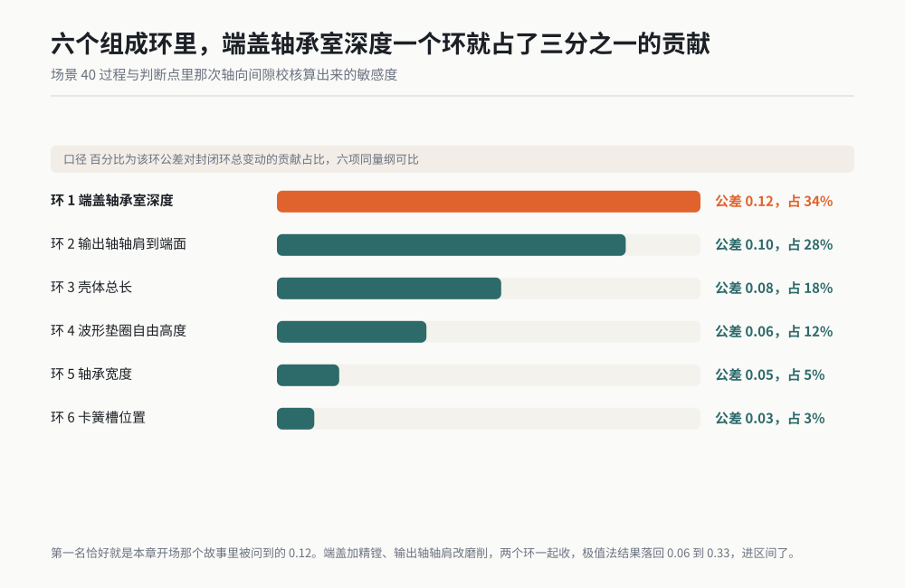

*作者根据公开资料绘制*

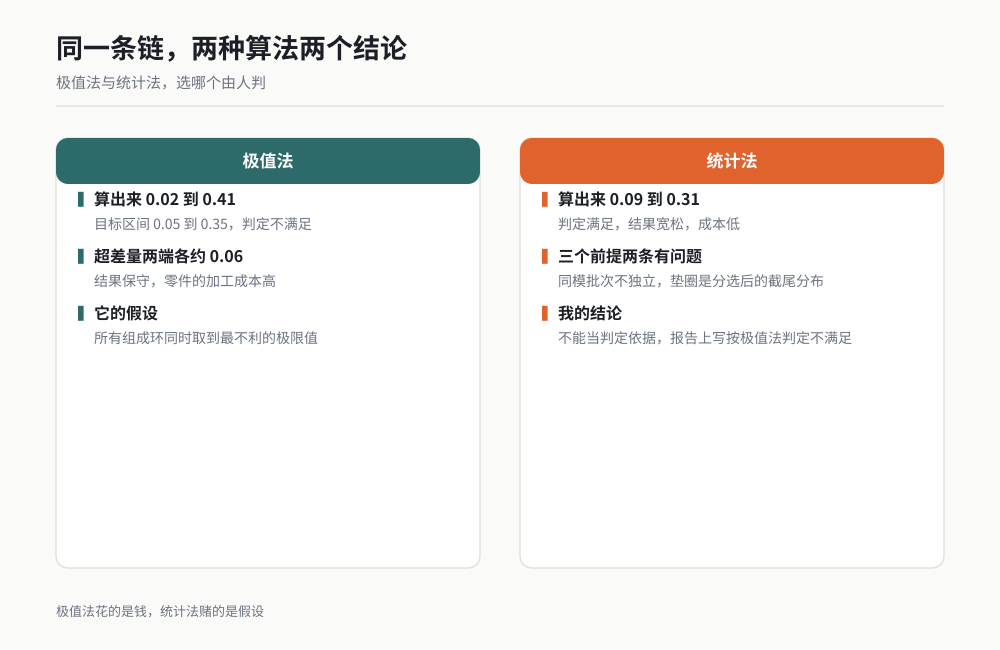

*图 13-8 作者根据公开资料绘制。*

这里我要说清一条边界。**AI 在这个场景里做的是算术和排版，做的是你不愿意花四小时去做的那部分。它做不了三件事：判封闭环、判断统计法的前提在你这条链上成不成立、决定收紧哪一个环。**

第一件在提示词里我用"停下来等我确认"强制拦住了。

第二件它其实能做一半：它会老老实实把三个前提列出来，但它不知道你的端盖和壳体出自同一副模，也不知道你那个垫圈是分选出来的。这条信息在工艺那边，不在材料里。

第三件它最想替你做，也最不能让它做。收紧哪一个环，本质是花钱的决定。钱怎么花、跟谁谈、谈得下来谈不下来，全是人的事。

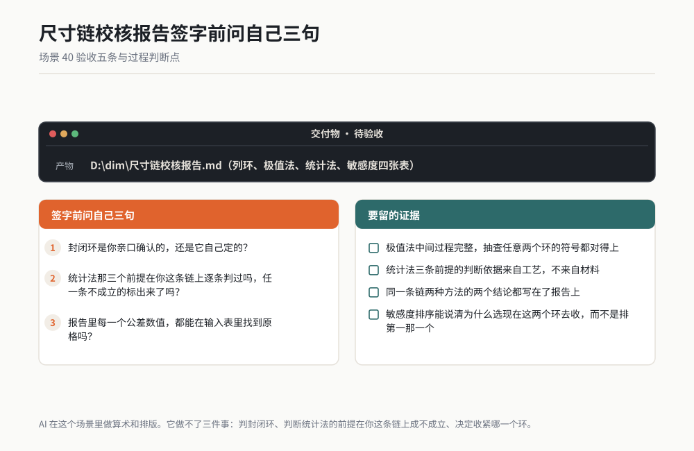

*作者根据公开资料绘制*

### 翻车清单

**翻车一：增减环判反。** 症状是极值法算出来的范围明显偏离你的直觉，比如间隙算成了负值。根因是第二步的理由那列被它跳过了，直接默认全增。补救：要求逐环给理由，然后你抽查两个环手算一遍符号。这一步三十秒，是整套流程里性价比最高的动作。

**翻车二：它直接套统计法，把前提那一节跳过去了。** 症状是报告里只有统计法结果，还写着"推荐使用统计法降低成本"。根因是第四步没写死。补救：把三个前提和"任一不成立就写仅供参考"这句话原样留在提示词里。

**翻车三：某个环的公差是它自己填的。** 症状是输入表里你留空的那一格，到了报告里变成了一个具体的数。根因是你没有在纪律里封死。补救：纪律第一条原样保留，报告里凡是"待补"以外的来源，一律退回重查。

### 验收标准与变体

**验收五条：**

1. 封闭环是你亲口确认的，不是它自己定的。
2. 极值法的中间过程完整，你抽查任意两个环的符号都对得上。
3. 统计法那三个前提在你这条链上逐条判过，判不成立的已经标出。
4. 报告里每一个公差数值都能在输入表里找到原格，没有一个是它生成的。
5. 敏感度排序出来之后，你能说清为什么选了现在这两个环去收，而不是排第一那一个。

**变体一：径向配合的过盈量校核。** 把轴向链换成径向，封闭环从间隙改成过盈量，其余提示词原样用。轴承外圈与壳体孔的配合、齿轮与轴的热装过盈，都是这一类。

**变体二：装配累积误差校核。** 多个零件叠加后的位置偏差，比如线路板上三个安装孔与壳体三个螺柱之间的累积错位。这一类最容易在首件装配时暴露，提前算一遍能省一次工装返工。

**变体三：拿它复核老项目的尺寸链计算书。** 找一份五年前归档的计算书，把输入表和图纸喂进去让它重算，跟当年的人工结果比对。我试过两次，其中一次发现当年某一环的符号取反了，那台产品已经量产了四年，靠垫圈选型一直在兜着。

> **老兵说**：尺寸链算错了不可怕，可怕的是算完之后没人问那三个前提。极值法花的是钱，统计法赌的是假设，赌注押下去之前，先看一眼你手上的工艺到底配不配得上这个假设。

---

## 场景 41 变更影响分析：改一个尺寸会牵动哪些件 ★★

### 一句话背景

产线来了一个变更请求：输出轴的某个轴径从 8 毫米改到 9 毫米，理由是强度校核过不去。听起来是改一个数的事。真要查清楚它牵动多少东西，你得翻图纸、翻 BOM、翻工装清单、翻检具清单、翻试验大纲、翻 DFMEA、翻已经发出去的图纸版本，一个人查一天半，还常常漏掉"这个尺寸被三个项目共用"这种事。

这个场景让 AI 替你把牵动范围铺出来，30 分钟出一张待确认清单。本场景标 ★★：这套流程我跑通过，也用在真实项目上，没留下完整留档。

### 名词小词典

**ECN（工程变更通知）**：正式下发的设计变更单。它写清楚改什么、为什么改、什么时候切换、旧件怎么处理。

**ECR（工程变更请求）**：提出变更的那张单子。它先走评估和批准，批了才转成 ECN。

**受影响件清单**：这一次变更会牵动到的所有物件。包括直接改的那个零件，也包括所有跟它有关系的东西。

**工装与检具**：做这个零件用的夹具、刀具、模具，和检这个零件用的量具和检具。尺寸一改，这两类东西常常要重做。

**借用件**：同一个零件在好几个项目上被拿来用。改它一个，几个项目一起动。

**特殊特性**：图纸上打了标记的那几项，出问题会影响到安全、法规或功能。改到它头上，试验和客户认可都要重走。

### 开工前准备

1. 变更请求本身写清楚：改哪个件、哪个尺寸、从多少改到多少、为什么要改。含糊的变更请求会产出含糊的影响清单。
2. 这个零件的图纸与数模，以及它所在的上一级总成图纸。
3. 完整 BOM，最好带"哪些项目在用"这一列。没有这一列，借用件那一段就只能靠它猜文件名。
4. 工装清单、检具清单、试验大纲、DFMEA、特殊特性清单。缺哪一份就在最后的影响表里标"该项未评估"。
5. 一份你们公司的变更评估表模板，AI 的最后输出要长成这个样子。
6. WorkBuddy 新建对话，Agent 模式。

### 操作步骤

1. 第一步先让它复述这次变更：改哪个件、哪个尺寸、从多少到多少。复述错了一个数，后面全白跑。
2. 让它在 BOM 里把"直接受影响"的件列出来：就是这个零件本身，以及跟它直接装配的那些件。
3. 让它查跨项目借用。这一步要在整个 BOM 目录里搜同一个图号出现在哪些项目下。
4. 让它查工装与检具：清单里凡是带这个图号或这个尺寸特征的行，全部列出来。
5. 让它查文件层：图纸、数模、试验大纲、DFMEA、特殊特性清单里出现这个图号或这个尺寸的位置，逐条给出文件名和章节。
6. 让它查历史：过去三年有没有对同一个特征做过变更，如果有，把当时的评估结论捞出来。
7. 让它把影响分四层排序，并明确列出"本次未能覆盖"的项。
8. 最后两步归你：给每层标"需要动作"还是"仅知会"，然后拿去开评估会。

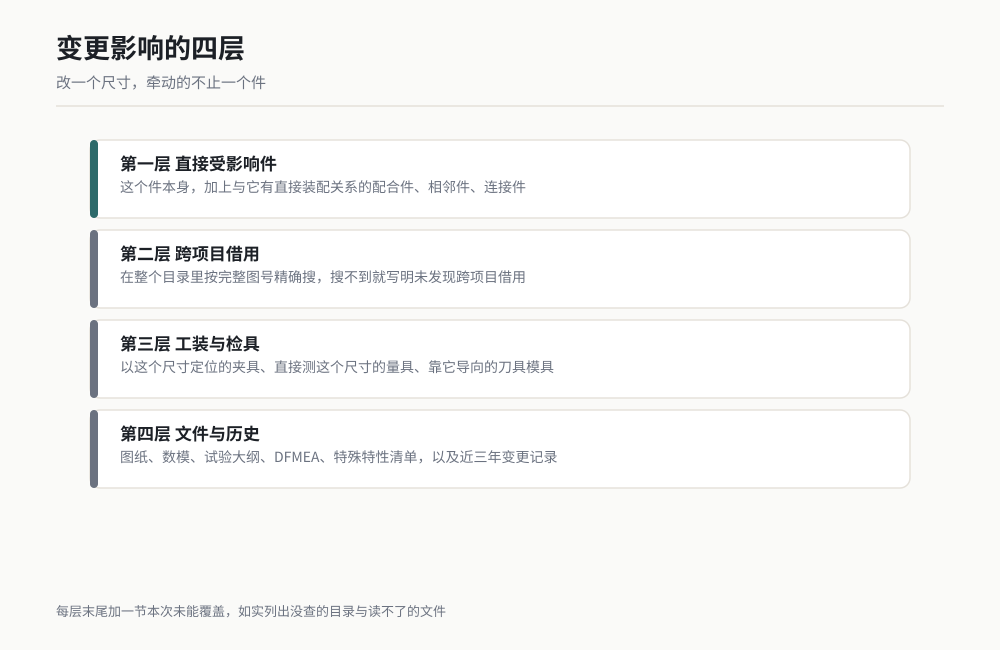

*图 13-9 作者根据公开资料绘制。*

### 可复制提示词

整段复制，图号和路径换成你自己的：

```
【任务】帮我做一次工程变更的影响分析。你是变更评估工程师。
你的活是把牵动范围铺全，不是判断这个变更该不该做。

【本次变更】
零件图号：XXXXXX（换成你的图号）
变更内容：输出轴轴径由 8 毫米改为 9 毫米（换成你的变更）
变更原因：强度校核不满足（换成你的原因）

【输入目录】
1. BOM 与项目清单：D:\ecn\BOM\
2. 图纸与数模：D:\ecn\图纸\
3. 工装与检具清单：D:\ecn\工装检具\
4. 试验大纲、DFMEA、特殊特性清单：D:\ecn\质量文件\
5. 近三年历史变更记录：D:\ecn\历史变更\

【第零步：复述】先用一句话复述：改哪个零件、哪个尺寸、从多少改到多少。
复述完等我确认，不要往下跑。

【第一步：直接受影响件】在 BOM 里找出这个图号所在的所有总成，
并列出与它有直接装配关系的全部零件：配合件、相邻件、连接件。
输出：图号 | 零件名 | 关系类型（配合/相邻/连接）| 所在总成 | 出处文件名。

【第二步：跨项目借用】在 D:\ecn\BOM\ 全目录里搜索这个图号出现在哪些项目的 BOM 下。
逐个列出项目名与 BOM 文件路径。搜不到就明确写"未发现跨项目借用"，
不许写"可能还有其他项目"这种模糊话。

【第三步：工装与检具】在工装与检具清单里，找出所有与该图号相关的行，
特别关注：以这个尺寸为定位或测量基准的夹具、直接测量这个尺寸的量具与检具、
靠这个尺寸导向的刀具或模具。
输出：工装或检具编号 | 名称 | 与本次变更的关系 | 判定（需改制 / 需新制 / 不受影响 / 存疑）。
存疑的必须说明为什么存疑。

【第四步：文件层】在质量文件目录里逐份检索这个图号，列出出现位置：
文件名 | 章节或表内行号 | 原文引用（40 字以内）| 判定（需修订 / 需重评 / 不受影响）。
特别注意 DFMEA 里以这个尺寸或这个特征为失效起因的行，
以及特殊特性清单里是否包含这个特征。

【第五步：历史对照】在历史变更目录里检索过去三年对同一零件或同一特征的变更。
找到的列出：变更单号 | 时间 | 变更内容 | 当时的评估结论要点 | 与本次是否相关。
未找到就写"近三年未见对该特征的变更"。

【第六步：分层汇总与自曝】把以上结果按四层汇总：
第一层 直接受影响件；第二层 跨项目借用；第三层 工装与检具；第四层 文件与历史。
每层末尾加一节"本次未能覆盖"，如实列出你没查的目录、读不了的文件、
以及你不确定的判断。不许省略这一节。

【纪律】
1. 不许判断这个变更该不该做，不许给建议方案。
2. 找不到出处的条目不许写。没路径可引的一律扔掉。
3. 每个"不受影响"的判定必须给一句理由，不给理由的一律改为"存疑"。
4. 输出写进 D:\ecn\变更影响分析_图号XXXXXX.md。
```

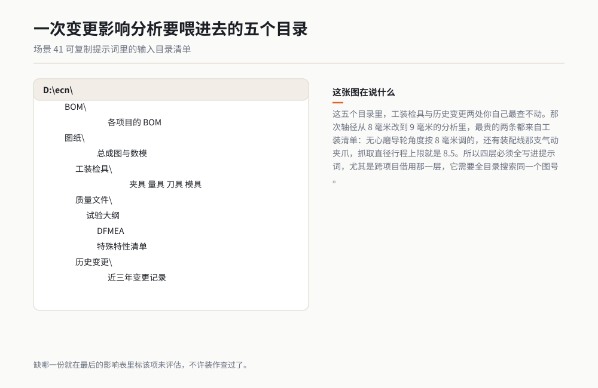

*作者根据公开资料绘制*

### 过程与判断点

我在一个输出轴轴径变更上跑过这套流程。变更本身很干净：一根电机输出轴，轴径从 8 毫米加粗到 9 毫米，起因是扭转强度校核在极限工况下过不去。

它交回来的四层表，最后一层最有用。我把四层的条数和我的复核结果列一下：

| 层级 | 它报的条数 | 我核后保留 | 其中需要动作 |
|---|---|---|---|
| 第一层 直接受影响件 | 6 | 6 | 3 |
| 第二层 跨项目借用 | 2 | 2 | 2 |
| 第三层 工装与检具 | 9 | 7 | 4 |
| 第四层 文件与历史 | 13 | 8 | 3 |
| 合计 | 30 | 23 | 12 |

第二层那两条是我自己绝对查不出来的。它在 BOM 目录里搜到这个图号还出现在另外两个项目的 BOM 下：一个是某日系项目的同类执行器，另一个是一个已经量产三年的小批量产品。

我一开始以为它搜错了，去翻了那两个项目的 BOM，它是对的。这根轴是当年做通用化的时候统下来的，图纸是同一张，只是两个项目各自取了自己的物料号。图纸改一刀，两个项目一起动，其中一个已经量产三年，改图纸意味着客户认可要重走。

这一条的代价远大于轴径本身。最后这个变更我们没走加粗，改成换材料，强度从 45 钢换成 40Cr 调质，轴径一寸没动。

第三层里有四条需要动作，其中一条是磨削工序用的那个无心磨的导轮角度按 8 毫米调的，改 9 毫米要重新调。还有一条是装配线上的一支气动夹爪，抓取直径的行程上限就是 8.5。

这两条都在产线，不在我手边的文件里，是 AI 从工装清单里翻出来的。我自己的经验清单里，变更影响一般想到图纸、BOM、检具就停了，很少会想到夹爪。

第四层里有一条我核对了很久。它说 DFMEA 里有三行以"输出轴轴径"为失效起因，我翻过去看，实际只有一行。另外两行写的是"输出轴刚度不足"，它把刚度不足也归到了轴径头上。这一条我判成部分虚警，但保留了提醒，因为刚度确实会跟着轴径变。

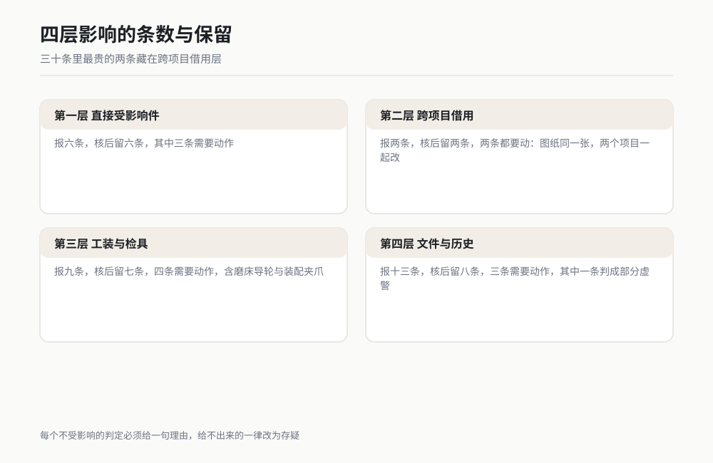

*图 13-10 作者根据公开资料绘制。*

这个场景的判断点有两个。

第一个是"存疑"这一栏。我在提示词里要求每个"不受影响"的判定必须给理由，给不出来的改成"存疑"。跑完这一轮，它给出的"不受影响"里有 5 条被它自己改成了"存疑"。这 5 条最后我去核了，2 条真受影响。如果当初让它自由判定，这 2 条就会被埋在一片"不受影响"里。

第二个是"本次未能覆盖"那一节。它自己交代了三件事：历史变更目录里有两个 PDF 是扫描件读不到字；工装清单里有一个 Excel 带了工作表保护只读取了前 50 行；数模文件它打不开，尺寸特征那一栏是照着图纸填的。

这三句话比它报出来的 30 条影响更值钱。因为它明说了哪些地方没查，我就知道该补哪里。换成一个不交代的人，我会以为它全查了。

### 翻车清单

**翻车一：只查了直接受影响件就停了。** 症状是清单上一共七八条，全是配合件和相邻件，看着很完整。根因是你的提示词只写了第一步。补救：四层必须全写进提示词，尤其是跨项目借用那一层，它是唯一一层你自己查不动的。

**翻车二：跨项目借用搜成了同名不同件。** 症状是它报了十几个项目，你去核发现图号前缀不一样。根因是它按零件名模糊匹配而不是按图号精确匹配。补救：在第二步里写明"按完整图号精确匹配，不许按零件名模糊搜索"，并要求它给出每一处的 BOM 文件路径供你核对。

**翻车三：它替你判断了这个变更该不该做。** 症状是报告末尾出现"建议采用加大圆角过渡的方案"这类话。根因是纪律第一条没生效。补救：见一句删一句，并且在纪律里补一句"输出中不得出现任何方案性建议"。

### 验收标准与变体

**验收五条：**

1. 变更的图号、尺寸、从多少到多少，它复述的和你写的一致。
2. 跨项目借用那一层，你按它给的文件路径逐个打开核过，没有一条是模糊匹配出来的。
3. 所有标"不受影响"的判定都带了理由，没带理由的已全部改为"存疑"。
4. "本次未能覆盖"那一节非空，且你按它交代的内容补查了至少一项。
5. 整张单子拿到变更评估会上，每一条都能说出该谁去动、什么时候动。

**变体一：给供应商发起的变更做影响分析。** 供应商提了一个材料替代或者工艺变更，用同一套提示词跑一遍，输入目录换成你们内部与该供应商相关的全部文件。这一类最容易漏的是检具和已发往客户的认可文件。

**变体二：给标准件的停产替代做影响分析。** 某个紧固件或轴承要停产，替换型号的尺寸有微小差异。把替换前后的参数喂进去，重点看第三层工装与第四层文件。

**变体三：反向用它做变更前的自检。** 在你准备提 ECR 之前，先让 AI 跑一遍影响分析，把结果附在 ECR 后面。评估会上别人问的第一个问题通常是"你查过影响吗"，这时候你直接把单子推过去。

> **老兵说**：变更影响分析里最贵的那一条，从来不在你改的那个件上，在那些你不知道自己也在用这个件的项目上。AI 替你做的是全目录搜索，它搜出来的东西你要逐条去核，尤其是它说"不受影响"的那些。

---

## 场景 42 经验教训库：把过去的问题变成可检索的资产 ★★

### 一句话背景

一个做了十几年的研发团队，手里一定攒着几百份东西：8D 报告、故障单、试验失效记录、评审纪要、售后索赔分析。它们躺在共享盘的文件夹里，按年份分目录，文件名像"2021-08-13 某项目低温问题 8D 最终版 v3.docx"。

真要用的时候你找不到。不是因为没有，是因为你记得有那么一回事，但记不清它在哪个目录、叫什么名字。

这个场景做两件事：把这几百分文件抽成一张能检索的表，然后在新项目开工前花五分钟检索一次。建库我跑了两天半，单次检索五分钟。本场景标 ★★：这套流程我跑通过，库现在还在用，没有完整留档。

### 名词小词典

**经验教训（Lessons Learned）**：一件已经出过的事，连它的起因和当时的处理结论一起记下来，让下一次做同类设计的人能提前看见。

**8D 报告**：处理一个质量问题的八步标准表格。第八步是团队表彰，第七步是预防再发。对建库来说，第三步临时措施和第五步根本起因最有用。

**条目**：库里的一行。一个问题对应一行，不多不少。

**结构化字段**：每一行的列。列定死了，检索才检得准。

**源文件名与路径**：这一行是从哪份文件里抽出来的。没有这一列，整库不可信。

**增量更新**：新出的问题按同一个模板往库里追加，不要另起一套。

### 开工前准备

1. 先把历史文件集中到一个目录。我用的是 `D:\lessons\原始文件\`，下面按年份分子目录，不再按项目分，因为按项目分的话同一个问题会出现在好几个项目下。
2. 统一格式。扫描件先做文字识别，老版本的 .doc 另存成 .docx。读不到的文件会在最后被 AI 自己列出来，你可以后面补。
3. 定死字段。我用的九列：编号、发生日期、产品类别、零件或特征、失效现象、根本起因、采取措施、验证结果、源文件名。字段一旦开跑就不要改，改一次全库要重抽。
4. 准备一份你们自己的产品类别字典。比如电机类、齿轮类、壳体类、线路板类、装配类。它按这个归，不让它自己发明类别。
5. WorkBuddy 新建一个专门的对话，这个对话后面长期留着做增量，不要跟别的活混。

### 操作步骤

1. 先让它报数：目录里一共多少份文件、能读到字的多少份、读不到字的多少份。读不到的先记住。
2. 让它抽第一份文件做样本，你逐列核对，把字段理解对不齐的地方当场改正。
3. 样本确认后，让它批量抽取，一份文件一行。一份文件里写了三个问题的，拆成三行。
4. 抽完让它自检：现象和起因写反的、措施和验证结果混在一起的，它自己标出来。
5. 你抽检 10%。抽检比例不能再低，低于这个数你会发现整库的信任度建立不起来。
6. 让它给每一行生成一列检索关键词，三到五个词，从现象和起因里取，不许用文件名的词。
7. 存成一张 XLSX，另外导出一份 Markdown 版本放在同一个目录里。Markdown 那一份是给检索用的，XLSX 是给人翻的。
8. 定一个增量规矩：每关闭一份 8D，三天之内追加进库。规矩要写进你们的质量流程，不然三个月就断了。

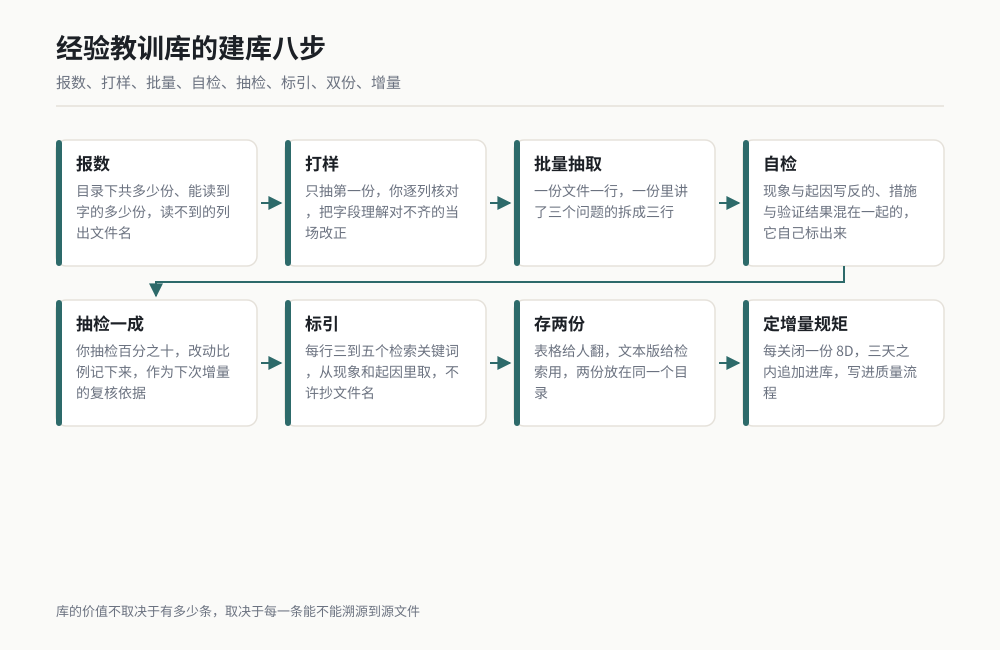

*图 13-11 作者根据公开资料绘制。*

### 可复制提示词

第一段，建库。整段复制：

```
【任务】把我放在 D:\lessons\原始文件\ 目录下的历史质量文件，抽成一张可检索的经验教训表。
你是档案编目员，不是问题分析员。你负责如实摘录，不负责重新分析。

【字段定义】每一行九列，列名不许改：
编号 | 发生日期 | 产品类别 | 零件或特征 | 失效现象 | 根本起因 | 采取措施 | 验证结果 | 源文件名

【产品类别字典】只允许从下面选一个填，不许自己发明类别：
电机类、齿轮类、轴类、壳体类、线路板类、密封类、装配类、试验类、其他

【第一步：报数】先报：目录下共多少份文件、你能读到文字的多少份、
读不到或字符数明显偏少的多少份。读不到的列出文件名。
然后停下来，不要往下抽。

【第二步：打样】只抽 D:\lessons\原始文件\ 里的第一份文件，按九列输出一行给我看。
我确认字段理解没问题之后再往下批量。

【第三步：批量抽取】逐份文件抽取，规则如下：
1. 一份文件只讲一个问题的，抽一行。一份文件讲了三个问题的，抽三行。
2. 失效现象写物理事实，不写结论。写"输出轴轴向窜动 0.4 毫米"，
   不写"输出轴设计不合理"。
3. 根本起因抄原文里的根本起因那一栏。原文没写的写"原文未给根本起因"，不许推测。
4. 采取措施与验证结果分两列。措施是做了什么，验证结果是做完之后测出来什么。
   原文只写了措施没写结果的，结果列写"原文未记录验证结果"。
5. 源文件名必须写全，带扩展名。

【第四步：自检】全表抽完之后，自己检查三类问题并单独列出：
A 现象与起因写反的行；B 措施与验证结果混在一列的行；
C 同一行里出现"可能""大概""疑似"这类不确定词的行。
这三类列出来交给我处理，不许你自己改。

【第五步：标引】给每一行加三到五个检索关键词，从失效现象和根本起因里取。
不许直接抄文件名里的词，不许用"问题""异常""故障"这种没有区分度的词。

【输出】写两张文件：
D:\lessons\经验教训库.xlsx，九列加关键词列。
D:\lessons\经验教训库.md，同样内容，每条之间用 --- 分隔。
```

第二段，检索。这一段是你以后每次开工前要跑的：

```
【任务】在 D:\lessons\经验教训库.md 里检索与我这次设计相关的历史问题。
你是检索员，只做匹配，不做分析。

【我要做的东西】
产品类别：齿轮类（换成你的）
关键特征：两级塑料斜齿轮，输出转速约 60 转每分，工作温度零下 40 度到 85 度
（换成你的工况）

【检索要求】
1. 按下面三个方向分别检索，每个方向单独出一张表：
   方向一：相同产品类别下出过的问题。
   方向二：相同工况（尤其是低温和高温）下出过的问题，跨类别也算。
   方向三：失效现象里出现过"卡滞""异响""断齿""磨损"这类词的问题。
2. 每张表按相关度排序，每条给出：编号 | 失效现象 | 根本起因 | 采取措施 | 源文件名。
3. 每个方向最多给 8 条。不足 8 条的写"该方向下仅命中 N 条"，不许凑数。
4. 相关度判断标准写清楚，写在一张表前面。

【纪律】
1. 只许引用库里真实存在的条目，不许补充库里没有的内容。
   库里没有的，直接写"库内无相关记录"。
2. 不许对历史问题做新的原因分析，不许评价当年的措施做得对不对。
3. 每条必须带源文件名，没有源文件名的条目不许出现在结果里。
```

### 过程与判断点

我在 2025 年春天建过一次。原始目录里一共 236 份文件，其中 27 份是扫描件，AI 报读不到。

剩下 209 份，它抽出来 214 行。多出来的 5 行来自几份文件里讲了不止一个问题，其中一份 8D 里挂了三个失效。

我抽检了 22 行，约等于 10%。抽检结果是这样：

| 问题类型 | 命中行数 | 我的处理 |
|---|---|---|
| 字段填写准确 | 14 | 直接通过 |
| 措施与验证结果混在一列 | 4 | 按原文重填 |
| 根本起因是它推测的 | 2 | 改成"原文未给根本起因" |
| 现象写成了结论 | 2 | 按原文的物理描述重写 |

22 行里 8 行要改，改的比例 36%。这个比例我记下来了，后来做增量的时候每次都按这个比例预留复核时间。

自检那一轮它自己报了 19 行 A 类、31 行 B 类、7 行 C 类。这个数比我抽检发现的多，因为它查的是全表。A 类那 19 行里我最后确认是它自己写反的占 11 行，剩下 8 行是原文就写反了。原文写反的那 8 行我没有改，只在备注里标了"原文现象与起因疑似颠倒"。

库建完之后，真正的用途在检索这一头。

2025 年 7 月，我接手一个新执行器的方案设计，开工前跑了一次检索。方向二里命中了一条 2021 年的记录，源文件名是"2021-08-13 某项目低温问题 8D 最终版 v3.docx"。

那条记录的现象写的是"低温存放 24 小时后首次起动，输出扭矩超上限约 40%"，起因是"输出端润滑脂基础油在零下 40 度析出稠化"。

我在方案阶段就把油脂换成了低温型，成本上浮我记得不多，单件几分钱。如果等到 DV 试验才暴露，一次低温试验加一轮整改，光试验排期就是三周。

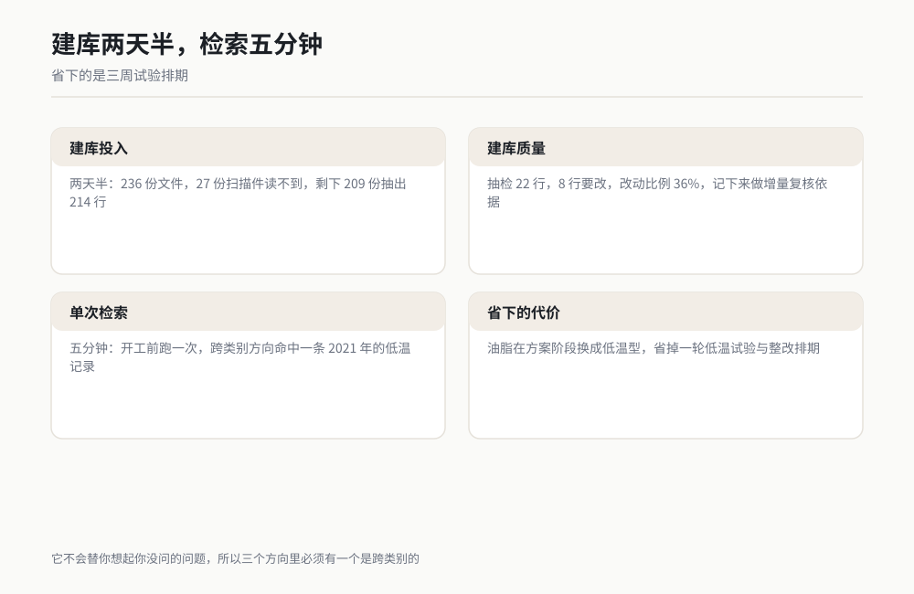

*图 13-12 作者根据公开资料绘制。*

这个场景里我要说清一条边界：**库的价值不取决于它有多少条，取决于每一条能不能溯源。**

我要求每一条必须带源文件名，理由很直接。检索出来一条记录，你去问当年处理这件事的人，他说的和库里写的常常不一样。这时候你能打开源文件看原文，才谈得下去。没有源文件名的条目，在会上被质疑一次就废了，而且会连累旁边那些有出处的条目一起不被信任。

另外一条：**它不会替你想起你没问的问题。** 检索是按你给的关键词匹配的，你如果没提"低温"，它就检不出低温那条。我现在的规矩是三个方向里必须有一个方向是跨类别的工况检索，就是为了防止自己只盯着零件类别。

### 翻车清单

**翻车一：它把措施写成了结论，或者把结论写成了措施。** 症状是采取措施那一列写着"问题已解决"，验证结果那一列写着"更换油脂"。根因是原文这两栏就写得含糊，它照抄的时候分不清。补救：打样那一步必须你亲自核，把两列的判定标准当场讲清楚，宁可多花十分钟。

**翻车二：抽出来的条目没有源文件名。** 症状是表里有一批行的源文件名列是空的或者写着"见附件"。根因是批量抽取时它没有把文件名跟着走。补救：在纪律里写死"没有源文件名的条目不许输出"，抽完之后按源文件名的非空率统计一遍，低于 95% 就整批重跑。

**翻车三：检索时它开始编。** 症状是你问了一个库里没有的方向，它还是给出了七八条，看着还挺像。根因是你没封死"只许引用库里真实存在的条目"。补救：纪律第一条原样保留，并且要求它在每个方向写清命中条数，你随手抽一条去库里搜编号，搜不到就整批作废。

### 验收标准与变体

**验收五条：**

1. 你抽检 10% 以上，改动比例记下来，作为下次增量的复核工时依据。
2. 全库源文件名的非空率在 95% 以上，抽查五条都能在目录里打开对应文件。
3. 检索结果里每一条都能按编号在库里搜到，编号对不上的整批作废。
4. 库里找不到的方向，它明确回"库内无相关记录"，而不是给你编几条。
5. 增量规矩已经写进你们的质量流程，有明确的负责人和时限。

**变体一：给试验失效记录建索引。** 历次 DV/PV 试验里那些没通过的项，单独建一张小表，字段简化成五项：试验项、失效现象、当时的分析、设计改了什么、复测结果。这一张表在新项目排试验大纲时最有用。

**变体二：给评审纪要建决策索引。** 把历次评审纪要里的开口项和最终结论抽出来，按零件归。下次评审同一个零件时，先把当年被问过的问题过一遍。

**变体三：给新人当入职检索入口。** 新人上班第一周给他这个库和检索提示词，让他按自己要接手的零件检索一遍。他读到的不是教材，是这个团队真出过的事。

> **老兵说**：一个团队最贵的资产不是那几台设备，是它出过的那些事被记下来了没有。记在文件夹里不算记下来，能被五分钟检索出来才算。

---

## 小白词典

**设计评审（Design Review）**：设计走到某个节点，把材料摊开给一群人挑毛病、决定能不能往下走。类比：交卷前的最后一次自查，只不过查你的人有七个。

**DR1 到 DR5**：设计评审的几个节点代号。各家叫法不同，逻辑一致：越往后越接近量产，越往后越难改。

**开口项（Open Issue）**：评审上被问住、当场没答上来的问题。它必须有人、有日期、有关闭准则，缺一样等于没提。

**DFMEA**：设计失效模式与后果分析。一张表，逐条写这个产品能怎么坏、坏了会怎么样、为什么会坏、现在有什么挡着。类比：动手前的排雷图。

**失效模式**：零件坏的方式。类比：生病的名字。

**失效后果**：坏了之后用户感受到什么。类比：症状。

**失效起因**：为什么会走到这一步。类比：病因。

**严重度 S**：后果有多严重，1 到 10 分。涉及安全和法规的通常打到 9 或 10。

**发生度 O**：这个起因出现的可能性，1 到 10 分。

**探测度 D**：量产之前，现有手段能把这个问题查出来的能力，1 到 10 分，数越大越查不出来。

**RPN**：风险优先数，S、O、D 三个数相乘。它只用来排先后顺序，不代表风险高低。

**AP（措施优先级）**：高、中、低三档，新版 AIAG-VDA 手册用它来定先做哪件事。

**GD&T**：几何尺寸与公差，一套用符号规定形状和位置允许偏差范围的语言。

**基准（Datum）**：测量时的起始参照。没给基准就提垂直度，等于没说参照哪儿垂直。

**公差**：尺寸被允许变动的范围。类比：及格线上下各留的一条缓冲带。

**尺寸链**：一串首尾相接的尺寸，最后一个是被前面几个挤出来的结果。

**封闭环**：尺寸链里那个你没法直接标、只能由别的尺寸凑出来的尺寸。它通常就是你要保证的那段间隙。

**极值法**：假设所有尺寸同时取到最不利的极限来算。结果保守，成本贵。

**统计法（RSS）**：假设各尺寸独立且正态分布，用平方和开根号来算。结果宽松，成本低，假设不成立就不能用。

**敏感度**：某一个尺寸的公差变动，对最终结果贡献的比例。收紧占比最高的那一个最划算。

**ECN / ECR**：工程变更通知与工程变更请求。ECR 是提申请，ECN 是正式下发。

**借用件**：同一个零件被好几个项目拿来用。改它一个，几个项目一起动。

**特殊特性**：图纸上打了标记的那几项，出问题会影响到安全、法规或功能。

**8D 报告**：处理质量问题的八步标准表格。第三步是临时措施，第五步是根本起因，第七步是预防再发。

**经验教训库**：把过去出过的事连起因带措施记成一张能检索的表。类比：团队自己写的错题本。

**SPC**：统计过程控制，用连续的测量数据盯住一道工序稳不稳。

**Cpk**：过程能力指数，衡量一道工序做出来的尺寸有多集中。1.33 是常见的门槛值。

**PPAP**：生产件批准程序，量产之前向客户提交的一整套认可资料。

## 你的岗位怎么用

**设计工程师**：评审前 25 分钟跑一遍材料预审，把 AI 挑出来的单子自己关一轮再进会议室。画完图之后用图纸检查清单过一遍，重点看它标"存疑"的那几行。做尺寸链时让它算两遍，你负责判封闭环和统计法那三个前提。

**质量工程师**：把 DFMEA 的评分权牢牢握在自己手里，只让 AI 做联想和补全。拿到它的联想稿之后，先核对历史问题目录里那些实际出过的事有没有进表。变更评估会上，要求提变更的人附一张影响分析单。

**工艺与制造工程师**：在变更影响分析里盯住第三层工装与检具，那是你会被波及的地方。尺寸链校核时，把每个环的真实工艺来源给全，AI 才能判断统计法的前提成不成立。

**试验工程师**：把历次试验里没通过的项抽成一张小表，按失效现象和工况标引。新项目排大纲之前先检索一遍，能省掉一轮重复的失效。

**采购与供应商质量**：给供应商发变更影响分析的输出，让他在自己的过程文件里逐条回应。供应商提交的一整包认可资料，用评审预审那套提示词先跑一遍，重点看内部打架的硬矛盾。

**项目经理**：把"开工前检索经验教训库"写进项目流程的节点清单，作为方案评审的准入条件之一。变更评估会上第一句问"影响分析做了吗"，没做的打回去。

## 本章交付物

**一件能带走的东西：一张《评审前 30 分钟自检单》。**

怎么做：

1. 新建一张表，五列：检查项、用的提示词、要喂进去的文件、产出、谁复核。
2. 把本章六个场景各填一行。比如"尺寸链校核：喂输入表和图纸，产出校核报告，由设计本人复核封闭环与统计法前提"。
3. 每一行后面加一列"本次未覆盖"，把 AI 自己交代没查的部分抄进去。
4. 打印出来压在键盘下面，评审前一天晚上照着走一遍。
5. 每次评审结束，把这一轮新出现的漏项补进行里。这张单子是会长大的。

我的经验：这张单子我做了三个版本。第一版只有四条，全是技术项。第二版加了"材料里有扫描件吗"和"上一版的开口项关了吗"这两条行政项，因为这两条在实际评审里被卡住的次数最多。第三版加了"本次未覆盖"这一列，加完之后我在评审会上被问住的几率明显降了，不是因为我懂得多了，是因为我提前知道自己哪里没查。

## 本章金句

> AI 挑出的问题要人复核，AI 没挑出的问题不代表不存在。评审签字的人是你，担责的人是你。

> 预审不是为了让它替你把材料批合格，是为了让你在进会议室之前先体验一次被人问住的感觉。

> 它标"缺"的条目，八成是它读漏了，值得复核；它标"存疑"的条目，八成是真问题，值得深挖。

> DFMEA 里最贵的那几行，从来不是想出来的，是吃过亏记下来的。分数那一栏，谁签字谁填。

> 极值法花的是钱，统计法赌的是假设。赌注押下去之前，先看一眼你手上的工艺配不配得上这个假设。

> 一个团队最贵的资产不是那几台设备，是它出过的那些事被记下来了没有。记在文件夹里不算记下来，能被五分钟检索出来才算。

---

*（下一章：供应链与产线。设计图纸过了评审，只是麻烦挪了个地方，接下来轮到供应商和产线接手。）*
