# 第 15 章 NVH 与试验：从一堆曲线里捞出真话

> 测得出来的是能量，听得出来的是烦。这两件事从来不在同一条刻度上，而签字的人只认后者。

那是好几年前的一个冬天，我在半消声室里待了两周，手头压着 30 多个电动执行器的声学样本。

任务是给这批产品建一个声学数据库：每个样本录一段音，测一组客观指标，再找一组人听一遍打分，最后把两边摊在一张表上，看哪些能放行。

第 17 号样本我记得很清楚。它的 A 计权声压级约 42 dB(A)，比 45 dB(A) 的目标线低了将近 3 分贝，1/3 倍频程逐段比对也没有一段超线。我盯着那张频谱图看了十分钟，觉得稳了。

然后听评组的结果回来了。六个人里四个给了不合格分，评语里出现最多的一个词是"毛刺"。

同一天还有第 23 号样本，A 计权声压级约 46.5 dB(A)，超线 1.5 分贝左右，六个人全票给了高分。评语写的是"干净、闷、不烦"。

那天下午我拿着这两张表去找声学实验室的同事老张。他扫了一眼，说了句我到现在还记得的话："你测的那条线，跟你耳朵听的那条线，它俩本来就不是同一条线。"

后来我们把第 17 号样本的时频图调出来，在 3 kHz 到 5 kHz 之间有一段很窄的能量，幅度不高，但它是断续冒出来的。总声压级是能量平均值，算不出来；响度和尖锐度能算出一部分；真正判它不合格的是听的人。

从那以后我给自己立了一条规矩：客观数据交给工具处理，主观结论我自己签。这两件事不归同一个人管。

这一章的六个场景，就是从那 30 多个样本里长出来的。（故事中的数字做过脱敏，量级与当时记录一致。）

下面是本章六个场景的速览，你先挑跟自己有关的那个看。

| 场景 | 场景名 | 人工耗时 | AI 耗时 | 可信度 |
|---|---|---|---|---|
| 49 | 试验数据整理 | 约 2 人天 | 约 25 分钟 | ★★★ 实测 |
| 50 | 阶次分析与噪声源识别 | 约 1.5 人天 | 约 30 分钟 | ★★★ 实测 |
| 51 | 试验报告自动生成 | 约 1 人天 | 约 20 分钟 | ★★★ 实测 |
| 52 | 声学数据库搭建与检索 | 约 3 人天 | 约 40 分钟 | ★★★ 实测 |
| 53 | 微电机与齿轮传动件声学定位 | 约 2 人天 | 约 35 分钟 | ★★★ 实测 |
| 54 | 把老师傅的经验蒸馏成 AI 技能 | 约 6 个月（我的第一版） | 约 3 小时 | ★★★ 实测 |

---

> **本章最重要的一条工程态度**
>
> **客观数据过线，不等于主观感受能接受。**
>
> AI 能帮你处理数据：它能读文件、能算阶次、能出图、能填报告模板。它不能替你做主观评价的判断。
>
> 总声压级达标而听评全票否决的样本，我手里不止一个；总声压级超标而听评全票通过的样本，我手里也不止一个。这两个方向都可能出错，出错的代价由签字的人承担。
>
> 所以本章所有场景里，凡是涉及"这个声音能不能接受"的结论，一律留给人。

---

## 场景 49 试验数据整理：从原始记录到可用的曲线与表格 ★★★

### 一句话背景

试验做完，你手上是一堆原始记录：采集软件导出的 CSV、设备自己存的二进制、手写的操作记录表、几十段录音。文件名是设备自动生成的，通道名每台设备都不一样，采样率也不统一。把它们整理成能进报告的形式，我做过最惨的一次是两个人干了两天半。烦不在难，在每一步都要人眼去核对，而人眼核对到第 40 个文件的时候就开始放水了。

### 名词小词典

**原始记录**：采集设备直接吐出来的数据文件，没经过处理。特点是真实，缺点是难用。

**通道**：一路传感器就是一条通道。一个麦克风加一个三向加速度计，合起来四条通道。

**采样率**：每秒采多少个点，单位 Hz。采样率不同的两份数据不能直接放在一起比。

**时域 / 频域**：时域是幅度随时间怎么变的那条曲线，频域是能量分布在哪些频率上的那张谱。同一份数据的两种看法。

**CSV**：逗号分隔的纯文本表格。任何软件都能打开，代价是没有格式、没有单位、没有说明。

**元数据**：描述数据的数据。样本号、工况、测点、采样率、日期、操作人都算。缺了它，三个月后就是一堆废数字。

### 开工前准备

1. 一个原始数据目录，建议路径全英文、无空格，比如 `D:\NVH\2026-03-batch\raw`。
2. 一个空的输出目录，跟原目录分开。原目录在整个过程中一个字节都不许动。
3. Python 环境 3.10 以上，装好 pandas 和 matplotlib：`pip install pandas matplotlib`。
4. WorkBuddy 里开一个 Agent 模式的对话，并把工作目录指到这一批数据所在的文件夹。
5. 一份你自己写的文件命名规矩，写在纸上。命名规矩不定，AI 会替你定，然后你就等着重做。
6. 一支笔。你要手算至少一个数：总行数乘以采样间隔，看看跟记录的时长对不对得上。

### 操作步骤

1. 先让它盘点，不许先动手改。盘点报告你亲自过一遍再往下走。
2. 看它报上来的列名差异表。差异超过三处，说明这批数据来自不止一台设备，规矩要按设备分别定。
3. 让它把整理规矩写成一页说明，你不点头它不许执行。这一步是整个场景里最省钱的一步。
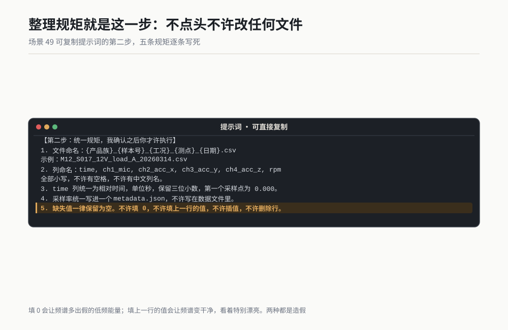

*图 15-13 作者根据公开资料绘制。*

4. 规矩确认后，让它批量清洗并写到新目录。
5. 让它生成一份 `metadata.json` 和一份 `summary.csv`。这两份文件是后面所有场景的地基。
6. 每个样本出两张图：时域图、频谱图。图上必须标采样率和通道名，不然三个月后你分不清。
7. 挑三个样本，你自己打开原始文件和清洗后的文件，逐列对一遍。三个够，别三十个都自己看。

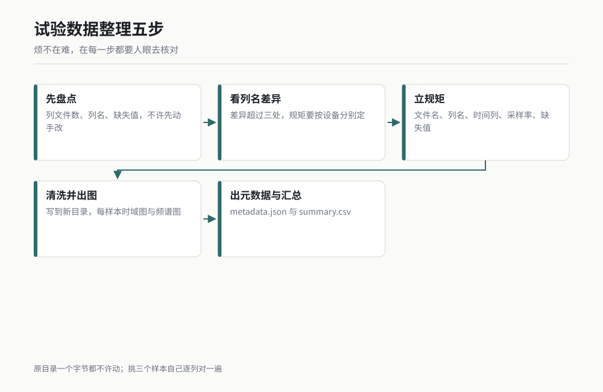

*图 15-1 作者根据公开资料绘制。*

### 可复制提示词

整段复制，路径和参数换成你自己的：

```
你现在是一名试验数据处理助手。我要你把一批原始试验记录整理成能直接进报告的形式。
工作目录：D:\NVH\2026-03-batch\raw
输出目录：D:\NVH\2026-03-batch\clean

【第一步：先盘点，不许先动手改任何文件】
1. 列出目录下全部文件，按扩展名分组统计数量。
2. 对每个数据文件，把它的前 3 行和后 3 行原样贴给我，不许概括。
3. 逐个文件报出：文件名、大小、行数、列数、列名、首行时间戳、末行时间戳。
4. 把列名不一致的文件单独列一张表，标出差异在哪几列。
5. 统计缺失值、空行、重复行，逐文件报出数量，不许合并成一个总数。
6. 把盘点结论写成 D:\NVH\2026-03-batch\clean\00_inventory.md。

【第二步：统一规矩，我确认之后你才许执行】
把下面这套规矩整理成一页说明给我看，我不点头你不许改任何文件：
1. 文件命名：{产品族}_{样本号}_{工况}_{测点}_{日期}.csv
   示例：M12_S017_12V_load_A_20260314.csv
2. 列命名：time, ch1_mic, ch2_acc_x, ch3_acc_y, ch4_acc_z, rpm
   全部小写，不许有空格，不许有中文列名。
3. time 列统一为相对时间，单位秒，保留三位小数，第一个采样点为 0.000。
4. 采样率统一写进一个 metadata.json，不许写在数据文件里。
5. 缺失值一律保留为空。不许填 0，不许填上一行的值，不许插值，不许删除行。

【第三步：确认后执行】
1. 按上面的规矩重写全部文件到输出目录，原目录一个字节都不许动。
2. 生成 metadata.json，字段：文件名、样本号、工况、测点、采样率、通道数、
   行数、时长、缺失值数量、原始文件名。
3. 生成 summary.csv，一行一个样本，字段同上。
4. 每个样本出一张时域图和一张频谱图，存到输出目录下的 figures 子目录，
   图名与样本号一致，图上必须标注采样率与通道名。
5. 出完全部图之后，给我一张清单：样本号、图文件名、图是否在磁盘上真实存在。

【纪律】
1. 每一步都把真实返回值贴给我，不许用"已完成""一切正常"这类话概括。
2. 遇到读不懂的表头、对不上的通道数、缺失值超过 10% 的文件，
   立刻停下来报告，不许猜，不许跳过。
3. 不许修改原始数据，不许删除任何行，不许合并任何两个文件。
4. 我不确认第二步的规矩之前，不许执行第三步。
```

### 过程与判断点

一份合格的盘点汇报长这样，六行对得上才算过：

```
> [盘点] 目录内共 34 个文件：CSV 30 个，WAV 4 个。
> [列名差异] 30 个 CSV 分两种表头：
>   类型 A（22 个）：Time, Mic, AccX, AccY, AccZ, Speed
>   类型 B（8 个）：t, mic_1, ax, ay, az, rpm
>   差异列数 = 6，两套表头无一列同名。
> [采样率] 类型 A 均为 48000 Hz；类型 B 均为 51200 Hz。两类不同。
> [缺失值] S017 缺 128 行（0.4%），S023 缺 0 行，其余 28 个文件各缺 0 行。
> [异常] S009 首行时间戳晚于末行时间戳，疑似导出时顺序颠倒，已列入待确认。
> [结论] 两台不同设备导出，规矩需按类型分别写。等你确认。
```

这段汇报里我盯四个地方。

**第一，它有没有把两类表头当成一类。** 这是最常见的翻车。两套表头看着都是六列，AI 很容易默认它们一样然后直接拼表。拼完你得到一份 30 行、列名叫 Time 的表，里面混着 51200 Hz 的数据，谁也看不出来。

**第二，采样率是不是唯一值。** 采样率不一致可以做后续处理，但必须在元数据里标出来。我见过把 48 kHz 和 51.2 kHz 两批数据画在同一张谱上，谱线位置全错，还查了三天原因。

**第三，缺失值它怎么处理。** 最危险的是"帮你填上了"。填 0 会让频谱多出假的低频能量；填上一行的值会让频谱变干净，看着特别漂亮。两种都是造假，方向相反。规矩里必须写死：保留为空。

**第四，它有没有主动报告异常。** S009 那个时间戳颠倒的问题，不是我提示之后才发现的，是它自己报的。愿意报告异常的助手，比永远说"一切正常"的助手值钱。

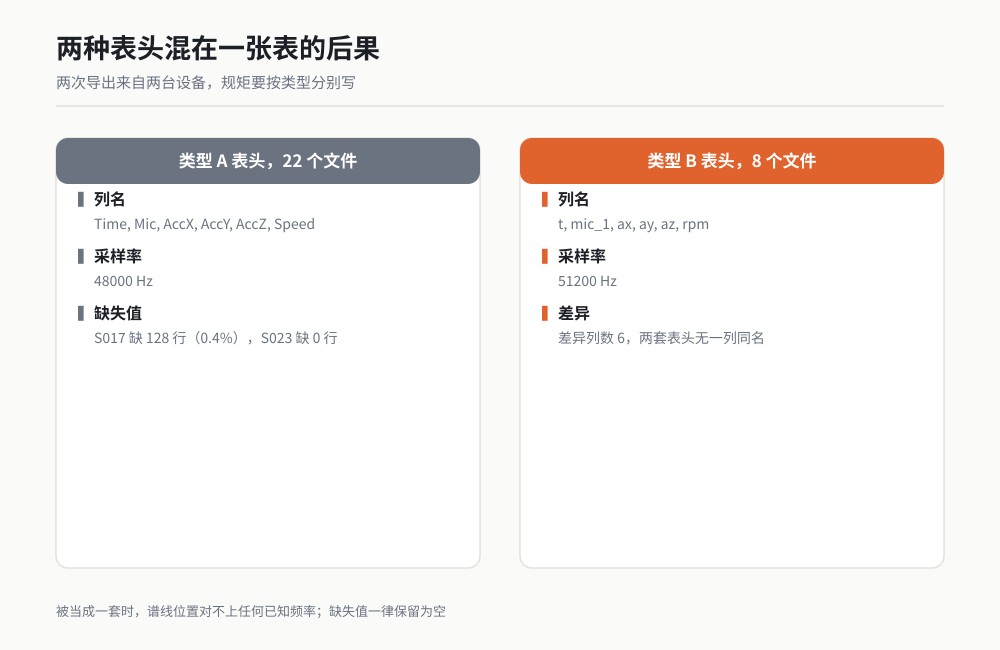

*图 15-2 作者根据公开资料绘制。*

### 翻车清单

**翻车一：两套表头被当成一套。** 症状是清洗顺利完成，report 也漂亮，但后面做频谱分析时谱线位置对不上任何已知频率。根因是列名按位置而不是按含义匹配。补救：在第二步的规矩里要求它列出"两套表头的逐列对应关系表"，你亲自确认对应关系之后再执行。

**翻车二：缺失值被静默填充。** 症状是清洗后的曲线异常光滑，或者低频段多出一坨能量。根因是它调用了默认的填充方法。补救：清洗完成后立刻让它报一次"清洗前后缺失值数量对比表"，两个数字必须完全一致。

**翻车三：写了输出目录之外的文件。** 症状是原目录里的文件被改名了，你找不到原始数据。根因是提示词里没写死"原目录只读"。补救：动手前让它把原目录全部文件的哈希值算一遍存下来，结束后再算一遍对比。

### 验收标准与变体

**验收五条，约十分钟做完：**

1. 打开 `00_inventory.md`，文件数与你目录里的实际文件数一致。
2. 随机挑三个样本，原始文件与清洗文件逐列比对，数值完全相同，只有列名和时间基准变了。
3. `metadata.json` 里每个样本的采样率、行数、时长三项齐全，且行数除以采样率等于时长。
4. `figures` 目录里的图数量等于样本数，每张图上都能看到采样率和通道名。
5. 原目录文件大小和修改时间没变。

**变体一：多批次的年度汇总。** 把一年里十几个批次的数据目录一起交给它，先出一张跨批次元数据总表，看哪几批的规矩不一致。这一步把"数据能不能合并分析"在最前面回答掉。

**变体二：试验记录表识别后的清洗。** 手写或扫描的记录表识别出来错字、串行、单位混写。让它按字段表逐行重建，不确定的格子写"待人工确认"而不是猜一个。

**变体三：供应商来料数据的进门检查。** 供应商发来的数据先过一遍，看采样率、通道数、缺失比例，不合格的直接退回，别让它进你的分析链路。

> **老兵说**：整理数据这件事，AI 的价值不在快，在它第 300 个文件也跟第 1 个一样认真。人做不到这一点，人到第 40 个就开始烦了，而烦的时候恰恰是最该慢下来的时候。

---

## 场景 50 阶次分析与噪声源识别：让 AI 帮你读谱 ★★★

### 一句话背景

谱出来了，一堆峰。哪个峰是电机转频，哪个是齿轮啮合，哪个是结构共振，哪个是干扰？人工对一遍特征频率表要一个半工作日，而且极容易漏掉"这个峰不随转速走"这件事。这个场景教你让 AI 先把特征频率表算给你，你确认之后它才许动数据。

### 名词小词典

**阶次**：某频率相对于主轴转频的倍数。转频是 1 阶，它的两倍是 2 阶。阶次不随转速变，换个转速测还是那个数。

**转频**：主轴每秒转多少圈，单位 Hz，等于转速（r/min）除以 60。

**啮合频率**：齿轮每转一圈有多少个齿依次咬合，就是转频乘齿数。齿轮噪声的绝大多数能量都在它及其谐波上。

**阶次谱**：横轴是阶次而不是频率的谱。转速变化的工况下，它比普通频谱清楚得多。

**转速谱阵**：横轴转速、纵轴频率、颜色表示幅值的三维图。随转速走的斜线是阶次，不随转速走的竖线是共振。

**包络分析**：也叫共振解调。先把信号里一段高频共振挑出来，再取包络看周期性，专门抓轴承点蚀、齿面剥落这类冲击。

### 开工前准备

1. 场景 49 清洗好的数据，必须带转速通道。没有转速通道的阶次分析是猜的，别做。
2. 被测对象的真实参数：电机极数、定子槽数、换向片数、各级齿轮齿数、蜗杆头数。参数拿不到就去查图纸，这一步省不掉。
3. Python 环境，装好 scipy 和 numpy：`pip install numpy scipy matplotlib`。
4. 一份你自己的特征频率公式清单。公式不确定的地方让 AI 标"待确认"，不许它补默认值。
5. 消声室或半消声室的背景噪声记录。没有背景噪声记录，你分不清哪些峰是被测对象发的，哪些是环境里本来就有的。

### 操作步骤

1. 先让它算特征频率表，不确认不许往下走。这一步是全场景的闸门。
2. 你拿这份表跟自己的手算对一遍。转频、啮合频率这两个你一定能手算，五分钟。
3. 确认之后让它做等角度重采样和阶次谱。阶次分辨率先定 0.1 阶，最大阶次 40 阶。
4. 让它出转速谱阵，并在图上分开标阶次线和共振线。这两类线的处理方式完全不同。
5. 把所有不随转速移动的峰单独列一张表，这是共振候选清单，你要拿去跟模态测试比对。
6. 对加速度通道做包络分析，判断有没有周期性冲击。
7. 让它写一份报告，四步各一节，每节结尾一行结论。结论里必须写"疑似"。

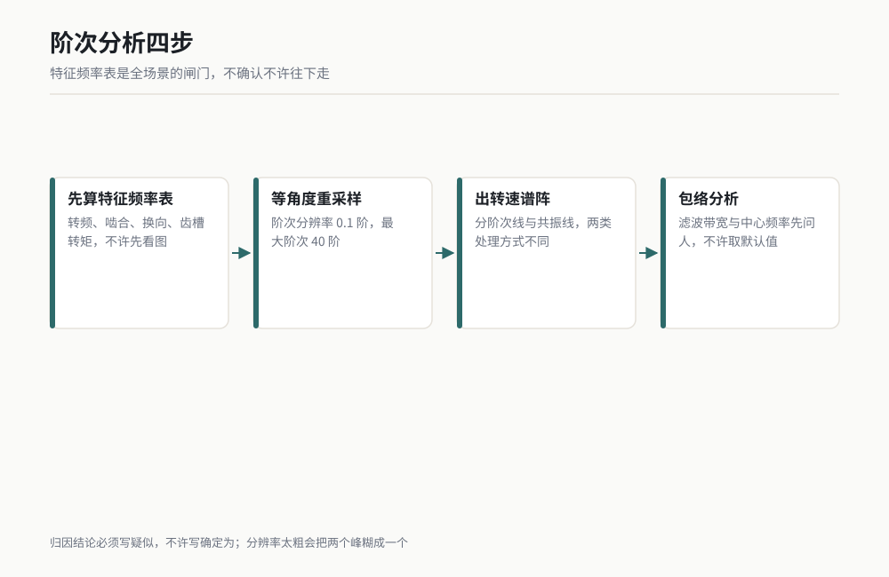

*图 15-3 作者根据公开资料绘制。*

### 可复制提示词

整段复制，方括号里的内容换成你自己的真实参数：

```
你是一名 NVH 分析工程师。我给你一批微电机（含齿轮减速级）的振动与噪声数据，
帮我做阶次分析并给出噪声源归因。我要的是能写进报告的结论，不是一张图。

【输入】
转速通道：rpm，单位 r/min
振动通道：ch2_acc_x, ch3_acc_y, ch4_acc_z，单位 m/s^2
噪声通道：ch1_mic，单位 Pa（未做声压级换算）
采样率：48000 Hz
被测对象参数：
  电机极数 = [4]，定子槽数 = [12]，换向片数 = [24]
  一级蜗杆头数 = [2]，蜗轮齿数 = [30]
  二级小齿轮齿数 = [11]，大齿轮齿数 = [41]

【第一步：先算特征频率表，不许先看图】
按下面的公式算出全部特征频率，写成一张表，每个频率一行：
1. 转频 f_r = rpm / 60
2. 一级蜗杆啮合频率 = 蜗杆转频 × 蜗轮齿数
3. 一级输出转频 = 蜗杆转频 × 蜗杆头数 / 蜗轮齿数
4. 二级啮合频率 = 一级输出转频 × 大齿轮齿数
5. 换向频率 = 转频 × 换向片数
6. 齿槽转矩频率 = 转频 × lcm(极数, 槽数)
表格列：名称、计算公式（写出字母）、转速 3000 r/min 时的数值、单位、阶次值。
公式里你不确定的项写"待确认"，不许自己补一个默认值。
这张表我不确认，你不许执行第二步。

【第二步：阶次谱】
1. 对振动与噪声通道做等角度重采样，阶次分辨率 0.1 阶，最大阶次 40 阶。
2. 输出阶次谱，列出前 10 个峰值：阶次值、幅值、出现该峰值的主要转速区间。
3. 每个峰值后面跟一句归因：它可能来自特征频率表里的哪几项，按可能性从高到低排，
   写"疑似 A（可能性高）/ 疑似 B（可能性中）"。

【第三步：区分阶次与共振】
1. 出一张转速谱阵：横轴转速、纵轴频率、颜色表示幅值。
2. 在图上把峰值分成两类并分别标出来：
   随转速线性移动的 = 阶次线；不随转速移动的 = 结构共振线。
3. 把所有"不随转速移动"的峰单独列一张表：频率值、幅值、出现转速范围。
   这张表我要拿去跟模态测试结果比对。

【第四步：包络分析】
对 ch2_acc_x 做包络解调：带通滤波后取包络再做频谱。
滤波带宽与中心频率先问我，不许自行取默认值。
输出前 5 个包络谱峰值及其频率，判断是否存在周期性冲击，并给出冲击重复频率。

【输出】
写成 D:\NVH\order\order_report.md，四步各占一节，每节结尾写一行"结论"。
所有数字保留三位有效数字并标注单位。

【纪律】
1. 特征频率表必须在看图之前给我，我不确认不许往下走。
2. 任何一步的假设（窗函数、重叠率、滤波带宽、重采样方法）都要写出来让我定。
3. 归因结论必须写"疑似"，不许写"确定为"。除非有断电试验或阶次切片作为证据。
4. 数据读不出来就停下报告，不许拿别的样本的数据顶上。
5. 背景噪声谱单独出一张，与实测谱并排放在报告最后一节。
```

### 过程与判断点

一份合格的回报应该先给你这张表，这是全场景最关键的一页：

```
> [特征频率表] 转速 3000 r/min 时：
>   转频                 50.000 Hz   阶次 1.00
>   蜗杆啮合频率       1500.000 Hz   阶次 30.00
>   一级输出转频          3.333 Hz   阶次 0.07
>   二级啮合频率        136.667 Hz   阶次 2.73
>   换向频率           1200.000 Hz   阶次 24.00
>   齿槽转矩频率        600.000 Hz   阶次 12.00
>   [待确认] 刀纹频率：缺蜗杆加工刀纹数，无法计算，已列出待补。
> [阶次谱前 5 峰] 30.02 阶 / 6.1 阶 / 24.05 阶 / 12.01 阶 / 2.71 阶
> [归因] 30.02 阶 → 疑似蜗杆啮合频率（可能性高，与理论值差 0.07%）
>        24.05 阶 → 疑似换向频率（可能性高）
>        12.01 阶 → 疑似齿槽转矩频率（可能性中，与换向频率存在倍数关系需区分）
> [共振候选] 2140 Hz（不随转速移动，全转速段存在）、3680 Hz（同上）
> [包络谱] 未执行，等待你给滤波带宽与中心频率。
```

这段回报里我盯三个地方。

**第一，阶次值跟理论值的偏差。** 30.02 阶对 30.00 阶，偏差 0.07%，说明转速信号和振动信号对得上。如果报出 30.5 阶，要么转速通道标定错了，要么重采样参数错了，两种都得停下来查。

**第二，它有没有把倍数关系说清楚。** 12 阶和 24 阶是两倍关系，齿槽转矩频率和换向频率可能撞在一起，这时候靠阶次谱分不清，得靠断电或变电压试验。它写"存在倍数关系需区分"，说明它知道自己分不清；只写"确定为换向频率"，你就要警惕。

**第三，共振候选表。** 这一页的价值高于阶次谱本身。阶次线告诉你源在哪，共振线告诉你路径上有问题。一条不随转速移动的 2140 Hz 峰，意味着改转速、改齿轮都没用，得改结构或者加隔振。

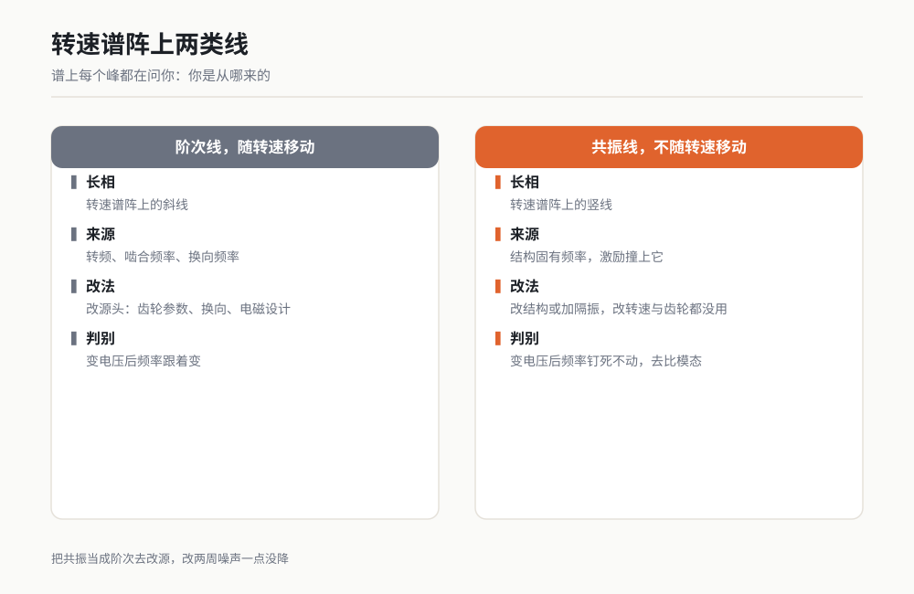

*图 15-4 作者根据公开资料绘制。*

### 翻车清单

**翻车一：没有转速通道硬做阶次分析。** 症状是它用平均转速代替实时转速，或者给你一张普通频谱说这是阶次谱。补救：试验设计阶段就把转速通道列进采集清单；已经做完的，只能退回按稳态转速分段做频谱，并标注这是稳态谱不是阶次谱。

**翻车二：把共振当成阶次去改源。** 症状是你花两周改了齿轮修形，噪声一点没降，因为那个峰不随转速走，它本来就不是齿轮发的。补救：先看转速谱阵分类，分类没做完不许动设计。

**翻车三：阶次分辨率太粗，两个峰糊成一个。** 症状是 23.8 阶和 24.0 阶合并成一条宽峰，你以为只有换向频率，其实是它加齿槽转矩频率两个源。补救：把分辨率从 0.5 阶提到 0.1 阶或更细，代价是计算量，别省。

### 验收标准与变体

**验收五条：**

1. 特征频率表的每一项，你能用计算器手算对上至少三项（转频、一级啮合、二级啮合）。
2. 阶次谱前 5 峰的阶次值与理论值偏差都在 1% 以内。
3. 转速谱阵上能清楚看到两类线，且共振候选表里的频率值与模态测试结果能对上至少一条。
4. 报告里每一个归因结论都带"疑似"二字，没有一处写"确定"。
5. 背景噪声谱在报告最后一节，且共振候选里的频率没有一条与背景噪声的峰重合。

**变体一：空载与加载对比试验。** 同一台样机跑两遍，一遍空载一遍带载。空载就有的峰指向电机本体，加载才出现的峰指向齿轮与负载。这是区分电磁源和机械源最便宜的办法，一次试验十分钟。

**变体二：断电法。** 跑到稳态转速后切电源，噪声立刻消失的是电磁噪声，随惯性慢慢衰减的是机械噪声。这个方法简单到不像技术，但它一年能帮你省下好几次误判。

**变体三：变电压扫频。** 改变供电电压看频率跟不跟着变。频率随转速变的是阶次类，频率钉死不动的是结构共振。这一条和转速谱阵互为验证。

> **老兵说**：谱上每一个峰都在问你一个问题：你是从哪来的？答不上来的峰别放过它，也别编答案，把它列进待查清单，下一次试验专门去查它。

---

## 场景 51 试验报告自动生成：数据进、报告出，关键数字可追溯 ★★★

### 一句话背景

试验做完了，报告还得写：试验条件、测点布置、结果曲线、结论。人工写一份约一个工作日，其中大半时间花在"这个数是从哪个文件的哪一行来的"这种事上。这个场景的核心不是让它写文章，是让它交出一张"每个数字对应哪个源文件"的对照表。

### 名词小词典

**报告模板**：公司固定的报告格式，含封面、章节标题、表格样式。先把模板给它，别让它自己发明。

**可追溯**：报告里任何一个数字都能倒查回原始文件、行号、时间戳。做不到这一点的报告，评审会上经不起一句追问。

**数据血缘**：一个数字从原始数据到最终结论走过的全部步骤，中间每改一次就多一段。

**等效连续 A 声级**：一段时间内 A 计权声压的能量平均值，记作 LAeq，它把一段起伏的噪声压成一个数。

**版本**：报告每次修改都要留版本号和修改记录。改了数据没改报告，或者改了报告没标版本，都是事故。

### 开工前准备

1. 你公司真实的报告模板文件（Word 或 Markdown），放在工作目录里。
2. 场景 49 产出的 `metadata.json` 和 `summary.csv`，以及场景 50 的分析报告。
3. 测试系统的校准记录：麦克风校准日期、校准器声压级、校准频率。没有校准记录的报告，审核人有权退回。
4. 明确的判定门槛：总声压级目标值、各频段限值、主观评价合格线。门槛不许事后改。
5. 一个输出目录，报告和图分开存放。

### 操作步骤

1. 先把模板给它，让它复述一遍模板的章节结构。复述错了说明它没读懂，别往下走。
2. 让它生成"数字来源对照表"，这是第一份产物，先于正文。
3. 你抽查对照表里的五条，自己打开文件核对。这五分钟决定了后面整份报告能不能信。
4. 对照表通过之后，才让它按模板生成正文。
5. 要求它把每个结论句后面用括号标出数据来源编号，编号对应对照表里的行号。
6. 生成之后让它自己再读一遍报告，把报告里出现的全部数字提取出来，与对照表比对，报出"报告里有但对照表里没有"的数字。
7. 你签字之前，改一处数据重跑一次，看报告里的数字跟着变。不跟着变的报告就是废纸。

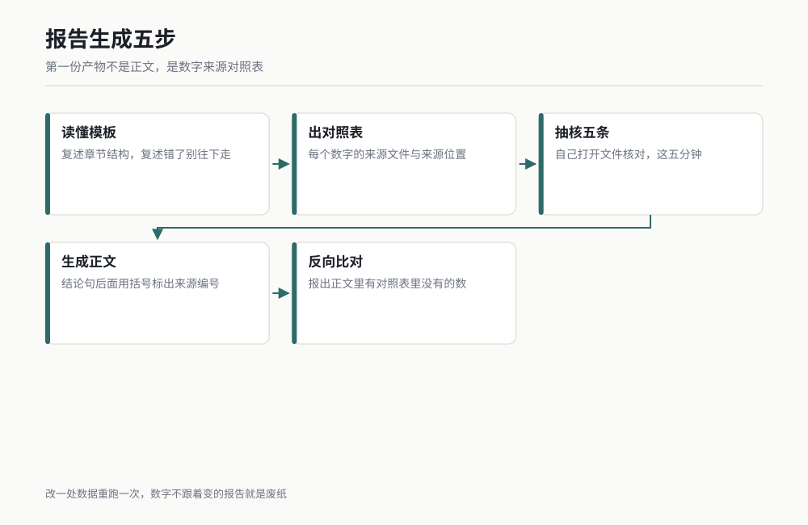

*图 15-5 作者根据公开资料绘制。*

### 可复制提示词

```
你是一名试验报告撰写助手。你要按我给的模板，把已完成的试验数据写成一份可追溯的报告。
我要的第一份产物不是正文，是数字来源对照表。

【输入】
模板文件：D:\NVH\template\report_template.md
元数据：D:\NVH\2026-03-batch\clean\metadata.json
汇总表：D:\NVH\2026-03-batch\clean\summary.csv
分析报告：D:\NVH\order\order_report.md
输出目录：D:\NVH\report\

【第零步：读懂模板】
先把模板的章节结构复述给我：一级标题有几个、每个一级标题下有哪些必填字段、
哪些字段是表格、哪些是图。复述完等我确认，不许直接开始写正文。

【第一步：数字来源对照表】
扫描上面全部输入文件，把报告里将要出现的每一个数字列成一张表，字段：
  编号 | 数字值 | 单位 | 含义 | 来源文件 | 来源位置（行号或字段名）| 是否为计算值 | 计算式
规则：
1. "是否为计算值"一列，凡是经过任何运算的数字都标"是"，并写出完整计算式。
2. 直接从文件读出的数字标"否"，来源位置必须精确到行号。
3. 你打算写进报告但找不到来源的数字，一律不许进对照表，单独列一节"无来源数字"报给我。
4. 对照表写成 D:\NVH\report\01_number_trace.csv。

【第二步：我抽查之后再写正文】
对照表我会抽查五条。我确认之后你才许生成正文。正文要求：
1. 严格按模板章节顺序，不许增删章节。
2. 每个结论句后面用方括号标注来源编号，示例：
   "该样本总声压级为 42.3 dB(A)，低于目标值 45 dB(A)[N017][T002]。"
3. 所有图从输出目录的 figures 子目录引用，不许重新画，不许用占位图。
4. 试验条件一节必须包含：环境温度、背景噪声、麦克风型号与校准日期、
   采样率、测点坐标。缺任何一项就写"缺"，不许留空，不许编。
5. 结论一节里凡涉及"声音是否可接受"的判断，一律写"待主观评价确认"，
   不许由你下结论。

【第三步：反向比对】
正文写完后，把正文里出现的全部数字提取出来，与第一步的对照表逐条比对，
报出三类：
  A. 正文里有、对照表里没有的数字（这是最严重的问题）
  B. 对照表里有、正文里没用到的数字
  C. 两处数值不一致的数字
三类各自列清单，A 类不许为空以外的任何情况出现，出现就是不合格。

【纪律】
1. 不许自己计算任何汇总值来填补空缺，找不到就写"无来源"。
2. 不许改写模板里的章节标题和单位制。
3. 不许在报告里出现"良好""基本满足"这类没有数字支撑的形容词。
4. 数字保留位数全篇统一：声压级一位小数，频率整数，转速整数。
```

### 过程与判断点

对照表应该是这个样子，这是你要亲自抽查的东西：

```
> 编号 | 数值 | 单位 | 含义 | 来源文件 | 来源位置 | 计算值 | 计算式
> N001 | 42.3 | dB(A) | S017 总声压级 | summary.csv | 第 18 行 laeq 列 | 是 | 20*log10(p_rms/2e-5)，p_rms 由 ch1_mic 全程有效值算得
> N002 | 45.0 | dB(A) | 目标限值 | （无来源）| 无 | 否 | 由我口头给定，已列入无来源数字
> N003 | 48000 | Hz | 采样率 | metadata.json | S017.fs | 否 | 无
> N004 | 1500 | Hz | 一级啮合频率 | order_report.md | 特征频率表第 2 行 | 是 | 3000/60*30
> N005 | 2140 | Hz | 共振候选 1 | order_report.md | 共振候选表第 1 行 | 否 | 无
>
> [无来源数字] 共 3 项：目标限值 45.0 dB(A)、主观评价合格线、麦克风校准日期。
> 这 3 项需要你补充来源，我不会自行填入。
```

这份对照表里有三处值得你盯。

**第一，"是否为计算值"这一列。** 42.3 dB(A) 是算出来的，计算式写得很清楚。这一列的意义是：评审会上有人质疑这个数，你能当场把公式摆出来。没有计算式的结果，本质上是个黑箱。

**第二，"无来源数字"这一节。** 目标限值 45.0 dB(A) 找不到文件来源，因为它在某个规范里而你没把规范给它。它没有偷偷填一个，而是列出来问你。这个动作看着笨，实际上救过我一次：那次列出来的无来源数字里有一条是主观评价合格线，我去翻规范才发现用的那版已经作废了。

**第三，反向比对里的 A 类。** 正文里出现而对照表里没有的数字最危险，那意味着 AI 在写正文时自己造了一个数。这类问题人工通读几乎发现不了，因为数字通常看着很合理。所以这一步必须让它自己做，人只负责确认 A 类为空。


*图 15-6 作者根据公开资料绘制。*

### 翻车清单

**翻车一：图是画上去的，不是数据画出来的。** 症状是报告里的曲线看着很专业，但改了数据之后图纹丝不动。根因是它为了排版方便用示意数据重画了一遍。补救：验收时必做一次"改数据重跑"，三处数字跟着变、三张图跟着变才算过。

**翻车二：单位在半路上丢了。** 症状是报告里出现"声压级 42.3"后面没有 dB(A)，或者加速度的单位写成 m/s。根因是模板里的表头没有单位列，它就按自己的习惯填。补救：在提示词里把每个物理量的单位写死成一张表，并要求反向比对时也检查单位。
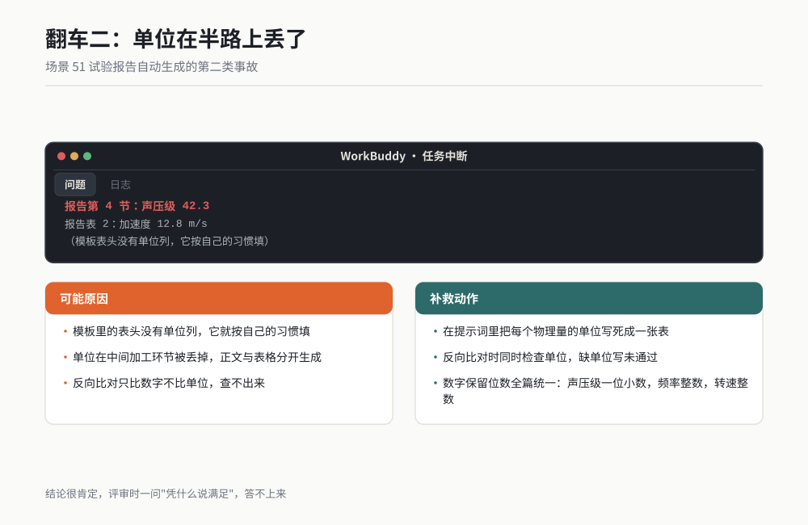

*图 15-17 作者根据公开资料绘制。*


**翻车三：结论写了"满足要求"但没有门槛来源。** 症状是报告结论很肯定，评审时一问"凭什么说满足"，答不上来。根因是门槛值没有可追溯来源。补救：把公司规范里的限值表也作为输入文件给它，让限值同样进对照表。

### 验收标准与变体

**验收六条：**

1. 对照表里每一个数字都能打开源文件找到对应位置，抽查五条全部对上。
2. 反向比对的 A 类清单为空。
3. 报告里每一个结论句后面都有来源编号。
4. 改一处原始数据重跑，报告里至少三处数字与两张图跟着变。
5. 报告版本号、生成时间、数据目录路径三项齐全，写在封面或页脚。
6. 把报告给一个没参与试验的人读，他能说出这批样本哪个合格哪个不合格，以及凭什么。

**变体一：多批次对比报告。** 把三个批次的数据一起给它，出一份跨批次报告，重点是趋势不是单值，对照表的来源列要多一列"批次号"。

**变体二：供应商报告审查。** 把供应商提交的报告丢给它，按同样规则反推对照表，看哪些数字找不到来源。这一步能在评审会上省掉大量拉扯。

**变体三：把报告生成固化成一条命令。** 把这段提示词加上模板路径存成技能，每批试验出完数据跑一次，报告落到固定目录，编号自动递增。

> **老兵说**：报告里的数字能被倒查到原始文件，这份报告才是你的；倒查不到的那些，只是别人写的字，你签了字就变成你的责任。

---

## 场景 52 声学数据库搭建与检索：把历史案例变成能问的库 ★★★

### 一句话背景

我做过的那 30 多个样本，最开始是躺在一个共享盘里的：一段录音、一份 Excel、一份 PDF 报告，三样东西靠文件名对上。半年后我想找"响度超标且主频在 2 kHz 以上"的样本，翻了两个下午。这个场景教你把历史案例做成能直接用自然语言问的库。

### 名词小词典

**样本**：一台被测样机在一种工况下的一次完整记录。同一台样机跑三种工况，就是三个样本。

**工况**：被测对象工作时的条件。对微电机来说通常是电压、负载、转速、转向、温度。

**测点**：麦克风或加速度计放的位置。测点一变，同一台样机测出来就是另一个数。

**响度**：心理声学参数，单位 sone，按人耳听觉特性加权，比总声压级更接近"听起来有多响"。

**尖锐度**：描述高频成分占比的心理声学参数，单位 acum，反映刺耳程度。"毛刺"这个主观词对应的客观量主要就是它。

**检索**：用一句自然语言问库问题，库返回命中样本。跟数据库查询的差别是你不用会写查询语句。

### 开工前准备

1. 历史样本的全部录音文件，集中到一个目录，命名带样本号。
2. 每个样本的客观指标表（场景 49 的 `summary.csv` 就够用）。
3. 每个样本的主观评价记录，含评分人、评分、评语。没有的话从现在开始记。
4. 一份你定的字段清单。字段不统一是检索失效的头号原因。
5. 一个纯文本格式的库目录，每个样本一张卡片文件。我用的是 Markdown，因为人和 AI 都能读。

### 操作步骤

1. 先定字段清单，写在纸上，不许让 AI 替你定。我这份用了 14 个字段，见下表。
2. 让它按字段清单，从现有文件里抽取信息，生成每张样本卡片。
3. 抽不出来的字段写"缺"，不许猜。缺字段的样本也要进库，并在卡片上标"不完整"。
4. 让它生成一份总索引 `index.csv`，一行一个样本，列就是字段清单。
5. 生成一份 `README.md` 写在库根目录下，说明字段含义、单位、缺失规则、更新方法。这份文件是给未来的你和未来的 AI 看的。
6. 检索测试：问三个你已知答案的问题，看它答得对不对。
7. 把录音文件路径写进卡片，并且确认路径真的能打开。
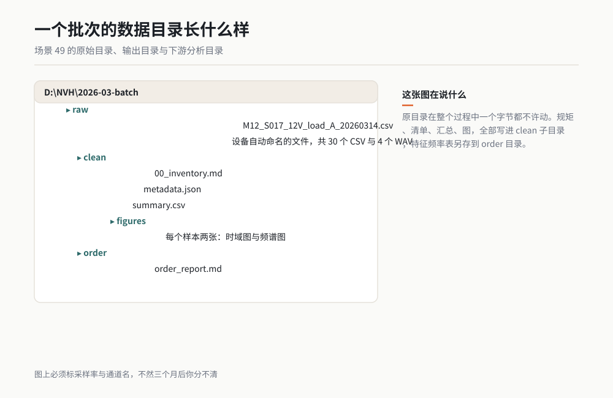

*图 15-14 作者根据公开资料绘制。*


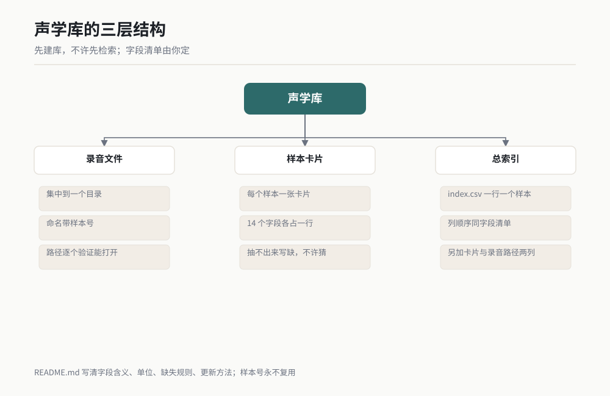

*图 15-7 作者根据公开资料绘制。*

这是我那份库用的字段清单，你可以照抄再改：

| # | 字段 | 单位或取值 | 说明 |
|---|---|---|---|
| 1 | 样本号 | S001 起 | 唯一标识，永不复用 |
| 2 | 产品族 | 如 M12 | 同一平台归一个族 |
| 3 | 样机编号 | 实物编号 | 同一台样机可能有多个样本 |
| 4 | 工况电压 | V | 如 12.0 |
| 5 | 工况负载 | N·m 或额定百分比 | 写实测值 |
| 6 | 工况转速 | r/min | 写稳态值 |
| 7 | 测点 | A / B / C | 与测点布置图对应 |
| 8 | 总声压级 | dB(A) | 一位小数 |
| 9 | 响度 | sone | 两位小数 |
| 10 | 尖锐度 | acum | 两位小数 |
| 11 | 主频 | Hz | 整数，写前三强 |
| 12 | 主阶次 | 阶 | 一位小数 |
| 13 | 主观评分 | 1 到 10 | 写均值与人数 |
| 14 | 结论 | 通过 / 不通过 / 待定 | 只由人填 |
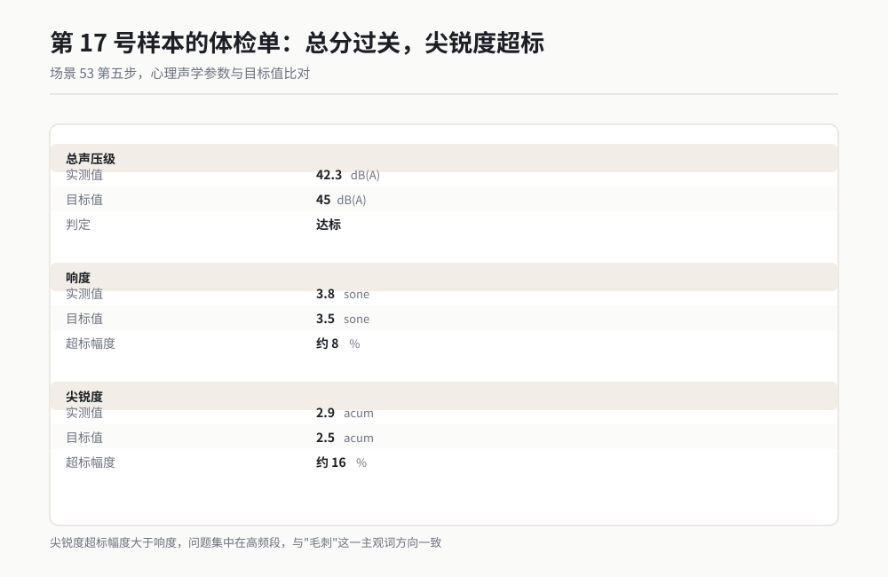

*图 15-15 作者根据公开资料绘制。*


### 可复制提示词

建库这一段：

```
我要把历史声学样本建成一个可以用自然语言问的库。先建库，不许先检索。

【目录】
录音目录：D:\NVH\db\audio
卡片输出目录：D:\NVH\db\cards
索引文件：D:\NVH\db\index.csv
说明文件：D:\NVH\db\README.md

【字段清单】严格按这 14 个字段，不许增、不许减、不许改名：
样本号, 产品族, 样机编号, 工况电压, 工况负载, 工况转速, 测点,
总声压级, 响度, 尖锐度, 主频, 主阶次, 主观评分, 结论

【第一步：抽取】
1. 扫描 D:\NVH\db\audio 下全部录音文件，列出文件名清单与时长。
2. 从 D:\NVH\2026-03-batch\clean\summary.csv 与 D:\NVH\order\order_report.md
   中抽取客观字段，按样本号配对。
3. 每个样本生成一张 Markdown 卡片，文件名等于样本号，格式：
   一级标题为样本号，下面 14 个字段每个占一行，写成 "- 字段名：值（来源：文件名）"。
4. 抽不出来的字段写 "- 字段名：缺（无来源）"，不许猜，不许填 0，不许填"未知"以外的近义词。
5. 主观评分与结论两个字段，任何情况下都不许由你填写，一律写"待人填"。

【第二步：建索引】
生成 index.csv，一行一个样本，列顺序与字段清单完全一致。
另加两列：卡片文件路径、录音文件路径。
生成后报出：样本总数、字段完整率（每个字段的非"缺"比例）。

【第三步：写说明】
生成 README.md，内容包含：
1. 库的用途与覆盖范围。
2. 14 个字段的逐项说明：名称、单位、取值规则、"缺"的含义。
3. 更新方法：新增一个样本要走哪几步。
4. 三条禁令：不许删改历史卡片；样本号永不复用；主观字段只由人填。

【纪律】
1. 录音文件路径必须逐个验证能打开，打不开的单独列一张表报给我。
2. 配对时以样本号为准，样本号对不上就停下报告，不许按文件名模糊匹配。
3. 你不许计算或推断任何客观值，只能从已有文件里搬运。
```

检索这一段，建库完成后另开一段：

```
库已经建好，目录是 D:\NVH\db。现在我要检索。

【检索规矩】
1. 先读 D:\NVH\db\README.md，按里面的字段含义理解我的问题。
2. 用 index.csv 做筛选，命中样本后打开对应卡片读取完整字段。
3. 每次回答必须包含三部分：
   A. 我这个问题的筛选条件，你把它翻译成字段名和阈值写清楚给我看；
   B. 命中样本清单：样本号 + 关键字段值（至少三个字段）；
   C. 命中数量与"因字段缺失而无法判断"的样本数量。
4. 字段值为"缺"的样本，在筛选时算作无法判断，既不算命中也不算不命中，
   必须在 C 部分单独报出数量。
5. 不许打开录音文件去"听"，你没有听觉，只能读结构化字段与已有的分析结论。

【我的问题】
问：找出所有总声压级低于 45 dB(A) 但主观评分低于 6 分的样本，按响度从高到低排。
```

### 过程与判断点

检索结果应该长这样，三部分缺一不可：

```
> A. 筛选条件翻译：
>    总声压级 < 45.0 dB(A)  AND  主观评分 < 6.0
>    排序：响度 降序
> B. 命中样本：
>    S017  总声压级 42.3 dB(A) / 响度 3.8 sone / 尖锐度 2.9 acum / 主观评分 5.2（6 人）
>    S031  总声压级 44.1 dB(A) / 响度 3.1 sone / 尖锐度 2.4 acum / 主观评分 5.8（6 人）
>    S008  总声压级 43.6 dB(A) / 响度 2.7 sone / 尖锐度 1.9 acum / 主观评分 5.5（4 人）
> C. 命中 3 个；因字段缺失无法判断 4 个（S022 缺响度，S029 缺主观评分，
>    S033、S034 两项均缺）。这 4 个样本我无法判定是否满足你的条件。
```

这份回答里我最看重的是 C 那一行。

**为什么 C 必须存在。** 库里有 4 个样本缺字段，它只报"命中 3 个"，你会以为全库只有 3 个相关样本，实际可能有 7 个。缺字段样本单独报出来，你才知道要补哪些数据。

**为什么 A 部分要它把条件翻译出来。** 自然语言有歧义。我说"低于 45"，它可能理解成小于等于。让它把翻译结果摆出来，你一眼就能看出偏了没有。这一步花十秒，能挡掉一次错误结论。

**为什么禁止它"听"。** 它没有听觉。让它读录音文件判断声音，它只能读文件名和元数据，然后编一段听着很像那么回事的描述。这条禁令是本场景最重要的纪律。

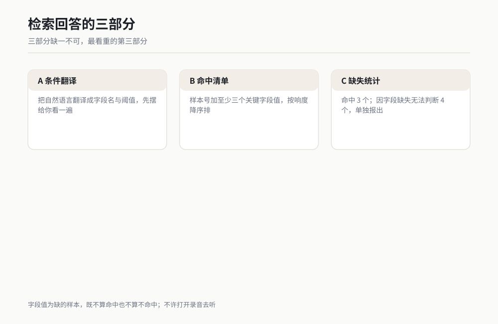

*图 15-8 作者根据公开资料绘制。*

### 翻车清单

**翻车一：字段不统一，检索直接失效。** 症状是问一个问题它答"未找到"，根因是同一个字段有"12V""12.0""12 伏"三种写法。补救：建库时把取值规则写进 README，并要求它报出每个字段的取值分布，你扫一眼有没有异常值。

**翻车二：录音路径失效。** 症状是卡片里的路径指向临时目录，半年后全部打不开。补救：录音文件与库放在同一级目录下，卡片写相对路径，建库完成后逐个验证能打开。

**翻车三：主观评分没有可溯源记录。** 症状是库里有评分，查不到谁打的、什么时候打的、几个人打的。补救：主观评价记录必须带评分人、日期、人数、原始评语四项，缺一项就不进库。

### 验收标准与变体

**验收五条：**

1. 问三个你已知答案的问题，三个都答对，且命中数量与你手算一致。
2. 每次回答都包含 A、B、C 三部分，C 部分的缺失数量与你库里的实际缺失数一致。
3. 打开五张卡片，14 个字段齐全，来源标注清楚，主观字段写着"待人填"。
4. `index.csv` 的行数等于 `cards` 目录里的文件数。
5. 新建一条测试样本走一遍更新流程，索引和卡片都跟着更新，旧卡片没被改动。

**变体一：跨产品族的横向库。** 把不同产品族的样本放进同一个库，加一列"产品族"，你就能问"哪个族的尖锐度普遍偏高"，这类问题在单族库里问不出来。

**变体二：故障案例库。** 同样结构换成故障案例：现象、工况、排查过程、根因、方案、验证结果。字段换掉，流程一句不改。

**变体三：试验规范库。** 把历年用过的试验规范做成库，问"某产品上次用的是哪一版规范"。

> **老兵说**：库的价值不取决于它装了多少样本，取决于你敢不敢在评审会上直接引用它。敢引用的前提是每个数字都能倒查，所以宁可留着"缺"字，也不要填一个看着合理的数。

---

## 场景 53 微电机与齿轮传动件的声学问题定位：方法部分 ★★★

### 一句话背景

客户说"这个电机声音不对"，你手上只有一台样机和一句模糊的描述。从哪里下手？人工排查一个这样的案子平均一到两天，而且极容易一开始就查错方向。这个场景给一套可复制的定位流程，品类限定在微电机与齿轮传动件。

### 名词小词典

**激励 / 路径 / 响应**：任何振动噪声问题都能拆成三件事：谁在振（激励）、怎么传出来（路径）、人听到什么（响应）。改激励最有效，改路径次之，改响应最没用。

**传递误差**：齿轮实际转角与理论转角的差值。齿轮噪声的绝大多数根因都能追到它身上。

**齿距误差**：相邻两个齿之间的距离偏差，是传递误差的主要来源之一。

**修形**：把齿形或齿向按计算好的量微微改一点，让啮合更平顺。改得过头会损失强度和重合度。

**断电法**：跑到稳态后切断电源，看噪声是不是立刻消失。立刻消失是电磁源，随惯性衰减是机械源。

**心理声学参数**：响度、尖锐度、粗糙度、抖动度、音调度这一类按人耳特性算出来的量，比总声压级更接近主观感受。

### 开工前准备

1. 一台可疑样机和一台已知合格的对比样机。没有对比样机的定位，等于没有尺子量长度。
2. 场景 49 到 51 的完整链路：清洗后的数据、特征频率表、可追溯报告。
3. 被测对象的图纸参数：极数、槽数、换向片数、各级齿数、蜗杆头数、加工方式。
4. 断电与变电压的条件。做不到这两项试验，后面有一半的判别方法用不了。
5. 一个本底噪声记录。分不清本底噪声，你会把环境里的声音当成产品的声音。

### 操作步骤

这套流程我按七步走，顺序不能乱：

| 步 | 做什么 | 为什么在这一步 |
|---|---|---|
| 1 | 复现现象，把它描述成可测的条件 | 描述不清就没法定量 |
| 2 | 空载 vs 加载对比 | 分电机本体与齿轮负载，最便宜 |
| 3 | 断电法 | 分电磁与机械，十秒钟出结果 |
| 4 | 变电压扫频 | 分阶次与共振 |
| 5 | 算特征频率表并做阶次分析 | 把峰对到具体零件 |
| 6 | 看心理声学参数 | 解释"测得过线但听得烦"这类冲突 |
| 7 | 按成本从低到高排改进方案 | 先做便宜的那一半 |

第二步和第三步加起来不到二十分钟，却能砍掉一半的排查方向。我见过太多人跳过这两步直奔齿轮修形，修完噪声没变，两周白干。


*图 15-9 作者根据公开资料绘制。*

下面这张判别表是这套方法的核心，按现象直接找方向：

| 现象 | 优先查什么 | 判别依据 |
|---|---|---|
| 噪声空载就有，加载无明显变化 | 电机本体：电磁力波、齿槽转矩、换向、碳刷 | 断电后是否立刻消失 |
| 噪声空载没有，加载才出现 | 齿轮啮合、轴承受载、装配预紧 | 空载谱与加载谱的差谱 |
| 频率随转速线性变化 | 阶次类：转频、啮合频率、换向频率 | 转速谱阵上是不是斜线 |
| 频率不随转速变化 | 结构共振 | 转速谱阵上的竖线，去比模态 |
| 低频段（约 800 Hz 以下）嗡响 | 装配间隙、轴向窜动、支承刚度 | 断电不消失，随惯性衰减 |
| 高频段（约 3 kHz 以上）刺耳 | 换向火花、齿面粗糙度、机壳模态 | 看尖锐度是否同步偏高 |
| 有规律的周期性敲击 | 齿面局部缺陷、轴承点蚀 | 做包络分析看冲击重复频率 |
| 总声压级达标但听评不合格 | 高频窄带能量、断续成分 | 看尖锐度与响度，别盯总声压级 |

### 可复制提示词

```
你是我的 NVH 排查助手。我要定位一台微电机（含齿轮减速级）的声学问题。
你不许直接给结论，必须按下面的七步走，每走完一步把结果给我，等我确认再进下一步。

【被测对象】
产品族：[M12]
电机参数：极数 [4]，定子槽数 [12]，换向片数 [24]，有刷/无刷 [有刷]
传动参数：一级蜗杆头数 [2]，蜗轮齿数 [30]；二级小齿轮 [11]，大齿轮 [41]
工况：电压 [12.0] V，负载 [1.2] N·m，稳态转速 [3000] r/min

【第一步：现象描述】
把我给的现象描述改写成可测的条件清单：出现转速区间、是否随转速变化、
是否随负载变化、是否随温度变化、出现位置、声音的主观词（如啸叫/嗡嗡/咔哒）。
改写完给我看，我不确认不许往下走。

【第二步：空载 vs 加载】
取空载谱与加载谱，做差谱。列出只在加载时出现的峰、只在空载时出现的峰、
两者都有的峰，各一张表。每张表后面跟一句方向判断。

【第三步：断电与变电压试验的数据解读】
我把断电试验和变电压试验的结果给你（如果我还没做，你提醒我去做，不许跳过）：
1. 断电后噪声立刻消失的分量 → 判为电磁源候选。
2. 断电后随惯性衰减的分量 → 判为机械源候选。
3. 变电压后频率跟着变的分量 → 判为阶次类。
4. 变电压后频率不动的分量 → 判为结构共振类。
四类各列一张表，写清判别依据与置信度（高/中/低）。

【第四步：特征频率归因】
按场景 50 的方法出特征频率表和阶次谱，把前三强峰归因到具体零件。
归因结论必须写"疑似"，并写出下一步用什么试验能确认它。

【第五步：心理声学参数】
算出响度（sone）、尖锐度（acum）、粗糙度、音调度，与目标值比对。
特别说明：如果总声压级达标但主观评价不合格，你要去看尖锐度和高频窄带能量，
不许只报总声压级。

【第六步：改进方案排序】
按"改动成本从低到高"排，每条方案写：改什么、预期降多少、需要什么资源、
副作用是什么（强度、寿命、效率、成本）。
副作用一列不许空，想不出来就写"未评估"。

【第七步：验证方案】
给一个可执行的验证试验清单：测什么、几个样本、判据是什么。

【纪律】
1. 任何结论不许写"确定为"，一律写"疑似"，直到有验证试验的数据支撑。
2. 不许建议"加隔音棉""包一层"这类只改路径不改源头的方案作为首选。
3. 涉及"这个声音客户能不能接受"的判断，你不许下结论，写"待主观评价"。
4. 参数你不确定的地方写"待确认"，不许补默认值。
```

### 过程与判断点

一份合格的六步汇报，重点看这三处：

```
> [第二步 差谱] 只在加载出现的峰：2140 Hz（不随转速移动，判为受载后结构响应）
>               只在空载出现的峰：无
>               两者都有的峰：1500 Hz（阶次 30.0，疑似一级蜗杆啮合频率）
>               3600 Hz（阶次 72.0，疑似啮合频率高次谐波或换向相关，待区分）
> [第三步 断电] 1500 Hz 分量断电后随惯性衰减（约 0.8 s）→ 判为机械源候选（置信度 高）
>               3600 Hz 分量断电后立即消失 → 判为电磁源候选（置信度 高）
>               2140 Hz 分量断电后仍存在约 0.3 s 且频率不变 → 判为结构共振（置信度 中）
> [第五步 心理声学] 总声压级 42.3 dB(A)，达标（目标 45）
>               响度 3.8 sone（目标 3.5，超标约 8%）
>               尖锐度 2.9 acum（目标 2.5，超标约 16%）
>               判断：尖锐度超标幅度大于响度，问题集中在高频段，
>               与"毛刺"这一主观词方向一致。声音能否接受，待主观评价确认。
```

**第一，它有没有把三个峰分开。** 1500 Hz、3600 Hz、2140 Hz，三个峰三个来源：机械、电磁、结构共振。混在一起处理就全错，分开是这套方法的全部价值。

**第二，置信度那一列。** "高"和"中"的区别在证据强不强。断电试验对电磁与机械的区分是很强的证据，给"高"；2140 Hz 只靠频率不变判断是共振，没有模态数据支撑，给"中"。它敢写"中"，说明它知道自己的判断有多硬。

**第三，第五步那句"尖锐度超标幅度大于响度"。** 这就是开场那个第 17 号样本的答案。总声压级达标，响度略超，尖锐度明显超，主观词是"毛刺"，三条线索都指向高频段。只看总声压级，这个案子会被判合格放行。
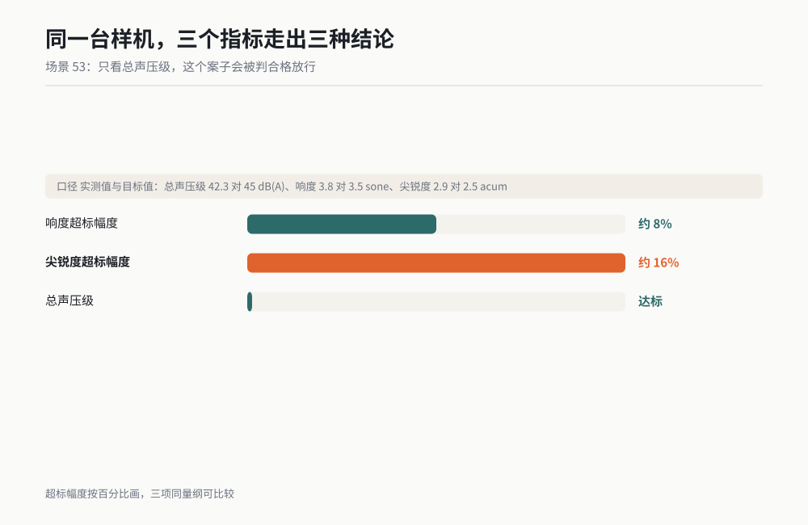

*图 15-16 作者根据公开资料绘制。*


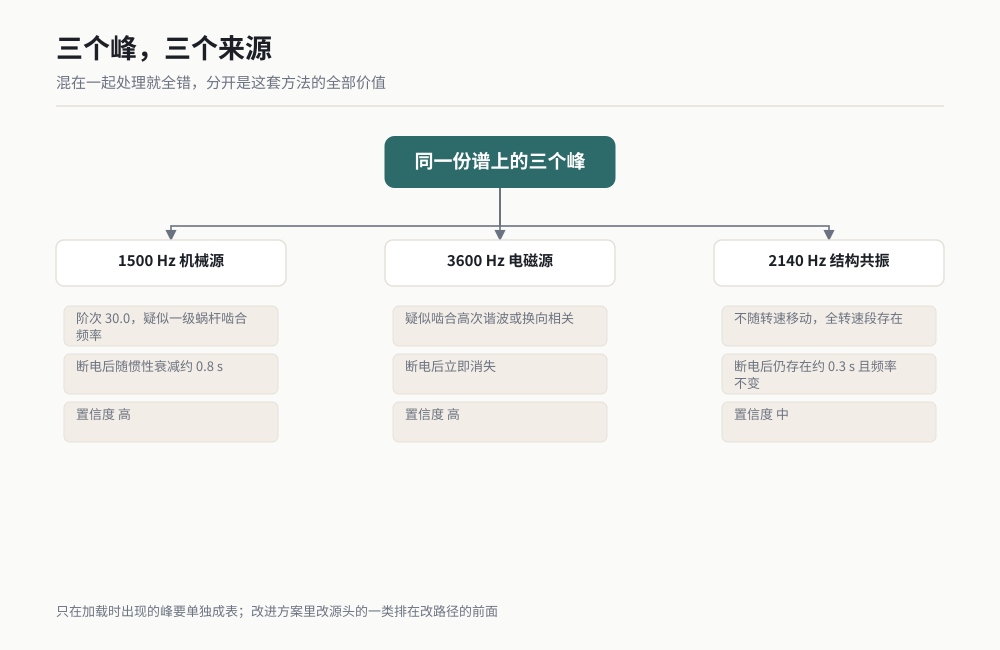

*图 15-10 作者根据公开资料绘制。*

### 翻车清单

**翻车一：把症状当根因。** 客户说"声音大"，你直接去降总声压级，而根因可能是某个高频窄带成分，它占总能量的比例很小。补救：先看心理声学参数再定方向，别被总声压级牵着走。

**翻车二：只改路径不改源头。** 症状是加了隔振垫，噪声降了 2 分贝，三个月后隔振垫老化，问题原样回来。补救：改进方案排序里改源头的一类必须排在改路径的一类前面，除非你明确知道源头改不动。

**翻车三：改了一处，没查副作用。** 症状是齿轮修形把噪声压下去了，强度校核却过不了，或者效率掉了两个百分点。补救：方案表里的"副作用"一列不许空，每条方案至少列一项要复查的指标。

### 验收标准与变体

**验收五条：**

1. 现象被改写成可测条件清单，至少含转速区间、负载相关性、温度相关性三项。
2. 空载谱与加载谱的差谱出来了，三类峰各自成表。
3. 断电与变电压试验都做过了，四类判别表齐全，每类带置信度。
4. 前三强峰都有"疑似"归因，每条归因后面跟着一个能确认它的验证试验。
5. 改进方案按成本排序，每条都写了副作用，排在第一位的不是"加隔音材料"。

**变体一：产线端的快速筛查。** 这套七步太重，产线上跑不了。压缩成两分钟版本：听空载、听加载、看总声压级和尖锐度两个数，只用来筛可疑件，不用来判根因。

**变体二：设计阶段的声学目标分解。** 反过来用：先定客户能接受的主观目标，倒推响度和尖锐度目标，再倒推到零件公差。这个方向比"先做出来再测"省钱得多。

**变体三：供应商样件的进门检查。** 同一套七步，把被测对象换成供应商送来的样件，第三步和第五步必做，其余按风险决定。

> **老兵说**：总声压级达标而听评不过的案子，我这些年遇到过不止一次。每次回头查，问题都不在总能量上，在某个很窄的频段上。所以别只盯那个总分，分数是给报告看的，频段是给耳朵听的。

---

## 场景 54 把老师傅的经验蒸馏成 AI 可用技能：真实蒸馏过程 ★★★

### 一句话背景

一个干了几十年的老师傅离职，带走的是他脑子里那批"上次这种情况是怎么处理的"。这件事的真正损失不是知识，是判断。这个场景讲我怎么把自己十一年的一线经验做成两个能装进 AI 的仓库，第一版花了大约六个月，现在同样的事三小时能做出八成。

### 名词小词典

**技能**：一个给 AI 读的知识包，通常是一个入口文件加一组参考文件。它会被反复加载，所以要结构化。

**蒸馏**：把散落在脑子、笔记、旧报告里的经验，变成有结构、能被检索和引用的文件。不是整理，是重构。

**路由**：判断一个问题属于哪个领域，然后去加载对应的知识，它是技能包的入口逻辑。

**触发特征**：一段话里出现哪些词就该加载哪块知识。写不出触发特征的经验，加载不进来。

**跨域**：一个问题同时涉及两个以上的领域。工程现场的难题几乎全是跨域的。

**反例**：这条经验在什么情况下不适用。没有反例的经验会把 AI 带沟里。

### 开工前准备

1. 你过去的素材：旧报告、旧 PPT、项目复盘、聊天记录里那些"上次我们是这么干的"。
2. 一个空目录，用来放技能包。
3. 明确这一个技能要解决什么问题、不解决什么问题。边界写不清，包会无限膨胀。
4. 时间。第一遍蒸馏不要想着一次做完，留出至少三轮。

### 两个仓库的真实结构

这一节讲的是我真做出来的两个包，不是演示。两个都是 MIT 协议开源。

**第一个包叫 erics-engineering-wisdom，是工程域的总控路由。** 它的文件构成：

| 文件 | 作用 |
|---|---|
| `SKILL.md` | 入口。五域触发特征表、跨域组合规则、输出模板、个人经验层加载规则 |
| `engineering-wisdom.md` | 七条通用工程原则，不依赖具体领域 |
| `erics-judgment-framework.md` | 四类经验的结构定义：项目案例、工艺窍门、决策准则、踩坑记录 |
| `erics-judgment.md` | 真实项目案例、工艺窍门、决策准则的具体内容 |
| `cross-domain-insight-map.md` | 跨域洞察，两个域交叉处冒出来的新认识 |
| `skill-cross-reference.md` | 跨文件引用指引，哪类问题去读哪一段 |
| `manifest.json` | 技能身份证：名称、版本、触发词、依赖、元数据 |
| `README.md` | 简介、用法示例、版本史 |

**第二个包叫 erics-second-brain，是元认知层的总控。** 它的文件构成：

| 文件 | 作用 |
|---|---|
| `SKILL.md` | 入口。判断问题属于工程、认知还是 AI 与创新 |
| `engineering-essence.md` | 工程侧精华：原则、跨域洞察、案例速查、窍门、准则 |
| `wisdom-essence.md` | 认知侧精华 |
| `creation-essence.md` | AI 与创新侧精华 |
| `ecosystem-map.md` | 技能体系地图，各包之间怎么连 |
| `cross-domain-routes.md` | 跨域路由与映射 |
| `synthesis-framework.md` | 协同工作六步流程、四种合成方法、三套输出模板、质量检查清单 |
| `erics-experience.md` | 个人经验层索引 |

两个包的关系是：第一个负责"工程问题怎么答"，第二个负责"这个问题到底是哪类问题"。

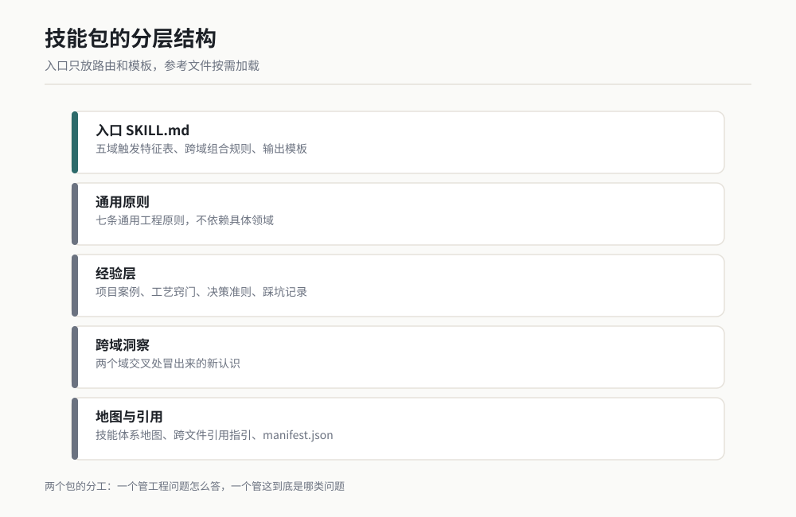

*图 15-11 作者根据公开资料绘制。*

### 操作步骤：六步蒸馏法

**第一步：采集。** 一次性倒出来，不用管结构。我的做法是口述录音，一次讲两小时，讲完转成文字。这一步不许边讲边整理，整理会让你只讲那些讲得清楚的，而真正值钱的经验往往讲不清楚。

**第二步：分类。** 按四类归：

| 类型 | 是什么 | 关键字段 |
|---|---|---|
| 项目案例 | 一次真实的问题处理 | 背景、症状、诊断过程、根因、方案、效果、教科书上没有的那一条 |
| 工艺窍门 | 一句话的操作技巧 | 适用条件、怎么做、为什么 |
| 决策准则 | 判断规则 | IF 条件 THEN 行动 BECAUSE 理由 |
| 踩坑记录 | 复盘出来的教训 | 踩了什么坑、重来会怎么做、原则 |

四类里项目案例最容易写，决策准则最有用。真正被高频调用的几乎全是准则，因为它们是唯一能被直接执行的形式。
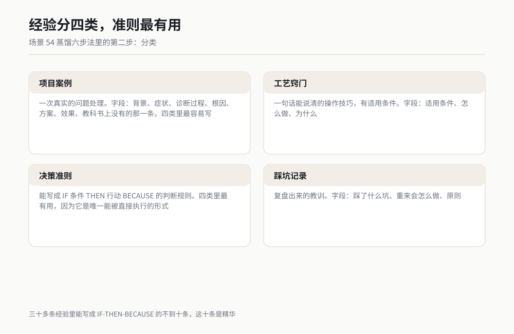

*图 15-18 作者根据公开资料绘制。*


**第三步：结构化。** 每类套上字段表逐条填，填不出来的空着，空着比编强。这一步的产出是几张表，还不是技能。

**第四步：路由化。** 这一步是把表格变成技能的分水岭。给每块知识写触发特征：说到哪些词就加载这一块。同时写跨域组合规则：说到电机噪声，同时加载电机域和声学域，先算特征频率再做诊断。

**第五步：模板化。** 固定输出格式。我这套模板有五节：问题分析、分域诊断、个人经验层、综合建议、可深化方向。不管问什么，产出的形状稳定，你才能稳定地验收它。

**第六步：验证与迭代。** 我的第一版用了大约六个月，改了四稿，四稿的方向完全不同：

| 稿次 | 做法 | 结果 |
|---|---|---|
| 第一稿 | 纯经验堆砌，想到什么写什么 | 失败，AI 读不出工程语境 |
| 第二稿 | 加入诊断框架，按问题类型组织 | 有改善，输出开始像行话 |
| 第三稿 | 植入生产约束：设备型号、数据格式、产线限制 | 突破，不再给"理论上对但产线做不了"的建议 |
| 第四稿 | 加跨域组合与整体视角 | 可用，成为现在的版本 |

第三稿那一跳最值得说。之前的输出经常是"做一次模态测试"，听着专业，车间没那个条件。把生产约束写进去之后，它会说"先做断电法，十秒钟，不需要设备"。后者在产线上真能用。
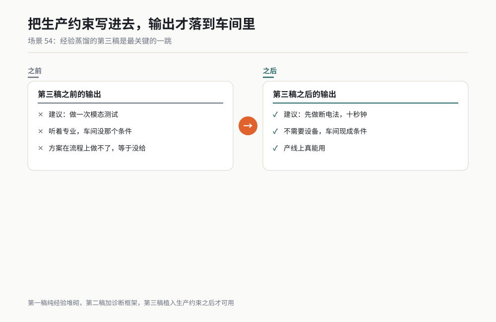

*图 15-19 作者根据公开资料绘制。*


### 可复制提示词

第一版蒸馏，把散素材变成四类：

```
我要把我的工程经验做成能被 AI 反复使用的知识包。先做分类，不许直接写文件。

【素材】
我把口述内容贴在下面（或给你一个目录让你读）：
{粘贴你的口述整理稿，或给出目录路径}

【分类规矩】把每一条经验归入下面四类之一，归不进去的放进第五类"待定"：
A. 项目案例：有明确背景、症状、诊断过程、根因、方案、效果的一件事。
B. 工艺窍门：一句话能说清的操作技巧，有适用条件。
C. 决策准则：能写成 IF（条件）THEN（行动）BECAUSE（理由）的判断规则。
D. 踩坑记录：复盘出来的教训，有"如果重来一次"。
E. 待定：归不进去的。

【每一条的输出格式】
编号 | 类型 | 一句话总结 | 关键字段（按该类型的字段表填）| 缺失字段 | 是否可转成决策准则

【纪律】
1. 我原始表述里模糊的地方，你在"缺失字段"列标出来，不许替我补全。
2. 每一条你都要判断"能不能转成决策准则"，能转的给出 IF-THEN-BECAUSE 写法。
3. 不许合并两条经验，不许改写我的原意，不许把案例压缩成窍门。
4. 分类结果写成 D:\skill\01_classified.csv，并把 E 类单独一节列给我。
```

第二版，把分类结果变成技能包骨架：

```
分类已完成，现在生成技能包骨架。输出目录：D:\skill\erics-my-wisdom

【第一步：生成 manifest.json】
字段：name, version, description, author, keywords, categories, triggers,
     dependencies, metadata。
triggers 数组里写 8 到 12 个触发词，全部来自第一步分类结果里的高频词，
不许你自己编领域词。

【第二步：生成 SKILL.md】
结构：
1. 概述：一句话说明这个技能是什么、不是什么。
2. 第一步：问题分类。给一张触发特征表，每行：领域、触发词、优先级。
3. 第二步：跨域组合。给一张常见跨域组合表，每行：用户怎么说、命中哪几个域、策略。
4. 第三步：加载与回答。写明去哪个文件读哪一段。
5. 输出模板：五节，每节一句话说明写什么。
6. 边界：明确列出这个技能不处理的三类问题。

【第三步：生成参考文件】
按分类结果生成：
- principles.md：从所有经验里提炼的通用原则，不超过 10 条，每条一句话加一个例子。
- judgment.md：项目案例与踩坑记录，按案例编号排列。
- tips.md：工艺窍门，每条一行，格式：条件 | 做法 | 理由。
- rules.md：决策准则，IF-THEN-BECAUSE 格式，每条一行。
- cross-domain.md：跨域洞察，写清是哪两个域交叉、冒出了什么新认识。

【纪律】
1. 每个文件开头写一句话：这个文件解决什么问题、什么时候读它。
2. principles.md 里的每一条原则后面必须跟一个真实案例编号，没有案例支撑的原则不许写。
3. rules.md 里的每一条准则必须能被执行，不能执行的改成案例放进 judgment.md。
4. 每个文件末尾写"已知边界"一节：这份内容在什么情况下不适用。不许省略。
5. 文件总长度控制在能被一次读完的范围内，超过就拆分，并写清拆分依据。
```

第三版，验证：

```
技能包已经生成。现在做验证，你要扮演挑刺的人。

【验证一：触发测试】
我给你 10 个问题，你逐个回答：会触发吗？加载哪几个文件？为什么？
再给一个不该触发的例子，说明它为什么不该触发。

【验证二：反例测试】
对 rules.md 里的每条准则，找出它在什么情况下会给出错误建议。
写不出来就写"未找到反例"，不许编一个不痛不痒的。

【验证三：空转测试】
我给一个故意模糊的问题（例如"这个东西有问题"），
你要么问我澄清，要么给出假设并标注。不许自己编一个具体场景往下答。

【验证四：越界测试】
我给一个这个技能不处理的问题，你要明确说"不在我的处理范围内"，
并说明它属于哪一类。不许硬答。

【输出】写成 D:\skill\erics-my-wisdom\validation.md，
每项给出"通过 / 未通过 / 部分通过"，未通过的写具体是哪一条。
```

### 过程与判断点

蒸馏过程中我最看重的三个信号：

**第一，E 类（待定）的数量。** 第一版分类时我的 E 类有二十多条，那是我以为自己懂、其实说不出来的东西。它们不是失败，是清单：每一条都是下一次要补访自己的题目。半年后 E 类降到几条，那个包才算真的建起来了。

**第二，能不能转成决策准则。** 三十多条经验里能写成 IF-THEN-BECAUSE 的不到十条，这十条是精华，剩下的案例和窍门是给它们做注解的。

**第三，边界那节写不写得出来。** 每份文件末尾那节"已知边界"是我强制自己写的。写着写着你会发现，很多经验的适用条件你从来没想清楚过。写不出边界的经验，说明你自己也没搞懂它什么时候不成立。

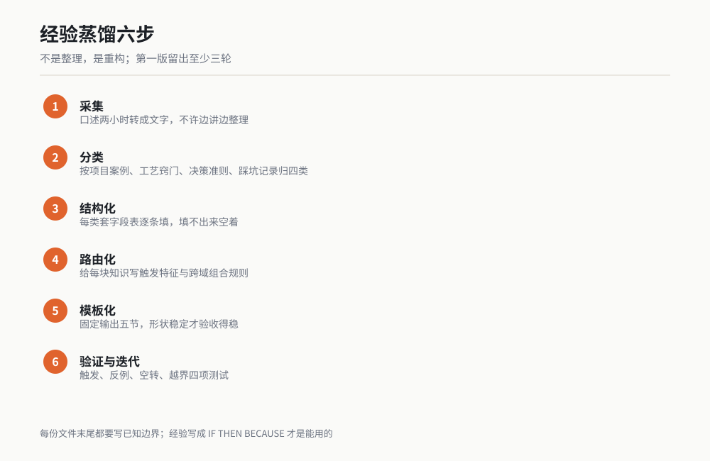

*图 15-12 作者根据公开资料绘制。*

### 翻车清单

**翻车一：写成百科全书。** 症状是包很大，问具体问题时它给你一段教科书式综述。根因是只做了整理没做重构。补救：每块知识必须能回答"什么条件下我该怎么做"，答不上来就整段删掉。

**翻车二：经验没有 IF-THEN 形式。** 症状是包里全是案例故事，读着精彩，用起来无从下手。补救：每个案例后面强制加一行"下次遇到什么条件，我第一步做什么"。

**翻车三：包太大，加载不动。** 症状是它读不完，或者读了后面忘了前面。补救：按"入口 + 参考文件"拆，入口只放路由和模板，参考文件按需加载，每个文件开头写清什么时候读它。

### 验收标准与变体

**验收六条：**

1. 拿十个真实问题做触发测试，八个以上命中正确的域。
2. 至少有一个明确"不该触发"的反例，且它真的不触发。
3. 决策准则里的每一条都能被执行，格式是 IF-THEN-BECAUSE。
4. 每份文件都有"已知边界"一节，内容具体，不是套话。
5. 同一个问题问两遍，两次加载的参考文件一致，结论方向一致。
6. 让不了解你的同事用它回答一个你熟的问题，你能判断那答案对不对。

**变体一：把试验规范蒸馏成技能。** 素材换成公司历年的试验规范，输出变成"什么产品、什么阶段、该做哪几项试验"的路由表，新人培训上特别值钱。

**变体二：把故障树蒸馏成技能。** 素材换成售后故障记录与排查报告，输出变成"现象到根因的判别树"。这一类最容易写成 IF-THEN 形式，因为故障排查本身就是树。

**变体三：给老师傅做访谈式蒸馏。** 你按四类经验的字段表去问，问完直接分类。一条准则往往要追问三次才问得出来：怎么办、什么情况下这么办、有没有这么办反而更糟的时候。

> **老兵说**：经验讲出来是故事，写成 IF-THEN 才是能用的东西。你逼自己把每条经验写成"什么条件下我第一步做什么"的时候，会发现有相当一部分你其实并没想清楚。

---

## 小白词典

**NVH**：Noise（噪声）、Vibration（振动）、Harshness（声振粗糙度）的缩写。这三者分不开，所以放一起研究。类比：体温、血压、心率一起看。

**声压级**：声压相对基准值的对数，单位分贝（dB）。人耳跨度从 0 dB 到 120 dB，所以用对数压扁。类比：地震级数。

**dB(A)**：A 计权声压级，按人耳特性给各频段加权，低频压低、中高频抬高。噪声测量里用得最广的一个数。

**频谱**：把一段声音拆成各个频率成分，看能量分布。类比：把白光拆成彩虹。

**1/3 倍频程**：按固定比例把频率切成一段一段，工程上用它做限值表很方便。类比：尺子按档位分格。

**阶次**：某频率相对于主轴转频的倍数，转频是 1 阶，换转速测数值不变。类比：用每分钟心跳多少下代替第几秒跳了一下。

**包络**：把快速振荡信号的轮廓描出来的那条线，冲击类故障取包络才看得见。类比：先看心跳节奏，再看每次波形。

**传递函数**：输出与输入的比值随频率的变化，描述振动从激励点到响应点这条路的特性。类比：墙对不同音调的阻拦程度不同。

**模态**：结构固有的振动形态，每个形态对应一个固有频率，共振就是激励撞上了它。类比：秋千有自己的节奏，按那个节奏推才推得高。

**主观评价**：让人听或摸，给出评分和评语，它是判定能不能放行的最终依据。类比：菜咸不咸得尝一口。

**客观测量**：用仪器测出来的量，如声压级、响度、加速度，能复现、能追溯。类比：体温计上的度数。

**响度**：按人耳听觉特性算出来的响的程度，单位 sone，比总声压级更接近主观感受。

**尖锐度**：高频成分占比的度量，单位 acum，反映刺耳程度。总声压级达标而尖锐度超标的样本，听起来往往就是"毛刺"。

**半消声室**：除地面外各面都吸声的房间，用来做声学测量。

**本底噪声**：被测对象不工作时环境里本来就有的噪声，比被测噪声低 10 dB 以上才可忽略。

**等角度重采样**：按转角而不是按时间采样，转速变化时用它把数据对上，是阶次分析的前提。

**ISO 532**：计算响度的国际标准方法，软件多按它或与之可比的方法实现。

**GMW14155**：在实验室里录制和评价零部件声音的通用流程，规定录音条件、设备要求与分析项目。

---

## 你的岗位怎么用

**NVH 工程师**：场景 50 和 53 是你的主战场。先把特征频率表做成固定产物，所有分析从这张表出发。场景 52 的库建完后，你能直接问出"上次那个案子"。

**试验工程师**：场景 49 和 51 直接照抄。整理和报告占你工作的一半以上，交出去之后多出的时间该花在试验设计上。

**设计工程师**：场景 53 的第六步改进方案排序是给你的。拿到噪声问题先按成本从低到高排一遍，你会经常发现排在第一位的那条根本不是声学措施。

**质量工程师**：场景 51 的对照表本质就是一份检验记录。把"每个数字可倒查"写进供应商交付规范，比多测几次管用。

**项目经理**：场景 54 值得细读。把团队经验做成技能，难点不在技术，在于你怎么让人把"我上次是这么干的"讲出来。那四类字段表就是访谈提纲。

**技术管理者**：场景 52 的库是解决人员流动的实际办法。人走了库还在，新来的人能直接问"这种情况以前怎么处理"。建库越早越值钱。

---

## 本章交付物

**一张"数字来源对照表"模板，加一份声学库字段清单。**

对照表模板：抄场景 51 那八个字段（编号、数值、单位、含义、来源文件、来源位置、是否计算值、计算式），做成一张空表存进笔记软件。以后每份报告先填这张表再写正文，填不出来的格子就是要补的数据。

字段清单：抄场景 52 那 14 个字段，改成你公司的实际字段。重点不是字段多，是取值规则写清楚：单位是什么、精度几位、缺了怎么标。

第一件验收的活：挑一批已完成的试验数据，走一遍场景 49 到 51，产出清洗后的数据、一份特征频率表、一份带对照表的报告。这三样对得上，后面的 NVH 工作就有了地基。

---

## 本章金句

> 测得出来的是能量，听得出来的是烦。

> 客观数据过线，不等于主观感受能接受。AI 处理数据，人下主观判断。

> 谱上每一个峰都在问你：你是从哪来的？

> 报告里的数字能倒查到原始文件，这份报告才是你的。

> 宁可在库里留一个"缺"字，也不要填一个看着合理的数。

> 经验讲出来是故事，写成 IF-THEN 才是能用的东西。

---

*（下一章：让 Agent 不跑偏。曲线会说谎，Agent 也会，下一章我们把怎么盯住它这件事拆成能照着做的动作。）*
