# 第 8 章 个人效率与知识管理：让资料自己长腿

> 你找不到那份资料，跟记性没关系。你只有一堆文件夹，从来没有过一个库。

## 开场：38 分钟，找一份我自己写的东西

2026 年 3 月 11 日，星期二上午 9 点 40 分，我在找一份三个月前的试验结论。

问话的人很客气，就一句："上一版方案里，绕组最高温度做到多少度？"我记得清清楚楚，那个数我写在过一个 Excel 里，还配了一张曲线图。

我先翻桌面。214 个文件，按修改时间排，翻到第 3 屏就放弃了。再去 D 盘的"项目资料"，里面 1900 多个文件，子目录 11 层，我一层层点下去，看见三个叫"备份"的文件夹。然后我去翻企业微信，搜索"温度"，跳出来 47 条聊天记录，两条像。再翻邮件附件，搜"温升"，找到 5 封，附件都下下来看了，不是。

最后我在一个叫"新建文件夹 (3)"的目录里找到了它。文件名是"数据备份-最终版-真的最终.xlsx"。第 38 分钟。

这不是第一次。我后来数了一遍自己的家底：工作电脑加上同步盘、企业微信收藏、邮件附件和一个 U 盘，一共 3182 个文件躺在 6 个地方。命名全靠当天心情，目录全靠当时手快。每个月我大概要为这种事花掉 3 到 4 个小时，而且每次找完，心情都很差。

真正刺痛我的不是这 38 分钟。是我意识到：这 3182 个文件里，有大量我亲手做过、亲手验证过的结论，但它们在我这儿的价值等于零，因为我取不出来。一个取不出来的结论，跟没做过没有区别。

那个周末我花了两天，把这套家底重做了一遍。这一章是那两天的作业，六个场景，从"建一个能问的库"到"每天自动给我送行业动态"。全部是我自己电脑上跑出来的，标注照旧，跑过就是跑过，没留档的我标 ★★。

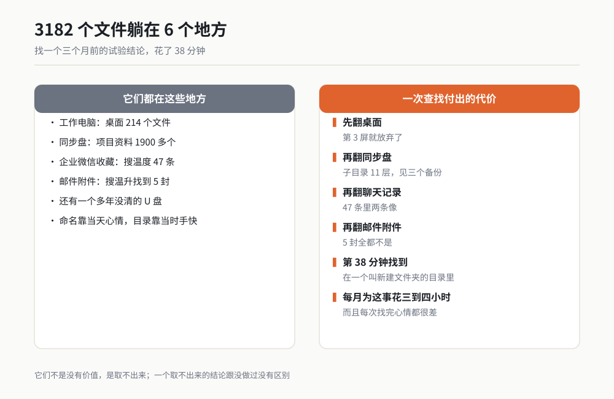
*图 8-1 资料散落示意（作者根据公开资料绘制）*

## 本章六个场景速览

| 场景号 | 场景名 | 人工耗时 | AI 耗时 | 可信度 |
|---|---|---|---|---|
| 07 | 个人知识库：散落笔记变成一个能问的库 | 建库 2 天，查找 38 分钟/次 | 建库 90 分钟，查找 20 秒 | ★★★ 实测 |
| 08 | 长文拆解：200 页技术标准拆成检查清单 | 6 小时 | 45 分钟 | ★★★ 实测 |
| 09 | 待办与日程：混乱记录变成可执行清单 | 30 分钟/天 | 8 分钟 | ★★★ 实测 |
| 10 | 周报月报：从工作痕迹自动生成 | 90 分钟/周 | 15 分钟 | ★★★ 实测 |
| 11 | 文件命名与归档：几百个乱文件一次性归位 | 2 天（3182 个文件） | 3 小时 | ★★ 跑通 |
| 12 | 信息订阅与日报：每天自动汇总行业动态 | 2 小时/天 | 25 分钟 | ★★★ 实测 |

六个场景有先后依赖：先建库（07），库里才有东西可拆（08）；待办和周报（09、10）吃的是同一批工作痕迹；归档（11）做完，库的质量会跳一个档次；日报（12）可以独立跑，也可以反过来喂给库。

---

## 场景 07 个人知识库：把散落的笔记和文件变成一个能问的库 ★★★

### 一句话背景

找一个三个月前的试验结论要 38 分钟，因为资料在 6 个地方、命名靠心情。建好库之后，同一个问题 20 秒出答案，还带文件名和页码。

### 名词小词典

**个人知识库**：不是文件夹，是"一堆文件 + 一张目录 + 一个能回答问题的入口"。文件夹只能靠你记路，库能靠问。

**索引**：给每个文件做一张身份证卡片，写上"这是什么、什么时候、关于哪个项目、结论是什么"。以后找东西先查卡片，不用翻文件。

**检索**：先从一堆卡片里找出相关的那几张，再回去翻原文。跟先翻完整本书再答题是两码事，后者容易编。

**Markdown**：一种纯文本写法，用 `#` 表示标题、`-` 表示列表。好处是任何软件都能打开，AI 读起来也最省事。

**出处引用**：每条回答后面标上"来自哪个文件、第几页、哪一段"。没有出处的答案，一律不算数。

### 开工前准备

1. 在 D 盘新建一个空文件夹，比如 `D:\我的库`。这一步是硬要求：只往库里**复制**，不动原件。原件在你确认库能用之前，一个字都别改。
2. 装好 WorkBuddy 并跑通第一个任务（第 2 章）。没跑通过的，先回去把第 2 章做一遍。
3. 把待入库的资料按来源分成三个子文件夹：`01_本地文件`、`02_导出记录`、`03_邮件附件`。分来源是为了后面出问题能定位。
4. 打开一个记事本，写下"我最常问的 10 个问题"。这 10 个问题就是你后面验收库的标准答案。
5. 留出 90 分钟不被打断的时间。建库不是拖进去就完事，中间要验收。
6. 准备一个备份盘，把原件整体拷一份。这一条在我这儿是铁律。

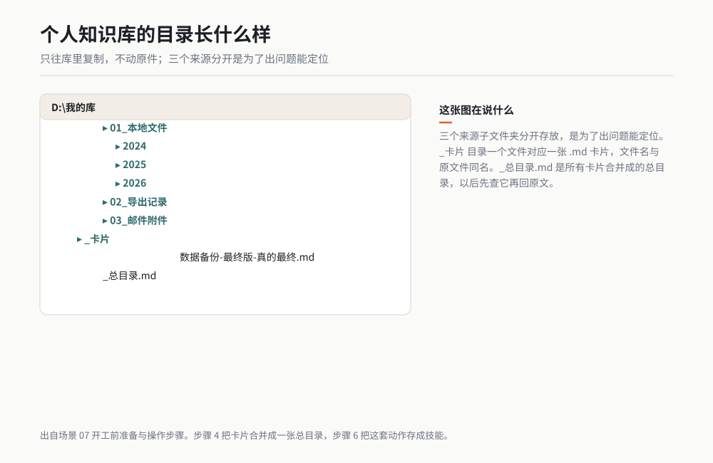

*作者根据公开资料绘制*

### 操作步骤

**步骤 1：先只搬一个来源。** 我第一次建库时一口气把 3182 个文件全拖了进去，结果它处理到第 400 个就慢下来，我也不知道进度到哪了。第二次我改成先搬"本地文件"这一个来源，跑通，再搬第二个。

**步骤 2：让它出清单，不要让它直接干活。** 先把家底盘清楚：一共多少文件、什么类型、哪些它读不了。

**步骤 3：给每个文件写身份证卡片。** 这一步是建库的全部核心。卡片的四栏是固定的：日期、项目、一句话结论、关键词。

**步骤 4：把卡片合并成一张总目录。** 一个 Markdown 文件，按项目或按时间分组。以后它先查这张目录。

**步骤 5：问问题，验证。** 用你写下的那 10 个问题挨个问。问完必须看见文件名。

**步骤 6：把这套动作存成技能。** 第 4 章讲过怎么把用顺手的流程存起来。我存了一个叫"往库里加文件"的技能，以后新资料进来，一句话就归位。

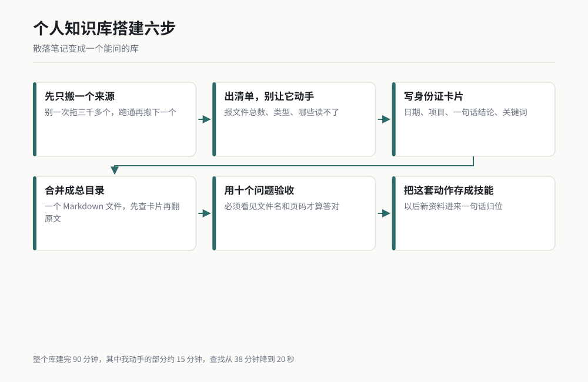
*图 8-2 建库流程（作者根据公开资料绘制）*

### 可复制提示词

步骤 2 用的盘点提示词：

```
我要把 D:\我的库 这个文件夹做成一个可以提问的个人知识库。
现在先不要建库，先做第一步：盘点。

请做三件事：
1. 递归扫描这个文件夹，统计文件总数，按扩展名分类列出数量和占比。
2. 列出你"读不了"或者"读起来会丢信息"的文件，说明原因。
   比如扫描版 PDF、加密文件、超过 50 页的长文档、图片里的表格。
3. 列出文件名可疑的项：包含"最终""备份""新建""副本""旧"的，
   以及内容相同但文件名不同的疑似重复文件（按文件大小和修改时间判断）。

输出一张表格，不要给建议，不要总结，先给我看事实。
```

步骤 3 用的卡片提示词：

```
现在给每个文件写一张"身份证卡片"，存到 D:\我的库\_卡片 目录下，
一个文件对应一个 .md 文件，文件名与原文件同名。

每张卡片固定四栏，用下面这个格式，缺哪一栏就写"未知"，
不许猜，不许编，不许留空：

---
日期：YYYY-MM-DD（取文件修改时间，如从内容能看出更早的日期，写内容里的）
项目：【项目名称，看不出来就写"未标注"】
一句话结论：这个文件最后得出了什么结论。没有结论就写"无结论，仅为过程记录"。
关键词：3 到 6 个，用逗号分隔
---

下面是这个文件的摘要，不超过 150 字，只写事实，不写评价：
【摘要内容】

最后附一行：原文位置（文件名 + 页码或章节号）。

规则：
- 只读你真正打开过的文件，没打开过的不许写卡片。
- 卡片总数必须等于你实际处理的文件数，最后汇报"已处理 X 个，跳过 Y 个，跳过原因如下：……"。
```

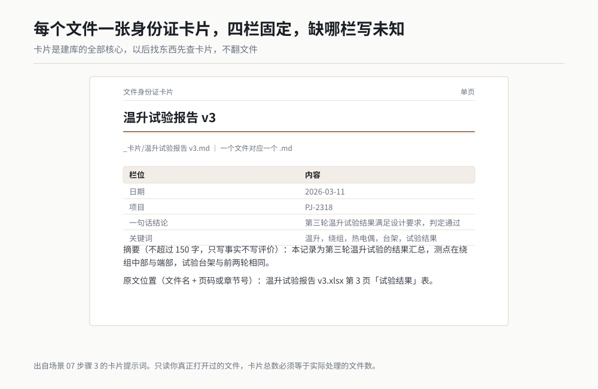

*作者根据公开资料绘制*

步骤 5 用的提问提示词：

```
接下来我会向你提问，问题都关于 D:\我的库 里的资料。

回答规则，必须遵守：
1. 先检索 _卡片 目录下的卡片和 _总目录.md，再决定怎么答。
2. 每条回答后面必须给出处：文件名 + 页码或章节号。
   没有出处的结论不许输出。
3. 如果库里确实没有这个信息，直接回答"库里没有"，
   并且列出你搜索过的关键词，方便我判断是我没存还是你没找到。
   不许用通用知识补全，不许推测。
4. 如果找到多个互相矛盾的记录，全部列出来，标注各自的日期，
   告诉我哪个最新，不要替我选。

我的第一个问题是：【三个月前那次温升试验，绕组最高温度是多少度？】
```

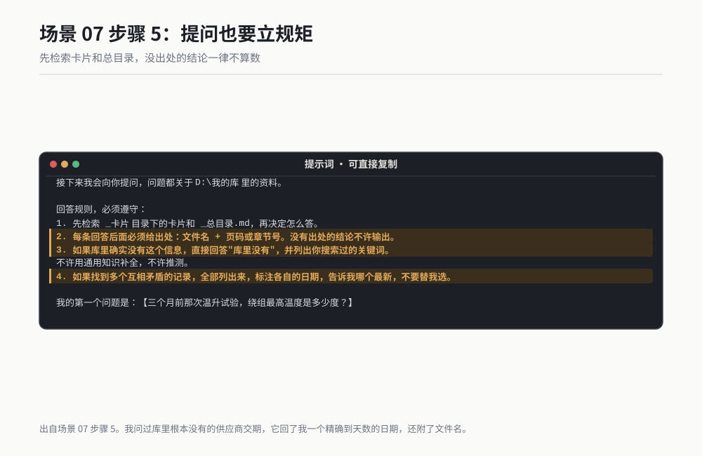

*作者根据公开资料绘制*

### 过程与判断点

跑完步骤 2，它给我的盘点结果里，几个数字我是对过的：3182 个文件里，Excel 占 41%，PDF 占 19%，图片占 14%，剩下是 Word、压缩包和一些我认不出的老格式。它标出 231 个"读不了"，主要是扫描版 PDF 和两张截图里的表格。这个数字我抽查了 20 个，19 个确实读不了，1 个其实能读，是它保守了。

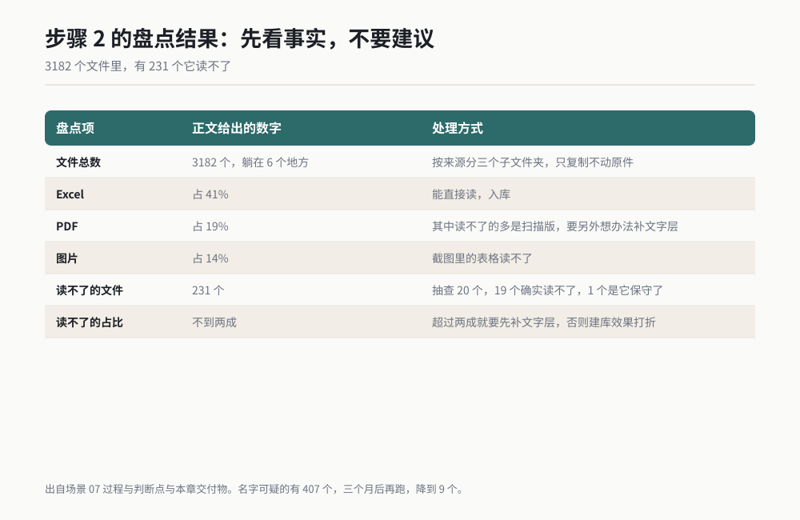

*作者根据公开资料绘制*

步骤 3 的卡片，判断点是**卡片数必须等于处理数**。我第一次跑，它汇报"已处理 291 个"，但 `_卡片` 目录里只有 287 个文件。差 4 个，我让它补齐，它才承认那 4 个打开失败被静默跳过了。这就是我为什么在提示词里强制写"汇报已处理 X 个，跳过 Y 个"。

步骤 5 的验收最直观。我问了那 10 个问题，它答对了 8 个，每个都给了文件名。答错的两个，一个是因为那次试验的结论写在企业微信聊天里，我压根没导进库；另一个是它把 2024 年的一次老试验当成了三个月前的。第二个错很典型：日期判断错。所以我在提问提示词里加了"多个矛盾记录全部列出"。

整库建完耗时 90 分钟，其中我动手的部分约 15 分钟（复制文件、下发指令、验收），剩下是它自己在跑。

### 翻车清单

**1. 它给没读过的文件也编了卡片。** 表现是卡片写得言之凿凿，但原文里根本没有那句话。补救动作：在提示词里写死"只读你真正打开过的文件"，并要求它汇报"处理数 / 跳过数"，两边必须对得上。发现对不上，让它重跑跳过的那批。

**2. 同名文件被当成同一个。** 我有三个叫"最终版"的文件，它合并成了一张卡片，结论用的是最新的那份。补救动作：建库前先让它按"修改时间 + 文件大小"生成一份疑似重复清单，人工确认哪些是真重复、哪些是同名不同物。真重复的合并，同名不同物的强制改文件名。

**3. 问到库里没有的，它照样编。** 这是最危险的一条。我问过一个库里根本没有的供应商交期，它回了我一个精确到天数的日期，还附了文件名。我按图索骥打开那个文件，里面根本没有日期。补救动作：提问提示词里强制"库里没有就说没有，并列出搜过的关键词"，同时验收时随机抽 3 条答案，逐条打开原文核对。

### 验收标准与变体

**验收标准**：从你写下的 10 个问题里随机抽 5 个提问，至少 4 个能在 30 秒内给出"答案 + 文件名 + 位置"。再随机抽 3 条答案打开原文核对，内容必须一致。两条都满足，库才算能用。

**变体一：客户与供应商资料库。** 把历年报价单、资质文件、往来邮件导进去。最省时间的问题是"这家供应商上一次报价是什么时候、多少钱、有效期到哪天"。

**变体二：个人错题本。** 把我每次被打回的东西存进去：评审意见、被领导改过的报告、客户投诉。每周问一句"我最近三个月最常犯的错误是什么"，答案比我自己总结的准。

**变体三：家庭资料库。** 保修卡、合同、体检报告、孩子的疫苗本，全扫进去。问"空调保修到哪天"比翻抽屉快。

**变体四：项目交接库。** 换岗或离职前，把这个项目的全部资料建成一个库交给下一个人，附一张"常见问题 20 问"。这套我同事用过一次，交接会开了 40 分钟就结束了。

> 老兵说：库的价值不在建，在喂。我建完库的头两周，每天都会挑 3 个新文件丢进去，两周后它才真正好用。建完就放着不管的库，三个月后就跟你原来的文件夹没区别。

---

## 场景 08 长文拆解：一份 200 页技术标准拆成检查清单 ★★★

### 一句话背景

一份 200 页的技术标准，人工读完并拆成能照着检查的条目要 6 小时，还容易漏。交给 AI 之后 45 分钟出清单，我只需要抽查。

### 名词小词典

**标准**：规定产品必须做到什么、怎么验证的文件。它跟说明书的区别是：标准里的条款是要被逐条核对的。

**条款号**：标准里每一条的编号，比如 5.3.2。写检查清单必须带条款号，否则出问题没法追溯。

**检查清单**：把标准里"要做到 A"改写成"怎么确认做到了 A"的一张表。三栏：检查动作、判定标准、留什么证据。

**强制与推荐**：英文标准里 shall 表示必须做，should 表示建议做。这两个在检查时权重完全不同，混了会出大事。

**引用文件**：标准里写着"按 XXX 执行"的其他文件。正文没写细节，细节在引用文件里。

### 开工前准备

1. 标准的 PDF 原件，确认页码连续、没有缺页。我用过一次扫描件，缺了 12 页，拆出来的清单漏了一整章。
2. 确认标准版本和生效日期。同一份标准的新旧版条款号可能完全不同。
3. 一个 Excel 模板，列头定死：条款号、条款原文摘要、检查动作、判定标准、证据形式、强制/推荐、我方的现状。
4. 把 PDF 按章节切成 4 到 6 段。一次喂 200 页，它会偷懒跳过后半部分。
5. 记事本记下你最关心的 3 个章节，验收时重点查这几章。

### 操作步骤

**步骤 1：先要骨架，不要条目。** 让它把目录和章节结构列出来，你先看它对不对。骨架错了，后面全错。

**步骤 2：逐章抽条款。** 一段一段来，每段抽完立刻存一个文件，别攒到最后。

**步骤 3：把每条条款改写成检查动作。** 这一步是场景的精髓。"绕组温升不得超过 120 K"要变成"在额定电压、85 摄氏度环境、连续运行 30 分钟后，用热电偶测绕组温度，读数与环境温度之差小于 120 K 判定通过，记录存测试报告第 X 页"。

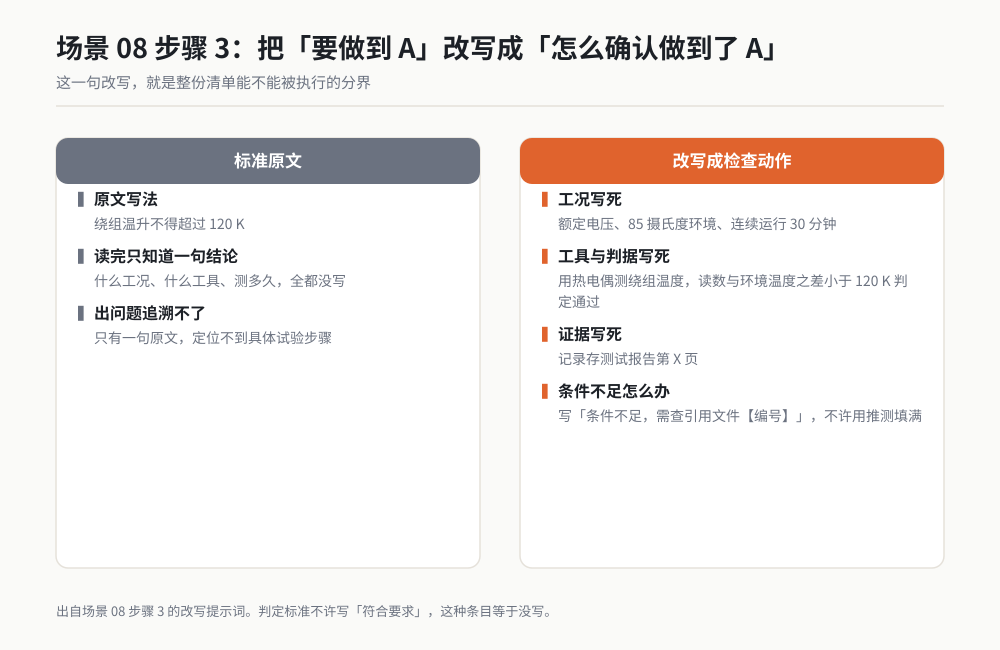

*作者根据公开资料绘制*

**步骤 4：标强制与推荐。** 让它把每条标成 shall 或 should，并给出原文依据。

**步骤 5：去重与编号。** 它会把同一件事在两章里各抽一次，合并掉。

**步骤 6：人工抽查 20 条。** 随机抽，对着原文逐条核。这 20 条的准确率就是整份清单的准确率。

一个我后来才补上的动作：拆完之后，把清单拿给真正要去执行的人看一遍。我在第 5 章拆完就自己签了字，结果试验室回来问："第 5.7 条说在环境温度 85 摄氏度下测，可我们的箱子最高只到 80 度，这条我们做不了。"清单里写着"做不了"和"没写"是两码事，前者是标准与我方能力有冲突，是要立刻上报的事。从那以后，我拆完必过一道执行方的手。

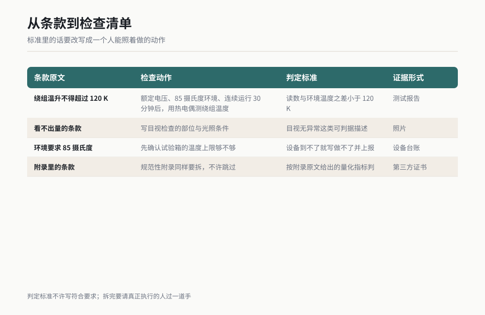
*图 8-3 条款转换示意（作者根据公开资料绘制）*

### 可复制提示词

步骤 1 骨架提示词：

```
这是一份技术标准，共 200 页。先不要拆条款，先给我骨架。

请输出：
1. 标准编号、版本、生效日期（如果文件里有的话；没有就写"未标注"）。
2. 完整的章节结构，保留原文的条款编号，缩进表示层级。
3. 附录列表：编号 + 标题 + 是规范性附录还是资料性附录。
4. 引用文件列表：这份标准引用了哪些其他文件，标注条款号。

只输出事实，不要评价，不要建议。
如果某一页读不出来，明确告诉我"第 X 页读不出"，不许跳过不说。
```

步骤 3 改写提示词：

```
现在把第 5 章的条款改成检查清单，一条一行，输出成表格。

表格列头固定为：
| 条款号 | 原文摘要 | 检查动作 | 判定标准 | 证据形式 | 强制/推荐 |

转换规则，必须遵守：
1. 条款号照抄原文编号，不许自己重新编号。
2. "原文摘要"不超过 40 字，只摘关键限定条件（电压、温度、时间、次数），
   不许改写成你自己的话。
3. "检查动作"必须写成一个人可以照着执行的动作，开头用动词，
   包含具体条件：在什么工况下、用什么工具、测多久。
   写不出具体条件的，在检查动作里写"条件不足，需查引用文件【编号】"。
4. "判定标准"必须是能判断通过与不通过的，有数字的写数字，
   没有数字的写"目视无异常"之类的可判据描述。不许写"符合要求"。
5. "证据形式"写清楚留什么：测试报告、照片、记录表、第三方证书。
6. "强制/推荐"按原文用词判断：shall / must / 必须 = 强制；
   should / may / 建议 / 推荐 = 推荐。判断不了就写"待定"并附上原文用词。
7. 附录里的条款同样要拆，不许跳过。

如果某一条你读不懂，在"检查动作"里写"原文含义不清：+ 原文照抄"，
不许用你的推测填满。
```

步骤 6 抽查提示词：

```
下面这份清单是我让你从标准第 5 章拆出来的。
现在做一次自查，逐条对照原文：

1. 数一数：原文第 5 章一共有多少条编号条款，清单里有多少条。
   两个数字报出来，对不上就列出哪些条款漏了。
2. 检查有没有"清单里有、原文里没有"的条目，有的话删掉并说明。
3. 检查强制/推荐标注，凡是标了"强制"的，给出原文里的对应用词。
4. 列出你判断为"含义不清"或"需查引用文件"的条目，我要单独处理。

输出四段，每段一个数字或一张小表，不要写总结。
```

### 过程与判断点

我拆的那份是 200 页，正文 7 章加 3 个附录。骨架阶段它输出的章节结构，我拿原目录对了一遍，7 章全对，附录漏了附录 C。这就是为什么要先要骨架：附录 C 里有 14 条强制条款，如果直接拆条目，这 14 条会整个消失。

条款抽取阶段，一个关键判断点是**条数**。原文第 5 章一共 63 条编号条款，它第一次报上来 58 条。差的 5 条，4 条是嵌套在一段里的子条款（5.4.1 下面还有 a、b、c），1 条在表格里。我让它补，它补出了 4 条，表格里那条始终没抽出来，最后我自己手工加的。

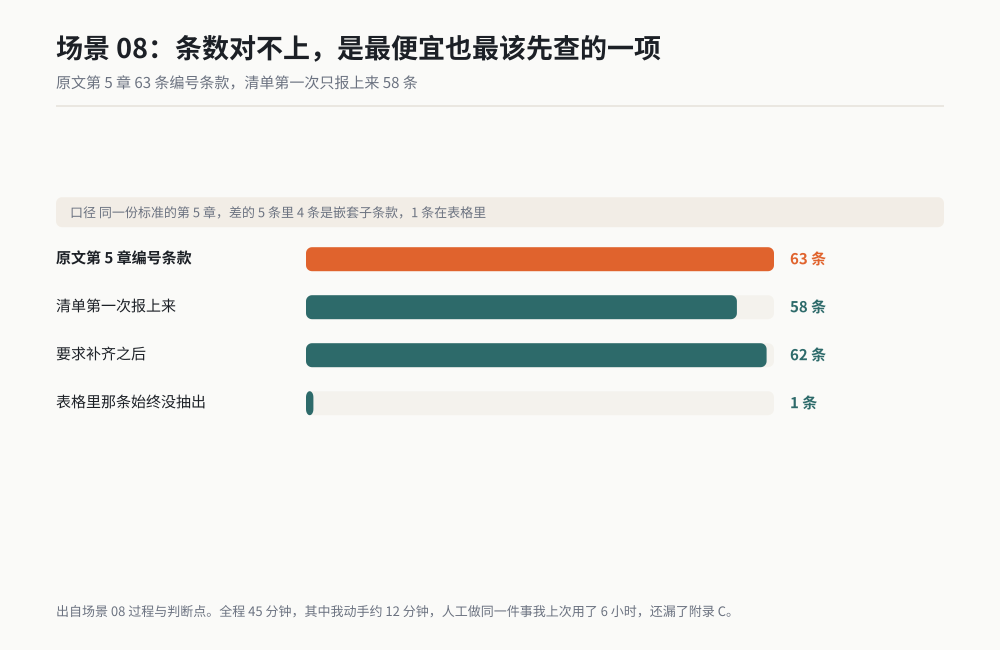

*作者根据公开资料绘制*

改写阶段，判断点是**判定标准能不能判**。它第一版给我写了 17 条"符合要求"，这种条目等于没写，检查的人还是不知道怎么做。我在提示词里加了"不许写符合要求"，第二版这 17 条里 13 条补出了数字，剩下 4 条它标了"原文无量化指标"，这个标注本身也是有用的信息：说明标准这条写得不严，我方可以跟客户谈。

强制与推荐的标注，我抽查了 20 条，19 条对，1 条把 should 标成了强制。这条错在：它按"这条看起来很重要"来判断，不是按原文用词。所以我在抽查提示词里强制它"凡是标了强制的，给出原文对应用词"。

全程 45 分钟，其中我动手约 12 分钟。人工做同一件事，我上次是 6 小时，还漏了附录 C。

### 翻车清单

**1. 跳过了附录。** 附录在 PDF 后半部分，它处理到后面容易敷衍。补救动作：先要骨架、强制它列出附录清单，再逐段喂附录，并要求它汇报"本段共抽出多少条"。

**2. 把推荐当成强制。** 后果是我方按强制要求去准备，白白增加成本。补救动作：验收时把全部"强制"条目过一遍，每条都要它给出原文用词。

**3. 条款号自己重新编了一遍。** 表现是清单里的编号跟原文对不上，后面追溯全线崩。补救动作：提示词里写死"照抄原文编号"，验收时随机抽 10 条，拿编号回原文翻，能翻到就算过。

### 验收标准与变体

**验收标准**：随机抽 20 条，逐条对照原文。条款号能翻到原文、检查动作能被第三方照着执行、判定标准能判通过与不通过，三个条件全中的条目 ≥ 18 条，清单才能用。再查一遍总条数，跟原文的编号条款数差不超过 5%。

**变体一：合同拆成风险清单。** 把 80 页的供货合同拆成"我方义务、对方义务、违约条款、付款节点"四栏，每栏标注条款号和截止日。

**变体二：专利拆成避让清单。** 把一份专利的权利要求拆成"技术特征"逐项列出来，跟自家方案逐项比对，判断有没有落入保护范围。

**变体三：作业指导书拆成培训考题。** 把工位上的作业指导书拆成带答案的判断题，新员工考完就能上岗。

**变体四：客户规范拆成报价依据。** 拆出来的强制条款里，凡是需要第三方检测或特殊工艺的，直接对应成本项，报价时不容易漏。

> 老兵说：拆完的清单，我一定打印一份带到评审会上，让写标准的人逐条确认。清单是拿来对账的，不是拿来存档的。我靠这份清单跟客户争下过两条条款，因为原文里那两条写的是 should。

---

## 场景 09 待办与日程：从混乱记录到可执行清单 ★★★

### 一句话背景

我的待办散在 4 个地方：桌面便签、企业微信给自己发的消息、邮件星标、还有一个靠脑子。每天早上重建一遍清单要 30 分钟，还照漏不误。

### 名词小词典

**待办**：一件还没做的事。它跟"想法"的区别是：待办必须有动作、有终点。

**可执行**：一条待办写到什么程度才算可执行？标准很简单：一个不了解背景的人看完，知道第一步要干什么。

**原子任务**：不能再拆的最小动作。"整理供应商数据"不是原子任务，"把 5 家供应商的报价导进 Excel"才是。

**依赖关系**：A 做完了才能做 B。写清单时要把这条标出来，否则排了也做不了。

**截止日与承诺日**：截止日是文件规定的，承诺日是你答应别人的。两个不一样时，按早的那个排，但要在清单里分开写。

**等待中**：需要别人先给你东西才能继续的任务。这类任务不能躺在待办里假装在做，要单独归一类。

### 开工前准备

1. 把 4 个来源的待办收集成一段纯文本。桌面便签直接复制，企业微信给自己发的消息长按多选转发到文件传输助手再复制，邮件星标逐个复制标题和第一句，脑子里的用语音输入说一遍。
2. 打开今天和明天的日历，把已有会议抄下来。
3. 15 分钟，以及一条纪律：这个过程中不处理任何一件事，只整理。
4. 准备一个固定的存放位置，我用的是一个叫 `todo.md` 的文件，放在同步盘里，手机也能看。
5. 准备一条自己的禁忌词表。我的是四个词：跟进、推进、优化、配合。清单里出现这四个词中的任何一个，就说明这条我还没想清楚，必须重写到能动手为止。

### 操作步骤

**步骤 1：汇总，只要事实。** 把四段文本拼在一起丢给它，让它去重、不改内容。

**步骤 2：归一化成原子任务。** 每条以动词开头，一条一个动作。

**步骤 3：判断优先级。** 我用的判据只有一句："今天不做，谁会来找我？"有人找的排前面。

**步骤 4：估时间，要区间。** 让它给每条估一个区间而不是一个数，比如 25 到 40 分钟。

**步骤 5：排进日历。** 按会议的空档填，一次只排到当天容量的 70%。

**步骤 6：挑出今天必须完成的三条。** 三条以上等于没有重点。

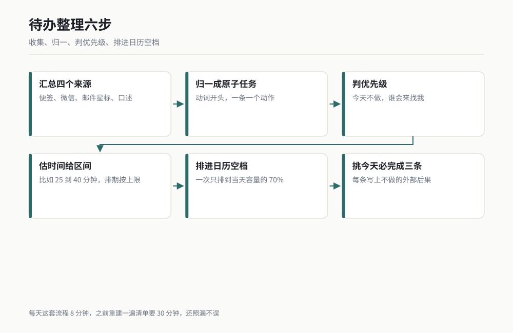
*图 8-4 待办整理流程（作者根据公开资料绘制）*

### 可复制提示词

步骤 1 到 2 的收集与归一化提示词：

```
下面是我从 4 个地方收集来的待办原文，中间用 ---- 分隔。
请做归一化，输出一张表格。

表格列头固定为：
| 编号 | 原子任务（动词开头） | 来源 | 依赖关系 | 估时（区间） | 类别 |

规则，必须遵守：
1. 一条原文如果包含多个动作，拆成多条原子任务。
   "整理供应商数据并回复采购"要拆成两条。
2. 每条以动词开头，比如"导出""发送""核对""打电话给"。
   不许出现"跟进""推进""优化"这类没有终点的词，
   遇到这类词，你必须改写成具体动作，改不出来就在该行后面标【需要我澄清】。
3. "来源"照抄：便签 / 微信 / 邮件 / 口述。
4. "依赖关系"写"无"或"需先完成编号 X"。
5. "估时"写区间，比如 25-40 分钟。不许写单个数字。
6. "类别"只能是四个值之一：今天做 / 本周做 / 等待中 / 也许以后。
7. 一条原文都不许丢。最后必须输出一行：
   "输入 X 条，输出 Y 条，其中拆分产生 Z 条，合并产生 W 条。"
   如果输出条数少于输入条数，必须单独列出被合并或被删除的原文，
   并说明原因，不许静默丢弃。
8. 不许新增任何我原文里没有的任务。

下面是原文：
----
【粘贴第一段】
----
【粘贴第二段】
----
```

步骤 5 到 6 的排期提示词：

```
这是我今天的日历，已被占用的时段如下：
9:30-10:30 项目评审会
14:00-15:00 客户电话会
16:30-17:00 部门周会

可用时段：8:30-9:30、10:30-12:00、13:00-14:00、15:00-16:30、17:00-18:30

下面是归一化后的待办表：
【粘贴上一步的表格】

请排一个今天的计划，规则：
1. 只排"今天做"类别的条目，其余不许排。
2. 总排入时长不超过可用时段的 70%，剩下的留作缓冲。
   算完报一个数："可用 480 分钟，排入 X 分钟，占比 Y%。"
3. 有依赖关系的按依赖顺序排。
4. 需要整块时间的（估时上限超过 40 分钟的）排进连续时段，
   不许跨会议切开。
5. 输出格式：
   时段 | 编号 | 任务 | 估时
6. 最后单独输出三条"今天必须完成"，从排入的任务里挑，
   挑选依据是"不做会产生外部后果"。每条后面写一句后果是什么。
7. 如果"今天做"排不进 70% 容量，把排不进的单独列出，
   标明建议挪到明天，不许硬塞。
```

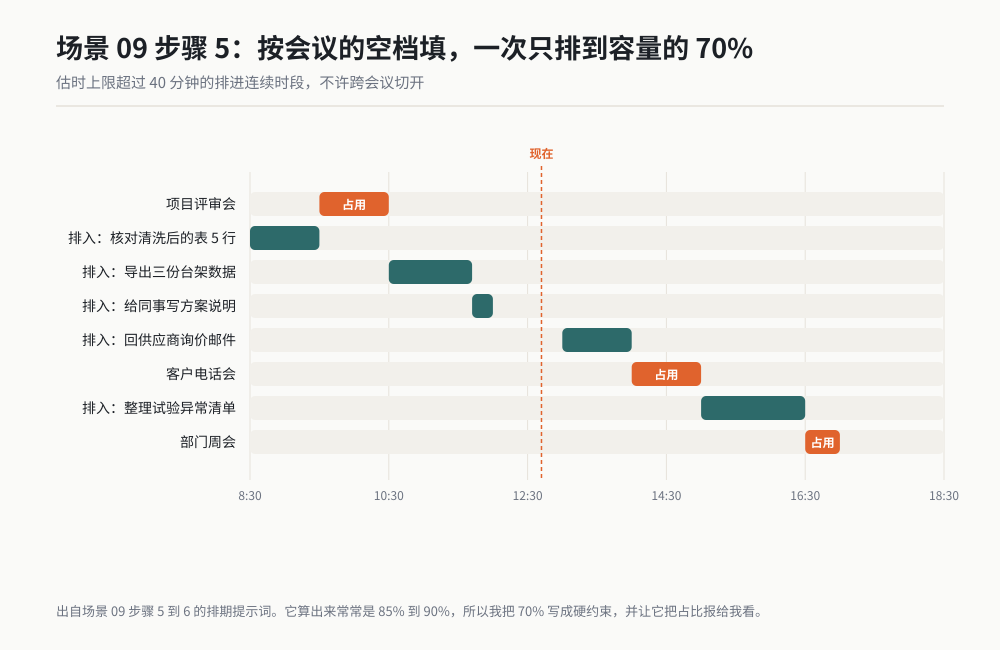

*作者根据公开资料绘制*

### 过程与判断点

我第一次跑这套，输入 23 条，它输出 19 条。少了 4 条。我按验收规则查"被合并或被删除的原文"，它列出来了：3 条它判断为重复（确实重复，我的便签和微信里各写了一遍），1 条它判断为"不是待办，是想法"。那 1 条其实是我答应要给同事的一份资料，它判错了。

从那以后我把"不许静默丢弃"和"输出条数对账"写进了提示词。这是这套流程里最重要的一条纪律：**进多少出多少，对不上就问**。AI 丢东西，从来不会告诉你它丢了。

估时这块，它第一次给的是单个数字，我照着排，结果两条估 30 分钟的实际各干了 70 分钟，下午全乱。改成区间之后我按上限排，准确率明显提高。它估时偏乐观是通病，我的做法是全部按上限排，实际做快了就提前收工。

排期那步，判断点是那个占比数字。我要求不超过 70%，它算出来经常是 85% 到 90%。它会先排满再说。所以我把这条写成了硬约束，并且让它把占比算出来报给我看，数字不对我就打回去重排。

举一个被它改写的真实例子。我原写的是"推进 B 项目电机选型"，它给标了【需要我澄清】。我回头想了三分钟才说清楚：我要做的第一步是"把三家供应商的选型表导进同一个 Excel，对比额定转矩和效率曲线"。改写完这条，我 20 分钟就做完了。原来那条"推进"在便签上躺了两周，我每次看见都绕着走。

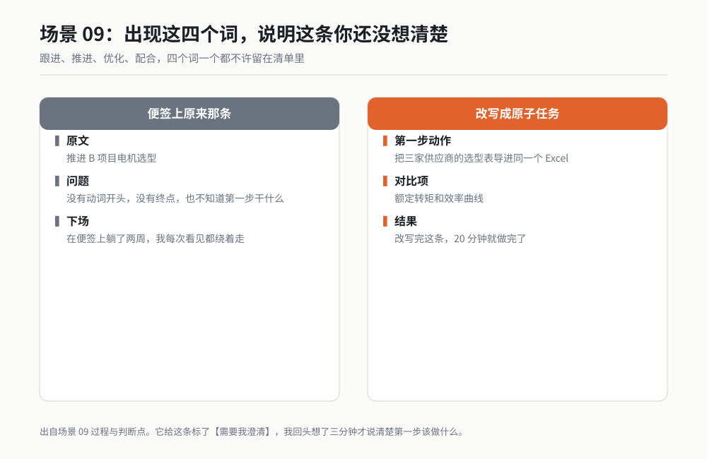

*作者根据公开资料绘制*

从那以后我给自己定了条规矩：清单里出现"跟进""推进""优化""配合"这四个词中的任何一个，就是我还没想清楚。想不清楚的活，排进日历也没用。

三条"今天必须完成"加"后果是什么"这一栏，是我用得最久的设计。写上后果之后，我自己就不太敢拖了。有一条我记得很清楚：后果写的是"不给的话，张三下周的试验排不上台架"。那天我本来想拖到明天，看见这句，晚上七点还是发过去了。

每天这套流程 8 分钟，包括我复制粘贴的时间。之前是 30 分钟，而且经常漏掉微信里那条。

### 翻车清单

**1. 它悄悄合并或删掉了任务。** 后果是事情无声无息消失。补救动作：提示词里写死"输入 X 条，输出 Y 条，对不上必须列出被删原文"，每天扫一眼那一行数字。

**2. 估时太乐观。** 后果是下午全盘崩。补救动作：强制给区间，排期时一律按上限，并在日历里留 30% 缓冲。

**3. 把别人的事排进了我的日历。** 后果是我坐在工位上等一个永远不来的东西。补救动作：类别里必须有"等待中"，凡是"需要某人先给我 X"的一律归入等待中，单独列一张表，每周清一次。

### 验收标准与变体

**验收标准**：数一遍条数，输入数 = 输出数 + 被合并数，减出来的差额必须有明文说明。再随机抽 5 条，每条 30 秒内说得出"做完没有"的判据，说不出就说明这条写得不具体，退回去重写。

**变体一：会议纪要转待办。** 会议纪要贴进去，让它只抽"有人被指派了动作"的句子，每条带上责任人和截止日，没指派的不抽。

**变体二：项目周会转任务分派。** 输入全组的讨论记录，输出按人分组的任务表，每人开头三条，直接发群里。

**变体三：出差行程转日程。** 把机票、酒店、会议邀请、拜访安排贴进去，输出按天的行程表，标注每段之间的通勤时间和缓冲。

**变体四：邮件收件箱清零。** 把 50 封未读邮件的标题和首句贴进去，输出"需要我回复的 / 只需知会的 / 可直接归档的"三类，需要回复的自动转成待办。

> 老兵说：我每天只挑三条必须完成，挑了两年。挑三条的好处不是做完三条，是逼我承认别的事今天做不完。以前我列 15 条，晚上看着 11 条没做完睡觉，第二天更不想开工。

---

## 场景 10 周报月报：从工作痕迹自动生成，不用回忆 ★★★

### 一句话背景

每周五下午，我要花 40 到 90 分钟回忆这一周干了什么，写出来的还常常漏掉最累的那件事。改成从工作痕迹自动生成之后，15 分钟交稿。

### 名词小词典

**工作痕迹**：你这周在电脑上留下的客观记录。文件修改时间、代码提交记录、日历条目、已发送邮件、聊天记录。它的好处是不会撒谎，也不会忘。

**周报与日志的区别**：日志是流水账，按时间记；周报是按结果归纳，要有结论。从痕迹生成的是日志，需要再加工成周报。

**量化**：把"推进了某项工作"改成"完成了 3 项，剩余 1 项，剩余项卡在 X"。周报里没有数字的段落基本都是废话。

**已发送**：只算你发出去的邮件，不算收到的。收到的是别人的工作，发出去的才是你的。

**下周计划**：必须有责任人和判据。写"继续跟进"的计划等于没写。

### 开工前准备

1. 确定你这周有哪几类痕迹。我的是五类：本地文件修改记录、Git 提交记录、日历条目、已发送邮件、企业微信导出的聊天记录。
2. 准备一个导出方法。文件修改记录用文件管理器的"修改日期"排序就能看；Git 提交记录在项目目录里用命令导出成文本；已发送邮件按本周筛选后导出标题清单。
3. 找一份你写得最满意的历史周报当格式模板。格式必须给，不然它每次写的风格都不一样。
4. 一个敏感词表：不能写进周报的项目代号、客户名、金额。提前写下来，让它在生成后过滤一遍。
5. 20 分钟，最好安排在周五下午 4 点以前。太晚了它生成的数字你没时间核。

### 操作步骤

**步骤 1：采集痕迹。** 五类痕迹各导出一份文本，丢在同一个文件夹里。

**步骤 2：让它归纳，不让它写。** 先出一张"这周做了哪些事"的清单，按项目分组。

**步骤 3：你挑。** 从清单里挑出值得写进周报的。这一步不能省，AI 不知道哪些事在你老板眼里重要。

**步骤 4：按模板生成。** 把挑出来的条目和模板一起给它。

**步骤 5：数字校对。** 逐个数字回溯到痕迹来源。

**步骤 6：删形容词。** 这一步我每次都做，它总会夹带"高效""顺利""稳步"。


*图 8-5 周报生成流程（作者根据公开资料绘制）*

### 可复制提示词

步骤 2 归纳提示词：

```
下面是本周（3 月 9 日周一 到 3 月 13 日周五）我的工作痕迹，分五个来源。
请先不要写周报，先做归纳。

输出一张表格：
| 项目 | 做了什么（动词开头） | 痕迹来源 | 日期 | 可量化的结果 |

规则，必须遵守：
1. 只写痕迹里能印证的事。痕迹里没有的，一律不写。
2. "痕迹来源"必须具体到哪一类的哪一条，
   比如"文件：温升报告 v3.xlsx，3 月 11 日修改"
   或"邮件：发给张三，主题《XX 方案确认》，3 月 12 日"。
3. "可量化的结果"能写数字就写数字（页数、条数、次数、人数、天数），
   写不出就写"无量化结果"，不许编数字。
4. 按项目分组，同一项目的事排在一起，组内按日期排。
5. 最后输出一行统计：
   "共归纳 X 件事，其中 Y 件有量化结果，Z 件无量化结果。"
6. 不要写评价，不要写"高效""顺利""稳步"这类词。
7. 如果某个痕迹你看不出对应什么事，单列在最后，
   标题写"以下痕迹我无法归类"，让我自己看。

下面是痕迹：
【来源一：文件修改记录】
【粘贴】
【来源二：Git 提交记录】
【粘贴】
【来源三：日历条目】
【粘贴】
【来源四：已发送邮件】
【粘贴】
【来源五：聊天记录导出】
【粘贴】
```

步骤 4 到 6 生成与校对提示词：

```
现在按下面的模板生成本周周报。
我只选了以下条目写进周报，其余的不许出现：
【粘贴你挑出来的条目编号】

模板如下：
===
一、本周完成
（按项目分小节，每节 3 到 5 条，每条一句话，格式：动作 + 结果 + 数字）

二、当前卡点
（每条格式：卡在什么环节 + 需要谁给什么 + 预计什么时候解决）

三、下周计划
（每条格式：动作 + 负责人 + 完成判据，判据要能判断做没做完）
===

生成规则：
1. 一、本周完成 里每一条必须带至少一个数字。
   没有数字的条目不许出现在这个小节。
2. 不许出现"高效""顺利""稳步""积极""大力推进"这类形容词和副词。
   写完了自己检查一遍，有就删掉。
3. 二、当前卡点 里的"需要谁给什么"必须写具体的人或角色，
   写"需要相关部门配合"的，退回重写。
4. 三、下周计划 里的每条必须有完成判据，
   写"继续跟进""持续推动"的一律重写成可判断的动作。
5. 全文写完后，做一次自查，输出一张对照表：
   | 周报里的数字 | 来自哪条痕迹 | 是否一致 |
   每一个数字一行。数字与痕迹对不上的，标"存疑"并说明。
6. 最后过滤一遍敏感词，遇到下面这些词一律替换成【脱敏】：
   【粘贴你的敏感词表】
```

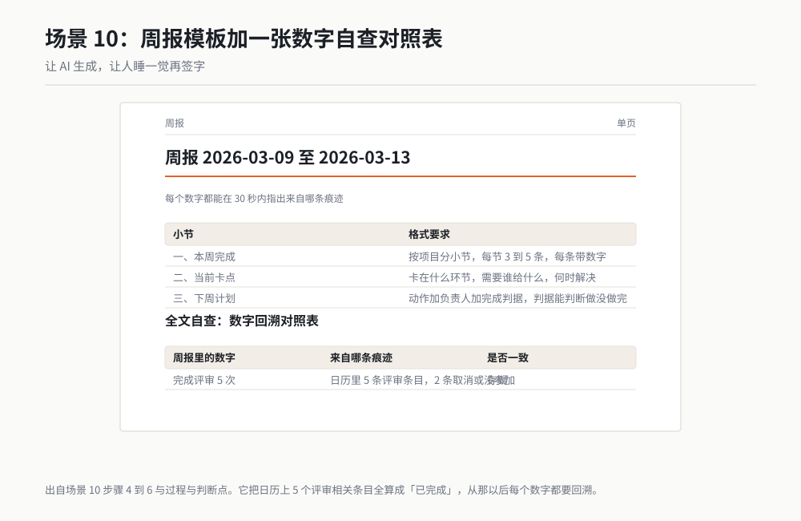

*作者根据公开资料绘制*

### 过程与判断点

我连续用了 14 周，攒下的经验是三条。

第一条：**它归纳出来的事，比我回忆的多。** 第一周它归纳出 23 件，我自己回忆只能想起 11 件。漏掉的 12 件里，有 4 件其实是我那周最费劲的活，比如给一个老项目补了三天历史数据。这种事因为"不好看"，我回忆的时候自动跳过，但痕迹里抹不掉。

第二条：**它造数字。** 第三周，周报里写"完成评审 5 次"，痕迹里只有 3 次。它把日历上 5 个评审相关的条目全算成了"已完成"，其中 2 个是取消了的和没参加的。从那以后我加了自查对照表这一条，每个数字都要回溯。这是这套流程的命门：**周报里的数字错了，比周报写得差严重得多**。

第三条：**它会把计划写成完成。** 第六周，"下周计划"里写过一条"完成 B 样测试报告"，下一周的"本周完成"里它就把这条抄了过来，实际上那报告我根本没写完，因为测试台架坏了。它的逻辑是：上周说要做，这周就当做了。**凡是它从历史周报里继承来的完成项，必须逐条核。**

第四条，也是最让我意外的一条：**它不知道哪些事重要。** 有一次它把"回复客户邮件"排在了"整理三个月试验数据"后面，理由是后者估时更长。实际上那封邮件当天不回，客户就要升级投诉。我后来在排期提示词里加了"挑选依据是会产生外部后果"这一条，才算摆平。这件事教我一个道理：AI 能排序，但优先级的标准必须由你给，它猜不出来。

现在这套流程 15 分钟，其中 8 分钟是我在挑条目和核数字。之前是 40 到 90 分钟，而且靠回忆写的版本，我漏掉过一次关键节点，被领导当场问住。

顺带说一个我坚持了两年的做法：周报写完不发，放一晚上，周六早上再读一遍。隔一夜之后，那些"高效""顺利"的空话和不对的数字，你自己一眼就能看出来。让 AI 生成，让人睡一觉再签字。

### 翻车清单

**1. 数字造得比真相漂亮。** 补救动作：强制输出"数字 痕迹来源 是否一致"的对照表，逐个回溯。周报里的数字，一个都不放过。

**2. 把上周的计划当成这周的完成。** 补救动作：凡是出现在历史周报"下周计划"里的条目，一律标红，逐个打电话或翻文件确认是否真完成。

**3. 敏感信息漏出去了。** 周报是要发给一群人的，客户代号、项目预算、未发布的节点都可能不合适。补救动作：提前写敏感词表，生成后强制过滤，并且自己再通读一遍。

### 验收标准与变体

**验收标准**：周报里每一个数字，都能在 30 秒内指出来自哪条痕迹。逐条过一遍"本周完成"，凡是只在历史周报里出现过、这周痕迹里找不到的，删掉。通读一遍全文，没有形容词和副词。三条全过才能发。

**变体一：月度汇报。** 把四份周报的痕迹汇总，按月归纳，增加一节"本月与目标的差距"，每项目标后面写实际值和目标值。

**变体二：项目阶段汇报。** 输入项目计划表和实际痕迹，输出"计划 vs 实际"对照表，超期的标红并写原因。

**变体三：述职材料。** 输入半年的痕迹，按"做了什么、带来什么变化、学到什么"三栏归纳，每个结论后面挂一条痕迹。

**变体四：报销说明。** 出差痕迹（日历、机票、酒店、拜访记录）自动生成行程说明，附上每一笔的时间地点事由。

> 老兵说：我从第三周起就不再靠回忆写周报了。靠回忆写出来的周报，会系统性地漏掉两类事：一类是不好看的事，一类是没做完的事。而这两类恰恰是你老板最该知道的。

---

## 场景 11 文件命名与归档：几百个乱文件一次性归位 ★★

### 一句话背景

3182 个文件，命名靠心情，目录十一层。人工理一遍保守估计两天，还理不干净。用 AI 出改名对照表再执行，3 小时。

> 说明：这套流程我在两个文件夹上完整跑通过，最大的一次是 3182 个文件。但那次我没有完整留档截图，所以按全书规矩标 ★★，不是 ★★★。

### 名词小词典

**命名规则**：文件名的固定格式。我用的是"日期-项目-内容-版本"，比如 `2025-12-03_A项目_温升试验报告_v3.xlsx`。有规则才能靠名字找文件。

**对照表**：一张 Excel，两列：原路径、新路径。所有改名操作先看对照表，不直接动手。

**干跑**：先只输出"我打算怎么改"，不真的改。改文件前必须干跑一次。

**文件指纹**：按文件大小加内容算出来的一串字符，用来判断两个文件内容是否真的一样。文件名相同不代表内容相同。

**回滚**：改错了能退回原样。做法是先备份，且对照表保留原路径列。

### 开工前准备

1. **完整备份。** 把整个文件夹复制到另一个盘。这一条没有商量余地。我第一次跑没备份，它把两个内容不同但同名的文件改成了同一个名字，第二个直接覆盖了第一个，我丢了一份数据。
2. 一份命名规则，自己先写出来，别让它替你定。我的是四段式：日期、项目、内容、版本。
3. 一个临时工作目录，用来放对照表和日志。
4. 一个文件管理器，能按修改时间排序。改名之后要靠它验收。
5. 心理准备：不要一次处理超过 5000 个文件，太多就分批。

### 操作步骤

**步骤 1：备份，然后确认备份能打开。** 随机打开 5 个备份文件。

**步骤 2：生成文件清单。** 让它扫描全目录，输出一张含"路径、大小、修改时间、扩展名"的表。

**步骤 3：让它提命名方案，但只做参考。** 它提的方案我从来不全盘接受，通常要改项目名和版本号规则。

**步骤 4：人工定稿规则。** 把规则写死成一段文字，后面所有操作都引用这一段。

**步骤 5：先出对照表，不改名。** 这一步是干跑，输出 Excel。

**步骤 6：人工抽查 50 行。** 重点看：日期对不对、项目名有没有认错、版本有没有乱编。

**步骤 7：执行改名。** 按对照表逐行改，输出到日志。

**步骤 8：抽查。** 随机搜 30 个文件名，看能不能按名找到。

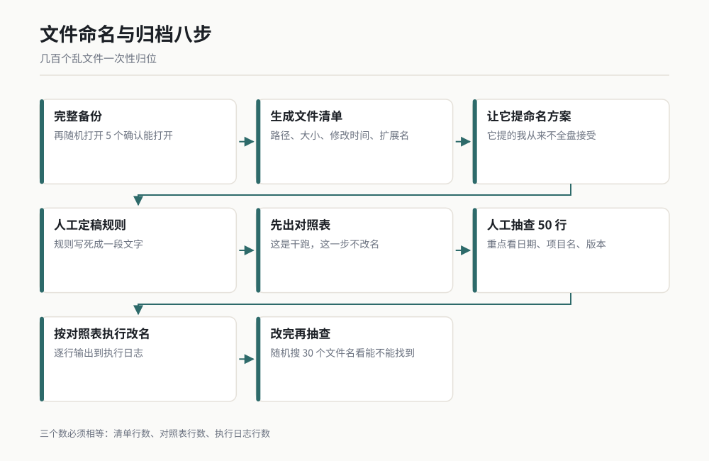
*图 8-6 文件归档流程（作者根据公开资料绘制）*

> 【待补：界面路径，以实际版本为准。批量重命名在不同系统上的入口位置不一样，本章不写具体菜单路径，改用 WorkBuddy 直接读写文件的方式执行。】

### 可复制提示词

步骤 2 到 3 的清单与方案提示词：

```
我要整理 D:\项目资料 这个文件夹，先不要改任何东西。

第一步：扫描整个文件夹，输出一张清单表到 D:\整理\清单.xlsx。
列头固定为：
| 序号 | 完整路径 | 文件名 | 扩展名 | 大小(KB) | 修改时间 | 目录层级 |

第二步：基于这份清单，提一套命名规则建议，输出成文字，包含：
1. 你建议的文件名格式（用占位符表示，比如 YYYY-MM-DD_项目_内容_版本）。
2. 你从现有文件名和路径里识别出了哪几个项目名，各有多少文件归入。
   识别不出来的文件有多少个，列出来。
3. 你打算怎么处理这些特殊情况：
   - 内容相同但文件名不同的文件
   - 文件名相同但内容不同的文件
   - 文件名里带"最终""备份""副本""旧""新建"的
   - 没有扩展名的文件
   - 系统文件或隐藏文件
4. 你认为这套规则的漏洞在哪，列出至少 3 条。

第三步：输出一张"风险清单"，列出你不建议自动处理的路径，
说明原因。这些路径我会手工处理。

全程不许改动任何文件，只输出表格和文字。
```

步骤 5 到 6 的对照表提示词：

```
现在按下面这条命名规则生成改名对照表，只生成对照表，
不要执行任何改名操作。

命名规则（照抄，不许改动）：
- 格式：YYYY-MM-DD_项目名_内容描述_版本.扩展名
- 日期取文件修改时间，格式必须是四位年两位月两位日
- 项目名只能从这里选，不许自己发明：
  A项目 / B项目 / C项目 / 其他
  判断不了归属的，项目名写"其他"
- 内容描述不超过 15 个字，只写这份文件是什么，
  看不出内容的文件，写"待确认"，不许猜
- 版本：能从文件名或内容看出的写 v1、v2 这样的格式，
  看不出的统一写 v1
- 扩展名保持原样，一律不改

输出到 D:\整理\对照表.xlsx，列头固定为：
| 序号 | 原完整路径 | 原文件名 | 新文件名 | 新完整路径 | 是否移动目录 | 备注 |

规则：
1. 目录结构也一并整理：按"项目名\年份\"两级重新组织，
   "其他"类放进"其他\年份\"。
2. 遇到下面三种情况，在"备注"列写清楚，并且不要改这个文件的名字：
   - 目标路径已存在同名文件
   - 内容描述判为"待确认"
   - 文件正在被占用或无法读取
3. 全部行处理完后，输出统计：
   "共 X 行，建议改名 Y 行，跳过 Z 行，潜在冲突 N 行。"
4. 如果发现两个文件内容完全相同（按大小和开头内容判断），
   在新文件名后加 _dup 后缀，并在备注写"疑似重复，未自动合并"。
   不许自动删除任何文件。
5. 新文件名总长度（含路径）不许超过 200 个字符。
6. 新文件名里不许出现这些字符：\ / : * ? " < > |
```

步骤 7 的执行与日志提示词：

```
对照表已经人工抽查过，现在执行改名。

执行规则，必须遵守：
1. 严格按 D:\整理\对照表.xlsx 逐行执行，
   "备注"列不是空的那些行，一律跳过不处理。
2. 用移动的方式改名，不要用复制，避免产生两份。
3. 每处理完一行，往 D:\整理\执行日志.txt 追加一行：
   序号 | 原路径 | 新路径 | 成功/失败 | 失败原因
4. 遇到失败不要中止，记录原因后继续下一行。
5. 全部执行完，输出统计：
   "共 X 行，成功 Y 行，失败 Z 行，跳过 N 行。"
   并把失败的行完整列出来。
6. 执行完不要删对照表，我要留着做回滚依据。
7. 如果发现目标位置已有文件，不许覆盖，
   在新文件名后加 _1 后缀，并在日志里标注。
```

### 过程与判断点

3182 个文件那次，几个数字我记到现在。

它识别出的项目名有 4 个，其中 3 个对，1 个是它自己发明的：把一批"NVH"开头的文件归成了一个叫"NVH专项"的项目，实际上那批文件分属两个不同项目。判断不了归属的有 611 个，占 19%，这个比例让我意外地高。我的补救是：判断不了的全归"其他"，宁可不归，也不归错。

对照表生成完，行数对上了：3182 行。建议改名 2471 行，跳过 711 行。跳过的里面，"待确认"占大头，402 个。冲突 87 行。

我抽查了 50 行，问题集中在两处。一是日期取错：它有 6 行取的是文件创建时间而不是修改时间，我后来在规则里写死了"取修改时间"。二是版本号乱编：有一批文件它标成了 v1 到 v7，实际上那批文件根本不是版本关系，是七个不同零件的数据，只是名字里都带"报告"。版本这一栏我后来改成"看不出的一律写 v1"。

执行阶段 3 小时，其中它跑改名约 40 分钟，其余时间是我在抽查和修规则。成功 2455 行，失败 16 行，失败原因是 12 个文件被占用（我自己的 Excel 开着），4 个权限不足。

改完之后我做了验收：随机想 30 个文件，按新名字搜，30 个全部一次命中。改之前同样的测试，我只想起 18 个文件在哪，其中 11 个找对了。

### 翻车清单

**1. 没备份就动手，重名文件被覆盖。** 我栽过一次，丢了一份数据。补救动作：备份放第一步骤，且备份完随机打开 5 个文件确认能打开。执行提示词里写死"不许覆盖，加后缀"。

**2. 文件名太长或有非法字符。** 深层目录加上长名字，总长度很容易破 200 字符，Windows 上会失败。补救动作：规则里限定总长度，且禁用 `\ / : * ? " < > |` 这九个字符，让它生成后自己校验一遍。

**3. 它替你发明了项目名。** 后果是文件被归到了一个不存在的项目下，比不归还糟。补救动作：规则里把项目名列成枚举，写死"只能从这里选，判断不了写其他"。

### 验收标准与变体

**验收标准**：先查三个数字，清单行数 = 对照表行数 = 执行日志行数。再随机想 30 个文件按新名搜索，命中 ≥ 28 个。最后按新目录结构随机翻 10 个文件，确认内容跟预期一致。三条全过才算完成，对照表和备份保留至少一个月。

**变体一：照片归档。** 按拍摄日期和地点重命名，输出"年月日_地点_序号.jpg"，同一天的照片自动归入月份文件夹。

**变体二：试验数据归档。** 台架导出的数据文件通常叫一堆编号，按"日期_样件号_工况_通道数"重命名，并生成一张数据索引表。

**变体三：邮件附件归档。** 把某个项目往来邮件里的附件全部导出，按"日期_发件人_主题关键词"命名，生成一张附件清单附在项目目录下。

**变体四：扫描件归档。** 一批没有文字层的扫描 PDF，让它逐页读出标题行再命名，读不出的统一进"待人工"文件夹。

> 老兵说：这套活我只在周末做，且做完当周不动。原因很实在：改完名的头几天，我已经形成的肌肉记忆还会去找旧名字，如果立刻开始新项目，新旧两个目录会同时长，一周后比整理之前更乱。

---

## 场景 12 信息订阅与日报：每天自动汇总行业动态 ★★★

### 一句话背景

我在一个行业社区里做日报，每天要扫二十来个信息源。人工做一天两小时，AI 做 25 分钟，而且它比我更能忍住不看标题党。

### 名词小词典

**订阅源**：一个会持续更新内容的网址。你不用每天去打开，它更新了会告诉你。常见的有 RSS、公众号、行业网站的更新栏目。

**RSS**：一种老但好用的订阅格式。网站把更新内容按固定格式吐出来，订阅工具直接读，不用打开网页、不用看广告。

**去重**：同一条消息被多个源转发，只留一条，标注"经 N 个源转载"。

**摘要**：两句话。第一句说发生了什么，第二句说跟我们有什么关系。超过两句没人看。

**定时执行**：让这套流程每天固定时间自己跑一遍，跑完把结果放在一个固定位置。第 6 章讲过多代理，这里用的是更简单的定时任务思路。

### 开工前准备

1. 一份订阅源清单，10 到 20 个。少于 10 个不够看，多于 20 个你不会看。我用的是 16 个：4 个行业协会、5 个企业技术博客、3 个标准更新页、2 个政策发布页、2 个海外技术媒体。
2. 一个固定归档目录，比如 `D:\日报\2026\03\`。每天一个文件，文件名带日期。
3. 一个固定时间。我设在每天早上 7 点 30 分，跑完我上班刚好能看。
4. 一份"我关心什么"的清单，5 到 8 条关键词。这份清单决定它筛掉什么。
5. 一份"不关心什么"的清单。同样重要，比如招聘广告、会议通知、纯观点文章。
6. 一个推送出口。我发在社区群里，你也可以只存本地。

### 操作步骤

**步骤 1：列源。** 把 16 个源写进一个文本，每个标注类型和可信度。

**步骤 2：抓取。** 让它按源逐个取回最近 24 小时的内容。取不回来的要明说。

**步骤 3：去重。** 同一事件多源转载的合并，保留最先发的那个源。

**步骤 4：按主题归类。** 我固定分四类：技术进展、标准与法规、企业动态、市场数据。

**步骤 5：逐条写摘要。** 两句话，第二句必须写"跟我们有什么关系"。

**步骤 6：生成 Markdown。** 存进归档目录，文件名带日期。

**步骤 7：存档并推送。** 同时往总索引文件里追加一行，方便以后检索。

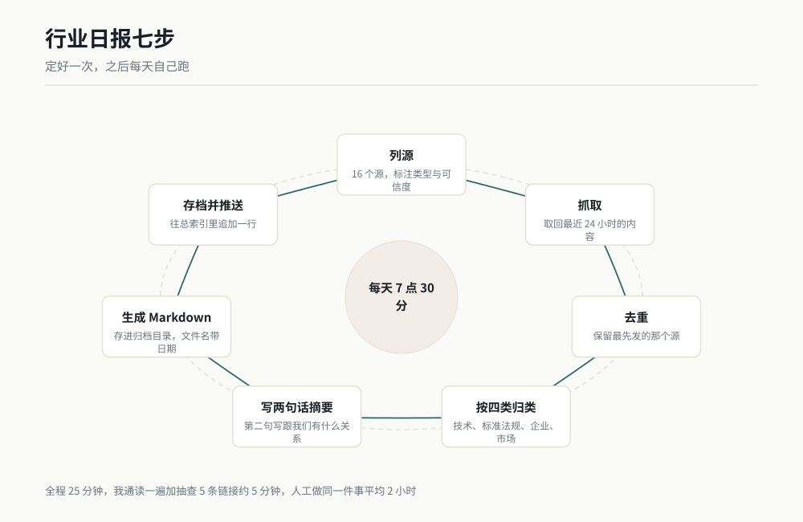
*图 8-7 日报生成流程（作者根据公开资料绘制）*

### 可复制提示词

步骤 2 到 4 的抓取与归类提示词：

```
现在生成 2026 年 3 月 12 日的行业日报。

订阅源清单在 D:\日报\订阅源.txt，每行一个，格式是：
源名称 | 网址 | 类型 | 可信度(高/中/低)

请执行：
1. 逐个访问这些源，取回最近 24 小时（3 月 11 日 0 点到 3 月 12 日 0 点）的内容。
2. 对每个源，输出一行状态：
   源名称 | 访问成功/失败 | 取回条数 | 失败原因
   访问失败的源不许静默跳过，必须列出来。
3. 把取回的条目做去重：标题高度相似或事件相同的合并为一条，
   保留发布最早的源，并在后面标注"另经 X 个源转载"。
4. 按下面四类归类，不属于任何一类的归入"其他"：
   - 技术进展
   - 标准与法规
   - 企业动态
   - 市场数据
5. 用下面的关键词清单做一次筛选，标出相关度：
   我关心的关键词：【粘贴你的 5 到 8 条】
   我不关心的内容类型：【粘贴你的排除清单：招聘、会议通知、纯观点等】
   相关度分三档：高（直接相关）/ 中（间接相关）/ 低（边缘）。
6. 输出统计：
   "共访问 X 个源，成功 Y 个，取回 Z 条，去重后 N 条，
   其中高相关 A 条、中相关 B 条、低相关 C 条。"
7. 暂时不要写摘要，先把这张归类好的表给我看。
```

步骤 5 到 7 的摘要与成稿提示词：

```
基于上面归类好的条目，生成今天的日报正文。

只保留"高相关"和"中相关"的条目，低相关的放进文末"其他动态"里，
每条一行只写标题和来源。

正文格式：

# 行业日报 2026-03-12

## 今日要点
（3 条，每条一句话，从高相关里挑最重要的）

## 技术进展
### 【条目标题】
第一句：发生了什么（客观事实，含数字或时间点）。
第二句：跟我们有什么关系（具体到对我们哪类工作有影响）。
来源：【源名称】｜链接：【URL】｜发布：【日期】｜相关度：【高/中】

（其余三类同样格式）

## 今日数据
（把正文里出现的数字单独列一张表：指标 | 数值 | 来源 | 日期）

## 其他动态
（低相关条目，标题 + 来源，一行一条）

## 今日缺口
（列出访问失败的源，以及你认为本期可能漏掉的方向）

写作规则，必须遵守：
1. 每条摘要两句话，不许超过两句话。
2. 第一句只写事实，不许出现"据悉""有消息称""业界认为"这类转述腔。
   原文里写了"计划""拟""预计"的，摘要里必须保留这些限定词，
   不许写成已经发生的事。
3. 第二句必须具体到"对我们哪类工作有影响"，
   写"值得关注""有参考意义"这种空话的，退回重写。
4. 每条必须有链接。没有链接的条目不许进正文。
5. 不许出现空话和套话。写"引领""全新升级""值得期待"的，退回重写。
6. 数字单独进"今日数据"表，正文里出现的数字不许与表里的不一致。
7. 全文写完自查一遍，输出：
   "正文 X 条，其中两句话的 Y 条，带链接的 Z 条，数字 N 个。"
   三个数字必须对得上。

最后：
- 正文存到 D:\日报\2026\03\2026-03-12.md
- 往 D:\日报\总索引.md 追加一行：
  日期 | 条目数 | 今日要点第一条 | 文件路径
```

### 过程与判断点

这套流程我跑了 200 多期，几个数字稳得很。

一是**源的成功率**。16 个源里，平均每天有 1 到 2 个访问失败。失败原因八成是网站改版或临时抽风。我的规矩是：连续三天失败的源，我人工去看一眼，是源死了就换掉。这个"今日缺口"小节是我特意加的，因为日报最怕的不是内容少，是你不知道漏了什么。如果它默默跳过一个失败的源，你以为今天行业里没新闻，实际上是你没看见。

二是**去重比例**。平均取回 60 到 80 条，去重后剩 25 到 35 条。也就是说，一大半是同一件事的互相转载。人工做的时候，我常常把转载当成两件事，还以为今天信息量很大。

三是**相关度分布**。高相关平均 4 到 6 条，中相关 8 到 12 条，剩下都是低相关。我只看前两类，一天真正要看的也就 12 到 18 条。

判断成不成的硬指标是**数字对不对得上**。我在提示词里写了三个自查数字：正文条数、两句话的条数、带链接的条数。这三个必须一致。加这条是因为它经常把重要条目写成四句话，一写长，读者就不看了。

"今日要点"只放三条，是我试过五条、十条之后定下来的。放十条的那几期，后台数据显示点开率反而更低，因为读者要自己挑重点，等于我把活又推回给了他。三条的好处是：读者不用挑，你替他挑了，你就得对自己的判断负责。

摘要失真这一条我抓得最狠。有一次它把某家企业"计划明年投产"写成了"投产"，我差点在群里发错。所以规则里写死了：原文有"计划""拟""预计"的，摘要必须保留限定词。这条规矩救过我三次。

全程 25 分钟，其中它跑 20 分钟，我花 5 分钟通读一遍、点开 5 条链接核对。人工做同一件事，我记录过，平均 2 小时。

### 翻车清单

**1. 源抓不全，它还装作抓全了。** 后果是你以为今天没新闻。补救动作：强制输出每个源的成功失败状态，并要求文末有"今日缺口"小节，失败的源必须写明。

**2. 标题党混进正文。** 有些源专发耸动标题，内容空洞。补救动作：在提示词里给源的"可信度"分档，低可信度源的条目必须在来源后面标注，我人工决定要不要放。

**3. 摘要把"计划"写成"已发生"。** 这是最严重的一条，会让你在群里发错信息。补救动作：规则里写死保留限定词，并且每天随机点开 5 条链接，对照原文看摘要有没有夸大。

### 验收标准与变体

**验收标准**：每天通读一遍，随机点开 5 条链接对照原文，摘要不能夸大、不能漏限定词。三个自查数字（条数、两句话条数、带链接条数）必须一致。连续三天"今日缺口"里出现同一个源，就人工去处理这个源。

**变体一：竞品动态监控。** 订阅源换成竞品的官网、招聘页、专利公开页。招聘页特别有用，招什么岗位往往暴露他们在做什么。

**变体二：标准更新监控。** 只盯标准发布机构的更新页，一旦有你关注的标准号更新，立刻提醒。

**变体四：客户舆情。** 订阅客户所在行业的媒体，出现客户公司名的条目单独标红，每周汇总。

**变体五：内部日报。** 订阅源换成内部的文档库、项目看板、测试系统，每天汇总"哪些项目动了、哪些指标变了"。

> 老兵说：日报做了 200 多期，我最大的收获不是省时间，是我终于敢说"这个方向最近三个月没动静"。以前凭印象判断行业动向，现在有 200 多个文件可以翻，一搜就有。判断力是从可检索的记录里长出来的。记性给不了你这个。

---

## 小白词典

**个人知识库**：一堆文件加一张目录加一个能提问的入口。文件夹只能靠你记路，库能靠问。类比：文件夹是抽屉，库是带索引卡的档案柜。

**索引**：给每个文件做一张身份证卡片。类比：图书馆的卡片柜，先查卡片再找书。

**检索**：先从卡片里找出相关的几张，再回去翻原文。类比：开卷考试，先翻书再答题，不是闭卷硬背。

**出处引用**：每条答案后面标上来自哪个文件第几页。没有出处的答案不算数。类比：论文的参考文献。

**Markdown**：一种纯文本写法，用 `#` 表示标题、`-` 表示列表。类比：不带格式的记事本，但谁都能打开。

**条款号**：标准里每一条的编号，比如 5.3.2。类比：法律条文的第几条第几款。

**强制与推荐**：英文标准里 shall 是必须做，should 是建议做。类比：交通法规里的"禁止"和"建议"。

**原子任务**：不能再拆的最小动作。类比：菜谱里的一步，不是"做一道菜"。

**依赖关系**：A 做完了才能做 B。类比：先和面才能擀皮。

**工作痕迹**：你在电脑上留下的客观记录，文件修改时间、邮件、日历。类比：手机的步数记录，不靠你回忆走了多少。

**RSS**：网站按固定格式吐出更新内容的订阅方式。类比：报社给你送报上门，不用你每天去报摊。

**去重**：同一条消息被多个源转载，只留一条。类比：五个人跟你说了同一件事，你只记一次。

**对照表**：一张 Excel，两列，原路径和新路径。类比：搬家清单，先写好再搬，不边搬边想。

**干跑**：先只输出"我打算怎么改"，不真动手。类比：先在纸上排一遍版，再往墙上钉。

**定时执行**：让流程每天固定时间自己跑一遍。类比：定了闹钟的咖啡机，到点自己煮。

## 你的岗位怎么用

**设计工程师**：先做场景 08。你手边一定有几份客户规范或行业标准，拆成检查清单之后，评审的时候不用翻原文。再做场景 07，把历次评审意见建成库，新方案出来先问一遍库，能挡掉一半重复问题。

**试验工程师**：先做场景 11。台架数据文件命名混乱是通病，归档做完之后，场景 10 的周报可以直接吃文件修改时间。场景 12 换成订阅试验方法和设备厂商的更新页，也有用。

**质量工程师**：场景 08 就是给你写的。检查清单是你的主武器，拆完之后把它变成审核表。场景 07 建一个不合格案例库，新问题来了先问库里有没有类似的。

**采购 / 供应商管理**：场景 12 改成供应商动态监控，订阅供应商官网、招标公告、行业媒体，出现供应商名字就标红。场景 07 建供应商资料库，问"这家上次报价多少"比翻邮件快十倍。

**项目经理**：场景 09 和场景 10 是你的杠杆。待办从会议纪要自动抽，周报从痕迹自动生成，每周省下来的时间拿去盯风险。场景 07 建一个项目历史库，接手新项目先问"以前类似项目踩过什么坑"。

**行政 / 人事 / 完全不碰技术的岗位**：从场景 11 开始。几百个乱文件一次性归位，见效最快、最没有技术门槛。再做场景 09，把散在微信和便签里的事理成一张能执行的清单。

## 本章交付物

**一张个人资料家底表。** 做完它，你第一次知道自己到底有多少文件、散在几个地方、哪些能读哪些不能读。

怎么做：

1. 在 D 盘新建 `D:\整理`，把你最乱的那个文件夹复制进去（只复制，不动原件）。
2. 用场景 07 步骤 2 的盘点提示词，让它扫一遍。
3. 把三个数字抄下来：文件总数、读不了的文件数、名字可疑的文件数。
4. 看一眼"名字可疑"那一栏。如果里面带"最终""备份""副本"的文件超过总数的一成，说明你的命名已经失控，先做场景 11。
5. 如果"读不了"的文件超过两成（多数是扫描件），先想办法补文字层，否则建库的效果会打折。
6. 把这张表打印出来贴在显示器边。三个月后再跑一次，对比两组数字。

我自己的数字是：3182 个文件，231 个读不了，名字可疑 407 个。三个月后再跑，库里 3400 个文件，读不了 88 个，名字可疑 9 个。

## 本章金句

> 一个取不出来的结论，跟没做过没有区别。

> 文件夹只能靠你记路，知识库能靠问。

> AI 丢东西，从来不会告诉你它丢了。进多少出多少，对不上就问。

> 周报里的数字错了，比周报写得差严重得多。

> 靠回忆写出来的周报，会系统性地漏掉两类事：不好看的事，和没做完的事。

> 改文件名的第一步骤是备份，第二步骤是确认备份能打开。

> 日报最怕的不是内容少，是你不知道漏了什么。

---

*（下一章：需求与项目定义。资料理顺之后，下一个问题是怎么把一句模糊的客户需求变成能开工、能验收的东西。）*
