# 第 9 章 需求与项目定义：把客户那段话翻译成能开工的任务

> 一份 40 页的客户需求文件，真正决定项目成败的条款通常不超过 12 条，剩下的 28 页是给法务和将来吵架用的。

## 同一份文件，三个人读出三种理解

2025 年秋天，我们接到某欧系平台的一个微电机减速机构询价包。客户发来的技术需求文件 47 页，附件里还有一份 12 行的工况参数表。

周三下午两点，三个人坐在会议室里各自读这份文件，读了 90 分钟。散会的时候，我们三个人脑子里的项目是三个不同的项目。

项目经理老张关心的是交付：样件 30 套，2026 年 6 月交第一批，量产节点在 2027 年 3 月。他记了满满一页日期。

试验工程师小陈关心的是试验：噪音小于 40 dBA，测距 500 mm，耐久性按客户企标做。他记了七条试验项。

我关心的是结构和空间：中心距 34 到 35 mm，外径小于 60 mm，输出扭矩 10 Nm。我在纸上画了个草图。

散会前，老张问了一句："这活能接吗？"

我说能，小陈说噪音没把握，老张说时间够。

第二天上午，我把那 12 行工况参数单独拎出来，放在一起看：输入 7200 rpm，输出 72 rpm，减速比 100 比 1，输出扭矩 10 Nm，外径小于 60 mm，材料是钢蜗杆配 POM 蜗轮。

100 比 1 的单级蜗轮蜗杆，蜗轮要做到 100 齿，按模数 0.7 算外径 71.4 mm，超过 60 mm 的限制将近 11 mm。这一条和那一条，隔着 8 页纸，谁也没把它们摆在一起。

还有一条：10 Nm 输出扭矩下，POM 输出齿轮的弯曲应力算出来 97 MPa，而 POM 在 10 万次循环下的许用值只有 40 到 50 MPa。差了接近一倍。

我把这两条发到群里，90 分钟的会白开了。

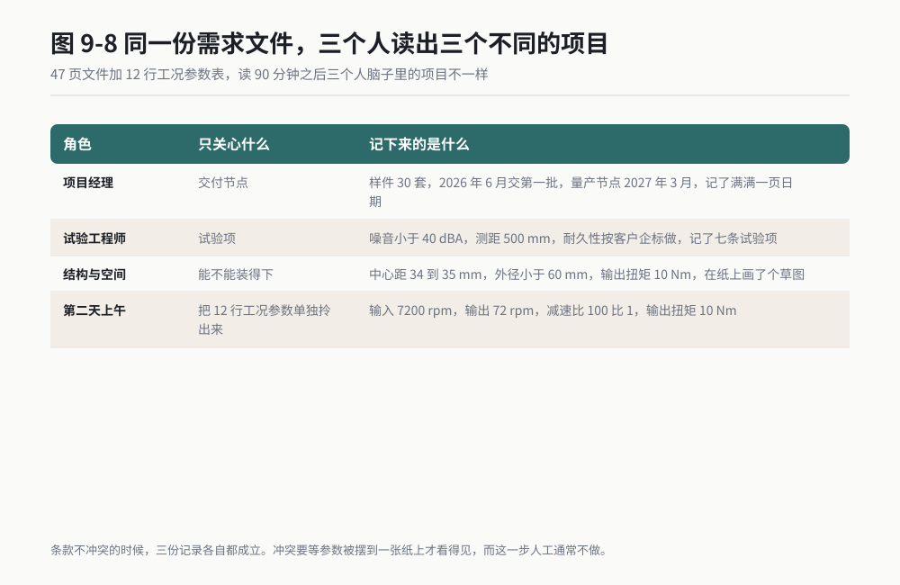

*作者根据公开资料绘制*

后来我用 AI 重做了一遍这件事：把 47 页文件丢进去，让它把散落在各章节的参数全部抽出来，摆进一张表，再做交叉检查。8 分钟，它给我列出了 12 条冲突和待确认项，上面那两条都在里面，它还多找了四条我们三个人都漏掉的。

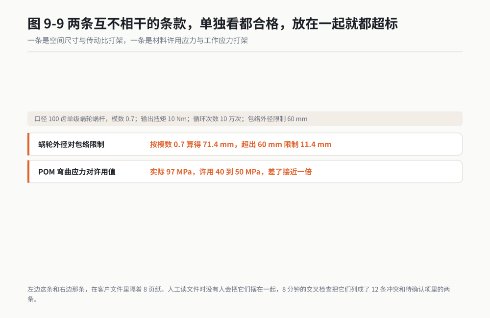

*作者根据公开资料绘制*

从那天起，我不再自己从头读需求文件。我让 AI 先把条款摊平，人只做判断。

摊平这件事 AI 做得比人好，因为它不会因为"这页看着像法务条款"就跳过去。判断这件事 AI 做不了，因为它不知道 71.4 mm 那个数字意味着模具要重开。

## 本章六个场景速览

| 场景 | 场景名 | 人工耗时 | AI 耗时 | 可信度 |
|---|---|---|---|---|
| 13 | 客户需求拆解：一份 SOR 变成内部任务清单 | 3 到 4 小时 | 8 到 15 分钟 | ★★ 跑通 |
| 14 | 技术标准提取：从标准里摘出跟你产品有关的条款 | 半天 | 20 到 30 分钟 | ★ 调研 |
| 15 | 项目计划生成：里程碑、依赖关系、关键节点 | 1 个工作日 | 25 分钟 | ★★ 跑通 |
| 16 | 风险清单辅助：把经验变成结构化的失效模式表 | 2 天（含评审） | 40 分钟 | ★★ 跑通 |
| 17 | 技术方案对比：两套方案摆在一起比，比什么先定好 | 1.5 个工作日 | 30 分钟 | ★★★ 实测 |
| 18 | 行动项跟踪：会议决定变成有人有日期的任务 | 40 分钟每次 | 3 分钟 | ★★ 跑通 |

可信度的含义在第一章讲过：★★★ 是我本机完整跑过、留了数据和截图；★★ 是流程跑通过；★ 来自公开资料调研，没在我自己的项目上完整验证过。场景 14 我标 ★，因为标准条款这件事，我做过的版本是拿公开标准做的练习，没有在正式交付项目上用它出过最终结论。

下面六个场景按项目推进顺序排，你可以整章顺着抄，也可以只挑一个场景先试。

---

## 场景 13 客户需求拆解：一份 SOR 变成内部任务清单 ★★

### 一句话背景

客户发来的 SOR 通常 40 到 60 页，条款散落在十几个章节里，同一个参数在不同章节口径还不一致。人工拆成一份能分派下去的内部任务清单，我自己的记录是 3 到 4 小时，而且是那种做完了不敢保证没漏项的 3 到 4 小时。

### 名词小词典

**SOR（Statement of Requirements，需求说明书）**：客户写给供应商的"我要什么"文件。它不是技术方案，是将来验收的依据，也是吵架时的凭据。

**工况参数**：产品干活时的外部条件，比如扭矩、转速、温度范围、电压范围、循环次数。它们决定了设计的边界。

**可验证性**：这条需求能不能用测量、试验、计算或查证来判定合不合格。写不出判定方法的条目，等于没写。

**接口边界**：你的零件跟别人零件交界的地方，比如安装法兰尺寸、接插件型号、通信协议、线束长度。

**CSR（Customer Specific Requirements，客户特殊要求）**：客户在通用标准之外额外加的条款。它最容易被漏，因为它常常写在附件的最后一页。

### 开工前准备

1. SOR 原件，PDF 或 Word 都行。不要用扫描件，扫描件它会把 0 读成 8，把小数点读丢。
2. 把附件也一起备齐。客户经常把关键参数表放在附件而不是正文里。
3. 一份内部岗位清单：设计、试验、质量、采购、项目、工艺。让它只能从这六个里挑，它就不会造出"市场部"这种岗位。
4. 你要有一份同类项目的旧任务清单做参照，用来比对条目数量。
5. 模式选 Plan。先让它出方案，你看过结构再让它动手写文件。

### 操作步骤

**第一步**：把 SOR 拖进对话窗，先不给任务，只让它做一件事：报文件结构。

**第二步**：看它报出来的章节数和页数对不对。页数对不上，说明它没读全，先解决这个再往下走。

**第三步**：把下面的提示词整段发过去。

**第四步**：它返回三张表。先看第二张"冲突与待确认表"，这张表价值最高。

**第五步**：抽查条目表里的 5 条原文摘录，回到 PDF 里搜索，确认逐字对得上。

**第六步**：确认没问题，让它另存 Excel，导入你们的项目管理系统分派。

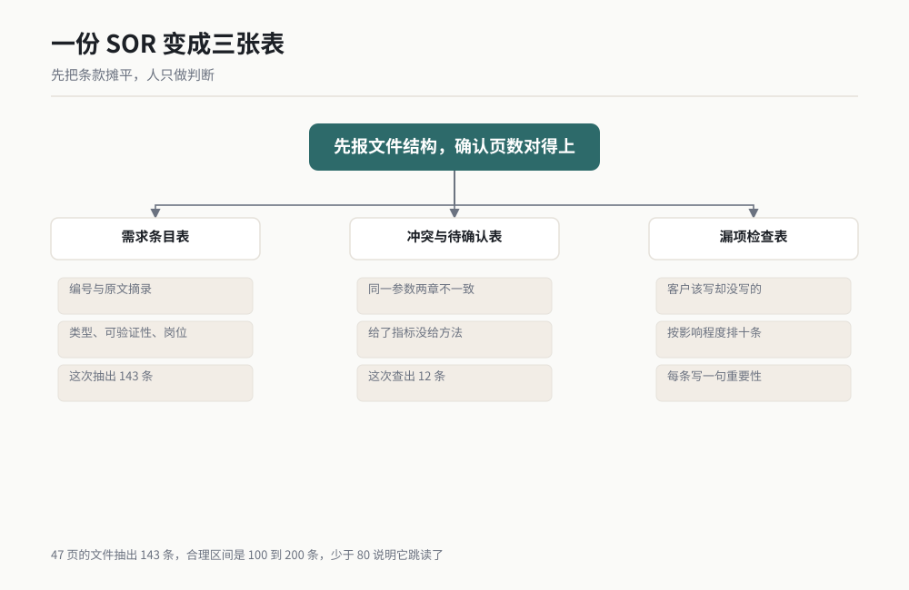

图 9-1 作者根据公开资料绘制

### 可复制提示词

```
你现在是我项目组的助理工程师。我们拿到了一份客户发来的需求说明书（SOR），需要把它拆成内部能分派的任务清单。

文件在对话里，请先完整读一遍，不要只读目录，不要只读前 10 页。

读完后依次做下面三件事。

第一步：给我一份"需求条目表"，每一行包含六列：
| 条目编号 | 原文摘录 | 所在章节 | 需求类型 | 可验证性 | 建议承接岗位 |

填写规则：
- 条目编号：从 R-001 开始递增
- 原文摘录：照抄原文，一个字都不要改写，不要翻译，不要概括
- 所在章节：写章节号，如果你判断不出章节号就写页码
- 需求类型：只能填这八类之一：性能 / 尺寸 / 材料 / 试验 / 认证 / 接口 / 交付物 / 商务
- 可验证性：只能填这四个之一：可测 / 可算 / 可查 / 不可验证。判定方法是：能用台架或量具测出来的填可测，能用公式或仿真算出来的填可算，能用文件或证书核对的填可查，想不出判定方法的填不可验证
- 建议承接岗位：只能从这六个里选：设计 / 试验 / 质量 / 采购 / 项目 / 工艺

第二步：单独给我一张"冲突与待确认表"，包含四列：
| 编号 | 冲突描述 | 涉及条目编号 | 建议动作 |

只要发现下面任意一种情况，就写进这张表：
- 同一个参数在两个章节出现，数值不一致或单位不一致
- 一条需求和另一条需求在物理上互相冲突，比如空间尺寸和传动比冲突、温度范围和材料耐温冲突
- 给了指标但没给试验方法或试验条件
- 写了"按相关标准执行"但没指明标准号和版本
- 写了"参见附件"但附件里找不到对应内容

第三步：给我一张"漏项检查表"，列出你认为客户应该写但没写的条目，按影响程度从高到低排序，最多 10 条，每条写一句为什么重要。

输出要求：
- 三张表都用 Markdown 表格输出，不要用段落描述
- 不要总结，不要评价这份 SOR 写得好不好，不要夸奖客户
- 任何一条原文摘录，如果你在文件里找不到依据，就不要写进表里
- 三张表全部输出完后，另存为桌面上的 sor_tasklist.xlsx，三个工作表分别命名为 需求条目、冲突待确认、漏项检查
```

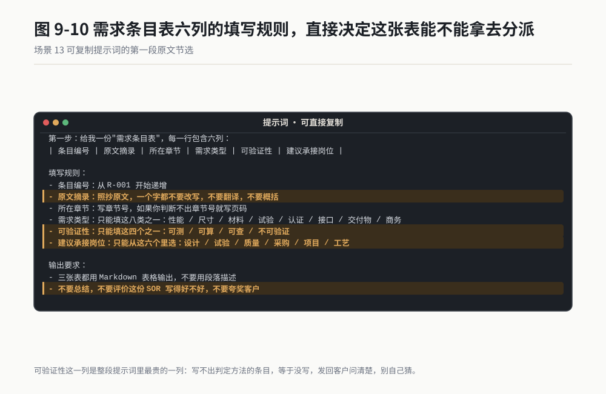

*作者根据公开资料绘制*

### 过程与判断点

它会先花一两分钟读文件。47 页的 PDF，我这次等了大约 90 秒。

然后它会逐张吐表。第一张条目表最长，我这次拿到 143 条。这个数字要跟你的经验对一下：一份 40 到 60 页的 SOR，条目数通常在 100 到 200 之间。少于 80 条说明它跳读了，多于 300 条说明它把一句话拆成了好几条。

**判断点一：条目数量在合理区间。** 差太多就得回头查它是不是只读了部分章节。

**判断点二：抽查 5 条原文摘录能逐字搜到。** 我做这一步从来没省过。抽的 5 条要分散在文件的前、中、后三段，不要都抽前面的。这次我抽的 5 条里，有一条它把"−40 °C"抄成了"40 °C"，负号丢了。这一条如果流进设计输入，低温试验全做错。

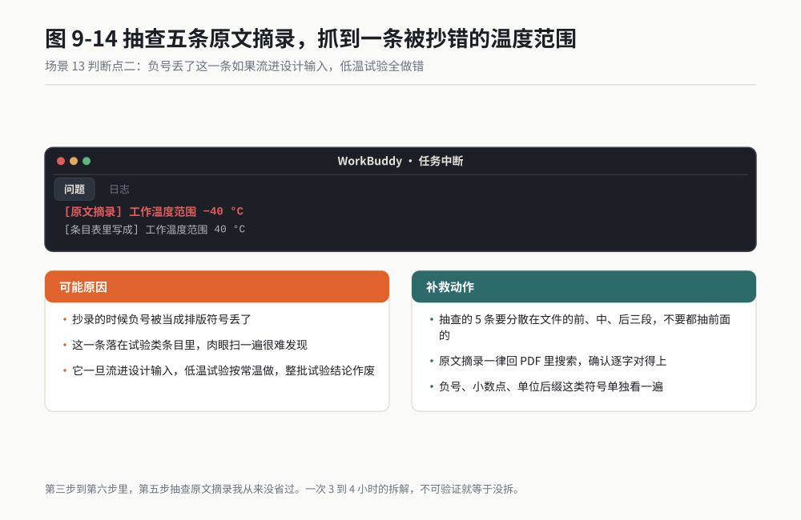

*作者根据公开资料绘制*

**判断点三：冲突表不能是空的。** 一份真实 SOR，交叉检查之后至少能找出 3 到 8 条冲突。它如果返回"未发现冲突"，那大概率是它没做交叉检查，直接把提示词的第三步跳过了。这时你要单独追一句："把第 3 章的尺寸条款和第 7 章的性能条款逐条交叉比对，再列一次冲突。"

**判断点四：漏项表里至少有一条是你自己想到的。** 漏项是最考验它的一张表。它如果列出来的 10 条全是泛泛而谈的"建议明确包装要求"这种，说明它没理解产品。补救办法是把产品描述再喂一次，补一句"我们做的是微电机减速机构，塑料蜗轮，请按这个产品类型重新列漏项"。

产物长什么样：桌面上一个 Excel，三个工作表。条目表可以直接按"建议承接岗位"做筛选，一次筛出所有设计相关的条目，复制进设计输入清单。

### 翻车清单

**翻车一：它把"建议"当成"要求"写进条目表。**
SOR 里常有"建议采用某某材料"这类措辞，那是参考不是强制。它会一律当成要求抄进去，导致你的任务清单凭空多出一堆硬约束。
补救动作：在提示词里加一句"原文含建议、推荐、可选、可选配等措辞的条目，在条目编号后面加 * 号标记，并在需求类型里额外标注'非强制'"。

**翻车二：长条目被它截断。**
有些条款一整页长，它只抄了前半句，后半句的限制条件丢了。
补救动作：输出完成后，单独问一句"条目表里有哪几条原文摘录是截断的？把这几条的完整原文重新抄一遍。"它会自己认出来一部分。剩下的靠你抽查。

**翻车三：它给的"可验证性"判断过于乐观。**
它倾向于把什么都说成可测。有一条需求写"运行平顺无异常"，它判定为可测，实际上没人定义过什么叫平顺。
补救动作：把"不可验证"这一列单独筛出来看一遍。如果整张表一条"不可验证"都没有，那它判得太松，你要自己过一遍，把写不出判定方法的条目手动改过来。这些条目是要发回客户问清楚的。

### 验收标准与变体

**验收标准**（三件事全做完才算过）：

1. 从条目表随机抽 8 条，回 PDF 逐字核对。8 条里错 1 条以上，整表重做。
2. 把"不可验证"和"冲突待确认"两类条目合并成一张客户澄清清单，当天发给客户。能当天发，说明你真的看懂了。
3. 条目表导入项目管理系统后，每一条都有 owner 和预计完成日期。有条目分不下去，说明这条需求本身不清楚，回到第 2 步。

**变体 A：没有正式 SOR 的小项目。**
很多小项目客户只发了一封邮件，或者给了一份会议纪要。把提示词里的"需求说明书（SOR）"改成"客户邮件往来记录"，把所有往来邮件合并成一个 PDF 丢进去，其余不变。邮件里前后矛盾的地方特别多，冲突表会很好看。

**变体 B：反向检查，你给供应商写 SOR 时用。**
把你写好的 SOR 发给它，提示词改成："假设你是接到这份 SOR 的供应商，列出你无法报价、无法设计、无法验证的条目，并说明缺什么信息。"这是我在写供应商技术协议前的固定动作，能提前堵掉一半来回。

**变体 C：跨版本比对。**
客户改版 SOR 是常态。把旧版和新版都丢进去，让它只输出差异表：新增、删除、数值变更三类。人工比对两版 50 页文件，我从来没在两小时内做完过。

> 老兵说：我给条目表加"可验证性"这一列，是因为吃过一次亏。有个项目客户写了"噪音不得有异音"，我们做了三轮整改都没通过，最后客户派人来听，说我们要听的是那种"咔哒"声。那一句话里没有频率、没有测距、没有工况，我们猜了三个月。现在只要看到"不可验证"的条目，我当天就发邮件问客户，绝不自己猜。

---

## 场景 14 技术标准提取：从标准里摘出跟你产品有关的条款 ★

### 一句话背景

一份强度计算标准正文加附录上百页，你真正关心的可能只是其中关于塑料齿轮的那几段。人工翻半天，而且最容易漏的是规范性附录里的表格，那部分往往才是硬要求。

### 名词小词典

**标准号**：标准的身份证，比如 ISO 6336 是齿轮承载能力计算，ISO 1328 是圆柱齿轮精度体系，ISO 26262 是道路车辆功能安全。带年份的版本号很重要，同一份标准 2006 版和 2019 版的公式可能不一样。

**Scope（适用范围）**：标准第一章，说明它管什么、不管什么。先看这一章，能省掉后面 90% 的无效阅读。

**规范性附录与资料性附录**：规范性附录是必须执行的，资料性附录只是参考，常见的标注是 normative 和 informative。这两类混在一起，是标准误读的主要来源。

**精度等级**：ISO 1328 里用 Grade 加数字表示，数字越小越精密。Grade 6 比 Grade 8 难做，价格也贵。

**偏差符号**：标准里用来表示具体公差项目的代号，比如 ffα 表示齿廓形状偏差，Fp 表示齿距累积总偏差。看不懂符号，条款就读不明白。

### 开工前准备

1. 标准 PDF。必须是正版来源，不要用来源不明的下载件，页码和条款号可能对不上。
2. 一段产品描述，100 到 300 字。要写清产品类型、材料、精度要求、工作温度范围、预计产量。写得越具体，它筛得越准。
3. 确认标准的现行版本年份。不知道就去标准发行机构的官网查，或者问你们公司的标准化工程师。
4. 模式选 Ask。这一步不写文件，只对话。核对完条款号再让它出表。

### 操作步骤

**第一步**：把标准 PDF 拖进去，先问一句："这份标准的编号、版本年份、发布日期分别是什么？写在封面上。"它答对了才继续。

**第二步**：让它读 Scope 章，判断你的产品在不在范围内。不在范围内直接停，别浪费时间。

**第三步**：把下面的提示词整段发过去。

**第四步**：拿到适用条款表之后，逐条回原文核。这一步不能省，一个字都不能省。

**第五步**：核完让它另存 Excel，作为设计输入的附件归档。


图 9-2 作者根据公开资料绘制

### 可复制提示词

```
你是我们组的标准专员。我给你一份标准文件和一段产品描述，请帮我把跟这个产品有关的条款摘出来。

产品描述：
（把你的产品描述粘贴在这里）

第一步：先读标准的第一章 Scope，用三句话回答：
1. 这份标准管什么
2. 这份标准明确不管什么
3. 我们的产品落在不落在范围内

如果不在范围内，直接停止后面所有步骤，只告诉我原因和它不管什么。

第二步：给我一张"适用条款表"：
| 条款号 | 条款标题 | 原文摘录 | 适用性 | 我们对应要做什么 |

填写规则：
- 条款号：写到最细一级，例如 5.3.2、Table 4、Annex B.2
- 原文摘录：照抄原文，不要翻译，不要改写，不要概括
- 适用性：只能填 适用 / 不适用 / 需确认。"需确认"必须同时写出要确认什么
- 我们对应要做什么：一句话，写具体动作，例如"按此表选 Grade 6 并写入图纸技术要求"

第三步：给我一张"看起来相关但判定为不适用"的表：
| 条款号 | 条款标题 | 判定不适用的理由 |

第四步：单独检查标准里有没有规范性附录（normative annex），有就单独列出来，写明附录编号和它约束的内容。同时标明标准里哪些附录是资料性的（informative），不要混进适用条款表。

第五步：列出这份标准里引用的其他标准号，以及你判断哪些我们也需要看。

硬性要求：
- 每一条必须有精确条款号，不许出现"参见第 5 章"这种模糊引用
- 原文摘录照抄，不许改写
- 如果你对某个条款号不确定，就写"条款号待核"，不许猜
- 不许把资料性附录的内容写进适用条款表
- 不许把其他标准的内容当成这份标准的内容
- 全部输出完后另存为桌面的 standard_extract.xlsx，工作表命名为 适用条款、不适用条款、规范性附录、引用标准
```

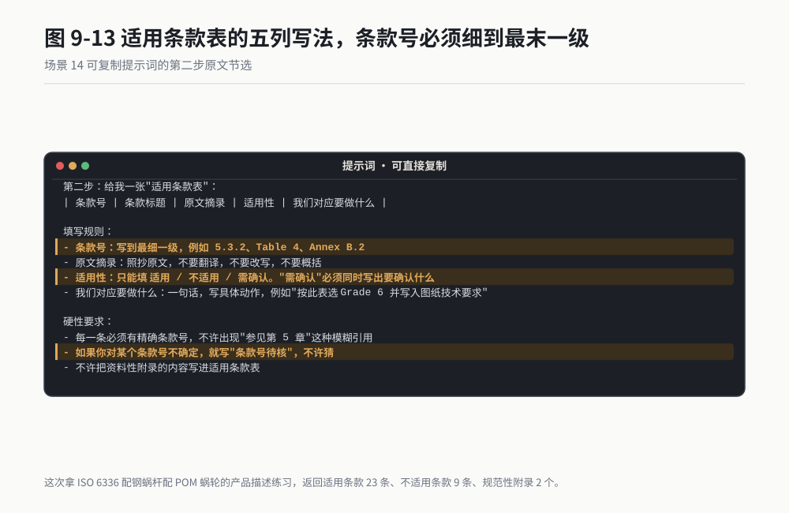

*作者根据公开资料绘制*

### 过程与判断点

我拿 ISO 6336 做过一次练习，配的是前面那个钢蜗杆配 POM 蜗轮的产品描述。它返回的适用条款表 23 条，不适用条款表 9 条，规范性附录 2 个。

**判断点一：条款号必须能在原文里搜到。**
这是这个场景唯一硬性的判断点。我逐条搜了那 23 条，20 条能搜到，3 条搜不到。搜不到的 3 条里，有 2 条是它把章节号记错了一位，还有 1 条是它自己编的。1 条编造，就足以让整份表的可信度归零，所以这一步必须全查，不能抽查。

**判断点二：适用条款的数量。**
一份上百页的标准，针对一个具体产品，适用条款通常在 10 到 40 条之间。它如果给你 80 条，说明它没筛选，只是把目录抄了一遍。这时要追一句："只保留那些会改变我们设计决策或图纸标注的条款，纯定义和术语条款删掉。"

**判断点三：它有没有分清 normative 和 informative。**
我在提示词里专门设了第四步，就是因为它默认会把两类混在一起。你拿到结果后自己也要看一眼附录标题下面有没有 normative 字样。

**判断点四：不适用条款表不能太短。**
一份标准里看起来相关但实际不适用的条款，通常有 5 到 15 条。它如果只给你 1 条，说明它偷懒了。这张表的价值在于，将来有人质疑"这条你怎么没做"，你能立刻拿出判定理由。

**判断点五：符号表有没有一起出来。**
标准是符号驱动的，同一份 ISO 1328 里 ffα、Fp、Fr 这些代号混在一起，把一个代号看错，公差就抄错一档。我会在最后追加一句："把这份标准里出现的所有偏差符号单独列一张表，写符号、中文名称、定义、出处条款号。"这张符号表单独存一份，后面看图纸和检验报告的时候随时能查，比每次回标准里翻快得多。

有一次我把这份符号表发给了供应商，对方工艺工程师回了一句"这个我们内部培训讲过，但没人整理成表"。一张表能跨公司用，是因为标准本身是公共的，只是没人愿意花半天去抄。

### 翻车清单

**翻车一：它编条款号。**
这是标准类任务最高频的错误。它有的时候会把"5.3"写成"5.3.1"，有的时候直接编一个不存在的 Table 编号。
补救动作：全表核对，不要抽查。我自己的做法是让它把条款号单独列一列，我复制进 PDF 阅读器批量搜索，搜不到的当条删除。宁可少几条，不能留假的。

**翻车二：版本错。**
有些标准文件 PDF 里带着多个版本的影子，或者你手上这份是作废的旧版。它会照着旧版给你结论。
补救动作：第一步就让它报版本号，你跟官网核对。版本号不对，全部推翻重来。我见过一次，拿着 2006 版的公式算出来的安全系数，跟 2019 版差了 15%，够让一个合格的设计变成不合格。

**翻车三：它把标准里的示例当成要求。**
标准正文里经常有算例，用的是示例参数。它会把示例里的数值当成规定值抄进适用条款表。
补救动作：看到条款里出现具体数字，回原文看一眼上下文是不是"Example"或"示例"。是示例就删掉。

### 验收标准与变体

**验收标准**：

1. 适用条款表的每一条，条款号都能在原文搜到，且原文摘录逐字一致。这是硬标准，一条不满足就整表作废。
2. 适用条款表里每一条"我们对应要做什么"都写成了具体动作，能直接抄进设计任务书或图纸技术要求。写不出动作的条款，说明它没理解，删掉或重写。
3. 让组里第二个人用同一份提示词独立跑一遍，两份表的交集应该超过 70%。交集低于一半，说明这个任务本身定义不清，先把产品描述写具体。

**变体 A：新旧版本差异比对。**
标准换版是常事。把旧版和新版 PDF 都丢进去，提示词改成："逐条比对两份标准，只输出差异：新增条款、删除条款、公式变更、数值变更四类，每类给条款号和变更内容。"人工比对两版上百页标准，我做一次花了整整两天。

**变体 B：客户 CSR 与内部企标对照。**
把客户特殊要求和你们内部企标都丢进去，让它输出对照表：客户更严的、我们更严的、互相冲突的三类。这张表可以直接拿去跟客户谈，是谈判前的准备材料。

**变体 C：把标准条款转成检验项目。**
拿到适用条款表之后追加一句："把适用条款表里涉及公差和性能指标的条款，转成一份进货检验项目清单，包含检验项目、量具、抽样方案三列。"这个功能我用在给供应商写检验规范上。

> 老兵说：这个场景我标了 ★，是我六个场景里唯一没在正式交付项目上用它出最终结论的。原因很实在：条款号编错这件事，出错率我实测下来在 10% 左右，工程上不能接受，必须全查。全查花的时间比人工翻标准少不了太多，所以我至今只在学习和准备阶段用它。你要用，就一定要全查，别抽查。

---

## 场景 15 项目计划生成：里程碑、依赖关系、关键节点 ★★

### 一句话背景

项目经理问我要节点，我拍脑袋报日期，三次里两次不准。工期我算得没错，漏掉的是长周期件：模具、认证、样件物料。这些东西的等待时间不在我的脑子里，在采购的脑子里。

### 名词小词典

**里程碑**：项目里必须交付的节点，比如设计冻结、首件下线、DV 完成。里程碑不等同于任务，它是任务的成果。

**WBS（Work Breakdown Structure，工作分解结构）**：把项目一层层拆成能分派的小任务。拆到什么程度算够：一个任务能在两周内干完，并且只有一个负责人。

**依赖关系**：A 干完 B 才能开始，这叫 B 依赖 A。写计划最容易错的就是这里，把本来能并行的事写成了串行。

**关键路径**：决定总工期的最长那条依赖链。关键路径上耽误一天，整个项目就晚一天。

**DV 与 PV**：DV 是设计验证，验证设计是否满足要求；PV 是生产验证，验证量产工装和工艺能不能稳定做出合格件。

**SOP（Start of Production，量产启动）**：项目终点，开始批量生产供货。

### 开工前准备

1. 场景 13 出来的任务清单。计划是从任务来的，没有任务清单直接让它排计划，它编出来的东西没法用。
2. 客户给的节点：样件交付日期、DV 窗口、SOP 日期。硬约束必须先给。
3. 团队人数和每个人能投入的比例。不给这个，它排出来的计划是理想资源下的计划。
4. 一份长周期件清单：开模、认证、长交期物料、台架排期。这份清单是你自己补的，AI 想不出来你们公司模具要等多久。
5. 模式选 Plan。排计划一定要先看到它的思路，再让它写文件。

### 操作步骤

**第一步**：把任务清单和上面四份信息一起丢进对话窗，让它复述一遍硬约束。它复述对了才继续。

**第二步**：发下面的提示词。

**第三步**：拿到依赖关系表，重点看"并行能不能并行"这一列。它默认倾向于串行，你要手动纠正。

**第四步**：让它做倒排校验，从 SOP 日期往回推，看推出来的开始日期是不是早于今天。早于今天，说明计划不可行。

**第五步**：导出甘特图数据源，用 Excel 或你们的项目工具画出来。

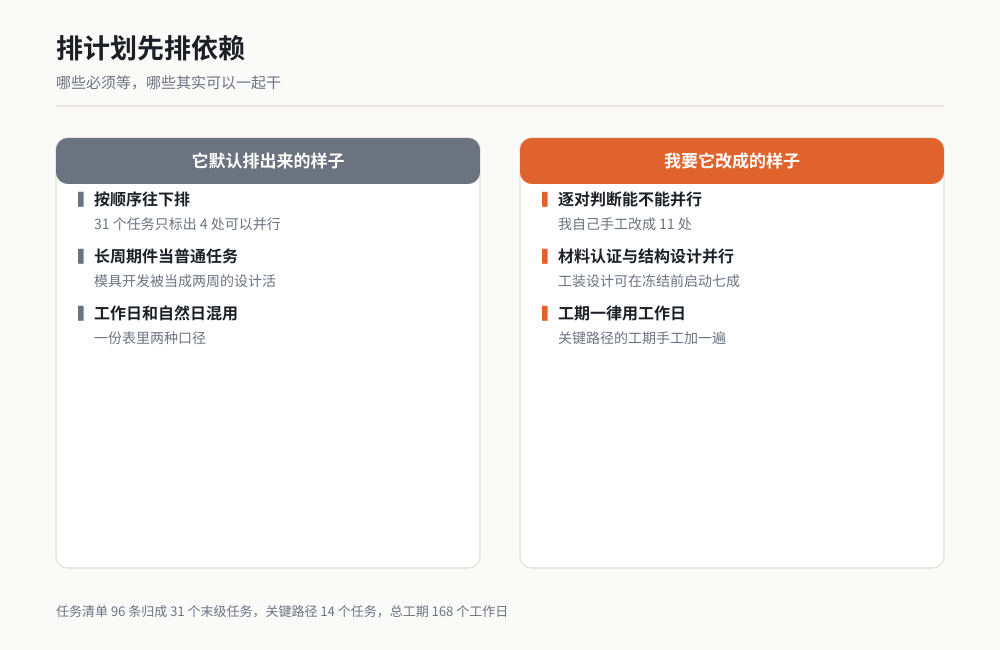

图 9-3 作者根据公开资料绘制

### 可复制提示词

```
你是我们项目组的计划工程师。我要给一个新项目排计划，下面是全部输入。

输入一，任务清单（来自需求拆解）：
（粘贴场景 13 输出的需求条目表，或者粘贴你们自己的任务清单）

输入二，客户硬性节点：
- 样件交付：（日期）
- DV 窗口：（起止日期）
- PV 窗口：（起止日期）
- SOP：（日期）

输入三，团队资源：
- 设计工程师 X 人，投入比例 X%
- 试验工程师 X 人
- 其他：（补充）

输入四，长周期事项（这些事项的等待时间必须单独列出来，不能压缩）：
- 模具开发：（周数）
- 认证周期：（周数）
- 长交期物料：（周数）
- 台架排期等待：（周数）

请按下面顺序输出。

第一步：把任务清单归并成 WBS，两级就够。每个末级任务满足两个条件：能在两周内完成，且只有一个负责人。输出表：
| WBS 编号 | 任务名称 | 负责人角色 | 工期（工作日） | 产出物 |

第二步：给一张"依赖关系表"：
| 前置任务 | 后置任务 | 依赖类型 | 能不能并行 | 判断理由 |

依赖类型只能填 完成到开始 / 开始到开始 / 完成到完成。
"能不能并行"必须给判断理由，不许只填能或不能。如果两个任务之间没有物理上的先后顺序，就填能并行，不要因为习惯做成串行。

第三步：标出关键路径，把关键路径上的任务按顺序列出来，并算出总工期（工作日）。

第四步：做倒排校验。从 SOP 日期往回推，用关键路径的工期反推项目开始日期。如果反推出来的开始日期早于今天，明确告诉我"此计划不可行"，并给出三条压缩工期的具体建议，每条建议写清代价。

第五步：列出你认为风险最高的五个节点，每个节点写清为什么危险。

输出要求：
- 全部用 Markdown 表格
- 工期一律用工作日，不要用自然日，不要写"约两周"这种模糊表达
- 不许安慰我，不许说"计划留有充足余量"这类话
- 最后把 WBS 表和依赖关系表另存为桌面的 project_plan.xlsx，两个工作表命名为 WBS 和 依赖关系
```

### 过程与判断点

我拿一个微电机执行器项目跑过这套流程。任务清单 96 条，归并成两级 WBS 后 31 个末级任务，关键路径 14 个任务，总工期 168 个工作日。

**判断点一：末级任务数量。**
任务清单 96 条归成 31 个末级任务，这个比例（大约 3 比 1）是合理的。它如果归并得太狠，把 96 条压成 8 个大任务，那你拿到的还是一份目录，不是计划。追一句："每个末级任务的工期必须小于等于 10 个工作日，超过的继续拆。"

**判断点二：依赖关系表里的"能并行"这一列。**
这是我最看重的一列。第一次跑，31 个任务它只标了 4 处可以并行。我自己看了一遍，手工改成 11 处。比如"材料认证"和"结构设计"完全可以并行，"工装设计"可以在"设计冻结"之前启动 70%。这些它不会主动想到，因为它默认按任务清单的顺序往下走。

**判断点三：倒排校验的结果。**
它返回"此计划不可行，需提前 23 个工作日启动"，并给了三条压缩建议：模具并行开发（代价是模具返修风险上升）、DV 分两批做（代价是试验费用增加约 30%）、长交期物料提前下单（代价是产生呆滞库存风险）。这三条建议我采纳了两条。这个输出是有用的，因为它把代价写出来了。


*作者根据公开资料绘制*

**判断点四：长周期事项有没有被单独列出来。**
我在输入四里明确给了模具和认证的周数，它写进去了。如果你不给，它会按普通任务处理，把模具开发当成两周的设计任务，那这份计划就是废纸。这一步完全依赖你自己的输入质量。

**产物长什么样**：桌面一个 Excel，两张表。WBS 表可以直接导入 Project 或各类项目工具，依赖关系表用来连箭头。

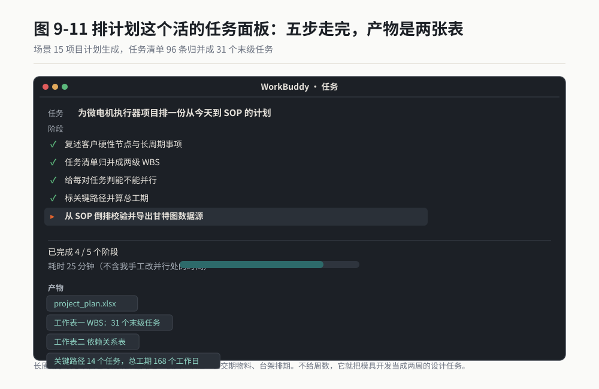

*作者根据公开资料绘制*

### 翻车清单

**翻车一：它把能并行的做成串行。**
这是排计划最大的坑。它拿到任务清单，默认是按顺序往下排。
补救动作：在提示词里专门设了"能不能并行"这一列并要求写理由，就是为了逼它逐对判断。拿到结果后你自己还要过一遍，我自己的经验是它能标出的并行处，大概只有实际可行的一半。

**翻车二：它漏了长周期件。**
模具、认证、台架排期，这些时间不在任务清单里，它在你的脑子里或者采购的脑子里。
补救动作：必须在输入四里手写成硬数据给它。这一项我建议在你们部门建一个共享的长周期件清单，每次排计划直接贴进去，别靠记忆。

**翻车三：它把工作日和自然日混用。**
工期填 10，它有时候按 10 天算，有时候按两周算，一份表里两种口径混着来。
补救动作：提示词里写了"一律用工作日"，拿到结果后还是要核一遍总数。做法是把关键路径上的工期手工加一遍，看跟它报的总工期对不对得上。

### 验收标准与变体

**验收标准**：

1. 关键路径上的任务工期手工加一遍，跟它报的总工期一致。对不上就是口径混了。
2. 依赖关系表里，"能不能并行"填"能"的条目，你逐个确认过物理上确实能并行。这一步必须人工过，AI 标不全。
3. 倒排校验跑出来，开始日期晚于今天。如果它说不可行，你必须在三条压缩建议里选至少一条，改完再跑一次。
4. 把这份计划给实际干活的人看，让他们报每个任务的工期。他们报的数跟 AI 报的数差 30% 以上的任务，用人的数。

**变体 A：倒排计划，从 SOP 往回推。**
客户只给 SOP 日期，中间全靠你排。把提示词第四步单独拿出来用："只给我一张倒排表，从 SOP 日期往回推每个里程碑的最晚完成日期。"这张表拿来跟客户谈节点很有用，因为它能直观显示"你这个 SOP 日期要求我们在两周内完成模具"。

**变体 B：周报自动生成。**
每周把项目进展（完成了哪些任务、卡在哪）丢给它，让它对照 WBS 表更新状态，输出周报：本周完成、下周计划、风险项三块。我做过两个月，每周省 40 分钟。

**变体 C：多项目资源冲突检查。**
有三个项目并行时，把三份 WBS 表一起丢进去，让它找出同一角色在同一时间段被分配了两次的地方。这种冲突人工很难看出来。

> 老兵说：这套流程我跑通过，但有一件事它至今做不好：它不知道哪个供应商的模具厂最近在赶工，也不知道试验台架下个月被大项目占了。这些"场外信息"永远要你自己补。所以我把 AI 排的计划当第一稿，实际节点一定是跟采购和试验室打完电话之后定的。

---

## 场景 16 风险清单辅助：把经验变成结构化的失效模式表 ★★

### 一句话背景

DFMEA 这张表，老工程师脑子里的东西比表上写的多十倍。问题是怎么把它们掏出来。人工做法是一个下午的评审会，五个人吵三小时，出来的表还常常漏掉最要命的那条。

### 名词小词典

**DFMEA（Design Failure Mode and Effects Analysis，设计失效模式与影响分析）**：一张把"它可能怎么坏、坏了多严重、为什么坏、怎么提前发现"列清楚的表。它在设计阶段做，不是等产品坏了再做。

**失效模式**：零件坏的具体样子。写法有讲究，必须是"零件加动词加偏差"，比如"蜗轮齿面磨损"，不能写"强度不足"。

**失效影响**：这个失效发生之后，客户或者下一道工序会看到什么。

**S / O / D**：严重度 Severity、发生度 Occurrence、探测度 Detection，通常各按 1 到 10 打分。S 看后果有多严重，O 看发生的可能性，D 看在出厂前能不能发现。

**RPN**：风险优先数，S 乘 O 乘 D。数值越高越该先处理。

**AP（Action Priority，措施优先级）**：汽车行业现在更常用的做法，按 S、O、D 的组合查表给出高、中、低三档优先级，比单纯看 RPN 乘积合理。

### 开工前准备

1. 产品结构清单：有哪些零件、什么材料、怎么装配。清单越细，它想出的失效模式越多。
2. 工况参数：扭矩、转速、温度范围、循环次数、环境条件。
3. 你自己的经验条目。至少手写 5 条，作为参照系。它如果连你手写的 5 条都想不全，说明它没进入状态。
4. 同类产品的售后数据或试验失败记录，有的话一并给。
5. 模式选 Plan。先让它出结构，你确认维度再批量生成。

### 操作步骤

**第一步**：把结构清单和工况参数丢进去，让它先复述产品，确认它理解对了。

**第二步**：先不要让它出完整表，先让它列失效模式的候选清单，你自己过一遍。

**第三步**：把你手写的 5 条经验混进去，看它能不能识别出这些是你补的。能识别说明它在认真读。

**第四步**：发下面的提示词，让它生成完整表。

**第五步**：重点看"探测度"这一列。它给的探测度通常过于乐观。

**第六步**：导出 Excel，作为 DFMEA 评审会的输入，不要当作评审会的结论。

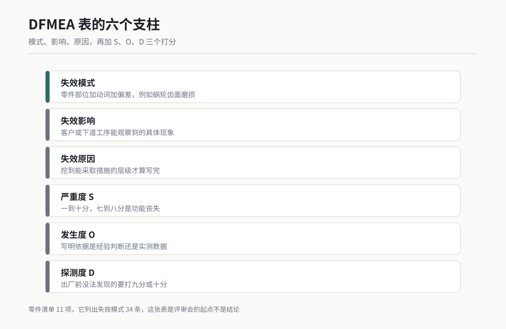

图 9-4 作者根据公开资料绘制

### 可复制提示词

```
你是我们组的可靠性工程师，要和我们设计工程师一起做一份 DFMEA。

产品信息：
- 产品：（一句话说清是什么）
- 零件清单：（逐个列出，含材料）
- 工况参数：扭矩（数值）、转速（数值）、温度范围（数值）、循环次数（数值）、环境（描述）
- 类似产品的已知问题：（列你手上的经验，至少 5 条）

第一步：先按零件逐个列出候选失效模式，输出一张表：
| 零件 | 失效模式 | 失效影响 | 失效原因 | 现有控制手段 |

填写规则：
- 失效模式必须写成"零件部位 + 动词 + 偏差"，例如"蜗轮齿面磨损"，不许写"强度不足""性能下降""可靠性差"这类抽象表述
- 失效影响要写客户或下道工序能观察到的具体现象，不许写"影响用户体验"
- 失效原因写到能采取措施的层级。原因是"材料选择不当"就要继续追问为什么不当，往下再挖一层
- 现有控制手段写具体：哪个试验、哪份检查表、哪道工序。没有就写"无"，不许留空

第二步：给上面每一行打 S、O、D 三个分，各 1 到 10，并给出 AP 档位（高 / 中 / 低）。
打分规则必须显式说明依据：
- S：1 到 3 为不影响功能，4 到 6 为功能降级，7 到 8 为功能丧失，9 到 10 为涉及安全或法规
- O：依据是什么？如果是凭经验，写明"经验判断"；如果有试验数据或售后数据支撑，写明数据来源
- D：如果在量产前没有任何手段能发现，D 必须打 9 或 10，不许打中间分。判定"能发现"必须有具体的检验或试验方法

第三步：把 AP 为"高"的行单独列出来，每行给两条建议措施，一条设计改进，一条验证手段。措施必须可执行，不许写"加强设计评审"这种。

第四步：检查我给你的"类似产品的已知问题"那几条，有没有全部体现在失效模式表里。有遗漏的，明确告诉我哪几条没进去，并补上。

输出要求：
- 全部用 Markdown 表格
- 不许写"本产品整体可靠性良好"这类总结
- 打分依据这一列不许留空，写不出依据就写"无依据，需评审确定"
- 最后整表另存为桌面的 dfMEA_draft.xlsx
```

### 过程与判断点

我用这套流程跑过前面那个减速齿轮箱。零件清单 11 项，它列出失效模式 34 条。

**判断点一：失效模式的写法。**
它第一次给我的表里，有 6 条写的是"强度不足""磨损严重""噪音超标"。这些都不是失效模式，是结论。我在提示词里加了"零件部位 + 动词 + 偏差"的规则之后，重跑一次，34 条里有 31 条合格，剩下的 3 条我自己改了。这个规则是这整份提示词里最值钱的一句。

**判断点二：它有没有把你的经验吃进去。**
我手写了 5 条经验，其中一条是"蜗杆齿面粗糙度 Ra 必须低于 0.2 μm，否则 POM 蜗轮三个月后磨成粉末"。它把这条写进了失效模式表，还往下挖了一层原因：蜗杆磨削工艺参数未固化、砂轮修整周期过长。这个挖掘是有价值的。

另一条我写的是"POM 齿轮在 45 °C 下热膨胀大约 0.012 mm 每齿高，修形的时候必须考虑，齿顶修缘量要取到 0.015 到 0.020 mm，比钢齿轮多修一倍"。它没有写进去。我按提示词第四步追问，它认了，补上并标了 AP 高。

**判断点三：探测度有没有被高估。**
它给的 D 分普遍偏低，也就是过于乐观。塑料齿轮的磨损在量产前确实很难发现，它打 5 分，我改成 8 分。我在提示词里写了"没有任何手段能发现就打 9 或 10，不许打中间分"，就是为了堵这个。

**判断点四：失效原因的深度。**
"材料选择不当"这种原因没有价值，因为它不能指导行动。好的原因是"POM 未加玻纤增强，10 万次循环许用弯曲应力只有 40 到 50 MPa，而实际工作应力 97 MPa"。后者能让工程师立刻知道该做什么。

**产物长什么样**：一份 Excel，34 行，六到八列。评审会上投屏，逐行过。我那次评审会开了 2 小时 20 分，比往常的半天短，因为起点是一张填好的表，不是一张空白表。


*作者根据公开资料绘制*

### 翻车清单

**翻车一：它写的失效模式是空话。**
"强度不足""可靠性差""性能下降"，这些词看着像术语，实际没有信息量。
补救动作：提示词里那句"零件部位加动词加偏差"必须保留。拿到表之后，把抽象词汇批量筛一遍：搜索"不足""不良""下降""异常"，搜到的一律退回重写。

**翻车二：打分没有依据。**
它会给一排数字，看着很专业，但问它为什么打这个分，它给不出来源。
补救动作：提示词里强制要求写打分依据。拿到表之后，把"打分依据"这一列筛一遍，写"经验判断"超过一半的，说明这张表的分数只能当排序参考，不能当决策依据。

**翻车三：它把设计和过程混在一起。**
DFMEA 管设计，PFMEA 管制造过程。它经常写"注塑保压时间不足"这种过程原因进 DFMEA。
补救动作：加一句"失效原因只写设计能控制的部分，涉及工艺参数、操作手法、设备状态的归入 PFMEA，单独列在表外"。

### 验收标准与变体

**验收标准**：

1. 全部失效模式符合"零件部位 + 动词 + 偏差"写法，抽象词汇零出现。
2. 你手写的经验条目 100% 出现在表里。少一条就追问，直到补齐。这一条是硬标准。
3. AP 为高的每一行都有可执行的措施，且指定了责任人和完成日期。
4. 评审会上，参会工程师至少新增 5 条 AI 没想到的失效模式。达不到 5 条，说明 AI 想得比你们全，这时候要反过来怀疑你们是不是在走过场。

**变体 A：设计评审检查表。**
把 DFMEA 表丢给它，追加一句："把 AP 为高和中的失效模式，转成一份设计评审检查表，每条写清评审时看什么、怎么判合格。"评审会上照着念一遍。

**变体 B：供应商风险问卷。**
把涉及外购件的失效模式挑出来，让它转成供应商问卷：每条失效模式对应一个提问，要求供应商回答他们的控制手段。发给供应商之前，这份问卷比"请把你们的质量控制文件发来"有效得多。

**变体 C：试验大纲的补充依据。**
让它把"探测度大于等于 7"的行单独列出，这些就是试验大纲必须覆盖的项目。我试过一次，它列出 12 条，其中 3 条我们原本的试验大纲里没有。

> 老兵说：这张表我从不当结论用，只当评审会的起点。AI 列出来的那 34 条有价值，评审会上老工程师看着它们想起来的那 7 条更值钱。AI 的作用是把空白页变成填空页，人填的那部分才是命。

---

## 场景 17 技术方案对比：两套方案摆在一起比，比什么先定好 ★★★

### 一句话背景

两套方案摆一起比，最难的一步发生在比之前：先定好比什么。没有评价维度的对比，最后一定变成谁嗓门大谁赢。

### 名词小词典

**单级传动与两级传动**：一级减速就把总减速比做完叫单级，分两级做叫两级。总减速比是两级各自减速比的乘积。

**减速比**：输入转速除以输出转速。前面那个项目是 7200 除以 72，等于 100 比 1。

**包络尺寸**：零件占的最大外形尺寸。这个项目卡的是外径小于 60 mm。

**变位系数**：齿轮加工时刀具相对毛坯的偏移量，用 x 表示。正变位能把齿根加厚，提高弯曲强度，也能避开根切。

**根切**：齿数太少时，加工会把齿根挖掉一块，削弱强度。直齿轮不修形时理论最少齿数是 17。

**传递误差 TE**：实际输出角度跟理论输出角度的差值，是齿轮噪音的主要来源之一，单位 μm。

### 开工前准备

1. 两套方案的完整参数，或者至少是方案描述加关键参数。
2. 硬性约束清单：尺寸上限、成本上限、已有的工装和产线限制。
3. 一份你自己先写的评价维度草稿，3 到 8 条。别指望它替你想维度，它想的维度是通用的，你的才是这个项目的。
4. 每个维度的权重。不会定就先都定 1，跑完一轮再调。
5. 模式选 Plan，这个场景必须先看到维度表再让它打分。

### 操作步骤

**第一步**：先把方案描述丢进去，只让它做一件事："先不要比，先列出你认为应该比的维度，并说明每个维度为什么重要。"

**第二步**：看它列的维度，跟你自己的草稿合并，删掉通用的，留下这个项目特有的。这一步必须你来做。

**第三步**：把最终维度表发回给它，让它确认每个维度的判定方法和数据来源。判定方法写不出来的维度，删掉。

**第四步**：发下面的提示词让它填表打分。

**第五步**：看它的结论，重点看它有没有主动提出"两套都不行"。

**第六步**：导出对比表，作为方案评审会的材料。


图 9-5 作者根据公开资料绘制

### 可复制提示词

```
你是我们组的方案评审工程师。我手上有两套（或三套）技术方案，需要摆在一起比。

方案 A：（完整描述，含关键参数）
方案 B：（完整描述，含关键参数）

硬性约束（违反任一条的方案直接淘汰，不参与打分）：
- （约束一，例如：外径小于 60 mm）
- （约束二，例如：空载噪音小于 40 dBA，测距 500 mm）
- （约束三）

第一步：先用硬性约束过滤。任何方案违反任一条硬性约束，直接写明淘汰，并指出违反的是哪一条、超出多少。被淘汰的方案不进入打分。

第二步：用下面这张维度表打分，不许增删维度，不许改权重：
| 维度 | 权重 | 判定方法 | 数据来源 |
（把你最终确认的维度表粘贴在这里）

输出打分表：
| 维度 | 权重 | 方案 A 得分 | 方案 A 依据 | 方案 B 得分 | 方案 B 依据 | 加权后 A | 加权后 B |

规则：
- 得分用 1 到 10
- "依据"这一列必须写具体数值或具体事实，例如"外径 71.4 mm，超出限制 11.4 mm"。不许写"较好""略优""表现不错"
- 如果某个维度你算不出数值，就写"无法判定"，不许凭印象给分

第三步：给结论。结论必须是下面三种之一，不许和稀泥：
1. 方案 X 明显更优，理由：……
2. 两套方案在关键维度上互有胜负，需要补充什么信息才能定：……
3. 两套方案都不满足某条硬性约束，建议：……

第四步：单独列出"这两套方案都没考虑到的东西"，最多 5 条。这一列是给我兜底用的。

输出要求：
- 全部用 Markdown 表格
- 不许说"两套方案各有优势，具体选择取决于实际需求"这类话
- 任何数值都必须注明来源：算出来的写公式和代入值，查出来的写查自哪里，估出来的写"估算"
- 最后另存为桌面的 scheme_compare.xlsx
```

### 过程与判断点

这个场景是我实测留档最完整的一个。

我给它的两个方案是：方案 A 单级蜗轮蜗杆，减速比 100 比 1；方案 B 两级传动，第一级蜗轮蜗杆，第二级平行轴齿轮。

它做的第一件事就掏出硬性约束把方案 A 淘汰了，压根没先打分：蜗轮要做到 100 齿，按模数 0.7 算，外径 71.4 mm，超出 60 mm 限制 11.4 mm。

这个判断我当时自己也算过，但我是在看了 8 页文件之后才发现的。它是拿到参数的第 40 秒说的。

**判断点一：它有没有先做淘汰而不是先打分。**
很多次对比是浪费时间，因为其中一套方案根本不可行。硬性约束过滤这一步必须在打分之前。它这次做对了，但有一次它没做，直接给违反约束的方案打了 7 分。

**判断点二：每个格子里有没有数字。**
它给的方案 B 打分表里，"弯曲强度"这一项的依据写的是："POM 输出齿轮在 10 Nm 下弯曲应力 97 MPa，POM 在 10 万次循环下的许用值 40 到 50 MPa，超出约一倍。建议齿宽从 20 mm 加到 30 mm，材料改用 POM 加玻纤增强级。"

这句话里每一个数字都能追到来源。这就是合格的依据栏。

**判断点三：它敢不敢说两套都不行。**
提示词第三步专门设了"两套都不满足"这个选项，就是为了逼它别和稀泥。这次它给的结论是第二种：方案 A 淘汰，方案 B 在噪音维度上处于临界，需要客户确认 10 Nm 是不是峰值力矩。

这条追问后来证明是对的。客户的 10 Nm 是堵转峰值，正常工作扭矩只有 4 Nm 左右。这个信息在原来的工况参数表里没有，是它逼出来的。

**判断点四：第四步"都没考虑到的东西"。**
这次它列了 5 条，其中一条是"两级传动的效率损失没有计入，蜗轮蜗杆效率按 0.45 到 0.6 估算，平行轴按 0.97，总效率约 0.45 到 0.58，需要核算电机功率是否够"。这条提醒让我们及时发现了电机选型偏小。

**产物长什么样**：一个 Excel，一张打分表，一张结论。评审会上我直接投屏打分表，讨论集中在三个有分歧的维度上，会议 50 分钟结束。

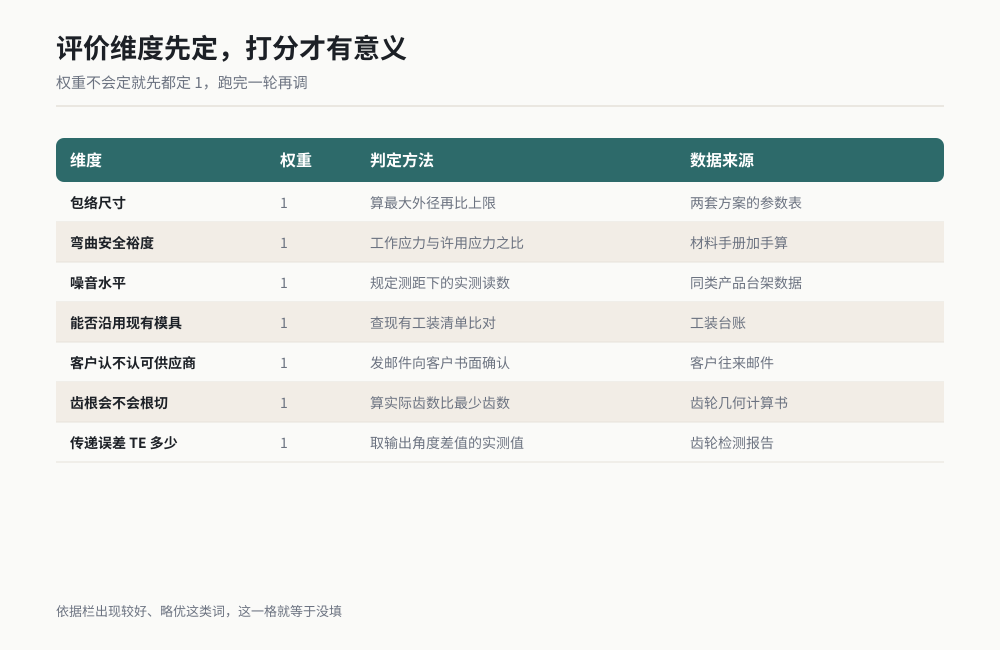

图 9-6 作者根据公开资料绘制

### 翻车清单

**翻车一：它列的维度太通用。**
它会给你"成本、性能、可靠性、可制造性"这种四海皆准的维度。这种维度比不出结果。
补救动作：维度必须由你来定。做法是让它先列，你看完只保留跟这次决策真正相关的，然后补上你这个项目特有的，比如"能否沿用现有模具""客户是否认可该供应商"。

**翻车二：它给的分没有依据，或者依据写"较好""略优"。**
补救动作：提示词里那句"不许写较好略优表现不错"必须留着。拿到表之后，把依据栏扫一遍，出现形容词的一律打回重写。没有数字的格子就是没有信息。

**翻车三：它算错数，而且错得很自信。**
这次它把两级传动的总效率算成了 0.65，我复核了一遍，按 0.55 乘 0.97 应该是 0.53 左右。它承认了并改了。
补救动作：凡是涉及乘除的结果，自己按一遍计算器。这一步在这类场景里不能跳。我自己的规矩是：所有带单位的数字自己核，纯逻辑判断可以信它。

### 验收标准与变体

**验收标准**：

1. 打分表里每一格依据栏都有数字和来源，形容词零出现。
2. 所有带单位的数值，你自己按一遍计算器，全部对得上。
3. 结论是三种之一，不是和稀泥的第四种。
4. 把这份对比表给没参与讨论的第三人看，他能看懂为什么选这个方案。看不懂，说明依据栏写得不够具体。

**变体 A：供应商方案对比。**
把三家供应商的技术方案书都丢进去，用同一套维度表打分。这个变体我用在供应商定点上，效果比方案对比还好，因为它不受"这是我自己想的方案"这种心理影响。

**变体 B：材料选型对比。**
方案换成材料：POM 与 POM 加玻纤，或者钢与粉末冶金。维度换成拉伸强度、许用弯曲应力、吸水率、收缩率、单价、加工方式。同样的提示词结构，只换维度表和方案描述。

**变体 C：把对比表反过来用，做方案的自我体检。**
只给一套方案，让它扮演评审专家找出这套方案的薄弱维度，按严重度排序。我在提交方案前固定跑一次，提前把会被问住的问题准备好答案。

> 老兵说：AI 不讨好你，算出来不够就是不够。方案 A 那条"外径 71.4 mm，超出 11.4 mm"，如果我拿给一个想省事的人看，他会说"差不多吧，想办法挤一挤"。AI 不会这么说，它只给数字。我后来养成一个习惯：方案评审前先让 AI 过一遍，它挑出来的毛病，比评审会上同事挑出来的多。

---

## 场景 18 行动项跟踪：会议决定变成有人有日期的任务 ★★

### 一句话背景

周会开 60 分钟，说了 17 条口头决定。下周开会，其中 5 条没人认领，3 条没人记得说了什么。这个活每周都在发生，每次都耗掉 30 到 40 分钟整理纪要。

### 名词小词典

**行动项**：会议里定下来的、需要有人在某个日期前做完的具体动作。讨论不是行动项，决定才是。

**DRI（Directly Responsible Individual，直接责任人）**：一件事只有一个最终负责的人，可以有协助的人，但负责人只能有一个。

**截止日期**：具体到年月日的日期。"尽快""下周""月底"都不是日期。

**状态**：未开始、进行中、已完成、已阻塞。加一个"已阻塞"能救很多项目，因为它逼着人说出来卡在哪。

**阻塞项**：一件事干不下去，卡在等别的人或别的信息。

### 开工前准备

1. 会议录音转写文本，或者手写纪要。录音转写效果更好，因为口头讨论转写下来，AI 能分辨哪些是决定哪些是闲聊。
2. 参会人名单，含部门和姓名。不给名单，它会编人名。
3. 上次会议的行动项清单。用来做滚动跟踪。
4. 你们的行动项编号规则，比如 A-001 或者按会议编号。
5. 模式选 Agent。这个活目标明确，直接让它干完出文件。

### 操作步骤

**第一步**：把转写文本拖进去，先让它报一句："这份转写一共多少字，涉及多少个说话人。"确认它读全了。

**第二步**：发下面的提示词。

**第三步**：重点检查"截止日期"这一列，凡是出现"尽快""尽快安排""下周"的一律打回。

**第四步**：把上次会议的行动项清单也丢进去，让它做滚动：上次没完成的，本次重新列出并标注滞后天数。

**第五步**：确认后导出，发到群里，并让每个人回复确认。

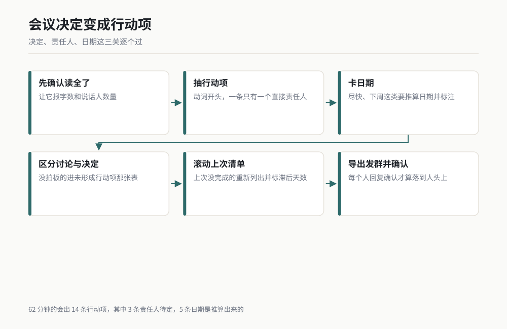

图 9-7 作者根据公开资料绘制

### 可复制提示词

```
你是我们项目组的会议记录员。下面是一份会议转写文本，请把它整理成行动项清单。

参会人：（列出姓名和部门）

第一步：给我一张"行动项表"：
| 编号 | 行动项描述 | 责任人 | 协助人 | 截止日期 | 完成判据 | 状态 |

填写规则：
- 编号：从 A-001 开始
- 行动项描述：必须以动词开头，例如"完成蜗杆齿面粗糙度检验方案的编制"。不许出现"讨论""关注""跟进""推动"这类无完成标志的动词
- 责任人：只能从参会人名单里选，且每条只能有一个。如果会议里没有明确指定责任人，责任人栏写"待定"，并在备注里写明会议里谁提的这件事
- 截止日期：必须是具体的年月日。如果会议里只说了"尽快""下周""月底"这类模糊表达，就按会议日期推算一个具体日期填进去，并在该行后面加"（推算）"标记
- 完成判据：一句话，写清做到什么程度算完成，要能判定。例如"输出一份含检验项目、量具、抽样方案的 Excel 并发给质量组"
- 状态：一律填"未开始"

第二步：给我一张"未形成行动项的讨论"表，把会议里讨论过但没有结论的话题列出来：
| 话题 | 讨论了什么 | 卡在哪 | 建议下次会议怎么处理 |

第三步：给我一张"待决策事项"表，把需要领导或客户拍板的事单独列出来：
| 事项 | 需要谁决策 | 需要什么信息才能决策 | 不决策的后果 |

输出要求：
- 三张表都用 Markdown 表格
- 不要写会议总结，不要写"本次会议高效务实"
- 不许编造参会人姓名，名单里没有的人一律写"待定"
- 如果某段话你判断不出是不是决定，就放进第二张表，不要硬凑成行动项
- 最后把三张表另存为桌面的 meeting_actions_（会议日期）.xlsx，三个工作表命名为 行动项、待讨论、待决策
```

### 过程与判断点

我拿一次真实的周会转写跑过，转写文本约 8200 字，5 个说话人，会议 62 分钟。

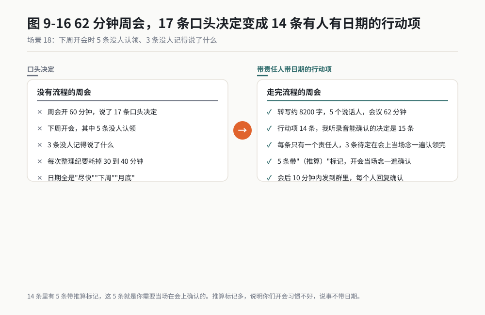

*作者根据公开资料绘制*

**判断点一：行动项的数量。**
它给出 14 条。我自己听了一遍录音，能确认的决定是 15 条。差 1 条，是那种会上说了半句、被别的话题打断的。这个准确率我满意，比我自己边听边记的准确率高，我开会时经常忙着说话忘了记。

**判断点二：有没有把讨论当成决定。**
这是这个场景最关键的一点。转写里有大段讨论蜗杆粗糙度标准的对话，最后没人拍板。它把这段放进了第二张"未形成行动项的讨论"表，标注"卡在：Ra 数值取 0.2 还是 0.4 没有定，需要查客户企标"。这个判断是对的。

它有一次做错了，把一段讨论直接写成了行动项"优化蜗杆磨削工艺"。我后来在提示词里加了那句"不许出现讨论、关注、跟进、推动这类动词"，这种错误就少多了。

**判断点三：日期栏里有多少个"（推算）"标记。**
这次 14 条里有 5 条带推算标记。这 5 条就是你需要当场在会上确认的。看到推算标记多，说明你们开会习惯不好，说事不带日期。

**判断点四：责任人栏有没有"待定"。**
这次 3 条待定。我在会上直接把这 3 条念了一遍，各用了 20 秒认领完。这件事如果拖到会后发邮件问，通常要来回两天。

**产物长什么样**：桌面一个 Excel，三个工作表。行动项表发群里，待决策表单独发给领导。

### 翻车清单

**翻车一：它编人名。**
转写里如果说话人标识不清，它会自己补一个名字，而且补得像真的。
补救动作：必须给参会人名单，并在提示词里写明"名单里没有的人一律写待定"。拿到表之后，责任人栏逐行扫一遍，确认每个人都在名单里。

**翻车二：它接受"尽快"当日期。**
会议里说"尽快"，它会老老实实写"尽快"。
补救动作：提示词里强制它推算具体日期并加"（推算）"标记。这样你一眼就能看出哪些日期不是会上定的。

**翻车三：它漏掉会议最后五分钟。**
会议最后五分钟经常是补的杂事，转写质量也最差。它有时候读到后面就松了。
补救动作：单独追一句："会议最后 10 分钟的内容单独再过一遍，列出这段时间里新增的行动项。"我试过，有一次最后五分钟里有 2 条重要事项被漏了。

### 验收标准与变体

**验收标准**：

1. 行动项表在会后 10 分钟内发到群里。做不到 10 分钟，这套流程的价值就打对折。
2. 每条行动项有唯一责任人，且责任人在群里回复了确认。没回复的，会后单独找。
3. 带"（推算）"标记的日期，开会当场念一遍确认。
4. 下次会议开始时，先过一遍上次行动项的完成情况。这一步用 AI 做滚动，30 秒出结果。

**变体 A：邮件收件箱转行动项。**
把一周的项目相关邮件导出成一个文件，让它按同样格式提取行动项，标注每条来自哪封邮件。我用这个做每周一的开局，比翻收件箱快。

**变体 B：评审意见跟踪。**
设计评审会产生的意见，按同样格式整理，多加一列"关闭条件"和"关闭日期"。客户审核意见跟踪也用这个，尤其是客户给的审核清单，逐条跟踪关闭状态。

**变体 C：个人待办整理。**
把你自己一天里记在便签、微信、邮件里的零散待办，一次性丢给它，让它按紧急度和依赖关系排出顺序，输出今天要做的三件事。这个变体我每天都用。

> 老兵说：我用这套流程之后，省下整理纪要的 40 分钟只是小头，真正的变化是会上开始有人说日期了。因为大家都知道说完会被记下来，还带推算标记，丢人。工具改变行为，这话说起来像管理鸡汤，但它是真的。

---

## 小白词典

**SOR**：客户写给供应商的需求文件。它是验收依据，不是技术方案。

**工况参数**：产品干活时的外部条件，扭矩、转速、温度、循环次数这些。

**可验证性**：一条需求能不能判定合格。写不出判定方法的需求，等于没写。

**CSR**：客户在通用标准之外额外加的特殊要求，常藏在附件里。

**WBS**：工作分解结构。把项目拆成能在两周内干完、只有一个负责人的小任务。

**关键路径**：决定总工期最长的那条依赖链。这条链上晚一天，项目晚一天。

**DV 与 PV**：设计验证与生产验证。DV 验设计对不对，PV 验量产做不做得出来。

**DFMEA**：设计失效模式与影响分析，一张把"怎么坏、多严重、为什么、怎么提前发现"列清楚的表。

**RPN 与 AP**：风险优先数与措施优先级，两种给风险排序的方法，汽车行业现在更常用 AP。

**变位系数**：齿轮加工时刀具的偏移量。正变位能加厚齿根、避开根切。

**传递误差 TE**：实际输出角度跟理论角度的差值，齿轮噪音的主要来源之一。

**DRI**：一件事的直接负责人，只能有一个。

## 你的岗位怎么用

**设计工程师**：场景 17 最该先抄。你每次做方案对比前，先花 5 分钟把评价维度定死，再让 AI 填数字。场景 16 的 DFMEA 表拿来当评审会起点，别当结论。

**试验工程师**：场景 18 和场景 13。会议行动项你每周都要整理，3 分钟出表这件事最省时间。需求拆解出来的试验类条目，直接就是你的试验大纲输入。

**质量工程师**：场景 14 和场景 16。标准条款提取要全查不要抽查，这是给你的规矩。DFMEA 表里的探测度打分，AI 会偏乐观，你把关最合适。

**项目经理**：场景 13 和场景 15 是你的主战场。需求条目表直接进你的项目管理系统，WBS 和依赖关系表直接进你的甘特图。记住一件事：长周期件的数据必须你自己给 AI。

**采购 / 供应商管理**：场景 17 的变体 A（供应商方案对比）和场景 16 的变体 B（供应商风险问卷）。发给供应商之前用 AI 把问卷做细，收回来的答案质量会高一截。

**研发主管**：场景 18 的待决策表单独看。它把"需要谁决策、缺什么信息、不决策的后果"三列摆出来，是你的决策清单。

## 本章交付物

**一份需求翻译提示词组，六段，可直接复制。**

做法：把本章六个场景的可复制提示词各复制一遍，存进一个文本文件，命名"第 9 章提示词组"。

每段提示词里的括号部分，是你要填的变量。六个场景的变量分别是：产品描述、标准文件、任务清单与资源、零件清单与经验、方案描述与维度表、参会人名单。

第一周只做一件事：拿场景 18 试一次。你手上一定有一份会议纪要或者录音转写，3 分钟出结果，当天就能看到效果。

第二周试场景 13。找一份你现在手上的客户文件，跑一遍，看看它找出来的冲突条数是不是比你多。

六个场景不必全用。我在自己项目上常用的是 13、17、18 这三个，14 因为核对成本高用得少，15 和 16 在项目关键节点才用。

## 本章金句

> 一份 40 页的需求文件，真正决定成败的条款不超过 12 条，剩下的是给将来吵架用的。

> 摊平条款这件事 AI 做得比人好，因为它不会因为"这页看着像法务条款"就跳过去。

> 写不出判定方法的需求，等于没写。当天发邮件问客户，不要自己猜。

> 方案对比最难的一步发生在比之前：先定好比什么。没有评价维度的对比，最后是谁嗓门大谁赢。

> 依据栏里出现"较好""略优"，这一格就等于没填。

> 所有带单位的数字自己按一遍计算器，纯逻辑判断可以信它。

> AI 不讨好你，算出来不够就是不够。

---

*（下一章：造型与几何。需求定完了，接下来让 AI 真正碰到你的三维模型，从一句话到一张能下发生产的图纸。）*
