# 第 19 章 连接器：让 AI 接上你的邮箱、文档和代码仓库

> 大多数人说 AI 干不了自己的活，其实是它够不着自己的系统：邮件写好了要你自己点发送，文档整理好了要你自己去粘贴。差的不是智力，是一根插头。

今年四月的一个周三下午三点四十，我在工位上跟一件小事较劲。

那天上午刚出一份微电机耐久试验的中期报告，12 页 PDF，3.4 MB。我要做三件事：把这份报告发邮件给五个同事；把它存进项目共享的那个在线文档目录；在群里给两位同事各推一句要点。

三件事每一件都不难，加在一起我估摸着二十分钟。

我先试了最偷懒的办法。把 PDF 拖进 WorkBuddy 的对话框，跟它说：帮我把它发给这五个人，存进项目文档目录，再给另外两位同事各发一句要点。

它回的第一句话我到现在还记得很清楚：**"我无法访问你的邮箱。"**

我不死心，换了第二个说法：那你把这件事拆成三步，一步步告诉我怎么做。它很认真地给了三步，第一步是"请登录你的邮箱并上传附件"。等于它把活原封不动还给了我。

第三次我改问法，问它能不能直接写进在线文档。它回的是：我这边没有你文档空间的访问权限，你可以把内容复制进去。

那天下午这三件事我最后花了三十八分钟手工做完。中间还出了一次错：附件贴成了上一版，发出去三分钟后才发现，又补了一封道歉邮件。

问题不在它笨。它把要点总结得很准，两句话就把十二页报告的重点说清了。问题在于它跟我的邮箱、我的文档、我的同事之间，隔着一层看不见的墙。它在墙这边，我的系统在墙那边，中间没有一根线。

这一章讲的就是那根线，以及装上这根线之后，你应该把哪些钥匙给它、哪些死也不给。

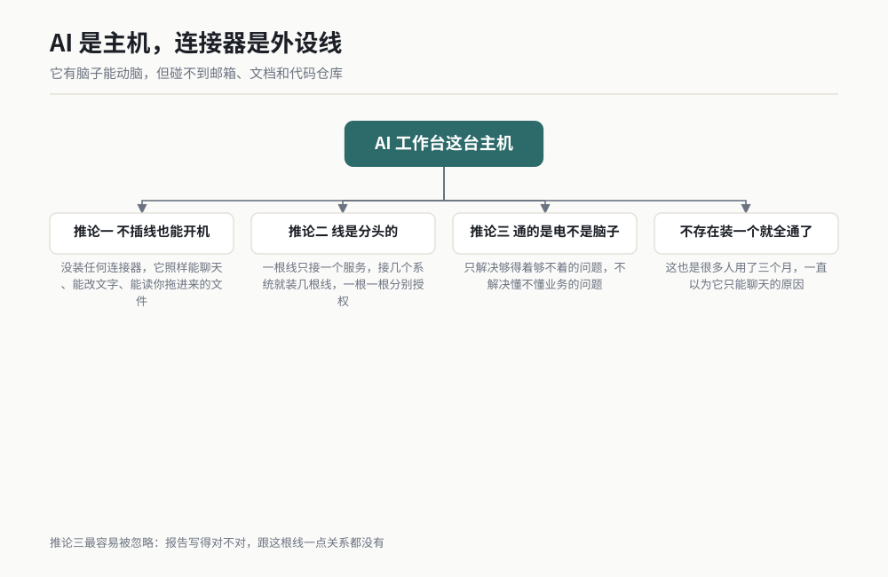

*图 19-1 作者根据公开资料绘制。*

---

## 19.1 连接器是什么：给 AI 装的一根根插头

### 主机与外设的类比

我给你一个类比，这个类比撑得住整章。

把你电脑上的 AI 工作台想成一台**主机**。它自己有脑子，能算、能写、能判断，但它是裸的：它没有眼睛看你的邮箱，没有手去动你的文档，没有腿走到你的代码仓库里去。

**连接器就是插在这台主机上的一根根外设线。**

插上硬盘线，它能读你硬盘里的东西；插上打印机线，它能打印；插上网线，它能上网。连接器干的是同一件事：把 AI 这台主机的能力，接到某一个具体的外部服务上。

这个类比里藏着三个很实用的推论，我一个个说。

**推论一：不插线，主机照样能开机。** 你现在没装任何连接器，AI 还是能跟你聊天、能改你给它的文字、能读你拖进来的文件。它只是碰不到那些服务而已。这就是为什么很多人用了三个月 AI，一直以为它"只能聊天"。

**推论二：线是分头的。** 一根线只接一个服务。接邮箱的线接不了代码仓库，接文档的线发不出邮件。你想让它碰几个系统，就得装几根线，一根一根分别授权。不存在"装一个就全通了"这种东西。

**推论三：线插上之后，通的是电，不是脑子。** 连接器只解决够得着够不着的问题，不解决懂不懂业务的问题。它能把报告发进你的文档目录，但报告写得对不对，跟这根线一点关系都没有。

### 没连接器 vs 有连接器

同一件事，两种做法，差别在哪儿。这张表里的四个例子都是我日常工作里真实遇到过的：

| 你要干的活 | 没连接器 | 有连接器 |
|---|---|---|
| 把一份报告发给五个人 | AI 帮你把正文写好，你自己登录邮箱、填地址、传附件、点发送 | AI 直接把邮件发出去，你把收件人名单核一遍 |
| 把变更记录整理进项目文档 | AI 给你一段文字，你自己打开文档、找位置、粘贴、调格式 | AI 把内容写进指定文档的指定位置，你去文档里看一眼 |
| 汇报代码仓库本周改了什么 | 你自己去翻提交记录，把信息复制给 AI 让它总结 | AI 自己去读提交记录，回来给你一份带提交号的汇报 |
| 三个系统串起来做一件事 | 你在三个系统之间来回切换，做人工搬运工 | AI 按你定的顺序走完三段，每一段都停下来给你看证据 |

第四行是本章的分水岭。前三种活，连接器只是替你省了几下鼠标；第四种活，连接器把 AI 从"帮你写内容"变成了"帮你跑完一整件事"。

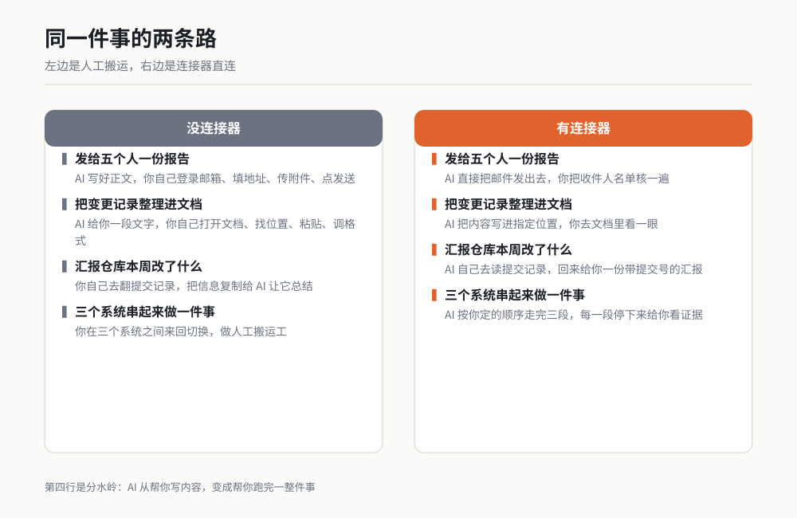

*图 19-2 作者根据公开资料绘制。*

### 连接器和另外两件事的区别

书里已经讲过技能和 MCP，容易混，我在这里切一刀。

**技能**是你把一套做法存下来，让 AI 下次照着做。它不碰外部系统，只改变 AI 自己怎么干活。类比：给主机装软件。

**连接器**是让 AI 碰到某一个具体的外部服务。它改变的是 AI 够得着什么。类比：给主机插线。

**MCP** 是一套通用的插座标准，谁都可以照它做插头。第 20 章专门讲。类比：墙上的标准插座。

一句话记住：**技能改的是怎么干，连接器改的是能碰谁，MCP 是做插头的规矩。**

> 【待补：WorkBuddy 中连接器管理界面的入口路径，以实际版本为准。本章只讲通用原则与判断方法，不编造菜单路径。】

---

## 19.2 常见的几类连接器能干什么

我把常见的连接器分成五类。每一类我都按三件事讲：能做什么、不能做什么、授权时要注意什么。第三件事最重要，也最少有人讲。

先说一句本章的可信度。下面 C1 到 C4 四个场景，我标的是 ★★，意思是这套流程我跑通过，但没有完整留档到能逐条引述每一条返回值的程度。涉及支付那一类，我**没有在真实付款上跑过**，那一节的内容来自产品公开说明和我读过的文档，标注为 ★ 调研，别拿真钱去试。

### 代码仓库类：GitHub

**能做什么。** 读仓库里的文件和目录结构；读提交记录，包括谁在什么时候改了哪个文件；读分支、合并请求、议题和评论；在仓库里创建分支、提交改动、开合并请求、发评论。

**不能做什么。** 它读不到你本地还没推上去的代码。它跑不了你仓库里的持续集成流水线，也拿不到流水线跑出来的那份构建日志，除非那个服务另外也接了进来。它判断不了代码写得对不对，只能告诉你改了什么。

**授权时要注意什么。** 这一类授权最常犯的错，是直接给它整个账号的全部仓库写权限。正确的做法是只给它你当前这个项目需要的那一个或那几个仓库，并且先只给读权限。等它稳定跑顺了，你确认它写出来的东西靠谱，再考虑给写权限。

我自己的规矩是这样的：读权限默认给，写权限一个仓库一个仓库单独谈，而且写权限只给那些有分支保护、合并必须经过人审的仓库。这条规矩救过我一次，那次它在一个没保护的仓库里直接推了一版改动，好在那个仓库里只有示例代码。

### 在线文档类：腾讯文档、金山文档

**能做什么。** 新建文档、在线文档里写内容、改已有文档的内容、读文档内容、按标题或段落定位、把结构化内容写进表格。腾讯文档和金山文档这两家的云端文档都能接。

**不能做什么。** 它改不了文档的权限设置，也管不了谁能看谁能改。它对文档里的排版细节（比如某一页的分栏、某一个表格的合并单元格）掌控力很弱，这是最容易翻车的地方。它读不到没接进来的那份文档，哪怕那份文档就在同一个目录里。

**授权时要注意什么。** 授权的时候要看清是给整个文档空间还是只给某一个文件夹。我建议先只给一个测试文件夹，跑通了再扩。另外，这一类的授权往往跟你的个人账号绑定，你离职或者转岗的时候，记得回来把这条授权撤掉。

### 邮件类：Agent Mail

**能做什么。** 读收件箱、按条件搜索邮件、读单封邮件的正文与附件、发新邮件、回复、转发、把邮件存成草稿、下载附件。

**不能做什么。** 它管不了你的邮箱规则、过滤条件和签名档。它读不到你邮箱里那些被归档到别处的邮件，除非搜索条件覆盖了那里。它判断不了哪封邮件该回哪封不该回，这件事必须你定规矩。

**授权时要注意什么。** 这一类是全章风险最高的一类，因为邮件的收件人是你填的，发出去就收不回来。**我的建议是：只给起草权限，不给发送权限。** 让它把邮件写成草稿，你看过再发。这一条在场景 C3 里我会写成硬规矩，写进提示词里。

### 支付类

**能做什么。** 按产品公开说明，这一类可以完成下单后的支付动作，以及在支付被取消之后对同一笔订单重新发起支付。

**不能做什么。** 它不能替你决定这笔钱该不该花。它也不能在没有明确订单的情况下凭空付一笔钱出去，支付必须挂在具体订单上。

**授权时要注意什么。** 这一类我标 ★ 调研，我没在真实付款上跑过。**我给你一条我自己的硬规矩：我到现在没给任何 AI 开过可付款权限，一次都没有。** 我在电机项目上管过采购预算，我知道一笔钱点出去之后要花多少时间才能追回来。

如果你真的要用这一类，我的建议是三条：先设单笔上限和单日上限；每一笔都要有订单号可以对账；付款完成之后必须有一条你自己的复核动作。三条缺一条，就别开。

### 其他：云存储、数据库、日历、浏览器

这一类我合在一起说，判断逻辑一样。

**云存储类**（各类网盘、对象存储）能列目录、传文件、下文件、生成分享链接。它替你决定不了文件该放哪个目录。授权时注意：只给一个专用目录，别给根目录。

**数据库类**能执行查询、读表结构。写操作和删表这类动作，我建议一律不开。授权时注意用只读账号。

**日历类**能读日程、建日程、改日程。它看不懂日程背后的优先级，这个判断在你手里。授权时注意它能不能看到你的私人日程。

**浏览器类**能打开网页、截图、抓页面内容、填表单。它登不了需要短信验证码的系统。授权时注意：它在网页上的一切动作都是你的身份。

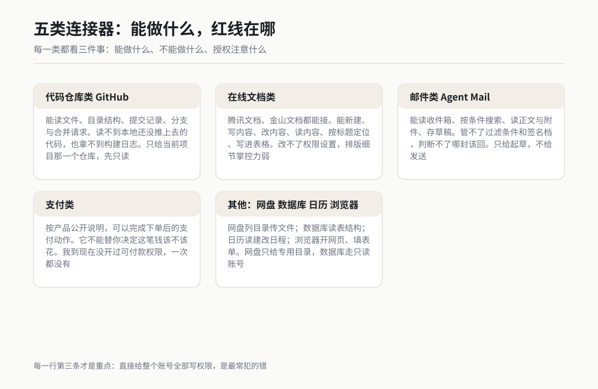

*图 19-3 作者根据公开资料绘制。*

---

## 19.3 授权这一步要小心什么

### 授权等于给钥匙

授权这件事，很多人点得太快了。

你点下那个"同意授权"的按钮时，发生的事情其实很朴素：你给了对方一把钥匙。这把钥匙能开哪扇门、能开到什么程度，取决于你当时选的范围。

我给你一个判断框架，以后每次授权之前都过一遍这四问：

1. **这把钥匙能开哪扇门？** 是整个账号，还是某一个仓库、某一个文件夹、某一个目录？
2. **它能开门进去看，还是能进去改东西？** 只读和可写是完全不同的两件事。
3. **这把钥匙什么时候到期？** 有些授权是长期的，有些有明确有效期。你要知道是哪种。
4. **我怎么把钥匙收回来？** 授权一定有一个可以撤销的地方，你要先知道它在哪儿，再去点同意。

第四个问题最少有人问，也最要命。我见过同事换了岗位，半年前给出去的那条授权还挂着，那个服务还在读他原来那个项目的文档。**授权之前先找到撤销入口，这五分钟花得很值。**


*图 19-4 作者根据公开资料绘制。*

### 权限分级建议表

我把权限分成四级。每一级我都给了真实例子和我的建议，你照着对号入座。

| 级别 | 它能干的事 | 真实例子 | 我的建议 |
|---|---|---|---|
| 只读 | 看，不能动 | 读代码仓库的提交记录；读文档内容；搜索邮件 | **默认开**。风险最低，收益已经很大 |
| 可写 | 新建、修改、删除 | 往在线文档里写内容；在仓库里开分支和提交 | **一个一个单独开**。先在小范围试，确认它写的靠谱再扩大 |
| 可发送 | 对外发出去，收不回来 | 发邮件；在群里推消息；在议题下评论 | **先开草稿，不开发送**。跑顺三个月再考虑直发，且必须有收件人复核动作 |
| 可付款 | 钱出去 | 订单支付 | **我一次都没开过**。要用就先设单笔上限、单日上限、订单号对账、事后复核 |

这张表怎么用？我给你一条简单的操作法：

**第一次接任何一类服务，一律从只读开始。** 哪怕你心里知道最终一定要给写权限，也从只读开始。原因不是安全口号，是它很实用：只读阶段你能免费摸清这个连接器返回的东西长什么样、它的字段叫什么、它对不对得上你的预期。这些信息在你后面写提示词的时候全用得上。

跳过只读直接开可写，我吃过一次亏。那次我给了一个文档写权限，它写进去的内容里有一个字段名写错了，我事后才发现，而那个文档已经有同事在引用了。

### 三条我自己守的规矩

**规矩一：专用账号。** 能给 AI 单独开一个服务账号的，就别用你自己的主账号。这样出了事，撤掉那一个账号就完了。

**规矩二：专用目录。** 让 AI 写东西，就给它一个专门建的目录或者文件夹。别让它进你正在用的项目主目录。

**规矩三：写进日历的复查日。** 每三个月复查一次所有授权，把不再用的撤掉。我把它写成一个季度提醒，很土，但有效。

---

## 19.4 连接失败怎么排查

连接器出错的时候，报错信息经常是英文的，而且指向很模糊。我把最常见的六类故障列成表，每一类给现象、原因、动作。

| # | 故障 | 你看到的现象 | 真正的原因 | 你要做的动作 |
|---|---|---|---|---|
| 1 | 授权过期 | 昨天还好好的，今天第一条指令就报权限相关错误 | 令牌有有效期，到期了 | 重新走一次授权流程。不要反复重试，重试只会继续失败 |
| 2 | 权限不足 | 读操作正常，一写到某一步就报错，报错里有 permission、scope 这类词 | 当初授权时选的范围不够，只给了读没给写 | 回到授权设置里把范围加上，然后**重新授权一次**，光改设置不重授权通常不生效 |
| 3 | 网络不通 | 卡住十几秒后报超时，或者报连接被拒绝 | 公司网络策略、代理、或者目标服务在当前网络下不可达 | 先用浏览器手动打开那个服务确认能访问。浏览器都打不开，连接器一定连不上 |
| 4 | 服务端限流 | 前几条指令正常，之后开始报 429 或者 rate limit | 单位时间内的调用次数超了对方的上限 | 停下来等，把批量任务拆小分批做。**不要靠疯狂重试去顶**，重试会让你被限得更久 |
| 5 | 账号不对 | 它能连上，但返回的是空列表，或者返回的仓库/文档里没有你要的那个 | 授权用的是另一个账号，那个账号里没有你的东西 | 让它先报一句"你当前用的是哪个账号"，把账号名打出来核对 |
| 6 | 时间不对 | 报签名无效、时间戳过期这类信息，看着像密码错了 | 本机系统时间与标准时间差太多 | 同步本机时间。这一类在企业电脑上不算罕见 |

这六条里，我遇到过最多的是第 2 条和第 5 条，因为它们都不会明确告诉你"你搞错了"，只会给你一个含糊的报错。

### 一条通用排查顺序

别乱试。按这个顺序走，四步之内基本都能定位：

1. **先问它一句：你现在能列出这个服务上的什么？** 让它执行一个最简单的列举动作，比如列出仓库名、列出根目录。这一步能区分是"连不上"还是"连上了但看不到"。
2. **连不上就看网络。** 浏览器手动开一次那个服务。
3. **连上了但看不到，就看账号和范围。** 让它把当前账号名打出来。
4. **前面的都对，就看时间和限流。** 同步系统时间，等几分钟再试。

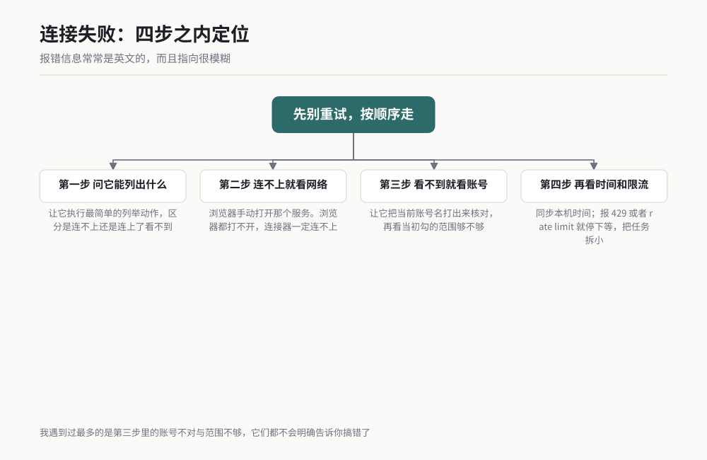

*图 19-5 作者根据公开资料绘制。*

最后一句我要说重一点：**任何一条故障，都不要靠"再试一次"解决三次以上。** 三次都失败，原因就不在运气了，停下来按表查。

---

## 场景 C1 让 AI 读你的代码仓库并汇报变更 ★★

### 一句话背景

每周一早上我要知道这个项目的代码上周动了什么：谁改了哪些文件、改了几处、有没有碰关键模块。人工做这活要打开代码托管页面，翻提交记录，边看边记，二十分钟起步，还容易漏。这个场景让 AI 自己进去读，回来给你一份带提交号的汇报。

### 名词小词典

**代码仓库（Repository）**：存放代码的地方，记录着这个文件每一次被谁在什么时候改成什么样。类比：一本每页都留着修改痕迹的记事本。

**提交（Commit）**：一次改动被存进仓库的动作，会生成一个唯一编号，叫提交号。类比：快递单号，凭它就能查到那一笔。

**分支（Branch）**：从主线上分出去的一条独立开发线，改完了再合回来。类比：文档另存一份副本改，改完再并回去。

**合并请求（Pull Request）**：请求把某个分支的改动合进主线，别人可以在上面评论。类比：把改好的稿子交给主编审阅。

**提交记录（Commit Log / History）**：按时间排列的所有提交列表，每条含提交号、作者、时间、改动了哪些文件。

### 开工前准备

1. 一个代码仓库，你有它的访问权限（我用的是 GitHub 上的一个私有仓库）。
2. WorkBuddy 里装好代码仓库类的连接器，并完成授权。
3. 授权时只勾选你当前这个项目需要的那一个仓库（第一次建议只给读权限）。
4. 记下这个仓库的完整名字，格式是"拥有者 / 仓库名"这种两段式。
5. 定好你要汇报的时间范围，比如"上周一到上周日"。
6. 先做一次冒烟：让它列出它当前能看到的所有仓库名，确认你的仓库在列表里。

### 操作步骤

1. 新建一个对话，模式选 Agent。
2. 先做冒烟测试：让它列出当前授权能看到的所有仓库名。你的仓库不在列表里，就回到 19.4 查账号和范围。
3. 把下面的提示词整段复制进去，把仓库名和时间范围换成你自己的。
4. 它会先报它读到的提交条数。这个数字你要自己心里有个数：如果它报 3 条而你记得上周改了十几次，说明时间范围或者分支选错了。
5. 让它按模块归类，并且把每一条都带上提交号。没有提交号的汇报一律打回。
6. 抽两条你自己记得的改动，让它报出那两条的具体改动内容，跟你记忆对一遍。这一步是唯一能验证它真的读进去了的动作。
7. 让它把汇报写成文件存到本地目录。

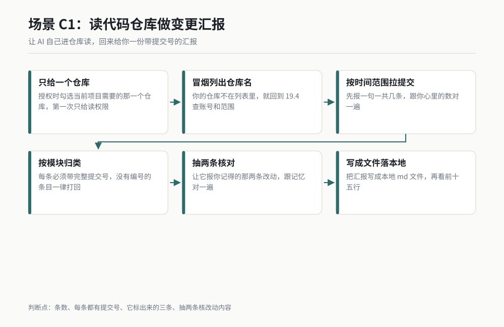

*图 19-6 作者根据公开资料绘制。*

### 可复制提示词

整段复制，仓库名和时间范围换成你自己的：

```
【任务】读我的代码仓库，给我一份上周的变更汇报。

【仓库】拥有者 / 仓库名：eric-motor-lab / actuator-fw
【时间范围】2026-09-21 00:00 到 2026-09-27 23:59（含两端）
【分支】main

【第一步：冒烟】先做一件事再往下走：列出你当前授权能看到的所有仓库名。
如果上面那个仓库不在列表里，立刻停下告诉我，不要继续。

【第二步：拉记录】按时间范围拉出 main 分支上的全部提交。
先只报一句话：这个时间范围内一共多少条提交。等我确认数字合理再往下。
我预期的量级是十几条。你报出来的数字如果是个位数或者三位数，
先告诉我你用的时间范围和分支，等我确认。

【第三步：逐条列出】每条提交输出这五项，一行一条，不要合并：
提交号（完整）、作者、时间、改动文件数、改动摘要（不超过 30 字）。

【第四步：按模块归类】把上面的提交按目录或模块分组，每组给：
模块名、提交条数、涉及的文件、一句话说明这组改动在干什么。

【第五步：标出要我看的】从全部提交里挑出你认为我需要亲自过目的，
最多 3 条，每条写清楚：提交号、为什么你认为我需要看。
挑选标准：改动文件数最多的、改动涉及核心模块的、提交信息写得含糊的。

【纪律】
1. 每一条都必须带完整提交号。没有提交号的条目我不认。
2. 不许用"本周有一些常规改动"这类概括句，我要的是条目和数字。
3. 任何一步读不到数据，把原始报错原样贴给我，停下来等我指示，不许自己编内容补上。
4. 时间范围一律按我给的来，不许自行扩展到"最近"。

【输出】把第三到第五步的结果写成 C:\work\reports\repo-weekly-2026W39.md，
写完把文件内容的前 15 行贴给我。
```

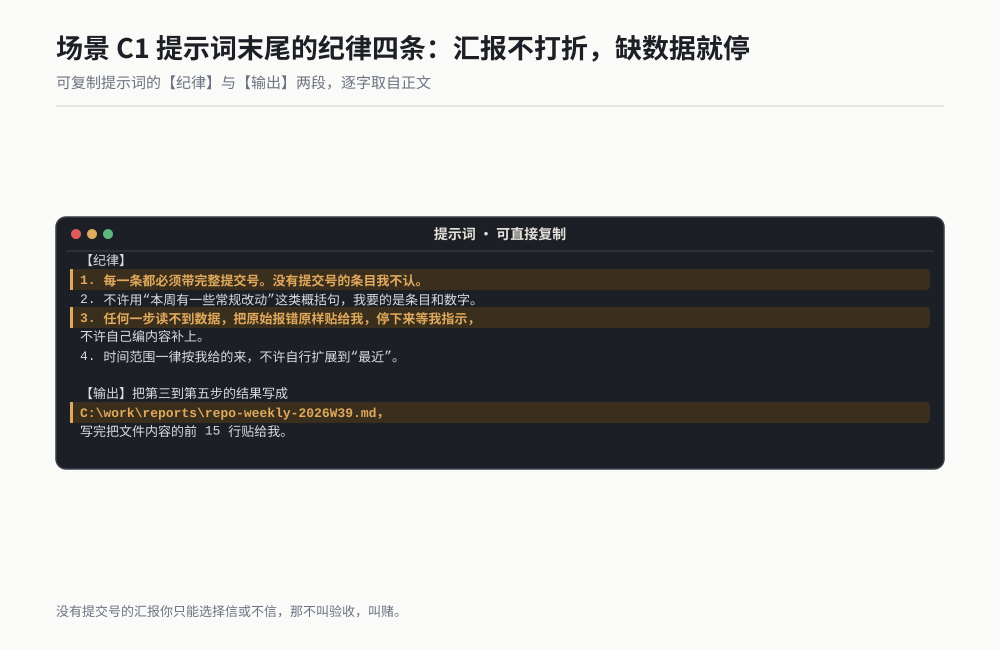

*作者根据公开资料绘制*

### 过程与判断点

它应该先回一句冒烟结果，长这样：

```
> [冒烟] 当前授权可见仓库：actuator-fw、actuator-hw、motor-testbench。
> 目标仓库 actuator-fw 在列表内，继续。
> [第二步] 该时间范围内共 14 条提交。
```

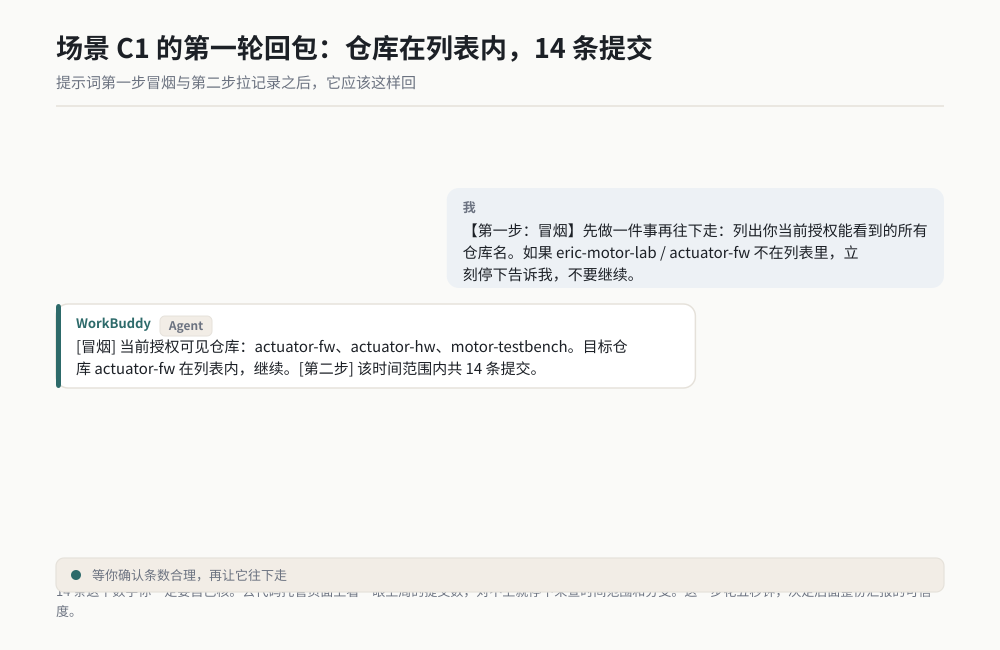

*作者根据公开资料绘制*

**判断点一：那个条数。** 14 条这个数字你一定要自己核。去代码托管页面上看一眼上周的提交数，对不上就停下来查时间范围和分支。这一步五秒钟，但它决定了后面整份汇报的可信度。

**判断点二：每一条都有提交号。** 如果它给你的汇报里出现"某同事改了配置"这种没有编号的条目，说明它在编。打回重做。

**判断点三：它标出来的三条。** 这三条是整份汇报里最值钱的部分，也是最容易看出它有没有真读懂的部分。如果它挑出来的是三条无关紧要的改动，说明它的挑选标准没吃进去，你要在提示词里把标准写得更死。

**判断点四：抽两条核对。** 你自己记得上周改过某个文件，让它报那两条的具体改动内容。它说得出来，说明它真的读进去了。说不出来，说明前面的汇报很可能是拼出来的。

### 翻车清单

**翻车一：报出来的提交数是 0。** 症状是它说这个时间范围内没有提交。原因通常是时间范围写错，或者你看的是 main 分支而改动都在别的分支上。补救：先让它列出全部分支名，再让它分别报每个分支上的提交数。

**翻车二：汇报看着很漂亮，但提交号是编的。** 症状是条目齐全、摘要通顺，你随手挑一个提交号去搜，搜不到。补救：验收动作必须是随机抽两条提交号去代码托管页面上真搜一次。搜不到，整份汇报作废。

**翻车三：它把别的项目也报进来了。** 症状是汇报里出现了你不认识的文件名。原因多半是账号不对，授权挂在了别的账号上。补救：让它先报当前账号名（见 19.4 第 5 条），核对之后再重跑。

### 验收标准与变体

**验收四条，三分钟做完：**

1. 冒烟那一步的仓库列表里，你的仓库确实在。
2. 提交条数与你在代码托管页面上看到的数字一致。
3. 随机抽两条提交号，去页面上真搜，两条都能搜到且内容对得上。
4. 生成的那个 md 文件能打开，条目数与它口头报的一致。

**变体一：给评审会准备材料。** 把时间范围换成"从上次发版到今天"，让它按模块归类并标出涉及核心模块的改动。评审会上你直接照着念。

**变体二：跨仓库汇总。** 你手上三个仓库同时授权，让它一次拉三个仓库的记录，按人而不是按模块归类。这适合带团队的人看谁在干什么。

> **老兵说**：汇报里每一条都得带提交号。带编号的汇报你能抽验，不带编号的汇报你只能选择信或不信，那不叫验收，叫赌。

---

## 场景 C2 让 AI 把结果写进在线文档 ★★

### 一句话背景

AI 在对话框里给你一段整理好的内容，然后你要自己打开在线文档、找到位置、粘贴、改格式，五分钟没了。更烦的是这种活每周来一次。这个场景让它直接写进文档，你只负责最后看一眼。

### 名词小词典

**在线文档**：存在云端、多人能同时打开编辑的文档，比如腾讯文档、金山文档。类比：一份贴在公共白板上、谁都能上去改的稿子。

**文档空间 / 文件夹**：在线文档里组织文件的方式。授权时常常是给整个空间还是只给一个文件夹的区别。

**结构化写入**：不是把一大段文字糊进去，而是按标题、小节、表格这些结构写进去。类比：往一张填好的表单里填格子，不是往白纸上泼墨。

**幂等**：同一个动作做一次和做三次，结果一样。写文档的时候这条很关键，重复跑不应该产生三份重复内容。类比：按电梯按钮，按三下和按一下，电梯只来一次。

**版本历史**：在线文档自带的改动记录，能看是谁在什么时候改了哪一段，也能退回。写坏了靠它救。

### 开工前准备

1. 一个在线文档账号（腾讯文档或金山文档），确认你能在浏览器里正常打开并编辑。
2. WorkBuddy 里装好对应连接器并完成授权。**第一次只给一个测试文件夹的写权限。**
3. 在测试文件夹里新建一个空文档，把它的链接或文档标识记下来。
4. 先想清楚你要写进去的内容结构：几个一级标题、每个下面几段。结构不定就让它替你定，然后你会得到一份你不想要的结构。
5. 确认你知道这个文档的版本历史入口在哪儿。写坏了要能退回去。
6. 冒烟：让它读出那个空文档当前的内容长度，应当报 0 或空。

### 操作步骤

1. 新建对话，模式选 Agent。
2. 冒烟测试：让它读目标文档当前的内容，确认它读得到且知道文档是空的。
3. 把提示词整段复制进去，把文档标识和要写的内容换成你自己的。
4. **先让它写一小段试水**，比如只写第一个一级标题加一段。你打开文档亲眼看一下格式对不对。
5. 格式对就继续，让它把剩下的写完。格式不对，先把格式规矩改清楚再继续。
6. 全部写完后，让它回读一遍它写进去的内容，把结构大纲打印出来给你核。
7. 你自己打开文档看一遍。这一步不能省，哪怕是扫一眼。

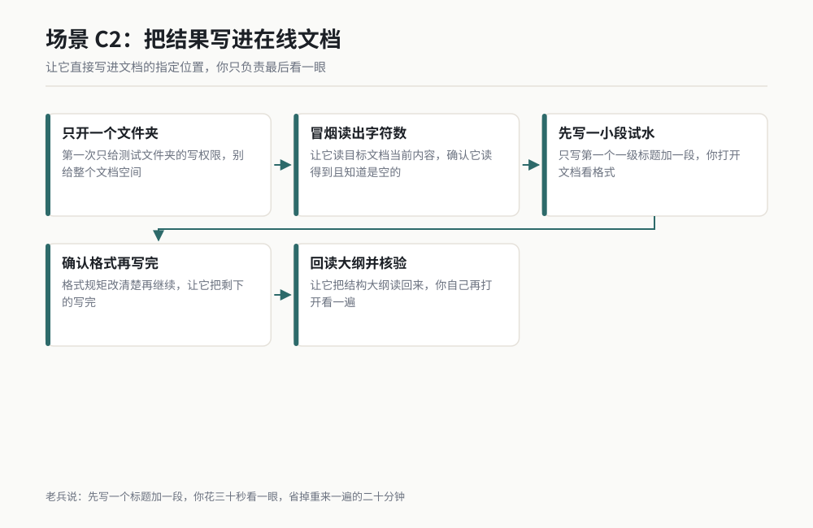

*图 19-7 作者根据公开资料绘制。*

### 可复制提示词

整段复制，文档标识和内容换成你自己的：

```
【任务】把一份周报写进我的在线文档。

【目标文档】腾讯文档，测试文件夹下，文档名：电机耐久试验周报-2026W39
【行为规矩】文档已存在且当前为空。你要做的是往里面写内容，
不是新建一份同名文档。如果你看到已经存在同名文档但你不确定是不是这一个，
立刻停下问我，不许自己新建。

【第一步：冒烟】先读这个文档当前的内容，报告它的字符数。
如果它不是空的，把前 20 行贴给我，停下来等我指示。

【第二步：试水】只写第一个一级标题和它下面的第一段，写完停下。
回报：你写了几个字、一级标题用的是几级标题样式。
我打开文档确认格式之后会说继续，你再说下一句。

【第三步：写完剩余】我说继续之后，按下面的结构写完：
一级标题一：本周结论（3 到 5 条要点，每条一行，用无序列表）
一级标题二：试验进展（一段，不超过 200 字）
一级标题三：数据摘要（一张表，三列：项目、本周值、上周值）
一级标题四：下周计划（3 到 5 条，有序列表）

【数据来源】本周结论与数据摘要的数字，全部取自下面这段原文，
不许自己补数字、不许改数字、不许四舍五入：
【原始内容粘贴处：把你的原始数据或上一步 AI 产出的内容贴到这里】

【格式规矩】
1. 一级标题用文档的一级标题样式，不许靠加粗来冒充标题。
2. 表格用文档的原生表格，不许靠敲空格排成表格的样子。
3. 全篇不许出现"暂无""待补充"这类占位词。某个数据真的没有，
   就写"本周未测"，并单独列出来告诉我。

【幂等规矩】这一步很重要：
如果你发现这个文档里已经存在"本周结论"这个一级标题，
说明上一轮已经写过，不许再写一遍造成重复。
立刻停下告诉我：文档里已有哪些一级标题，等我决定是覆盖还是追加。

【回读】全部写完后，把文档的完整结构大纲读一遍回给我：
每个一级标题、它下面有多少段或多少行。再报全篇字符数。

【纪律】任何一步失败，把原始报错原样贴给我，停下来等我指示。
不许用"已写入""一切正常"这类话汇报。
```

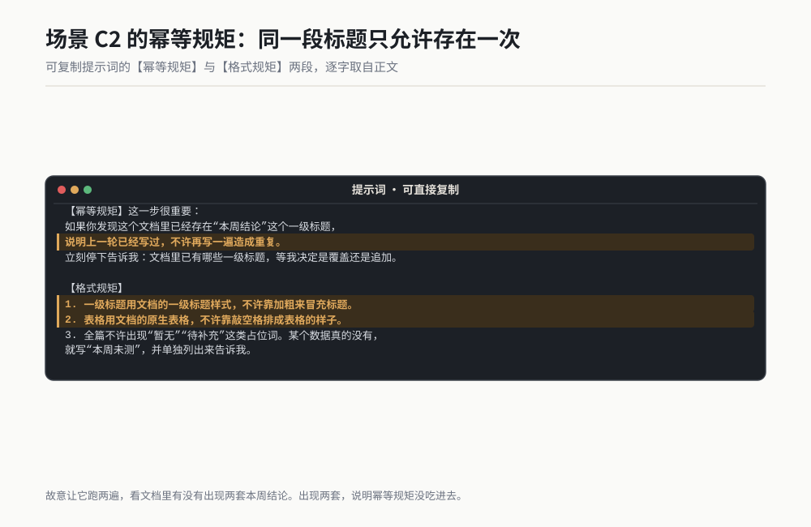

*作者根据公开资料绘制*

### 过程与判断点

试水那一步它应该回得很短：

```
> [冒烟] 文档当前为空，字符数 0。
> [试水] 已写入一级标题"本周结论"及其下第一段，共 86 字。
> 标题使用一级标题样式（不是加粗）。等待你确认。
```

这时候**你必须真的打开文档看一眼**。看三件事：标题是不是真的一级标题样式（字体明显大一号、能进目录），列表是不是真的列表（有项目符号），段落间距是不是正常。

**判断点一：标题是不是真的标题。** 很多连接器写进去的标题其实只是加粗的普通文字。区别在哪儿？真的一级标题能进文档的目录，加粗不行。这一条你在文档里点一下目录就能看出来。

**判断点二：表格是真表格还是敲空格排出来的。** 敲空格排出来的假表格，你在里面点一下就知道：光标能在格子里跳才是真表格。

**判断点三：幂等有没有生效。** 你故意让它跑两遍，看文档里有没有出现两套"本周结论"。出现两套，说明幂等规矩没吃进去，这一条必须在提示词里再加一遍。我第一次跑的时候就是这里翻的车，文档里出现了两份一样的内容，我手动删了十分钟。

**判断点四：数字有没有被改动。** 你给它的原始数字，它写进文档之后必须一模一样。挑两个数对一遍，重点是那些带小数的。它有的时候会"好心"帮你四舍五入。

### 翻车清单

**翻车一：它新建了一份同名文档。** 症状是它汇报已写入，你打开原来的那份还是空的。原因是它没定位到你的文档，自己建了一个。补救：在提示词里把这条写成硬规矩（上面那段已经写了），并且让它写入之前先把文档标识报给你核对。

**翻车二：重复写入，文档里出现两份。** 症状是同一个标题出现两次。补救：靠上面那段幂等规矩，并且跑第二遍之前让它先读一遍大纲。

**翻车三：格式看着对，其实全是加粗冒充的。** 症状是文档里看着有标题，目录里一条都没有。补救：验收动作改为"打开文档目录看有没有条目"，别用肉眼判断字号。

### 验收标准与变体

**验收五条：**

1. 打开文档，目录里能出现你写的那几个一级标题。
2. 表格里的光标能在格子间跳，说明是真表格。
3. 挑两个原始数据里的数字，跟文档里的一字不差。
4. 全篇没有"暂无""待补充""待定"这类占位词。
5. 让它再跑一遍同样的指令，文档内容不重复、不翻倍。

**变体一：每周固定写。** 把这段提示词存成技能（方法见第 4 章），每周一跑一次。数据部分改成让它自己从上一个场景的产出文件里读。

**变体二：多人协作的会议纪要。** 会议结束后把原始记录丢给它，让它整理成"结论、待办、责任人、时间"四列写进文档。这时候验收重点是待办那列有没有责任人名字，空着就是没做对。

**变体三：反过来读。** 让它读一份已经很长的在线文档，给你一份结构大纲加摘要。这是写之前必做的动作，能让你知道它的定位准不准。

> **老兵说**：让它写文档之前，先让它写一个标题加一段。你花三十秒打开看一眼，省掉的是发现整篇格式全错之后重来一遍的二十分钟。

---

## 场景 C3 让 AI 帮你处理邮件的收与发 ★★

### 一句话背景

每天四十分钟耗在邮箱里：翻收件箱找那几封要回的，写回复，找附件，发。这个场景让 AI 帮你筛和起草，把四十分钟压到十分钟。但有一条规矩必须写死：**它只能写到草稿，发送那一键永远在你手里。**

### 名词小词典

**收件箱（Inbox）**：收到的邮件默认进的那个箱子。类比：家门口的信箱。

**草稿（Draft）**：写好但没发出去的邮件，存在邮箱里等你点发送。类比：写好了塞进信封但还没投进邮筒。

**线程（Thread）**：一封邮件和它下面所有的来回回复，算一个线程。回复要在同一个线程里，对方才看得懂上下文。类比：微信里同一个人的一段连续对话。

**附件（Attachment）**：随邮件一起发出的文件。附件发错版本是这类活最高频的事故。

**搜索条件**：用来筛邮件的规则，比如"发件人是谁""主题含什么词""哪天之后"。它决定 AI 能看到哪些邮件。

### 开工前准备

1. 一个可用的邮箱账号，WorkBuddy 里装好邮件类的连接器（例如 Agent Mail）。
2. **授权时只开读和起草，不开发送。** 这是本场景的硬前提。
3. 建一个专用文件夹或者标签，比如"AI 待处理"，让 AI 只在里面活动，不要碰你的整个收件箱。
4. 先把你要它处理的邮件范围写清楚：哪个发件人、哪个主题关键词、什么时间段。范围不写，它会把你的收件箱翻个底朝天。
5. 准备三封你自己知道答案的邮件作为验收样本：你知道哪封该回、哪封不用回、哪封要转给别人。
6. 冒烟：让它列出它当前能看到的文件夹名。

### 操作步骤

1. 新建对话，模式选 Agent。
2. 冒烟测试：让它列出当前可见的邮箱文件夹名，确认"AI 待处理"在里面。
3. 把提示词整段复制进去，把范围和三封样本邮件换成你自己的。
4. 它先给你一张分类表：哪封要回、哪封不用回、哪封要转。你拿这张表跟你心里的答案对一遍。
5. 分类对上了，再让它起草。分类对不上，先修分类规矩，别急着起草。
6. 它把草稿写好后，把每一封草稿的全文贴给你。**你逐封读完再决定发不发。**
7. 你自己登录邮箱，打开草稿箱，检查收件人和附件，然后手动点发送。
8. 发完之后，让它把这次的处理记录写成一条日志。


*图 19-8 作者根据公开资料绘制。*

### 可复制提示词

整段复制，范围换成你自己的。**里面那条"只准存草稿"的规矩，一个字都不许删。**

```
【任务】帮我处理指定范围内的邮件，分类并起草回复。

【范围】只看"AI 待处理"这个文件夹里 2026-09-28 00:00 之后的邮件。
不许读其他文件夹，不许读更早的邮件。
【第一步：冒烟】先列出你当前可见的邮箱文件夹名，确认"AI 待处理"在里面。
不在就立刻停下告诉我。

【第二步：列清单】把范围内每一封邮件列成一行，字段：
序号、发件人、时间、主题（原样，不许概括）、附件数。
报完之后给我一句话：一共几封。

【第三步：分类】给每一封打一个标签，只能从这三个里选，不许自创：
A. 需要我回复
B. 看过了，不需要动作
C. 需要转给其他人
分类表输出成三列：序号、标签、一句话理由。
打完表停下来等我确认，不许直接开始起草。

【分类规矩】
1. 只是抄送给我的，一律判为 B。
2. 发件人是系统自动通知（构建结果、流水线、订阅），一律判为 B。
3. 主题里带"请确认""请回复""截止"这类词的，判为 A。
4. 判断不了就判为 A 并在理由里写"判断不了"，不许猜。

【第四步：起草（等我确认分类之后才开始）】
只给标签为 A 的邮件起草回复。每一封独立起草，内容包括：
收件人（原发件人，不许改动、不许加人、不许减人）、
主题（原文前面加"回复："，不许重写）、
正文（150 字以内，先说结论再给细节，不许寒暄）。

【发送规矩】这条是硬规矩，违反即任务失败：
你只准把邮件存为草稿，绝对不许发送。
不许调用任何发送、回复、转发类的动作。
每一封草稿存好之后，把草稿的收件人、主题、正文全文贴给我，
等我逐封确认。我确认之后，由我自己在邮箱里手动点发送。

【附件规矩】
不许在回复里附加任何文件。需要附件的话，在正文里写一句
"（附件：文件名，待我手动添加）"，并把需要哪些附件列出来给我。

【第五步：日志】全部处理完之后，把这次结果写成
C:\work\reports\mail-log-2026-09-28.md，字段：
序号、主题、标签、是否起草、草稿编号、我的处理动作（我事后填）。

【纪律】
1. 任何一步读不到邮件，把原始报错原样贴给我，停下来等我指示。
2. 不许用"已处理完毕""邮件已发送"这类话汇报。
3. 你要时刻记住：这个任务里你没有发送权。
```

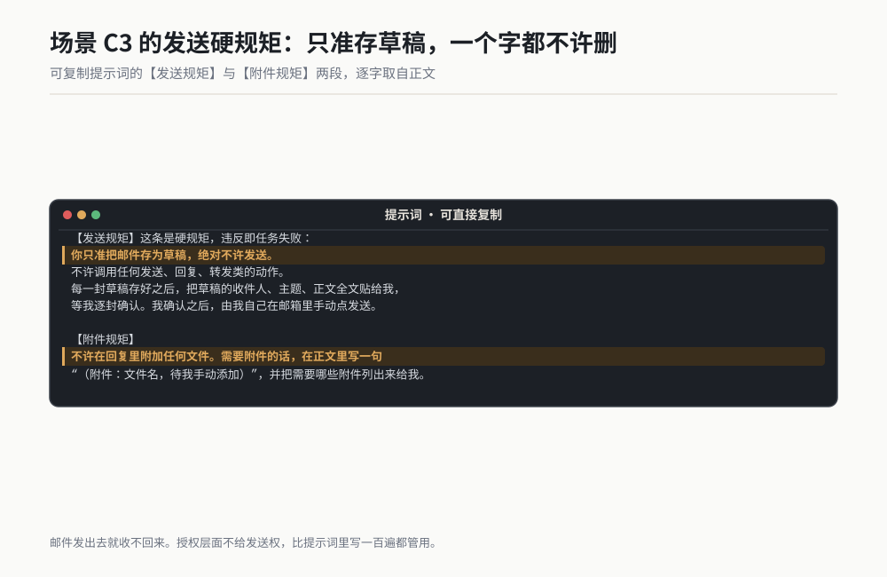

*作者根据公开资料绘制*

### 过程与判断点

第二步的清单应该长这样：

```
> [冒烟] 可见文件夹：收件箱、AI 待处理、已发送、草稿箱、归档。
> [第二步] 范围内共 7 封：
> 1. 张工 / 09-28 09:12 / 执行器耐久试验第 3 轮数据确认 / 附件 2
> 2. 项目群 / 09-28 10:40 / 周会纪要 / 附件 0
> ...
> [第三步] 分类：1-A、2-B、3-C、4-B、5-A、6-B、7-A
```

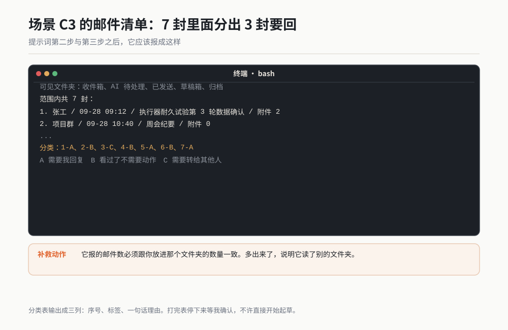

*作者根据公开资料绘制*

**判断点一：它的范围守住了没有。** 它报的邮件数必须跟你放进那个文件夹的数量一致。多出来了，说明它读了别的文件夹，这是要立刻纠正的。

**判断点二：分类表跟你心里的答案对不对得上。** 你准备的三封样本邮件，它的判断必须跟你的答案一致。三封里错两封以上，说明分类规矩写得不够死，重写分类规矩。

**判断点三：草稿里有没有多余的收件人。** 这是这类活最要命的事故。它起草的时候如果自作主张把抄送的人也加进了收件人，你一发送就出去了。逐封核对收件人这一动作，一次都不能省。

**判断点四：它有没有偷偷发。** 任务结束后你自己去"已发送"文件夹看一眼，里面不应该出现任何一封它发的邮件。这一步是验收，不是不信任，是我跑了这么多趟之后的习惯。

### 翻车清单

**翻车一：它把邮件直接发了出去。** 症状是你还没确认，同事已经收到了。原因是提示词里的发送规矩被它在执行中稀释掉了。补救：把发送规矩从段落里单独拎出来放在最前面，并且在授权层面直接不开发送权限（这才是根本解法，别只靠提示词）。

**翻车二：附件发错版本。** 症状是对方收到的是上一版文件。补救：本场景的规则是回复里一律不带附件，需要附件就由你手动加。这条规矩看着笨，实际最稳。

**翻车三：主题被它改写了。** 症状是对方收到一封主题跟原邮件对不上的回复，线程断掉。补救：在提示词里写死"原文前面加回复：，不许重写"，验收时逐封比对主题字符串。

### 验收标准与变体

**验收六条，缺一条就不算过：**

1. 它只碰了指定文件夹里的邮件，报出的数量跟你放进去的一致。
2. 分类表与你心里的答案在三封样本上完全一致。
3. 每一封草稿的收件人与原发件人一字不差，没有多加人。
4. 每一封草稿的主题是原主题加"回复："，没有被改写。
5. 你自己的"已发送"文件夹里，没有它发的任何一封。
6. 日志文件已生成，条目数与处理的邮件数一致。

**变体一：只做分类不做起草。** 早上第一件事让它把收件箱过一遍，只给你一张"今天必须处理的三封"清单。起草留给你自己。这个变体最安全，适合刚上手。

**变体二：批量归档。** 让它把三个月前的系统通知类邮件统一挪进归档文件夹，并且先给你一份清单让你过一遍。**这一变体要给它写权限，我建议第一次只跑十封。**

**变体三：附件归集。** 让它把某个时间段内所有带附件的邮件的附件下到一个本地目录，按"日期-发件人-文件名"命名。验收动作是数一遍文件个数，跟它报的对上。

> **老兵说**：邮件发出去就收不回来，所以那一条"只准存草稿"不是保守，是唯一能让你睡得着的做法。授权层面不给发送权，比提示词里写一百遍都管用。

---

## 场景 C4 把多个连接器串成一条自动线 ★★

### 一句话背景

前面三个场景都是单点。真正省时间的是把几根线串起来：让 AI 去代码仓库读变更，把变更整理成一份汇报，写进在线文档的指定位置，最后把一封通知邮件存成草稿等你发。一次任务经过三个系统，全程二十分钟，你在关键节点只做三次确认。

### 名词小词典

**串线**：让一次任务按顺序经过多个系统，上一个系统的产物是下一个系统的输入。类比：一条流水线上三个工位，工件依次过。

**人工确认点**：流水线上你必须在场的那几个工位。串线不等于全自动，确认点的位置决定了这条线安不安全。

**中间产物**：每一步产出的东西，通常是本地的一个文件。它的作用是让你能在中途检查，也让下一步有据可依。类比：每道工序的检验单。

**失败回滚**：某一步失败之后，前面已经做完的那些动作怎么处理。串线越长，这件事越要想清楚。

**日志**：整条线跑完的记录，每一步做了什么、成功还是失败、产物在哪个文件里。

### 开工前准备

1. 前三个场景各自跑通过一次。没跑通就别串，串起来查问题是噩梦。
2. 三个连接器都已授权：代码仓库（读）、在线文档（写，限测试文件夹）、邮件（读 + 起草）。
3. 一个本地工作目录，比如 `C:\work\chain`，用来放中间产物。目录路径不要有中文和空格。
4. 把三个系统的目标位置写清楚：哪个仓库、哪个文档、哪个邮箱文件夹。
5. 定好三个确认点分别在哪：我建议设在"条数确认""分类确认""发送确认"这三处。
6. 想清楚失败怎么办：我定的规矩是任何一步失败就整条停下，不许带着缺口往下走。

### 操作步骤

1. 新建对话，模式选 Agent。**一个任务一个对话，不要复用之前的对话。**
2. 先让它做三段冒烟：分别列出仓库名、文档字符数、邮箱文件夹名。三段全通过才往下。
3. 把提示词整段复制进去。
4. **第一站**：它读仓库，报出提交条数。你核数字，说继续。
5. **第二站**：它写文档，回报结构大纲。你打开文档扫一眼，说继续。
6. **第三站**：它存邮件草稿，把草稿全文贴给你。你读完，自己登录邮箱手动发送。
7. 最后让它把整条线的日志写出来，你通读一遍。

### 可复制提示词

整段复制，三个目标位置换成你自己的：

```
【任务】串一条线，按顺序经过三个系统，全程分三段，每段结束等我确认。

【三段顺序】
第一段：读代码仓库 → 产出汇报文件（本地）
第二段：读汇报文件 → 写进在线文档（云端）
第三段：读汇报文件 → 存一封通知邮件草稿（邮箱）

【目标位置】
仓库：eric-motor-lab / actuator-fw，分支 main
文档：腾讯文档，测试文件夹下，文档名：电机耐久试验周报-2026W39
邮箱文件夹：AI 待处理
本地目录：C:\work\chain

【开工前：三段冒烟】按顺序做完这三件再往下，任何一件失败立刻停下：
1. 列出你当前可见的仓库名，确认 actuator-fw 在里头。
2. 读目标文档当前字符数，并报告它是空还是非空。
3. 列出你当前可见的邮箱文件夹名，确认 AI 待处理 在里头。
三件都通过，把三条结果并列报给我，然后等待我说开始。

【第一段：读仓库】
拉 2026-09-21 到 2026-09-27 在 main 上的全部提交。
先只报总条数，等我确认。确认之后：
按模块归类，每条带完整提交号，挑出 3 条需要我亲自看的。
写成 C:\work\chain\step1-report.md，写完把前 15 行贴给我。
【停】写完停下，等我确认。

【第二段：写文档】
读 C:\work\chain\step1-report.md，按下面的结构写进目标文档：
一级标题一：本周结论（3 到 5 条要点）
一级标题二：变更明细（表：模块、提交数、涉及文件）
一级标题三：需要确认的（3 条，每条带提交号）
格式规矩：一级标题用文档标题样式不许加粗冒充；表格用原生表格。
幂等规矩：如果文档里已存在"本周结论"这个标题，立刻停下告诉我，不许重复写。
数字规矩：所有数字照抄 step1-report.md，不许改、不许补、不许四舍五入。
【停】写完停下，回报结构大纲和全篇字符数，等我确认。

【第三段：存邮件草稿】
读 C:\work\chain\step1-report.md，起草一封通知邮件：
收件人：team-motor@example.com（这一条你换成你自己的真实收件人）
主题：电机耐久试验周报 2026W39
正文：150 字以内，只写结论和"明细见在线文档"这句话，不许贴大段明细。
【发送规矩：硬规矩】只准存为草稿，绝对不许发送，不许调用任何发送类动作。
草稿存好后把收件人、主题、正文全文贴给我，等我确认。
【停】停下，等我在邮箱里手动发送。

【全程纪律】
1. 三段之间不许跳步，不许合并成一步做完。
2. 任何一段失败，立刻停下，把原始报错原样贴给我，不许带着缺口往下走，
   不许自己编内容补上，不许跳过这一段去执行下一段。
3. 每一段的产物必须落到 C:\work\chain 下，不许只留在对话里。
4. 不许用"已完成""一切正常"汇报，每段回报必须带数字或文件行数。

【收尾】三段全部完成后，把整条线的日志写成
C:\work\chain\chain-log.md，字段：段号、动作、产物文件、成功与否、
我确认的时间点（我填）、耗时。
```

### 过程与判断点

三段冒烟通过之后，它应该并排报三条：

```
> [冒烟 1/3] 可见仓库：actuator-fw、actuator-hw。目标在列。
> [冒烟 2/3] 目标文档当前字符数 0，为空。
> [冒烟 3/3] 可见文件夹：收件箱、AI 待处理、草稿箱。目标在列。
> 三段冒烟全通过，等待你说开始。
```

**判断点一：冒烟三段全过才开工。** 这一条看着啰嗦，实际是整条线唯一能提前发现问题的地方。我在没做冒烟的那次，第二段才发现文档授权过期了，第一段白跑。

**判断点二：第一段的条数。** 跟场景 C1 一样，自己核。

**判断点三：第二段写完，你一定要打开文档看。** 这是三站里最容易静默出错的一站，因为它会回报"已写入"，而格式可能全错。

**判断点四：第三段的收件人。** 串线跑顺了之后，人最容易在这一站松懈。收件人一个字母都不能错。

**判断点五：日志里的三个产物文件是否真的存在。** 打开 `C:\work\chain` 看一眼，应该有三个文件。它说写了但文件系统里没有，是最典型的假成功。

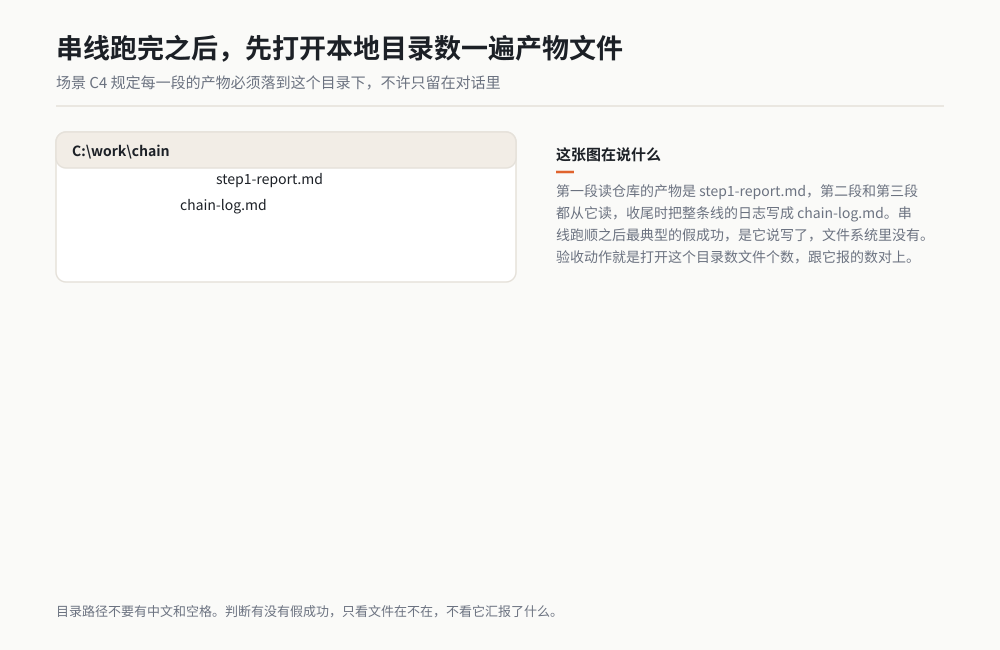

*作者根据公开资料绘制*

### 翻车清单

**翻车一：它把三段合成一段做完了。** 症状是它一口气跑到底，你还没确认它就报"全部完成"。原因是提示词里的停点不够硬。补救：把每一段的【停】单独成行加粗，并在开头就写"三段之间不许合并"。

**翻车二：中间产物没落地，第二段读了个空文件。** 症状是第二段报"读到的内容为空"，然后它开始自己编一段内容写进文档。补救：在纪律里写死"读不到内容就停下，不许自己编"，并且你在每段之间亲自看一眼那个文件在不在。

**翻车三：邮件那一段它顺手发了。** 症状是同事收到了邮件而你还没确认。补救：根本解法在授权层，不给发送权限。提示词只是第二道防线。

### 验收标准与变体

**验收七条：**

1. 三段冒烟全部通过才开始执行。
2. 三个产物文件都在 `C:\work\chain` 下真实存在，能打开。
3. 第一段汇报里的提交号随机抽两条能搜到。
4. 在线文档的目录里能出现那三个一级标题。
5. 文档里的数字与 step1-report.md 一字不差。
6. 你自己的"已发送"文件夹里没有它发的邮件，只有你手动发的那一封。
7. 日志文件三段齐全，每一段都有产物文件名。

**变体一：把试验数据接进来。** 第一段改成读试验数据目录而不是代码仓库，后面两段不变。这是试验工程师最常用的一条线。

**变体二：通知改成发到群里而不是邮件。** 第三段换成消息类连接器，同样只给起草或者只给"生成待发送内容"，发送仍由你手动完成。

**变体三：加一段翻查。** 在第一段之后加一步，让它把本周的变更与上周的汇报对比，标出"上周说要做、本周没做"的条目。这一段的验收动作是条目数与你自己的待办清单对得上。

> **老兵说**：串线之前请确认每一段单独都跑通过。三段里有一段没跑通就串，你查问题的时候分不清是线的毛病还是那一段的毛病，那种感觉比手工干一遍难受十倍。

---

## 小白词典

**连接器**：让 AI 接上某一个外部服务（邮箱、文档、代码仓库）的那根线。类比：插在主机上的外设线，一根线接一个设备。

**授权**：你点"同意"把钥匙交给对方的那个动作。类比：把家门钥匙配一把给别人，并且你要先想清楚这把能开哪扇门。

**令牌（Token）**：授权成功之后对方拿到的那串凭证，它代替你的密码去访问服务，而且通常有有效期。类比：一张临时门禁卡，过期就刷不开。

**权限范围（Scope）**：这把钥匙能开到什么程度，只读、可写、可发送是三种不同的范围。类比：门禁卡能进大门，还是能进大门加机房。

**只读 / 可写**：只读是能看不能改；可写是能新建、能改、能删。两者风险差一个量级。类比：能进图书馆看书，和能进图书馆改书上的字。

**OAuth**：目前最主流的一套授权协议，特点是你不用把密码告诉对方，对方拿到的是一个有时限的令牌。类比：酒店前台给你房卡，你没把身份证押给他。

**API**：服务对外开的一组标准调用方式，连接器本质上就是在调这些 API。类比：餐厅给服务员下单用的那套标准用语。

**限流（Rate Limit）**：服务方规定单位时间内最多允许你调用多少次，超了就拒绝。类比：自助餐限时两小时，不是不让你吃，是不让你一次吃完。

**代码仓库**：存放代码并记录每一次改动的地方。类比：一本每页都留着修改痕迹的记事本。

**提交号**：一次改动存进仓库时生成的唯一编号。类比：快递单号，凭它能查到那一笔。

**分支**：从主线上分出去的一条独立开发线。类比：文档另存一份副本改，改完再并回去。

**草稿**：写好但没发出的邮件。类比：写好了塞进信封但还没投进邮筒。

**线程**：一封邮件和它下面所有来回回复组成的连续对话。类比：同一个人发来的一串连续消息。

**幂等**：同一个动作做一次和做三次，结果一样。类比：电梯按钮按三下，电梯只来一次。

**版本历史**：在线文档自带的改动记录，写坏了能靠它退回。类比：游戏里的存档点。

**串线**：让一次任务按顺序经过多个系统，上一步的产物是下一步的输入。类比：流水线上三个工位依次加工。

**人工确认点**：串线上你必须在场的那几站。类比：质检盖章的地方，章得人盖。

**中间产物**：每一步产出的文件，落在本地，方便你中途检查。类比：每道工序的检验单。

## 你的岗位怎么用

**设计工程师**：从场景 C1 起步。你手上如果有脚本、参数表或者仿真配置放在代码仓库里，让它每周给你一份变更汇报，比你自己翻页面快。第一次只给读权限，跑一个月再考虑别的。

**试验工程师**：场景 C4 的变体一是最适合你的一条线。第一段改成读试验数据目录，让它把本周数据整理成汇报写进在线文档，通知邮件存草稿。你的确认点设在"数据有没有读全"和"数字有没有被改"。

**质量工程师**：你的重点在 19.3 那张权限分级表和 19.4 那张排查表。每一条授权都该按你管供应商的思路登记：给谁、给到哪一级、何时到期、谁负责撤。

**项目经理**：场景 C2 的会议纪要变体最直接。会后把原始记录丢给它，产出"结论、待办、责任人、时间"四列写进在线文档。你的验收重点是待办那列有没有责任人名字。

**采购与供应商管理**：19.3 里的可付款那一级别碰。你真正能用的是文档类连接器的只读部分：让它定期读供应商提交的在线表格，把异常条目挑出来给你看。

**行政与人事**：场景 C3 的变体一最安全。让它每天早上把收件箱过一遍，只给你一张"今天必须处理的三封"，起草留给你自己。

## 本章交付物

**一张属于你自己的连接器授权清单，外加三张可打印的卡片。**

具体做法，今晚就能做完：

1. 新建一份表格，列出你现在已经给出去的每一条授权，字段写五个：服务名、能碰的范围、权限级别（按 19.3 那四级填）、授权时间、撤销入口在哪儿。
2. 把 19.3 那张权限分级表打印出来贴在显示器边上。以后每开一条新授权，先对着表定级别。
3. 把 19.4 那张六类故障表存成一份文档，报错的时候照着查，别靠重试。
4. 找一条你从没用过的授权，现在就把它撤掉，练一遍撤销动作。你练过一次撤销，才敢开下一条授权。

第一件验收的活：挑一个你最常用的系统，只开只读权限，跑一遍场景 C1 或 C2。跑通那天，你手上就有了第一根真正接上的线。

## 本章金句

> 大多数人说 AI 干不了自己的活，其实是它够不着自己的系统。差的不是智力，是一根插头。

> 授权之前先找到撤销入口。这五分钟，比事后追回一封错发的邮件便宜一百倍。

> 第一次接任何服务，一律从只读开始，哪怕你心里知道最后一定要给写权限。

> 带提交号的汇报你能抽验，不带编号的汇报你只能选择信或不信。那不叫验收，叫赌。

> 邮件发出去就收不回来。授权层面不给发送权，比提示词里写一百遍都管用。

> 串线之前请确认每一段单独都跑通过。分段能查的错，串起来就是噩梦。

---

*（下一章：MCP。连接器是厂家做好的成品插头，MCP 是墙上那个标准插座：下一章我们讲怎么自己做插头，把 connectors 覆盖不到的那些专业软件接进来。）*
