# 第 20 章 MCP：给 AI 装插座 ★★★

> AI 会不会用你的软件，跟它聪不聪明没关系，跟墙上有没有插座有关系。MCP 就是那个插座的标准。

我第一次听说 MCP 是今年八月底，在一个技术群里。有人发了句"装上 MCP 之后 AI 就能直接开 SOLIDWORKS 了"，底下跟了一串英文缩写：MCP、JSON-RPC、stdio、transport、server、tool、schema。

我盯着那串词看了三分钟，一个都没认全。我做微电机和智能执行器研发十一年，跟电机、齿轮、霍尔信号、CAN 报文打了半辈子交道，英文缩写我不怵。可这一串缩写放在一起，我一句也读不懂。

那天晚上我干了一件挺笨的事。我把那串词一个一个抄在纸上，然后去查每一个词是什么意思。查到第三个的时候我卡住了：服务端（server）这个词我知道，公司机房里那台嗡嗡响的机器就是服务器。可这里的"服务端"这两个字，指的是我自己电脑上跑的一个小程序，跟机房里那台嗡嗡响的机器没关系。这两件事有什么关系？

真正让我转过弯来的，是我家书房那个插线板。

我书桌上有一台显示器、一台台式机、一盏台灯、一个手机充电器、一台打印机。它们来自五个不同的厂家，插头形状各不相同，但它们都能插进同一个插线板。插线板不认识打印机，也不需要认识。它只管一件事：把电送过去。厂家管另一件事：把电变成打印动作。中间那层"谁都能插"的规矩，就是标准。

MCP 就是 AI 世界里那个插线板的规矩。AI 是那台需要用电的设备，SOLIDWORKS、Blender、数据库、浏览器、你电脑上的文件夹，都是各种各样的电器。在没有插座的年代，你要让 AI 碰一样东西，就得为这样东西专门写一套接线。有了插座，电器那边只要按规矩做一个插头，AI 那边只要按规矩留一个插孔，两边谁也不用认识谁。

想通这一点之后，那串英文缩写就不再是障碍了。它们只是这套插座规矩里的零件名：客户端是插头那一侧，服务端是电器那一侧，工具是电器上一个个具体的按钮，JSON-RPC 是插头和插座之间说话的格式，stdio 是它们说话用的那根线。

第 10 章我演示过 AI 在 SOLIDWORKS 里从零建出一台方向盘，二十三个零件、六张工程图、干涉零对。那一章讲的是它在软件里按下了什么。这一章讲的是那双手是怎么接上去的，以及你自己怎么插一个。

这一章不难，但它是全书最容易卡住的一章。卡住的原因是它的术语最抽象，一个界面也没有，你敲完配置看不到任何画面变化。我把自己当初卡住的地方全部原样写下来，每个词第一次出现就当场解释。

---

## 20.1 MCP 到底是什么：一张对比表，一张三层图

先把一句话钉死：**MCP（Model Context Protocol）是一套规矩，不是一款软件。** 它规定了两件事：AI 这边怎么开口要工具，软件那边怎么把自己能干的事报上来。规矩定完，两边各自实现，谁也不用管对方内部怎么做的。

### 没有 MCP 的时候是什么样子

没有这套规矩的年代，想让 AI 碰一个软件，只有一条路：为这个软件单独写一套接线。

我在第 10 章提到的那条链路，最初就是这么来的。要用 AI 驱动 SOLIDWORKS，得有人专门写一段程序，把 AI 说的话翻译成 SOLIDWORKS 的 COM 调用。这套线写好了，只能接 SOLIDWORKS。明天你想让它碰 Blender，对不起，重新写一套。后天想让它读数据库，再写一套。

十款软件就是十套接线，十套接线有十种写法、十种报错格式、十种权限模型。这就是为什么早两年 AI  tooling 看着热闹，落到工程现场能用的没几个。

| 对比项 | 没有 MCP | 有 MCP |
|---|---|---|
| 接一个新软件 | 写一套专用接线 | 软件侧按规矩做个服务端 |
| AI 侧的改造 | 每接一样东西都要改一次 | 改一次，以后都一样 |
| 工具清单从哪来 | 写死在代码里 | 服务起来后自己报上来 |
| 换个 AI 工具 | 接线可能要重写 | 配置搬过去就能用 |
| 报错长什么样 | 每套线一个格式 | 统一格式，机器能读 |
| 出问题查谁 | 查那套专属代码 | 查服务、查配置、查权限三段 |

表里有两行最值钱。第三行"工具清单从哪来"，是从写死变成自报。这是本质区别：写死的意思是 AI 那边必须预先知道你会什么，自报的意思是 AI 连上来问一句你就会什么，你新加一个功能它当天就能看见。

第五行"报错长什么样"，对排查的意义被严重低估。统一格式意味着报错可以被机器解析，可以被归类，可以做成排查表。本章 20.7 那八条故障能列出来，靠的就是这个。

### 三层结构：插头、电器、按钮

MCP 的结构只有三层，我用一个比喻讲完。

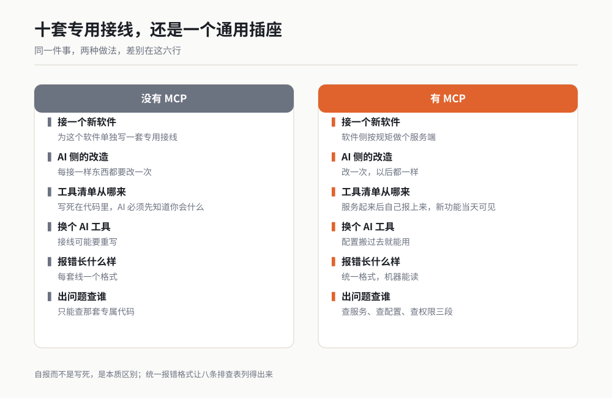

*图 20-1 作者根据公开资料绘制。*

**第一层：客户端（client）。** 就是 AI 那一侧，也就是你正在用的那个工具。它的职责是把 AI 说的话变成一条符合规矩的请求，发出去，等回包，把回包原样交给 AI 看。它不需要知道 SOLIDWORKS 是干什么的，它只知道"我要调一个叫 extrude_feature 的工具，参数是这些"。

**第二层：服务端（server）。** 就是你要接的那个软件那一侧，一个跑在你本机上的小程序。它的职责有两件：一是开机时把自己有哪些工具报给客户端，二是收到调用请求时，把请求翻译成软件真正能听懂的动作。

**第三层：工具（tool）。** 服务端上报的每一个具体动作。一个工具就是一件事，比如"新建一个零件""拉伸 12 毫米""读取当前文档的体积"。

这三层的关系，用我书桌那个插线板讲就是：客户端是插头，服务端是电器和它自带的那个电源适配器，工具是电器面板上的按钮。插头不认识按钮，它只管把电送过去；按钮不认识插头，它只管按下去之后干该干的活。

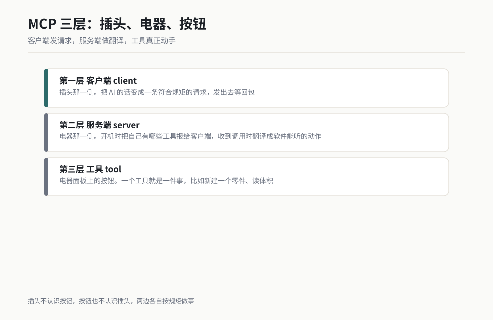

*图 20-2 作者根据公开资料绘制。*

### 一套真实链路长什么样

本机上我跑通的那条链路，是四段，比上面说的三层还多一段。这一段是真实配置，不是示意图：

```
Python MCP 适配器（FastMCP，46 个工具） → HTTP → C# 执行层（本机 5000 端口） → SOLIDWORKS COM
```

拆开看：

- **Python MCP 适配器**是对着 MCP 规矩写的那个服务端，它对外报出 46 个工具。建草图、拉伸、切除、倒圆角、阵列、配合、保存、导出 STEP，全在这 46 个里。
- **中间那层 HTTP** 是它自己的选择。MCP 没规定服务端内部怎么实现，它只规定对外怎么说。这条链路的作者选择让 Python 侧和一个 C# 写的执行层之间走本机 HTTP 通信。
- **C# 执行层**负责真正去敲 SOLIDWORKS 的门。为什么中间要插一层 C#？因为 SOLIDWORKS 对外开的那道门叫 COM，用 C# 去敲比用 Python 稳。
- **SOLIDWORKS COM** 是最后一段，是软件厂商自己提供的对外接口。这一段不属于 MCP，它早就在那儿了，MCP 只是让 AI 的手能够到它。

理解这一段有个很实用的好处：**排查的时候你能一次定位到段。** 工具调不通，先问是哪一段断了。我在 20.7 里给的八条排查，本质就是按段定位。

顺带说一句我一直觉得挺有意思的地方：这条链路里，MCP 只占了最外面那一段。真正让软件动起来的，是 COM 那道门，那道门 SOLIDWORKS 十几年前就开了。MCP 干的事只有一件，把软件已经存在的能力，用一个统一的方式递到 AI 手上。

### 三个最容易搞混的认识

**第一，MCP 不会让 AI 变聪明。** 它给 AI 的是手，不是脑子。装完 MCP 之后，AI 对几何、对公差、对你公司的规矩，理解水平一点没变。它只是从"只能跟你说怎么做"变成"能真的去做"。第 10 章里它建的那台方向盘之所以能验收，靠的不是 MCP，靠的是那套九步流程里每一步都要回报数字。

**第二，MCP 不保证软件愿意被驱动。** 插座接上了，电器得自己有开关。一个软件如果没有对外接口，MCP 也拿它没办法。SOLIDWORKS 能被驱动是因为它有 COM，Blender 能被驱动是因为它有 Python 接口。判断一个软件能不能接，先去查它有没有对外接口。

**第三，MCP 不等于联网。** 绝大多数人第一次听"服务端"三个字，会以为要连到某台服务器上。本机这一类的服务端就跑在你自己的电脑上，走 stdio 或本机端口，数据不出本机。这也是我敢用它碰工程图纸的前提。

> **老兵说**：MCP 不生产能力，它生产"接口一致性"。软件本来就能被程序驱动，MCP 只是让所有软件都用同一种姿势被驱动。

---

## 20.2 它跟连接器、技能是什么关系

这是读者问得最多的一个问题，也是最容易混的三个词。先把结论钉死：**连接器接的是外部在线服务，MCP 接的是你本机和专业软件，技能是一套做事的方法。** 这三者处在不同层次，谈不上谁替代谁。

| 维度 | 连接器（Connector） | MCP 服务端 | 技能（Skill） |
|---|---|---|---|
| 它接的是谁 | 外部在线服务 | 本机资源与专业软件 | 不接东西，它本身就是方法 |
| 跑在哪 | 云端那边 | 你这台电脑上 | 你本机的一份说明文件 |
| 典型例子 | 日历、云盘、工单系统 | SOLIDWORKS、Blender、本地数据库 | 一个建模作业流程、一份体检清单 |
| 谁能做 | 通常由服务方提供 | 谁都能写，开源社区最多 | 你自己就能写，写一份 Markdown |
| 给出去的权限 | 账号里的一部分数据权限 | 可能包含本机文件与进程 | 不给权限，它只教 AI 怎么干 |
| 出问题时查哪儿 | 授权是否过期 | 进程、路径、端口、软件是否开着 | 说明写得清不清楚 |
| 一句话定义 | 替你去别人的系统里办事 | 让 AI 的手伸到你本机上 | 教 AI 按什么顺序办事 |

### 三者怎么配合

我把它们的关系理解成三层：**连接器给 AI 一个身份，MCP 给 AI 一双手，技能给 AI 一份作业指导书。**

举个我自己跑过的例子。我要让 AI 建一个零件并出图。

- 连接器那一层：从云盘上把公司的图纸模板拉下来。这是去别人的系统里办事，需要身份。
- MCP 那一层：驱动本机 SOLIDWORKS 真正把零件建出来并导出 STEP。这是伸到本机上动手。
- 技能那一层：我写好的那份"九步作业单加六行体检查验卡"（第 10 章场景 20 与场景 22），告诉它按什么顺序做、每一步要回报什么数字。

三层各干各的，缺一层这活都干不完整。没有连接器，模板得我自己下载；没有 MCP，它只能给我一份文字方案，动不了软件；没有技能，它会按自己的习惯乱做一通，做出来的东西我验不了。

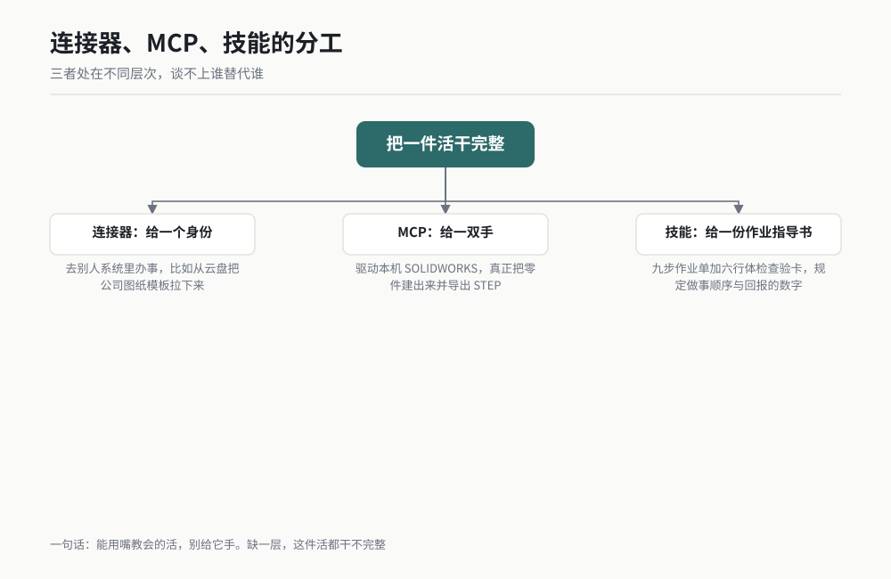

*图 20-3 作者根据公开资料绘制。*

### 一条判断规则

碰到"这件事该用哪个"的时候，用这条规则判断，十秒钟能定下来：

> 这事要不要碰你本机上的东西？要，走 MCP。不要，但需要一个外部账号身份，走连接器。都不要，只是想让它按规矩做事，写个技能。

反过来还有一条更实用的：**能用技能解决的，别开 MCP。** 技能只是一份说明文件，它不给 AI 任何权限，出不了安全事故。MCP 一开，AI 的手就真伸到你电脑上了。能用嘴教会的活，别给它手。

这条规矩我自己踩过坑。早期我给 AI 挂了一堆 MCP 服务，觉得挂得越多越厉害。后来发现其中三个服务半年里一次没被用上，白白占着三个能碰本机的权限口子。我全删了，一个功能都没丢。

### 一个能看清三者差别的例子

九月底我要做一件小事：把一台微电机执行器的八个零件建出来，出一份 BOM 表，再把结果同步到团队的共享日历里。

这三件事正好对应三个层次。建零件要靠 MCP，因为它必须伸手进 SOLIDWORKS；出 BOM 表靠技能，因为那只是把一套格式和顺序教给它，而它在建模过程中已经知道有哪些零件；同步日历靠连接器，因为那是别人系统里的东西，得有个身份才进得去。

我想强调的是中间那件。BOM 表这件事我最早是想再挂一个"表格处理"的 MCP 服务去做的，后来发现根本没必要：AI 已经知道有哪些零件，我只是需要它按我的格式输出。写成一段技能说明，两分钟搞定，而且零权限风险。

那次之后我给自己定了个顺序：**先想能不能写成技能，再想要不要装 MCP。** 这个顺序替我省掉了至少两次装服务、两次排查、两次清理。

---

## 20.3 装一个现成的 MCP 服务：完整演示 ★★★

这一节是本章最该抄的一节。我按"抄着就能跑通"的标准写，每一步都告诉你做完该看到什么。本节标 ★★★，本机跑过多台不同类型的服务。

### 开工前准备

装之前先把这五条备齐，少一条后面必卡：

1. 一台 Windows 电脑，你要接的那个软件已经装好并且能手动打开。
2. 一个能跑起来服务端的运行时。Python 侧要 Python 3.10 以上，Node.js 侧要 Node.js 18 以上。命令行里敲 `python --version` 或 `node --version` 能有回显，这一条就算过了。
3. 那个 MCP 服务端本身。一般是一个开源项目，装法通常是 `pip install 包名` 或 `npx 包名`。
4. 一个你打算让它碰的目录，路径全英文、无空格、带盘符，比如 `D:/AI-CAD`。
5. 十分钟不被打断的时间。装 MCP 这件事最忌讳半途中断，因为它的报错多数不带画面，你回头再来一遍会想不起刚才做到哪一步。

### 六步走完

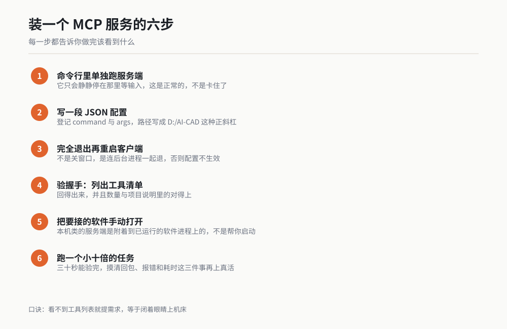

*图 20-4 作者根据公开资料绘制。*

**第一步：先在命令行里把服务端单独跑起来。**

这一步最容易被跳过，也最不该跳过。在配置进工具之前，先确认这个服务端自己能启动。

```bash
# Python 侧的服务端，通常是这样启动的
python -m solidworks_mcp --host 127.0.0.1 --port 8765

# Node.js 侧的服务端，通常是这样
npx -y @modelcontextprotocol/server-filesystem D:/AI-CAD
```

跑起来之后，**它不会输出一大堆东西，它只会静静地停在那里等输入**。这是正常的，不是卡住了。看到光标停住不动，说明服务端已经就位，可以进下一步。反过来，如果它噼里啪啦打出一串英文然后退出，那就是报错，先把这串英文解决掉再往下走。

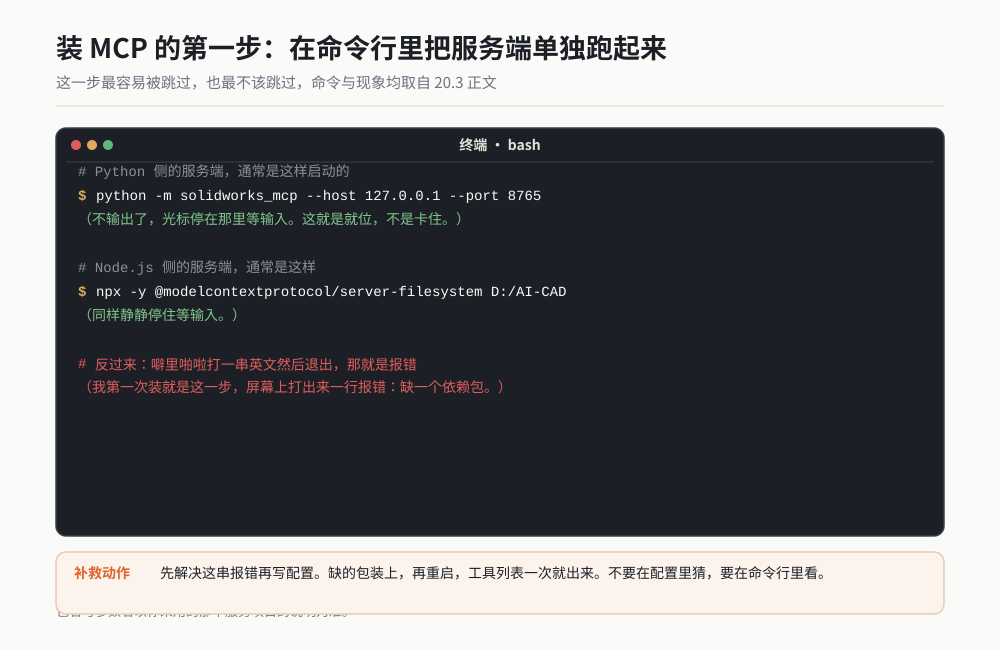

*作者根据公开资料绘制*

> 上面这两条命令里，`solidworks_mcp` 与 `@modelcontextprotocol/server-filesystem` 是两类服务的典型启动形态，具体的包名、参数名以你采用的那个服务项目的说明为准。

**第二步：写配置。**

MCP 的配置通常是一段 JSON，登记在一处配置文件里。配置文件的具体位置与字段名，以你安装的客户端版本为准，下面给的是通用形态，可以直接照抄改：

```json
{
  "mcpServers": {
    "solidworks": {
      "command": "python",
      "args": [
        "-m",
        "solidworks_mcp",
        "--host",
        "127.0.0.1",
        "--port",
        "8765"
      ],
      "env": {
        "PYTHONIOENCODING": "utf-8"
      },
      "disabled": false
    }
  }
}
```

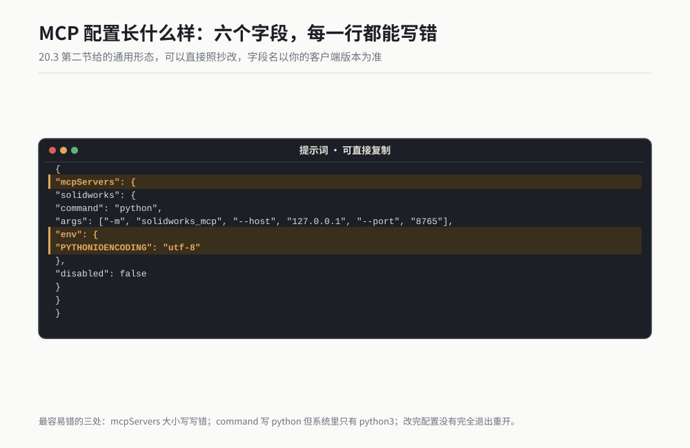

*作者根据公开资料绘制*

这一段里每一行的意思，我逐条说清楚，因为绝大多数装不上就是这几行里某一行错了：

| 字段 | 意思 | 最容易错的地方 |
|---|---|---|
| `mcpServers` | 所有服务登记在这下面 | 大小写写错，写成 `mcpservers` |
| `solidworks` | 你给这台服务起的名字 | 名字里带空格或中文，后面调用会找不到 |
| `command` | 用哪个程序去启动它 | 写 `python` 但系统里只有 `python3` |
| `args` | 传给它的启动参数 | 参数顺序写错，或者漏了某一项 |
| `env` | 给这个进程设的环境变量 | 中文路径乱码，靠它设 UTF-8 救回来 |
| `disabled` | 这台服务要不要启用 | 排查期间设 `true` 临时停用，排查完忘了改回来 |

再给一个最简单的形态，适合那种不需要参数、stdin 直接说话的服务：

```json
{
  "mcpServers": {
    "demo": {
      "command": "python",
      "args": ["D:/mcp-demo/demo_server.py"]
    }
  }
}
```

注意 `args` 里的路径用了正斜杠 `/`。Windows 上路径习惯写反斜杠，但在 JSON 里反斜杠是转义字符，`D:\mcp-demo` 会被读成一个乱七八糟的字符串。要么写成 `D:/mcp-demo`，要么写成 `D:\\mcp-demo`。**这是我踩过的第二个坑，也是 20.7 里第六条故障的根源。**

**第三步：重启客户端，让配置生效。**

多数客户端不会热加载配置。改完配置必须完全退出再重开，不是关窗口，是连后台进程一起退。这一条看着最不起眼，我在群里见过至少五个人卡在这一步，反复改配置反复不生效，最后发现是没重启。

**第四步：验握手。**

这是最关键的一步，也是唯一一步能给你确定答案的。新建一个对话，直接问一句：

```
列出当前所有已挂载的 MCP 服务端，以及每台服务端上可用的工具名称清单。
不要调用任何工具，只把清单列出来。
```

正常的话，你会拿到一份清单，长这样：

```
> 已挂载服务端：1 台
> solidworks（46 个工具）
>   ensure_ready / open_new_part / create_sketch / add_sketch_entities
>   extrude_feature / add_edge_feature / analyze_model / save_document
>   ...（其余省略）
```

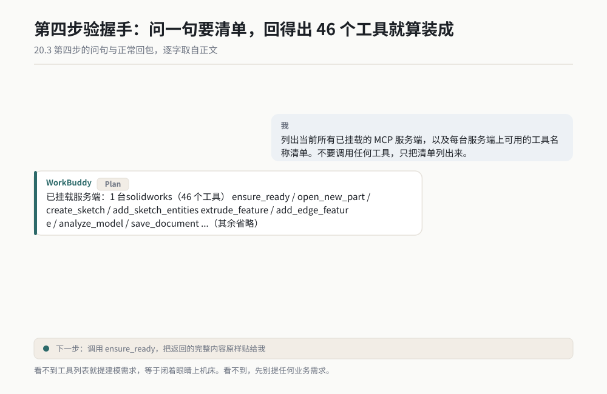

*作者根据公开资料绘制*

**看到工具列表，这一件事就算装成了。** 看不到，先别提任何业务需求，回头按 20.7 排查。我在第 10 章里写过同样一句话，那句话是那一整章里最省钱的一句：看不到工具列表就提建模需求，等于闭着眼睛上机床。

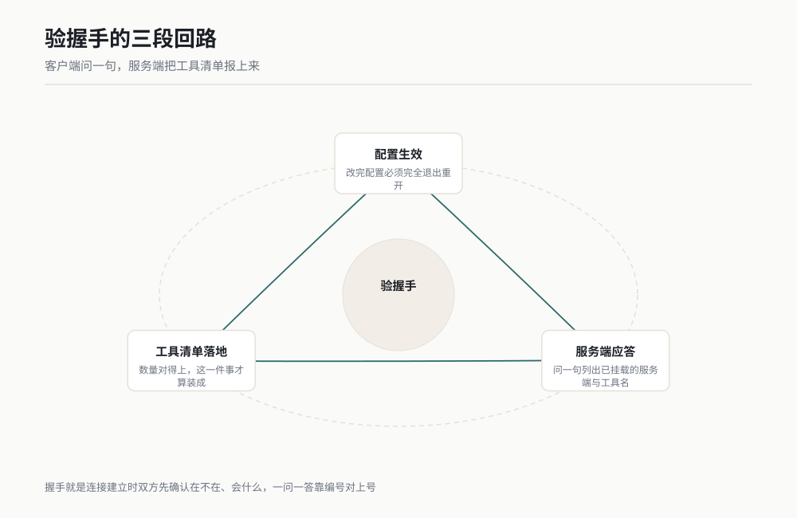

*图 20-5 作者根据公开资料绘制。*

**第五步：把要接的软件先手动打开。**

这一条是本机类专业软件特有的。SOLIDWORKS 这类软件，绝大多数 MCP 服务端是"附着"到已经运行的软件进程上的，不是帮你把软件启动起来。软件没开，服务端就算起来了也连不上。

我本机那条链路的做法是：先用一句话探健康状态。

```
调用 ensure_ready，把返回的完整内容原样贴给我，不要概括。
```

它应当回一句类似 `server=UP | com_attached=True` 的话。这里有两个字段，两个都得对：`server=UP` 说明服务端进程活着，`com_attached=True` 说明它已经贴到 SOLIDWORKS 上了。**只看到 `server=UP` 就开工，是最常见的一次白跑。** `com_attached=False` 的意思是软件那头没开，或者开了但执行层没起来。

**第六步：跑一个比你真实需求小十倍的任务。**

不要一上来就提真需求。先给一个三十秒能验完的小活，看它的返回值长什么样。

```
调用 open_new_part 新建一个零件，然后把返回的完整内容原样贴给我。
不要做别的动作。
```

这一步的意义是：你在零风险的情况下，摸清了这个服务端回包长什么样、报错长什么样、一个动作要花多久。这三件事摸清了，再上真活。我在第 10 章那个方向盘案例里花在冒烟测试上的时间不到十分钟，它替我省掉的是两次推倒重来。

### 怎么确认装成功了

三步确认，两分钟做完，缺一步都不算装成：

1. **握手有清单。** 问一句列出工具，回得出来，并且数量与项目说明里的对得上。
2. **健康检查双绿。** 有健康接口的走接口，两个字段都要对；没有健康接口的，跑一个只读工具，比如列目录、读版本。
3. **最小任务有回包。** 真的调了一个工具，拿到了带内容的返回值，而不是一句"已完成"。

三条全绿，才配叫装成。

### 我第一次装的时候翻的车

把我第一次的完整经历写出来，你大概率会在里面看到自己。

第一次装是八月底那个周末。我照着项目主页的说明把服务端装上了，配置也写了，重启之后问了一句"你有什么工具"，回了一声"没有挂载任何 MCP 服务"。我改配置，重启，再问，还是那句。来回七次，两个小时。

最后救我的是 20.3 第一步那条：把服务端单独拿到命令行里跑。我一跑，屏幕上打出来一行报错，是缺一个依赖包。装上那个包，再重启，工具列表一次就出来了。

**那两个小时我学到的东西只有一条：不要在配置里猜，要在命令行里看。** 服务端自己启动时会说的话，才是真话；客户端回给你的那一句"没有挂载"，是它猜的。

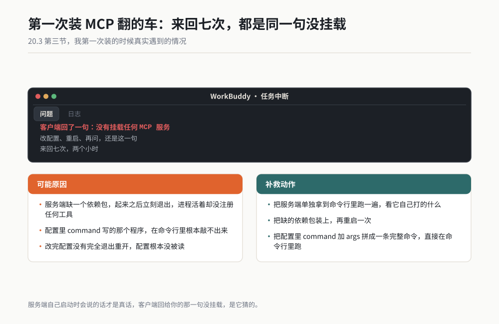

*作者根据公开资料绘制*

第二次翻车隔了三天。工具列表出来了，我兴冲冲地提了个建模需求，它卡了四十秒然后报超时。我查了半天服务和配置，最后发现是 SOLIDWORKS 没开。它列工具列得很顺，因为列工具这件事根本不需要软件在那儿；一到真正动手，软件不在，就卡住了。

从那以后我养成了现在的习惯：**每次提业务需求之前，先调一次健康检查，或者先跑一个只读的小工具。** 十秒钟，挡掉四十秒的干等。

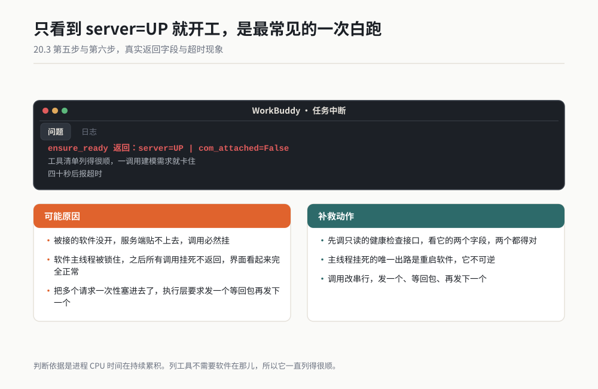

*作者根据公开资料绘制*

### 装完之后立刻做的一件事

把这次能跑通的配置**原样存一份**到你自己的笔记里，连同版本号、包名、运行时版本一起存。

我吃过亏。九月份我把一条跑得好好的链路升级了一次，升完之后连不上，而我把原来那版配置覆盖了，回不去。那天我花了一个半小时才重新凑出一份能用的配置。现在我的做法是：每一份能跑通的配置存一个带日期的文件名，比如 `mcp-config-2026-09-19-ok.json`。起作用的那份永远不动。

---

## 20.4 常见的 MCP 服务能干什么

下面这张表按"它能碰什么"分类。可信度一列我按自己的实际情况标了，没跑过的一律标 ★ 并注明来源，不写亲测。

| 类别 | 具体能干的事 | 代表例子 | 可信度 |
|---|---|---|---|
| 驱动建模软件 | 建零件、建装配体、出工程图、导出 STEP、读质量属性、渲染出图 | SolidWorks-MCP、SolidPilot、Blender MCP | ★★★ 本机实测 |
| 操作浏览器 | 打开网页、填表、点按钮、抓页面内容、跑一段自动化操作 | 各类浏览器自动化服务端 | ★ 公开资料与社区案例 |
| 读数据库 | 查表结构、跑只读查询、导出查询结果 | 各类数据库服务端 | ★ 公开资料与社区案例 |
| 操作系统文件 | 列目录、读文件、写文件、在指定目录内移动与重命名 | 文件系统类服务端 | ★★ 跑通过流程 |
| 调专业软件 | 电路设计、仿真求解、版本管理、办公文档 | 各类专业软件服务端 | ★ 公开资料与社区案例 |
| 调命令行 | 在受控前提下执行指定命令、跑脚本、看输出 | 命令行类服务端（慎用） | ★ 公开资料与社区案例 |

### 我实测过的那一类：驱动建模软件 ★★★

这一类我本机跑得最多，也是最值得工程读者投入的一类。本机那条链路（Python 适配器 46 个工具到 C# 执行层再到 SOLIDWORKS COM），已经稳定做到的事包括：

- 建草图、加约束、加尺寸，然后拉伸、切除、旋转、阵列、镜像。
- 倒角与圆角，按几何指纹选边（第 10 章场景 22 那一套）。
- 读质量属性，也就是体积、表面积、质心、包围盒这些能用来验收的数。
- 建装配体、加配合、查干涉。
- 出二维工程图，含剖视与尺寸。
- 导出 STEP 与 STL，我这边跑过一次 258 实例的装配体导出，STEP 文件一千一百多万字节。

这一类最大的价值在于：它做出来的东西能进你的现有流程，能二次编辑、能出图、能发外协、能被检验。正因为如此，它才值得你花两小时装一次。

这一类最大的坑，也在 46 个工具这个数字上。工具多不代表稳，我在这条链路上累计记过三十七条硬坑，光"选边选错"这一类就有四条不同成因。所以第 10 章我才反复强调先冒烟测试。

### 我没有实测过的那几类 ★

浏览器、数据库、命令行这几类，我在这套环境上没有完整跑通过，下面说的是公开资料与社区案例里的共同点，具体项目名与能力边界以各项目主页为准。

**操作浏览器这一类**，公开资料里稳定的用法是自动化填表、批量抓页面数据、跑重复性的网页操作。它的风险不在能力，在账号：一旦 AI 能操作你的浏览器，它就等于能碰你所有已登录的网站。这一类的权限给出去要格外谨慎，见 20.6。

**读数据库这一类**，社区里公认的好做法是只给只读账号，并且在服务端那一侧就把表名白名单定死。能改数据的数据库服务端，我个人的看法是别装。

**调命令行这一类**，我放在最后并且要说重话。这一类等于把你的整台电脑交给它。除非你非常清楚自己在做什么，并且有隔离环境，否则不要装。我在 20.6 里把它列为最高一级权限。

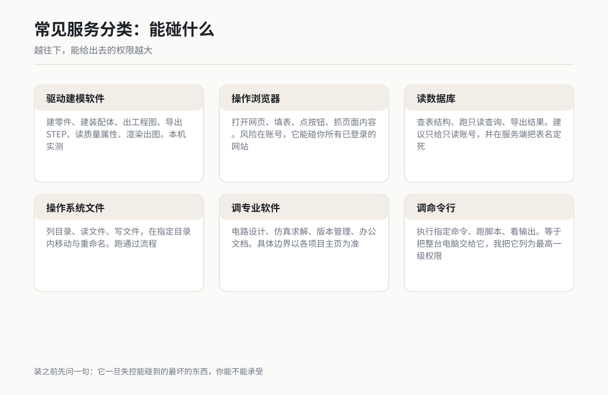

*图 20-6 作者根据公开资料绘制。*

### 怎么快速看清一个服务的能力边界

拿到一个陌生的服务端，我用三个动作判断它值不值得装，五分钟能做完：

1. **看它报多少个工具。** 工具数量在二十个以下的，通常是专注做一类事的，边界清楚，装起来放心。五十个以上的要留神，说明它想干的事太多，你很难判断每个工具会碰什么。
2. **看工具说明写不写得清。** 工具说明就是给 AI 看的说明书。写得含糊的服务，AI 用起来会乱猜，出了错你都不知道它猜的是什么。
3. **看它的只读工具够不够多。** 只读工具多的服务，你可以先只读地摸一遍，再决定要不要开写权限。只读工具一个都没有的服务，我一般不装，因为连试错都要承担风险。

这三个动作对应的是同一件事：**在给它权限之前，先把它的边界摸清楚。** 摸清楚边界所花的五分钟，比事后排查的五十分钟便宜得多。

### 一句话判断该装哪一类

> 装之前先问一句：这个服务能碰的最坏的东西是什么？最坏的东西你能承受，就装；承受不了，就不装。

这句话听着朴素，但它是我做这一类决策用的唯一标准。判断一个 MCP 服务该不该装，不看它宣传的能力有多强，看它一旦失控能碰到什么。

---

## 20.5 自己写一个最小的 MCP 服务 ★

这一节是给想深入的读者。**小白可以先跳过，跳过不影响你用 MCP。** 你完全可以一辈子只装别人写好的服务，就像你不需要会造插座也能用插线板。

我把它写进来只有一个理由：看过一次服务端的内部结构之后，你对"它到底能碰什么"这件事会清醒很多，这份清醒在 20.6 的安全判断里用得上。

本节标 ★，示例按 MCP 官方 Python SDK 的通用写法给出，**具体包名、函数名、参数名以你安装的版本为准**。

### 先看线上说的是什么

不管用哪种语言写，MCP 服务端和客户端之间的对话都是 JSON-RPC 格式，也就是一段一段的 JSON 文本。理解这一段，比急着写代码有用。

客户端问一句"你有什么工具"：

```json
{"jsonrpc": "2.0", "id": 1, "method": "tools/list", "params": {}}
```

服务端回答：

```json
{
  "jsonrpc": "2.0",
  "id": 1,
  "result": {
    "tools": [
      {
        "name": "add",
        "description": "把两个数相加并返回结果",
        "inputSchema": {
          "type": "object",
          "properties": {
            "a": {"type": "number"},
            "b": {"type": "number"}
          },
          "required": ["a", "b"]
        }
      }
    ]
  }
}
```

客户端再调一次这个工具：

```json
{"jsonrpc": "2.0", "id": 2, "method": "tools/call",
 "params": {"name": "add", "arguments": {"a": 3, "b": 4}}}
```

服务端回：

```json
{"jsonrpc": "2.0", "id": 2,
 "result": {"content": [{"type": "text", "text": "7"}]}}
```

这四段看懂了，MCP 的原理就没什么神秘的了。**它就是一个"你问我答"的来回，问和答都用 JSON 写，一问一答配一个 id 对上号。** 那个 `id` 的作用是对账，让客户端知道哪个回答对应哪个问题。

上面的方法名与字段结构以你采用的协议版本为准。老版本里方法名可能带前缀，字段也可能略有差别。

### 最小的服务端代码

用 Python 的官方 SDK 写，一个能跑的服务端只有十几行：

```python
# demo_server.py：一个最小的 MCP 服务，只提供一个工具
# 依赖：pip install mcp
from mcp.server.fastmcp import FastMCP

mcp = FastMCP("demo")


@mcp.tool()
def add(a: float, b: float) -> float:
    """把两个数相加并返回结果。"""
    return a + b


if __name__ == "__main__":
    mcp.run(transport="stdio")
```

这十几行拆开看：

- `FastMCP("demo")` 建了一个服务端对象，"demo" 是它的名字，客户端那边看到的就是这个名字。
- `@mcp.tool()` 是一个装饰器，意思是把下面这个函数登记成一个工具。**函数下面那行三引号注释不是可选的装饰，它是工具说明**，客户端和 AI 读的就是这行字，写清楚它才用得对。
- 函数签名里的类型标注 `a: float` 也不是摆设，SDK 会拿它去生成工具的输入格式说明。类型写清楚了，AI 才不会往里塞一个字符串。
- `mcp.run(transport="stdio")` 让它跑起来，用 stdio 这种通信方式。

**stdio 是什么：** 服务端和客户端通过"标准输入与标准输出"这根管道说话，客户端往服务端的输入里写一行 JSON，服务端往自己的输出里写一行 JSON 回来。它不占端口，也不需要网络，进程一开一关就干净。本机服务绝大多数用它。

### 登记它，验一次

配置照 20.3 那个最简形态写：

```json
{
  "mcpServers": {
    "demo": {
      "command": "python",
      "args": ["D:/mcp-demo/demo_server.py"]
    }
  }
}
```

重启客户端，问一句列出工具。清单里应当出现 `demo` 这台服务，下面挂着一个叫 `add` 的工具。让它算一次 `add(3, 4)`，回 7，就成了。

### 看懂这个结构之后最重要的一句

**工具里那几行代码，就是 AI 能碰到的全部世界。**

你在 `add` 这个函数里写什么，AI 就能干什么。你写一句 `open(某路径).read()`，它就能读那个文件；你写一句 `os.remove(某路径)`，它就能删那个文件。MCP 本身不带任何限制，限制只来自你这支笔。

这句话是这一节存在的全部理由。装别人的服务时，你其实是在信任别人的那支笔。

> **老兵说**：MCP 服务的权限大小，不看它叫什么名字，看它里面那只工具函数里写了几行代码。

---

## 20.6 安全第一：它能碰你本机 ★★★

前面铺垫这么多，就是为了这一节。

连接器给出去的权限，是一个外部账号里的一部分数据权限，最坏情况是别人系统里的那份数据出问题，而且通常能撤回、能改密码。**MCP 给出去的权限，是你这台电脑上真实的文件、真实的进程、真实的软件。** 删掉的文件进不了回收站，覆盖保存的图纸回不到上一版。

本节标 ★★★，这几条规矩是我在本机上撞出来并长期执行的。

### 权限分级表

按"一旦失控最坏能碰到什么"分五级，从低到高：

| 级别 | 能碰什么 | 典型例子 | 我的规矩 |
|---|---|---|---|
| 1 级 只读本机 | 列目录、读文件内容 | 只读的文件系统服务 | 给一个专用目录，随便用 |
| 2 级 写指定目录 | 在指定目录内新建、改、删 | 带写权限的文件服务 | 目录里不放别的，用完就撤 |
| 3 级 操控本机软件 | 驱动已安装的专业软件 | SOLIDWORKS、Blender 类服务 | 装，但 destructive 动作要人工确认 |
| 4 级 起进程 | 启动程序、跑脚本、看输出 | 命令行类服务 | 不装，除非有隔离环境 |
| 5 级 碰账号 | 操作浏览器、改数据库 | 浏览器与数据库写服务 | 不装，需要时人工做 |

这张表的使用方法是：**先定你的服务属于第几级，再决定装不装。** 1、2、3 级在受控前提下可以装，4、5 级我的建议是不装。

有人会问，3 级不是也能删文件吗？能。所以 3 级那条"destructive 动作要人工确认"是硬要求，不是建议。我在第 10 章的总开工指令里写了"任何一步失败，先把原始报错原样贴给我，然后停下来等我指示"，那句话既是质量规矩，也是安全规矩：它让 destructive 动作在发生之前先经过我一次。

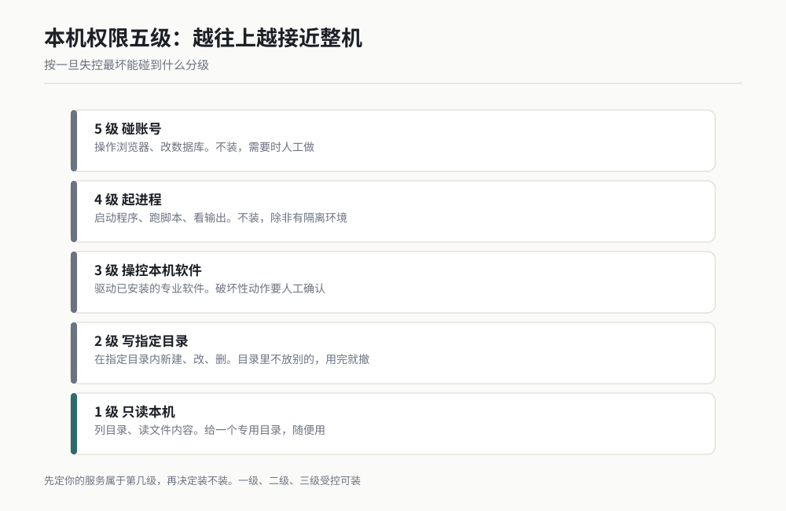

*图 20-7 作者根据公开资料绘制。*

### 三条硬规矩

**规矩一：一次只给一个目录，这个目录里不放别的东西。**

我本机的做法是建一个专用目录 `D:/AI-CAD`，所有 AI 相关的读写全部发生在这里面。这个目录里不存任何不可替代的东西，即使整个目录被清空，我损失的只是可以重跑的产物。

这条规矩的反面是很多人图省事，直接把 `D:/` 或者"我的文档"给出去。那是把自己的全部家当放在一个不需要负责任的程序手边。

**规矩二：只装查得到出处的服务，不装来路不明的。**

判断出处看三样：项目主页在不在、许可证写没写、最近一次更新是什么时候。三样里有两样查不到，就不装。

理由很直白：你是在把本机的一部分控制权交给一段别人写的代码。这段代码能干什么，你在装之前是看不见的（除非你真的去读它，而 20.5 那十几行告诉你，读明白一个服务端其实不难）。既然看不见，就只能看出身。

**规矩三：涉及删除、覆盖、外发、提交的动过，必须留人工确认。**

四类动作我一律不放手：删文件、覆盖保存已有文件、对外发送任何东西（邮件、消息、上传）、提交代码或数据到共享库。

前两类是丢了就找不回，后两类是收不回来。我在提示词里会把这条写死，格式是：

```
【安全规矩】以下四类动作在执行前必须先向我确认，得到我明确的同意后再执行：
删除任何文件、覆盖保存任何已存在的文件、对外发送任何内容、提交任何东西到共享库。
其余动作可以自主执行。每一步做完都要向我汇报真实返回值。
```

这一段可以直接复制使用。

### 还有一个动作：定期清点

装服务这件事有个特点：装的时候你会认真想一次该不该装，装完之后就再也不想了。三个月后你的机器上挂着七个服务，其中四个你已经忘了是干什么的，而它们每一个都还开着权限口子。

我的做法是每季度清一次点，动作只有三步：

1. 列一遍当前挂载的全部服务，逐个问自己最近三个月用没用过。
2. 没用过的直接停用，不删配置，只停用。停用一周内没人找，再删。
3. 用过的，重读一遍它的权限级别，看有没有升级。服务端更新之后新增了写权限这种事，发生过不止一次。

清点的意义在于把"永久授权"变成"定期续期"。公司里的供应商准入要年审，你自己机器上这些能碰本机的程序，凭什么不审。

### 还有一个容易被忽略的口子

MCP 服务是你自己起的进程。它跑在你的账户下，因此**它拥有你这个账户的全部权限**。如果你的客户端是以管理员权限启动的，那么它起的服务也是管理员权限。

所以有一条配套规矩：**日常不要用管理员权限启动客户端。** 我见过有人为了让某个服务装上，把整个工具用管理员权限开起来，从此这台机器上所有 MCP 服务都拿到了管理员权限。这是把一级口子开成了五级。

---

## 20.7 常见故障与排查 ★★★

这一节八条，全部是我本机实际遇到并解决过的。排障的核心思路只有一句：**先定位段，再查细节。** 段有四段：配置、服务进程、被接的软件、权限。

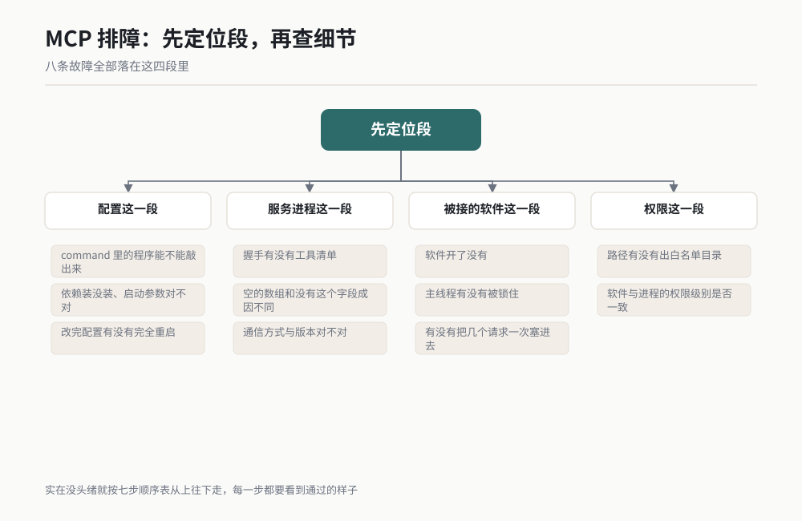

*图 20-8 作者根据公开资料绘制。*

### 故障一：服务压根起不来

**症状：** 工具列表里看不到这台服务，或者看到但状态标红。

**先查三样：**

1. `command` 里写的那个程序在命令行里能不能直接敲出来。敲 `python --version`，敲不出就是环境变量没配，配置里要写完整路径。
2. 依赖装没装。Python 侧常见的是 `pip install` 漏了，Node.js 侧常见的是包没下载完。
3. 启动参数对不对。把配置里 `command` 加 `args` 拼成一条完整命令，直接在命令行里跑一遍，看它报什么。

**判断点：** 在命令行里能跑、在配置里起不来，差的就是环境变量与工作目录。配置里 `env` 那一项就是用来补这个差的。

### 故障二：服务起来了，工具列表是空的

**症状：** 能看到服务名字，但下面一个工具都没有。

**三个成因，按顺序查：**

1. 服务端内部报错了，但它是"起来之后才报错"，所以进程活着却没注册任何工具。查服务端的运行日志。
2. 通信方式对不上。服务端跑的是 stdio，客户端却按 HTTP 去连，或者反过来。配置里指定传输方式的字段要以你客户端版本支持的写法为准。
3. 版本差一代。服务端用的协议版本比客户端支持的更新或更旧，握手时对不上口径。

**判断点：** 让客户端把握手时的原始返回贴出来。空的 `tools` 数组和压根没有 `tools` 字段，指向的成因不同。

### 故障三：调用超时

**症状：** 工具清单看得到，一调用就卡住，最后报超时。

**本机专业软件这一类，按这个顺序查：**

1. 软件开了没有。SOLIDWORKS 没开，服务端贴不上去，调用必然挂。
2. 软件的主线程是不是被锁住了。我在本机遇到过一次：对一份"改过但没存过盘"的文档执行关闭动作，软件主线程陷进内部确认逻辑，之后所有调用全部挂死不返回，而界面看起来完全正常。判断依据是进程 CPU 时间在持续累积。**这种状态的唯一出路是重启软件，它不可逆。**
3. 是不是把多个请求一次性塞进去了。有些执行层是状态机，要求"发一个、等回包、再发下一个"。一次塞一串会返回一串状态版本错误。

**判断点：** 先调那个只读的健康检查接口，看它的两个字段。健康接口都超时，问题在连接层；健康接口正常而业务工具超时，问题在那个动作本身。

### 故障四：权限被拒

**症状：** 报错里出现 denied、not allowed、outside、permission 这类词。

**两个成因：**

1. 路径出了你给的目录。想读 `D:/其它目录/文件.txt`，而你只给了 `D:/AI-CAD`。
2. 权限级别不一致。软件以某个权限级别开着，服务端进程是另一个级别。Windows 上这两个级别对不上，跨进程调用会被拦。

**补救：** 要读的文件挪进白名单目录，别去放宽白名单。软件和服务端用同一个权限级别重开。

### 故障五：版本不匹配

**症状：** 握手就失败，报错里出现 version、protocol、unsupported 这类词。

**成因：** 服务端实现的协议版本，和客户端支持的协议版本对不上。

**补救三选一：** 升服务端、降服务端、或者换一个与你的客户端同期发布的服务端版本。不要去改协议本身，那不是你的活。

**预防：** 20.3 结尾那条"把能跑通的配置存一份"，在这一条上最值钱。存下来的那份里带着版本号，回退的时候有地方可退。

### 故障六：路径写错

**症状：** 报找不到文件、找不到目录，但你看那个路径明明是对的。

**四种写法错，逐个对：**

1. JSON 里写了单反斜杠。`D:\AI-CAD` 在 JSON 里会被当成转义，要写 `D:/AI-CAD` 或 `D:\\AI-CAD`。
2. 路径里有中文或空格。有些服务端对这两样处理不好，能换就换。
3. 写了相对路径，而服务端进程的工作目录跟你以为的不是同一个。
4. 盘符不存在，或者是个没插上的移动硬盘、没映射的网络盘。

**补救：** 全部改成英文、无空格、带盘符的绝对路径，并且在干活之前先让它列一遍目录确认存在。我在第 10 章的准备工作里把"路径不要有空格和中文"列为硬条款，就是因为这一条。

### 故障七：本机进程被连带杀掉

**症状：** 服务或者被接的软件，用着用着自己就退出了，退出时机还很规律。

**成因：** 它是从某个工具会话里被启动的，那个会话一结束，它作为子进程被一起带走。

**补救：** 用守护方式启动。启动之后让启动它的那个进程保持常驻，而不是启动完就退出。本机我用的是一段后台脚本：启动目标程序之后自己进入一个长循环，每隔一段时间检查一次目标进程还在不在，同时把状态写进日志。这样父进程一直活着，子进程就不会被连带回收。

**判断点：** 看退出时机。每次都在某个操作结束后不久退出，基本就是这一条。

### 故障八：报状态版本错误或重复

**症状：** 报错里出现 `INVALID_STATE_VERSION` 或 `DUPLICATE` 这类字样。

**两个成因，正好对应两条：**

1. `INVALID_STATE_VERSION` 是你把多个请求并行发出去了。执行层要求串行，发一个、等回包、再发下一个。
2. `DUPLICATE` 是操作编号重名了。有些执行层要求每次调用带一个唯一编号，跨请求还不能重复。

**补救：** 调用改串行，编号用能生成全局唯一值的办法产生，别用自增计数器。

### 一张排障顺序表

实在没头绪的时候，按这七步从上往下走，别跳步：

| 步 | 查什么 | 通过的样子 |
|---|---|---|
| 1 | 服务进程在不在 | 命令行里能单独跑起来并停在等待状态 |
| 2 | 配置改完有没有重启 | 完全退出重开过 |
| 3 | 握手有没有工具清单 | 列得出来，数量对得上 |
| 4 | 有健康检查的走一次 | 两个字段都对 |
| 5 | 被接的软件开没开 | 手动打开并停在就绪状态 |
| 6 | 报错里有没有版本、权限、路径关键词 | 按对应故障处理 |
| 7 | 跑一个只读的最小工具 | 拿到带内容的回包 |

七步走完还是不通，就把第七步的原始报错整段保存下来，连你的配置文件一起，去那个服务的项目主页提 issue。报错原文比你的描述有用得多。

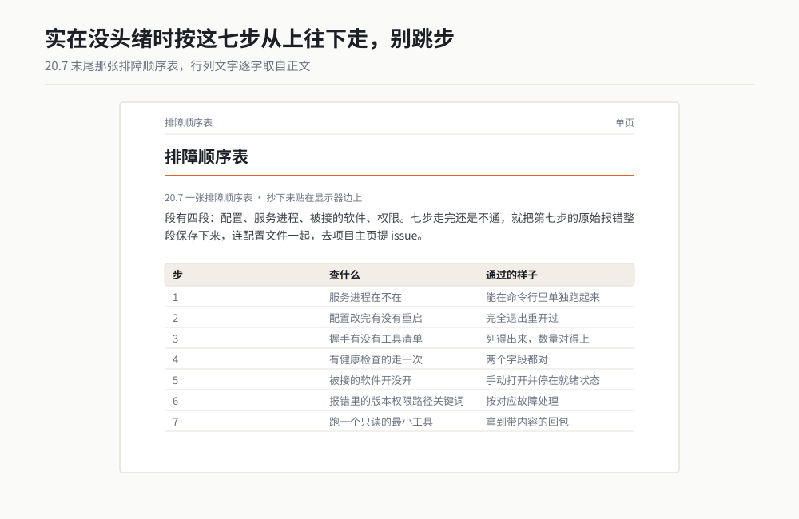

*作者根据公开资料绘制*

---

## 小白词典

这一章的术语是全书最抽象的一批，我每个都配了类比。

**MCP（Model Context Protocol）**：一套让 AI 操控其他软件的通用插座规矩。它规定了 AI 怎么要工具、软件怎么报工具，两边照着做就能接上，互相不用认识。类比：插线板上那个谁都能插的孔位标准。

**客户端（client）**：AI 那一侧，负责把 AI 的话变成符合规矩的请求发出去，再把回包交还给 AI。类比：插头。

**服务端（server）**：你要接的软件那一侧，一个跑在电脑上的小程序。它负责报工具清单，以及把请求翻译成软件能听的动作。类比：电器加它自带的电源适配器。注意它跟机房里那台机器没有对应关系，它只是一个进程，随用随起，用完就退。

**进程（process）**：一个正在运行的程序。你可以同时开十个进程，它们各干各的，互不干扰。MCP 服务端就是一个进程。类比：厨房里同时开着的灶眼，每个灶眼上炖着不同的锅。

**工具（tool）**：服务端上报的一个具体动作，一个工具就是一件事。比如"新建零件""拉伸 12 毫米""读体积"。类比：电器面板上的一个按钮。

**JSON**：一种用大括号和方括号组织数据的文本格式，人和机器都能读。配置文件、网络传输、AI 收发的消息，现在绝大多数都用它。类比：填表，格子名写清楚，格子里填值。

**RPC（Remote Procedure Call）**：让一个程序去调用另一个程序里的函数，并且拿到返回值。它不管这两个程序是不是在同一台电脑上。类比：你打电话给另一个部门，让他们办一件事并把结果告诉你。

**JSON-RPC**：用 JSON 写成的 RPC。问一句是一段 JSON，答一句也是一段 JSON，靠一个编号对上号。类比：两个人用便签条一问一答，每张便签上写个号防止答串了。

**stdio（标准输入输出）**：程序自带的两根管道，一根进、一根出。用它通信不占端口、不走网络，进程一关就干净。类比：两个人隔着墙用一根传声筒说话。

**端口（port）**：一台电脑上用来区分不同网络程序的编号，比如 5000、8765。走网络通信的服务要占一个端口。类比：一栋楼里的门牌号，快递按门牌送到对的一家。

**transport（传输方式）**：服务端和客户端用哪根线说话。常见的有 stdio 和网络两种。类比：两个人说话是用传声筒还是打电话。

**schema（格式说明）**：一份描述"参数长什么样"的说明书，写清楚每个参数叫什么、是什么类型、哪些必填。AI 靠它才知道该往里填什么。类比：快递单上印好的那些格子。

**COM**：Windows 上软件之间互相调用的一套老接口。SOLIDWORKS 对外开了这道门，别的程序才能隔着门伸手进来。它不属于 MCP，比 MCP 早得多。类比：软件之间的对讲机。

**pywin32**：Python 一侧用来敲 COM 这道门的库。装它是为了用 Python 去驱动 Windows 上的专业软件。类比：适配这一种对讲机的专用插头。

**握手（handshake）**：连接建立时双方先互相确认一下"在不在、会什么"。MCP 的握手就是客户端问一句、服务端把工具清单报上来。类比：打电话接通后先说"喂，听得到吗"。

**环境变量（env）**：进程启动时带在身上的一批设置值，比如编码方式、临时目录在哪。配置里 `env` 那一项就是给它设这些值。类比：出门前揣在口袋里的几张便条。

**装饰器（decorator）**：Python 里写在函数上面那行以 `@` 开头的代码，作用是给这个函数额外登记一点信息。`@mcp.tool()` 的意思是把下面这个函数登记成一个 MCP 工具。类比：给文件贴一张标签，文件内容没变，但它被归到了某一类。

---

## 你的岗位怎么用

**设计工程师**：本章对你价值最高的两节是 20.3 和 20.7。装一次 SOLIDWORKS 那一类服务端，按六步走完，然后把 20.7 那张七步排障表打印出来贴在显示器边上。你接下来所有的 AI 建模活（第 10 章那六个场景）都建立在这两步之上。

**工艺与制造工程师**：你的关注点是 20.6 的第 2 级权限。工艺文件、作业指导书这些都要落到具体目录里，给 AI 一个专用目录并且定期归档，比事后找文件省事得多。

**质量工程师**：20.6 那张权限分级表可以直接改造成你部门的 AI 工具准入表。谁申请、申请几级、给哪个目录、保留多久，四列就够。你本职就是管权限和留痕，这件事天然归你。

**项目经理**：盯 20.6 的三条硬规矩，尤其是第三条那四类必须人工确认的动作。把它写进团队的 AI 使用规范里，一句话就能挡住绝大多数事故。另外 20.3 结尾"把能跑通的配置存一份带日期的文件名"，这条对任何需要回滚的事情都成立。

**采购与供应商管理**：你大概率不需要自己装 MCP，但你需要知道一件事：供应商交来的数模如果是 AI 生成的，验收标准不变。单位、体积、干涉、STEP 往返，第 10 章场景 22 那六行查验单照样适用。

**试验工程师**：20.4 那张分类表里，对你有用的是"读数据库"和"系统文件"两类。试验数据批量导出、报告模板批量填充，这两件活装一个只读服务就能接。记住只给只读。

---

## 本章交付物

**一份你自己机器上的、能跑通的 MCP 配置文件，外加一张打印出来的排障表。**

做法三步：

1. 按 20.3 的六步，装一个你真正用得上的服务。第一次装建议从最简单的那类开始，比如一个只读的文件服务，别一上来就挑战 SOLIDWORKS。
2. 跑通之后，把那份配置原样存成 `mcp-config-2026-xx-xx-ok.json`，存进你的笔记软件，并且从此不再改动这一份。
3. 把 20.7 那张七步排障顺序表抄下来，贴在显示器边上。

第一件验收的活：装成之后，让 AI 跑一个三十秒内能验完的最小任务，并且自己动手验一次它的返回值。比如让它列出某个目录里的文件，然后你自己打开那个目录数一遍。数得对，这条链路就是真的。

---

## 本章金句

> AI 会不会用你的软件，跟它聪不聪明没关系，跟墙上有没有插座有关系。

> MCP 不生产能力，它生产接口一致性。

> 连接器给 AI 一个身份，MCP 给 AI 一双手，技能给 AI 一份作业指导书。

> 能用嘴教会的活，别给它手。

> 看到工具列表才配叫装成，看不到就提需求，等于闭着眼睛上机床。

> MCP 服务的权限大小，不看它叫什么名字，看它里面那只工具函数里写了几行代码。

---

*（全书第五篇完。下一章进入第六篇：团队落地。）*
