# 第 21 章 从一个人用，到一个部门用

> 团队推 AI，先卡住的是人心里的责任账，工具功能还排在后面。

我自己用顺以后，犯过一个带团队的人很容易犯的错：我以为演示一次，大家就会照着用。那年我带着一个约十来人的研发小组，周会上用约十五分钟演示了怎样整理试验记录、提取待办、生成周报初稿。屏幕上的活原来要花大半个下午，那次约四十分钟就有了结果。有人当场说：“这个真能省事，下周我也试。”

我随后建了共享目录，放进去约二十条提示词，又在群里提醒过几次。约三个月后，我翻使用记录，真正在持续用的只有两个人，一个是我，另一个是愿意拿新东西折腾的项目工程师。其余人要么只打开过一次，要么把 AI 当搜索框问两句，再也没有回来。

我找同事单独聊。试验工程师说：“我上次让它整理记录，批次号少了一位。这个错发出去，算谁的？”质量工程师说：“你演示的都是你的活，我每天那几张表能不能做，我不知道。”还有一位老同事说得更直接：“你们越用越快，公司以后还要这么多人吗？”

这三句话让我明白，失败原因没有藏在安装步骤里。团队成员看见的是责任风险、学习成本、岗位距离和被替代的担心。我给了一堆提示词，却没给第一个能赢的小任务；我展示了速度，却没写验收规矩；我要求大家试，却没有说明出错后谁来接。后来我换了方法：先跑通一个低风险任务，让三个人照着同一份作业做，再由全组共同写规矩。使用人数才开始往上走。

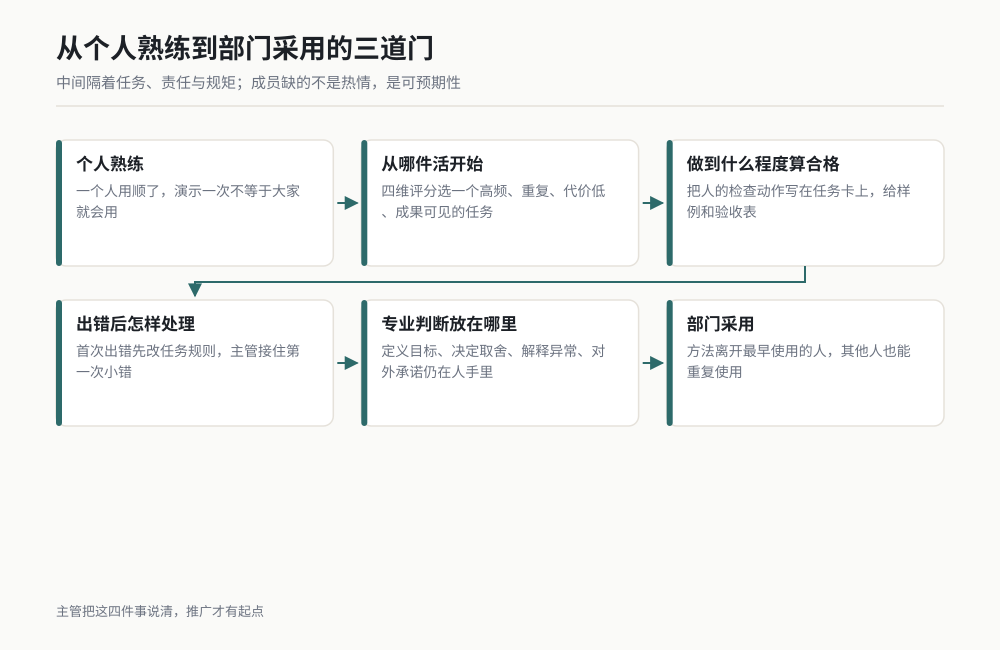

*图 21-1 从个人熟练到部门采用的三道门。作者根据公开资料绘制。*

## 21.1 为什么推不动：五个真实阻力

带团队的人容易把“不使用”理解成态度问题。我后来不再这样看。一个人没有持续使用，往往有一个很具体的理由。主管要做的第一件事，是把理由听完整，再给一个能执行的处理办法。

### 阻力一：怕出错担责

这是工程部门最合理的一种担心。一个新人用 AI 整理了试验数据，里面漏了一行，主管若只问“你为什么没检查”，他下次最安全的选择就是不用。工具省下的是时间，责任却还在他名下，他自然会保守。

破解办法有三步。第一，任务开始前沿用第 18 章的 L1 / L2 / L3 决策矩阵定级，不在本章另造一套。第二，把人的检查动作写在任务卡上。第三，明确按规矩做过检查仍出错，先查流程和规则，不先把问题压给操作者。

我给团队的说法很直白：“你按约定定了级，按清单验了，记录也在，出了问题我们一起改规则。你跳过验收直接发，责任才回到你个人。”这句话比“大胆试”有用，因为它说清了安全边界。

主管还要做一个动作：亲自接住第一次小错。有同事第一次用 AI 汇总问题清单时，把“待验证”写成了“已解决”。他来找我，以为会挨批。我和他一起查，发现模板里根本没有状态词白名单。我们把状态固定成“待确认、进行中、已验证”三种，再拿原材料重跑。第二周，他继续用了。

**破解清单：**

1. 每个任务先标 L1、L2 或 L3，标不准时按更高一级处理。
2. 给出对应验收动作，不说“自己注意检查”。
3. 留下输入、输出、检查结果和拍板人。
4. 首次出错先改任务规则，再讨论个人是否漏做了动作。
5. 主管公开说明：速度不作为跳过验收的理由。

### 阻力二：不知道能干什么

“大家可以多用 AI”是一句几乎没有用的话。工程师听完仍要自己想场景、准备材料、写要求、判断结果。对已经被项目节点塞满的人来说，这相当于又领了一项研究任务。

我后来不再问“你想用 AI 做什么”，改问三个具体问题：“这周哪件事做了三次以上？哪件事最烦但有固定格式？哪件事错了能很快改回来？”答案通常会落到会议纪要、文件清单、试验记录整理、版本差异检查、周报初稿这一类活上。

有位设计工程师一直说自己的工作“没法交给 AI”。我跟他坐了约二十分钟，没有讨论方案设计，只看他周五下午做什么。他每周都要把更改记录从多个文件里摘出来，合成一张评审清单。这个活规则清楚、输入固定、结果能逐项核对。我们把它做成他的第一个任务，他才知道所谓“能干什么”不是把岗位交出去，是先拿掉岗位里那一段重复搬运。

**破解清单：**

1. 不开空泛的创意会，直接盘点最近一周的重复动作。
2. 每个岗位只选一个起步任务，不要求一次找全。
3. 用本章 21.2 的四维评分表筛选，不靠主管个人喜好。
4. 给任务样例、输入样例和验收样例，让人能照着做。
5. 第一次成功后，再从相邻任务扩展。

### 阻力三：试了一次没成

很多人第一次给 AI 的话只有一句：“帮我整理一下。”得到的结果当然不稳定。他看一眼，觉得还不如自己做，从此给工具贴上“不靠谱”的标签。问题出在第一次体验没有完成条件，也没有人陪他走完返工。

破解办法是把第一次使用设计成一个小实验。输入不超过一组，产物只要一份，验收不超过几项。主管或先跑通的人坐在旁边，看到偏差就改任务单，让同事亲眼看到“第一次不成”怎样变成“第二次能复用”。

我带一位项目工程师做会议纪要时，第一次输出漏了两个责任人。他说：“看吧，还是得我重写。”我没有让他重写，而是把任务单补成四栏：事项、负责人、日期、原话位置；缺一项就写待确认。第二次输出仍有一条日期缺失，但它被老实放进待确认栏。我们花几分钟补完，比从头重写省事。关键变化是他看见了可修的路。

**破解清单：**

1. 第一次只拿历史材料或内部草稿练，不碰当天要外发的急件。
2. 先给完成条件，再开始执行。
3. 保留第一次失败产物，逐项标出失败原因。
4. 只改导致失败的那条规则，再跑一次。
5. 连续两次仍不稳定，就换任务，不拿一个坏场景证明所有场景都不行。

### 阻力四：觉得跟自己无关

如果培训案例全是写代码，试验人员会觉得无关；全是写报告，设计人员也会走神。部门推广常败在“一个漂亮案例讲给所有人”，因为每个岗位真正烦的活不同。

破解办法是按岗位做任务地图。研发主管列设计、试验、质量、项目四列，每列先放三个真实任务。每个任务旁边写输入是什么、产物给谁、错了会怎样。团队成员只需从自己那一列挑，不必把别人的方法硬套过来。

我有次在内部分享里演示批量整理技术文档，反应平平。会后，一位试验同事问：“能不能帮我找出日志里缺采样的时间段？”这个问题比我的演示更贴近他。我和他把规则写清，输出缺口起止时间和原始行号。下次分享，我直接用这项任务讲，试验组的人马上开始问自己的文件能不能照做。

**破解清单：**

1. 培训材料按岗位分组，不做一份大而全的演示。
2. 案例必须来自本部门上个月做过的活。
3. 展示前后文件和验收过程，不只展示最终页面。
4. 允许成员说“这个与我无关”，然后换成他的真实材料。
5. 每个岗位至少有一位共同维护案例的人。

### 阻力五：担心被替代

这类担心很少有人在大会上直说，私下却很常见。主管若只回答“不会的”，可信度很低。成员看到的是：原来半天的活现在几十分钟做完，那剩下的人力会发生什么？

我的处理办法是把工作拆成动作和责任。搬运、改格式、找差异、列清单，这些动作可以交出去。定义目标、决定取舍、解释异常、对外承诺，这些责任仍由人承担。成员需要看到自己从重复动作里拿回的时间将用在哪里，比如提前做风险验证、补试验计划、检查供应商输入、复盘长期问题。

我会在任务开始前说清楚：“这次省下来的时间，不拿来比较谁做得更快，也不据此减人。我们先把长期欠着的验证和改进补上。”随后我真的把空出来的时间排进计划。如果口头说学习，实际却立刻加更多任务，团队很快就会看穿。

主管还要公开肯定“教会别人”的贡献。一个人把自己摸索的方法写成模板，让五个人少走弯路，这应当进入工作总结。否则成员会把方法藏在个人电脑里，因为分享只会让自己失去优势。

**破解清单：**

1. 公开列出交给 AI 的动作，以及仍由人承担的责任。
2. 说明省下时间的去向，并把它排进真实计划。
3. 不发布个人速度排行榜，不用使用次数做绩效名次。
4. 把模板维护、案例讲解、错误复盘计入团队贡献。
5. 对岗位变化讲具体任务，不用空话安慰。

五种阻力背后有一个共同点：成员缺的不是热情，是可预期性。他要知道从哪件活开始，做到什么程度算合格，出错后怎样处理，自己的专业判断还放在哪里。主管把这四件事说清，推广才有起点。

## 21.2 从哪个活切入

部门第一次选任务，优先挑容易赢的，不挑最有想象力的。一个任务适不适合起步，我看四个维度：高频、重复、出错代价低、成果看得见。每项按 1 到 5 分打分，5 分代表更适合起步。

“成果看得见”常被忽略。节省了几步思考很难展示，一张从原始记录自动生成、又能逐项核对的清单则人人看得懂。团队需要先看见一次可靠的结果，才愿意投入第二次学习。

### 最容易成功的切入任务清单

| 工程部门真实任务 | 高频 | 重复 | 出错代价低 | 成果看得见 | 建议起步方式 |
|---|---:|---:|---:|---:|---|
| 把会议记录整理成事项、负责人、日期、原话位置四栏 | 5 | 5 | 5 | 5 | 用一次内部例会录入稿试跑，缺项统一写待确认 |
| 汇总周报素材，按完成、风险、待决定、下周动作分类 | 5 | 4 | 5 | 5 | 先生成内部初稿，负责人逐条核来源 |
| 批量生成文件索引，列文件名、版本、日期、用途 | 4 | 5 | 5 | 5 | 原目录只读，结果写入新索引文件 |
| 比较两个规范版本，列新增、删除、修改条款及位置 | 3 | 5 | 4 | 5 | 先做条款差异，不让 AI 判断采用哪一版 |
| 整理试验日志中的缺失段、异常段和对应行号 | 4 | 4 | 4 | 5 | 只标记异常，不自动删除或补值 |
| 从问题清单生成每日跟踪摘要，保留原编号 | 5 | 4 | 5 | 4 | 用编号核对条目数，状态词用固定清单 |
| 整理评审意见，按专业、责任人、截止时间分组 | 4 | 4 | 4 | 5 | 只归类和提取，不替负责人关闭问题 |
| 检查交付包是否缺文件、重名、版本不一致 | 3 | 5 | 4 | 5 | 先按既定清单检查，缺失项原样列出 |

这张表的分数用于比较任务，不是假装精确的科学测量。先由两位熟悉现场的人独立打分，再讨论差异。一个任务若在“出错代价低”上只有 1 或 2 分，即使其余项很高，也不要拿来做第一次示范。

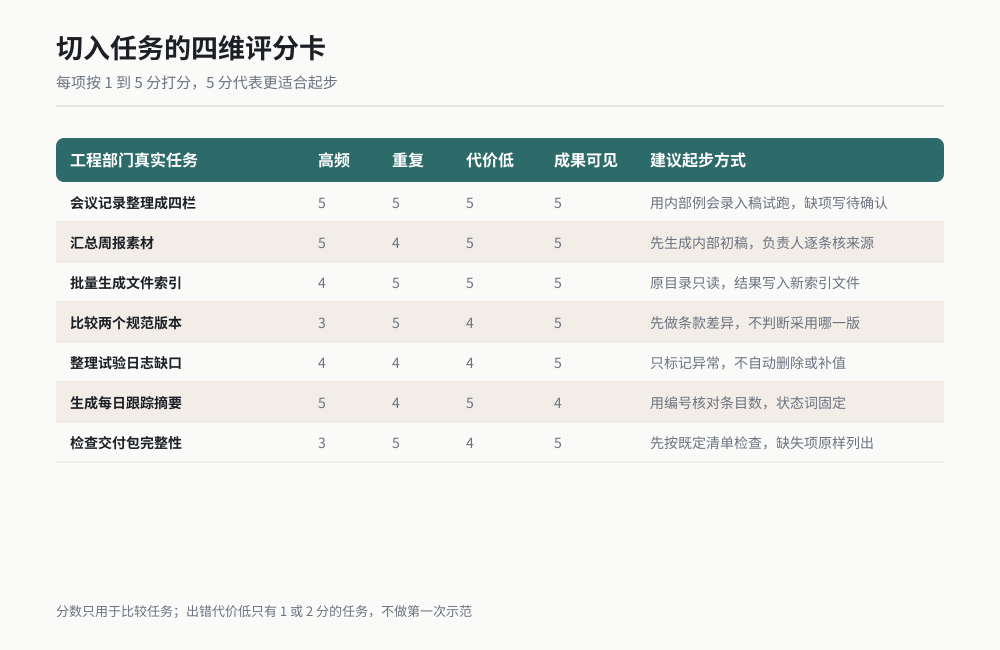

*图 21-2 切入任务的四维评分卡。作者根据公开资料绘制。*

### 评分以后再过四道门

**第一道门：输入能不能合法、清楚地提供。** 如果材料含有不该进入工具的敏感内容，这项任务先停。不要为了推广速度，把资料边界留到事后讨论。

**第二道门：有没有客观验收方法。** 文件数能核，编号能核，来源位置能核，这些适合起步。“写得更有洞察”没有统一检查动作，先放到后面。

**第三道门：错误能不能撤回。** 内部草稿错了可以重做，对外承诺发出后很难收回。第一次练习只选能撤回的。

**第四道门：谁愿意当第一个使用者。** 同一个任务，愿意配合的人比理论最优的人更重要。第一个人要肯保留失败记录、愿意讲真实感受，也愿意让别人复制自己的作业。

### 一个切入失败的例子

我曾经想用“自动生成技术方案”做部门示范，因为成果看起来最亮眼。第一次评审就卡住了：输入不完整、取舍依据藏在几位老工程师脑子里、每个方案都需要责任人拍板。它属于 L2，甚至部分内容已经接近 L3，根本不适合拿来做第一次成功。

后来我们退到“规范版本差异清单”。输入是两个已确认版本，输出只列条款变化和位置，不做采用判断。约一个工作日内，三位同事都能照同一模板得到相近结果。大家先相信了差异提取，再讨论怎样让 AI 帮忙准备方案材料。

这个次序很重要。部门采用新方法，先解决“它能不能稳定做一小件事”，再解决“它能不能参与复杂工作”。顺序反过来，第一次失败会被记很久。

### 可复制的任务筛选卡

```text
【候选任务】
任务名称：[ ]
执行岗位：[ ]
当前频率：[每天 / 每周 / 每月 / 偶发]
输入材料：[ ]
输出产物：[ ]
产物给谁使用：[ ]

【四维评分，1 到 5 分】
高频：[ ]，依据：[ ]
重复：[ ]，依据：[ ]
出错代价低：[ ]，最坏后果：[ ]
成果看得见：[ ]，怎样验收：[ ]

【四道门】
输入是否允许提供：[是 / 否]
是否有客观验收动作：[是 / 否，动作是 ]
错误是否可撤回：[是 / 否]
首位使用者是否确定：[是 / 否，姓名或岗位 ]

【结论】
进入首批 / 暂缓 / 改小后再评
若改小，删掉哪些判断或外部动作：[ ]
沿用第 18 章定级：[L1 / L2 / L3]
```

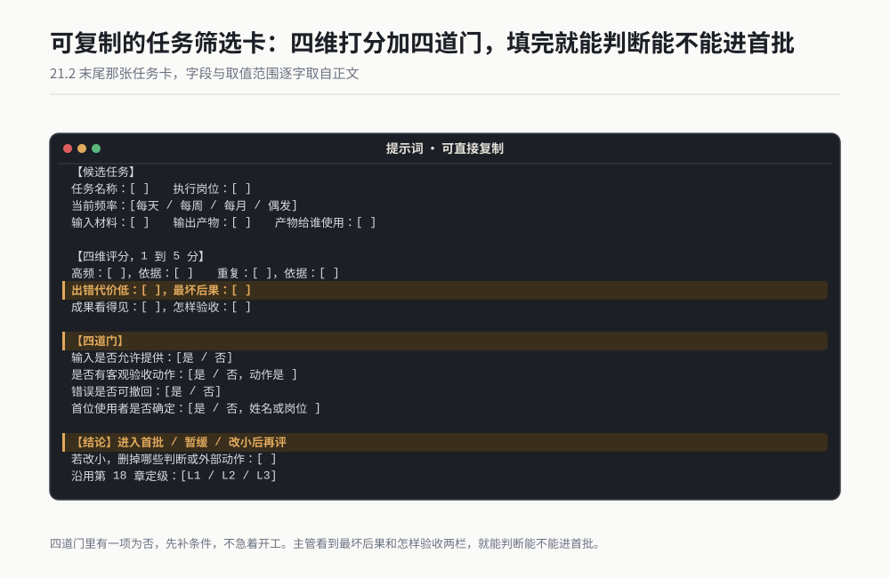

*作者根据公开资料绘制*

预期输出是一张填完整的任务卡。主管看到“最坏后果”和“怎样验收”两栏，就能判断这项活能不能进入首批。四道门里有一项为否，先补条件，不急着开工。

## 21.3 三步推开法

我后来把部门推广压成三步：一个人先跑通，三个人抄作业，全组定规矩。三步的单位分别是任务、复制和制度。每一步都有成功标志，没达到就留在当前步，不按日历硬往前赶。

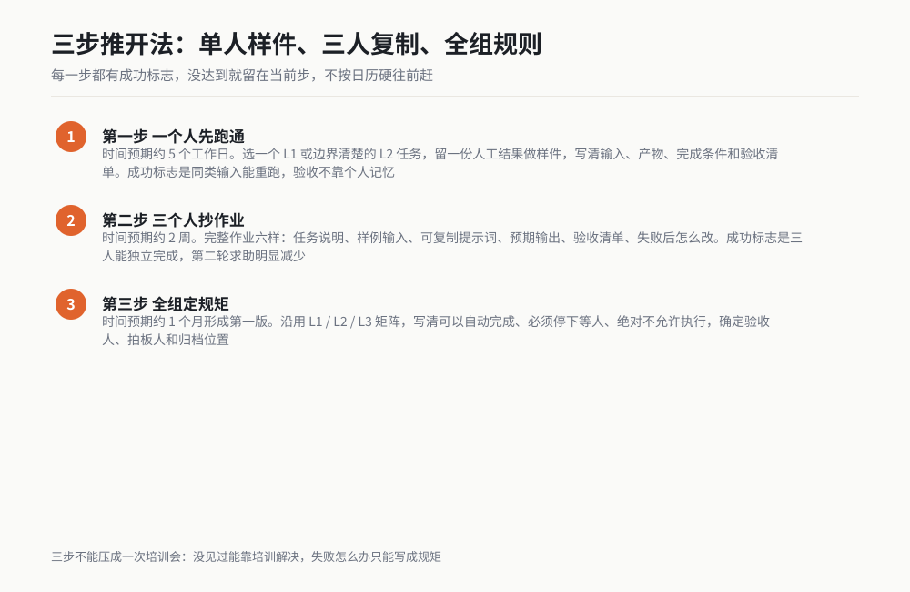

*图 21-3 从单人样件到全组规则的三步路径。作者根据公开资料绘制。*

### 第一步：一个人先跑通

**时间预期：约 5 个工作日。** 复杂一点的任务可以多用几天，但只跑一个任务，不同时开三条线。

这个人最好是任务的实际执行者，不一定是主管，也不一定是工具最熟的人。他需要有权拿到真实材料，知道原结果长什么样，也能判断哪里错了。主管负责给时间和边界，不替他把所有操作做完。

具体动作如下：

1. 从 21.2 的清单里选一个 L1 或边界清楚的 L2 任务。
2. 保存一份历史人工结果，作为比较样件。
3. 写清输入、产物、完成条件、禁止动作和验收清单。
4. 用一组材料先跑，保留第一次失败结果。
5. 修改规则后再跑，直到同类输入能稳定复用。
6. 记录人工原步骤、AI 参与后的步骤，以及人仍需做的检查。
7. 把最终提示词、样例输入、样例输出、验收记录放进同一目录。

成功标志不看“结果很惊艳”，看五件事实：另一天能重跑；换一组同类输入仍能完成；验收动作不靠原作者记忆；失败项会被明示；产物没有越过任务边界。

第一步最容易犯的错是把先行者变成英雄。他为了让演示成功，手工改了很多地方，却没有记录。演示当天一切顺利，别人照做就失败。主管必须追问：“你手改了哪里？这些动作能不能写进步骤？”藏着的人工动作越多，复制越困难。

### 第二步：三个人抄作业

**时间预期：约 2 周。** 三个人最好来自同一任务的不同使用位置，例如一位执行者、一位下游使用者、一位需要验收的人。不要只找三个同样熟练的爱好者。

“抄作业”不是发一段提示词让大家自己琢磨。完整作业至少有六样：任务说明、样例输入、可复制提示词、预期输出、验收清单、失败后怎么改。少一项，复制就会变成重新研究。

具体动作如下：

1. 三个人分别用自己的同类材料执行，不共用先行者做好的结果。
2. 第一次执行时不允许先行者代操作，只能回答任务卡上没有写清的问题。
3. 每个提问都记入“说明缺口”，当天补进模板。
4. 三份产物使用同一张验收表，由使用者先验，再互换抽查。
5. 记录失败类型，不比较谁快。
6. 一周后再做第二轮，检查大家能否不求助完成。
7. 让三个人各用约五分钟讲一个踩坑点，不做只讲成功的汇报。

成功标志有四个：三个人都能独立完成；同类错误没有连续出现；验收结论大体一致；第二轮求助明显少于第一轮。这里不要求结果写法完全一样，只要求事实、结构和责任边界一致。

我在这一阶段见过一个很典型的问题。先行者习惯把输入文件改成固定名称，提示词里却没写。第二个人直接用原文件名，任务找不到输入。这个错误与 AI 能力无关，它暴露的是个人习惯没有进入作业。我们把“允许文件类型、命名规则、找不到文件时停手”补进任务卡，第三个人就没有再卡住。

### 第三步：全组定规矩

**时间预期：约 1 个月形成第一版，此后按月小修。** 这里的重点不再是会不会操作，而是部门怎样共同承担质量、资料和外部影响。

具体动作如下：

1. 把前三个人的记录整理成可讨论的事实：做了哪些任务、出现哪些错误、哪里需要人拍板。
2. 召开一次约一小时的规则会，只讨论真实案例，不讨论想象中的万能场景。
3. 沿用第 18 章的 L1 / L2 / L3 矩阵，把本部门常见任务放进去。
4. 逐项写清可以自动完成、必须停下等人、绝对不允许执行的事项。
5. 确定验收人、拍板人、归档位置和出错后的处理顺序。
6. 发布《部门 AI 使用约定》第一版，指定维护人和下次复查日期。
7. 选第二个任务重复前两步，验证规矩能否跨任务使用。

成功标志也很具体：成员遇到新任务时会先定级；L2 有清楚停点；L3 没有外部执行；同一类产物进入同一归档位置；出错后能找到输入、输出、验收人和拍板记录。

三步不能压成一次培训会。培训能解决“没见过”，解决不了“第一次失败怎么办”“部门认可什么结果”“谁能批准外部动作”。这些问题只能在真实任务里写成规矩。

### 三步推进看板

| 步骤 | 核心对象 | 主管具体动作 | 时间预期 | 成功标志 | 未通过时怎么做 |
|---|---|---|---|---|---|
| 一个人先跑通 | 一个低风险任务 | 给真实材料、冻结边界、要求保留失败记录 | 约 5 个工作日 | 同类输入可重跑，验收不靠个人记忆 | 缩小任务，补完成条件，再做样件 |
| 三个人抄作业 | 一套完整作业 | 组织独立执行和互换抽查 | 约 2 周 | 三人能独立做，验收结论接近 | 把求助问题写回模板，不急着扩人数 |
| 全组定规矩 | 一份部门约定 | 主持定级、责任和归档讨论 | 约 1 个月形成第一版 | 新任务会定级，产物有记录，外部动作有人批 | 用最近一次真实错误改约定，再复测 |

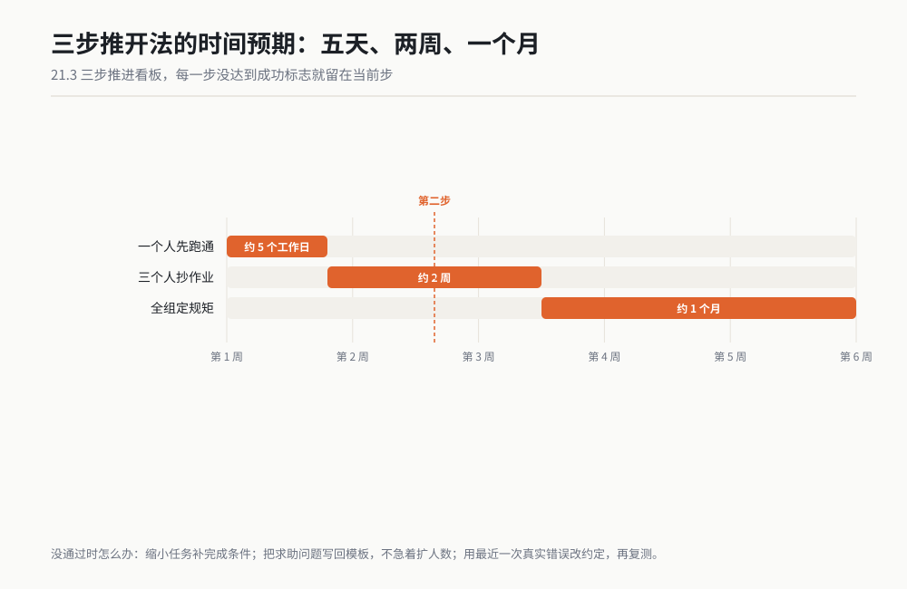

*作者根据公开资料绘制*

## 21.4 团队规矩怎么定

下面这份模板是本章最值钱的一页。它故意写得具体，因为“合理使用、注意安全、加强审核”无法指导任何一个动作。复制后，把方括号内容换成你部门的岗位、目录和审批方式。

模板直接沿用第 18 章的 L1 / L2 / L3 决策矩阵。第 18 章负责解释怎样定级和怎样验收，本章只把同一套矩阵扩展到团队分工。第一次使用前，建议先回看第 18 章场景 69 至 72。

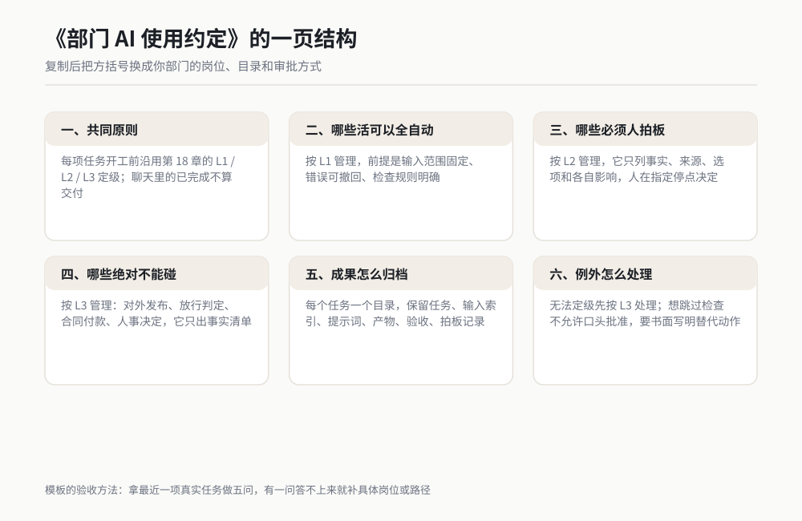

*图 21-4 《部门 AI 使用约定》的五块核心内容。作者根据公开资料绘制。*

### 《部门 AI 使用约定》模板

```text
# [部门名称] AI 使用约定
版本：[V0.1]
生效日期：[ ]
维护人：[岗位或姓名]
复查日期：[ ]
适用范围：[团队、项目、资料范围]

## 一、共同原则
1. 每项任务开工前，沿用第 18 章的 L1 / L2 / L3 决策矩阵定级。
2. AI 产物必须经过本约定规定的人工作业后，才能进入正式交付目录。
3. 聊天中的“已完成”不算交付，文件、记录和验收结果齐全才算。
4. 输入缺失、规则冲突、需要扩大范围时，立即停下，由指定人员决定。
5. 不以速度、使用次数或产物数量代替质量判断。

## 二、哪些活可以全自动
以下事项按 L1 管理，前提是输入范围固定、错误可撤回、检查规则明确：
- [例：内部会议记录整理成固定四栏]
- [例：已批准目录内生成文件索引]
- [例：按既有模板汇总周报素材]
- [例：批量检查缺文件、重名和命名格式]

L1 执行要求：
- 开工前写明输入目录、输出目录和完成条件。
- 原始材料只读，结果写入新文件。
- 完成后执行快速核，报告总数、失败数、跳过数和异常项。
- 发现规则无法覆盖的输入，转为 L2，不得自行猜测。
- 产物进入正式目录前，由 [岗位] 看一次检查结果。

## 三、哪些必须人拍板
以下事项按 L2 管理，AI 可以准备材料、列选项、生成草稿，人必须在指定停点决定：
- [例：试验方案编排]
- [例：技术文件草稿]
- [例：根因候选排序]
- [例：供应商比选材料整理]
- [例：规范冲突的处置方案]

L2 停点写法：
- 停点 A：AI 只列事实、来源、选项和各自影响，不得选择。
- 拍板人：[岗位或姓名]。
- 拍板记录：选择哪一项、理由、日期、依据文件。
- 停点 B：执行完成后按第 18 章抽样核，未通过项返回修改。
- 出现新选项或范围变化时，回到停点 A，不得沿旧批准继续。

## 四、哪些绝对不能碰
以下事项按 L3 管理。AI 只允许整理已提供的信息，不得执行动作，不得替人形成最终决定：
- 对外发布、发送正式文件或作出技术承诺。
- 量产放行、质量判定和安全相关结论的最终批准。
- 合同签署、下单、付款、报价确认和预算批准。
- 录用、辞退、调薪、绩效结论等人事决定。
- 修改生产环境、权限、账号、密钥和正式数据库。
- 删除、覆盖、改写原始试验记录与正式归档。
- 未经批准提供客户资料、供应商资料、个人信息和内部敏感文件。
- [本部门新增的 L3 事项]。

L3 执行要求：
- AI 只能输出事实清单、来源位置和可选方案。
- 最终判断、签字、发送、发布和系统操作由指定人员完成。
- 验收采用第 18 章的全量核加第二人。
- 发现工具已经发生外部动作，立即停止并报告负责人。

## 五、出问题谁负责
1. 任务发起人负责：提供真实输入，写清目的、范围和完成条件。
2. 定级人负责：按第 18 章矩阵确定 L1 / L2 / L3；拿不准时上提一级。
3. 执行人负责：按批准的任务单操作，保留输入、输出和过程记录；不擅自扩大范围。
4. 验收人负责：执行规定检查，记录通过、未通过和未核实项；未通过不得放行。
5. 拍板人负责：对 L2 的选择和 L3 的最终决定写下理由并签名或留记录。
6. 主管负责：提供规则、时间和复盘条件；确认首次错误先查规则缺口。
7. 任何人跳过自己应做的动作，都要在复盘中写明跳过的位置和影响。

问题发生后的顺序：
- 第一步，停止继续使用或外发错误产物。
- 第二步，列出影响对象和已收到产物的人员。
- 第三步，保留原输入、原输出、任务单、检查记录和拍板记录。
- 第四步，按第 18 章场景 72 查到第一个出错步骤。
- 第五步，把新增规则写回本约定、提示词或验收表，并用原案例复测。

## 六、成果怎么归档
统一目录：[完整路径]

每个任务一个目录，命名规则：
[日期]_[任务名]_[负责人]_[级别]

目录内至少包含：
00-task.md          任务目的、输入、范围、完成条件、级别
01-input-index.md   输入文件清单、版本、来源位置
02-prompt.md        实际使用的提示词和修改记录
03-output/          AI 生成的产物
04-check.md         人工验收结果、抽样位置、未通过项
05-decision.md      L2 / L3 的拍板内容、理由、日期
06-review.md        出错时的复盘与新增规则

归档纪律：
- 正式目录只接收通过验收的版本。
- 原始材料保持只读，不用 AI 产物覆盖原件。
- 文件名中不得写“最终版”“最新版”这类无法判断先后的词，使用日期和版本号。
- 聊天截图不能代替提示词原文、输入索引和验收记录。
- [岗位] 每月抽查 [若干] 个任务目录，记录缺项，不补造过程记录。

## 七、例外怎么处理
1. 新任务无法定级时，先按 L3 处理，由 [岗位] 决定。
2. 因项目紧急想跳过检查时，不允许口头批准；由 [岗位] 书面写明替代检查动作。
3. 发现输入资料不应提供给工具时，立即停止，不复制、不转写、不继续尝试。
4. 需要修改本约定时，提交真实案例、原条款和建议新条款，由 [岗位] 批准后改版。

## 八、版本记录
| 版本 | 日期 | 修改条款 | 触发案例 | 批准人 |
|---|---|---|---|---|
| V0.1 | | 初版 | 三人试用记录 | |
```

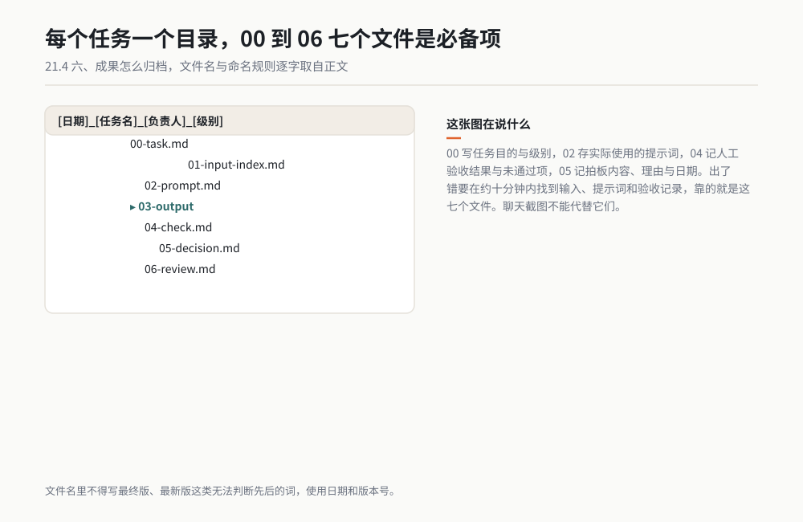

*作者根据公开资料绘制*


### 这份约定怎样落到现场

模板不能发完就算完成。第一次发布时，主管拿一个真实任务带全组走一遍：先定级，再看谁执行、谁验收、谁拍板，最后把文件放进约定目录。成员看到一次真实走法，才知道每一栏有什么用。

第二，约定要允许暴露“不知道”。任务无法定级、输入能不能提供拿不准、验收方法写不出，都先停。强迫成员当场给答案，只会逼他们把疑问藏起来。

第三，改约定必须有触发案例。有人提议加一条规则，要说清它防的是哪次错误；有人想删一条，也要说明这条为何造成无效工作。规则围着现场问题长，不围着想象长。

第四，主管自己也受约定约束。我有一次为了赶评审，让同事先把草稿发给我，却没有补拍板记录。第二天复查目录，缺的正是我要求别人必须写的那份记录。我补完后在组会上承认这一步是我漏的。主管若把自己放在规则外，团队很快也会把规则当装饰。

### 模板的验收方法

拿最近一项真实任务做五问：

1. 新人只看约定，能否判断它属于哪个级别？
2. 执行者能否说出自己什么时候必须停？
3. 产物出错后，能否在约十分钟内找到输入、提示词和验收记录？
4. L2 的选择能否找到拍板人和理由？
5. L3 的外部动作是否明确留在人手里？

有一问答不上来，就回到对应条款补具体岗位、路径或动作。不要再加“注意”“原则上”这类词，它们只会让文件变长。

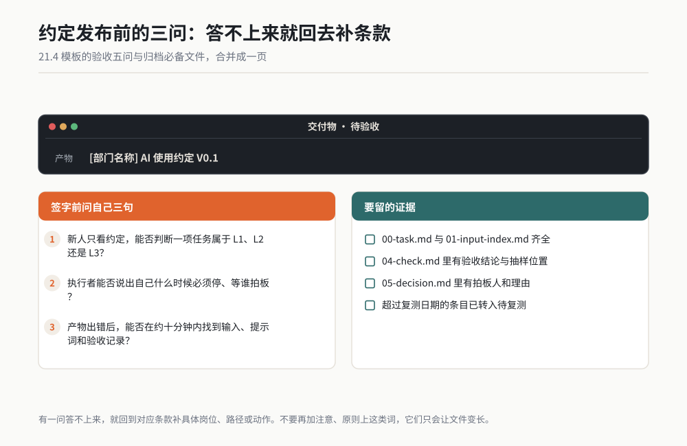

*作者根据公开资料绘制*

## 21.5 把个人方法变成部门资产

一个人的好方法若只存在他的对话历史里，他休假后方法就停了。部门真正需要的是三类可复用资产：技能库负责“怎么连续做”，提示词库负责“怎样说清一项任务”，案例库负责“什么情况下有效或会失败”。

这里的“技能”指一组固定步骤、工具动作和检查规则，可以被重复调用。它比一段提示词多了执行顺序和验收动作。小白可以把它理解成部门自己的电子作业指导书。

### 技能库：存可重复执行的完整做法

技能库的最小单元是一件能稳定完成的小任务，不必从炫目的自动化流程开始。每个技能至少包含：适用范围、输入要求、执行步骤、停手条件、输出文件、验收清单、维护人、最近验证日期。

我建议技能目录按任务命名，不按工具命名。例如“会议事项提取”“规范版本差异”“试验日志缺口检查”。工具会变化，岗位任务更稳定。按工具命名，半年后目录里会出现一堆没人知道用途的文件。

一个技能进入部门库前，要过三道检查：先行者在不同材料上跑过；第二个人能不求助复现；维护人明确。缺维护人的技能宁可留在试验区，也不要标成正式可用。

**技能卡模板：**

```text
技能名称：[按任务命名]
适用岗位：[ ]
适用输入：[文件类型、字段、目录要求]
不适用情况：[ ]
沿用第 18 章定级：[ ]
执行步骤：[1、2、3……]
必须停手：[输入缺失、范围变化、判断冲突……]
输出文件：[名称与位置]
验收动作：[ ]
失败样例：[案例库编号]
维护人：[ ]
最近验证日期：[ ]
状态：[试验 / 可用 / 暂停]
```

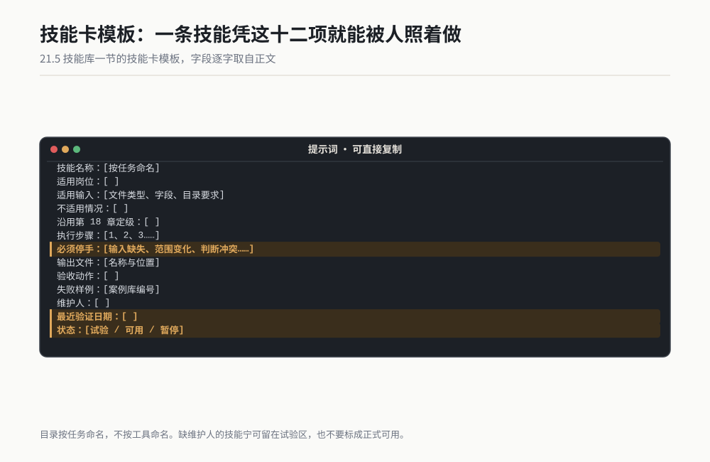

*作者根据公开资料绘制*


### 提示词库：存任务单，不存聊天花样

提示词库最常见的问题是数量越来越多，名字却都像“万能版”“增强版”“最终版 2”。成员找不到适用范围，只能随便挑一个。我的做法是给每条提示词加元数据，也就是描述它身份的几项信息。

每条提示词顶部写六项：任务、输入、输出、级别、验收、维护人。正文里方括号必须有填写说明。提示词修改后保留版本记录，说明改了哪条、由哪次错误触发。

一条提示词若只在作者手上成功，不进入正式区。另一位同事用自己的材料跑通后，才把状态从“个人试用”改成“部门可用”。这个门槛能挡住很多只在特定对话里有效的偶然结果。

**提示词条目模板：**

```text
名称：[ ]
用途：[一句话]
适用输入：[ ]
预期输出：[ ]
任务级别：[L1 / L2 / L3]
人工检查：[ ]
维护人：[ ]
版本：[ ]
触发修改的案例：[ ]
正文：[完整可复制提示词]
```

### 案例库：成功和失败各存一份

部门案例库不能只放获奖作品。成功案例告诉新人怎样做，失败案例告诉他哪里必须停。两者都要保留原输入索引、原提示词、产物、验收记录和改后的规则。

案例名称要让人能检索，例如“会议纪要漏责任人”“规范比较把格式变化误判为内容变化”“日志异常被自动补值”。不要写“案例 01”或“某次问题”，三个月后没人知道里面是什么。

失败案例入库时不追求写长报告，只回答六个问题：做什么、哪一步先错、为什么当时没发现、影响到哪里、加了哪条规则、复测是否拦住。涉及个人的讨论留在管理过程里，案例库聚焦任务和规则。

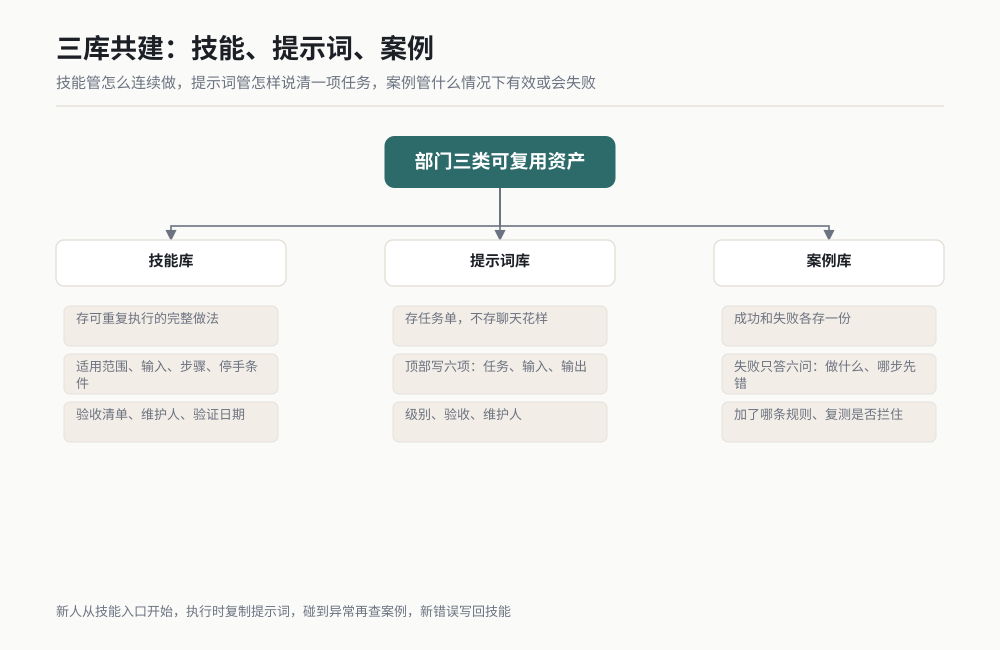

*图 21-5 技能库、提示词库和案例库的分工。作者根据公开资料绘制。*

### 三库怎样一起工作

以“规范版本差异”为例。技能库里放完整步骤：读取两个版本、按条款编号比较、输出差异、执行抽查。提示词库里放可复制的任务单。案例库里放一次成功比较和一次误把页眉变化当条款变化的失败记录。

新人先从技能入口开始，执行时复制提示词，碰到异常再查案例。发现新错误后，把案例编号写回技能的“不适用情况”或验收清单。这样三类资产互相引用，不会变成三个各自长大的文件堆。

### 共建机制：每个人只多做一个小动作

共建若变成额外写长文，很快会停。我给团队定的最小动作是：使用者每次只补一个发现。提示词少一个输入说明，就补那一行；验收漏一种异常，就加一项；出现新失败，就建一张六问案例卡。

维护人每月做一次整理：合并重复条目、把长期未验证的项目转入暂停区、检查链接能否打开、提醒对应负责人复测。整理的目标是让人找得到、看得懂、照着能做，不追求条目多。

部门主管每季度挑几个被高频使用的任务复查。若工具、文件格式或流程已经变化，技能状态先转为“待复测”。过期方法继续挂着，比没有方法更危险，因为新人会把“正式库”当成已验证事实。

我还会保留个人试验区。新想法先在个人区跑，不要求一开始就写全所有字段。等它经过三人复制，再移入部门正式区。没有试验区，成员怕弄乱正式库，不愿贡献；没有进入门槛，正式库又会被半成品塞满。

## 21.6 怎么衡量有没有效果

团队推广最容易被一个漂亮数字带偏，比如“节省了约多少小时”或“使用次数增长了多少”。时间重要，但它只说明动作可能变快，没有说明返工有没有增加、错误有没有外流、是不是只有两个人在用。

第 16 章讲过反指标：主指标旁边要放一把专门查取巧的尺子。团队推广也一样。你看节省时间，就同时看返工时间；你看使用人数，就同时看任务是否适合；你看产出数量，就同时看验收未通过数。

### 部门 AI 使用效果衡量表

| 维度 | 指标 | 计算或记录方法 | 数据从哪里来 | 配套反指标 | 主管要问什么 |
|---|---|---|---|---|---|
| 时间 | 单项任务人工投入变化 | 比较同类任务的准备、执行、验收总时长 | 任务卡与工时记录 | 验收时长、返工时长不能被删掉 | 省下的是搬运时间，还是少做了检查 |
| 质量 | 首次验收通过情况 | 记录通过、未通过、未核实三类 | `04-check.md` | 不得降低门槛或少抽样 | 通过增加是否来自规则更清楚 |
| 返工 | 返工次数与返工原因 | 每次返工记任务、原因、耗时 | 复盘记录 | 小修不能被拆成多个“成功任务” | 同类返工是否重复出现 |
| 错误 | 内部发现与外部发现的错误 | 按发现位置和影响范围记录 | 验收表、问题记录 | 不以少报告异常来改善数字 | 错误变少，还是大家不愿上报 |
| 覆盖面 | 实际使用岗位与人数 | 统计当月完成过合格任务的人和岗位 | 归档目录 | 不把一次打开或一次提问算采用 | 是否只集中在少数爱好者 |
| 任务面 | 可稳定复用的任务数 | 进入正式技能库且完成复测的任务 | 技能库 | 未复测、无维护人的不计入 | 新增任务是否仍有明确边界 |
| 责任 | 定级、验收、拍板记录完整情况 | 抽查任务目录的必备文件 | 月度抽查 | 不允许事后补造记录 | 出问题能否找到责任动作 |
| 学习 | 方法复用与案例贡献 | 记录模板被他人复用和规则修订 | 三库版本记录 | 不用条目数量代替质量 | 方法离开原作者还能不能用 |

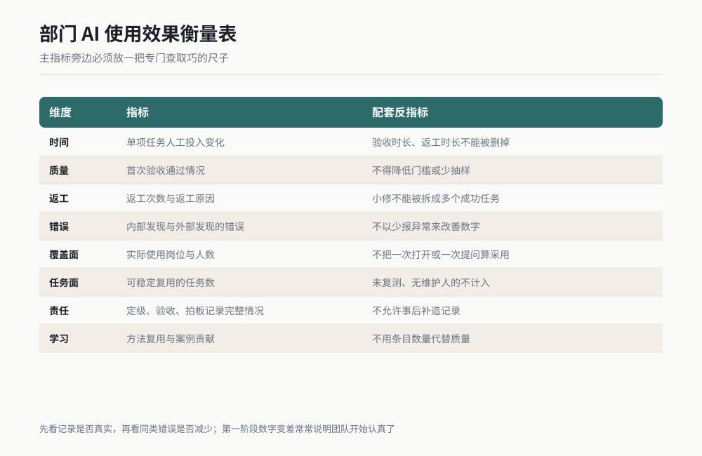

*图 21-6 部门效果衡量的多指标仪表。作者根据公开资料绘制。*

### 先记基线，再谈改善

没有基线，任何“提升”都只能靠印象。选定首批任务时，先记录一次原人工做法：输入规模、总用时、返工次数、检查方法、产物去向。AI 参与后仍按同一口径记录。

总用时要包含准备、执行、等待、验收和返工。只记工具运行时间，会把人的整理和检查藏掉。我见过一次看起来只花约十分钟的任务，输入清理和结果核对却用了约一小时。它仍可能有价值，但不能报成“十分钟完成”。

基线也不要求精确到每一分钟。团队可以用任务开始与结束时刻、日程记录和文件修改时间做近似，只要前后口径一致。对管理判断来说，持续记录的粗数据比临时编一组漂亮小数更可靠。

### 别用单一指标

只看节省时间，会鼓励人少做检查；只看使用次数，会鼓励人把简单提问也算一次任务；只看产物数量，会鼓励拆文件；只看错误数量，又可能让人少报错误。

我给每个主指标至少配一个反指标：

| 主指标 | 容易出现的取巧 | 反指标 |
|---|---|---|
| 单项耗时下降 | 少做验收、漏记返工 | 验收动作数不减少，返工时长单列 |
| 使用人数增加 | 强迫所有人登录一次 | 只统计完成并归档过合格任务的人 |
| 正式技能数增加 | 半成品也进入正式区 | 必须经第二人复现，有维护人和复测日期 |
| 首次通过增加 | 放宽门槛、把未知算通过 | 验收门槛冻结，未核实单独统计 |
| 错误数量下降 | 异常不记录、内部处理后消失 | 主动上报数与外部发现数分开看 |

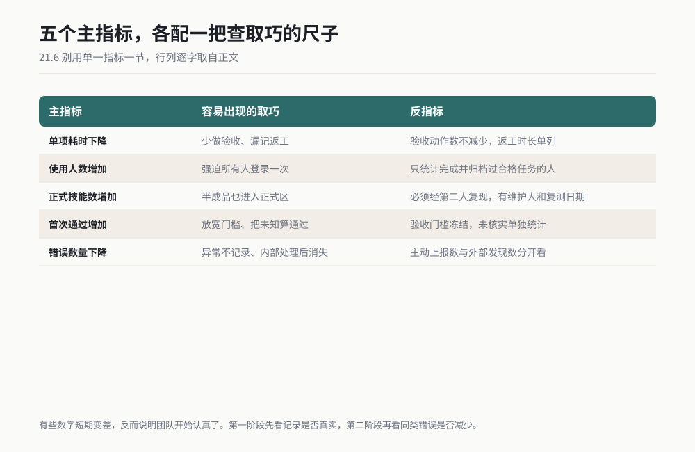

*作者根据公开资料绘制*

有些数字短期变差，反而说明团队开始认真了。刚实施验收表时，未通过项可能增加，因为过去很多问题没有被记录。主管若看到数字变差就批评，成员会马上学会少写。第一阶段先看记录是否真实，第二阶段再看同类错误是否减少。

### 一张月度复查卡

```text
【月份】[ ]
【首批任务】[ ]

1. 时间
人工基线总时长：[约 ]
本月准备 + 执行 + 验收 + 返工总时长：[约 ]
省下的时间去了哪里：[ ]

2. 质量
通过：[ ]
未通过：[ ]
未核实：[ ]
外部发现错误：[ ]
是否修改过验收口径：[是 / 否，说明 ]

3. 覆盖
完成过合格任务的人数：[ ]
覆盖岗位：[ ]
只使用一次后停止的人数：[ ]
停止原因：[责任 / 不会选任务 / 首次失败 / 与岗位无关 / 其他]

4. 资产
新增正式技能：[ ]
第二人复现完成：[ ]
新增失败案例：[ ]
超过复测日期的条目：[ ]

5. 下月只改一件事
最常见的阻力或错误：[ ]
准备修改的规则：[ ]
负责人：[ ]
复查日期：[ ]
```

预期输出是一张能看出趋势的月度卡，不需要另写长汇报。每月只选一个最常见问题改，避免同时追十个目标。连续几个月后，你会看见到底是任务选择有问题、培训有问题，还是验收和责任边界有问题。

### 怎么向上汇报

部门负责人向公司汇报时，建议讲三件事实：哪些任务已经稳定复用，质量和返工怎样变化，下一步准备扩到哪里。不要只展示工具页面，也不要只报一个节省小时数。

一个可信的汇报句式是：“本月在三类内部任务上使用，已有多名成员独立完成；节省主要来自资料整理，验收动作保留；发现的主要问题是状态字段不统一，已写入模板并复测。”这里有范围、有结果、有问题，也有下一步。

如果高层只追问“到底省了多少人”，部门负责人要把话题拉回任务和产能：省下了哪些重复动作，释放的时间投入了哪些原本欠缺的验证，质量是否变稳。用任务事实回答，比承诺一个无法负责的比例更可靠。

## 21.7 常见翻车

### 翻车一：强制全员使用

症状通常是登录人数很快上升，真实产物没有增加。成员为了完成要求，随便问一个问题、截一张图，就算完成。主管看到的是热闹，团队学到的是怎样应付检查。

补救动作：停止统计登录和提问次数，改为自愿报名首批任务。只统计经过验收并归档的合格产物。优先让有真实痛点的人先做，再用成功作业吸引相邻岗位。

强制还会放大被替代的担心。有人尚未知道工具能帮自己做什么，就先收到“必须用”的命令，他会把这件事理解成能力审查。推广的第一目标应是让一个任务变轻，不是让一张人数表变满。

### 翻车二：只推工具不推方法

症状是培训讲了入口、按钮和功能，散会后成员仍不会选任务。大家各写各的提示词，产物格式不同，出错也没有共同记录。工具一更新，培训材料又要重来。

补救动作：培训只用一个真实任务，从输入、定级、提示词、产物、验收到归档完整走一遍。会后交付一套能抄的作业，让成员用自己的材料复现。

我见过一次约两小时的功能培训，现场反馈很好，第二周几乎没人继续用。后来改成约四十五分钟的任务实操，虽然只讲会议事项提取，反而有人把同样结构迁移到了评审意见和问题清单。人需要的是完成一件活的方法，不是记住菜单。

### 翻车三：没有验收规矩

症状是每个人凭感觉看结果。有的人逐条核，有的人扫一眼，有的人把排版整齐当作正确。发生错误后，团队只能争论“当时为什么没看出来”，却找不到哪项检查本来应该做。

补救动作：回到第 18 章。按出错代价选择快速核、抽样核或全量核；任务开始前确定验收档，不在看到漂亮结果后降档。部门约定里写清谁验、验什么、结果存哪里。

没有验收规矩时，主管越强调负责，成员越不愿意用。因为“负责”变成一个没有边界的要求。验收表把责任变成动作：核哪几项、抽哪些条、谁签字。动作能完成，口号不能。

### 翻车四：拿 AI 产出当结论直接对外

症状是内部草稿没有经过来源检查，就被复制到客户材料、供应商邮件或正式报告。最危险的地方常藏在限定词、版本号和样本范围里，它们会被写得过于确定。

补救动作：所有对外内容按 L3 管理，AI 只准备材料。责任人逐项核来源，必要时加第二人检查；发送、发布和技术承诺由人完成。对外文件的任务目录必须保留输入索引、验收记录和拍板理由。

我在第 18 章已经讲过一次被追问来源的教训。团队层面要再加一层：不能只靠某位谨慎的工程师记得检查。外发前的检查应写进共同约定，换一个人、换一个项目也照样执行。

### 翻车五：主管只看成功，不允许报失败

症状是分享会上全是漂亮结果，案例库里没有一次错误。真实使用中大家各自踩坑，却不敢留下记录。几个月后，同样的问题在不同人手里重复发生。

补救动作：每次分享固定留一个失败案例。主管先讲自己的失误，再请成员说哪条规则没写清。失败案例评价的是复盘质量，不按“谁犯错最多”排名。

一次三人试用里，有人把缺失字段如实写进失败栏，另一个人为了让结果完整，手工补了一个推测值。如果只看页面完整度，后者更漂亮；如果看可追溯性，前者才合格。主管表扬谁，团队就会学谁。

### 翻车六：资产库越建越大，没人维护

症状是提示词上百条，搜索结果里有多个同名版本；技能写着可用，实际输入格式早已变化；案例链接打不开。新人试一次失败，就不再相信部门库。

补救动作：正式区设置进入门槛和退出规则。没有第二人复现的不进正式区；超过复测日期的转入待复测；连续一段时间无人使用且任务已取消的移入归档区。每项都要有维护人。

库的价值取决于可用条目，不取决于总条目。我宁愿部门只有十个人人会用的小技能，也不愿有一百个无法判断版本的提示词。

## 小白词典

**团队采用**：一项方法离开最早使用的人，其他成员也能在真实工作中重复使用。类比：一道菜不只厨师长会做，按作业单换个人也能做出来。

**切入任务**：团队最先拿来试用的一小类工作，要求高频、重复、出错代价低、结果容易检查。类比：学游泳先在浅水区练换气。

**任务地图**：按岗位列出可尝试任务、输入、产物和风险的一张表。类比：商场楼层图，让人先找到与自己有关的区域。

**技能库**：保存完整执行步骤、停手条件和验收方法的部门目录。类比：可重复使用的电子作业指导书。

**提示词库**：保存经过复现、可以直接填写使用的任务单。类比：常用表单柜，选对表再填内容。

**案例库**：保存成功和失败的真实记录，用来证明方法何时有效、哪里会出错。类比：维修手册里的故障实例。

**维护人**：负责检查某项方法是否仍能使用、版本是否清楚的人。类比：工装有保管人，过期和损坏要有人处理。

**覆盖面**：真实使用已经到达多少岗位和成员，不把一次打开工具算进去。类比：一条新工艺在哪些工位真正执行过。

**反指标**：用来发现主指标被取巧做好的检查项。类比：看到速度提高时，同时检查漏检和返工有没有增加。

**归档**：把任务输入、提示词、产物、验收和决定按统一结构保存。类比：试验结束后把原始记录、报告和签字放进同一个档案袋。

## 你的岗位怎么用

**研发主管**：先从组内每周重复的资料整理、差异检查或问题跟踪里选一个任务。亲自审定级和验收表，让一位实际执行者跑通，再安排两位同事独立复现。你的重点是接住第一次小错，把缺口写回规则。

**项目经理**：把 AI 任务放进项目计划时，同时写负责人、任务级别、停点、验收人和归档位置。周会上不收“用了几次”，只看合格产物、未通过项和需要拍板的记录。对外材料统一按 L3 管理。

**部门负责人**：批准《部门 AI 使用约定》，明确省下时间的去向，不做个人速度排名。每月看时间、返工、错误、覆盖面和记录完整情况，避免用单一节省数字做结论。方法共建和案例贡献要进入团队工作总结。

**质量或流程负责人**：把现有检验和文件控制经验搬到 AI 产物上。抽查任务目录是否有输入索引、验收记录和拍板理由；发现重复错误，就推动修改模板或技能，不用一句“加强检查”收尾。

## 本章交付物

**《部门 AI 使用约定》模板。**

交付物就在 21.4，可整段复制。第一次填写时，不要从空想开始，拿三人试用阶段的真实记录，把本部门的 L1、L2、L3 任务、岗位、目录和审批方式填进去。

完成后用最近一项任务做演练。能在约十分钟内找到定级、输入、提示词、产物、验收和拍板记录，这份约定才算能用。找不到哪一项，就补具体路径和责任岗位，再发布第一版。

建议打印约定中的五块摘要：哪些可自动、哪些必须人拍板、哪些绝对不能碰、出问题谁负责、成果放哪里。完整版放部门共享空间，摘要放在成员每天能看到的位置。

## 本章金句

> 团队推 AI，先卡住的是人心里的责任账，工具功能还排在后面。

> 第一个任务要选容易赢的；一次可验收的小成功，比一场热闹的功能演示更能改变团队。

> 三个人能照着同一份作业做成，个人经验才开始变成部门方法。

> 速度省下来以后花在哪里，决定了成员把 AI 看成助手，还是看成威胁。

> 只看节省时间，会把验收和返工藏起来；团队效果必须同时看质量、错误和覆盖面。

> 规矩写到岗位、动作和目录才有用，写成“加强审核”只会多一页纸。

---

*（下一章：成本怎么算。团队开始稳定使用后，下一步要把工具、时间、维护和返工一起算进账。）*
