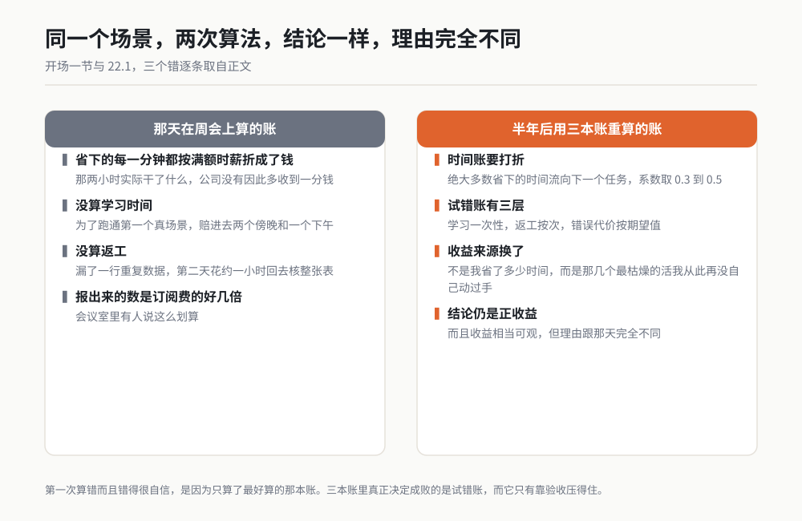
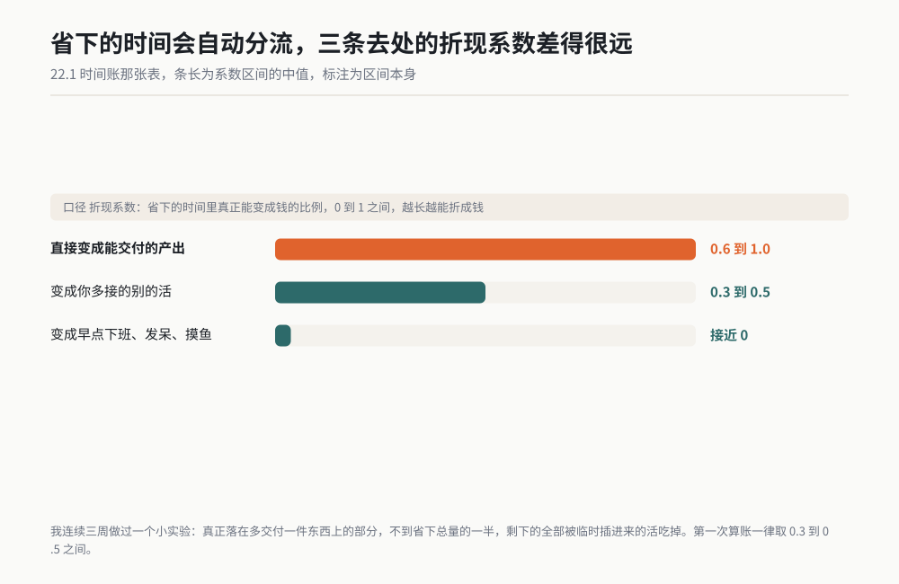
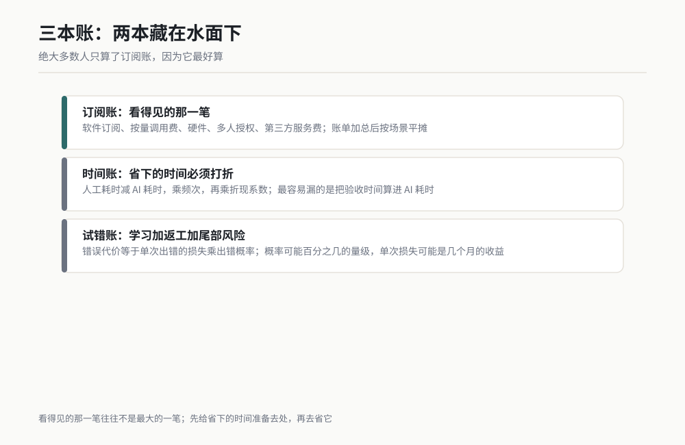
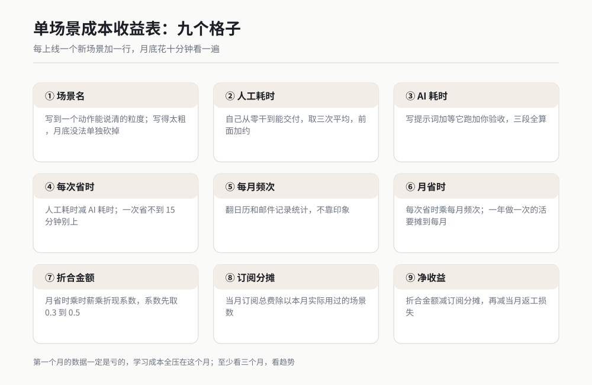
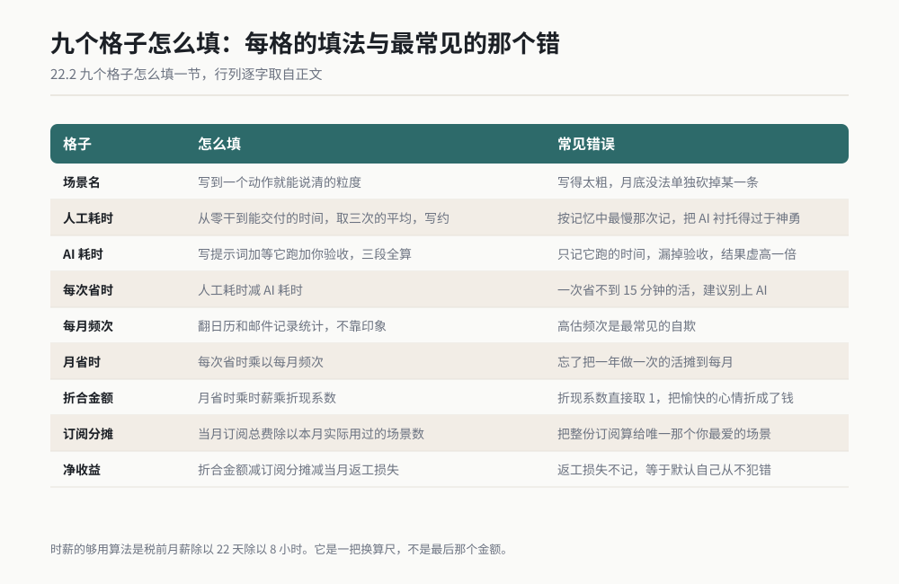
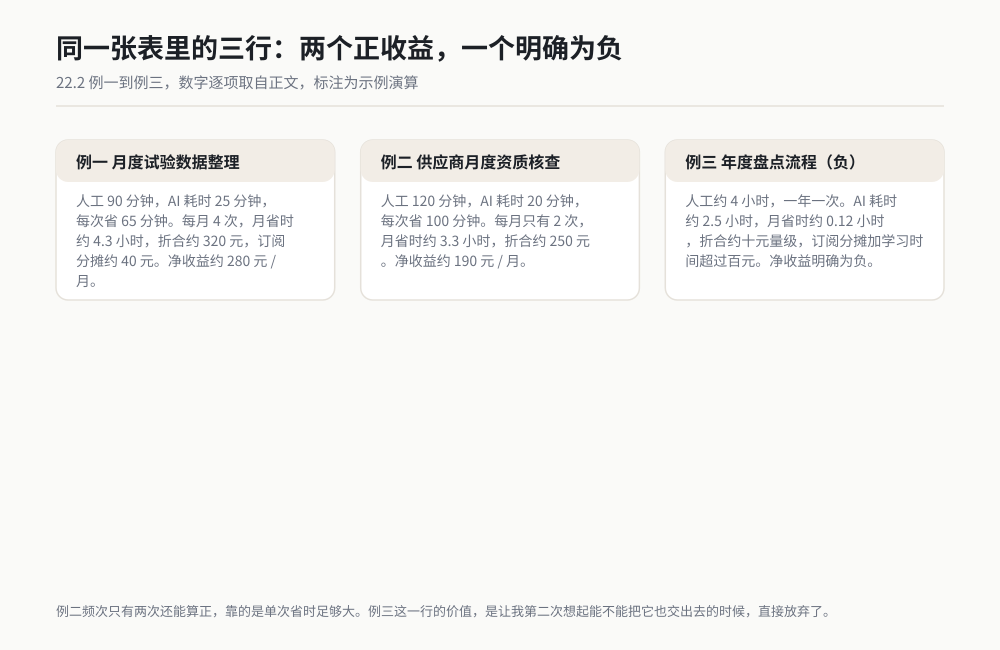
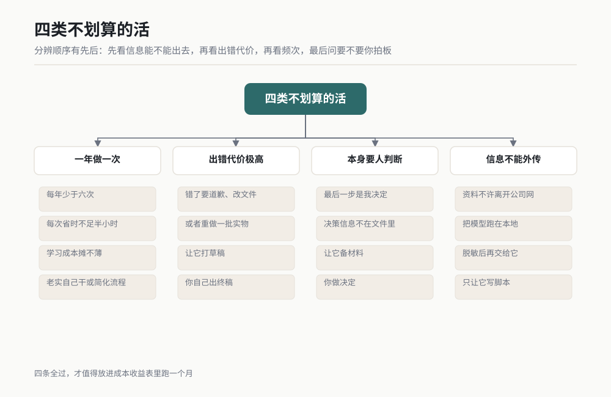
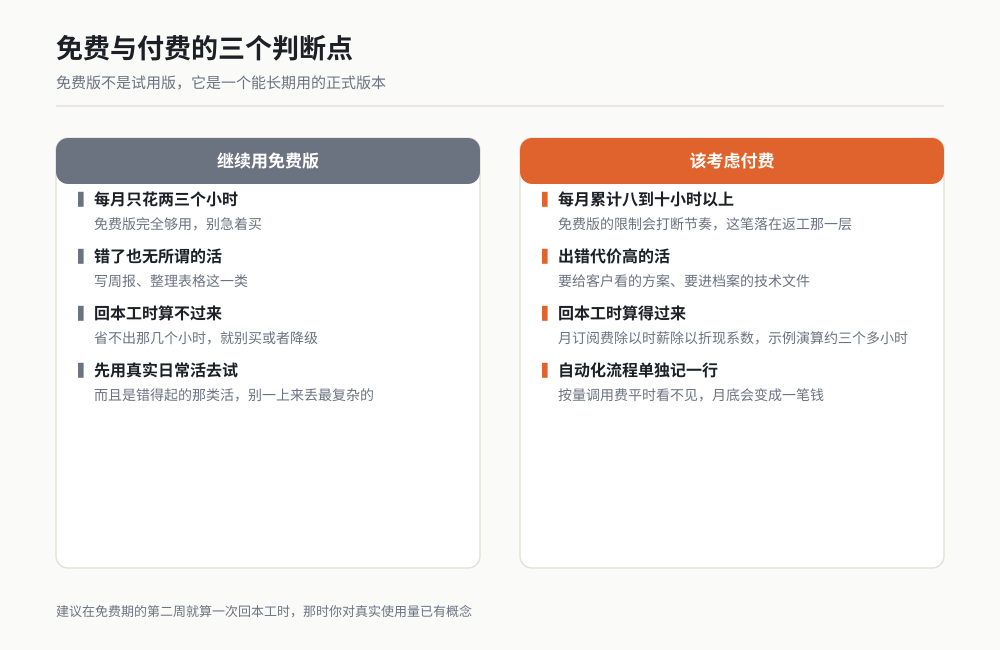
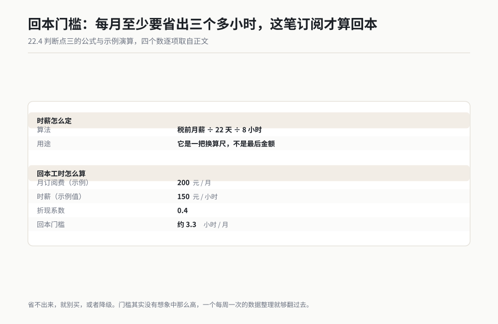
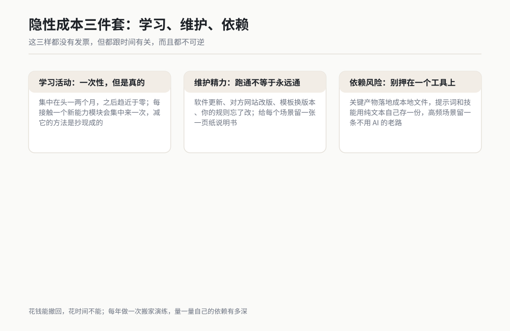

# 第 22 章 这笔账到底怎么算

> 订阅费从来不是最贵的那一笔。真正吃掉预算的，是那些省下来却没能变成产出的时间，和你试错赔进去的那个下午。

## 开场：我第一次算错了，而且错得很自信

我第一次算这笔账，是在一个周四下午的部门周会上。

同事问我：Eric，你天天鼓捣这个 AI，它到底值不值那笔订阅钱？我当时挺得意，掏出手机按了几下计算器。订阅费每月是三位数人民币的量级；我估了一下自己一个月靠它省下来的时间，按我的时薪折成钱，是订阅费的好几倍。我把这个数报出来，会议室里有人说"这么划算？"。

那天晚上我自己在工位上又算了一遍，发现错得很彻底。

**第一个错**：我把省下的每一分钟都按满额时薪折成了钱。可那一天下午省出来的两小时，我实际干了什么？提早收工，泡了杯茶，刷了会儿手机。它没有变成任何产出，公司没有因此多收到一分钱。

**第二个错**：我没算学习时间。为了把第一个真场景跑通，我赔进去两个傍晚，还有一个下午在跟报错死磕。那段时间按我的时薪折下来，接近小半年的订阅费。

**第三个错**：我没算返工。有一份它整理完的表格我觉得没问题，直接发出去了，结果漏了一行重复数据。第二天同事来问，我又花了约一小时回去核整张表。那次返工，一次性吃掉了那个场景两个月的全部净收益。

半年后我用三本账重新算了一遍。结论还是正收益，而且收益相当可观，但理由跟那天的会议室版本完全不同：它赚钱不是因为我省了多少时间，而是因为我把几个频次最高、最枯燥的活彻底交出去了，从此再没自己动过手。



*作者根据公开资料绘制*

这一章就讲这套算法。它是我在第 1 章 1.5 节随口提过的那句"你的活越值钱，这笔账越好算"的完整版本。

## 22.1 三本账：时间账、订阅账、试错账

绝大多数人算这笔账只算了订阅账，因为它最好算：账单上有数字，一眼看得见。另外两本账藏在水面下，却常常决定这笔投资是赚还是亏。

### 时间账：省下的时间必须打折

时间账的公式看起来很简单：

> 省下的时间 × 你的时薪 = 省下的钱

这个公式里藏着一个陷阱。省下来的时间会自动流向三个地方，只有其中一部分能变成钱。

| 省下的时间去哪了 | 折现系数（我的经验取值） | 说明 |
|---|---|---|
| 直接变成能交付的产出 | 0.6 到 1.0 | 比如报告当天就能发出去，客户能验收 |
| 变成你多接的别的活 | 0.3 到 0.5 | 省了两小时，但这两小时马上被下一个任务吃掉 |
| 变成早点下班、发呆、摸鱼 | 接近 0 | 对你个人有价值，对公司财务没有 |



*作者根据公开资料绘制*

**折现系数**这个词是我借来的，意思很朴素：省下的时间里，真正能折成钱的比例。（第一次出现的术语都在章末小白词典里。）

我在现实的研发部门里观察到的情况是，绝大多数人的时间流向第二种。所以第一次算账，我建议折现系数一律取 0.3 到 0.5 之间，别给自己的乐观留太多空间。跑熟半年之后，如果你确实能证明省下的时间变成了产出，再往上调。

唯一的例外是能直接变现的活。我自己接过几份外面的技术咨询和书稿，那种时候我写出来的东西当天就能开票，折现系数可以取到接近 1。

我自己踩过的一个坑也在这一栏里：**AI 耗时必须把验收时间算进去。** 很多人在计算时只记"它跑完用了 3 分钟"，忘了自己还有十几分钟的验收动作。在第 1 章开头那个 2000 行表格的例子里，它跑完只要几分钟，我验收核对 37 行花的时间跟它差不多。忽略验收，你的时间账会虚高一倍。

至于自己手上每个场景落在哪一档，我让它先分一遍，我再拍板。提示词里我把最终确认权写死了，因为它天生爱把你的场景往高档里抬。

```text
我手上有一批用 AI 干活的场景，我要给每个场景定一个折现系数，也就是省下的时间里真正能折成钱的比例。

【三档，按这个框架分】
- 高档 0.6 到 1.0：省下的时间当天就能变成可交付物，报告能发出去，客户能验收
- 中档 0.3 到 0.5：省下的时间马上被下一个任务吃掉，变成多干的别的活
- 低档接近 0：省下的时间变成早点下班、发呆、摸鱼，对个人有价值，对公司财务没有

【我的场景】
[一行一个场景，写清干什么、多久干一次、省下的时间一般拿去干嘛]
1. ...
2. ...

【你要做的】
1. 把每个场景归进三档之一，给出建议的系数区间。
2. 每个场景写清理由，理由里必须回答两个问题：省下的时间当天能不能变成可交付物？交给谁验收？
3. 拿不准的场景单列出来，说明你还差什么信息才能定档。

【规矩】
- 系数由我最终确认，你只给建议和理由。
- 我是第一次算账，建议区间一律从严，别给我的乐观留空间。
- 不许因为我把场景写得热闹，就把系数往高里给。
```

这套系数不是我拍脑袋定的。有一阵子我连续三周做了个小实验：每天记录自己因为 AI 省下了多少时间，再记录这些时间后来干了什么。三周下来的结果是，真正落在"多交付了一件东西"上的部分，不到省下总量的一半，剩下的全部被临时插进来的活吃掉，包括临时会议、同事求助、以及我自己临时想起来的杂事。

这个实验结果让我改了一个习惯：**先给省下的时间准备去处，再去省它。** 如果你明知这段省下来的时间只会被别的事吃掉，那它在账面上就该按低折扣记；如果你把它明确安排给了某个具体的交付物，它才配得上高折扣。这也解释了为什么同一个场景在不同人手里算出完全不同的收益，时间没有差，去处有差别。

这个实验你不用自己设计格式。下面这段提示词把它雇成你的记账员：格式它管收，汇总它管做，不合格的记录它管挑。

```text
我要连续三周记录 AI 给我省下的时间，看清这些时间到底流去了哪。你帮我定格式、收记录、做汇总。

【记录格式，每天三行，多一行都不要】
日期 | 今天它帮我省下了多少分钟 | 这些时间后来干了什么 | 变成了哪件交付物

填法说明：
- 省下几分钟写实测，写"约"，不许凑整。47 分钟就是 47 分钟，不许写 50。
- 后来干了什么写具体：发了哪份报告、改了哪张图、参加了哪个会。写"干了点杂事"算没写。
- 没有变成交付物就写"无"，不许硬凑一个。

【每周日你帮我做一次周汇总】
1. 这一周省下的总分钟数。
2. 按三档归类：当天变成交付物的、被别的活吃掉的、没写下落的，各占总量的几成。
3. 指出哪几天的记录不合格：省下分钟是整十的数，或者"后来干了什么"是空的。不合格的日期列出来，让我重记。

【三周结束做一次总汇总】
- 三档各占多少，落在"变成交付物"上的那一部分有没有过半。
- 按我的时薪 [填你的时薪] 元、中档系数 0.4 折算，这三周省下的时间大概值多少钱。
- 哪天记得最好、哪天记得最糊弄，指名道姓说出来。

【规矩】
- 不许替我补记录。我哪天没交，那天就标"缺记"，不许编。
- 汇总只按我交上来的记，不许外推。
```

三周攒满之后，记录就是一份 CSV。统计这一步别手算，我写了个小脚本，只用标准库，复制下来就能跑。它干的事跟上面提示词里要求的一样：按折现系数分档汇总、出每周汇总和三周总计、把不合格的日期挑出来。

```python
# 三周时间账统计脚本
# 读入一份 CSV，列固定为：日期,省下分钟,后来干了什么,变成了哪件交付物
# 干三件事：
#   1. 按折现系数三档归类：变成交付物、被别的活吃掉、没写下落
#   2. 输出每周汇总和三周总计，并按系数折成钱
#   3. 标出记录不合格的日期：省下分钟是整十，或者"后来干了什么"是空
# 只用标准库 csv，不用 pandas。

import csv
import sys
from datetime import date

# 三档折现系数，跟正文 22.1 的取值一致：
# 变成交付物的按 0.8 估（高档区间 0.6 到 1.0 的中值）
# 被别的活吃掉的按 0.4 估（中档区间 0.3 到 0.5 的中值，正文回本演算用的也是 0.4）
# 没写下落的按 0 算，这档在账面上就是白省
FACTOR_DELIVERED = 0.8
FACTOR_EATEN = 0.4
FACTOR_LOST = 0.0

HOURLY_WAGE = 150  # 时薪，正文示例值，换成你自己的数


def parse_rows(path):
    """读 CSV 并逐行校验。坏行直接报错退出，不静默跳过。"""
    rows = []
    with open(path, newline="", encoding="utf-8-sig") as f:
        reader = csv.reader(f)
        header = next(reader, None)
        if header is None or len(header) < 4:
            sys.exit("表头不对，应为：日期,省下分钟,后来干了什么,变成了哪件交付物")
        for lineno, row in enumerate(reader, start=2):
            if not row or all(not cell.strip() for cell in row):
                continue  # 空行跳过
            if len(row) < 4:
                sys.exit(f"第 {lineno} 行只有 {len(row)} 列，应为 4 列：{row}")
            day_s, minutes_s, went, deliverable = (c.strip() for c in row[:4])
            try:
                day = date.fromisoformat(day_s)
            except ValueError:
                sys.exit(f"第 {lineno} 行日期格式不对：{day_s!r}，应为 2026-09-01 这种")
            try:
                minutes = int(minutes_s)
            except ValueError:
                sys.exit(f"第 {lineno} 行省下分钟不是整数：{minutes_s!r}")
            if minutes <= 0:
                sys.exit(f"第 {lineno} 行省下分钟必须大于 0：{minutes}")
            rows.append((day, minutes, went, deliverable))
    if not rows:
        sys.exit("CSV 里一条有效记录都没有")
    return rows


def classify(went, deliverable):
    """按去处归三档：写了交付物进高档；只写了去处进中档；都没写进零档。"""
    if deliverable and deliverable != "无":
        return "变成交付物", FACTOR_DELIVERED
    if went:
        return "被别的活吃掉", FACTOR_EATEN
    return "没写下落", FACTOR_LOST


def is_bad(minutes, went):
    """不合格判定：分钟是整十（看着就像凑的），或者去处没写。"""
    return minutes % 10 == 0 or not went


def main():
    path = sys.argv[1] if len(sys.argv) > 1 else "时间账.csv"
    try:
        rows = parse_rows(path)
    except FileNotFoundError:
        sys.exit(f"找不到文件 {path}。把 CSV 放在脚本旁边，或者把路径作为第一个参数传进来。")

    first_day = min(day for day, *_ in rows)  # 以最早那天为第 1 周的起点

    # weekly[(周号, 档位)] = 分钟数；total[档位] = 分钟数
    weekly = {}
    total = {}
    bad_days = []

    for day, minutes, went, deliverable in rows:
        week = (day - first_day).days // 7 + 1
        label, _factor = classify(went, deliverable)
        weekly[(week, label)] = weekly.get((week, label), 0) + minutes
        total[label] = total.get(label, 0) + minutes
        if is_bad(minutes, went):
            bad_days.append((day, minutes, went or "（空）"))

    all_labels = ["变成交付物", "被别的活吃掉", "没写下落"]
    factors = {"变成交付物": FACTOR_DELIVERED, "被别的活吃掉": FACTOR_EATEN, "没写下落": FACTOR_LOST}

    n_weeks = max((day - first_day).days // 7 + 1 for day, *_ in rows)
    for week in range(1, n_weeks + 1):
        parts = [f"{label} {weekly.get((week, label), 0)} 分钟" for label in all_labels]
        week_sum = sum(weekly.get((week, label), 0) for label in all_labels)
        print(f"第 {week} 周：合计 {week_sum} 分钟（" + "，".join(parts) + "）")

    grand = sum(total.values())
    cashed = sum(total.get(label, 0) * factors[label] for label in all_labels)
    print(f"\n三周总计：{grand} 分钟（约 {grand / 60:.1f} 小时）")
    for label in all_labels:
        m = total.get(label, 0)
        share = m / grand * 100 if grand else 0
        print(f"  {label}：{m} 分钟，占 {share:.0f}%")
    print(f"折成钱：约 {cashed / 60 * HOURLY_WAGE:.0f} 元"
          f"（时薪 {HOURLY_WAGE} 元，三档分别乘 0.8、0.4、0）")

    if bad_days:
        print("\n记录不合格，建议重记：")
        for day, minutes, went in bad_days:
            why = []
            if minutes % 10 == 0:
                why.append("分钟是整十，像凑的")
            if went == "（空）":
                why.append("去处没写")
            print(f"  {day}：省下 {minutes} 分钟，去处：{went}（{'；'.join(why)}）")
    else:
        print("\n三周记录全部合格。")


if __name__ == "__main__":
    main()
```

### 订阅账：看得见的那一笔反而最不容易漏

订阅账是三本账里最容易列全的，因为它有一半写在账单上。

- **软件订阅**：按月或按年付的费用。这是唯一有发票的一项。
- **按量调用费**：模型调用按处理量计费，用得多就付得多。它跟订阅费平行存在，容易被忘掉。
- **硬件**：如果你要把模型跑在本地（有些单位的资料不能传到任何外部服务，这是常见做法），一次性的硬件升级可能是一笔真正的开销，通常由部门固定资产采购，不进你的个人账。
- **多人授权**：团队用的时候，人数直接乘上去。第 21 章讲过这一点，这里只是提醒你别漏乘。
- **第三方服务费**：某些连接器、某些数据服务是按次收费的，金额通常不大，但累计起来会给你一个惊喜。

这五类不用自己一条一条翻。我现在的做法是把过去三个月的账单、发票、信用卡记录整段丢给它，让它先干归类的粗活，我再核一遍。下面这段直接复制，方括号里换成你的记录。

```text
我要把过去三个月在 AI 上的花销列成一本订阅账。账单、发票、信用卡记录我贴在下面。

【你要做的事】
第一步：把下面每一条花销归进这五类，一类一节：
1. 软件订阅：按月或按年付的固定费用
2. 按量调用费：按处理量计费的模型调用
3. 硬件：为了在本地跑模型买的一次性设备
4. 多人授权：团队按人数乘出来的费用
5. 第三方服务费：按次收费的连接器、数据服务

第二步：标出两种问题项：
- 重复付费：同一个服务在两个渠道各买了一份
- 闲置：连续三个月没有使用记录的

第三步：汇总每一类的小计和三个月的总计。

【规矩】
- 不要替我估算。我贴的记录里没有的，就在那一栏写"未提供"，不许编一个数。
- 一条记录归不进任何一类的，单列一节叫"归不了类"，并说明卡在哪。
- 不确定属于哪一类的，写出来问我，不要自己拍。
- 只列账，不评价我买得值不值，评价的话留给我自己说。

【我的记录】
[把你的账单、发票、信用卡记录贴在这里，一条一行，能带金额和日期就带上]
```

订阅账的关键难点不是列全，是**分摊**。你一个月付一份订阅费，用它在五六个场景里干了活，那么每个场景该背多少？我的做法是平摊到底：这个月你在 N 个场景上用过它，就每个场景背 1/N。这个做法粗糙，但它足够保守，而且能立刻暴露问题：一个每月只用一次的场景，背上整份订阅的几分之一，立刻就变成负收益。

顺带说一个我见过的真实错漏：有人把"团队的钱"当成"别人的钱"。他们部门的 AI 订阅走的是部门预算，于是每个人算自己的收益时都默认订阅费为零，最后每个人都算出"赚翻了"，年底部门一汇总才发现整体是亏的。订阅费不会因为付钱的人不是你就不存在，它只是换了个地方躺着。

另一个容易翻车的地方是按量调用费。它的特点是平时几乎看不见，一旦你把一个"每天跑一次"的流程挂上去，它会在月底变成一笔像模像样的钱。我的经验是把这类自动化流程单独列一行订阅分摊，别让它混在日常对话用量里。

分摊这步算术我交给它，但算法必须由我定死：平摊到底，一个场景都别漏。它只负责算数和把负收益的挑出来，砍还是留是我的事。下面这段连算法带输出格式都写死了，复制就能用。

```text
我一个月付一份订阅费，在好几个场景里用它干活。我要按平摊法算每个场景各背多少，再找出被分摊拖成负收益的场景。

【我的数据】
当月订阅总费：[填你的月费，元]
当月实际用过的场景，一行一个：
场景名 | 每月频次 | 每次省时(分钟) | 我的时薪(元) | 折现系数 | 当月返工损失(元，没有就写 0)
[照这个格式填你自己的场景，有几个填几个]

【算法，按这个来，别换】
1. 每个场景的订阅分摊 = 当月订阅总费 ÷ 场景个数，一个都别漏。
2. 每个场景的月省时 = 每次省时 × 每月频次 ÷ 60，单位是小时。
3. 每个场景的折合金额 = 月省时 × 时薪 × 折现系数。
4. 每个场景的净收益 = 折合金额 - 订阅分摊 - 当月返工损失。

【我要的输出】
- 一张表：场景名 | 订阅分摊 | 折合金额 | 净收益，按净收益从高到低排。
- 净收益为负的场景单独标出来，每个给两个选项：砍掉，或者提频。选提频的要算给我听：频次提到每月几次，净收益才能由负转正。
- 全程不许替我改数据。觉得哪个数可疑，单列出来问我。

【规矩】
- 不要替我估算。我哪一栏空着，那一栏就标"未提供"。
- 频次是我翻日历和邮件记录数出来的，你不许觉得它低就替我调高。
```

### 试错账：唯一能一次性吃掉你半年收益的一本

试错账有三层，从轻到重：

**第一层是一次性学习成本。** 学会一个工具的时间，通常集中在头一到两个月，之后趋近于零。它是一次性的，所以能被时间摊薄，这也是唯一值得乐观的一层。

**第二层是返工成本。** 你相信了它的输出，结果有错，你得回去重看一遍，或者干脆重做。返工的特点是它跟你的熟练度负相关：越用越懂它的脾气，返工率越低，但永远不会降到零。

**第三层是错误代价。** 这是三本账里唯一带着尾部风险的一层，也是最容易被忽略的一层。它的算法是：

> 错误代价 = 单次出错的损失 × 出错概率

出错概率通常不高，可能百分之几的量级；但单次损失可能是几个月的收益。举个例子：一份给客户的正式报价，金额或者单位写错一个，你要付出的代价远不是"再改一遍"能概括的。第 18 章讲过的规矩在这里同样成立：AI 交出来的东西，你验过才算你的。

我自己挨过一次小的。那是一份发给外部单位的技术说明，里面引用了一段标准的条款号。它写得非常笃定，格式也很专业，我扫了一眼觉得没问题就发了。第二天对方工程师回邮件问了一句："这个条款号对应的是标准的哪一版？"我回去一查，那条号压根不存在。真正贵的地方不是那封更正邮件，是我在对方心里丢掉的一点信任，那种东西没法折算成钱，也不会出现在任何账单上。

从那之后我给自己加了一条规矩：**凡是往外走的文件，引用必须能追溯到源头的原句。** 它会多花我几分钟，这几分钟是账上实打实的支出，同时也是三本账里最划算的一笔保险费。

试错账难看就难看在它散：一次报错在这里，一次返工在那里，月底你根本想不起来。我的办法是平时随手记，每三个月让它帮我归一次堆、算一次总账。

```text
我要把这三个月在 AI 上翻过的车算成一本试错账。翻车的记录我贴在下面。

【我的翻车记录，一条一行】
[格式：大概日期 | 出了什么事 | 搭进去多少时间]
示例一行：9 月上旬 | 它整理的表漏了一行重复数据，我重核整张表 | 约 1 小时
[把你自己的贴在这里：报错的、提示词推倒重写的、返工的、方案整个推翻的，都算]

【你要做的事】
第一步：把每条归进这三层：
- 一次性学习成本：头一回接触某个工具或模块搭进去的时间
- 返工成本：相信了它的输出，结果有错，回头重看或重做的时间
- 错误代价：已经发出去或者已经用了，事后才发现错，造成的损失

第二步：按小时归类汇总，算出这三个月试错总投入，按我的时薪 [填你的时薪] 元折成钱。

第三步：把这笔钱摊到我当月的场景上。我的场景是：
[一行一个场景名，跟你成本收益表里的口径一致]
按场景个数平摊，算出每个场景各背多少试错成本。再跟每个场景的月净收益比一次：试错分摊吃掉净收益几成？哪个场景被吃成了负的？

【规矩】
- 不要替我估算。我记录里没写时间的，那一栏标"未提供"，不许编。
- 错误代价那一层只记真实发生了的损失，不许给我算"万一出错会怎样"，那是另一本账。
- 最后给我一句话结论：这三个月的试错账，主要花在了哪一层。
```



*图 22-1 三本账：看得见的那一笔往往不是最大的一笔。（作者根据公开资料绘制）*

### 三本账对照表

| | 时间账 | 订阅账 | 试错账 |
|---|---|---|---|
| 记账单位 | 小时 | 元 / 月 | 元 或 小时，混着记 |
| 怎么估 | （人工耗时 - AI 耗时）× 频次 × 折现系数 | 账单加总后按场景平摊 | 学习一次性 + 返工按次 + 尾部风险按期望值 |
| 最容易被漏算的地方 | 忘记把验收时间算进 AI 耗时 | 忘记按量调用费和多人授权 | 完全没想过出错怎么办 |
| 什么时候它会变大 | 你的时薪越高，它越大 | 用的人越多、活越重，它越大 | 出错代价越高，它越大 |
| 怎么压低它 | 提高验收效率，别提高期待 | 合并场景、砍掉低频场景 | 给高风险活加一道人工复核 |

这张表有一行值得多说一句：时间账会随你的**时薪**放大。这意味着同一个场景，在月薪五千上下的人手上是亏的，在月薪三万上下的人手上可能是赚的。这一条是整章的核心，22.6 节会回到它。

## 22.2 一套能直接套用的算法：单场景成本收益表

把三本账合起来，就是下面这张表。我在自己的电脑里存着一个这样的表格，每上线一个新场景就加一行，月底花十分钟看一遍。

| 场景名 | 人工耗时 | AI 耗时 | 每次省时 | 每月频次 | 月省时 | 折合金额 | 订阅分摊 | 净收益 |
|---|---|---|---|---|---|---|---|---|
| | | | | | | | | |

九个格子，每一个都有明确的填法。下面逐格讲。



*图 22-2 单场景成本收益表模板。（作者根据公开资料绘制）*

### 九个格子怎么填

| 格子 | 怎么填 | 常见错误 |
|---|---|---|
| 场景名 | 写到一个动作就能说清的粒度。"整理月度试验数据"，合格。"提升效率"，不合格 | 写得太粗，月底没法单独砍掉某一条 |
| 人工耗时 | 你自己从零干到能交付的时间，不含被打断的部分。取三次的平均，写"约" | 按"记忆中最慢那次"记，把 AI 衬托得过于神勇 |
| AI 耗时 | 写提示词 + 等它跑 + 你验收，三段全算 | 只记它跑的时间，漏掉验收，结果虚高一倍 |
| 每次省时 | 人工耗时减 AI 耗时 | 一次省不到 15 分钟的活，建议直接别上 AI |
| 每月频次 | 翻日历和邮件记录统计，不靠印象 | 高估频次是最常见的自欺，我自己的印象值经常是实际值的两倍 |
| 月省时 | 每次省时 × 每月频次 | 忘了把"一年做一次"的活摊到每月，月省时会虚高十倍 |
| 折合金额 | 月省时 × 时薪 × 折现系数 | 折现系数直接取 1，把愉快的心情折成了钱 |
| 订阅分摊 | 当月订阅总费 ÷ 本月实际用过的场景数 | 把整份订阅算给唯一那个你最爱的场景 |
| 净收益 | 折合金额 - 订阅分摊 - 当月返工损失 | 返工损失不记，等于默认自己从不犯错 |



*作者根据公开资料绘制*

**时薪怎么定。** 一个够用的算法是：税前月薪 ÷ 22 天 ÷ 8 小时。得到的数字别直接当成最后的金额，它是个换算尺：同一个省时数字，在谁的工位上值多少钱。

关于这个数字有两句提醒。第一，用税前不用税后，因为它衡量的是你给公司创造的价值，不是到手的钱。第二，别用"公司给我的成本"那种更夸张的算法去跟老板汇报，那种算法在工程上叫自欺：你省的时间如果被证明值那么多钱，公司的第一个反应通常是问你为什么以前不这么干。

下面三个例子，两个正的，一个负的。前两个是我真跑过的场景，第三个是我亲手砍掉的场景。

### 例一：月度试验数据整理 ★★★

这是第 15 章的场景，我跑过很多次，是我最早稳定的一类活。以下数字是**示例演算**，用的是我的经验取值，你套自己家的情况要换成自己的数。

- 人工耗时：约 90 分钟一份，包括挑超差行、排序、画图、贴进模板。
- AI 耗时：约 25 分钟。其中写提示词约 5 分钟，它跑约 5 分钟，我验收抽查约 15 分钟。
- 每次省时：约 65 分钟。
- 每月频次：约 4 次。
- 月省时：约 4.3 小时。
- 折合金额：时薪按示例值 150 元，折现系数取 0.5（省下的时间基本都被下一个任务吃掉了），折合约 320 元。
- 订阅分摊：当月我在六个场景上用过它，订阅费三位数人民币的量级，摊到这个场景约 40 元。
- 当月返工：头两个月有过一次（漏了一行重复数据），之后为零。
- **净收益：约 280 元 / 月。**

这个场景我自己给它的评价是：省心大于省钱。它真正的收益不在那两百多块，在于我不再需要一个完整的下午坐在那里做机械的挑选和排序。

### 例二：供应商月度资质核查 ★★

这是第 12 章的场景，靠它操控浏览器去几个门户网站翻数据。

- 人工耗时：约 120 分钟，主要是翻页、对照、往表里抄。
- AI 耗时：约 20 分钟，其中验收占一半（要抽查几行是不是抄对了，这是第 17 章那类"看着挺像真的"的毛病最容易钻进来的地方）。
- 每次省时：约 100 分钟。
- 每月频次：约 2 次。
- 月省时：约 3.3 小时。
- 折合金额：同样按示例时薪 150 元、系数 0.5，折合约 250 元。
- 订阅分摊：约 40 元。
- 当月返工：约半小时（有一家门户改版，它抓错了一个字段，我抽查时发现了）。
- **净收益：约 190 元 / 月。**

注意这个场景的频次只有两次。它之所以还能算正收益，靠的是单次的省时足够大。这就是为什么我在下一节里给的判据是"频次 × 单次省时"相乘，而不是只看频次。

### 例三：一个反例，年度盘点流程 ★

同一个表里，我也留了一行负收益的。这是我刻意保留的，它提醒我别把每个新点子都当成机会。

- 人工耗时：约 4 小时，一年一次的盘点报表。
- AI 耗时：约 2.5 小时。头一次做，写提示词、教它认咱们的表头、来回修格式，占了绝大部分。
- 每次省时：约 1.5 小时。
- 每月频次：约 0.08 次（十二分之一）。
- 月省时：约 0.12 小时。
- 折合金额：约十元量级。
- 订阅分摊 + 学习时间摊到这一次：超过百元量级。
- **净收益：明确为负。**



*作者根据公开资料绘制*

这一行的价值是它让我在第二次想起来"能不能把这个也交给 AI"的时候，直接放弃了。有些账，算一次就够了。

### 填表的三个提醒

**提醒一：这张表要每月更新，不要一次性算完就锁起来。** 频次这一栏三个月不看就会失真。我自己是在每个月的最后一周花十分钟过一遍，顺便把当月返工记进去。

**提醒二：第一个月的数据一定是亏的。** 因为学习成本全压在这一个月上。别在第一个月就下结论，我建议至少看三个月，看的是趋势而不是某个月的绝对值。

**提醒三：团队用这套表时，按人分别建行。** 同一个场景在不同人手上的频次差别极大，合并记账会把最常用的人的收益平均掉，也会把偶尔用的人的成本藏起来。我的做法是每人一张表，月底合起来看部门总数。

九个格子填到后来，我嫌每个月手算烦，干脆把它写成了一个脚本。输入输出跟那张表一模一样，演示数据就是上面三个例子的数，跑一遍你能看到正文的数是怎么出来的。输入不合法它会直接报错，不会默默给你算个零。

```python
# 单场景成本收益表（九个格子）的 ROI 计算器
# 输入：月订阅费、时薪、一次性学习投入，以及每个场景的
#       人工耗时、AI 耗时、每月频次、折现系数、当月返工损失。
# 输出：每个场景的月省时、折合金额、订阅分摊、净收益，
#       全部场景的合计月净收益、学习投入的回本月数、按净收益的排序。
# 输入非法会直接报错退出，不静默返回 0：
#   频次为 0 或负、折现系数不在 0 到 1、耗时为负、AI 耗时不小于人工耗时。
# 用法：改下面"你的数据"那一段，直接运行。

# ---------- 你的数据（换成你自己的数） ----------
MONTHLY_FEE = 200.0    # 月订阅费，元。正文 22.4 的示例值
HOURLY_WAGE = 150.0    # 时薪，元。算法：税前月薪 ÷ 22 天 ÷ 8 小时
LEARNING_HOURS = 6.0   # 一次性学习投入，小时。约等于正文开场那两个傍晚加一个下午

# 每个场景一行：场景名, 人工耗时(分钟), AI耗时(分钟), 每月频次(次), 折现系数, 当月返工损失(元)
# AI 耗时要把写提示词、等它跑、你验收三段全算进去，漏掉验收会虚高一倍
SCENARIOS = [
    ("月度试验数据整理", 90, 25, 4, 0.5, 0),      # 例一，正文 22.2
    ("供应商月度资质核查", 120, 20, 2, 0.5, 75),  # 例二，返工约半小时按时薪折 75 元
    ("年度盘点流程", 240, 150, 0.08, 0.5, 0),     # 例三，一年一次写成 1/12
]
# ---------- 数据结束，下面不用动 ----------


def check(name, manual, ai, freq, factor, rework):
    """逐个场景校验输入。哪个数不合法就报哪个数，带上场景名。"""
    if manual < 0 or ai < 0:
        raise ValueError(f"场景「{name}」耗时不能为负：人工 {manual} 分钟，AI {ai} 分钟")
    if ai >= manual:
        raise ValueError(
            f"场景「{name}」AI 耗时({ai} 分钟)不小于人工耗时({manual} 分钟)，这个活不该上 AI")
    if freq <= 0:
        raise ValueError(
            f"场景「{name}」每月频次必须大于 0：{freq}。一年做一次的活请写成 1/12，约 0.08")
    if not 0 < factor <= 1:
        raise ValueError(f"场景「{name}」折现系数必须在 0 到 1 之间：{factor}")
    if rework < 0:
        raise ValueError(f"场景「{name}」返工损失不能为负：{rework} 元")


def main():
    n = len(SCENARIOS)
    if n == 0:
        raise ValueError("一个场景都没有，填了数据再跑")

    # 平摊法：当月订阅总费 ÷ 本月实际用过的场景数，一个都别漏
    share = MONTHLY_FEE / n
    rows = []
    for name, manual, ai, freq, factor, rework in SCENARIOS:
        check(name, manual, ai, freq, factor, rework)
        save_min = manual - ai                       # 每次省时，分钟
        month_hours = save_min * freq / 60           # 月省时：每次省时 × 频次，换成小时
        cashed = month_hours * HOURLY_WAGE * factor  # 折合金额：月省时 × 时薪 × 折现系数
        net = cashed - share - rework                # 净收益：折合金额 - 订阅分摊 - 当月返工
        rows.append((name, month_hours, cashed, share, rework, net))

    # 按净收益从高到低排，边际贡献一目了然
    rows.sort(key=lambda r: r[5], reverse=True)

    print(f"月订阅费 {MONTHLY_FEE:.0f} 元，{n} 个场景平摊，每个背 {share:.0f} 元")
    print(f"时薪 {HOURLY_WAGE:.0f} 元，一次性学习投入 {LEARNING_HOURS} 小时")
    print()
    total_net = 0.0
    for name, month_hours, cashed, share, rework, net in rows:
        total_net += net
        tag = "  <-- 负收益" if net < 0 else ""
        print(f"{name}：月省时 {month_hours:.2f} 小时，折合 {cashed:.0f} 元，"
              f"分摊 {share:.0f} 元，返工 {rework:.0f} 元，净收益 {net:.0f} 元/月{tag}")

    print(f"\n合计月净收益：{total_net:.0f} 元")
    if total_net <= 0:
        print("合计为负，这笔订阅目前是亏的：先砍负收益场景，或者给正收益场景提频。")
    else:
        # 学习投入是一次性的，用合计月净收益去摊，摊完的那个月就是回本点
        learning_cost = LEARNING_HOURS * HOURLY_WAGE
        months = learning_cost / total_net
        print(f"学习投入折 {learning_cost:.0f} 元，按当前合计净收益，约 {months:.1f} 个月回本。")
        print("注意：正文例一的 40 元分摊是按六个场景摊的。这里场景录得少，")
        print("每个背的分摊就高，这正是低频场景容易被摊成负收益的原因。")


if __name__ == "__main__":
    main()
```

## 22.3 四种明显不划算的活

下面这四类活，我自己算下来基本都是负收益。给它们各自配了一条判据，你可以直接照着量。



*图 22-3 四类不划算的活。（作者根据公开资料绘制）*

### 一、一年做一次的活

判据：**每年频次在六次以内，且每次省时不到半小时。** 两个条件同时满足，就别上 AI。

原因是上一节那个反例已经算过的：学习成本摊不薄。教它认你的表格格式所花的时间，比你自己干一遍少不了多少，而它下一次干这活要等到明年，那时候格式又变了。

还有一个二阶效应值得提一句：低频活会让你的肌肉记忆断掉。我每年只做两次的一类汇总，每次都要重新回忆当时是怎么跟它交代的，提示词写不出来了，只能从头试。这种"重新想起怎么用"的时间，账上没有专门的格子，它就混在 AI 耗时的前几项里，让人误以为是 AI 变笨了。

同类还有一件事要提醒：**一次性的活容易给人错觉。** 你会在做的过程中觉得"这个 AI 真聪明"，因为它的表现确实新鲜。新鲜感不是收益，把它从账里拿掉。

### 二、出错代价极高的活

判据：**这份东西一旦错了，需要有人出面道歉、改文件、或者重做一批实物。** 典型的是给外部客户的正式报价、要签字的合规文件、跟安全相关的判定。

这类活的特征是：AI 能把主体干得很好，但你得逐字复核，而逐字复核的成本常常跟你自己重做差不多。折下来，净收益趋近于零甚至为负。

有一点要说清楚：这类活**可以用 AI 打草稿**，别用 AI 出终稿。让它写第一版，你在这个基础上改，跟从零写相比还是省时间的；让它出终稿直接签字，那是把错误代价的期望值整个揽到自己身上。第 18 章给过的规矩在这里是硬性的：谁签字谁验收。

给这类活算账有个小技巧：**把复核时间直接当成全部 AI 耗时。** 也就是说，假设 AI 部分根本没省时间，只保留"它帮你起了一个头"的收益。这样算出来的数字如果还为正，那才是真的能省钱；如果算下来是零，说明这个活适合用 AI，只是不适合用 AI 来省钱。

### 三、本身就要人判断的活

判据：**这件事的最后一步是"我决定"，而不是"它算出来"。**

举个例子：供应商定点（选哪家供货）这件事。AI 可以把五家的报价、交期、历史不良率整理成一张对比表，这一步的收益非常实在。但"选哪家"这件事，涉及商务关系、产能风险、领导的偏好，这些东西不在它读到的任何文件里。

再举个例子：一批零件超差了，让步接收还是退货。AI 能帮你把风险评估的模板填好、把过往类似案例找出来；签"让步"那两个字的是你，扛后果的也是你。

这类活的正确用法是：**让 AI 把决策所需的材料准备好，决策权留在你手里。** 这在时间账上依然是正收益，只是记账时要记得把"我自己做判断的时间"单独留在人工那一侧。

这里有个很容易被忽略的坑：交出去的时间往往不只是 AI 那一段，还包括你**重新建立判断能力**的时间。如果你连续三个月没看过某类数据，只看了 AI 给你的一页总结，那么当有一天你需要自己做决定的时候，你得花比从前更长的时间回到那个状态。这笔时间没有人记账，它直到你要用的时候才一次性出现。

### 四、信息不能外传的活

判据：**这份资料是否允许离开公司的网络边界。** 未公开的报价、含个人信息的名单、客户给的内部图纸、还没有公开的量产节奏，都在这一类里。

这类活的处理方式不是放弃，是换路径：

- **第一条路**：把模型跑在本地。这是最彻底的做法，代价是硬件投入和一点性能损失。
- **第二条路**：脱敏后再交给它。零件号换成代号，客户名换成 A 厂 B 厂，具体金额换成占某基准的比例。我在写第 14 章的场景时就用这招：让它做的事是"整理结构和逻辑"，那么真实的编号它并不需要知道。
- **第三条路**：只让它干不碰数据的部分，比如写脚本、写模板、写流程。脚本本身不需要知道你的数据长什么样。

如果你的行业要求连脱敏后的结构都不允许出网，那就用第一条路。别在这件事上存侥幸，因为这类错误的代价落在"错误代价"那一层，一次就能吃掉你几年的收益。

顺带说一句关于删数据的常识：跟任何外部服务打交道之前，先搞清楚你发过去的东西存在哪里、存多久、能不能删。这几句话在任何工具的服务条款里都找得到，花十分钟读完，比事后焦虑有用。这一条本来是合规常识，跟节不节约无关，但因为它的代价无法估上限，我把它放在这张清单里。

四类活的分辨顺序是有先后的：先看第四条能不能做（信息能不能出去），再看第二条出错代价高不高，然后看第一条频次够不够，最后才问第三条是不是需要你拍板。四条全过，才值得放进成本收益表里跑一个月。下面这张清单是把四条判据压成一页，可以直接抄下来贴在显示器边上。

### 不划算清单（可以直接抄下来贴在显示器边）

| 类型 | 量化判据 | 为什么亏 | 替代做法 |
|---|---|---|---|
| 一年做一次 | 每年 < 6 次 且 每次省时 < 30 分钟 | 学习成本摊不薄 | 老实自己干，或者干脆简化流程本身 |
| 出错代价极高 | 错了要道歉、要改文件、要重做实物 | 逐字复核的成本约等于重做 | 让它打草稿，你自己出终稿 |
| 本身要人判断 | 最后一步是"我决定" | 决策信息不在它读到的文件里 | 让它备材料，你做决定 |
| 信息不能外传 | 资料不允许离开公司网络 | 泄密的代价无法估上限 | 本地跑 / 脱敏 / 只让它写脚本 |

这张清单贴在显示器边是静态的。真到一批新活涌进来的时候，我让它先过一遍筛子。顺序在提示词里写死了，因为它最爱犯的错就是先看频次，把一个不能外传的活排进推荐名单。

```text
我列了一批想交给 AI 干的活，你帮我做初筛，把明显不划算的挑出去。筛的顺序不能乱：先看信息能不能出去，再看出错代价，再看频次，最后看是不是要我拍板。

【我的候选活】
[一行一个，写清干什么、多久干一次、每次大概多久]
1. ...
2. ...

【四条判据，按这个顺序过】
1. 信息能不能外传：这份资料允许离开公司网络吗？不允许的，直接不进表，改问三条路：本地跑、脱敏后给它、只让它写脚本。
2. 出错代价高不高：这份东西错了，需要有人出面道歉、改文件、或者重做实物吗？需要的，标成"只能打草稿，不能出终稿"。
3. 频次够不够：每年频次在六次以内、且每次省时不到三十分钟的，学习成本摊不薄，标成"别上"。
4. 是不是要我拍板：这件事的最后一步是"我决定"还是"它算出来"？是我的，标成"它备材料，我做决定"。

【输出】
一张表：候选活 | 过没过 | 卡在第几条 | 处理建议
四条全过的，标"值得进成本收益表跑一个月"。

【规矩】
- 拿不准的活，标"存疑"，说明你还差什么信息，不许猜。
- 不要因为一个活听起来高级就放它过，按四条判据说话。
```

## 22.4 免费与付费的边界：三个判断点

免费的模型服务现在到处都是，能力也不弱。什么时候该掏钱，我给自己定了三个判断点。

先说一句立场：**免费版不是试用版，它是一个能长期用的正式版本。** 很多人把免费当成"先用几天再说"，于是随手把自己最复杂的活丢上去，跑不动就下结论说这工具不行。公平的判法是拿你真实的日常活去试，而且是错得起的那类活。真到某一天免费版开始拖你的节奏了，再谈钱。



*图 22-4 免费与付费的三个判断点。（作者根据公开资料绘制）*

### 判断点一：每月累计投入多少小时

我的经验线是：**每月累计用到八到十小时以上，就该考虑付费了。**

理由不是免费额度不够用，是免费版的限制往往会打断你的节奏：高峰期排队、单次输入长度受限、处理大文件被拒。这些打断落在试错账的"返工"那一层，比订阅费贵。

反过来，如果你一个月只在上面花两三个小时，那免费版完全够用，别急着买。

### 判断点二：出错代价高不高

免费版和付费版差的通常不只是额度，还有能力更强的模型和更快的响应。**出错代价越高的活，越应该跑在更强的模型上。**

这条判断点跟直觉相反。它贵的那部分，换来的是"少错一次"和"少等一会儿"。如果你干的是写周报、整理表格这类错了也无所谓的活，免费版够；如果你干的是要给客户看的方案、是要进档案的技术文件，付费版那笔钱比起一次返工便宜得多。

### 判断点三：回本门槛算不算得过来

这是最硬的一条，用一句话说完：**每月至少要省多少小时，这笔订阅才回本？**

公式是：

> 回本工时 = 月订阅费 ÷ 你的时薪 ÷ 折现系数

用示例数字演算一遍：月订阅费按约 200 元，时薪按示例值 150 元，折现系数取 0.4，算出来是：

> 200 ÷ 150 ÷ 0.4 ≈ 3.3 小时 / 月



*作者根据公开资料绘制*

也就是说，在这个示例条件下，**你每个月至少要省出三个多小时，这笔订阅才算回本**。省不出来，就别买，或者降级。

把这个数算出来你会发现两件事。第一，门槛其实没有想象中那么高，一个每周一次的数据整理就够翻过去。第二，你的时薪越高，门槛越低，高薪岗位几乎怎么算都划算。这就是"活越值钱，这笔账越好算"这句话的数学版本。

这个门槛用计算器也能按出来，但翻不过去的时候怎么办，值得让它算细的。下面这段把三条提收益的路径写死了，一条一条算，不许打包。

```text
我要反算一个场景的回本门槛：它每月至少要替我省出多少小时，才养得起这笔订阅。

【我的数据】
- 月订阅费：[填你的月费，元]
- 我的时薪：[填你的时薪，元。算法：税前月薪 ÷ 22 天 ÷ 8 小时]
- 折现系数：[第一次算取 0.3 到 0.5 之间，别往高里取]
- 场景：每月频次 [几次]，每次人工耗时 [几分钟]，每次 AI 耗时 [几分钟，含我写提示词和验收]

【你要算的第一件事：回本工时】
回本工时 = 月订阅费 ÷ 时薪 ÷ 折现系数
算出来是每月多少小时，再跟这个场景的月省时比，告诉我翻没翻过去。

【你要算的第二件事：三条提收益路径，各算一份贡献】
假设现在这个场景翻不过门槛，分别算：
1. 提高频次：其他不变，频次提到每月几次才能翻过去？现实中我有没有可能提到这个频次？
2. 缩短单次耗时：其他不变，每次 AI 耗时要压到几分钟才能翻过去？压的办法是哪些，比如提示词写短、验收从逐行改抽检？
3. 提高折现系数：其他不变，系数要提到多少才能翻过去？要提到这个系数，我省下的时间得改拿去干什么？

【规矩】
- 三条路径各算各的，不许打包成一个综合方案。
- 哪条路径在现实中走不通，直说走不通，别硬给我希望。
- 最后给我一句话：这个场景是该留、该改、还是该砍。
```

还有一个常见的坑是在"试用到付费"这一段。大多数工具的免费期给得很足，你会在免费期里养成一堆习惯，等免费期结束才发现自己在为一项超出自己频次的服务付费。我建议在免费期的第二周就算一次回本工时，那时候你对自己的真实使用量已经有点概念了。

最后一句：付费版不是终点。随着场景变多，真正决定成本的会变成频次和熟练度，而不是订阅单价。到那时候回头看第一年纠结的那几十块月费，你会觉得当年算的是一本很小的账。

三个判断点不用每次重新想。我把它存成了一段提示词，每次纠结要不要掏钱的时候发一遍，它按点给结论，决定我自己做。

```text
我在纠结要不要从免费版升级到付费版。你按三个判断点帮我过一遍。别替我做决定，只把每个判断点的结论摆出来。

【我的情况】
- 我每月在 AI 上累计花的时间：约 [填你的数] 小时
- 我主要拿它干的活：[一行一个，写清干什么]
- 这些活里，错了要道歉、改文件、重做实物的有：[有就列，没有就写"没有"]
- 我的时薪：[填你的数] 元；付费版的月费：[填它的价] 元

【三个判断点，逐个给结论】
1. 投入时长：每月累计八到十小时是一条线。我在线上还是线下？免费版的限制（高峰排队、单次输入长度受限、大文件被拒）有没有在打断我的节奏？
2. 出错代价：我列的活里有没有错了代价高的？这类活该不该跑在更强的模型上？
3. 回本门槛：按 月费 ÷ 时薪 ÷ 折现系数 算（第一次取 0.4），我每月至少要省几小时才回本？按我的实际用量翻得过去吗？

【规矩】
- 三个判断点各给一句话结论：该付、不该付、还看不出来，三选一。
- 还看不出来的，告诉我再观察什么、观察多久。
- 不要因为免费够用就劝我别付，也不要因为功能多就劝我付，按三个判断点说话。
```

## 22.5 隐性成本：三样没人提醒你的东西

订阅费、按量调用费这些是有发票的成本。下面这三样没人给你开票，但它们真实存在。

我把它们放在一起还有一个原因：这三样都跟时间有关，而且都不可逆。订阅费不想付了，下个月停掉就完事；学习时间一旦花出去就收不回来，依赖一旦形成也很难短期解开。花钱能撤回，花时间不能。

### 学习活动：一次性，但是真的

我在第 1 章讲过自己装命令行工具赔进去一个傍晚的经历。学习时间的特征是：集中在头一两个月，之后迅速趋近于零，但**每接触一个新的能力模块就会集中来一次**。

比如我第一次配某个连接器，又赔进去一个下午。这类"新模块学习"的成本，建议按单个模块单独记账，不要指望被第一个场景摊薄。

减它的方法很朴素：**抄现成的。** 本书 72 个场景存在的理由就是这个，别人踩过的坑你不用再踩一遍。我自己的经验是直接抄能省掉学习投入的一大半。

### 维护精力：跑通不等于永远通

这一项最容易漏算。一个场景跑通之后，它不是一劳永逸的，它会过期：

- 你依赖的软件更新了，界面或者接口变了；
- 对方网站改版了，抓取流程失效（我在例二里提到过一次）；
- 你的模板换了版本，旧的提示词产出物格式对不上；
- 你自己给它的规则忘了更新，它按老规矩办事。

我的经验是：一个跑熟的场景，每季度回头过一遍的成本，大约是当初重做的一成的量级。听起来不多，但如果你同时养着十几个场景，这笔账就变成了一个固定的季度支出，跟订阅费一个性质。

减它的方法：**给每个跑通的场景留一张一页纸的说明书，写清输入是什么、输出落到哪里、验收看哪几个数。** 半年后你想不起来细节的时候，这张纸比重新试错便宜十倍。这也是本书第 4 篇每个场景都要求写"验收标准"的原因。

这张纸我让它帮我起草，但每一栏都是它问我答，我不让它替我补。它替我补出来的东西，半年后我自己都看不懂。

```text
我有一个跑通的 AI 场景，我要给它写一页纸的说明书，半年后的我靠这张纸维护它。你帮我把结构定出来，你问我答，写完我自己存成纯文本。

【场景的基本情况】
- 干什么：[一句话]
- 多久跑一次：[频次]
- 用的工具和大致流程：[两三句话]

【你要帮我把这五栏问全】
1. 输入是什么：文件从哪来、叫什么、什么格式、谁来提供。
2. 输出落到哪里：产物存到哪个目录、叫什么名、发给谁。
3. 验收看哪几个数：我每次抽查哪几处，看什么就知道它没跑偏。
4. 它会怎么过期：依赖的软件、网站、模板、我定的规则，哪一样变了它就会出错。
5. 季度维护动作：每季度回头过一遍要做哪几件事，抽检抽哪几条。

【规矩】
- 我哪栏写得含糊，追问我，不许替我补。
- 写完压缩到一页纸以内。超过一页说明写啰嗦了，砍。
- 最后加一句狠话：这个场景如果连续一个季度没抽检，最可能先烂在哪一处。
```

维护成本还有一个隐蔽的形态：**你得持续盯着它的表现有没有退化。** 这里有个人话说不清楚，我自己就踩过：某个场景连续两个月都用得好好的，我于是默认它永远好用，一次验收也没做。第三个月我偶然核了一行，发现它对表格里新增的一列处理方式是错的，而那一列在两个月前就加进去了。从那以后我给自己定了条规矩：**跑得越顺的场景，越要定期抽检。** 抽检的频率不需要高，一个季度一次足够，但必须是随机的、无聊的、认真核的那种。

### 依赖风险：别把身家性命押在一个工具上

这一节我想讲得重一点。工具用久了，会产生一种看不见的绑定：你的提示词库在它里面，你的记忆在它里面，你的技能配置在它里面，你的同事也习惯了它给你的输出格式。

这时候会发生两件事：**换工具的成本变得极高，停服的风险变得极大。** 这两件事本质上是同一件事，在工程上我们有个现成的比方：单点供货的供应商一旦出事，你的产线当天就得停。

我给自己定了三条规矩，建议你也照着做：

**规矩一：关键产物必须落地成本地文件。** 报告存成文档文件，数据存成表格文件，图存成图片文件。别让任何重要结果只存在于一个对话窗口里。对话窗口是它的地盘，本地文件是你的地盘。

**规矩二：你的提示词和技能文件，用纯文本自己存一份。** 这些是你真正的资产，它们应该能随你搬去任何地方。我在第 4 章讲技能的时候强调过这一点：技能本来就是一堆文本文件，天然可以搬走。

**规矩三：每个高频场景留出一条不用 AI 的老路，并且每半年真的走一次。** 这条规矩听起来很笨，可它的作用是保命：订阅断了、公司网络策略改了、接口涨价了，你还能交差。我在例二那个场景上就试过一次，自己手动做完那两个小时的活，结果发现我的表格模板那时候已经落后了半年。老路走得动，你才有底气压价。

为了让这三条规矩不至于只停留在口号上，我每年会强迫自己做一次"搬家演练"：挑一个最重要的场景，假装这个工具明天停用，看自己多久能在一个同类工具上把同样的活复现出来。我第一次做这个演练用了大半天，第二次快了不少。这个用时就是你的依赖风险有多大，一把尺子。它每次都应该在变小；如果发现它在变大，说明你又把某个东西绑得太死了。



*图 22-5 三样没有发票的成本。（作者根据公开资料绘制）*

## 22.6 我的真实账本

这一节我只能定性地说。有些数字属于公司口径，我不方便写太细；另外我也不想在书里给读者一个虚假的精确感。以下全部是我的经验量级。

**订阅账**我觉得是最无感的一笔。全年下来是四位数的量级，对我的个人收支来说是一个可以感知但不至于犹豫的数字。它在我所有的月度开支里排不进前五。

**学习账**是头两个月最重的一笔。我投入的时间量级，跟我在第 2 章承诺读者的"半小时跑通第一件活"不一样：跑通第一件活确实快，真正吃时间的是把第五件、第十件活也理顺。我从"会用"到"稳定用"，中间隔了大约两个月。这笔账一次性付完，之后再没有大额支出。

**试错账**是最难看的一本。我的返工几乎全部来自两个错觉：一是忘了验收（以为它跟以前一样靠谱），二是把它当成懂工程的人（它在"看起来合理"这件事上的能力远超它在"真的对"这件事上的能力）。这两种错觉到现在偶尔还会冒出来，第 17 章那七宗罪没有一条是被彻底解决的，只能靠流程压着。

**回头看这三条线交叉的位置，我发现一件有意思的事：给我带来最大收益的，不是省时间最多的那个场景，是频次最高的那个。** 一个每次能省三小时的年度场景，输给了一个每次只省一小时但每周都做的日常活。频次是一个比单次收益更可靠的杠杆，因为它同时把学习成本摊薄了。

顺便交代一件跟钱无关但我在心里算得很重的事。那年订货会前夕，我负责的一份数据汇总因为前面提到的那次返工，让我在截止日期前一夜全部重做了一遍。后来这套流程交给 AI 之后，同样的活再没让我熬夜到那个点。这笔收益没法折成任何金额，因为它不影响任何一张单据，可如果让我在这本书里挑一个最实在的收获，我大概会选它。

如果把我的三本账压缩成一句话，就是这个顺序：**学习账在前两个月一次性付完，订阅账每月固定扣，试错账永远不为零。** 你唯一能主动管理的是第三本，而管理它的唯一办法就是老老实实验收。

最后回到那句被我在多处引用过的结论：**活越值钱，这笔账越好算。**

这句话的算术很简单。AI 在一个场景里能替你省下的时间是有限的，量级大多在几分钟到一两个小时之间，很少更多。这是分子，它被 AI 的能力天花板卡住，短期不会有大变化。而分母紧贴着你的时薪走：同样省下一小时，在复制粘贴的活上值几十元，在一场要不要让步接收的决策会议上，可能就关系到一整批零件的处置。

所以真正决定这笔账好不好看的，不是 AI 有多强，是**你把自己最贵的那部分时间放在了哪。** 如果你最贵的时间是用来做数据整理的，那这笔账一开始就算歪了。

最后一件事我想留给刚读完前几章、正准备动手的你。别指望第一张表就好看。我第一次把表填满的那个晚上，九格里有一半是负收益，心态相当糟糕。三个月后我再翻那张表，发现负的那些行全都是我后来再没做过的活，而留下来的三条把它们全部盖过去了。这套算法的价值不在第一个月的数字，在它每个月逼你问自己一句：上个月那件事，到底还值不值得这么干。

## 小白词典

**时薪折算**：把小时换成钱的换算动作。够用的算法是税前月薪 ÷ 22 天 ÷ 8 小时。类比：一根尺子，用来比较不同岗位、不同场景的时间价值。

**折现系数**：省下的时间里真正能变成钱的比例。类比：漏斗，上端是省下来的时间，下端是流进产出里的那部分，中间漏掉的都是自己享受掉了。

**订阅分摊**：把整份订阅费按场景平摊，算出每个场景背了多少。类比：一家店的房租要摊到每一道菜的成本里，光看菜价不算账是不行的。

**返工成本**：东西已经做完了，因为做错而必须返过头重做所付出的时间。类比：漆喷完了才发现尺寸不对，回头比从头做还累，因为你还得先拆掉原来那层漆。

**尾部风险**：发生概率很低、但一旦发生损失极大的那类事。类比：车险。绝大多数年份你白交保费，可撞那一次就把十年保费一起赔进去了。

**依赖风险**：工具换掉或者停掉的时候，你会痛到什么程度。类比：只此一家供货的零件供应商，价格他说了算，断供你也只能认。

**回本工时**：这笔订阅要回本，你每月至少得省出多少小时。算法是月费 ÷ 时薪 ÷ 折现系数。类比：办健身年卡，先算算自己一年至少得去多少次才不亏。

**隐性成本**：账单上看不到、但真实发生了的支出，包括学习时间、维护精力、依赖风险。类比：买打印机只要几百块，买完之后一直在付的是墨盒。

## 你的岗位怎么用

**设计工程师**：把图纸标注校对、模型参数汇总、设计变更说明的初稿这三类活单独建三行。注意你最大的订阅账不在 AI 工具上，在你的专业软件授权上，AI 省的时间没法减少那笔钱，别混着算。

**试验工程师**：你是最容易算出正收益的一批人，因为你的活频次高、结构固定。数据整理和值班交接先上，这两个跑通后，把每周那份例行报告也交出去，三个场景叠加的月省时通常能轻松翻过回本门槛。

**质量工程师**：请在你的成本收益表里多加一列：**人工复核耗时**。你的活落在"出错代价高"那一类的比例远高于其他岗位，把复核时间记清楚，你才知道哪些报告可以放心发出去。

**采购 / 供应商管理**：资质核查、比价汇总、到货异常催办这三样适合上 AI。但你同时踩着第四条红线，所有涉及厂家名称、单价、份额的资料必须先做脱敏。我的习惯是把厂家改成代号，让它处理结构和逻辑。

**项目经理**：你的收益在时间账而不在金额上。周报、风险表、跨部门会议纪要这三样建议一次性全交，它们共同的特点是频次高、格式固定、错了也好改。

**研发主管 / 部门经理**：你算的是团队账，公式变成人数 × 频次 × 单次省时。我的建议是别一次铺开：先挑部门里三个人都在做的同一个高频活，跑两个月，用真实数据说服第二个人，比开一场宣讲会有用得多。另外在你向上汇报的时候，把"省了多少小时"放在第二位，把"哪个活的周期变短了"放在第一位，前者老板会怀疑，后者他会记得住。

**行政 / 综合岗**：你的活大多频次高、单次短、格式固定，比如通知、日程、报销单核对、活动物料。这类活单独算往往金额不大，但因为频次极高，叠加起来经常是全公司最漂亮的一行数字。建议把一个月内所有重复三次以上的动作列一遍，会有惊喜。

## 本章交付物

**单场景成本收益表（九个格子的空模板）**。

第一步，复制下面这张表，放进你的笔记软件或者表格文件里：

| 场景名 | 人工耗时 | AI 耗时 | 每次省时 | 每月频次 | 月省时 | 折合金额 | 订阅分摊 | 净收益 |
|---|---|---|---|---|---|---|---|---|
| | | | | | | | | |
| | | | | | | | | |
| | | | | | | | | |

想要放到 Excel 或者数据库里，用这个版本：

前面两行为示例演算，换成你自己的数：

```csv
场景名,人工耗时(分钟),AI耗时(分钟),每次省时(分钟),每月频次,月省时(小时),折合金额(元),订阅分摊(元),净收益(元)
月度试验数据整理,90,25,65,4,4.3,320,40,280
供应商月度资质核查,120,20,100,2,3.3,250,40,190
```

第二步，只填你最烦的三个活，别贪多。人工耗时和 AI 耗时都取三次平均，前面都加"约"。

第三步，跑满一个月，月底花十分钟看三件事：**净收益为负的行当月就停掉**；净收益最高的行下个月给它加频次；把本章结论贴在表格旁边：每年少于六次、出错代价极高、需要你拍板、资料不能外传，这四类活直接跳过。

## 本章金句

> 订阅费从来不是最贵的那一笔，最贵的是你试错的那个下午。

> 省下的时间会自己流走，除非你先给它准备好一个去处。

> AI 耗时写到"它跑完"就停笔的人，算出来的收益一律虚高一倍。

> 每年少于六次的活，学习成本摊不薄，交给它就是负收益。

> 给 AI 的活写一页纸说明书，半年后的你会感谢今天的自己。

> 老路走得动，你才有底气跟工具谈价钱。

> 活越值钱，这笔账越好算：分子被 AI 卡住，分母贴着你的时薪走。

---

*（下一章：出了问题怎么救。这套账算得再准，也挡不住它某天突然跑不动，那时候你需要的是一张排查清单。）*
