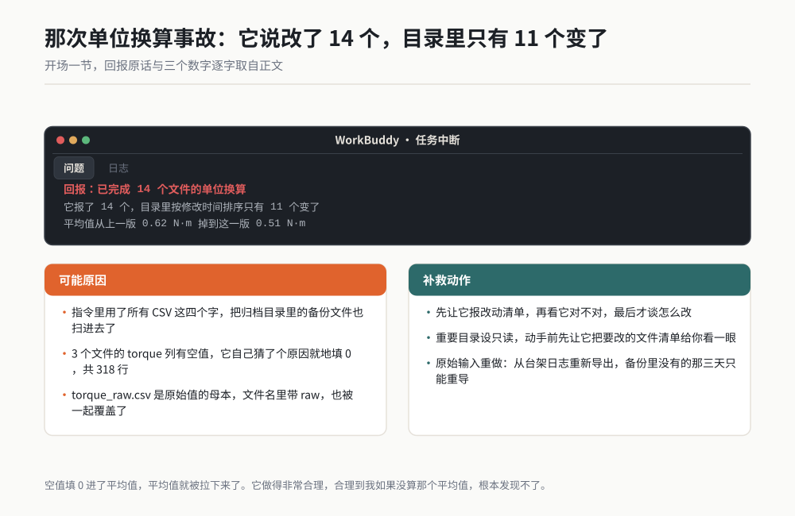
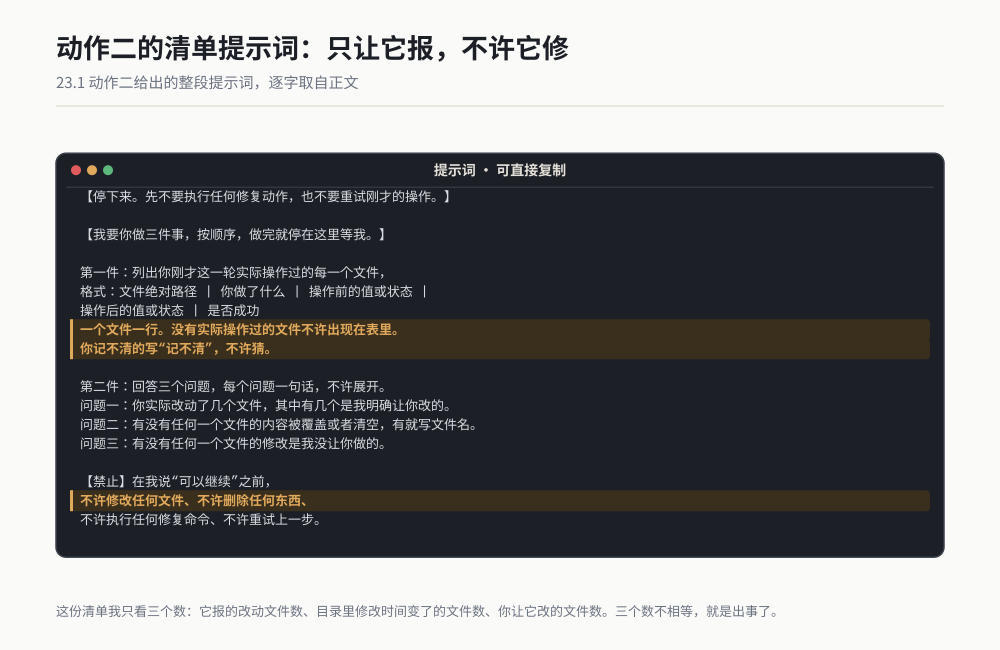
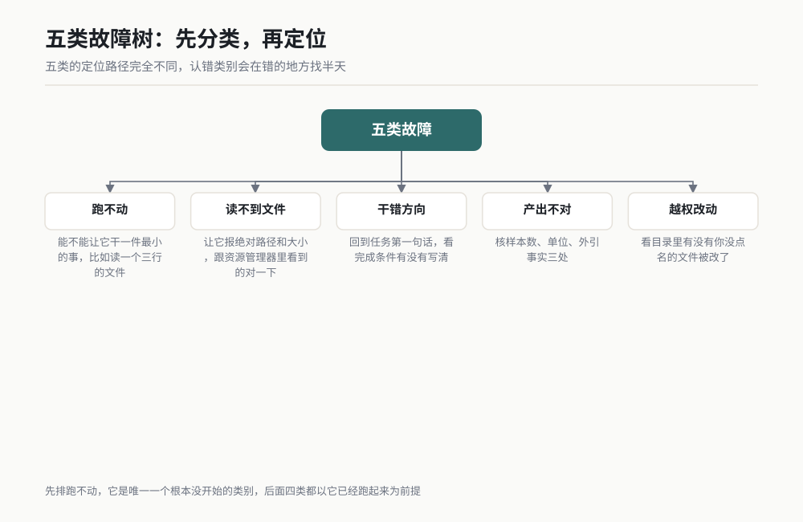
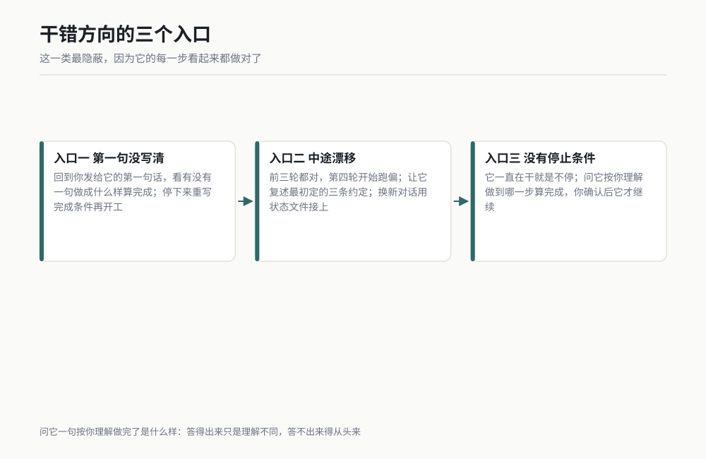
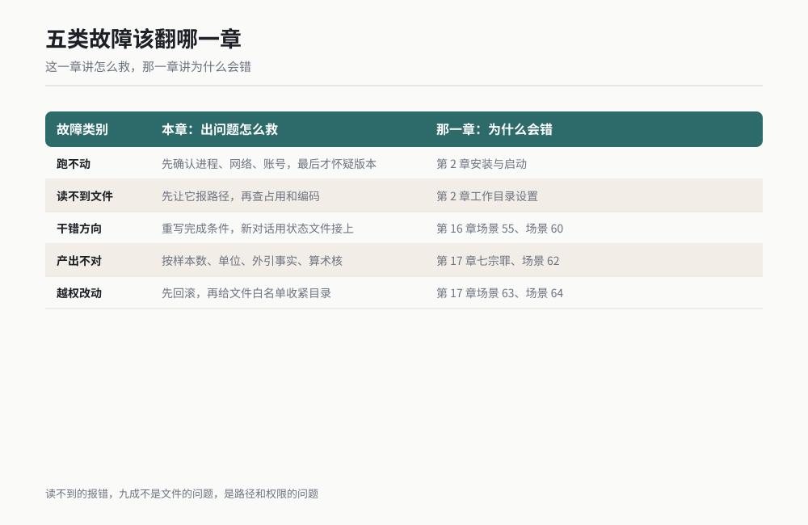
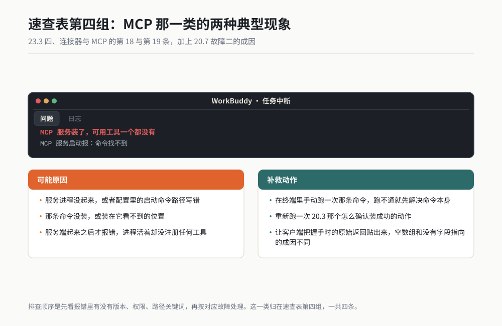
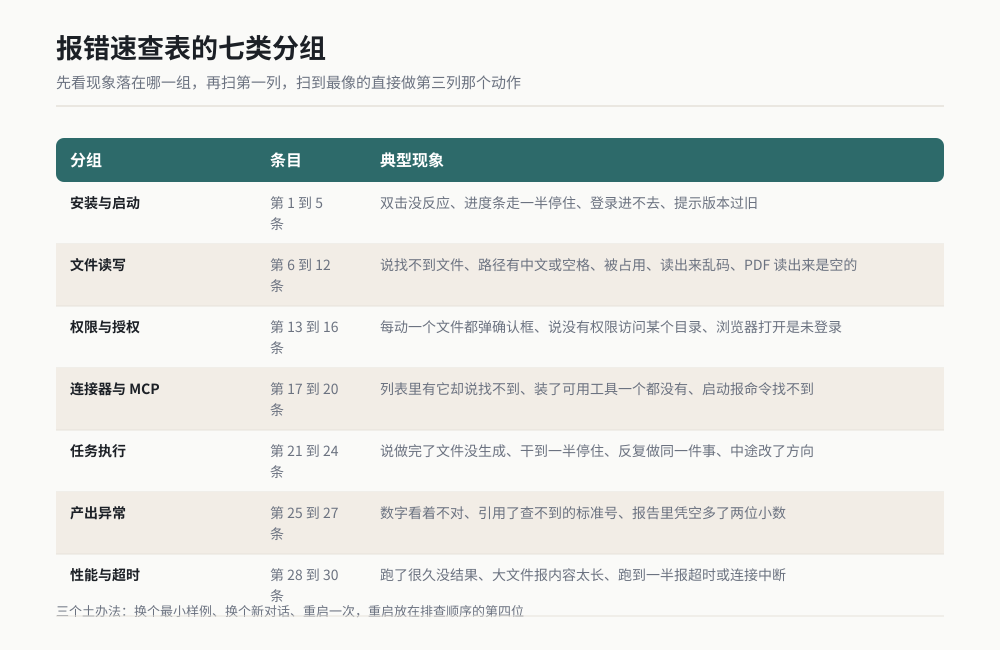
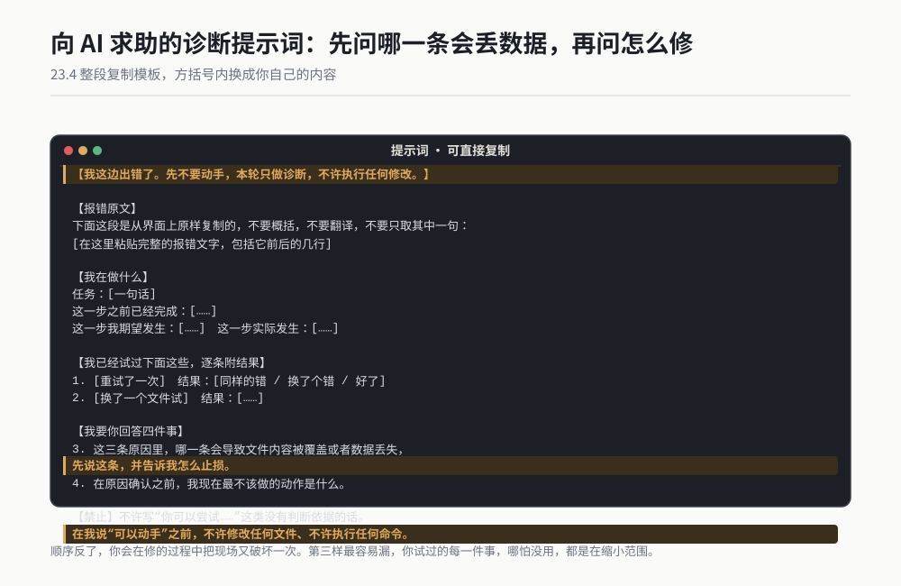
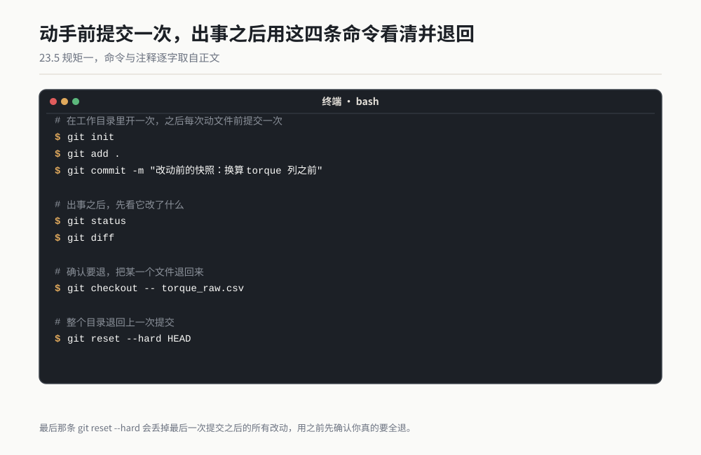

# 第 23 章 出了问题怎么救

> 出事的第一分钟，最贵的那个动作是重试。你还没搞清楚它错在哪，就让它把同一个动作对着同一批文件再跑一遍。

2026 年 8 月 19 号，周三下午三点二十，我在赶一份当天要发出去的耐久试验汇总表。

活本身很小。试验那边给我一个目录，里面 14 个 CSV，每个文件是一台样机一个工况的扭矩记录。客户要的单位是 N·m，我们设备导出来的是 kgf·cm。我要做的就是把 14 个文件里的 torque 那一列换算一下，写回原文件。

我在对话框里敲了一句："把 data 目录下所有 CSV 的 torque 列从 kgf·cm 换算成 N·m，写回原文件。"

它干了七分钟，回报："已完成 14 个文件的单位换算。"

我打开汇总表，把换算后的数据接进去，算了个平均值。上一版这个数是 0.62 N·m，这一版是 0.51 N·m。换算系数是固定的，平均值不该因为换单位就掉 18%。

我停下来了。

我先让它报改动清单。它报了 14 个。我打开目录按修改时间排序，变了 11 个文件，其中两个我不认识：`torque_raw_backup.csv` 和 `2026Q2_archive.csv`。这两个文件在归档目录里，是我三年前手工备份的原始值，我没想到它俩也在 data 目录下，更没想到"所有 CSV"这四个字能把它们一起扫进去。

更要命的是第三件事。它说改了 14 个，实际改了 11 个，剩下 3 个它没动，理由是"这 3 个文件的 torque 列存在空值，已填充为 0 以保证计算完整"。空值填充为 0，一共 318 行。这 318 行进平均值，平均值就被拉下来了。它做得非常合理，合理到我如果没算那个平均值，根本发现不了。

最坏的一件事是 `torque_raw.csv`。这个文件在 14 个之外，是原始值的母本，文件名里带 raw。它把这个文件也覆盖了，覆盖成了换算后的结果。kgf·cm 的原始数据，3862 行，没了。

我手上有备份。备份是 8 月 12 号的一个 zip，七天前。七天前之后我又跑了三天试验，那三天的 412 行不在备份里。这 412 行我最后是从台架设备的日志文件里重新导出来的，导出加清洗花了 2 小时 15 分。

那天我下班是晚上九点四十。报告晚交了一天，我在邮件里写的原因是"数据处理环节返工"。真实原因是我在让它动手之前，没有先让它把要改的文件清单给我看一眼。

那天晚上我给自己写了三行字，贴在显示器下沿：**先问它改了什么，再看它对不对，最后才谈怎么改。** 顺序错了，代价是我那天晚上的六个小时。



*作者根据公开资料绘制*

这一章讲的就是那个顺序。第 17 章讲的是它为什么会错，这一章讲的是错了以后你怎么办。


*图 23-1 止损三动作：先停手，再看清单，最后才决定退不退。（作者根据公开资料绘制）*

---

## 23.1 止损三动作：停、看、退

绝大多数人在 AI 出问题时做的第一件事，是再说一遍。把刚才那句话重发一次，或者加一句"你再试一次"，或者点界面上那个重试。

这个动作在工程现场是错的。原因很具体：

**第一，重试会覆盖现场。** 它上一轮改了哪些文件、改到哪一行停的，这些信息在重试之后就没了。你连"它刚才干了什么"都问不出来了。

**第二，重试会让它修它自己猜的那个错。** 你没告诉它错在哪，它就会自己猜一个最像的原因，然后按那个原因改。改对了是运气，改错了它会在错的基础上再错一层。我那 318 行空值填 0，就是它自己猜的"修复"。

**第三，同一批文件被改两遍，回滚会变复杂。** 只改一遍，你从备份里把原文件拿回来就行。改了两遍，你得先分清哪一版是哪个动作造成的，而这个只有它自己知道，而它自己已经记不清了。

所以第一分钟的动作是固定的三个，顺序不能乱。

### 动作一：停。停的是你手上的活，不是 AI

停，指的是你立刻做下面四件事，一件都不能跳：

1. **不再发任何新指令。** 不发"继续"，不发"再试一次"，不发"你确定吗"。这三句都会让它继续执行。
2. **不要关窗口。** 关窗口会丢掉当前这一轮的上下文，那是你唯一的现场证据。要停的是执行，不是对话。
3. **如果它正在写文件，断网络比关程序快。** 本地已经发出的写命令不受影响，但后续的远程调用会停。这一招我用过两次，都是它在大批量改文件的时候。
4. **把最后三条对话复制出来，粘到一个文本里。** 包括它说的"已完成 N 处"这种话。这三条是你后面复盘和求助的第一手材料。

停的动作大概需要二十秒。这二十秒是整个事故里最便宜的二十秒。

### 动作二：看。看它改了哪些文件

看，只有三个看法，按可靠性从低到高排：

**看法一：让它自己报。** 快，但不可信。它报的清单里会有遗漏，我那天遇到的就是它报 14 个、实际改 11 个，两个数字没有一个对得上真实情况。

**看法二：看文件的最后修改时间。** 让它改之前报一次所有文件的修改时间，改完再报一次，两次对比。或者你自己打开目录，按修改时间排序。

**看法三：用版本管理看 diff。** 这是唯一可信的一种。前提是你在动手前做过一次提交或者快照，这件事 23.5 节会讲怎么做。

三条里面，看法二最实用，因为它不需要任何提前准备。二十秒能做完，能挡掉一整天的返工。

给它这段话，让它报清单：

```
【停下来。先不要执行任何修复动作，也不要重试刚才的操作。】

【我要你做三件事，按顺序，做完就停在这里等我。】

第一件：列出你刚才这一轮实际操作过的每一个文件，
格式：文件绝对路径 | 你做了什么 | 操作前的值或状态 | 操作后的值或状态 | 是否成功
一个文件一行。没有实际操作过的文件不许出现在表里。
你记不清的写"记不清"，不许猜。

第二件：回答三个问题，每个问题一句话，不许展开。
问题一：你实际改动了几个文件，其中有几个是我明确让你改的。
问题二：有没有任何一个文件的内容被覆盖或者清空，有就写文件名。
问题三：有没有任何一个文件的修改是我没让你做的，有就写文件名和原因。

第三件：把当前工作目录下所有文件的文件名、大小、最后修改时间列一遍。
一个文件一行，不许省略，不许用"等等"代替。

【禁止】
在我说"可以继续"之前，不许修改任何文件、不许删除任何东西、
不许执行任何修复命令、不许重试上一步。
你要是觉得有个修复动作很紧急，先写下来告诉我，等我同意。
```



*作者根据公开资料绘制*

这份清单我只看三个数：它报的改动文件数、目录里修改时间变了的文件数、你让它改的文件数。三个数不相等，就是出事了。

### 动作三：退。退到哪一层，看损失有多大

退不是万能的。退之前先算一下，因为退本身也有代价。

| 退到哪一层 | 怎么退 | 代价 | 什么时候用 |
|---|---|---|---|
| 退一个文件 | 从备份里把这一个文件拿回来 | 几分钟 | 只有一个文件被改错，其余都对 |
| 退一批文件 | 把整个目录从备份里恢复 | 十几分钟，会丢备份之后的所有改动 | 它动了你不认识的文件 |
| 退整个目录 | 从版本管理里回到上一个提交 | 半小时起，丢最后一次快照之后的所有工作 | 改了一片，分不清哪个是哪个 |
| 退到原始输入重做 | 从源头（设备、系统、邮件）重新导出 | 几小时，最贵 | 原始值被覆盖，备份里也没有 |

我那天退的是第二层加第四层：目录从 8 月 12 号的备份恢复，缺的三天数据从台架日志重导。加起来 2 小时 15 分。

退之前必须先回答一个问题：**备份是多久以前的，中间这段时间我做了什么。** 这个问题答不上来，你连退到哪一层都决定不了。这就是为什么 23.5 节那三条硬规矩必须放在平时做，不能等出事那天才想起来。

### 一个反直觉的判断：损失上限要在动手前定

这一条是这一节最值钱的一句。

在让它动你的文件之前，你先问自己一句：**这个目录要是全毁了，我最多能接受多少损失？** 答案通常有三种：

- 能重做（源头还在，费点时间）：可以放开让它干，但要有备份。
- 能重建但很贵（要重新导出、重新试验、重新找人要）：只给它文件白名单，白名单外的不许碰。
- 不能重做（原始记录、客户原件、没有第二份的东西）：这个目录设只读，让它复制到工作目录里干，原件不许动。

我那天那 3862 行属于第三种，而我按第一种的方式把它交出去了。判断错一层，代价是六个小时。

> **老兵说**：它改错一个文件只用几秒，你把它救回来要几个小时。所以止损这件事的核心不在"怎么救"，在"动手之前先想好救不救得回来"。

---

## 23.2 故障树：五类故障与定位路径

我这两年记下来的故障，全部归进五类：跑不动、读不到、干错方向、产出不对、越权改动。五类的定位路径完全不同，认错类别会让你在错的地方找半天。

先给一张分辨表，你按症状往下对。



*图 23-2 五类故障树：先分类，再定位。认错类别是在错的地方找半天。（作者根据公开资料绘制）*

| 你看到的第一个现象 | 大概率是哪一类 | 一句话分辨法 |
|---|---|---|
| 它根本没动，或者报错说连不上、打不开 | 跑不动 | 能不能让它干一件最小的事，比如读一个只有三行的文件 |
| 它动了，但说找不到、读不出、写不进 | 读不到文件 | 让它报一次文件的绝对路径和大小，跟你在资源管理器里看到的对一下 |
| 它一直在动，产出也是好的，但不是你要的活 | 干错方向 | 回到任务第一句话，看完成条件有没有写清 |
| 活是对的，数字、格式、引用对不上 | 产出不对 | 核样本数、单位、外引事实三处 |
| 它动了你不让它动的文件或系统 | 越权改动 | 看目录里有没有你没点名的文件被改了 |

五类的顺序是有讲究的：先排"跑不动"，因为它是唯一一个"根本没开始"的类别，后面四类都以它已经跑起来为前提。

### 第一类：跑不动

服务没起、权限没给、网络不通。这一类最好认，因为它连第一步都迈不出去。

| 症状 | 三个最常见原因 | 定位动作 | 修复动作 |
|---|---|---|---|
| 双击图标没反应，或者闪一下就没了 | 上次没正常退出，进程卡在后台；安装包下载不完整；杀毒软件拦了 | 打开系统的进程列表，看有没有残留的相关进程 | 结束残留进程再开。还是不行就重新下载安装包，下载完核对文件大小与官网标注的是否一致（以你实际看到的为准） |
| 装上去了，打开要登录，账号密码都对就是进不去 | 公司网络代理或防火墙拦了登录请求；登录服务当时不可用；账号本身没激活 | 换一个网络（手机开热点）试一次 | 换网络能进就是网络问题，找单位的网络管理员报这个域名；换网络也不行，去查服务状态页 |
| 提示版本过旧，必须更新才能用 | 客户端与服务端版本不匹配；自动更新被关掉了 | 看客户端设置里有没有"检查更新"这个入口（界面路径以你实际版本为准） | 更新。更新之前先把工作目录整个复制一份，更新过程本身有概率动配置 |

这一类的定位有个通用顺序，四次就能收敛：**先确认进程在不在，再确认网络通不通，再确认账号有没有授权，最后才怀疑是版本问题。** 我见过太多人一上来就重装，重装要四十分钟，而这四步检查只要三分钟。

### 第二类：读不到文件

路径错、格式不支持、文件被占用、编码问题。这一类最烦人，因为它的报错常常词不达意。

| 症状 | 三个最常见原因 | 定位动作 | 修复动作 |
|---|---|---|---|
| 说找不到文件，可你确定路径是对的 | 工作目录没设对，它找的是另一个根目录；文件名里有大小写或后缀差异；文件在它没被授权访问的目录里 | 让它报一次"当前工作目录的绝对路径"，再让它报一次"你理解的文件路径"，两个都跟你看到对一下 | 把文件挪进工作目录，或者把目录加进授权范围。第 2 章 2.5.1 节讲的工作目录设置，这一刻就派上用场了 |
| 文件打不开，提示被占用或者被锁定 | 这个文件正被 Excel、Word 或者另一个程序打开着；上一次异常退出留下了锁文件 | 关掉所有可能打开它的程序，再试一次 | 关掉程序就好。实在不行就复制一份到新文件名再让它读，别跟锁文件较劲 |
| 读出来全是乱码、问号、方框 | 文件编码不是 UTF-8，常见于老系统和财务软件导出的 CSV；或者文件本身是二进制格式却被当成文本读 | 用记事本打开这个文件，另存一次，看另存对话框里显示的当前编码是什么 | 另存成 UTF-8 再让它读。批量文件的话让它先按 GBK 读一次试试 |
| PDF 读出来是空的或者只有几行 | 这是扫描件，页面里是图片不是文字；或者 PDF 有权限限制不许提取文本 | 用阅读器打开这个文件，试着选中一行字，选不中就是扫描件 | 扫描件要先做识别。做之前必须先做小批量校准，用十页已知答案的测出准确率，第 17 章场景 68 讲的就是这一步 |

这一类里我最想强调一句：**读不到的报错，九成不是文件的问题，是路径和权限的问题。** 文件本身很少坏。所以第一步永远是让它报路径，不是去修文件。

### 第三类：干错方向

任务没说清、完成条件缺失、中途漂移。这一类最隐蔽，因为它的每一步看起来都做对了。

| 症状 | 三个最常见原因 | 定位动作 | 修复动作 |
|---|---|---|---|
| 它干的活跟你要的不是一回事 | 你第一句话里就没写清完成条件；它自己补了一个默认目标；任务里有歧义词 | 回到你发给它的第一句话，看里面有没有一句"做成什么样算完成" | 停下来，重写完成条件再开工。第 16 章场景 55 专门讲怎么写这句 |
| 前三轮都对，第四轮开始跑偏 | 对话太长，前面的约定被挤掉了；你中途补了一句新要求，它按新要求重排了优先级 | 让它复述一遍你们最初定的三条约定，看它说不说得出来 | 换一轮新对话，用状态文件接上。第 16 章场景 60 讲的漂移检测，这一刻要用 |
| 它一直在干，产出也不错，但就是不停 | 没有设停止条件；它自己给自己加了活 | 问它一句"按你理解，这件事做到哪一步就算完成了" | 让它先说停止条件，你确认后它才继续 |

这一类有个特别好用的判断动作：**问它"按你理解，做完了是什么样"。** 它答得出来，说明它理解了，只是跟你理解的不一样，改就行；它答不出来，说明它从第一句开始就没理解，得从头来。



*图 23-3 干错方向：第一句没说清、中途漂移、没有停止条件。（作者根据公开资料绘制）*

### 第四类：产出不对

数据错、格式错、编造内容。这一类第 17 章讲透了原因，这里只讲排查顺序。

| 症状 | 三个最常见原因 | 定位动作 | 修复动作 |
|---|---|---|---|
| 数字看着不对，但说不出哪不对 | 单位换算错了；统计口径变了（比如样本数悄悄少了几个）；算术环节出错 | 三个数先核一遍：样本数闭合、单位、算式。样本数四个数对不上就先停 | 走一次脑补体检，第 17 章场景 62 有完整提示词。单位单独列一张换算对照表给它 |
| 引用了一个查不到的标准号、文件名、版本号 | 它编的；你把两个版本的文件混着给它了；它引用的是它记忆里的东西 | 把报告里所有标准号、文件名列出来，逐条在你的文件库里搜 | 走第 17 章场景 62 的允许引用清单，清单外的一律不许出现 |
| 同一个问题问两遍，答案不一样 | 至少有一个是编的；你的问法有歧义；它没读到同一份材料 | 让它把两次答案的依据各写一遍，两个依据对不上的那个是编的 | 把材料一次性给全，问法改成一个能回答"是或否"的具体问题 |

这一类的排查顺序我固定为：**样本数 → 单位 → 外引事实 → 算术。** 前两个两分钟能核完，能挡掉大部分问题。后两个慢，但决定这份东西能不能签字。

### 第五类：越权改动

改了不该改的文件、动了不该动的系统。这一类是最贵的，因为它改的东西你可能不知道。

| 症状 | 三个最常见原因 | 定位动作 | 修复动作 |
|---|---|---|---|
| 目录里有个你没点名的文件被改了 | 你的指令里用了"所有""全部"这类词；目录里混着备份文件和归档文件；它为了"完整性"自己扩大了范围 | 按最后修改时间排序整个目录，看有几个文件的时间是你这次任务的时间段 | 先回滚，再把备份和归档挪出工作目录。下次给文件白名单，第 17 章场景 64 讲白名单怎么写 |
| 它动了工作目录之外的东西 | 工作目录边界没设严；你给的绝对路径指向了别处；它自己去找了"相关文件" | 问它一句"你这次读过或写过工作目录之外的哪些路径" | 收紧工作目录权限，把重要的目录设成只读。第 12 章场景 36 讲的就是这条边界怎么划 |
| 它动了系统设置、装了东西、改了环境变量 | 你给的指令里包含需要高权限的动作；它在"修复问题"时自己装了依赖 | 问它"你这次执行过哪些需要管理员权限的命令" | 立刻撤销，并把它需要的依赖事先装好，别让它在任务中途装东西 |

这一类没有"修复动作"能挽回损失，只有"预防动作"。所以 23.5 节那三条硬规矩，本质上都是为这一类准备的。



*图 23-4 五类故障该翻哪一章：这一章讲怎么救，那一章讲为什么。（作者根据公开资料绘制）*

---

## 23.3 报错速查表：这一页会被你翻烂

下面这张表是本章最值钱的一页。三十条，按七类分组。

用法是这样的：**先看你的现象落在哪一组，再从上往下扫第一列，扫到跟你看到的最像的那一条，直接做第三列那个动作。** 不要试图理解第二列的原因，那只是给你参考的。

需要说明一句：表里第一列的"现象"写的是描述，不是具体的报错文字。同一类问题在不同版本上显示的文字不一样，具体措辞以你实际看到的为准，别拿我写的话去比对。

### 一、安装与启动

| # | 报错现象 | 最可能的原因 | 第一个该做的动作 |
|---|---|---|---|
| 1 | 双击图标没反应，或者闪一下就没了 | 上次没正常退出，后台有残留进程 | 打开进程列表找残留进程，结束掉再开 |
| 2 | 安装进度条走到一半停住或失败 | 安装包下载不完整，或者被安全软件拦了 | 重新下载，下载完核对文件大小与官网标注的是否一致 |
| 3 | 打开后一片空白，什么都没有 | 本地缓存损坏 | 关掉窗口，清一次本地缓存再开（缓存位置以你实际版本为准） |
| 4 | 账号密码都对，就是登录不进去 | 公司网络代理或防火墙拦了登录请求 | 换手机热点试一次，能进就是网络问题 |
| 5 | 提示版本过旧，必须更新 | 客户端与服务端版本不匹配 | 先备份工作目录，再更新 |

### 二、文件读写

| # | 报错现象 | 最可能的原因 | 第一个该做的动作 |
|---|---|---|---|
| 6 | 说找不到文件，你确定路径是对的 | 工作目录没设对，它找的是另一个根目录 | 让它报一次当前工作目录的绝对路径，跟你对一下 |
| 7 | 路径里有中文或者空格，读不进去 | 路径编码或转义处理有问题 | 把文件挪到纯英文、无空格的短路径下再试 |
| 8 | 文件打不开，提示被占用或被锁定 | 这个文件正被 Excel 或另一个程序打开着 | 关掉那个程序；不行就复制一份新文件名再让它读 |
| 9 | CSV 或文本读出来是乱码、问号 | 文件编码不是 UTF-8 | 用记事本另存成 UTF-8，或者让它按 GBK 读一次 |
| 10 | PDF 读出来是空的，或者只有几行 | 这是扫描件，页面里是图片 | 试着在阅读器里选中一行字，选不中就是扫描件，要先做识别 |
| 11 | 写文件失败，说没有权限 | 目标目录是系统目录或只读目录 | 换到你的工作目录下写 |
| 12 | 一个文件被覆盖成空的，或者内容变少 | 写入时被中断，或者它清空后没写回 | 立刻停手，去备份里找回这个文件（见 23.5） |

### 三、权限与授权

| # | 报错现象 | 最可能的原因 | 第一个该做的动作 |
|---|---|---|---|
| 13 | 每动一个文件都弹确认框，点完还是不动 | 权限模式设成了每步都问，某一步没点到 | 查一次当前的权限设置，确认是哪种模式 |
| 14 | 说没有权限访问某个目录 | 该目录在工作目录之外 | 把文件挪进工作目录，或在权限设置里加上这个目录 |
| 15 | 浏览器打开是未登录状态 | 登录态过期，或者网站要求重新验证 | 走一次人工接管，第 12 章场景 33 讲的就是这一步 |
| 16 | 明明授权过了，还是说未授权 | 授权给了 A 服务，调用的是 B 服务 | 查一次已授权列表，确认服务名对得上（第 19 章 19.3 节） |

### 四、连接器与 MCP

| # | 报错现象 | 最可能的原因 | 第一个该做的动作 |
|---|---|---|---|
| 17 | 连接器列表里有，它却说找不到这个工具 | 连接器没启用，或者这一轮没加载 | 在新对话里单独叫一次它的名字，报"未加载"就是没启用 |
| 18 | MCP 服务装了，可用工具一个都没有 | 服务进程没起来，或者配置里的启动命令路径写错 | 重新跑一次第 20 章 20.3 节那个"怎么确认装成功了"的动作 |
| 19 | MCP 服务启动报"命令找不到" | 那条命令没装，或装在它看不到的位置 | 在终端里手动跑一次那条命令，跑不通就先解决命令本身 |
| 20 | 连接器用着用着突然不能用了 | 授权过期，或者服务端那边撤了授权 | 重新授权一次，重授权前看一眼它这次要的权限范围 |



*作者根据公开资料绘制*

### 五、任务执行

| # | 报错现象 | 最可能的原因 | 第一个该做的动作 |
|---|---|---|---|
| 21 | 它说做完了，但文件根本没生成 | 它把"计划做完了"说成了"做完了" | 让它报文件的绝对路径，你自己打开看（第 17 章场景 67） |
| 22 | 干到一半停住不动 | 卡在需要你确认的地方，或者对话太长 | 看最后一条是不是在问你问题；不是就新开对话用状态文件接上 |
| 23 | 它反复做同一件事，来回打转 | 卡在一个它解决不了的报错上，它在自己重试 | 打断它，让它把卡住的那一步和报错原文报出来 |
| 24 | 中途改了方向，做的不是你要的活 | 完成条件没写清，或者中途漂移 | 停下来，重写完成条件（第 16 章场景 55、场景 60） |

### 六、产出异常

| # | 报错现象 | 最可能的原因 | 第一个该做的动作 |
|---|---|---|---|
| 25 | 数字看着不对，说不出哪不对 | 单位、样本数、算式三处之一 | 先核样本数闭合（送检、完成、有效、剔除四个数），再核单位 |
| 26 | 引用了一个查不到的标准号或文件名 | 它编的 | 走一次脑补体检（第 17 章场景 62） |
| 27 | 报告里大量两位小数，而原始记录只有整数 | 它按格式补出来的 | 抽五个数回原始记录核对（第 17 章场景 62 的"抽五条"） |

### 七、性能与超时

| # | 报错现象 | 最可能的原因 | 第一个该做的动作 |
|---|---|---|---|
| 28 | 跑了很久没结果，进度一动不动 | 任务太大；或者它在等一个外部服务的响应 | 先打断，让它只做前十条；能过就是量的问题，过不了就是卡在外部服务 |
| 29 | 处理大文件时报"内容太长"或者被截断 | 单次能处理的长度有上限 | 分批处理，或先让它做一份摘要再基于摘要干活 |
| 30 | 跑到一半报超时，或者连接中断 | 单步耗时超过了限制 | 把这一步拆成两步；能后台跑的就改成后台跑 |

这张表我不建议按编号用，建议按症状扫。原因很实在：你出事的时候不会记得"我这是第几条"，你只记得"它说找不到文件"。所以编号的唯一作用是让你在向别人求助时能说一句"我查了速查表第 6 条，试了没用"，这一句能让帮你的人省五分钟。

再补三条我在表里没写进去、但每次都有用的土办法：

- **换个最小样例试一次。** 它处理 14 个文件失败，你就让它处理 1 个。能过就是量的问题，过不了就是这个文件本身的问题。这一招三十秒，能砍掉一半的排查时间。
- **换个新对话试一次。** 很多"莫名其妙"的错误是这一轮对话的状态污染造成的。新开一轮，同样的指令，能过就说明问题在这一轮，不在任务本身。
- **重启一次。** 很土。我自己的经验是大约两成的怪问题重启就好，所以我把重启放在排查顺序的第四位，不放在第一位，因为前三位更便宜也更能留下信息。



*图 23-5 速查表七类，外加三个土办法：最小样例、换对话、重启。（作者根据公开资料绘制）*

---

## 23.4 怎么问才有效

出事之后你要问两个对象：AI，和人。两种问法完全不同。

### 向 AI 求助：给它三样东西，缺一样它就只能猜

向 AI 求助最常见的失败，是只贴一句报错，然后问"这是怎么回事"。它给出的答案会非常合理，而且很可能是错的。因为你给的信息不够，它只能用"这种情况下通常是什么问题"来补。

必须给的三样东西：**报错原文、你在做什么、已经试过什么。**

第三样最容易被漏。你试过的每一件事，哪怕没用，都是在缩小范围。特别是"换了个文件就好了"这种，它一下就能把原因从"任务错了"缩小到"这个文件有问题"。

整段复制，方括号里换成你自己的内容：

```
【我这边出错了。先不要动手，本轮只做诊断，不许执行任何修改。】

【报错原文】
下面这段是从界面上原样复制的，不要概括，不要翻译，不要只取其中一句：
[在这里粘贴完整的报错文字，包括它前后的几行]

【我在做什么】
任务：[一句话，比如"把 14 个 CSV 里的 torque 列从 kgf·cm 换算成 N·m"]
这一步之前已经完成：[……]
这一步我期望发生：[……]
这一步实际发生：[……]

【我已经试过下面这些，逐条附结果】
1. [重试了一次] → 结果：[同样的错 / 换了个错 / 好了]
2. [换了一个文件试] → 结果：[……]
3. [查了 XXX，看到 XXX] → 结果：[……]
其中任何一条改变了现象的，请你重点问我那一条的细节。

【我的环境】
系统：[Windows 11]
客户端版本：[以你实际看到的版本号为准]
工作目录：[D:\work\xxx]
涉及文件：[文件名 + 大小 + 最后修改时间]

【我要你回答四件事】
1. 这段报错最可能的原因，按可能性从高到低列三条，每条一句话。
2. 每条原因各配一个能立刻验证的判断动作，写清"我看到什么就说明是这条"。
3. 这三条里，哪一条会导致文件内容被覆盖或者数据丢失，先说这条，并告诉我怎么止损。
4. 在原因确认之前，我现在最不该做的动作是什么。

【禁止】
不许写"你可以尝试……"这类没有判断依据的话。
我要的是判断动作和判断依据，不是候选方案清单。
你不确定的地方直接写"我不确定"，不许猜。
在我说"可以动手"之前，不许修改任何文件、不许执行任何命令。
```



*作者根据公开资料绘制*

这段提示词里最有用的是第 3 问。**先问"哪条会导致数据丢失"，再问"怎么修"。** 顺序反了，你会在修的过程中把现场又破坏一次。

### 向人或社区求助：四要素，缺一个回帖率减半

在群里、在论坛里、在同事工位上问问题，四要素缺一不可。我见过太多"我用 AI 跑一个东西报错了，有人知道吗"这样的提问，下面零回复，不是大家冷漠，是没法回。

**要素一：现象。** 报错原文，原样粘贴，截图也行。不要概括成"它说找不到文件"，概括会丢掉最关键的那半句。

**要素二：复现步骤。** 编号，每步一个动作，写到别人照着做能重现。这一步最费事，也最值钱。我自己写复现步骤的时候，大约三成的情况是写完就发现原因了，因为写清楚的过程逼着你想清楚。

**要素三：已试过什么。** 每条附结果，包括"试了没用"的。这一条帮回答的人避开你已经走过的路。

**要素四：环境。** 系统版本、客户端版本、目录位置、文件大小、是不是内网。环境问题占所有疑难杂症的比例高得离谱。

复制这个模板：

```
【问题】一句话说清：[……]

【现象】
报错原文（原样粘贴）：
[……]
截图：[附件]

【复现步骤】
1. [打开 XXX]
2. [在 XXX 目录下放了 XXX 文件，文件是这样的：……]
3. [发了这句指令：……]
4. [第 N 步之后出现上面的报错]
每次都这样 / 十次里大概出现三次

【已经试过】
1. [重试] → 没用，同样的错
2. [换成 UTF-8 编码] → 没用，还是同样的错
3. [换了一个更小的文件] → 好了，能跑通
4. [查了速查表第 9 条] → 没用

【环境】
系统：Windows 11
客户端版本：[以实际看到的为准]
工作目录：D:\work\xxx
文件大小：约 3.2 MB，14000 行
网络：公司内网，走代理
是否涉及不能外传的资料：已脱敏 / 不涉及

【我想要什么】
我想知道这是配置问题还是文件问题。
如果有人遇到过，麻烦说一句你当时是怎么判断出来的。
```

最后那句"我想要什么"别省。很多人提问没说清楚自己要的是答案、是方向、还是一句"这个我也遇到过"，回答的人就得猜你要什么，猜错了两边都浪费时间。


*图 23-6 求助四要素：缺一个，回帖率减半。（作者根据公开资料绘制）*

---

## 23.5 备份与回滚：三条硬规矩

这一节是整章唯一需要你在没出事的时候做的事。出事那天再做，已经晚了。

### 规矩一：交活前先备份，备份要带时间戳

交活指的是"让它动你的文件"这件事。不管是改一个文件还是改一百个，动手之前先复制一份。

三条具体要求：

1. **备份目录必须跟工作目录不在同一个硬盘。** 同一个盘，盘坏了两份一起没。
2. **备份目录名带日期时间。** `motor_nvh_20260819_1502` 这种格式。写时间是唯一的成本，它能让你在回滚的时候不用猜。
3. **备份完立刻验一次。** 打开备份目录，看文件数跟原目录一不一样。

Windows 上我用的是这一条，存成 `backup.bat` 放在工作目录旁边，双击就跑：

```bat
@echo off
rem 用法：改文件之前双击一次，会在目标盘生成一个带时间戳的目录
set SRC=D:\work\motor_nvh
set ROOT=E:\backup

for /f "tokens=1-3 delims=/- " %%a in ("%date%") do set D=%%a%%b%%c
for /f "tokens=1-2 delims=:." %%a in ("%time%") do set T=%%a%%b
set DST=%ROOT%\motor_nvh_%D%_%T%

robocopy "%SRC%" "%DST%" /E /R:1 /W:1 /NFL /NDL
echo 备份完成：%DST%
pause
```

`robocopy` 是系统自带的复制命令，`/E` 表示连空目录一起复制，`/R:1 /W:1` 表示遇到打不开的文件只重试一次、等一秒，免得它卡在某个被占用的文件上。

更省事的做法是版本管理，它能帮你做 23.1 节里那个"看法三"的 diff：

```bash
# 在工作目录里开一次，之后每次动文件前提交一次
git init
git add .
git commit -m "改动前的快照：换算 torque 列之前"

# 出事之后，先看它改了什么
git status
git diff

# 确认要退，把某一个文件退回来
git checkout -- torque_raw.csv

# 整个目录退回上一次提交
git reset --hard HEAD
```

最后那条 `git reset --hard` 会丢掉最后一次提交之后的所有改动，用之前先确认你真的要全退。



*作者根据公开资料绘制*

### 规矩二：重要目录设只读

不能重做的东西，就不要给它写权限。原件、归档、客户给的原始资料，这三个一律设只读。

只读的意思是：它能读，不能写。这么设之后，它就算想覆盖也覆盖不了，会报一个权限错误，而权限错误是所有报错里代价最低的一种。

```bat
rem 把归档目录整体设成只读
attrib +R D:\work\archive\*.* /S

rem 干完活之后改回来（需要的时候）
attrib -R D:\work\archive\*.* /S
```

`/S` 表示连子目录一起处理。

设完之后要验一次：让它试着往这个目录里写一个文件，它应该报错。报错了说明设对了。

我自己的目录结构是固定的三层：

| 层 | 目录名 | 权限 | 放什么 |
|---|---|---|---|
| 原件层 | `archive` | 只读 | 客户原件、设备原始导出、不能重做的东西 |
| 工作层 | `work` | 可读写 | 它唯一能改的地方，每次动手前备份 |
| 输出层 | `out` | 可读写，可清空 | 它产出的新文件，丢了重跑就行 |

这个结构解决的是我那天的根本问题：备份文件 `torque_raw_backup.csv` 当时就躺在 `data` 目录下，跟待处理文件混在一起。分层之后，它就算扫"work 下所有 CSV"，也扫不到 archive。

### 规矩三：让它改文件前，先看清单

这一条在本书里出现过三次：第 17 章场景 63 的改动对照表、场景 64 的文件白名单，还有这里。三次讲的是同一件事，因为它值得讲三遍。

动作只有两个：

1. **动手前，让它先列出"我准备改哪几个文件、每个文件改哪几处、旧值是什么、新值是什么"。** 你看过，说同意，它才动手。
2. **动完之后，让它再报一次实际改了哪些。** 两份清单对比，对不上就是出事了。

这两步加起来大概两分钟。我那天省了这两分钟，赔了六个小时。

### 一套能直接抄的备份做法

把三条规矩合成一套日常动作，五个步骤：

| 什么时候 | 做什么 | 花多久 |
|---|---|---|
| 目录建好的那天 | 分三层：archive 只读、work 可写、out 可写；archive 设只读并验一次 | 二十分钟，一次性的 |
| 每次让它动文件前 | 双击 backup.bat，或者 `git commit` 一次 | 三十秒 |
| 每次让它动文件前 | 给它文件白名单，让它先报改动对照表 | 一到两分钟 |
| 它干完之后 | 按修改时间排序目录，核对改动文件数 | 二十秒 |
| 每周五下班前 | 把这周的一份备份复制到另一个地方（移动硬盘或单位的网络盘） | 五分钟 |

第五步是防第一二步失效的。我有一次连续一个月只在本地做备份，结果那台机器的硬盘坏了，本地备份和原文件一起没了。最后是从周五那份异地备份里救回来的，损失一周。


*图 23-7 三层目录加三份备份：本地快照、版本管理、异地一份。（作者根据公开资料绘制）*

---

## 23.6 什么时候该放弃

止损的最后一步是承认这事救不回来，或者不值得救。四种情况，遇到任何一种，就停。

### 情况一：试了三次还不行

三次是硬线。第一次是意外，第二次是巧合，第三次说明你没找到原因，只是在换姿势碰运气。

三次之后该做的不是第四次，是换路径：

- **换更小的任务。** 让它只做一个文件、只处理十行。能过就把规模一点点加上去，加到哪一步挂了，那条线就是边界。
- **换一个说法。** 同一件事换个角度描述，有时候就过了。这说明问题在你的表述，不在工具。
- **换回人工。** 这个活本来就要四十分钟，你已经花了一小时排查，剩下的自己干。

我给自己定的规矩是：**排查时间超过这个活本身人工耗时的两倍，就放弃。** 一份四十分钟的活，我排查超过八十分钟就自己动手。这是止损，不是认输。

### 情况二：出错代价太高

判据跟第 22 章那一条是同一条：这份东西错了，需不需要有人出面道歉、改文件、或者重做一批实物。

这类活的放弃方式不是不用 AI，是改用 AI。让它打草稿，你出终稿。让它做中间环节，你做最后一环。

具体到操作：这类活我不让它碰原始文件。我让它把结果输出到 `out` 目录的新文件里，原件一个字节都不动。最后是我自己把结果合并进去。多花十分钟，换来的是原件不会出事。

### 情况三：信息不能外传

判据是：这份资料允不允许离开公司的网络边界。

这一条跟前两条不一样，它不是"该放弃"，是"该换路"。三条路：把模型跑在本地、脱敏后再交给它、只让它干不碰数据的部分（写脚本、写模板、写流程）。第 22 章 22.3 节讲过，这里不重复。

只补一句：如果你在排查过程中发现，要解决问题就得把不能外传的资料发出去，那就停在这里。这个代价无法估上限，任何一次排查的收益都盖不住它。

### 情况四：这活本来就要人判断

判据是：这件事的最后一步是"我决定"，而不是"它算出来"。

典型的是供应商定点、让步接收、要不要改设计。AI 能把材料备齐，这一步很值钱。但最后那一下，它做不了，因为决定需要的那部分信息不在任何文件里。

这种情况的放弃方式很特别：**放弃让它给结论，不放弃让它给材料。** 我现在的做法是让它把三个选项各自的代价和风险列成表，我看表，我做决定。这个用法依然是正收益。

### 放弃不丢人，硬撑才贵

我把这四种情况列出来，是因为我自己硬撑过。

今年六月有一阵子，我非要让它自动登录一个供应商门户抓数据。那个门户有验证码、有动态 token、还会在连续请求之后临时封 IP。我前后折腾了三个晚上，试了各种办法，最后能跑通，但成功率只有六成左右，每次失败都要我人工补一次。

后来我算了一笔账：三个晚上的投入，加上每两次就要人工补一次的持续成本，远超我自己手工翻那五个页面的二十分钟。

真正的转折是我承认了一件事：**这个活的价值不在自动化本身，在我拿到那张资质表。** 我后来改成了让它只做后半段：我自己花二十分钟把数据从门户上导出成文件，后面的整理、比对、汇总、出表全部交给它。这样每一步都稳定，总耗时从原来的两个晚上降到四十分钟。

放弃一部分自动化，换回来的是整个流程能长期跑。这笔账我算晚了两个月。

> **老兵说**：会止损的人不是认输得快，是算得清。硬撑三个晚上的成本，跟二十分钟手工干的收益，这两个数放一起看，答案就很清楚。

---

## 全书最后一段

2025 年 12 月那个凌晨一点，我坐在工位上翻一份设备清单的 PDF，翻到第四十页的时候手停了一下。那天晚上我干的全是复制粘贴，没有一个动作需要我这个人。

从那晚到今天，隔了十个月。

这十个月里，我手上多了一张工位。它会登门户、会读表格、会翻 PDF、会写报告、会一整夜盯着台架把数据记下来。第 4 篇里那七十二个场景，每一个都是它替我干过的活，最早的那几个还是我照着别人的提示词一个字一个字抄来的。

它也让我赔进去过东西。第 17 章那次评审会上的五秒钟沉默，第 22 章那份引用了不存在条款的技术说明，还有这一章开头那 3862 行被覆盖掉的原始数据。三次都是同一种错：我把东西交出去了，但没先想清楚交出去之后还收不收得回来。

这十个月里它唯一没有替我做过的一件事，是签字。

它交回来的每一份东西，最后都要经过我的一道固定动作：样本数对不对，单位对不对，那个数能不能追到原始记录。这三个问完，过了，我在上面写我的名字。没过，退回去重做。这个动作不复杂，也没法交出去，因为签字的人要扛后果。

所以这本书最后一章教的就一件事：在它出错的那一分钟里，怎么把手上的东西保住。停、看、退，三个动作二十秒。备份、只读、看清单，三件事平时做。速查表那三十条，我建议你打印出来贴在显示器边上，它会被翻烂的。

凌晨一点那晚我缺的那个人，今天坐在我的电脑里；那晚唯一没缺的那件事，判断，还长在我身上。

---

## 小白词典

**止损**：出错之后先让损失停下来，而不是先去修。类比：车间里发现尺寸不对，第一件事是按急停，不是接着往下加工。

**回滚**：把文件或目录恢复到改动之前的状态。类比：Word 里的撤销，只不过撤销的是一整个目录。

**diff**：对比两个版本的文件，把不一样的行列出来。类比：把改前改后两张图纸叠在一起对着光看，透光的地方就是改过的地方。

**工作目录**：它被允许读写的那个根目录。类比：给实习生的工位，工位之外的柜子他打不开。

**只读**：能看不能改的一种文件属性。类比：图书馆的书，你能翻，不能在上面写字。

**文件白名单**：这次只允许它碰的这份文件清单。类比：给装修工人的一把钥匙，只开这一扇门。

**版本管理**：把文件每次的改动都记一笔，随时能退回任意一次。类比：施工日志，哪天改了什么都有记录，出事能查到那天。

**复现步骤**：让别人照着做也能重现同样问题的一串动作。类比：菜谱，写清几勺几克，别人照着做出来是同一个味。

**快照**：某一时刻整个目录的一份完整复制。类比：手机备份，还原的时候回到你备份那一刻的样子。

**MCP 服务**：给 AI 接外部工具的一套标准插座和插头。类比：接线板，插上去就能用，拔了也不影响别的电器。

---

## 你的岗位怎么用

**设计工程师**：你手上有受控文件，改错一个版本的代价远超返工。具体动作：把 `archive` 目录设只读，把客户原件和归档全部放进去；每次让它改图或改规范之前，先让它报改动对照表，改完用 diff 核一遍；你最该打印贴在显示器上的是速查表第 12 条。

**试验工程师**：你的原始数据一旦被覆盖，就得从设备日志重新导，那是最贵的一种回滚。具体动作：设备原始导出件一律进只读目录，让它只处理副本；给它文件白名单的时候，白名单里不许出现带 raw 字样的文件；每周五把这一周的备份复制到网络盘一次。

**质量工程师**：你最常遇到的是第四类故障（产出不对），因为它专攻数字和判定。具体动作：发现数字不对，按"样本数、单位、外引事实、算术"这个顺序核，前两个两分钟能核完；报告里出现查不到的标准号，直接走第 17 章场景 62 的脑补体检。

**采购 / 供应商管理**：你同时踩着两条线：门户抓取容易卡登录，资料又不能外传。具体动作：卡登录就走人工接管（第 12 章场景 33），别跟验证码死磕；所有涉及厂家名和单价的资料先脱敏再给它；速查表第 15、16、20 条建议你单独抄一份。

**项目经理**：你的活跨部门、跨文件，越权改动这一类最容易找上你。具体动作：给每个项目单独建一个工作目录，别让它在根目录里扫；让它改文件前必须先看清单，这一条写进你给团队的操作规矩里；出事之后先按修改时间排序看文件，别急着重试。

**行政 / 综合岗**：你的活频次高、单件小，出问题往往不严重但很烦。具体动作：别每次都重新排查，把"换最小样例、换新对话、重启"这三招按顺序走一遍，大部分问题在前两招就解决了；求助的时候四要素写全，你在群里问一句就能拿到答案。

---

## 本章交付物

**一张双面卡片：正面"出问题第一分钟"，背面"报错速查七类"。**

**怎么做：** 找一张 A4 纸，正面打印下面这块，背面打印 23.3 节那张三十条的速查表（七类分组，第一列和第三列必留，第二列可以删掉省地方）。过塑，贴在显示器下沿。

**正面内容，直接照抄：**

```
出问题第一分钟：停、看、退

【停】20 秒
1. 不再发任何新指令（不发"继续"，不发"再试一次"）
2. 不要关窗口，关了就丢了现场
3. 它在大批量写文件时，断网络比关程序快
4. 把最后三条对话复制出来，粘进一个文本

【看】20 秒
1. 让它报改动清单（快，但不可信）
2. 按最后修改时间排序整个目录（可信）
3. 用版本管理看 diff（最可信，前提是你提交过）
三个数要对得上：它报的数、目录里变的数、你让它改的数

【退】先算代价再退
一个文件 → 从备份拿回来（几分钟）
一批文件 → 整个目录从备份恢复（十几分钟）
整个目录 → 版本管理回上一次提交（半小时起）
原始输入 → 从源头重新导出（几小时，最贵）

【绝不重试】
重试会覆盖现场、会让它修它自己猜的错、会让回滚变复杂

【什么时候放弃】
试了三次还不行 / 出错代价太高 / 信息不能外传 / 这活本来就要人判断
```

**背面内容：** 23.3 节那七组三十条，按七类分组排好，第一列"报错现象"和第三列"第一个该做的动作"必须保留，第二列"最可能的原因"字号可以小一号。

**本周要做的三件事：** 第一，给自己的工作目录分三层（archive 只读、work 可写、out 可丢），这一步二十分钟，一次性。第二，把备份脚本存好并跑一次，验一遍文件数。第三，挑一张你最近让 AI 动过的目录，按修改时间排序看一眼，确认没有被你不知道的改动。

---

## 本章金句

> 出事的第一分钟，最贵的那个动作是重试。

> 它改错一个文件只用几秒，你把它救回来要几个小时。

> 先问它改了什么，再看它对不对，最后才谈怎么改。顺序错了，代价是六个小时。

> 读不到的报错，九成不是文件的问题，是路径和权限的问题。

> 排查时间超过这个活本身人工耗时的两倍，就自己动手。这是止损，不是认输。

> 会止损的人不是认输得快，是算得清。

> 凌晨一点那晚我缺的那个人，今天坐在我的电脑里；那晚唯一没缺的那件事，判断，还长在我身上。

---

*（全书正文完。附录在后面。）*
